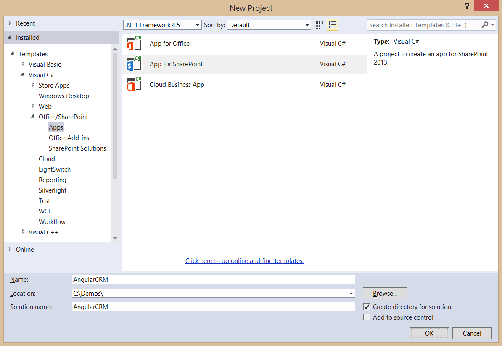
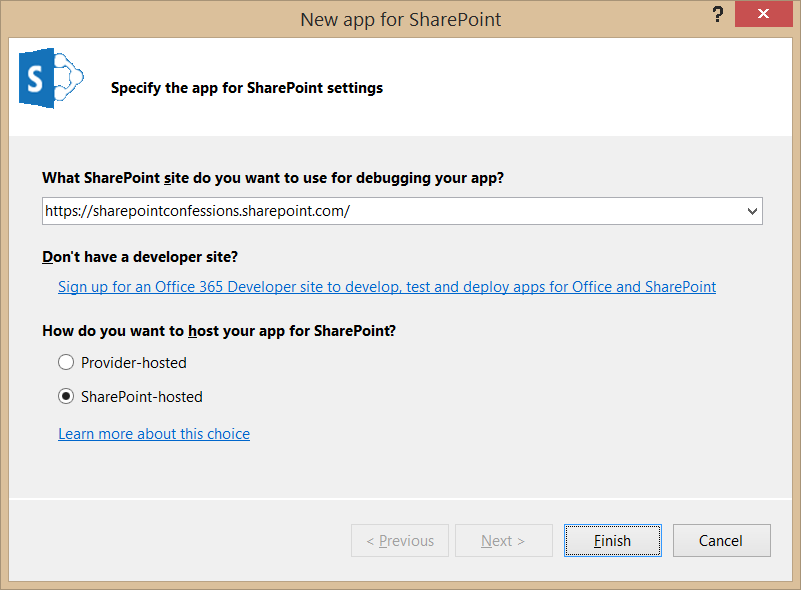

# Creating a SharePoint-hosted App using Bootstrap and AngularJS

In this lab you will get hands-on experience working with Bootstrap and AngularJS by developing a SharePoint-hosted App which plays the role of a customer relationship management system (CRM).

**Prerequisites**: Before you can start this lab, you must have an Office 365 developer site. You must also have Visual Studio 2013 installed with Update 2. If you do not yet have an Office 365 developer site, you should step through the lab exercises for module 7 in which you will sign-up with Microsoft to create a new Office 365 developers site.

## Exercise 1: Configuring a SharePoint-hosted App with Bootstrap and AngularJS
1. Using the browser, navigate to your Office 365 developer site and log on using your credentials. The purpose of this step is to ensure your developer site is accessible before you begin to work with Visual Studio.
2. On your developer workstation, launch Visual Studio as administrator.
3. Create a new project in Visual Studio 2013 by selecting the menu command **File > New > Project**.
4. In the **New Project** dialog, find the **App for SharePoint 2013** project template under the **Templates > Visual C# >   Office / SharePoint > Apps** section. Enter a name of **AngularCRM**, a location of **C:\DevProjects** and a Solution name of **AngularCRM** and then click the **OK** button.  

5. In the **New app for SharePoint** wizard, enter the URL for your Office 365 Developer site and select **SharePoint-hosted** for the app hosting model. When done, complete the wizard by clicking the **Finish** button.  
  
6. Examine the default project setup for a SharePoint-Hosted app. As you can see, it is like a traditional SharePoint solution-based project because you have a Features and Packages node. Note that there are project folders named **Content**, **Images** & **Pages** are actually SharePoint Project Items (SPI) that are Modules and will provision their contents to the respective folders in the app web when the app is installed.  
    
7. Right-click on the **AngularCRM** project in the solution Explorer and select **Manage NuGet Packages** to display the **Manage NuGet Packages** dialog. 
8. First, install the NuGet package for **Bootstrap**.   
     
9. Next, install the NuGet package for **AngularJS Core**.  
     
10. Finally, install the NuGet package for **AngularJS Route**.  
 
11. Close the the **Manage NuGet Packages** dialog.
12. Your app will not be using anything from the **Pages** folder. Therefore, you should delete the **Pages** folder from your project by right-clicking on it in the solution Explorer and selecting the **Delete** command.
13. In the solution Explorer, right-click on the top-level node of the **AngularCRMWeb** project and select the **Add > New Folder** command to create a new top-level folder. Name this folder **App**.
14. Add a new HTML file named **start.html** into the **App** folder.
15. Add a new JavaScript file named **App.js** into the **App** folder.  
 
16. Open **start.html** in an editor windows and modify the head section to match the following code listing.

		<head>
		    <meta charset="utf-8" />
		    <meta http-equiv="X-UA-Compatible" content="IE=10" />
		    <title>Angular CRM</title>
		</head>
17.	Inside the **head** section, add two links to the CSS files in the **Content** folder named **bootstrap.css** and **App.css**.

		<head>
		    <meta charset="utf-8" />
		    <meta http-equiv="X-UA-Compatible" content="IE=10" />
		    <title>Angular CRM</title>
		
		    <link href="../Content/bootstrap.css" rel="stylesheet" />
		    <link href="../Content/App.css" rel="stylesheet" />
		</head>
18.	Add in script links to the JavaScript files in the **scripts** folder for jQuery, as well as **bootstrap.js**, **angular.js** and **angular.route.js**. Also, add a link to the **App.js** file which is located in the **App** folder.

		<head>
		    <meta charset="utf-8" />
		    <meta http-equiv="X-UA-Compatible" content="IE=10" />
		    <title>Angular CRM</title>
		
		    <link href="../Content/bootstrap.css" rel="stylesheet" />
		    <link href="../Content/App.css" rel="stylesheet" />
		
		    
		    
		    
		    
		    
		</head>
19.	Update the **body** element by copying and pasting the following HTML layout which uses predefined Bootstrap styles such as **container**, **container-fluid** and **navbar**.

		<body>
		    

		        

		            

		                

		                    <a class="navbar-brand" href="#">Angular CRM</a>
		                

		                

		                    <ul class="nav navbar-nav">
		                        <li><a href="#">Home</a></li>
		                        <li><a href="#">Add Customer</a></li>
		                        <li><a href="#">About</a></li>
		                    </ul>
		                    <ul class="nav navbar-nav navbar-right">
		                        <li><a id="lnkHostWeb">Back to Host Web</a></li>
		                    </ul>
		                

		            

		        

		    

		
		    

		        

		    

		
		</body>
20. Save and close **start.html**.
21.	Open up **AppManifest.xml** in the designer and update the app's **Start page** setting to point to **start.html**. Also, update the **Title** to something more readable such as **Angular CRM App**.  
 
22. Save and close **AppManifest.xml**.
23. Open **App.js** in an editor window and update its contents to match the following code listing.
		
		'use strict';
		
		angular.element(document).ready( function () {
		    $("#content-box").text("Hello World");
		});
24. It's now time to test the app. Press **{F5}** to begin a new debugging sessions. Once the app has been installed, Visual Studio will start up Internet Explorer and redirect you to the app's start page. You should see the app's navbar and a test message of "Hello World" as shown in the following screenshot.  
 
25.	Your app will need to read query string parameters. Therefore, you will create a simple jQuery extension to add a few helper functions. Begin by creating a new JavaScript file into the **App** folder named **jquery-extensions.js**.  
 
26.	Add the following code to  **jquery-extensions.js** to extend the jQuery library with two helper methods named **getQueryStringValues** and **getQueryStringValue**.
	
		$.extend({
		
		    getQueryStringValues: function () {
		        var vars = [], hash;
		        var hashes = window.location.href.slice(window.location.href.indexOf('?') + 1).split('&');
		        for (var i = 0; i < hashes.length; i++) {
		            hash = hashes[i].split('=');
		            vars.push(hash[0]);
		            vars[hash[0]] = hash[1];
		        }
		        return vars;
		    },
				
			getQueryStringValue: function (name) {
			    return decodeURIComponent($.getQueryStringValues()[name]);
			}
		});

27.	Open **start.html** and add a new script link for named **jquery-extensions.js** right after the script link for the jQuery library.  

		<head>
		    <meta charset="utf-8" />
		    <meta http-equiv="X-UA-Compatible" content="IE=10" />
		    <title>Angular CRM</title>
		    <link href="../Content/bootstrap.css" rel="stylesheet" />
		    <link href="../Content/App.css" rel="stylesheet" />
		    
		
		    
		
		    
		    
		    
		    
		</head>
28. Save and close **start.html**.
29. Open **App.js** and update its contents to match the following code listing.
		
		'use strict';
		
		angular.element(document).ready( function () {
		    var hostWeb = $.getQueryStringValue("SPHostUrl");
		    $("#lnkHostWeb").attr("href", hostWeb);
		});
30.	It's time again to test the app. Press **{F5}** to begin a new debugging sessions. Once the app has been installed, Visual Studio will start up Internet Explorer and redirect you to the app's start page. At this point, you should be able to click the **Back to Host Web** link on the right-hand side of the navbar and successfully navigate back to the host web which you are using for your testing.
31.	Close the Internet explorer to terminate the debugging session and return to Visual studio.
32. The final steps in this exercise will involve adding the **ng-app** directive to the **body** element of **start.html** and adding JavaScript code to properly initialize the app while the Angular framework is loading. Begin by opening **start.html** in an editor window.
33. Locate the opening tag of the **body** element and add the **ng-app** directive with an app name of **AngularCRM**.

		<body ng-app="AngularCRM">
34.	Save your changes to **start.html**.
35.	Open **App.js** and update its contents so it matches the following code listing.

		'use strict';
		
		var crmApp = angular.module("AngularCRM", []);
		
		crmApp.config(function () {		
		    var hostWeb = $.getQueryStringValue("SPHostUrl");
		    $("#lnkHostWeb").attr("href", hostWeb);		
		});
36.	Test the app by pressing **{F5}** to begin a new debugging sessions. Once the app has been installed, Visual Studio will start up Internet Explorer and redirect you to the app's start page. At this point, you should be able to click the **Back to Host Web** link on the right-hand side of the navbar and successfully navigate back to the host web which you are using for your testing. It should work just as it did before, it's just now you are using a more angular-specific way of initializing the app.
37.	Close the Internet explorer to terminate the debugging session and return to Visual studio.
  
## Exercise 2: Working with Views, Controllers and Routing
*In this lab, you will continue working with the AngularCRM project you created in the previous lab exercise. You will extend this project by adding several new views and controllers and configuring the app's routing scheme.*

1. Open the **AngularCRM** project in Visual Studio if it is not already open.
2. Create a new folder named **views** inside the **App** folder.
3. Create five new HTML files inside the **views** folder named **about.html**, **edit.html**, **home.html**, **new.html** and **view.html**.  
 
4. Update the contents of **home.html** to match the following listing and save your changes.

		<h3>Customer List</h3>
5. Update the contents of **new.html** to match the following listing and save your changes.

		<h3>New Customer</h3>
6. Update the contents of **view.html** to match the following listing and save your changes.

		<h3>View Customer</h3>
7. Update the contents of **edit.html** to match the following listing and save your changes.

		<h3>Edit Customer</h3>
8. Update the contents of **about.html** to match the following listing and save your changes.
		
		<h3 ng-bind="title"></h3>		
		

9. Create a new JavaScript file named **controllers.js** in the **App** folder.  
 
10. Copy and paste the following code into **controllers.js** to provide a controller starting point for each of the views.
		
		'use strict';
		
		var app = angular.module('AngularCRM');
		
		app.controller('homeController',
		    function ($scope) {        
		    }
		);
		
		app.controller('newController',
		    function ($scope) {
		    }
		);
		
		app.controller('viewController',
		    function ($scope) {
		    }
		);
		
		app.controller('editController',
		    function ($scope) {
		    }
		);
		
		app.controller('aboutController',
		    function ($scope) {
		    }
		);

11. Implement the **aboutController** controller function to create a **title** property and a **description** property on the **$scope** variable and to initialize their values using string literals.
		
		app.controller('aboutController',
		    function ($scope) {
        		$scope.title = "About the Angular CRM App"
        		$scope.description = "The Angular CRM App is a demo app which I wrote using Bootstrap and AngularJS"
		    }
		);
12. Update the **head** section in **start.js** to include a script link for **controllers.js** just after the script link to **App.js** and then save your changes.
		
		
		

13. Now that you have created the views and controllers, it's time to configure the app's routing scheme. Begin by opening **App.js** in an editor window.
14. Locate the line of code which calls **angular.module** and update it to include a dependency on **ngRoute** module.
		
		var crmApp = angular.module("AngularCRM", ['ngRoute']);
15. Locate the line of code which calls **angular.config** and modify the controller function parameter list to accept a parameter named **$routeProvider**.
		
		crmApp.config(function ($routeProvider) {
16. At this point, the code in **App.js** should match the following code listing.
		
		'use strict';
		
		var crmApp = angular.module("AngularCRM", ['ngRoute']);
		
		crmApp.config(function ($routeProvider) {
		
		    var hostWeb = $.getQueryStringValue("SPHostUrl");
		    $("#lnkHostWeb").attr("href", hostWeb);
		
		});

17. Add the following code to configure the app's routing map just after the code which updates the **href** attribute of the anchor element with an id of **lnkHostWeb**.

		$routeProvider.when("/", {
		    templateUrl: 'views/home.html',
		    controller: "homeController"
		}).when("/view/:id", {
		    templateUrl: 'views/view.html',
		    controller: "viewController"
		}).when("/edit/:id", {
		    templateUrl: 'views/edit.html',
		    controller: "editController"
		}).when("/new", {
		    templateUrl: 'views/new.html',
		    controller: "newController"
		}).when("/about", {
		    templateUrl: 'views/about.html',
		    controller: "aboutController"
		}).otherwise({
		    redirectTo: "/"
		});
18. When you are done, the code you have written in **App.js** should match the following code listing.

		'use strict';
		
		var crmApp = angular.module("AngularCRM", ['ngRoute']);
		
		crmApp.config(function ($routeProvider) {
		
		    var hostWeb = $.getQueryStringValue("SPHostUrl");
		    $("#lnkHostWeb").attr("href", hostWeb);
		
		    // config route map
		    $routeProvider.when("/", {
		        templateUrl: 'views/home.html',
		        controller: "homeController"
		    }).when("/view/:id", {
		        templateUrl: 'views/view.html',
		        controller: "viewController"
		    }).when("/edit/:id", {
		        templateUrl: 'views/edit.html',
		        controller: "editController"
		    }).when("/new", {
		        templateUrl: 'views/new.html',
		        controller: "newController"
		    }).when("/about", {
		        templateUrl: 'views/about.html',
		        controller: "aboutController"
		    }).otherwise({
		        redirectTo: "/"
		    });
		
		});
19. The last remaining task before testing is to update the navigation links on **start.html**. Begin by opening **start.html** and locating the **a** elements with the links titled **Home**, **Add Customer** and **About**.
20. Update the **href** attribute for the **Add Customer** link to **#/new** and update the **href** attribute for the **About** link to **#/about**.  
		
		

		    <ul class="nav navbar-nav">
		        <li><a href="#">Home</a></li>
		        <li><a href="#/new">Add Customer</a></li>
		        <li><a href="#/about">About</a></li>
21.	Down in the **body** section of **start.html**, locate the div element with the id of **content-box** and add the **ng-view** directive.

		

		    

		

22.	Save your changes to **start.html**.
23. Test the routing scheme of the app by pressing **{F5}** to begin a new debugging sessions. Once the app has been installed, Visual Studio will start up Internet Explorer and redirect you to the app's start page. At this point, you should be able to click on the navbar links titled **Home**, **Add Customer** and **About** to navigate between these three views.
24. Click on the **About** link to navigate to the app's **About** page. You should be able to verify that the **about** view is properly displaying the values of the **title** property and the **description** property that were written to the **$scope** variable by **aboutController**.   
 
25. You have now successfully set up the routing scheme for the app. Close the Internet explorer to terminate the debugging session and return to Visual studio.

## Exercise 3: Extending the AngularCRM Project with a Custom Service
*In this exercise you will extend the AngularCRM app by adding a SharePoint list and then creating a custom angular service to read and write items to and from the list.*

1. Open the **AngularCRM** project in Visual Studio if it is not already open.
2. Create a new top-level folder named **Lists** at the root of the **AngularCRM** project.  
  
3. Right-click on the **Lists** folder and select **Add > New Item**.
4. In the **Add New Item** dialog, click the **Office/SharePoint** group on the left and then select the **List** template. Enter a name of **Customers** and click **Add**.  
  
5. In the **SharePoint Custimization Wizard** dialog, enter a list display name of **Customers**. Select the option **Create a list instance based on an existing list template** and set the list template type to **Contacts**.  
 
6. Click the **Finish** button in the **SharePoint Custimization Wizard** to create the new project item for the list.  Inside the **Lists** folder, you should be able to see a **Customers** folder which contains an element manifest named **elements.xml**.  
 
7. In this step you will modify the **elements.xml** so that the **Customers** list will be created with a pre-populated set of customer items.
	1.  Using Windows Explorer, look inside the **Starter Files** folder for this lab and locate the file named **Customers_Elements.xml.txt**.
	2.  Open **Customers_Elements.xml.txt** in NOTEPAD and copy all it contents into the Windows clipboard.
	3.  Return to Visual Studio and make sure that the **elements.xml** file for the **Customers** list is open in an editor window.
	4.  Delete all the existing content from **elements.xml**.
	5.  Paste in the contents of the clipboard.
	6.  Save your changes to **elements.xml**.
8. Look at the XML content inside **elements.xml** and examine how it uses a **Data** element with an inner **Rows** element to pre-populate the **Customers** list with a set of sample customer items to assist in your testing and debugging.  
 
9. Save and close **elements.xml**.
10. In the **Apps** folder, create a new JavaScript file named **services.js**.  
 
11. Open **start.html** and add a script link for **services.js** just after the script link to **controllers.js**.

		
		
		
12. Save and close **start.html**.
13. Open **services.js** in an editor window.
14. Copy and paste the following code into **services.js** to provide a starting point for your service implementation.
		
		'use strict';
		
		var app = angular.module('AngularCRM');
		
		app.factory("wingtipCrmService",
		  function ($http) {
              // create service object
		      var service = {};

              // TODO: add behavior to service object

              // return service object to angular framework
		      return service;
		  });
15. Copy the following code listing to the clipboard. Return to Visual Studio and paste the clipboard contents into **services.js** at a point just below the line with the comment **TODO: add behavior to service object**. This code will initialize the service by retrieving and caching a form digest value in a variable named **requestDigest**.
		
		// retreive and cache SharePoint form digest value
		var requestDigest;

		$http({
		  method: 'POST',
		  url: "../_api/contextinfo",
		  headers: { "Accept": "application/json; odata=verbose" }
		}).success(function (data) {
		  requestDigest = data.d.GetContextWebInformation.FormDigestValue
		});
14.	Just below the code you added in the previous step, copy and paste the code from the following code listing to add a function to the service named **getCustomers**.
		
		service.getCustomers = function () {
		  var restQueryUrl = "../_api/web/lists/getByTitle('Customers')/items/" +
		                     "?$select=ID,Title,FirstName,WorkPhone,HomePhone,Email";
		  return $http({
		      method: 'GET',
		      url: restQueryUrl,
		      headers: { "Accept": "application/json; odata=verbose" }
		  })
		}

15. Open **controllers.js** in an editor window.
16. Locate the code which defines the controller function for **homeController**. In the function parameter list, add a second parameter named **wingtipCrmService** in addition to the **$scope** parameter that is already defined.

		app.controller('homeController',
		    function ($scope, wingtipCrmService) {
		    }
		);
17. Implement the **homeController** function as shown in the following code listing.

		app.controller('homeController',
		    function ($scope, wingtipCrmService) {
		
		        wingtipCrmService.getCustomers().success(function (data) {
		            $scope.customers = data.d.results;
		        });
		
		    }
		);
18. Open **Home.html** in an editor window. Copy the following HTML layout and paste it into **Home.html** to replace the existing content.

		<h3>Customer List</h3>
		
		<table class="table table-striped table-hover table-responsive ">
		    <thead>
		        <tr>
		            <td>ID</td>
		            <td>First Name</td>
		            <td>Last Name</td>
		            <td>Work Phone</td>
		            <td>Home Phone</td>
		            <td>Email Address</td>
		            <td>&nbsp;</td>
		            <td>&nbsp;</td>
		            <td>&nbsp;</td>
		        </tr>
		    </thead>
		    <tbody ng-repeat="customer in customers">
		        <tr>
		            <td>{{customer.Id}}</td>
		            <td>{{customer.FirstName}}</td>
		            <td>{{customer.Title}}</td>
		            <td>{{customer.WorkPhone}}</td>
		            <td>{{customer.HomePhone}}</td>
		            <td>{{customer.Email}}</td>
		            <td><a href="#/view/{{customer.Id}}" class="btn-mini">View</a></td>
		            <td><a href="#/edit/{{customer.Id}}" class="btn-mini">Edit</a></td>
		            <td><a href="#" data-ng-click="deleteCustomer(customer.Id)" class="btn-mini">Delete</a></td>
		        </tr>
		    </tbody>
		</table>
21. Test your work by pressing **{F5}** to begin a debugging session. The app should initialize the start page using the view defined in **Home.html** which should display a table of customers as shown in the following screenshot.  
 
22. Close Internet Explorer to terminate your debugging session and return to Visual Studio.
23. Now it is time to implement the remaining functionality needed for the service. Begin by opening **services.js** and positioning your cursor just below the **getCustomers** function you added earlier.
24. Add the following function implementation to the service for the **getCustomer** function.
		
		service.getCustomer = function (id) {
		  var restQueryUrl = "../_api/web/lists/getByTitle('Customers')/items(" + id + ")/" +
		                     "?$select=ID,Title,FirstName,WorkPhone,HomePhone,Email";
		  return $http({
		      method: 'GET',
		      url: restQueryUrl,
		      headers: { "Accept": "application/json; odata=verbose" }
		  })
		}
25. Add the following function implementation to the service for the **deleteCustomer** function.

		service.deleteCustomer = function (id) {
		  var restQueryUrl = "../_api/web/lists/getByTitle('Customers')/items(" + id + ")";
		  return $http({
		      method: 'DELETE',
		      url: restQueryUrl,
		      headers: {
		          "Accept": "application/json; odata=verbose",
		          "X-RequestDigest": requestDigest,
		          "If-Match": "*"
		      }
		  });
		}

26. Add the following function implementation to the service for the **addCustomer** function.

		service.addCustomer = function (FirstName, LastName, Company, WorkPhone, HomePhone, Email) {
		  var restQueryUrl = "../_api/web/lists/getByTitle('Customers')/items";
		
		  var customerData = {
		      __metadata: { "type": "SP.Data.CustomersListItem" },
		      Title: LastName,
		      FirstName: FirstName,
		      Company: Company,
		      WorkPhone: WorkPhone,
		      HomePhone: HomePhone,
		      Email: Email
		  };
		
		  var requestBody = JSON.stringify(customerData);		
		
		  return $http({
		      method: 'POST',
		      url: restQueryUrl,
		      contentType: "application/json;odata=verbose",
		      data: requestBody,
		      headers: {
		          "Accept": "application/json; odata=verbose",
		          "X-RequestDigest": requestDigest,
		          "content-type": "application/json;odata=verbose"
		      }
		  });
		}

27. Add the following function implementation to the service for the **updateCustomer** function.
		
		service.updateCustomer = function (id, FirstName, LastName, WorkPhone, HomePhone, Email, etag) {
		  var restQueryUrl = "../_api/web/lists/getByTitle('Customers')/items(" + id + ")";
		
		  var customerData = {
		      __metadata: { "type": "SP.Data.CustomersListItem" },
		      Title: LastName,
		      FirstName: FirstName,
		      WorkPhone: WorkPhone,
		      HomePhone: HomePhone,
		      Email: Email
		  };
		
		  var requestBody = JSON.stringify(customerData);
		
		  return $http({
		      method: 'POST',
		      url: restQueryUrl,
		      contentType: "application/json;odata=verbose",
		      data: requestBody,
		      headers: {
		          "Accept": "application/json; odata=verbose",
		          "X-RequestDigest": requestDigest,
		          "content-type": "application/json;odata=verbose",
		          "If-Match": etag,
		          "X-HTTP-METHOD": "PATCH"
		      }
		  });
		}
28. Save your changes to **services.js**.
29. Open **controllers.js** in an editor window.
30. Replace the code which creates the **newController** with the following code.
		
		app.controller('newController',
		    function ($scope, $location, wingtipCrmService) {
		
		        $scope.customer = {};
		        $scope.customer.FirstName = "";
		        $scope.customer.Title = "";
		        $scope.customer.WorkPhone = "";
		        $scope.customer.HomePhone = "";
		        $scope.customer.Email = "";
		
		        $scope.addCustomer = function () {
		            var firstName = $scope.customer.FirstName;
		            var lastName = $scope.customer.Title;
		            var workPhone = $scope.customer.WorkPhone;
		            var homePhone = $scope.customer.HomePhone;
		            var email = $scope.customer.Email;
		            wingtipCrmService.addCustomer(firstName, lastName, workPhone, homePhone, email)
		              .success(function (data) {
		                  $location.path("/");
		              });
		        }
		    }
		);
31. Replace the code which creates the **viewController** with the following code.
		
		app.controller('viewController',
		    function ($scope, $routeParams, wingtipCrmService) {
		        var id = $routeParams.id;
		        wingtipCrmService.getCustomer(id).success(function (data) {
		            $scope.customer = data.d;
		        });
		    }
		);
32. Replace the code which creates the **editController** with the following code.

		app.controller('editController',
		    function ($scope, $routeParams, $location, wingtipCrmService) {
		        var id = $routeParams.id;
		        wingtipCrmService.getCustomer(id).success(function (data) {
		            $scope.customer = data.d;
		
		            $scope.updateCustomer = function () {
		                var firstName = $scope.customer.FirstName;
		                var lastName = $scope.customer.Title;
		                var workPhone = $scope.customer.WorkPhone;
		                var homePhone = $scope.customer.HomePhone;
		                var email = $scope.customer.Email;
		                var etag = $scope.customer.__metadata.etag;
		                wingtipCrmService.updateCustomer(id, firstName, lastName, workPhone, homePhone, email, etag)
		                .success(function (data) {
		                    $location.path("/");
		                });
		            }
		        });
		    }
		);
33. Save your changes to **controllers.js**.
34. Open the view file in the **views** folder named **new.html** and replace the contents with the following HTML layout.
		
		<h3>New Customer</h3>
		
		

		    <fieldset>
		        

		            <label for="txtFirstName" class="col-lg-2 control-label">First Name:</label>
		            

		                <input id="txtFirstName" type="text" class="form-control" ng-model="customer.FirstName">
		            

		        

		        

		            <label for="txtLastName" class="col-lg-2 control-label">Last Name:</label>
		            

		                <input id="txtLastName" type="text" class="form-control" ng-model="customer.Title">
		            

		        

		        

		            <label for="txtWorkPhone" class="col-lg-2 control-label">Work Phone:</label>
		            

		                <input id="txtWorkPhone" type="text" class="form-control" ng-model="customer.WorkPhone">
		            

		        

		        

		            <label for="txtHomePhone" class="col-lg-2 control-label">Home Phone:</label>
		            

		                <input id="txtHomePhone" type="text" class="form-control" ng-model="customer.HomePhone">
		            

		        

		        

		            <label for="txtEMailAddress" class="col-lg-2 control-label">EMail Addresss:</label>
		            

		                <input id="txtEMailAddress" type="text" class="form-control" ng-model="customer.Email">
		            

		        

		        

		            

		                <input id="cmdSave" type="button" class="button" value="Save" data-ng-click="addCustomer()" />
		            

		        

		    </fieldset>
		

		
		

		
		<a href="#/">Return to customers list</a>
35. Save and close **new.html**.
36. Open the view file in the **views** folder named **view.html** and replace the contents with the following HTML layout.
		
		<h3>View Customer</h3>
		
		

		    <fieldset>
		        

		            <label for="txtID" class="col-lg-2 control-label">ID:</label>
		            

		                <input id="txtID" type="text" readonly class="form-control" ng-model="customer.ID">
		            

		        

		        

		            <label for="txtFirstName" class="col-lg-2 control-label">First Name:</label>
		            

		                <input id="txtFirstName" type="text" readonly class="form-control" ng-model="customer.FirstName">
		            

		        

		        

		            <label for="txtLastName" class="col-lg-2 control-label">Last Name:</label>
		            

		                <input id="txtLastName" type="text" readonly class="form-control" ng-model="customer.Title">
		            

		        

		        

		            <label for="txtWorkPhone" class="col-lg-2 control-label">Work Phone:</label>
		            

		                <input id="txtWorkPhone" type="text" readonly class="form-control" ng-model="customer.WorkPhone">
		            

		        

		        

		            <label for="txtHomePhone" class="col-lg-2 control-label">Home Phone:</label>
		            

		                <input id="txtHomePhone" type="text" readonly class="form-control" ng-model="customer.HomePhone">
		            

		        

		        

		            <label for="txtEMailAddress" class="col-lg-2 control-label">EMail Addresss:</label>
		            

		                <input id="txtEMailAddress" type="text" readonly class="form-control" ng-model="customer.Email">
		            

		        

		    </fieldset>
		
		

		
		

		
		<a href="#/edit/{{customer.Id}}">Edit this Customer</a>
		 
		<a href="#/">Return to Customers List</a>
37. Save and close **view.html**.
38. Open the view file in the **views** folder named **edit.html** and replace the contents with the following HTML layout.
		
		<h3>Edit Customer</h3>
		
		

		    <fieldset>
		        

		            <label for="txtID" class="col-lg-2 control-label">ID:</label>
		            

		                <input id="txtID" type="text" readonly class="form-control" ng-model="customer.ID">
		            

		        

		        

		            <label for="txtFirstName" class="col-lg-2 control-label">First Name:</label>
		            

		                <input id="txtFirstName" type="text" class="form-control" ng-model="customer.FirstName">
		            

		        

		        

		            <label for="txtLastName" class="col-lg-2 control-label">Last Name:</label>
		            

		                <input id="txtLastName" type="text" class="form-control" ng-model="customer.Title">
		            

		        

		        

		            <label for="txtWorkPhone" class="col-lg-2 control-label">Work Phone:</label>
		            

		                <input id="txtWorkPhone" type="text" class="form-control" ng-model="customer.WorkPhone">
		            

		        

		        

		            <label for="txtHomePhone" class="col-lg-2 control-label">Home Phone:</label>
		            

		                <input id="txtHomePhone" type="text" class="form-control" ng-model="customer.HomePhone">
		            

		        

		        

		            <label for="txtEMailAddress" class="col-lg-2 control-label">EMail Addresss:</label>
		            

		                <input id="txtEMailAddress" type="text" class="form-control" ng-model="customer.Email">
		            

		        

		        

		            <label for="txtID" class="col-lg-2 control-label">ETag:</label>
		            

		                <input id="txtID" type="text" readonly class="form-control" ng-model="customer.__metadata.etag">
		            

		        

		        

		            

		                <input id="cmdSave" type="button" class="button" value="Save" data-ng-click="updateCustomer()" />
		            

		        

		    </fieldset>
		

		
		

		
		<a href="#/">Return to customers list</a>
39. Save and close **edit.html**.
40. Test your work by pressing **{F5}** to begin a debugging session. The app should initialize the start page using the view defined in **Home.html** which should display a table of customers. However, now the app should support full CRUD functionality.
41. Click on the **Add Customer** link and make sure you are able to add a new customer item.
42. Test the links in the table in the home view. You should be able to click **View** and navigate to a view which displays the details of a single item.
43. You should be able to click **Edit** and navigate to a view which allows you to edit and existing item and save your changes.
44. You should be able to click **Delete** and delete a customer item from the list.
45. You have now completed this lab.