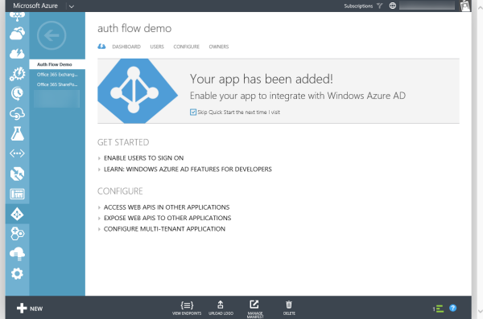

# Configure the Completed Project
In order to run the completed project provided here, you must perform some setup steps. 

## Prerequisites
1. You must have an Office 365 tenant complete this lab. If you do not have one, the lab for **[O3651-7 Setting up your Developer environment in Office 365](https://github.com/OfficeDev/TrainingContent/blob/master/O3651/O3651-5%20Getting%20started%20with%20Office%20365%20APIs/Lab.md)** shows you how to obtain a trial.
1. You must have an Azure subscription with the Office 365 tenant's directory tied to the Azure subscription.
1. You must have [node.js](http://nodejs.org/) installed on your development environment. You can get node.js from the [downlods](http://nodejs.org/download/) section on their site. Certain [node.js packages](https://www.npmjs.org) available via [NPM](htttps://www.npmjs.org) will be used in creating this Office App.
1. You will need a text editor for this lab... anything will do from [Visual Studio](https://www.visualstudio.com/) to [Brackets](http://www.brackets.io) to [WebStorm](https://www.jetbrains.com/webstorm/) to Notepad.

## Create a SharePoint Site using the Provided Site Template
Create a new SharePoint site in SharePoint Online using the template found within the [ExpenseApp.wsp](ExpenseApp.wsp) file.

Take note of the URL of the site 

## Download all NPM & Bower Packages
Download all NPM packages (used to build & self-host the project) and bower packages (used for external 3rd party script libraries).

````
$ npm install
````

> The command `npm install` will also execute `bower install` to download all bower packages.

## Create Azure AD Application & Configure for OAuth2 Implicit Flow
1. In a browser navigate to https://manage.windowsazure.com & login.
1. In the left-hand navigation, scroll down to and click on **Active Directory**.
1. Click on the name of your Azure AD directory & then click **Applications** in the toolbar. 

  

1. Click the **Add** button at the bottom of the display.
1. On the **What do you want to do** page, click **Add an application my organization is developing**. This will start the **Add Application** wizard.
1. In the **Add Application** wizard, enter a name of **Auth Flow Demo** and choose the type **Web Application and/or Web API**. Click the arrow to advance to the next page of the wizard.
1. In the **App Properties** page, enter a **SIGN-ON URL** of **http://localhost:8000**

1. Enter an **App ID Uri** of **http://[your-domain].onmicrosoft.com/ExpenseManager**.
  > NOTE: The App ID Uri must be unique within the Azure tenancy. Using a host name that matches your tenant name helps to prevent confusion, and using a value for the path that matches the app name helps to enforce uniqueness. This value can be changed if the app name or purpose changes.
1. Click the **check** image in the lower right of the wizard to create the application. The application **Quick Start** page will display once the application is created.

  

1. On the application Quick Start page, click on **CONFIGURE** in the toolbar.
1. Scroll down to the **Keys** section. 
  1. In the **Select Duration** dropdown, select **1 year**. 
  1. Then click the **Save** button at the bottom of the page.

  *The page will refresh and include the value of the key. In addition, a message is displayed advising that the key will not be shown a second time.*

1. Copy the **Client ID** value to the clipboard and paste into Notepad. You will need this later.
1. Scroll down to the **permissions to other applications** section. 
  1. In the **Select Application** dropdown, select **Office 365 SharePoint Online**. 
  1. In the **Delegated Permissions** dropdown on the same line, the following permissions:
  
    - Read items in all site collections
    - Edit or delete items in all site collections
    - Read user' files

1. Click the **Save** button at the bottom of the page.
1. Configure the application to allow the OAuth2 Implicit Flow:
  1. After saving the app, click the **MANAGE MANIFEST** button in the footer of the page. You will be prompted to upload / download the manifest. Download the manifest file to your desktop. It will be named **[client-id].json**.
  1. Open the manifest in a text editor. Locate the property **oauth2AllowImplicitFlow**.
  1. Set the **oauth2AllowImplicitFlow** property to **true** and save your changes.
  1. Back in the Azure Management Portal, click the **MANAGE MANIFEST** button and select **UPLOAD MANIFEST**.
  1. Select the file you just updated and upload the file.

## Configure the Application's Settings
Use the values you obtained above within the application in order to configure the app. Open the [app.constants.ts](src/app/expenseApp/app.constants.ts) file and update the settings for the following values:

- **tenant**: This is the ID of the Azure AD tenant where the app resides that you created.
- **clientId**: This is the ID of the Azure AD application that you created.
- **baseSPUrl**: This is the root URL to the SharePoint REST API endpoint of the site you created using the template in the [ExpenseApp.wsp](ExpenseApp.wsp) file.
- **baseOneDriveUrl**: This is the root URL of the Office 365 Files API endpoint for your OneDrive for Business account.
- **aadEndpoints**: This object contains a name-value property-value pair for each REST endpoint you are going to call that ADAL JS should attach a bearer token to. Each property is in the format of `'[root-API-endpoint]':'[api-resource-id]'`