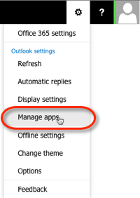
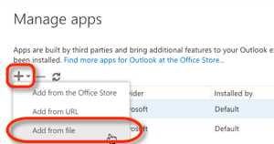
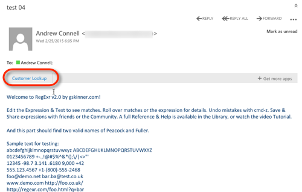
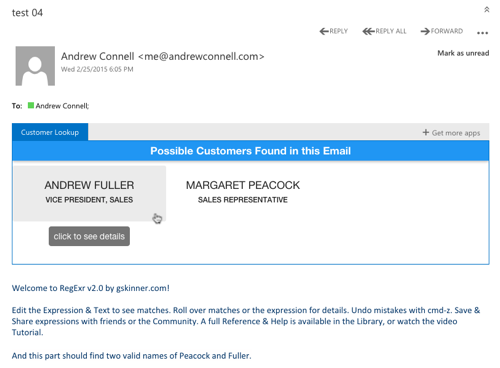
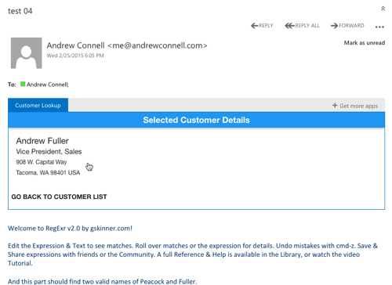

# Creating Office Apps for Outlook
In this lab, you will create an Office App and test it within the Outlook Web client. Once the app is finished it will run within all other Outlook clients on desktop, mobile and web clients where Office Apps for Outlook are supported.

The app that you will build in this application will be installed into Outlook's and be displayed when reading an email. It will take all words within the email that start with an upper case letter and search for them within a fake customer database for possible matches. The matches will then be shown to the user which they can click on to see additional details on the possible customer match.

## Prerequisites
1. You must have an Office 365 tenant complete this lab. If you do not have one, the lab for **[O3651-7 Setting up your Developer environment in Office 365](https://github.com/OfficeDev/TrainingContent/blob/master/O3651/O3651-5%20Getting%20started%20with%20Office%20365%20APIs/Lab.md)** shows you how to obtain a trial.
1. You must have [node.js](http://nodejs.org/) installed on your development environment. If you don't have it, jump over to the [downlods](http://nodejs.org/download/) and grab it. Certain node.js packages available via [NPM](htttps://www.npmjs.org) will be used in creating this Office App.

> Unlike many of the labs in these training courses, this lab will demonstrate how to create an app will demonstrate creating apps from OS X using the freely available [Brackets](http://brackets.io/) editor by Adobe.
> 
> However you can use any host operating system (*Windows, OS X, Linux, etc*) and any text editor (*Visual Studio, Sublime Text, Atom, Brackets, WebStorm, EMACS, Vim, etc*) to create the Office App. This is because Office Apps are simply text-based web applications (*HTML, CSS, JavaScript, & images*) with a single XML file to describe the application.

## Exercise 1: Configure the Starter Project
In this exercise, you will examine and customize the **Starter Project** for the remainder of the lab.

1. Launch **Brackets**.
1. Within **Brackets**, use the menu to select **File | Open Folder**.
1. Locate the [Starter Project](Starter Project) folder within this lab in the dialog, select it and click **Open**.
1. Within Brackets, open the `bower.json` file. This file contains all the [bower](http://www.bower.io) packages that will be used in the application, found in the **dependencies** section of the file:
  1. **microsoft.office.js** - Office Apps related assets provided by Microsoft.
  1. **angular-** - Various Angular modules.
  1. **angular-material** - The Angular implementation of Material Design that will be used to easily style the application.

1. Download all dependent node & bower packages listed in the `package.json` & `bower.json` files. The NPM `package.json` file has a script in it that will automatically run the bower download.
  1. Open a **Terminal** window (on OS X) or **Command Prompt** (on Windows).
  1. Navigate to the root folder of the **Starter Project** in the Terminal window.
  1. Run the following command to download all packages. This will create a new folders `node_modules` & `bower_components` in the **Starter Project**.

    ````
    $ npm install
    ````

1. Next, you must create and install a self-signed certificate on your machine. If you have already done this for another project, you don't have to repeat it. Otherwise, **[follow these instructions](self-signed-cert-osx.md)**.

  Now test to make sure the sample app is working.

1. From the from the command line, ensure you are in the root of the **Starter Project** folder and enter the following command to start the web server:

  ````
  $ node server.js
  ````

1. Open a browser and navigate to **https://localhost:8433 **. Ignore any certificate warnings & errors the browser may display.
1. You should see a page that displays a single rendered HTML `<h1>` tag: **Customer Lookup**.
1. Stop the web server by pressing `CTRL+C` in Terminal on OS X or `CTRL+X` in the Command Prompt on Windows.

In this exercise you downloaded all external package dependencies and tested the local web server that will host the Office App for Outlook.

## Exercise 2: Create Skeleton of an Office App for Outlook
In this exercise you will, deploy & test a skeleton implementation of the Office App for Outlook.

1. Update the app manifest that will be used to install the app into your Outlook instance.

  > NOTE: Refern to MSDN for full documentation on an app's manifest file: **[MSDN - Mail App Manifests](https://msdn.microsoft.com/EN-US/library/office/dn642483.aspx)**

  1. Open the `CustomerLookupOutlookApp.xml` file in the **Starter Project**'s root folder.
  1. Locate the `<OfficeApp>` element. Set the attribute `xsi:type` to `xsi:type="MailApp"` to define this as a mail app.

    > The other types of apps are content and task pane apps.
  
  1. Locate the element `<ProviderName>` and set it to your name. This is the name of the author of the app:

    ````xml
    <ProviderName>OfficeDev</ProviderName>
    ````

  1. Locate the `<DisplayName>`, `<Description>` and `<IconUrl>` elements. These are used in the marketing and branding of the app. 
  
    Update them to similar values which follows:

    ````xml
    <DisplayName DefaultValue="Customer Lookup"/>
    <Description DefaultValue="This app looks at the names in the body of the email for matching customers."/>
    <IconUrl DefaultValue="https://localhost:8433/content/OfficeDev.png"/>
    ````

  1. Locate the `<Hosts>` element. This tells the hosting Office client what this app needs access to. 

    In this case, add a new child element that specifies the host as a mailbox:

    ````xml
    <Hosts> <!-- already exists -->
      <Host Name="Mailbox"/>
    </Hosts> <!-- already exists -->
    ````

  1. Locate the `<Requirements>` element. This tells the Office client the minimum version number of the Office client (`Office.js`) runtime this app is using. This will ensure that the app won't be loaded in any Office clients that have not been updated to a more recent version, such as those installed versions on desktops or tablets.
  
    Update the `<Requirements>` element to have a new `<Set>` as shown in the following markup:

    ````xml
    <Requirements> <!-- already exists -->
      <Sets DefaultMinVersion="1.1">
        <Set Name="Mailbox" MinVersion="1.1"/>
      </Sets>
    </Requirements> <!-- already exists -->
    ````

  1. Locate the `<FormSettings>` element. This tells the Office client where this app can load and the homepage for the app in that form. In our case we want this to load in the read forms, not in the compose forms, within Outlook.

    Add the following `<Form>` element to the `<FormSettings>` element to tell it to load our app's homepage that we are running locally.

    ````xml
    <FormSettings> <!-- already exists -->
      <Form xsi:type="ItemRead">
        <DesktopSettings>
          <SourceLocation DefaultValue="https://localhost:8433/index.html"/>
          <RequestedHeight>200</RequestedHeight>
        </DesktopSettings>
      </Form>
    </FormSettings> <!-- already exists -->
    ````

  1. Next, tell the Outlook client what permissions this app requires. This will be used to prompt the user to grant the app permissions when they try to install it. 
  
    Locate the `<Permissions>` element and update it to the following so our app can read the contents of the selected email:

    ````xml
    <Permissions>ReadItem</Permissions>
    ````

  1. Lastly, the hosting Office app needs to know when the app should load and what data it has access to. Do this by adding a `<Rule>` section as the very last element before the closing `<OfficeApp>` tag:

    ````xml
    <Rule xsi:type="RuleCollection" Mode="And">
      <Rule xsi:type="ItemIs"
            ItemType="Message"
            FormType="Read"/>
      <Rule xsi:type="ItemHasRegularExpressionMatch"
            PropertyName="BodyAsHTML"
            RegExName="PossibleName"
            RegExValue="\b[A-Z][a-z]+\b"/>
    </Rule>
    ````

    This rule is actually a collection of two rules concatenated together. The first rule says "when the selected item is a message loaded in the read pane". The second message says "find all matches for a specific regular expression within the emails `BodyAsHTML` property and put them in a collection named **PossibleName**".

  1. Save your changes.

1. Install the app within your Outlook web client.
  1. Using the browser, navigate to https://mail.office365.com and login to your Office 365 developer tenant.
  1. Using the "cog" icon in the top right, select **Manage Apps**.

    

  1. Click the **plus** icon to add a new app & select **add from file**.

    

  1. Select the option to upload a file, find the `CustomerLookupOutlookApp.xml` file you just modified and upload it.
  1. When prompted, accept any security warnings.
1. Test the Office App for Outlook.
  1. Start the local server that is hosting the application.
    1. From the command line, navigate to the **src** folder within the **Starter Project** folder.
    1. Enter the following to start the server:

      ````
      $ node server.js
      ````

  1. Go back to the browser where you are logged into the Outlook web client at https://mail.office365.com. If you are no longer logged in, repeat the login process again.
  1. Send your Office 365 developer tenant email address a test email (you can send it to yourself). This email must have at least one upper case whole word in the email to trigger the app to load.
  1. After sending the email, select it within the Outlook web client.
  1. After a few seconds, you should notice the app loads between the header portion of the email and the body of the email.

    Click the **Customer Lookup** button to open the app. You should see the app display the single `<h1>` tag in our app to demonstrate the app is not only loading, but it is showing the contents from our local server.

    

  1. Stop the web server by pressing `CTRL+C` in Terminal on OS X or `CTRL+X` in the Command Prompt on Windows.

In this exercise you created a skeleton of the Office app for Outlook and got it working within Outlook. 

## Exercise 3: Implement the Office App for Outlook.
In this exercise you will create the Angular part of the application to enable functionality on the app.

1. Create the Angular application:
  1. Add a new file to the **src** folder of the **Starter Project** named **app.module.js**.
  1. Add the following code to the **app.module.js** file. This creates the Angular application, sets it to use debug logging, configures the Material Design theme to use and forces the route service to initialize:

    ````javascript
    (function () {
      'use strict';

      // create the angular app
      var outlookApp = angular.module('appowa', [
        'ngRoute',
        'ngAnimate',
        'ngSanitize',
        'ngMaterial'
      ]);

      // configure the app
      outlookApp.config(['$logProvider', '$mdThemingProvider', function ($logProvider, $mdThemingProvider) {
        // set debug logging to on
        if ($logProvider.debugEnabled) {
          $logProvider.debugEnabled(true);
        }

        // configure theme color
        $mdThemingProvider.theme('default')
            .primaryPalette('blue');
      }]);

      // when office has initalized, manually bootstrap the app
      Office.initialize = function () {
        console.log(">>> Office.initialize()");
        angular.bootstrap(jQuery('#container'), ['appowa']);
      };

    })();
    ````

    > Notice the last bit of code where we are manually bootstrapping the Angular app after Office has initialized. Office will look for the the `initialize` method to be defined and call it immediately upon the app loading in the client. It is important to note that if this function does not complete within five (5) seconds of the app being loaded by the hosting Office client application, an error will be displayed. Therefore it is important to declare and call this as quickly as possible.    

1. Define navigation routes for the application:
  1. Add a new file to the **src** folder of the **Starter Project** named **app.routes.js**.
  1. Add the following code to the **app.routes.js** file. This creates the two routes in our application:

    ````javascript
    (function () {
      'use strict';

      var outlookApp = angular.module('appowa');

      // load routes
      outlookApp.config(['$routeProvider', routeConfigurator]);

      function routeConfigurator($routeProvider) {
        $routeProvider
            .when('/', {
              templateUrl: 'customers/customers.html',
              controller: 'customersController',
              controllerAs: 'vm'
            })
            .when('/:customerID', {
              templateUrl: 'customers/customers-detail.html',
              controller: 'customersDetailController',
              controllerAs: 'vm'
            });

        $routeProvider.otherwise({redirectTo: '/'});
      }
    })();
    ````

1. Create the initial list view for all found customers in the app:
  1. Create a new folder named **customers** within the **src** folder in the **Starter Project**.
  1. Add a new file to the **customers** folder of the **Starter Project** named **customers.html**.
  1. Add the following code to the **customers.html** file. This will be the view for our customer list screen:

    ````html
    <md-toolbar class="md-primary">
      <h5>Possible Customers Found in this Email</h5>
    </md-toolbar>
    <md-list horizontal layout>
      <md-item data-ng-repeat="match in vm.matchCandidates">
        <md-item-content>
          <md-button data-ng-click="vm.goToCustomer(match)" style="width:250px; padding:5px 16px">
            <div class="md-tile-content">
              <h3>{{match.FirstName}} {{match.LastName}}</h3>
              <p>{{match.Title}}</p>
            </div>
            <md-tooltip>click to see details</md-tooltip>
          </md-button>
        </md-item-content>
      </md-item>
    </md-list>
    ````

  1. Add a new file to the **customers** folder named **customers.controller.js**.
  1. Add the following code to the **customers.controller.js** file. This will be the controller for our customer list screen. Notice it will use two services we have yet to define.

    ````javascript
    (function () {
      'use strict';

      angular.module('appowa')
          .controller('customersController',
          ['$q', '$location', 'officeService', 'customerService',
            customersController]);

      /**
       * Controller constructor
       * @param $q                Angular's $q promise service.
       * @param $location         Angular's $location service.
       * @param officeService     Custom Angular service for talking to the Office client.
       * @param customerService   Custom Angular service for customer data.
       */
      function customersController($q, $location, officeService, customerService) {
        var vm = this;

        // collection of words to lookup
        vm.lookupCandidates = [];
        // customer hits
        vm.matchCandidates = [];
        // handler to take to another view
        vm.goToCustomer = goToCustomer;

        /** *********************************************************** */

        init();

        /**
         * Initialize the controller
         */
        function init() {
          loadMatchesFromEmail()
              .then(function () {
                return getCadidateCustomersFromService();
              });
        }

        /**
         * Load the possible candidate matches in the email within the app.
         */
        function loadMatchesFromEmail() {
          var deferred = $q.defer();

          officeService.getWordCandidatesFromEmail()
              .then(function (candidates) {
                vm.lookupCandidates = candidates;
                deferred.resolve();
              })
              .catch(function (error) {
                deferred.reject(error);
              });

          return deferred.promise;
        }

        /**
         * Query the lookup service to get a list of all matching candidates.
         */
        function getCadidateCustomersFromService() {
          var deferred = $q.defer();

          customerService.lookupCustomerPartials(vm.lookupCandidates)
              .then(function (candidates) {
                vm.matchCandidates = candidates;
                deferred.resolve();
              })
              .catch(function (error) {
                console.log('>>> failed getCadidateCustomersFromService', error);
                deferred.reject(error);
              });

          return deferred.promise;
        }

        /**
         * Changes the view to the the customer detail page.
         *
         * @param customer {object}   Customer selected from the list.
         */
        function goToCustomer(customer) {
          $location.path('/' + customer.CustomerID);
        }
      }

    })();
    ````
1. Create the customer detail view and controller for the app:
  1. Add a new file to the **customers** folder of the **Starter Project** named **customers-detail.html**.
  1. Add the following code to the **customers-detail.html** file. This will be the view for our customer detail screen:

    ````html
    <md-toolbar class="md-primary">
      <h5>Selected Customer Details</h5>
    </md-toolbar>

    <md-content>
      <md-item>
        <md-item-content>
          <div class="md-tile-content">
            <h3>{{vm.customer.FirstName}} {{vm.customer.LastName}}</h3>
            <h4>{{vm.customer.Title}}</h4>
            <p>
              {{vm.customer.Address}}<br/>
              {{vm.customer.City}}, {{vm.customer.Region}} {{vm.customer.PostalCode}} {{vm.customer.Country}}
            </p>
          </div>
        </md-item-content>
      </md-item>
    </md-content>

    <md-button data-ng-click="vm.goBack()">
      <h5>go back to customer list</h5>
    </md-button>
    ````

  1. Add a new file to the **customers** folder named **customers-detail.controller.js**.
  1. Add the following code to the **customers-detail.controller.js** file. This will be the controller for our customer detail screen. Notice it will use two services we have yet to define.

    ````javascript
    (function () {
      'use strict';

      angular.module('appowa')
          .controller('customersDetailController',
          ['$q', '$window', '$location', '$routeParams', 'customerService',
            customersDetailController]);

      /**
       * Controller constructor
       * @param $q                Angular's $q promise service.
       * @param $window           Angular's $window service.
       * @param $location         Angular's $location service.
       * @param $routeParams      Angular's $routeParams service.
       * @param customerService   Custom Angular service for customer data.
       */
      function customersDetailController($q, $window, $location, $routeParams, customerService) {
        var vm = this;

        // selected customer
        vm.customer = {};
        vm.goBack = goBack;

        /** *********************************************************** */

        init();

        /**
         * Initialize the controller
         */
        function init() {
          // if ID is passed in, load customer
          var customerId = +$routeParams.customerID;
          if (customerId && customerId > 0) {
            loadCustomer(customerId);
          } else {
            $location.path('/');
          }
        }

        /**
         * Load the specified customer.
         *
         * @param customerID {number}   ID of the selected customer to display.
         */
        function loadCustomer(customerID) {
          var deferred = $q.defer();

          customerService.lookupCustomer(customerID)
              .then(function (customer) {
                vm.customer = customer;
                deferred.resolve();
              })
              .catch(function (error) {
                deferred.reject(error);
              });

          return deferred.promise;
        }

        /**
         * Navigates back to the list.
         */
        function goBack() {
          $window.history.back();
        }

      }

    })();
    ````

1. Add a new service, **officeService** that will be used to to get the data from the the hosting Outlook client app that our app will use.
  1. Create a new folder named **services** within the **src** folder in the **Starter Project**.
  1. Add a new file to the **services** folder of the **Starter Project** named **officeService.js**.
  1. Add the following code to the **officeService.js** file. This will be the service that will talk to the hosting Office client app:

    ````javascript
    (function () {
      'use strict';

      angular.module('appowa')
             .service('officeService', ['$q', officeService]);

      /**
       * Custom Angular service that works with the host Office client.
       *
       * @returns {{getWordCandidatesFromEmail: getWordCandidatesFromEmail}}
       */
      function officeService($q) {
        // public signature of the service.
        return {
          getWordCandidatesFromEmail: getWordCandidatesFromEmail
        };

        /** *********************************************************** */

        /**
         * Retrieves a collection of all possible names in the currently selected email.
         *
         * @returns {Array<string>}   Collection of potential names.
         */
        function getWordCandidatesFromEmail() {
          var deferred = $q.defer();

          try {
            var currentEmail = Office.cast.item.toItemRead(Office.context.mailbox.item);

            // get list of all words in email that start with an upper case letter
            //  these are potential names of employees
            deferred.resolve(currentEmail.getRegExMatches().PossibleName);
          } catch (error) {
            deferred.reject(error);
          }

          return deferred.promise;
        }
      }

    })();
    ````

  > Refer to MSND for additional API documentation on creating mail apps using the Office.js runtime: **[MSDN - Get and set Outlook item data in read or compose forms](https://msdn.microsoft.com/EN-US/library/office/dn568064.aspx)**.

1. Add a new service, **dataService** minic querying a real RESTful service to find potential matching customers that were found in the email body.
  1. Add a new file to the **services** folder of the **Starter Project** named **customerService.js**.
  1. Add the following code to the **customerService.js** file. This will be the service that will talk to the hosting Office client app:

    ````javascript
    (function () {
      'use strict';

      angular.module('appowa')
          .service('customerService', ['$q', '$http', customerService]);

      /**
       * Custom Angular service that talks to a static JSON file simulating a REST API.
       */
      function customerService($q, $http) {
        // public signature of the service
        return {
          lookupCustomerPartials: lookupCustomerPartials,
          lookupCustomer: lookupCustomer
        };

        /** *********************************************************** */

        /**
         * Queries the remote service for possible customer matches.
         *
         * @param possibleCustomers {Array<string>}   Collection of customer last names to lookup.
         */
        function lookupCustomerPartials(possibleCustomers) {
          var deferred = $q.defer();

          // if nothing submitted return empty collection
          if (!possibleCustomers || possibleCustomers.length == 0) {
            deferred.resolve([]);
          }

          // fetch data
          var endpoint = '/content/customers.json';

          // execute query
          $http({
            method: 'GET',
            url: endpoint
          }).success(function (response) {
            var customers = [];

            // look at each customer to find a match
            response.d.results.forEach(function (customer) {
              if (possibleCustomers.indexOf(customer.LastName) != -1) {
                customers.push(customer);
              }
            });

            deferred.resolve(customers);
          }).error(function (error) {
            deferred.reject(error);
          });

          return deferred.promise;
        }

        /**
         * Finds a specific customer form the datasource.
         *
         * @param customerID  {number}    Unique ID of the customer.
         */
        function lookupCustomer(customerID) {
          var deferred = $q.defer();

          // fetch data
          var endpoint = '/content/customers.json';

          $http({
            method: 'GET',
            url: endpoint
          }).success(function (response) {
            var result = {};

            // find the matching customer
            response.d.results.forEach(function (customer) {
              if (customerID == customer.CustomerID) {
                result = customer;
              }
            });

            deferred.resolve(result);
          }).error(function (error) {
            deferred.reject(error);
          });

          return deferred.promise;
        }

      }
    })();
    ````

1. Now update the homepage of our site to add the necessary Angular bits.
  1. Open the **index.html** file in the **src** folder within the **Starter Project**.
  1. Add the following HTML tag to the body of the page to create a place for our views to get swapped in and out by Angular:

    ````html
    <div data-ng-view class="shuffle-animation"></div>
    ````

  1. Finally, add the following JavaScript references immediately after the other script references at the bottom of the page:

    ````html
    <!-- app code -->
    <script src="app.module.js" type="application/javascript"></script>
    <script src="app.routes.js" type="application/javascript"></script>
    <!-- services -->
    <script src="services/officeService.js" type="application/javascript"></script>
    <script src="services/customerService.js" type="application/javascript"></script>
    <!-- contollers -->
    <script src="customers/customers.controller.js" type="application/javascript"></script>
    <script src="customers/customers-detail.controller.js" type="application/javascript"></script>
    ````

1. Test the Office App for Outlook.
  1. Start the local server that is hosting the application.
    1. From the command line, navigate to the **src** folder within the **Starter Project** folder.
    1. Enter the following to start the server:

      ````
      $ node server.js
      ````

  1. Go back to the browser where you are logged into the Outlook web client at https://mail.office365.com. If you are no longer logged in, repeat the login process again.
  1. Send your Office 365 developer tenant email address a test email (you can send it to yourself). This email must have at least one upper case whole word in the email to trigger the app to load.

    > To have a match, use one or more of the following last names: Davolio, Fuller, Leverling, Peacock or another name found in the [customers.json](content/customers.json) file.

  1. After sending the email, select it within the Outlook web client.
  1. After a few seconds, you should notice the app loads between the header portion of the email and the body of the email.

    Click the **Customer Lookup** button to open the app. You should see the app displaying matching people.

    

    Now click one of the people to ensure the app takes them to the next screen:

    

  1. Stop the web server by pressing `CTRL+C` in Terminal on OS X or `CTRL+X` in the Command Prompt on Windows.

Congratulations! You have now created your first Office App for Outlook.

> The next step would be to take this app and deploy it to the public Office store to provide it to other users. Please refer to the course [O3655](https://github.com/OfficeDev/TrainingContent/tree/master/O3655) in the OfficeDev GitHub account for more information.