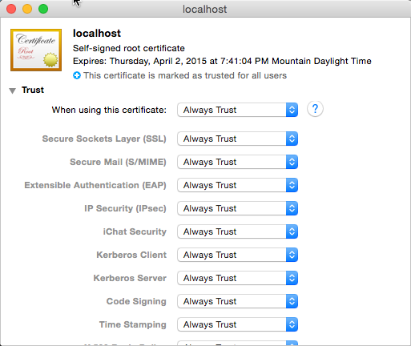

Create a Self-Signed Certificate for HTTPS Development on OS X
==============================================================
Local web development using HTTP is very common and easy to do on OS X with tools like [express](http://npmjs.org/package/express) & [superstatic](http://npmjs.org/package/superstatic). However when you want to do local HTTPS development for secure endpoints there is a bit more work involved. This simple script uses node.js & express to host a local web server that listens only on HTTPS:

````javascript
'use strict';

var fs = require('fs'),
    express = require('express'),
    https = require('https');

var https_options = {
  key: fs.readFileSync('./localhost-key.pem'),
  cert: fs.readFileSync('./localhost-cert.pem')
};

var PORT = 8443,
    HOST = 'localhost';

var app = express();

// set static routes
app.use('/', express.static(__dirname + '/src'));
app.use('/vendor', express.static(__dirname + '/bower_components'));

var server = https.createServer(https_options, app)
                  .listen(PORT, HOST);

console.log('+-+-+-+-+-+-+-+-+-+-+-+-+-+-+-+-+-+-+-+-+-+-+-+-+-+');
console.log('HTTPS Server listening @ https://%s:%s', HOST, PORT);
console.log('+-+-+-+-+-+-+-+-+-+-+-+-+-+-+-+-+-+-+-+-+-+-+-+-+-+');
````

But for this to work, you need to either obtain a certificate and key from a Trusted Root Authority, or you must create a self-signed certificate. The latter is common in development environments but involves manual steps in creating it. 

In addition the browser will still report that the certificate is not trusted and thus some applications that validate the certificate will reject the requests. To fix this you must configure the certificate as a Trusted Root Authority on your development environment.

Create a Self Signed Certificate
--------------------------------
Open a **Terminal** prompt and enter the following command:

````
$ openssl genrsa -out localhost-key.pem 1024 
````

Next, create the certificate request:

````
$ openssl req -new -key localhost-key.pem -out localhost.csr
````

At this stage the **openssl** tool will prompt you for a few more prompts. These values will get added to the certificate request that you are generating to get the private key. What follows is an example of some options you can use. The important point is to use **localhost** for the **Common Name** request.

````
Country Name (2 letter code) [AU]:US
State or Province Name (full name) [Some-State]:Washington
Locality Name (eg, city) []:Redmond
Organization Name (eg, company) [Internet Widgits Pty Ltd]:Contoso
Organizational Unit Name (eg, section) []:corp
Common Name (e.g. server FQDN or YOUR name) []:localhost
Email Address []:admin@contoso.com

Please enter the following 'extra' attributes
to be sent with your certificate request
A challenge password []:
An optional company name []:
````

Now create the certificate from the certificate request:

````
$ openssl x509 -req -in localhost.csr -signkey localhost-key.pem -out localhost-cert.pem
````

At this point you have the key and the certificate.

You can use these in the files in the script at the top of these instructions. However you will notice that, as stated previous, the browser won't respect the certificate. You will see a **Your connection is not private** message in Chrome and the URL will show an error with the certificate:

To fix this, you need to add the certificate as a trusted root authority.

Add Self-Signed Certificate as Trusted Root Authority
-----------------------------------------------------
Within Chrome, do the following:

1. In the address bar, click the little lock with the X. This will bring up a small information screen. Click the button that says "Certificate Information."
1. Click and drag the image to your desktop. It looks like a little certificate.


1. Open the **Keychain Access** utility in OS X.
1. Select the **System** option on the left.
1. Click the lock icon in the upper-left corner to enable changes.


1. Click the plus button at the bottom and select the **localhost.cer** file you copied to the desktop.
1. In the dialog that comes up, click **Always Trust**.
1. After **localhost** gets added to the **System** keychain, double-click it to open it again.
1. Expand the **Trust** section and for the first option, pick **Always Trust**.



At this point everything has been configured. Quick Chrome and all other browsers and try again to navigate to the local HTTPS site. The browser should report it as a valid certificate:


