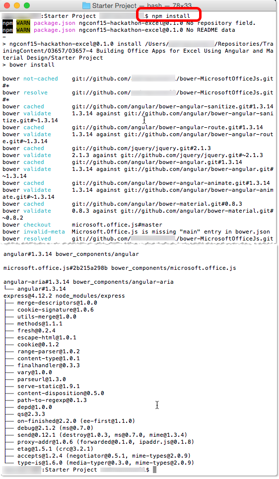
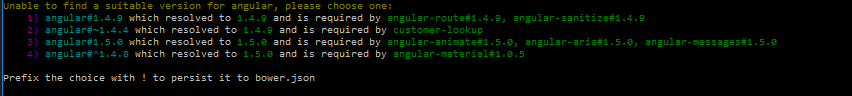
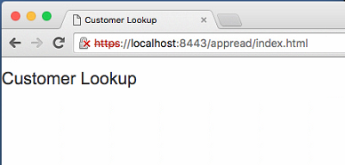
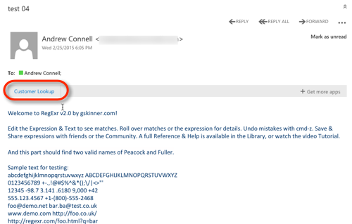
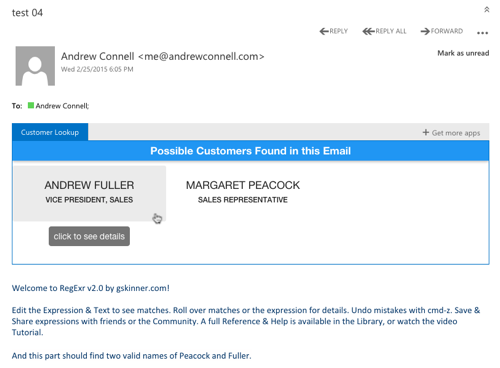
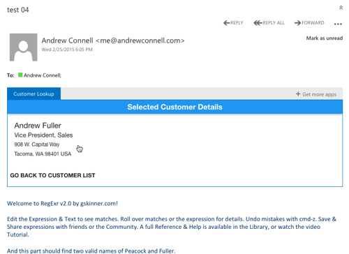

# Creating Office Add-ins for Outlook
In this lab, you will create an Office Add-in and test it within the Outlook Web client. Once the add-in is finished it will run within all other Outlook clients on desktop, mobile and web clients where Office Add-ins for Outlook are supported.

The add-in that you will build in this application will be installed into Outlook's and be displayed when reading an email. It will take all words within the email that start with an upper case letter and search for them within a fake customer database for possible matches. The matches will then be shown to the user which they can click on to see additional details on the possible customer match.

## Prerequisites
1. You must have an Office 365 tenant complete this lab. If you do not have one, the lab for **[O3651-7 Setting up your Developer environment in Office 365](https://github.com/OfficeDev/TrainingContent/blob/master/O3651/O3651-5%20Getting%20started%20with%20Office%20365%20APIs/Lab.md)** shows you how to obtain a trial.
1. You must have [node.js](http://nodejs.org/) installed on your development environment. You can get node.js from the [downloads](https://nodejs.org/en/download/) section on their site. Certain [node.js packages](https://www.npmjs.org) available via [NPM](https://www.npmjs.org) will be used in creating this Office Add-in.
1. You will need a text editor for this lab. The editor **[Brackets](http://www.brackets.io)** is used in this lab.
1. This lab requires you to use multiple starter files or an entire starter project from the GitHub location. You can either download the whole repo as a zip or clone the repo https://github.com/OfficeDev/TrainingContent.git for those familiar with git.
5. You will also need to install Git with the ability to execute from the command line.  
6. Additionally, you may need to add Git to your computer's PATH environment variable.
7. Ensure that **bower** is installed in your project folder.  To install bower, run
  ````
    $ npm install bower
    ````

## Exercise 1: Configure the Starter Project
In this exercise, you will examine and customize the **Starter Project** for the remainder of the lab.
  
  The scaffolding of this starter project is created by [YO OFFICE](https://github.com/OfficeDev/generator-office). It's a template for [Yeoman](http://yeoman.io) generator. To simple this demo, some places were changed. For instance,remove default angular view form **index.html**.
  
1. Launch **Brackets**.
1. Within **Brackets**, use the menu to select **File &raquo; Open Folder**.
1. Locate the [\\\O3657\O3657-3 Building Office Apps for Outlook Using Angular and Material Design\Starter Project](Starter Project) folder within this lab in the dialog, select it and click **Open**.
1. Within Brackets, open the `bower.json` file. This file contains all the [bower](http://www.bower.io) packages that will be used in the application, found in the **dependencies** section of the file:
  ````javascript
  "dependencies": {
    "microsoft.office.js": "*",
    "angular": "~1.4.4",
    "angular-route": "~1.4.4",
    "angular-sanitize": "~1.4.4",
    "angular-material": "~1.0.1"
  }  
  ````
  
  >1. **microsoft.office.js**: Office Add-ins related assets provided by Microsoft.
  >1. **angular-***: Various Angular modules.
  >1. **angular-material**: The Angular implementation of Material Design that will be used to easily style the application.

1. Download all dependent node & bower packages listed in the `package.json` & `bower.json` files. The NPM `package.json` file has a script in it that will automatically run the bower download.
  1. Open a **Terminal** window (on OS X) or **Command Prompt** (on Windows).
  1. Navigate to the root folder of the **Starter Project** located at [\\\O3657\O3657-3 Building Office Apps for Outlook Using Angular and Material Design\Starter Project](Starter Project) in the Terminal window.
  
      
  
  1. Run the following command to download all packages. This will create the new folder `node_modules`in the **Starter Project** located at [\\\O3657\O3657-3 Building Office Apps for Outlook Using Angular and Material Design\Starter Project](Starter Project).

    ````
    $ npm install
    ````

        

6. At the prompt to choose a suitable version of angular, select **2**.

    

1. Now test to make sure the sample add-in is working.
  1. From the command line, ensure you are in the root of the **Starter Project** folder located at [\\\O3657\O3657-3 Building Office Apps for Outlook Using Angular and Material Design\Starter Project](Starter Project) and enter the following command to start the web server:

    ````
    $ gulp serve-static
    ````

  1. Open a browser and navigate to **https://localhost:8443/appread/index.html**. Ignore any certificate warnings & errors the browser may display.
  1. You should see a page that displays a single rendered HTML `<h1>` tag: **Customer Lookup**.
  
    
  1. This HTTPS server used a self-signed SSL cert. Follow this [document](https://github.com/OfficeDev/generator-office/blob/master/docs/trust-self-signed-cert.md) to add self-signed certificate as trusted root certificate. 
  
    
  1. Stop the web server by pressing `CTRL+C` in Terminal.

In this exercise you downloaded all external package dependencies and tested the local web server that will host the Office Add-in for Outlook.

## Exercise 2: Create Skeleton of an Office Add-in for Outlook
In this exercise you will deploy & test a skeleton implementation of the Office Add-in for Outlook.

1. Update the add-in manifest that will be used to install the add-in into your Outlook instance.

  > NOTE: Refer to MSDN for full documentation on an add-in's manifest file: **[MSDN - Outlook add-in manifests](https://msdn.microsoft.com/EN-US/library/office/dn642483.aspx)**

  1. Open the [`manifest-customer-lookup.xml`](Starter Project/manifest-customer-lookup.xml) file in the [\\\O3657\O3657-3 Building Office Apps for Outlook Using Angular and Material Design\Starter Project](Starter Project)'s root folder. It's generated by [YO OFFICE](https://github.com/OfficeDev/generator-office).
  1. Locate the `<OfficeApp>` element. Set the attribute `xsi:type` to `xsi:type="MailApp"` to define this as a mail add-in.

    > The other types of add-ins are content and task pane add-ins.
  
  1. Locate the element `<ProviderName>` and set it to your name. This is the name of the author of the add-in:

    ````xml
    <ProviderName>OfficeDev</ProviderName>
    ````

  1. Locate the `<DisplayName>`, `<Description>` and `<HighResolutionIconUrl>` elements. These are used in the marketing and branding of the add-in. 
  
    Update them to similar values which follows:

    ````xml
    <DisplayName DefaultValue="Customer Lookup"/>
    <Description DefaultValue="This add-in looks at the names in the body of the email for matching customers."/>
    <HighResolutionIconUrl DefaultValue="https://localhost:8443/content/OfficeDev.png"/>
    ````

  1. Lastly, the hosting Office Add-in needs to know when the add-in should load and what data it has access to. Do this by adding a `<Rule>` section as the very last element before the closing `<OfficeApp>` tag:

    ````xml
    <Rule xsi:type="RuleCollection" Mode="And">
      <Rule xsi:type="ItemIs"
            ItemType="Message"
            FormType="Read"/>
      <Rule xsi:type="ItemHasRegularExpressionMatch"
            PropertyName="BodyAsHTML"
            RegExName="PossibleName"
            RegExValue="\b[A-Z][a-z]+\b"/>
    </Rule>
    ````

    This rule is actually a collection of two rules concatenated together. The first rule says "when the selected item is a message loaded in the read pane". The second message says "find all matches for a specific regular expression within the emails `BodyAsHTML` property and put them in a collection named **PossibleName**".

  1. Save your changes.

1. Install the add-in within your Outlook web client.
  1. Using the browser, navigate to https://mail.office365.com and login to your Office 365 developer tenant.
  1. Using the "cog" icon in the top right, select **Manage add-ins**.

    

  1. Click the **plus** icon to add a new add-in & select **add from file**.

    

  1. Select the option to upload a file, find the `manifest-customer-lookup.xml` file you just modified and upload it.
  1. When prompted, accept any security warnings.
  
    
  
1. Test the Office Add-in for Outlook.
  1. Start the local server that is hosting the application.
      1. From the command line, ensure you are in the root of the **Starter Project** folder located at [\\\O3657\O3657-3 Building Office Apps for Outlook Using Angular and Material Design\Starter Project](Starter Project) and enter the following command to start the web server:

      ````
      $ gulp serve-static
      ````

  1. Go back to the browser where you are logged into the Outlook web client at https://mail.office365.com. If you are no longer logged in, repeat the login process again.
  1. Send your Office 365 developer tenant email address a test email (you can send it to yourself). This email must have at least one upper case whole word in the email to trigger the add-in to load.
  1. After sending the email, select it within the Outlook web client.
  1. After a few seconds, you should notice the add-in loads between the header portion of the email and the body of the email.

    Click the **Customer Lookup** button to open the add-in. You should see the add-in display the single `<h1>` tag in our add-in to demonstrate the add-in is not only loading, but it is showing the contents from our local server.

    

  1. Stop the web server by pressing `CTRL+C` in Terminal.

In this exercise you created a skeleton of the Office Add-in for Outlook and got it working within Outlook. 

## Exercise 3: Implement the Office Add-in for Outlook.
In this exercise you will update the Angular part of the application to enable functionality on the add-in.

1. Update the Angular application:
  1. Open **app.module.js** in the **src/appread** folder
  1. Add dependency `ngAnimate` and `ngMaterial` modules to `officeAddin` module.
  
    ````javascript
    var officeAddin = angular.module('officeAddin', [
        'ngRoute',
        'ngSanitize',
        'ngAnimate',
        'ngMaterial'
    ]);
    ````
   
  1. Update `officeAddin.config()` method, set it to use `$mdThemingProvider`, configures the Material Design theme to use and forces the route service to initialize:

    ````javascript
    officeAddin.config(['$logProvider', '$mdThemingProvider', function ($logProvider, $mdThemingProvider) {
        // set debug logging to on
        if ($logProvider.debugEnabled) {
          $logProvider.debugEnabled(true);
        }

        // configure theme color
        $mdThemingProvider.theme('default')
            .primaryPalette('blue');
    }]);
    ````
 
1. Define navigation routes for the application:
  1. Open **app.routes.js** in the **src/appread** folder 
  1. Update routes as following. This creates the two routes in our application and remove default `homeController`:

    ````javascript
    function routeConfigurator($routeProvider) {
        $routeProvider
            .when('/', {
              templateUrl: 'customers/customers.html',
              controller: 'customersController',
              controllerAs: 'vm'
            })
            .when('/:customerID', {
              templateUrl: 'customers/customers-detail.html',
              controller: 'customersDetailController',
              controllerAs: 'vm'
            });

        $routeProvider.otherwise({redirectTo: '/'});
    }
    ````

1. Create the initial list view for all found customers in the add-in:
  1. Create a new folder named **customers** within the **src/appread** folder in the **Starter Project** located at [\\\O3657\O3657-3 Building Office Apps for Outlook Using Angular and Material Design\Starter Project](Starter Project).
  1. Add a new file to the **customers** folder named **customers.html**.
  1. Add the following code to the **customers.html** file. This will be the view for our customer list screen:

    ````html
    <md-toolbar class="md-primary">
      <h5>Possible Customers Found in this Email</h5>
    </md-toolbar>
    <md-list horizontal layout>
      <md-item data-ng-repeat="match in vm.matchCandidates">
        <md-item-content>
          <md-button data-ng-click="vm.goToCustomer(match)" style="width:250px; padding:5px 16px">
            <div class="md-tile-content">
              <h3>{{match.FirstName}} {{match.LastName}}</h3>
              <p>{{match.Title}}</p>
            </div>
            <md-tooltip>click to see details</md-tooltip>
          </md-button>
        </md-item-content>
      </md-item>
    </md-list>
    ````

  1. Add a new file to the **customers** folder named **customers.controller.js**.
  1. Add the following code to the **customers.controller.js** file. This will be the controller for our customer list screen. Notice it will use two services we have yet to define.

    ````javascript
    (function () {
      'use strict';

      angular.module('officeAddin')
          .controller('customersController',
          ['$q', '$location', 'officeService', 'customerService',
            customersController]);

      /**
       * Controller constructor
       * @param $q                Angular's $q promise service.
       * @param $location         Angular's $location service.
       * @param officeService     Custom Angular service for talking to the Office client.
       * @param customerService   Custom Angular service for customer data.
       */
      function customersController($q, $location, officeService, customerService) {
        var vm = this;

        // collection of words to lookup
        vm.lookupCandidates = [];
        // customer hits
        vm.matchCandidates = [];
        // handler to take to another view
        vm.goToCustomer = goToCustomer;

        /** *********************************************************** */

        init();

        /**
         * Initialize the controller
         */
        function init() {
          loadMatchesFromEmail()
              .then(function () {
                return getCadidateCustomersFromService();
              });
        }

        /**
         * Changes the view to the the customer detail page.
         *
         * @param customer {object}   Customer selected from the list.
         */
        function goToCustomer(customer) {
          $location.path('/' + customer.CustomerID);
        }

      }
    })();
    ````

  1. Add the following function to the `customersController` in **customers.controller.js** file to retrieve all the potential customer last names from the current email address:

    ````javascript
    /**
     * Load the possible candidate matches in the email within the add-in.
     */
    function loadMatchesFromEmail() {
      var deferred = $q.defer();

      officeService.getWordCandidatesFromEmail()
          .then(function (candidates) {
            vm.lookupCandidates = candidates;
            deferred.resolve();
          })
          .catch(function (error) {
            deferred.reject(error);
          });

      return deferred.promise;
    }
    ````

  1. Add the following function to the `customersController` in **customers.controller.js** file to search for the matching customer names in the static JSON file:

    ````javascript
    /**
     * Query the lookup service to get a list of all matching candidates.
     */
    function getCadidateCustomersFromService() {
      var deferred = $q.defer();

      customerService.lookupCustomerPartials(vm.lookupCandidates)
          .then(function (candidates) {
            vm.matchCandidates = candidates;
            deferred.resolve();
          })
          .catch(function (error) {
            console.log('>>> failed getCadidateCustomersFromService', error);
            deferred.reject(error);
          });

      return deferred.promise;
    }
    ````

1. Create the customer detail view and controller for the add-in:
  1. Add a new file to the **customers** folder named **customers-detail.html**.
  1. Add the following code to the **customers-detail.html** file. This will be the view for our customer detail screen:

    ````html
    <md-toolbar class="md-primary">
      <h5>Selected Customer Details</h5>
    </md-toolbar>

    <md-content>
      <md-item>
        <md-item-content>
          <div class="md-tile-content">
            <h3>{{vm.customer.FirstName}} {{vm.customer.LastName}}</h3>
            <h4>{{vm.customer.Title}}</h4>
            <p>
              {{vm.customer.Address}}<br/>
              {{vm.customer.City}}, {{vm.customer.Region}} {{vm.customer.PostalCode}} {{vm.customer.Country}}
            </p>
          </div>
        </md-item-content>
      </md-item>
    </md-content>

    <md-button data-ng-click="vm.goBack()">
      <h5>go back to customer list</h5>
    </md-button>
    ````

  1. Add a new file to the **customers** folder named **customers-detail.controller.js**.
  1. Add the following code to the **customers-detail.controller.js** file. This will be the controller for our customer detail screen. Notice it will use two services we have yet to define.

    ````javascript
    (function () {
      'use strict';

      angular.module('officeAddin')
          .controller('customersDetailController',
          ['$q', '$window', '$location', '$routeParams', 'customerService',
            customersDetailController]);

      /**
       * Controller constructor
       * @param $q                Angular's $q promise service.
       * @param $window           Angular's $window service.
       * @param $location         Angular's $location service.
       * @param $routeParams      Angular's $routeParams service.
       * @param customerService   Custom Angular service for customer data.
       */
      function customersDetailController($q, $window, $location, $routeParams, customerService) {
        var vm = this;

        // selected customer
        vm.customer = {};
        vm.goBack = goBack;

        /** *********************************************************** */

        init();

        /**
         * Initialize the controller
         */
        function init() {
          // if ID is passed in, load customer
          var customerId = +$routeParams.customerID;
          if (customerId && customerId > 0) {
            loadCustomer(customerId);
          } else {
            $location.path('/');
          }
        }

        /**
         * Load the specified customer.
         *
         * @param customerID {number}   ID of the selected customer to display.
         */
        function loadCustomer(customerID) {
          var deferred = $q.defer();

          customerService.lookupCustomer(customerID)
              .then(function (customer) {
                vm.customer = customer;
                deferred.resolve();
              })
              .catch(function (error) {
                deferred.reject(error);
              });

          return deferred.promise;
        }

        /**
         * Navigates back to the list.
         */
        function goBack() {
          $window.history.back();
        }

      }

    })();
    ````

1. Add a new service, **officeService** that will be used to to get the data from the the hosting Outlook client add-in that our add-in will use.
  1. Add a new file to the **services** folder of the **src/appread** named **officeService.js**.
  1. Add the following code to the **officeService.js** file. This will be the service that will talk to the hosting Office client add-in:

    ````javascript
    (function () {
      'use strict';

      angular.module('officeAddin')
             .service('officeService', ['$q', officeService]);

      /**
       * Custom Angular service that works with the host Office client.
       *
       * @returns {{getWordCandidatesFromEmail: getWordCandidatesFromEmail}}
       */
      function officeService($q) {
        // public signature of the service.
        return {
          getWordCandidatesFromEmail: getWordCandidatesFromEmail
        };

        /** *********************************************************** */

        /**
         * Retrieves a collection of all possible names in the currently selected email.
         *
         * @returns {Array<string>}   Collection of potential names.
         */
        function getWordCandidatesFromEmail() {
          var deferred = $q.defer();

          try {
            var currentEmail = Office.cast.item.toItemRead(Office.context.mailbox.item);

            // get list of all words in email that start with an upper case letter
            //  these are potential names of employees
            deferred.resolve(currentEmail.getRegExMatches().PossibleName);
          } catch (error) {
            deferred.reject(error);
          }

          return deferred.promise;
        }
      }

    })();
    ````

  > Refer to MSDN for additional API documentation on creating mail add-ins using the Office.js runtime: **[MSDN - Get and set Outlook item data in read or compose forms](https://msdn.microsoft.com/EN-US/library/office/dn568064.aspx)**.

1. Add a new service, **dataService** minic querying a real RESTful service to find potential matching customers that were found in the email body.
  1. Add a new file to the **services** folder of the **src/appread** named **customerService.js**.
  1. Add the following code to the **customerService.js** file. This will be the service that will talk to the hosting Office client add-in:

    ````javascript
    (function () {
      'use strict';

      angular.module('officeAddin')
          .service('customerService', ['$q', '$http', customerService]);

      /**
       * Custom Angular service that talks to a static JSON file simulating a REST API.
       */
      function customerService($q, $http) {
        // public signature of the service
        return {
          lookupCustomerPartials: lookupCustomerPartials,
          lookupCustomer: lookupCustomer
        };

        /** *********************************************************** */

        /**
         * Queries the remote service for possible customer matches.
         *
         * @param possibleCustomers {Array<string>}   Collection of customer last names to lookup.
         */
        function lookupCustomerPartials(possibleCustomers) {
          var deferred = $q.defer();

          // if nothing submitted return empty collection
          if (!possibleCustomers || possibleCustomers.length == 0) {
            deferred.resolve([]);
          }

          // fetch data
          var endpoint = '/content/customers.json';

          // execute query
          $http({
            method: 'GET',
            url: endpoint
          }).success(function (response) {
            var customers = [];

            // look at each customer to find a match
            response.d.results.forEach(function (customer) {
              if (possibleCustomers.indexOf(customer.LastName) != -1) {
                customers.push(customer);
              }
            });

            deferred.resolve(customers);
          }).error(function (error) {
            deferred.reject(error);
          });

          return deferred.promise;
        }

        /**
         * Finds a specific customer form the datasource.
         *
         * @param customerID  {number}    Unique ID of the customer.
         */
        function lookupCustomer(customerID) {
          var deferred = $q.defer();

          // fetch data
          var endpoint = '/content/customers.json';

          $http({
            method: 'GET',
            url: endpoint
          }).success(function (response) {
            var result = {};

            // find the matching customer
            response.d.results.forEach(function (customer) {
              if (customerID == customer.CustomerID) {
                result = customer;
              }
            });

            deferred.resolve(result);
          }).error(function (error) {
            deferred.reject(error);
          });

          return deferred.promise;
        }

      }
    })();
    ````

1. Now update the homepage of our site to add the necessary Angular bits.
  1. Open the [`index.html`](Starter Project/src/appread/index.html) file in the [\\\O3657\O3657-3 Building Office Apps for Outlook Using Angular and Material Design\Starter Project\src\appread](Starter Project/src/appread) folder within the **Starter Project**.
  1. Remove `<h1>Customer Lookup</h1>`
  1. Add the following HTML tag to the body of the page to create a place for our views to get swapped in and out by Angular:

    ````html
      <div data-ng-view class="shuffle-animation"></div>
    ````

  1. Finally, add the following JavaScript references immediately after the other script references at the bottom of the page:

    ````html
    <!-- services -->
    <script src="services/officeService.js" type="application/javascript"></script>
    <script src="services/customerService.js" type="application/javascript"></script>
    <!-- contollers -->
    <script src="customers/customers.controller.js" type="application/javascript"></script>
    <script src="customers/customers-detail.controller.js" type="application/javascript"></script>
    ````

1. Test the Office Add-in for Outlook.
  1. Start the local server that is hosting the application.
    1. From the command line, navigate to **Starter Project** folder located at [\\\O3657\O3657-3 Building Office Apps for Outlook Using Angular and Material Design\Starter Project](Starter Project).
    1. Enter the following to start the server:

      ````
      $ gulp serve-static
      ````

  1. Go back to the browser where you are logged into the Outlook web client at https://mail.office365.com. If you are no longer logged in, repeat the login process again.
  1. Send your Office 365 developer tenant email address a test email (you can send it to yourself). This email must have at least one upper case whole word in the email to trigger the add-in to load.

    > To have a match, use one or more of the following last names: **Davolio**, **Fuller**, **Leverling**, **Peacock** or another name found in the [customers.json](src/content/customers.json) file.

  1. After sending the email, select it within the Outlook web client.
  1. After a few seconds, you should notice the add-in loads between the header portion of the email and the body of the email.

    Click the **Customer Lookup** button to open the add-in. You should see the add-in displaying matching people.

    

    Now click one of the people to ensure the add-in takes them to the next screen:

    

  1. Stop the web server by pressing `CTRL+C` in Terminal.

Congratulations! You have now created your first Office Add-in for Outlook.

> The next step would be to take this add-in and deploy it to the public Office store to provide it to other users. Please refer to the course [O3655](https://github.com/OfficeDev/TrainingContent/tree/master/O3655) in the OfficeDev GitHub account for more information.