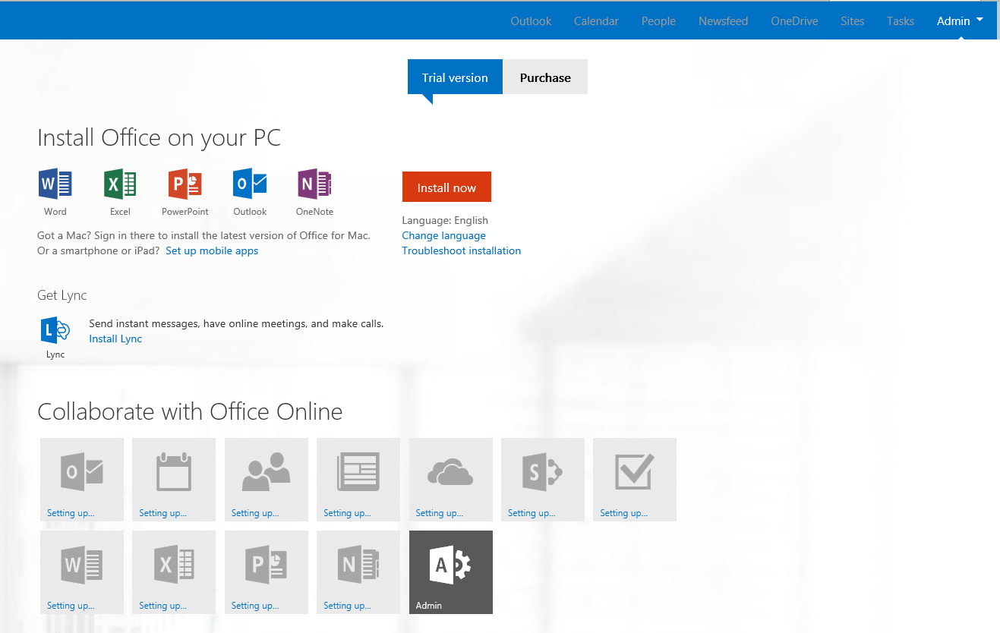
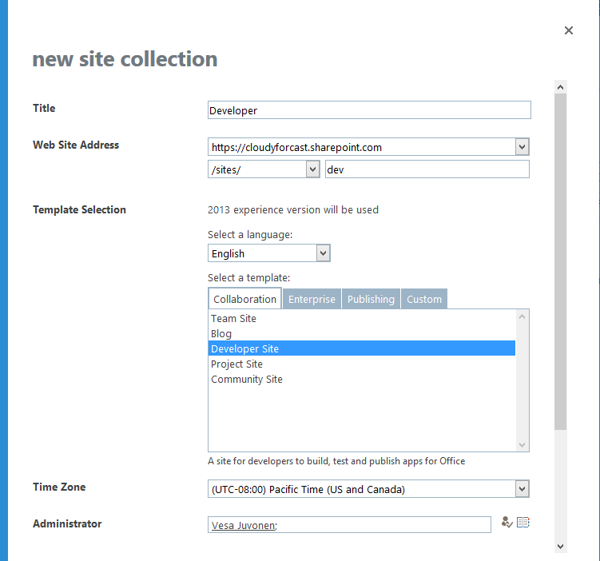

# Module 1 — Requesting Office365 Trial Tenant #
  
## Lab Environment ##
During this lab, you will provision a new Office365 tenant and set up the basic environment which will be used for other exercises.

### Before You Begin ###
The required prerequisite for this course is:

  - Internet connectivity
  
## Lab Overview ##
### Abstract ###
In this lab you will request a new Office365 trial tenant, which you will be using throughout out the training.
### Learning Objectives ###
After completing the exercises in this lab, you will be able to:

  - Request new trial tenants for your development actions.
  
**Estimated time to complete this lab: *15 minutes* (Actual provisioning could take a while, but will happen independently.) **
  
  
## Exercise 1: Provisioning New Office365 Tenants ##
  
### Request new tenant. ###
  
1. **Start** Internet Explorer 

2.  Browse to address http://office.microsoft.com/en-us/business/redir/XT103040319.aspx 
  a.  This is the trial request for E3 tenants. You can also find the link to this trial option from http://office.microsoft.com. 
  NOTE: The trial request page link may have moved since the writing of this lab. You may need to search for the link in the sub-pages under **Plans & Pricing.**
  

3.  Fill out the form with your personal information accordingly (phone number, email address , company name etc.) and click the ** next ** button below the form to move to next step. 
    

4.  Choose your username and password and click the ** Next ** button below then move to next step. 
    

5.  Enter your mobile phone number, click **Text me**
    
6.  You should be able to recive a register code in a few minutes. Put the code to text box click **Create my account**
    

7.  Remember the information and click the ** You're ready to go ** button below to start the provisioning process. 
  a.  Notice that this is a trial tenant which does not cause you any additional costs, and you don’t have to continue using it afterwards.
    
 
 
8.  Wait for the initial provisioning actions to be completed. This could take anywhere from a few minutes to a half an hour.
    

9.  Click on **SharePoint** from the **Admin** menu. The SharePoint option will be available from the menu, when the tenant provisioning is completed.
    

10.  Choose **Private Site Collection** from the **New** menu.
    

11.  Request new site collection with following settings and click **OK** to proceed with the developer site collection creation
  a.  Title – **Developer**
  b.  Web Site Address – **http://[yourtenant].sharepoint.com/sites/dev**
  c.  Template Selection – **Developer Site**
  d.  Administrator – Your admin account which was provisioned during the tenant provisioning
  e.  Storage Quota – **200 MB**
    
 
12.  Creation of the site collection will take a while, but after it has been created, you are ready to proceed with the actual training exercises.
  a.  Each of the exercise will use the just created developer site collection URL as the target site collection for testing and deploying, so you want to remember this URL during the exercises.

 
