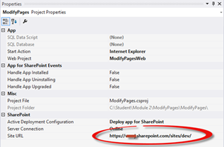
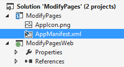
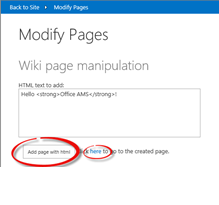
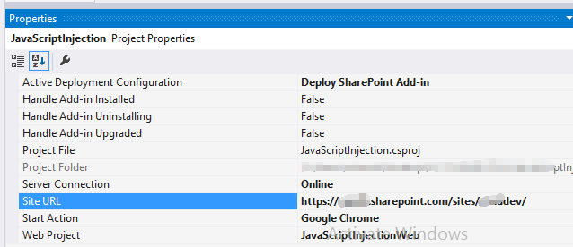
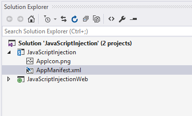
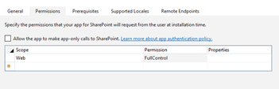
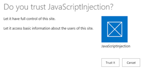
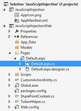
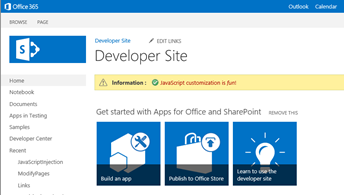
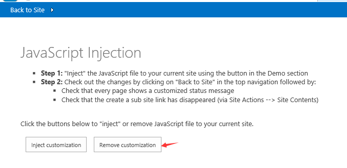

#Module 2 — Modification of SharePoint Sites Using SP Apps 


##Lab Environment 

During this lab, you will work in your own environment with your own Office365 tenant. The following prerequisites should be completed or be available before you start the lab. 

####Before You Begin 

To complete the labs in this course you need to install or configure the following items. 

* Access to an Office365 tenant with an existing developer site. (The [pre-requisite lab](../O3658-0 Requesting Office365 Trial Tenant/Lab.md) provides directions to complete this task.)
* Visual Studio 2015
* [Microsoft Office Developer Tools for Visual Studio 2015](https://www.visualstudio.com/vs/office-tools/)
* Download the [O3658-2 Demos](Demos/O3658-2 Demos). Note the location of these files. You will need these files to complete the labs.

##Lab Overview

###Abstract
In this lab you will learn how to modify wiki pages using SharePoint Apps.

###Learning Objectives
After completing the exercises in this lab, you will be able to:  

- Modify page layout of a site using SP add-in.
- Add web parts to the pages using CSOM.

**Estimated time to complete this lab: *15 minutes*.**

##Exercise 1: Modify Page Layout of a Site Using SP add-in

###Open the pre-created structure and test the initial deployment.

1. Start **Visual Studio 2015**.
2. Click **File | Open | Project/Solution**.
3. Browse to **O3658-2 Demos/ModifyPages** folder and open the existing solution named **ModifyPages.sln**.
  
  *	Note: The exact folder location is dependent on the folder that you copied the files to on your computer.

  
4.	Ensure that the **Site URL** property is correct for the add-in project by first activating the **ModifyPages** project. If you are prompted with the **Connect to SharePoint** dialog, close this window.

  
5.	Confirm the **Site URL** from the property window. This should point to your personal Office365 tenant and to the existing developer site collection which can be used for this exercise.

  
6.	Open **AppManifest.xml** from the add-in project.

  
7.	Select the **Permissions** tab, and adjust the permissions to require **FullControl** in **Web** scope if necessary.

  
8.	Press **F5** or choose **Debug—Start Debugging** to ensure the application is properly deployed.
9.	Log in to your test tenant by providing the correct user ID and password.

  

  * Note: If you have any challenges logging in from your corporate tenant, follow guidance from this support article: http://support.microsoft.com/kb/2507767.   
  *	If you receive security warnings click **Yes**. This may require you to log in again to your browser window.

10.	Click **Trust It**, when the trust notification is shown.

  
11.	You should now see the initial design for the add-in as follows.
  * Note: Actual implementation is missing from the buttons, but you can already see how the add-in will work.
12.	Navigate back to the Visual Studio window and press **Shift+F5** or choose **Stop Debugging** from the Debug menu.


###Add the needed code for creating a new page with the given configurations.

1.	Navigate to the **Solution View** and open **LabHelper.cs** to see few example methods and operations which we will use during the coding exercise.
  *	View the content of the **LabHelper.cs** carefully to understand what helper methods we will use in our exercise.

  

2. Navigate to the **Solution Explorer** and double-click the **Default.aspx.cs** file to see the starting point for adding the needed code. This can be found under **Pages – Default.aspx.cs**

  

3. Include following piece of code to the **btnCreateNewPage_Click** method.
  	```csharp
	  protected void btnCreateNewPage_Click(object sender, EventArgs e)
	  {
	      var spContext = SharePointContextProvider.Current.GetSharePointContext(Context);
	  
	      using (var ctx = spContext.CreateUserClientContextForSPHost())
	      {
	          string scenarioPage = String.Format("scenario1-{0}.aspx", DateTime.Now.Ticks);
	          string scenarioPageUrl = AddWikiPage(ctx, ctx.Web, "Site Pages", scenarioPage);
	          AddHtmlToWikiPage(ctx, ctx.Web, "SitePages", htmlEntry.Text, scenarioPage);
	          hplPage.NavigateUrl = string.Format("{0}/{1}", Request.QueryString["SPHostUrl"], scenarioPageUrl);
	      }
	  }
  	```
  
  *	Notice that we are currently missing the **AddWikiPage** and **AddHtmlToWikiPage** methods. We will add these next.
4. Include following piece of code to the **btnCreatePageWithWebPart_Click** method.
	```csharp
	protected void btnCreatePageWithWebPart_Click(object sender, EventArgs e)
	{
	
	  var spContext = SharePointContextProvider.Current.GetSharePointContext(Context);
	
	  using (var ctx = spContext.CreateUserClientContextForSPHost())
	  {
	      if (new LabHelper().AddList(ctx, ctx.Web, 170, new Guid("192efa95-e50c-475e-87ab-361cede5dd7f"), "Links", false))
	      {
	          new LabHelper().AddPromotedSiteLink(ctx, ctx.Web, "Links", "OfficeAMS on CodePlex", "http://officeams.codeplex.com");
	          new LabHelper().AddPromotedSiteLink(ctx, ctx.Web, "Links", "Bing", "http://www.bing.com");
	      }
	
	      string scenario2Page = String.Format("scenario2-{0}.aspx", DateTime.Now.Ticks);
	      string scenario2PageUrl = AddWikiPage(ctx, ctx.Web, "Site Pages", scenario2Page);
	
	      AddHtmlToWikiPage(ctx, ctx.Web, "SitePages", LabHelper.WikiPage_ThreeColumnsHeaderFooter, scenario2Page);
	
	      Guid linksID = new LabHelper().GetListID(ctx, ctx.Web, "Links");
	      WebPartEntity wp2 = new WebPartEntity();
	      wp2.WebPartXml = new LabHelper().WpPromotedLinks(linksID, string.Format("{0}/Lists/{1}", 
	                                                    Request.QueryString["SPHostUrl"], "Links"), 
	                                                    string.Format("{0}/{1}", Request.QueryString["SPHostUrl"], 
	                                                    scenario2PageUrl), "$Resources:core,linksList");
	      wp2.WebPartIndex = 1;
	      wp2.WebPartTitle = "Links";
	
	      new LabHelper().AddWebPartToWikiPage(ctx, ctx.Web, "SitePages", wp2, scenario2Page, 2, 1, false);
	      new LabHelper().AddHtmlToWikiPage(ctx, ctx.Web, "SitePages", htmlEntry.Text, scenario2Page, 2, 2);
	
	      this.hplPage2.NavigateUrl = string.Format("{0}/{1}", Request.QueryString["SPHostUrl"], scenario2PageUrl);
	  }
	}
	```
  
  *	Notice that we are currently missing the **AddWikiPage** and **AddHtmlToWikiPage** methods. We will add these next.
5.	Add following method below the button click event handler. This is for adding a new page to the site pages library.
	```csharp
	public string AddWikiPage(ClientContext ctx, Web web, string folder, string wikiPageName)
	{
	  string wikiPageUrl = "";
	  var pageLibrary = web.Lists.GetByTitle(folder);
	
	  ctx.Load(pageLibrary.RootFolder, f => f.ServerRelativeUrl);
	  ctx.ExecuteQuery();
	
	  var pageLibraryUrl = pageLibrary.RootFolder.ServerRelativeUrl;
	  var newWikiPageUrl = pageLibraryUrl + "/" + wikiPageName;
	  var currentPageFile = web.GetFileByServerRelativeUrl(newWikiPageUrl);
	  ctx.Load(currentPageFile, f => f.Exists);
	  ctx.ExecuteQuery();
	
	  if (!currentPageFile.Exists)
	  {
	      var newpage = pageLibrary.RootFolder.Files.AddTemplateFile(newWikiPageUrl, TemplateFileType.WikiPage);
	      ctx.Load(newpage);
	      ctx.ExecuteQuery();
	      wikiPageUrl = String.Format("sitepages/{0}", wikiPageName);
	  }
	  
	  return wikiPageUrl;
	}
	```

6.	Let us also add the following method just below previous one, so that we have completed the first phase.
	  ```csharp
	  public void AddHtmlToWikiPage(ClientContext ctx, Web web, string folder, string html, string page)
	  {
	      Microsoft.SharePoint.Client.Folder pagesLib = web.GetFolderByServerRelativeUrl(folder);
	      ctx.Load(pagesLib.Files);
	      ctx.ExecuteQuery();
	  
	      Microsoft.SharePoint.Client.File wikiPage = null;
	  
	      foreach (Microsoft.SharePoint.Client.File aspxFile in pagesLib.Files)
	      {
	          if (aspxFile.Name.Equals(page, StringComparison.InvariantCultureIgnoreCase))
	          {
	              wikiPage = aspxFile;
	              break;
	          }
	      }
	  
	      if (wikiPage == null)
	      {
	          return;
	      }
	  
	      ctx.Load(wikiPage);
	      ctx.Load(wikiPage.ListItemAllFields);
	      ctx.ExecuteQuery();
	  
	      string wikiField = (string)wikiPage.ListItemAllFields["WikiField"];
	  
	      Microsoft.SharePoint.Client.ListItem listItem = wikiPage.ListItemAllFields;
	      listItem["WikiField"] = html;
	      listItem.Update();
	      ctx.ExecuteQuery();
	  }
	  ```

7.	After the code has been added, we are able to test the scenario.

8.	Press **F5** or choose **Debug – Start Debugging** to ensure that the application is properly deployed.

  *	Log in to the site and test the functionality
9.	Click the **Add page with html** button and verify that the new page is created to host web with the specific html entry as defined in the add-in. Click the **here** link after the page has been created to see it.

  
  
  
  
  * Notice that the text written in text box has been added to the newly created page.
10.	Move back to Visual Studio size and press **Shift+F5** or choose **Stop Debugging** from the **Debug** menu

##Exercise 2: Use JavaScript Injection Pattern to Modify End User Experience on the Sites

###Open the pre-created structure and test the initial deployment.

1. Start **Visual Studio 2015.**
2. Click **File | Open Project.**

  
3. Move to the **O3658-2 Demos/JavaScriptInjection** folder and open the existing solution named  **JavaScriptInjection.sln**

  * Note: The actual folder location is dependent on where you copied the files to in your local computer.

  
4. Ensure that the **Site URL** property is correct for the add-in project by first activating the **JavaScriptInjection** project.
  * If you are prompted to connect to SharePoint, provide the appropriate login information in the window.

  
5. Confirm the Site URL from the property window. This this should be pointing to your personal Office365 tenant and to the existing developer site collection which can be used for the exercise creation.
  * If you are prompted to connect to SharePoint, provide the appropriate login information in the window.

  
6. Open **AppManifest.xml** from the add-in project.

  
7. Adjust the permission to require **FullControl** in **Web* scope.

  
8.	Press **F5** or choose **Debug – Start Debugging** to ensure that the application is properly deployed.

9.	Log in to your test tenant by providing the right user ID and password, if required.
  1. Note:  If you have any challenges logging in from your corporate tenant, follow guidance from this support article: http://support.microsoft.com/kb/2507767.

10. Click **Trust It**, when the trust notification appears.

  
11.	You should now see the initial design for the add-in as follows.
  *	Notice that actual implementation is missing from the buttons, but you can already see how the add-in will work.

  
12.	Move back to **Visual Studio** size and press **Shift+F5** or choose **Stop Debugging** from the **Debug** menu.

###Add the actual operations behind the buttons to wire up JavaScript on the page request process.

1. Move to Solution View and double-click the Default.aspx.cs file to see the starting point for adding the needed code. This file can be found under Pages – Default.aspx

  
2. Include the following piece of code to the **btnSubmit_Click** method.
	```csharp
	protected void btnSubmit_Click(object sender, EventArgs e)
	{
	  var spContext = SharePointContextProvider.Current.GetSharePointContext(Context);
	
	  using (var ctx = spContext.CreateUserClientContextForSPHost())
	  {
	      AddJsLink(ctx, ctx.Web);
	  }
	}
  ```

3. As you can see from the added code, we are calling an additional **AddJSLink** method, so let’s add that one below the button click.
  * We are accessing the user custom action collection of the host web and adding the reference to our custom existing JS file called **scenario1.js**. This way the JavaScript file is executed as part of each page call in host web.

	```csharp
	public void AddJsLink(ClientContext ctx, Web web)
	{
	string scenarioUrl = String.Format("{0}://{1}:{2}/Scripts", this.Request.Url.Scheme, 
	                                    this.Request.Url.DnsSafeHost, this.Request.Url.Port);
	string revision = Guid.NewGuid().ToString().Replace("-", "");
	string jsLink = string.Format("{0}/{1}?rev={2}", scenarioUrl, "scenario1.js", revision);
	
	StringBuilder scripts = new StringBuilder(@"
	    var headID = document.getElementsByTagName('head')[0]; 
	    var");
	
	scripts.AppendFormat(@"
	    newScript = document.createElement('script');
	    newScript.type = 'text/javascript';
	    newScript.src = '{0}';
	    headID.appendChild(newScript);", jsLink);
	string scriptBlock = scripts.ToString();
	
	var existingActions = web.UserCustomActions;
	ctx.Load(existingActions);
	ctx.ExecuteQuery();
	var actions = existingActions.ToArray();
	foreach (var action in actions)
	{
	    if (action.Description == "scenario1" &&
	        action.Location == "ScriptLink")
	    {
	        action.DeleteObject();
	        ctx.ExecuteQuery();
	    }
	}
	
	var newAction = existingActions.Add();
	newAction.Description = "scenario1";
	newAction.Location = "ScriptLink";
	
	newAction.ScriptBlock = scriptBlock;
	newAction.Update();
	ctx.Load(web, s => s.UserCustomActions);
	ctx.ExecuteQuery();
	}
	```

4. Move to Solution Explorer and double click the Scenario1.js located in the Scripts folder.
  * This file existed in the starting solution so we do not need to write the needed JavaScript to it.

  
5. Notice the following definitions on top of the JavaScript file.
  * These are used to ensure that JavaScript is executed even though MDS (Minimal Download Strategy) has been enabled on the used site. All out of the box team sites have this setting enabled.
	```javascript
	// Register script for MDS if possible
	RegisterModuleInit("scenario1.js", RemoteManager_Inject); //MDS registration
	RemoteManager_Inject(); //non MDS run
	```

6. The interesting part of the script is the following functional called RemoteManager_Inject.

  * This function is the one which is called during each page execution. We are demonstrating loading jQuery dynamically to the memory, and also its specific execution when the user is accessing the viewlsts.aspx page, where we hide certain elements dynamically.
	```javascript
	function RemoteManager_Inject() {
	
	    var jQuery = "https://ajax.aspnetcdn.com/ajax/jQuery/jquery-2.0.2.min.js";
	
	    // load jQuery 
	    loadScript(jQuery, function () {
	
	        var message = " <font color='#AA0000'>JavaScript customization is <i>fun</i>!</font>"
	        SP.SOD.executeOrDelayUntilScriptLoaded(function () { SetStatusBar(message); }, 'sp.js');
	
	        // Customize the viewlsts.aspx page
	        if (IsOnPage("viewlsts.aspx")) {
	            //hide the subsites link on the viewlsts.aspx page
	            $("#createnewsite").parent().hide();
	        }
	
	    });
	}
	```

7. Press **F5** or choose **Debug – Start Debugging** to ensure that application is properly deployed.
  * Log in to the site and test the functionality.

8. Click the **Inject Customization** button, which will execute the JavaScript injection code to the host web.

  
9. After button execution, click Back to Site in the top left corner to see how the customization works. Notice that we have an additional JavaScript notification present in each of the pages in the host web.

  
10. Navigate to the site contents of the host web by clicking **Site Contents** from the left menu. Notice how the **sub site creation** link is missing from the page.
11.	Move back to the **Visual Studio** side and press **Shift+F5** or choose **Stop Debugging** from the **Debug** menu.
12. Let us also implement the cleaning up operation for the page. Open default.aspx.cs one more time and locate btnRemove_Click method. Update the method as follows.
  * Notice that we are calling an additional method called **DeleteJSLink** for actual cleaning.
  
	```csharp
	protected void btnRemove_Click(object sender, EventArgs e)
	{
		var spContext = SharePointContextProvider.Current.GetSharePointContext(Context);
		
		using (var ctx = spContext.CreateUserClientContextForSPHost())
		{
		  DeleteJsLink(ctx, ctx.Web);
		}
	}
	```

13. Add the new DeleteJSLink method after the button click as follows.
  * We are looping through the UserCustomActions collection and removing the customization.
	```csharp
	public void DeleteJsLink(ClientContext ctx, Web web)
	{
		var existingActions = web.UserCustomActions;
		ctx.Load(existingActions);
		ctx.ExecuteQuery();
		var actions = existingActions.ToArray();
		foreach (var action in actions)
		{
		  if (action.Description == "scenario1" &&
		      action.Location == "ScriptLink")
		  {
		    action.DeleteObject();
		    ctx.ExecuteQuery();
		  }
		}
	}
	```

14. Press F5 or choose Debug – Start Debugging to ensure that the application is properly deployed.
  * Log in to the site and test the functionality.

15. Click Remove Customization button.

  

16.	After button execution, click Back to Site in the top left corner to verify that the customization has been removed.
  * Notice that the notification bar does not exist on the page anymore.
