# Module 3 - Branding Management with CAM Patterns #

###Lab Environment
During this lab, you will work in your own environment with your own Office365 tenant. Following pre-requisites should be completed or be available before you start the lab.

###Prerequisites

The required prerequisite for this course are:

* Basic skill set on managing Office365
* Access to an Office365 tenant with an existing developer site. (The [pre-requisite lab](../O3658-0 Requesting Office365 Trial Tenant/Lab.md) provides directions to complete this task.)
* Visual Studio 2013 Ultimate with Azure SDK v2.5
* Ensure you have configured a [local NuGet package repository](http://www.mbgreen.com/blog/2014/8/8/sharepoint-2013-apps-fail-on-nuget-package-restore) 
* Access to an existing Windows Azure tenant (to be used as the hosting platform for applications that are installed for a typical Office365 sites.) 
* SharePoint Designer 2013. 
* Download and install the latest version of the SharePoint online client SDK from following link - http://aka.ms/spocsom
* Download the [O3658-3 Demos.zip](Demos/O3658-3 Demos.zip) zip file by following the link and clicking on **Raw**, then extract it. Note the location of these files. You will need these files to complete the labs.

## Lab Overview ##
### Abstract ###
In this exercise you will create your own custom theme using the SharePoint Color Palette Tool, and then apply the theme from the provider hosted add-in to the host web.

### Learning Objectives ###
After completing the exercises in this lab, you will be able to:

* Use the SharePoint Color Palette Tool to create custom themes.
* Deploy the theme files to host web using SP add-in.
* Set a custom theme to the host web using CSOM.

**Estimated time to complete this lab: *15 minutes*.**

## Exercise 1: Build and Use Custom Themes to Brand the Sites from Apps ##

### Acquire and install theme develop software. ###

In this task you will install the required application to your computer to start creating custom themes for your Office365 sites. If you have already installed the SharePoint Color Palette Tool, you can move to the following task.

1. Open your __browser__ and move to following address to install the SharePoint Color Palette Tool. [http://www.microsoft.com/en-us/download/details.aspx?id=38182](http://www.microsoft.com/en-us/download/details.aspx?id=38182)
  
2. Click __Download__ button.
3. Click __Run__ when the browser asks What do you want to do with the __SharePointColorPaletteTool_Setup.msi__ file?
4. Click __Next__ to move forward with the installation.
5. Choose __I accept the terms in the license agreement__ in the __License Agreement__ stage and click __Next__.
6. You can change the installation location if needed or use the default location and click __Next__.
7. Click __Install__ on the __Ready to Install the Program__ page to start the actual installation.
8. Wait for the installation to complete and click __Finish__ to close the setup.

### Create the custom theme to be used in the exercise. ###

In this task you will create a custom theme to be used with the Office365 sites using the SharePoint Color Palette Tool.

1. Start the __SharePoint Color Palette Tool__ from your computer.  
The following picture shows the default start up status with the SharePoint Color Palette Tool.  
  
2. In the __Layout__ selection, choose __Seattle__.  
This will change the layout based on seattle.master.  
  
3. In the __Background Image__ section, click __Change__.  
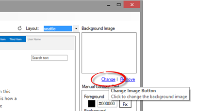  
4. Browse to the location where you have stored the student folder and choose custombg.jpg under __O3658-3 Demos/DeployCustomTheme/DeployCustomTheme/__ folder and click __Open__ to proceed.
5.  Click the __Color Button__ located just next to __Recolor__ button.  
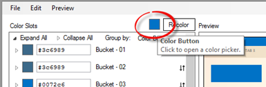  
6.  Set __Red__, __Green__, and __Blue__ values as follows.

    * Red - 235
    * Green - 188
    * Blue - 90

7.  Click __OK__ on the Color Picker.  
  
8. Click the __Recolor__ button right next to the color button.  
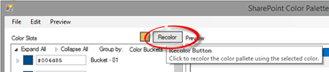  
9. Notice how the color scheme was completely changed and you can now see the new preview of the theme.  
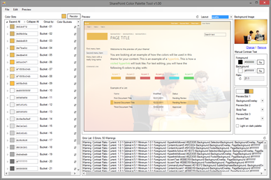  
10. Notice also that you can expand the left side color options to see the specific settings where the particular color is applied.  
Using this __Color Slots__ functionality, you can define specific colors for each of the site elements which are supported to be themed. In the following picture, we have expanded the Bucket 1 grouping to show the specific settings.  
  
11. Click __File | Save__ to save the created theme file to be used in following step.
12. Save the theme file to the __O3658-3 Demos/DeployCustomTheme__ folder, so that you can easily find it in following step. Name the file __custom.spcolor__.  
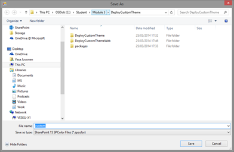  

Now we have created the needed theme file for the following task.

###Write the needed code to apply the theme to the host web from the provider hosted add-in.###

In this task we will take the theme file you just created with the background image and we will deploy and apply new theme to host web from provider hosted add-in.
1.  Start __Visual Studio 2013__.  
2.  Click __File | Open Project__.  
  
3.  Move to the __O3658-3 Demos/DeployCustomTheme__ folder and open the existing solution named __DeployCustomTheme.sln__.  
  * Notice that the actual folder location is dependent on where you copied the files to in your local computer.  

4. Provide your tenant login information when the __Connect to SharePoint__ dialog is prompted.  
  
5. Ensure that the __Site URL__ property is correct for the add-in project by first activating the __DeployCustomTheme__ project in the solution explorer.  
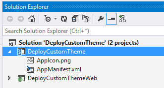  
6. Confirm the __Site URL__ from the property window. This this should be pointing to your personal Office365 tenant and to existing developer site collection which you could use for the exercise creation.  
  
7. Open __AppManifest.xml__ from the add-in project in the __Solution Explorer__.  
  
8. Move to the __Permissions__ tab.  
9. Adjust the permission to require __FullControl__ for __Web__ scope, so that we are able to manipulate the host web where the add-in is installed.  
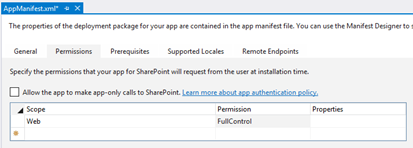  
10. Press __F5__ or choose __Debug | Start Debugging__ to ensure that the application can be properly deployed.  
11. Log in to your test tenant by providing the right user ID and password, if required.  
  
  * Note: If you have any challenges to logging in to your corporate tenant, follow guidance from this support article: [http://support.microsoft.com/kb/2507767](http://support.microsoft.com/kb/2507767).  
12. Click __Trust It__, when the trust notification for the oAuth permissions is shown.  
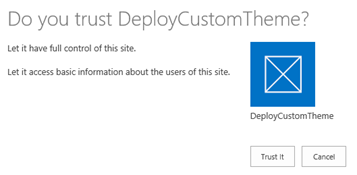  
13. You should now see the initial design for the add-in as follows.  
  * Notice that we will implement the actual functionality as an add-in part, so there will not be any actual code in the default.aspx file.  
  
14. Move back to the __Visual Studio__ side and press __Shift+F5__ or choose __Stop Debugging__ from the __Debug__ menu.

### Add the code to modify host web theme settings. ###

In this task we will add the needed code to modify the host web theme settings from the add-in side.

1. Move to the __Solution Explorer__, expand the __Pages__ folder, expand the __Default.aspx__ file, and open __default.aspx.cs__ to add the needed code for actual button clicks.  
  
2. First add the required __using__ statements to the top of the code page as follows.

  * This will ensure that the referenced SharePoint client CSOM can be easily accessed.

  ```csharp
    using Microsoft.SharePoint.Client;
    using System.Web.Hosting;
  ```

3. Update the __btnSetThemeForHost_Click__ method as follows for controlling the host web theming settings.

  * Notice that this code is calling the __SetThemeBasedOnName__ method, which we have not yet added.  

  ```c#
protected void btnSetThemeForHost_Click(object sender, EventArgs e)
{
    var spContext = SharePointContextProvider.Current.GetSharePointContext(Context);
    using (var clientContext = spContext.CreateUserClientContextForSPHost())
    {
        if (clientContext != null)
        {
            Web web = clientContext.Web;
            string selectedTheme = drpThemes.SelectedValue;
            SetThemeBasedOnName(web, selectedTheme);
            lblStatus1.Text = string.Format("Theme '{0}' has been applied to the <a href='{1}'>host web</a>.", selectedTheme, spContext.SPHostUrl.ToString());
        }
    }
}
  ```

4. Add following __SetThemeBasedOnName__ method below the button click.
  ```c#
public void SetThemeBasedOnName(Web web, string themeName)
{
    // Let's get instance to the composite look gallery
    List themeList = web.GetCatalog(124);
    web.Context.Load(themeList);
    web.Context.ExecuteQuery();

    // We are assuming that the theme exists
    CamlQuery query = new CamlQuery();
    string camlString = @"
        <View>
            <Query>
                <Where>
                    <Eq>
                        <FieldRef Name='Name' />
                        <Value Type='Text'>{0}</Value>
                    </Eq>
                </Where>
                </Query>
        </View>";
    // Let's update the theme name accordingly
    camlString = string.Format(camlString, themeName);
    query.ViewXml = camlString;
    var found = themeList.GetItems(query);
    web.Context.Load(found);
    web.Context.ExecuteQuery();
    if (found.Count > 0)
    {
        Microsoft.SharePoint.Client.ListItem themeEntry = found[0];
        //Set the properties for applying custom theme which was jus uplaoded
        string spColorURL = null;
        if (themeEntry["ThemeUrl"] != null && themeEntry["ThemeUrl"].ToString().Length > 0)
        {
            spColorURL = MakeAsRelativeUrl((themeEntry["ThemeUrl"] as FieldUrlValue).Url);
        }
        string spFontURL = null;
        if (themeEntry["FontSchemeUrl"] != null && themeEntry["FontSchemeUrl"].ToString().Length > 0)
        {
            spFontURL = MakeAsRelativeUrl((themeEntry["FontSchemeUrl"] as FieldUrlValue).Url);
        }
        string backGroundImage = null;
        if (themeEntry["ImageUrl"] != null && themeEntry["ImageUrl"].ToString().Length > 0)
        {
            backGroundImage = MakeAsRelativeUrl((themeEntry["ImageUrl"] as FieldUrlValue).Url);
        }
        // Set theme to host web
        web.ApplyTheme(spColorURL,
                            spFontURL,
                            backGroundImage,
                            false);

        // Let's also update master page, if needed
        if (themeEntry["MasterPageUrl"] != null && themeEntry["MasterPageUrl"].ToString().Length > 0)
        {
            web.MasterUrl = MakeAsRelativeUrl((themeEntry["MasterPageUrl"] as FieldUrlValue).Url);
        }
        // Execute the needed code
        web.Context.ExecuteQuery();
    }
}
  ```

5. Also add the following __MakeAsRelativeUrl__ helper function below the just added method.
  ```c#
private string MakeAsRelativeUrl(string urlToProcess)
{
    Uri uri = new Uri(urlToProcess);
    return uri.AbsolutePath;
}
  ```

6. Press __F5__ or choose __Debug | Start Debugging__ to see the latest changes.
7. Choose __Green__ from the theme option drop down and click __Deploy a custom theme__ for starting the host web modification.
8. Click the __host web__ link shown after the code has been executed.  
  
9. Verify that the theme has been changed in the host web accordingly.  
  
10. Move back to the __Visual Studio__ side and press __Shift+F5__ or choose __Stop Debugging__ from the __Debug__ menu.

### Add custom resources to the project and modify the code to deploy them to the host web. ###
In this task we will add the needed code to deploy our custom theme to the host web for using it, similarly to the out of the box themes in the previous task.

1. Right click the __DeployCustomThemeWeb__ project in the Solution Explorer to choose __Add - New Folder__.  
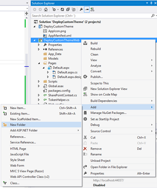  
2.  Name folder __Resources__.
3.  Right click the __Resources__ folder and choose __Add - Existing Item__.
4.  Move to the __O3658-3 Demos\DeployCustomTheme__ folder and choose both __custom.spcolor__ and __custombg.jpg__ using the __Ctrl__ button on the keyboard and clicking the files one-by-one.
5.  Activate __custom.spcolor__ in the Solution Explorer to view its properties.  
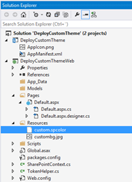  
6.  Set the __Copy to Output Directory__ as __Copy always__.  
  
7.  __Repeat__ the same steps for __custombg.jpg__.
8.  Move to the __Solution Explorer__, expand the __Pages__ folder, expand the __Default.aspx__ file, and open the default.aspx.cs to add the needed code to deploy the custom theme to the host web.
9.  Update the __btnDeployTheme_Click__ method as follows.
Notice that the code is using an additional method called __DeployContosoThemeToWeb__ to actually add the custom theme to host web.
  ```c#
protected void btnDeployTheme_Click(object sender, EventArgs e)
{
    var spContext = SharePointContextProvider.Current.GetSharePointContext(Context);

    using (var clientContext = spContext.CreateUserClientContextForSPHost())
    {
        if (clientContext != null)
        {
            Web web = clientContext.Web;
            // Let's first upload the custom theme to host web
            DeployContosoThemeToWeb(web, "MyCustomTheme",
                            HostingEnvironment.MapPath(string.Format("~/{0}", "Resources/custom.spcolor")),
                            string.Empty,
                            HostingEnvironment.MapPath(string.Format("~/{0}", "Resources/custombg.jpg")),
                            string.Empty);

            // Setting the Custom theme to host web
            SetThemeBasedOnName(web, "MyCustomTheme");
            lblStatus2.Text = string.Format("Custom theme called 'MyCustomTheme' has been uploaded and applied to the <a href='{0}'>host web</a>.", spContext.SPHostUrl.ToString());
        }
    }
}
  ```

10. Add the following __DeployContosoThemeToWeb__ method below the method which we updated on the previous step.  
Notice that this method uses two additional helper methods, which will be added in following steps.
  ```c#
public void DeployContosoThemeToWeb(Web web, string themeName, string colorFilePath, string fontFilePath, string backgroundImagePath, string masterPageName)
{
    Web rootWeb = web;
    // Deploy files one by one to proper location
    if (!string.IsNullOrEmpty(colorFilePath))
    {
        DeployFileToThemeFolderSite(web, colorFilePath);
    }
    if (!string.IsNullOrEmpty(fontFilePath))
    {
        DeployFileToThemeFolderSite(web, fontFilePath);
    }
    if (!string.IsNullOrEmpty(backgroundImagePath))
    {
        DeployFileToThemeFolderSite(web, backgroundImagePath);
    }
    // Let's also add entry to the Theme catalog. This is not actually required, but provides visibility for the theme option, if manually changed
    AddNewThemeOptionToSite(rootWeb, themeName, colorFilePath, fontFilePath, backgroundImagePath, masterPageName);
}
  ```

11. Add the following __DeployFileToThemeFolderSite__ method just below the previously added method.  
This is taking care of deploying the custom files to host web, which are then used to create the theme definition.
  ```c#
private void DeployFileToThemeFolderSite(Web web, string sourceAddress)
{
    // Get the path to the file which we are about to deploy
    string file = sourceAddress;

    List themesList = web.GetCatalog(123);
    // get the theme list
    web.Context.Load(themesList);
    web.Context.ExecuteQuery();
    Folder rootfolder = themesList.RootFolder;
    web.Context.Load(rootfolder);
    web.Context.Load(rootfolder.Folders);
    web.Context.ExecuteQuery();
    Folder folder15 = rootfolder;
    foreach (Folder folder in rootfolder.Folders)
    {
        if (folder.Name == "15")
        {
            folder15 = folder;
            break;
        }
    }

    // Use CSOM to upload the file to the web
    FileCreationInformation newFile = new FileCreationInformation();
    newFile.Content = System.IO.File.ReadAllBytes(file);
    newFile.Url = folder15.ServerRelativeUrl + "/" + System.IO.Path.GetFileName(sourceAddress);
    newFile.Overwrite = true;
    Microsoft.SharePoint.Client.File uploadFile = folder15.Files.Add(newFile);
    web.Context.Load(uploadFile);
    web.Context.ExecuteQuery();
}
  ```

12. We are still missing the __AddNewThemeOptionToSite__ method, which was used by previously added method, so add following below the just added method.
  ```c#
private void AddNewThemeOptionToSite(Web web, string themeName, string colorFilePath, string fontFilePath, string backGroundPath, string masterPageName)
{
    // Let's get instance to the composite look gallery
    List themesOverviewList = web.GetCatalog(124);
    web.Context.Load(themesOverviewList);
    web.Context.ExecuteQuery();
    // Do not add duplicate, if the theme is already there
    if (!ThemeEntryExists(web, themesOverviewList, themeName))
    {
        // if web information is not available, load it
        if (!web.IsObjectPropertyInstantiated("ServerRelativeUrl"))
        {
            web.Context.Load(web);
            web.Context.ExecuteQuery();
        }
        // Let's create new theme entry. Notice that theme selection is not available from UI in personal sites, so this is just for consistency sake
        ListItemCreationInformation itemInfo = new ListItemCreationInformation();
        Microsoft.SharePoint.Client.ListItem item = themesOverviewList.AddItem(itemInfo);
        item["Name"] = themeName;
        item["Title"] = themeName;
        if (!string.IsNullOrEmpty(colorFilePath))
        {
            item["ThemeUrl"] = URLCombine(web.ServerRelativeUrl, string.Format("/_catalogs/theme/15/{0}", System.IO.Path.GetFileName(colorFilePath)));
        }
        if (!string.IsNullOrEmpty(fontFilePath))
        {
            item["FontSchemeUrl"] = URLCombine(web.ServerRelativeUrl, string.Format("/_catalogs/theme/15/{0}", System.IO.Path.GetFileName(fontFilePath)));
        }
        if (!string.IsNullOrEmpty(backGroundPath))
        {
            item["ImageUrl"] = URLCombine(web.ServerRelativeUrl, string.Format("/_catalogs/theme/15/{0}", System.IO.Path.GetFileName(backGroundPath)));
        }
        // we use seattle master if anythign else is not set
        if (string.IsNullOrEmpty(masterPageName))
        {
            item["MasterPageUrl"] = URLCombine(web.ServerRelativeUrl, "/_catalogs/masterpage/seattle.master");
        }
        else
        {
            item["MasterPageUrl"] = URLCombine(web.ServerRelativeUrl, string.Format("/_catalogs/masterpage/{0}", Path.GetFileName(masterPageName)));
        }

        item["DisplayOrder"] = 11;
        item.Update();
        web.Context.ExecuteQuery();
    }
}
  ```

13. Also add the following helper methods to the code file.
  ```c#
private bool ThemeEntryExists(Web web, List themeList, string themeName)
 {

     CamlQuery query = new CamlQuery();
     string camlString = @"
                <View>
                    <Query>
                        <Where>
                            <Eq>
                                <FieldRef Name='Name' />
                                <Value Type='Text'>{0}</Value>
                            </Eq>
                        </Where>
                     </Query>
                </View>";
     // Let's update the theme name accordingly
     camlString = string.Format(camlString, themeName);
     query.ViewXml = camlString;
     var found = themeList.GetItems(query);
     web.Context.Load(found);
     web.Context.ExecuteQuery();
     if (found.Count > 0)
     {
         return true;
     }
     return false;
 }

 private string URLCombine(string baseUrl, string relativeUrl)
 {
     if (baseUrl.Length == 0)
         return relativeUrl;
     if (relativeUrl.Length == 0)
         return baseUrl;
     return string.Format("{0}/{1}", baseUrl.TrimEnd(new char[] { '/', '\\' }), relativeUrl.TrimStart(new char[] { '/', '\\' }));
 }
  ```

14. Press __F5__ or choose __Debug | Start Debugging__ to see the latest changes.
15. Click the __Deploy a custom theme__ button on the add-in page.
16. Click the __host web__ link shown after the button click has been processed to verify that the host web has been changed.
17. Notice how the previously created custom theme has been applied to the host web with specific graphics.  
  

## Exercise 2: Use Design Manager and Design Packages to Provide Custom Branding for Your Sites ##

### Abstract ###

In this exercise you will practice using the Design Manager, and learn how it is used to build design packages for publishing sites.

### Learning Objectives ###

After completing this exercise, you will be able to:

* Use Design Package to create master pages from existing html layouts.
* Export design packages from site for reuse and move it to a new site collection.

**Estimated time to complete this lab: *15 minutes*.**

### Activate publishing features on the developer site for design packages. ###

In this task, you will configure your Office365 environment to enable the publishing features, and set up structured navigation.

1. Navigate to your Office365 developer site.
2. In the top right section of the page, click the gear icon and choose __Site settings__.  
  
3. In the site settings page, under Site Collection Administration, click Site collection features.
4. If the SharePoint Server Publishing Infrastructure feature is not active, click the Activate button to enable the feature.  
  
5. In the top right section of the page, click the gear icon and choose __Site settings__.
6. In the site settings page, under __Site Actions__, click __Manage site features__.
7. If the __SharePoint Server Publishing__ feature is not active, click __Activate__ to enable the feature.  
  

### Create the design package. ###

In this task you will upload the raw non-SharePoint design assets to the SharePoint site.
1. Open Internet Explorer and navigate to your Office365 developer site. This site should have the publishing features enabled.  If not, go back to Exercise 1, Task 1 in this lab and follow instructions to enable the publishing features on your developer site.
2. Using the gear icon in the top-right corner, go to the __Site Settings__ page.
3. Under the __Look and Feel__ grouping, select the __Design Manager__ link.  
  
4. The Design Manager is a wizard-based experience.  
  
5. On the second bullet, we have the option to __Pick a pre-installed look__. Click this link to open the __Change the Look__ page.
6. Choose a pre-installed design, such as __Red__.  
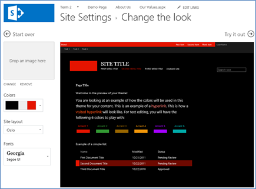  
7. You can change the background image, colors, and font, and use the __Try it out__ link to preview your changes.  By default, there are only two Site Layout options:  __Oslo__ and __Seattle__.
8. Go back to __Design Manager__ and click step 2, __Manage Device Channels__.  
### Manage Device Channels. ###

By default, SharePoint Online is configured to use mobile views. You can create a new Windows Phone project in Visual Studio and run the project to start the emulator. Once the emulator starts, you can open the browser and navigate to your Office365 site.
1.  Open __Visual Studio__.  
2.  Choose __File | New Project__.  
  
3. Choose __Window Phone App__ as the template and give project a random name.  
  
4. Click __OK__.  
5. Click __F5__ or choose __Debug | Start debugging__.  
6. Click __OK__ for possible Internet access and permission requests.  
7. Click the __Windows__ button in the emulator to move to the start page and start __Internet Explorer__.  
8.  Move to address [https://yourtenant.sharepoint.com](https://yourtenant.sharepoint.com) using the browser emulator browser and see the difference.  
Notice that you can just as well use your own mobile phone to directly access the Office365 in the cloud to see the difference.  


  
__IMPORTANT: The emulator does not recognize keyboard input, so you will have to use the mouse to type. If you are presenting this as a demo, consider using a webcam and use the camera add-in in Windows 8 to demonstrate.__
9.  Go back to the Design Manager and click __2. Manage Device Channels__.  
10. Click __Create a channel__. Use the following values:

* Name - __Windows Phone__
* Alias - __WindowsPhone__
* Device Inclusion Rules - __Windows Phone OS__
* Active - __Checked__  

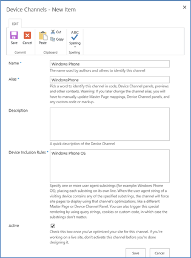  
11. Click __Save__ to save your work.  
12. You could now try to go to step 6 to publish and apply design and associate your device channel with a specific master page. However, SharePoint Online is configured by default to use the __Mobile Browser View__ feature.  
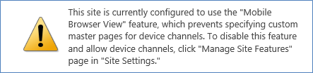  
13. To test the Design Manager with device channels, can go to __Site Settings__ and disable the site feature.
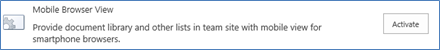  
14. Once this is disabled, go back to the page (retype the URL to stop using the mobile view) and see that we now have a full desktop experience.  
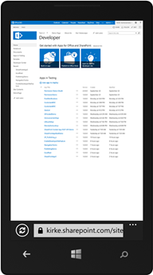  
15. We will use our device channel as we progress through the wizard.

### Upload design files to site collection ###

1.  Files can be manually uploaded or copied using a mapped folder. Before doing this, simplify the demo experience by turning off content approval, check in/out requirements, and versioning on the Master Page Gallery:
  1. Using the gear icon in the top-right corner, go to the __Site Settings__ page.
  2. Under the __Web Designer Galleries__ grouping, select the __Master Pages and Page Layouts__ link.
  3. Within the __Master Page Gallery__, use the ribbon to select the __Library__ tab and click the __Library Settings__ button.
  4. On the library settings page select __Versioning Settings__ from the __General Settings__ column.
  5. Change the following settings and click __OK__:
    1. __Content Approval__: No
    2. __Document Version History__: No Versioning
    3. __Require Checkout__: No
2.  Map the Master Page Gallery location as a network drive from step 3 in the Design Manager:
  1. Copy the URL (https://YourTenant.SharePoint.com/sites/dev/_catalogs/masterpage) to the clipboard.  
  2. Open __Windows Explorer__ (Start > All Programs > Accessories > Windows Explorer).
  3. Click __Computer__ in the left-hand panel and then click the __Map Network Drive__ label:  
    
  4. In the __Map Network Drive__ dialog, click the link __Connect to a Web site that you can use to store your documents and pictures__.
  5. In the __Add Network Location__ dialog, click __Next__. 
  6. Click __Choose a custom network location__ and click __Next__.
  7. Paste the URL of the __Master Page Gallery__ and click __Next__. You may be prompted to log in to confirm you can access the folder: Master page gallery would be in format of https://yourtenant.sharepoint.com/sites/dev/_catalogs/masterpage/  
    
  8. When prompted, accept the default name of the location and click __Next__ and finally __Finish__ to complete the wizard.

__IMPORTANT: The URL from step 3 in Design Manager includes _catalogs/masterpage.  Occasionally you will receive errors when attempting to map to this location.  If so, try using the URL with just _catalogs as shown in the picture.__

3. With a mapped folder created for the Master Page Gallery, copy all the contents from the __O3658-3 Demos/DesignManager__ folder included with the student files in this demo into the Master Page Gallery.

### Convert the HTML Master Page to a SharePoint Master Page. ###

In this task you will convert one of the files you uploaded in the previous step to a SharePoint master page.
1.  In the __Design Manager__, click on step 4: __Edit Master Pages__.  
2.  The __Design Manager: Edit Master Pages__ page will show all master pages in the Master Page Gallery. You need to convert your HTML file that was previously uploaded to a SharePoint master page. Click the __Convert an existing HTML master page__ link.  
3.  Select the __ContosoMasterDesign.html__ file and click __Insert__. Make sure you select the row and don’t click on the actual file link as clicking the link will take you to that file.  
4.  Accept and click through any a prompts you receive and refresh the page until you see the __ContosoMasterDesign__ show up on the page with a status of __Conversion successful__.  
  
5. Click the __Conversion successful__ link for the __ContosoMasterDesign__ to open the preview page.  
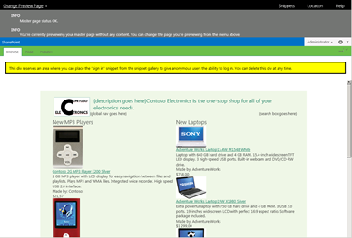  

### Customize and Preview the SharePoint Master Page in Notepad ###

In this task you will customize and preview the changes to your master page in a tool that knows nothing about SharePoint: Notepad.

1.  Open __Notepad (Start -> All Programs -> Accessories -> Notepad)__ and open the __ContosoMasterPage.html__ file from the mapped network drive. Ensure you don’t open the *.master version of this file… only the *.html version.  
2.  Jump to line __120__ (using the __CTRL+G__ shortcut) and add the following code and save your changes:
  ```
  <h1>Hello World</h1>
  ```

3.  Go back to the browser that has the preview open and refresh the page to see the changes immediately take effect:  
  
4. This simple change shows how the preview experience works. Remove the line you just added and save the page.
5. Add in global navigation for the site using the Snippet Gallery:
  1. In the master page preview, click the __Snippets__ link in the top-right of the page to launch the __Snippet Gallery__.
  2. In the __Snippet Gallery__, select the __Top Navigation__ button from the __Design__ tab in the ribbon and select the __0 Flyouts, start from root node__ options. Click __Update__ to apply your changes to the snippet.  
  
  3. Click the __Copy to Clipboard__ button under the __HTML Snippet__ to copy the HTML generated by the Snippet Gallery.
  4. Go back to Notepad and replace the following text with the HTML you copied to the clipboard and save your changes:  
__{global nav goes here}__
  5. Go back to the master page preview and refresh the page. You should now see the live navigation being added to the page:  
  
6. Add the search box to the master page.
  1. Jump back to the __Snippet Gallery__.
  2. Click the __Search Box__ button in the Design tab of the ribbon.
  3. Click the __Copy to Clipboard__ button under the __HTML Snippet__ to copy the HTML generated by the Snippet Gallery.
  4. Go back to Notepad and replace the following text with the HTML you copied to the clipboard and save your changes:
  __{search box goes here}__
7. Go back to the master page preview and refresh the page. You should now see the live search box being added to the page:
8. Lastly, move the __ContentPlaceholderMain__ control into the area where the rendered content should appear.
  1. In Notepad, find the following HTML comment in the master page:
  ```html
<!--end title area-->
  ```

  2. Immediately following that title you will see a `<DIV>` followed by a ``<TABLE>``. The ``<TABLE>`` contains the static content used in the designer generated master page. Delete this entire table (it starts around line 135 and goes to around line 287).
  3. Jump to the bottom of the master page source. You should a block of HTML that starts with the following markup:
  ```html
<div name="ContentPlaceHolderMain">
  ```

  4. Select the entire ``<DIV>`` and its contents and paste it where the ``<TABLE>`` was that you just removed.
  5. Finally, look for HTML within the ``<DIV>`` you just moved that starts with this:
  ```html
<div class="DefaultContentBlock" style="border:medium black solid; background:yellow; color:black; margin:20px; padding:10px;">
This div, which you should delete, represents the content area that your Page Layouts and pages will fill. Design your Master Page around this content placeholder.
</div>
  ```

  6. Delete the markup listed above. This was added by SharePoint to highlight where your dynamic content should appear.
  7. Save your changes.
9.  Go back to the master page preview and refresh the page. You should no longer see the static content:  
  

### Set the Publishing Site to Use the new master page. ###

In this task you will configure the Publishing site to use the new master page you have created.
1. Go to the Design Manager and choose __7. Publish and Apply Design__.  
2. Click the link to __Assign master pages to your site based on device channel__.  
3. Use the gear icon in the top-right corner of the page to jump to the __Site Settings__ page.  
4. Under the __Look and Feel__ grouping, select __Master Page__.  
5. Change the __Site Master Page__ for __Default__ to __ContosoMasterDesign__ and set __Windows Phone__ to __Seattle__. Click __OK__.  
  
6. Go back to the homepage of the site to see how your master page is now being used as the site master page.
  
7. Click on the About Us link and edit the page. Notice the content placeholder is now part of the page.
  
8. Open the page using a Windows Phone (not the emulator). Notice that it continues to use the other layout.  
  