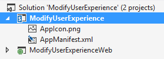
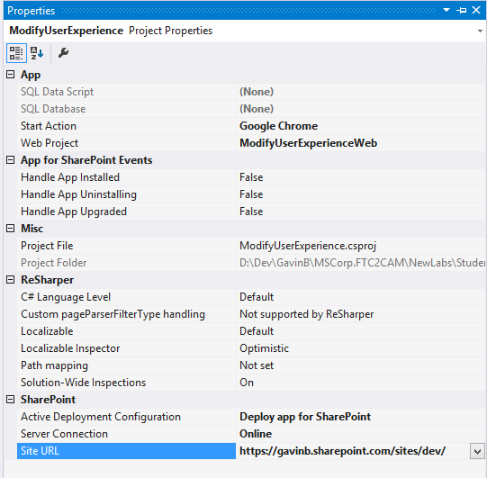
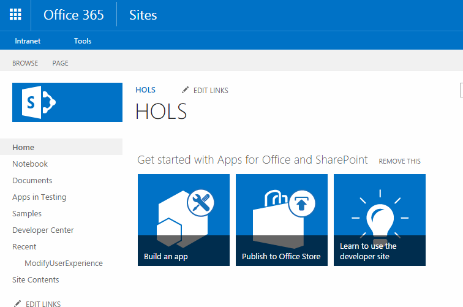
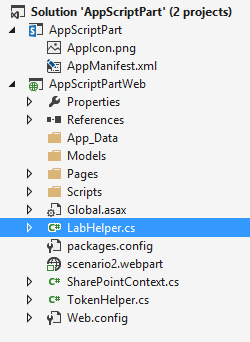
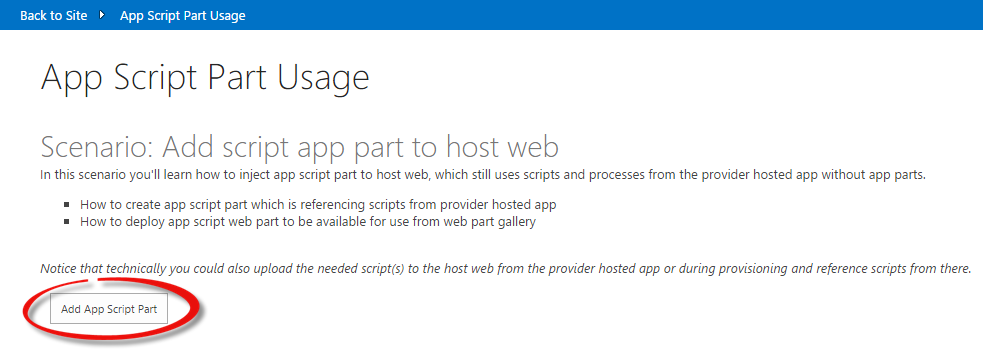

# Module 4 — Modification of SharePoint User Experience #
  
## Lab Environment ##
During this lab, you will work in your own environment with your own Office365 tenant. The following prerequisites should be completed or be available before you start the lab.
### Before You Begin ###
To complete the labs in this course you need to install or configure the following items.

* Access to an Office365 tenant with an existing developer site. (The [pre-requisite lab](../O3658-0 Requesting Office365 Trial Tenant/Lab.md) provides directions to complete this task.)
* Visual Studio 2013 Ultimate with Azure SDK v2.5
* Ensure you have configured a [local NuGet package repository](http://www.mbgreen.com/blog/2014/8/8/sharepoint-2013-apps-fail-on-nuget-package-restore) 
* Access to an existing Windows Azure tenant (to be used as the hosting platform for applications that are installed for a typical Office365 sites.) 
* SharePoint Designer 2013. 
* Download the [O3658-4 Demos.zip](Demos/O3658-4 Demos.zip) zip file by following the link and clicking on **Raw**, then extract it. Note the location of these files. You will need these files to complete the labs.
  
## Lab Overview ##
### Abstract ###
In this lab you will learn how to modify SharePoint User Experience using SharePoint Apps.
### Learning Objectives ###
After completing the exercises in this lab, you will be able to:
  - Perform JavaScript injection using SP add-in.
  - Make changes to the SharePoint User Experience via DOM manipulation.
  
**Estimated time to complete this lab: *15 minutes*.**
  
  
## Exercise 1: Modify User Experience of a Site Using SP add-in ##
  
### Open the pre-created structure and test the initial deployment. ###
  
  1. Start **Visual Studio 2013.**
  2. Click **File | Open Project.** 
    
    
  3. Move to the **O3658-4 Demos/ModifyUserExperience** folder and open the existing solution named  **ModifyUserExperience.sln.**
    * Note: The actual folder location is dependent on where you copied the files to in your local computer. 
    
    
  4. Ensure that the **Site URL** property is correct for the add-in project by first activating the **ModifyUserExperience** project.
    * If you are prompted to connect to SharePoint, provide the appropriate login information in the window.
    
    
  5. Confirm the **Site URL** from the property window. This this should be pointing to your personal Office365 tenant and to the existing developer site collection which can be used for the exercise creation.
    * If you are prompted to connect to SharePoint, provide the appropriate login information in the window.
    
    
  6. Open **AppManifest.xml** from the add-in project.
  
    
  7. Adjust the permission to require **FullControl** in **Web** scope.
  
    
  8. Press **F5** or choose **Debug – Start Debugging** to ensure that the application is properly deployed.
  9. Log in to your test tenant by providing the right user ID and password, if required.
  
     
    * Note:  If you have any challenges logging in from your corporate tenant, follow guidance from this support article: http://support.microsoft.com/kb/2507767. 
  10. Click Trust It, when the trust notification appears.
  
    
  11. You should now see the initial design for the add-in as follows.
    * Notice that actual implementation is missing from the buttons, but you can already see how the add-in will work. 
  
    
  12.	Move back to the **Visual Studio** window and press **Shift+F5** or choose **Stop Debugging** from the **Debug** menu.
  
### Add the actual operations behind the buttons to wire up JavaScript on the page request process. ###

1. Move to **Solution View** and double-click the **Default.aspx.cs** file to see the starting point for adding the needed code. This file can be found under **Pages – Default.aspx**

  
2. Include the following piece of code to the **btnSubmit_Click** method.
  ```csharp
	protected void btnSubmit_Click(object sender, EventArgs e)
	{
		var spContext = SharePointContextProvider.Current.GetSharePointContext(Context);

		using (var ctx = spContext.CreateUserClientContextForSPHost())
		{
			AddJsLink(ctx, ctx.Web);
			lblStatus.Text = string.Format("Second level navigation injection has been applied to the <a href='{0}'>host web</a>.", spContext.SPHostUrl.ToString());
		}
	}
  ```
3. As you can see from the added code, we are calling an additional **AddJSLink** method, so let’s add that one below the button click.

  * We are accessing the user custom action collection of the host web and adding the reference to our custom existing JS file called **scenario1.js**. This way the JavaScript file is executed as part of each page call in host web.
  ```csharp
	public void AddJsLink(ClientContext ctx, Web web)
	{
		string scenarioUrl = String.Format("{0}://{1}:{2}/Scripts", this.Request.Url.Scheme,
											this.Request.Url.DnsSafeHost, this.Request.Url.Port);
		string revision = Guid.NewGuid().ToString().Replace("-", "");
		string jsLink = string.Format("{0}/{1}?rev={2}", scenarioUrl, "scenario1.js", revision);

		StringBuilder scripts = new StringBuilder(@"
			var headID = document.getElementsByTagName('head')[0]; 
			var");

		scripts.AppendFormat(@"
			newScript = document.createElement('script');
			newScript.type = 'text/javascript';
			newScript.src = '{0}';
			headID.appendChild(newScript);", jsLink);
		string scriptBlock = scripts.ToString();

		var existingActions = web.UserCustomActions;
		ctx.Load(existingActions);
		ctx.ExecuteQuery();
		var actions = existingActions.ToArray();
		foreach (var action in actions)
		{
			if (action.Description == "injectnavigation" &&
				action.Location == "ScriptLink")
			{
				action.DeleteObject();
				ctx.ExecuteQuery();
			}
		}

		var newAction = existingActions.Add();
		newAction.Description = "injectnavigation";
		newAction.Location = "ScriptLink";

		newAction.ScriptBlock = scriptBlock;
		newAction.Update();
		ctx.Load(web, s => s.UserCustomActions);
		ctx.ExecuteQuery();
	}
  ```
4. Move to Solution Explorer and double click the **scenario1.js** located in the **Scripts** folder.
  * This file existed in the starting solution so we do not need to write the needed JavaScript to it.

  
5. Notice the following definitions on top of the JavaScript file.
  * These are used to ensure that JavaScript is executed even though MDS (Minimal Download Strategy) has been enabled on the used site. All out of the box team sites have this setting enabled.

  ```javascript
  // Register script for MDS if possible
  RegisterModuleInit("scenario1.js", RemoteManager_Inject); //MDS registration
  RemoteManager_Inject(); //non MDS run
  ```
6. The interesting parts of the script are the following functions called **RemoteManager_Inject** and **injectLinks**.
  * This function is the one which is called during each page execution. We are demonstrating loading jQuery dynamically to the memory and then calling the **injectLinks** function.

  ```javascript
	function RemoteManager_Inject() {

		var jQuery = "https://ajax.aspnetcdn.com/ajax/jQuery/jquery-2.0.2.min.js";

		// inject jQuery script tag into head and then call injectLinks
		loadScript(jQuery, function () {
			injectLinks();
		});
	}
  ```
  * The **injectLinks** function makes use of HTML5 Local Storage to cache the additional navigation that is to be injected into the site. At present the implementation of **buildNavigation** simply provides static navigation items to be injected, this could be wired up to leverage a Navigation Term Set or another data source in practice.
  
  ```javascript
	function injectLinks() {
		//assigning another alias to jQuery prevents issues if another script is using the $ variable.
		var $s = jQuery.noConflict();
		$s(document).ready(function () {
			// Get localstorage last updated timestamp values if they exist             
			timeStamp = localStorage.getItem("navTimeStamp");
			secondaryNavHtml = localStorage.getItem("navigation");
			// If nothing in localstorage
			if (timeStamp === "" || timeStamp == null || secondaryNavHtml ==="" || secondaryNavHtml == null) {
				// Key expired - Rebuild secondary navigation here and refresh key expiration
				buildNavigation();

				// Set timestamp for expiration
				currentTime = Math.floor((new Date().getTime()) / 1000);
				localStorage.setItem("navTimeStamp", currentTime);
			}
				// Check for expiration. If expired, rebuild navigation 
			else if (isKeyExpired("navTimeStamp")) {
				// Key expired - Rebuild secondary navigation here and refresh key expiration
				buildNavigation();

				// Set timestamp for expiration
				currentTime = Math.floor((new Date().getTime()) / 1000);
				localStorage.setItem("navTimeStamp", currentTime);
			}

			// Inject secondary navigation bar, check for ribbon element depends on site type: OD4B vs SP
			if ($s('#mysite-ribbonrow').length === 0) {
				$s('#s4-ribbonrow').before(secondaryNavHtml);
			}
			else{
				$s('#mysite-ribbonrow').before(secondaryNavHtml);
			}
		});
	}
  ```
7. Press **F5** or choose **Debug – Start Debugging** to ensure that application is properly deployed.
  * Log in to the site and test the functionality.
8. Click the **Inject second level navigation** button, which will execute the JavaScript injection code to the host web.

  
9. After button execution, click **Back to Site** in the top left corner to see how the customization works. Notice that we have an additional navigation bar present between the ribbon and the Suite Navigation.

  

10. Move back to the **Visual Studio** side and press **Shift+F5** or choose **Stop Debugging** from the **Debug** menu.
11. Let us also implement the cleaning up operation for the page. Open **default.aspx.cs** one more time and locate **btnRemove_Click** method. Update the method as follows.
  * Notice that we are calling an additional method called **DeleteJSLink** for actual cleaning.

  ```csharp
	protected void btnRemove_Click(object sender, EventArgs e)
	{
		var spContext = SharePointContextProvider.Current.GetSharePointContext(Context);

		using (var ctx = spContext.CreateUserClientContextForSPHost())
		{
			DeleteJsLink(ctx, ctx.Web);
			lblStatus.Text = string.Format("Second level navigation injection has been removed from the <a href='{0}'>host web</a>.", spContext.SPHostUrl.ToString());
		}
	}
  ```
12. Add the new **DeleteJSLink** method after the button click as follows.
  * We are looping through the **UserCustomActions** collection and removing the customization.
  
  ```csharp
	public void DeleteJsLink(ClientContext ctx, Web web)
	{
		var existingActions = web.UserCustomActions;
		ctx.Load(existingActions);
		ctx.ExecuteQuery();
		var actions = existingActions.ToArray();
		foreach (var action in actions)
		{
			if (action.Description == "injectnavigation" &&
				action.Location == "ScriptLink")
			{
				action.DeleteObject();
				ctx.ExecuteQuery();
			}
		}
	}
  ```
13. Press **F5** or choose **Debug – Start Debugging** to ensure that the application is properly deployed.

  * Log in to the site and test the functionality.
14. Click **Remove second level navigation** button. 

15. After button execution, click **Back to Site** in the top left corner to verify that the customization has been removed.
  * Notice that the notification bar does not exist on the page anymore.

  
## Exercise 2: Add an Add-In Script Web Part using SP Apps ##
  
### Open the pre-created structure and test the initial deployment. ###

1. Start **Visual Studio 2013.**
2. Click **File | Open Project.** 
  
  
3. Move to the **O3658-4 Demos/AppScriptPart** folder and open the existing solution named  **AppScriptPart.sln.**
  * Note: The actual folder location is dependent on where you copied the files to in your local computer. 
  
  
4. Ensure that the **Site URL** property is correct for the add-in project by first activating the **AppScriptPart** project.
  * If you are prompted to connect to SharePoint, provide the appropriate login information in the window.
  
  
5. Confirm the **Site URL** from the property window. This this should be pointing to your personal Office365 tenant and to the existing developer site collection which can be used for the exercise creation.
  * If you are prompted to connect to SharePoint, provide the appropriate login information in the window.
  
  
6. Open **AppManifest.xml** from the add-in project.

  
7. Adjust the permission to require **FullControl** in **Tennant** scope.

  
8. Press **F5** or choose **Debug – Start Debugging** to ensure that the application is properly deployed.
9. Log in to your test tenant by providing the right user ID and password, if required.

   
  * Note:  If you have any challenges logging in from your corporate tenant, follow guidance from this support article: http://support.microsoft.com/kb/2507767. 
10. Click Trust It, when the trust notification appears.

  
11. You should now see the initial design for the add-in as follows.
  * Notice that actual implementation is missing from the buttons, but you can already see how the add-in will work. 

  
12.	Move back to the **Visual Studio** window and press **Shift+F5** or choose **Stop Debugging** from the **Debug** menu.

### Add the actual operations behind the button to add the Add-In Script Web Part to the host web. ###
  
1. Move to **Solution View** and double-click the **Default.aspx.cs** file to see the starting point for adding the needed code. This file can be found under **Pages – Default.aspx**

  
2. Include the following piece of code to the **btnScenario_Click** method.  
  ```csharp
	protected void btnScenario_Click(object sender, EventArgs e)
	{
		var spContext = SharePointContextProvider.Current.GetSharePointContext(Context);
		using (var clientContext = spContext.CreateUserClientContextForSPHost())
		{
		    //Grab the web part gallery folder for uploading
		    var folder = clientContext.Web.Lists.GetByTitle("Web Part Gallery").RootFolder;
		    clientContext.Load(folder);
		    clientContext.ExecuteQuery();


		    //open the "scenario2.webpart" file
		    ListItem item;
		    using (var fileReadingStream = System.IO.File.OpenRead(
		                    Server.MapPath("~/scenario2.webpart")))
		    {
		        using (var workingCopy = new MemoryStream())
		        {
		            //read the file into an in memory stream for editing
		            fileReadingStream.CopyTo(workingCopy);
		            LabHelper.SetJsLink(workingCopy, this.Request);
		            //Reset the stream position for use during the upload
		            workingCopy.Position = 0;
		            //Use the FileCreationInformation to upload the new file
		            FileCreationInformation fileInfo = new FileCreationInformation();
		            fileInfo.ContentStream = workingCopy;
		            fileInfo.Overwrite = true;
		            fileInfo.Url = "scenario2.webpart";
		            File file = folder.Files.Add(fileInfo);
		            //Get the list item associated with the newly uploaded file
		            item = file.ListItemAllFields;
		            clientContext.Load(file.ListItemAllFields);
		            clientContext.ExecuteQuery();
		        }
		    }

		    // Let's update the group for the uploaded web part
		    var list = clientContext.Web.Lists.GetByTitle("Web Part Gallery");
		    if (item == null)
		    {
		        lblStatus.Text = "Oh dear something went wrong while uploading the webpart";
		        return;
		    }
		    list.GetItemById(item.Id);
		    item["Group"] = "Add-In Script Part";
		    item.Update();
		    clientContext.ExecuteQuery();
		    lblStatus.Text = string.Format("Add-In script part has been added to web part gallery. You can find 'User Profile Information' script part under 'Add-In Script Part' group in the <a href='{0}'>host web</a>.", spContext.SPHostUrl);
		    
		}
	}
  ```
  * This code reads the **scenario2.webpart** file from the add-in website, uploads it to the Web Part Gallery in the host web and sets the group on the newly uploaded web part to "add-in Script Part".
3. Open the **scenario2.webpart** file from the **Solution Explorer**

  
  * As you can see by the **type** node this is a webpart definition for a **ScriptEditorWebPart** 
  * Examine the **property node** with the **name** of **Content**. As you can see this sets the cotent of the Script Editor web part to contain a **script tag** and a container **div** element with the id **UserProfileAboutMe**. The src of the script tag is dynamicly set during the call to **LabHelper.SetJsLink**

4. Open **LabHelper.cs** from the **Solution Explorer** and examine the **SetJsLink** method.

  
  * This method uses Linq to Xml to locate the property node with the name attribute of Content and make an in memory change to this node to ensure that the correct Url for the **scenario2.js** file is provided in the uploaded **scenario2.webpart**

5. Open **scenario2.js** in the **Scripts** folder
  * This file existed in the starting solution so we do not need to write the needed JavaScript to it.

  
6. Notice the following definitions on top of the JavaScript file.
  * These are used to ensure that JavaScript is executed even though MDS (Minimal Download Strategy) has been enabled on the used site. All out of the box team sites have this setting enabled.

  ```javascript
	RegisterModuleInit("scenario2.js", sharePointReady); //MDS registration
	SP.SOD.executeFunc('sp.js', 'SP.ClientContext', sharePointReady);
  ```
7. The interesting parts of the script is the function called **sharePointReady**.
  * This function is the one which is called during each page execution. It adds a script element to the page head referencing **SP.UserProfiles.js** and once the referenced script is loaded gets some property values from the current user, these are then used in an HTML string which is injected into the **UserProfileAboutMe** div which the script editor web part instance contains.

  ```javascript
	function sharePointReady() {
	  var clientContext = SP.ClientContext.get_current();

	  var fileref = document.createElement('script');
	  fileref.setAttribute("type", "text/javascript");
	  fileref.setAttribute("src", "/_layouts/15/SP.UserProfiles.js");
	  document.getElementsByTagName("head")[0].appendChild(fileref);

	    //Ensure that SP.UserProfiles.js is loaded then execute our query against the current user profile
	  SP.SOD.executeOrDelayUntilScriptLoaded(function () {

	    //Get Instance of People Manager Class       
	    var peopleManager = new SP.UserProfiles.PeopleManager(clientContext);

	    //Get properties of the current user
	    var userProfileProperties = peopleManager.getMyProperties();
	    clientContext.load(userProfileProperties);
	    clientContext.executeQueryAsync(Function.createDelegate(this, function (sender, args) {
	      var firstname = userProfileProperties.get_userProfileProperties()['FirstName'];
	      var name = userProfileProperties.get_userProfileProperties()['PreferredName'];
	      var title = userProfileProperties.get_userProfileProperties()['Title'];
	      var aboutMe = userProfileProperties.get_userProfileProperties()['AboutMe'];
	      var picture = userProfileProperties.get_userProfileProperties()['PictureURL'];

	      var html = "<div><h2>Welcome " + firstname + "</h2></div><div><div style='float: left; margin-left:10px'><b>Name</b>: " + name + "<br /><b>Title</b>: " + title + "<br />" + aboutMe + "</div></div>";

	        document.getElementById('UserProfileAboutMe').innerHTML = html;
	      }),   Function.createDelegate(this, function (sender, args) {
	        co  nsole.log('The following error has occurred while loading user profile property: ' + args.get_message());
	      }));  
	    }, 'SP.UserProfiles.js');  
	  }  
  ```
8. Press **F5** or choose **Debug – Start Debugging** to ensure that application is properly deployed.
  * Log in to the site and test the functionality.  
9. Click the **Inject second level navigation** button, which will execute the JavaScript injection code to the host web.


10. After button execution, click **Back to Site** in thetop left corner to see how the customization works.
11. Click on the **Edit** button in the ribbon

   
12. Click on the **Insert** tab in the Ribbon  

  
13. Click on the **Web Part** ribbon button  

  
14. Click on the **Add-In Script Part** category and then the **Add** button

    
15. Click on the **Save** button  

    
16. You will now see the App Scipt part in the page, note that as you resize the browser window the content in the App Script Part will re-flow with the new dimensions of the browser window whereas the classic App Part approach requires an IFrame that has an explict height and width which will not resize.

    