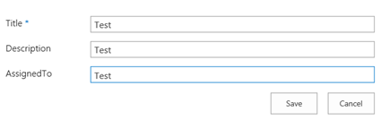
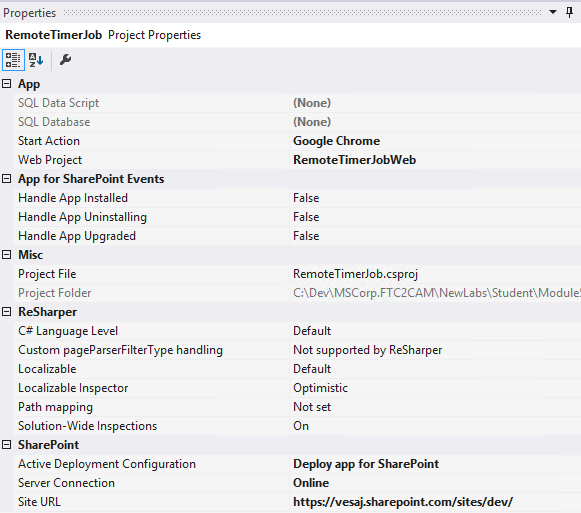

##Module 5 - Using Remote Event Receivers and Remote Timer Jobs

###Lab Environment
During this lab, you will work in your own environment with your own Office365 tenant. Following pre-requisites should be completed or be available before you start the lab.

###Prerequisites

The required prerequisite for this course are:

* Basic skill set on managing Office365
* Access to an Office365 tenant with an existing developer site. (The [pre-requisite lab](../O3658-0 Requesting Office365 Trial Tenant/Lab.md) provides directions to complete this task.)
* Visual Studio 2013 Ultimate with Azure SDK v2.5
* Ensure you have configured a local NuGet package repository: [Screenshot of the previous step](http://www.mbgreen.com/blog/2014/8/8/sharepoint-2013-apps-fail-on-nuget-package-restore)
* Access to an existing Windows Azure tenant (to be used as the hosting platform for applications that are installed for a typical Office365 sites.) 
* SharePoint Designer 2013. 
* Download and install the latest version of the SharePoint online client SDK from following link - http://aka.ms/spocsom
* Download the [O3658-5 Demos.zip](Demos/O3658-5 Demos.zip) zip file by following the link and clicking on **Raw**, then extract it. Note the location of these files. You will need these files to complete the labs.

###Lab Overview
####Abstract
In this lab you will create a remote event receiver and associate it to the host web to execute code during end user events and build a simple remote timer job.

####Learning Objectives
After completing the exercises in this lab, you will be able to:

  * Associate remote event receivers to host web.
  * Manipulate the host web items remotely when events are raised.
  * Debug remote event receivers in the cloud.
  * Use add-in model to create simple remote timer job.

**Estimated time to complete this lab: *15 minutes*.**

##Exercise 1: Use Remote Event Receivers from Host Web
###Scenario

In this lab you will create a remote event receiver and associate it to the host web to execute code during end user events.
After completing this exercise, you will understand:

* Associate remote event receivers to host web.
* Manipulate the host web items remotely when events are raised.
* Debug remote event receivers in the cloud.

###Open the pre-created structure and set the SharePoint app permissions and url

1. Start __Visual Studio 2013__
2. Click __File | Open Project__
3. Move to __O3658-5 Demos/HostWebEvents__ folder and open the existing solution named __HostWebEvents.sln__.  
Notice that the actual folder location id dependent on where you copied the files to in your local computer.  
  
4. Provide your tenant login information when the __Connect to SharePoint__ dialog is prompted.  
  
5. Ensure that the __Site URL__ property is correct for the App project by first activating the OneDriveCustomizer project in solution view.
6. Confirm the __Site URL__ from the property window. This this should be pointing to your personal Office365 tenant and to existing developer site collection which you could use for the exercise creation.  
If you get prompted with the __Connect to SharePoint__ dialog, provide the appropriate login information to the window.
  
7. Open __AppManifest.xml__ from the __SharePoint App__ project.  
  
8. Adjust the permission to require __Manage__ in __Web__ scope.  
  
9. Press __F5__ or choose __Debug | Start Debugging__ to ensure that application can be properly deployed.
10. Login to your test tenant by providing the right user ID and password, if required.
  
Notice that if you have any challenges to logout from your corporate tenant, you should be following guidance from following support article: http://support.microsoft.com/kb/2507767.  
11. Click __Trust It__, when the trust notification is shown.  
  
12. You should now see the initial design for the app as follows.  
Notice that we will implement the most functionality in an event receiver, so there won’t be much functionality in default.aspx  
  
13. Move back to Visual Studio side and press __Shift+F5__ or choose __Stop Debugging__ from the __Debug__ menu.

###Add-in the AppInstalled event receiver and customize it to add-in an ItemAdded event receiver on a host web list

1. Move to __Solution__ View, select the SharePoint app project and set the __Handle App Installed__ property to true.  
  
2. In the Solution view open the newly added __AppEventReceiver.svc__ by double clicking it  
  
3. Add the below constants to the AppEventReceiver class
  ```csharp
    private const string ReceiverName = "ItemAddedEvent";
    private const string ListName = "Remote Event Receiver Lab";
  ```

4. Add the below methods to the AppEventReceiver class
  ```csharp
    private void HandleAppInstalled(SPRemoteEventProperties properties)
    {
        using (ClientContext ctx = TokenHelper.CreateAppEventClientContext(properties, false))
        {
            if (ctx != null)
            {
                //Add a list to the host web
                List eventReceiverList = LabHelper.AddList(ctx, ctx.Web, Microsoft.SharePoint.Client.ListTemplateType.GenericList, ListName);
                //Remove existing event handlers
                ctx.Load(eventReceiverList, x => x.EventReceivers);
                ctx.ExecuteQuery();
                foreach (var rer in eventReceiverList.EventReceivers)
                {
                    if (rer.ReceiverName == ReceiverName)
                    {
                        System.Diagnostics.Trace.WriteLine("Found existing ItemAdded receiver at " + rer.ReceiverUrl);
                        try
                        {
                            //This will fail when deploying via F5, but works when deployed to production
                            rer.DeleteObject();
                            ctx.ExecuteQuery();
                        }
                        catch (Exception ex)
                        {
                            System.Diagnostics.Trace.WriteLine(ex.Message);
                        }
                    }
                }
                //Get WCF URL where this message was handled
                OperationContext op = OperationContext.Current;
                Message msg = op.RequestContext.RequestMessage;
                //Create a new event receiver
                EventReceiverDefinitionCreationInformation receiver = new EventReceiverDefinitionCreationInformation();
                receiver.EventType = EventReceiverType.ItemAdded;
                receiver.ReceiverUrl = msg.Headers.To.ToString();
                receiver.ReceiverName = ReceiverName;
                receiver.Synchronization = EventReceiverSynchronization.Synchronous;
                //Add the new event receiver to a list in the host web
                eventReceiverList.EventReceivers.Add(receiver);
                ctx.ExecuteQuery();
            }
        }
    }
    private void HandleItemAdded(SPRemoteEventProperties properties)
    {
        using (ClientContext ctx = TokenHelper.CreateRemoteEventReceiverClientContext(properties))
        {
            if (ctx != null)
            {
                try
                {
                    List eventReceiverList = ctx.Web.Lists.GetById(properties.ItemEventProperties.ListId);
                    ListItem item = eventReceiverList.GetItemById(properties.ItemEventProperties.ListItemId);
                    ctx.Load(item);
                    ctx.ExecuteQuery();
                    item["Description"] += "\nUpdated by RER " + System.DateTime.Now.ToLongTimeString();
                    item.Update();
                    ctx.ExecuteQuery();
                }
                catch (Exception ex)
                {
                    System.Diagnostics.Trace.WriteLine(ex.Message);
                }
            }
        }
    }
  ```

5. Add the following using statements to the AppEventReceiver class
  ```csharp
    using System.ServiceModel;
    using System.ServiceModel.Channels;
  ```

6.  Replace the ProcessEvent method in the AppEventReceiver class by below code
  ```csharp
    public SPRemoteEventResult ProcessEvent(SPRemoteEventProperties properties)
    {
        SPRemoteEventResult result = new SPRemoteEventResult();
        switch (properties.EventType)
        {
            case SPRemoteEventType.AppInstalled:
                HandleAppInstalled(properties);
                break;
            case SPRemoteEventType.ItemAdded:
                HandleItemAdded(properties);
                break;
        }
        return result;
    }
  ```

###Add code to delete item event handlers from a host web list
1. In the __Solution__ view open the __Default.aspx.cs__ code behind file by double clicking it  
  
2. Add the below constants to the __Default__ class
  ```csharp
    private const string ReceiverName = "ItemAddedEvent";
    private const string ListName = "Remote Event Receiver Lab";
  ```

3. Add the below code in the __btnDetachEventHandler_Click__ method of the __Default__ class
  ```csharp
    var spContext = SharePointContextProvider.Current.GetSharePointContext(Context);
    using (var ctx = spContext.CreateUserClientContextForSPHost())
    {
        List myList = ctx.Web.Lists.GetByTitle(ListName);
        ctx.Load(myList, p => p.EventReceivers);
        ctx.ExecuteQuery();
        var rer = myList.EventReceivers.Where(x => x.ReceiverName == ReceiverName).FirstOrDefault();
        try
        {
            System.Diagnostics.Trace.WriteLine("Removing ItemAdded receiver at " + rer.ReceiverUrl);
            //This will fail when deploying via F5, but works when deployed to production
            rer.DeleteObject();
            ctx.ExecuteQuery();
        }
        catch (Exception ex)
        {
            System.Diagnostics.Trace.WriteLine(ex.Message);
        }
    }
  ```

4. Press __Ctrl + Shift + B__ and check that the solution builds correctly. __Do not yet run the sample!__

###Prepare the solution for debugging

1. Open a Microsoft Azure PowerShell command prompt  
  
2. Download your __Azure publish settings__ by entering the following command, an Internet Explorer window will open and you will be asked to log into the azure managment portal, then your publish settings file will be downloaded

        Get-AzurePublishSettingsFile
  
3. Import your __Azure publish settings__ by entering the following command replacing __mysettings.publishsettings__ with the path to the file that was downloaded in the previous step.

        Import-AzurePublishSettingsFile mysettings.publishsettings
  

4. Create a new Azure Service Bus Namespace by running the following PowerShell command, replacing [MyNamespace] with your own chosen namespace. Copy the ConnectionString from the created NameSpace. You may also change the location property.

        New-AzureSBNamespace -Name '[MyNamespace]' -Location 'Central US'
  

5. Switch back to __Visual Studio 2013__. Right click the __SharePoint add-in project__ and choose __properties__. In the screen that opens click on __SharePoint__ in the left navigation to open the SharePoint specific project settings.  
  
6. In the __SharePoint__ project settings scroll down to the end and configure the __Debugging__ settings by checking __Enable debugging via Windows Azure Service Bus__ property and by providing the __Windows Azure Service Bus connection string__ that you've copied in step 4.  
  

###Debug your application
1. In the __Solution__ view open the newly added __AppEventReceiver.svc__ by double clicking it:  
  
2. Add a __breakpoint__ in the __HandleAppInstalled__ method and press __F5__ to start debugging
3. Click __Trust It__, when the trust notification is shown.  
  
4. Visual Studio will show the break point being hit. Press __F5__ to continue.  
  
5. The __default.aspx__ page opens. Click on __Back to Site__ in the top navigation to navigate back to the host web  
  
6. In the host web go to the newly created __Remote Event Receiver lab__ list by clicking on it in the __Recent__ left navigation node  
  
7. Add a new entry to this list  
  
8. After pressing save the result will be a modified Description field due to the ItemAdded event receiver that updated the description value  
  

That ends this exercise. In this lab we created a list in the host web and programmatically added a remote event receiver to this list during add-in installation. We’ve configured Azure Service Bus so that Visual Studio can use it as bridge between Office 365 making the call to the remote event receiver and the remote event receiver itself that is running locally on your development box. As documented in the code the detach of remote event receivers does not work in debug mode due to the side loading of apps that Visual Studio does when running via F5. In a production deployment this will work.

## Exercise 2: Creating simple remote timer job ##

### Open the pre-created structure and test the initial deployment. ###
  
1.  Start **Visual Studio 2013**.

2.  Click **File | Open Project**.

    

3.  Move to the __O3658-5 Demos/RemoteTimerJob__ folder and open the existing solution named __RemoteTimerJob.sln__.

    a. Notice that the actual folder location is dependent on where you copied the files to in your local computer.

    

4. Ensure that the **Site URL** property is correct for the add-in project by first activating the RemoteTimerJob project.
* If you are prompted to connect to SharePoint, provide the appropriate login information in the window.

    

5. Confirm the Site URL from the property window. This this should be pointing to your personal Office365 tenant and to the existing developer site collection which can be used for the exercise creation.
* If you are prompted to connect to SharePoint, provide the appropriate login information in the window.

    

6. Open **AppManifest.xml** from the Add-in project.

    

7. Adjust the permission to require **FullControl** in **Web** scope.

    

8. Press **F5** or choose **Debug | Start Debugging** to ensure that the application is properly deployed.

9. Log in to your test tenant by providing the right user ID and password, if required.
* Note: If you have any challenges logging in from your corporate tenant, follow guidance from this support article: http://support.microsoft.com/kb/2507767. 

    

10. Click **Trust It**, when the trust notification appears.

    

11. You should now see the initial design for the app as follows.
* Notice that actual implementation is missing from the buttons, but you can already see how the app will work.
    
    


### Create timer job console application. ###

1. **While** the solution is running open the **web.config** file in **RemoteTimerJobWeb** project.
* Notice that **ClientId** and **ClientSecret** contains value.

2. In a new instance of __Visual Studio 2013__ Open __RemoteTimerJob.Console.sln__ 

2. Copy **ClientId** value and **ClientSecret** value from web.config to App.config in RemoteTimerJob.Console project. Enter the **url** which is used in previous task.
    

3.  Include the following piece of code to the **Main** method
  ```csharp
    static void Main(string[] args)
    {
        Uri siteUri = new Uri(ConfigurationManager.AppSettings["url"]);
        //Get the realm for the URL
        string realm = TokenHelper.GetRealmFromTargetUrl(siteUri);
        //Get the access token for the URL.  
        //   Requires this app to be registered with the tenant
        string accessToken = TokenHelper.GetAppOnlyAccessToken(
            TokenHelper.SharePointPrincipal,
            siteUri.Authority, realm).AccessToken;
        //Get client context with access token
        using (var ctx = TokenHelper.GetClientContextWithAccessToken(siteUri.ToString(), accessToken))
        {
            // Let's create a list to the host web and add a new entry for each execution
            if (!ListExists(ctx.Web, "RemoteOperation"))
            {
                AddList(ctx.Web, ListTemplateType.GenericList, "RemoteOperation");
            }
            // Add new execution entry to the list time stamp
            // Assume that the web has a list named "Announcements". 
            List list = ctx.Web.Lists.GetByTitle("RemoteOperation");
            ListItemCreationInformation itemCreateInfo = new ListItemCreationInformation();
            ListItem newItem = list.AddItem(itemCreateInfo);
            newItem["Title"] = string.Format("New {0}", DateTime.Now.ToLongTimeString());
            newItem.Update();
            ctx.ExecuteQuery();
        }
    }
  ```

4. As you can see from the added code, we are calling an additional **AddList** method, so let’s add that one below.
  ```csharp
    public static void AddList(Web web, ListTemplateType listType, string listName)
    {
        ListCollection listCol = web.Lists;
        ListCreationInformation lci = new ListCreationInformation();
        lci.Title = listName;
        lci.TemplateType = (int)listType;
        List newList = listCol.Add(lci);
    }
  ```
5. We are also using **ListExists** method to check if there is already same list existing, add that one below.
  ```csharp
    public static bool ListExists(Web web, string listTitle)
    {
        ListCollection lists = web.Lists;
        IEnumerable<List> results = web.Context.LoadQuery<List>(lists.Where(list => list.Title == listTitle));
        web.Context.ExecuteQuery();
        List existingList = results.FirstOrDefault();
        if (existingList != null)
        {
            return true;
        }
        return false;
    }
  ```
  
6. Run the console application Press **F5** or choose **Debug - Start Debugging**.  
This console application will create a list if the list is not exsiting and add an item to that list.
7. Click **Back to Site** in the top left corner to verify that the list has been created.  
  
8. Notice there is a new list created.  
  
9. Click **RemoteOperation** list , we have one item in this list.  
  

In the real scenario we could implement application running as a WebJob to Windows Azure or scheduled to windows scheduler for on-premises deployment.