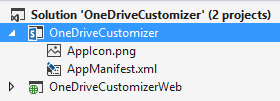
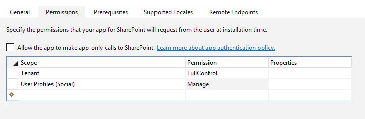
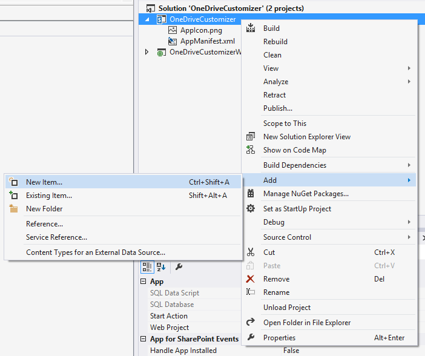
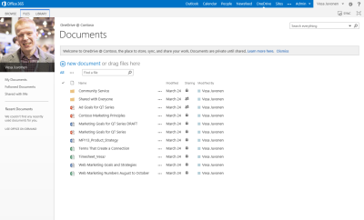

# Module 7 - User Personalization and OneDrive for Business Operations Using CAM Patterns #

## Lab Environment ##
During this lab, you will work in your own environment with your own Office365 tenant. The following prerequisites should be completed or be available before you start the lab.
### Before You Begin ###
To complete the labs in this course you need to install or configure the following items.

* Access to an Office365 tenant with an existing developer site. (The [pre-requisite lab](../O3658-0 Requesting Office365 Trial Tenant/Lab.md) provides directions to complete this task.)
* Visual Studio 2013 Ultimate with Azure SDK v2.5
* Ensure you have configured a [local NuGet package repository](http://www.mbgreen.com/blog/2014/8/8/sharepoint-2013-apps-fail-on-nuget-package-restore) 
* Access to an existing Windows Azure tenant (to be used as the hosting platform for applications that are installed for a typical Office365 sites.) 
* SharePoint Designer 2013. 
* Download and install the latest version of the SharePoint online client SDK from following link - http://aka.ms/spocsom
* Download the [O3658-7 Demos.zip](Demos/O3658-7 Demos.zip) zip file by following the link and clicking on **Raw**, then extract it. Note the location of these files. You will need these files to complete the labs.

## Exercise 1: Perform User Profile Property Synchronization to Cloud ##

### Lab Overview ###
### Abstract ###
In this lab you will create an automated synchronization tool to synchronize user profile attributes from on-premises to the cloud. 

### Learning Objectives ###

After completing the exercises in this lab, you will be able to:
-	Connect to the cloud user profile store from on-premises.
-	Modify user profile properties of profiles in the cloud

**Estimated time to complete this lab: *15 minutes*.**

### Open the pre-created structure and add references to the required assemblies ###

1. Start **Visual Studio 2013**
2. Click **File | Open Project**
3. Move to the **O3658-7 Demos/UserProfilePropertySync** folder and open the existing solution named **UserProfilePropertySync.sln**.

  * Notice that the actual folder location is dependent on where you copied the files to in your local computer.
    
    
       
4. Right click the **References** under the project in the **Solution Explorer** and choose **Add Reference…**

    
    
5. Click **Browse…**

6. Move to folder **C:\Program Files\Common Files\microsoft shared\Web Server Extensions\16\ISAPI**

7. Select the following assemblies. You can select multiple assemblies by holding the Ctrl button down while clicking the assemblies in dialog.

    a.	**Microsoft.SharePoint.Client.dll**
    
    b.	**Microsoft.SharePoint.Client.RunTime.dll**
    
    c.  **Microsoft.SharePoint.Client.UserProfiles.dll**
    
8. Click **Add**

9. Click **OK**.

10. Now you should have the right references to be able to access Office365 remotely in the **References** section.

    


### Prepare credentials for CSOM connection ###

1. **Open** up **Program.cs** from the solution explorer and add following using statements.

    ```csharp
    using System;
    using System.Security;
    using System.Net;
    using Microsoft.SharePoint.Client;
    using Microsoft.SharePoint.Client.UserProfiles;
    ```
2. Add the supporting methods **GetString** and **GetPassword** under the Main method. These methods are used to request information from the console window.
  ```csharp
    public static string GetString(string question)
    {
          string userInput = string.Empty;
          try
          {
            Console.Write(question);
            userInput = Console.ReadLine();
          }
          catch (Exception e)
          {
            Console.WriteLine(e.Message);
            userInput = string.Empty;
          }
          return userInput;
    }
    
    public static SecureString GetPassword()
    {
        SecureString sStrPwd = new SecureString();
    
        try
        {
            Console.Write("Enter the SharePoint Tenant Admin password: ");
    
            for (ConsoleKeyInfo keyInfo = Console.ReadKey(true); keyInfo.Key != ConsoleKey.Enter; keyInfo = Console.ReadKey(true))
            {
                if (keyInfo.Key == ConsoleKey.Backspace)
                {
                    if (sStrPwd.Length > 0)
                    {
                        sStrPwd.RemoveAt(sStrPwd.Length - 1);
                        Console.SetCursorPosition(Console.CursorLeft - 1, Console.CursorTop);
                        Console.Write(" ");
                        Console.SetCursorPosition(Console.CursorLeft - 1, Console.CursorTop);
                    }
                }
                else if (keyInfo.Key != ConsoleKey.Enter)
                {
                    Console.Write("*");
                    sStrPwd.AppendChar(keyInfo.KeyChar);
                }
    
            }
            Console.WriteLine("");
        }
        catch (Exception e)
        {
            sStrPwd = null;
            Console.WriteLine(e.Message);
        }
    
        return sStrPwd;
    }
  ```
3. Add the below try/catch block in the Main method. This is done to capture possible errors and show them in the console window.
  ```csharp
    try
    {
    	//add here the user profile update code
    }
    catch (Exception ex)
    {
        Console.ForegroundColor = ConsoleColor.Red;
        Console.WriteLine(string.Format("Exception!"), ex.ToString());
        Console.WriteLine("Press any key to continue.");
        Console.Read();
        throw;
    }
  ```

4. Inside the try/catch block (under the “add here the user profile update code comment”) you now need to paste the below code. This code will acquire the needed SharePoint Online information.    
  ```csharp
    //Get the tenant admin information needed to read and update user profile data
    string tenantAdminUrl = GetString("Enter your tenant admin url (https://tenantname-admin.sharepoint.com): ");

    string tenantAdminUser = GetString("Enter your tenant admin user (user@tenantname.onmicrosoft.com): ");
    SecureString tenantAdminPassword = GetPassword();

    //Provide the user profile Account name property value of the user profile to read/update
    string userToUpdate = "i:0#.f|membership|" + tenantAdminUser;
  ```


### Add the code to read and update a user profile property ###

1. Open up **Program.cs** from the solution explorer and underneath the previously added block of code add the code below. This code will **read and update**  the **AboutMe** user profile property from the selected user and will display the value.    
  ```csharp
    using (ClientContext clientContext = new ClientContext(tenantAdminUrl))
    {
        clientContext.Credentials = new SharePointOnlineCredentials(tenantAdminUser, tenantAdminPassword);

        // Get the people manager instance for tenant context
        PeopleManager peopleManager = new PeopleManager(clientContext);

        //Read a user profile property 
        Console.ForegroundColor = ConsoleColor.Green;
        string userProfileProperty = "AboutMe";
        Console.WriteLine("Current value of the {0} property for user {1}:", userProfileProperty, userToUpdate);

        //Update a user profile property
        string newAboutMeValue = GetString(String.Format("Enter a new value to be set for property {0}:", userProfileProperty));

        Console.WriteLine("Setting new value...");

        // Update the AboutMe property for the user using account name.
        peopleManager.SetSingleValueProfileProperty(userToUpdate, userProfileProperty, newAboutMeValue);

        clientContext.ExecuteQuery();
    }
    Console.WriteLine("Press any key to continue.");
    Console.Read();
  ```
    

### Add some break points and debug your program. ###

1. Now the needed code has been added. You should move the cursor to the appropriate locations in the code and use **F9** to add some break points to the code, so that you can more easily track what is actually happening when the code is executed.

2. Press **F5** or choose **Debug – Start debugging**.

3. Provide the connectivity information relevant to your test tenant as shown in the following picture. **Tenant admin URL, Tenant admin user** and **password** are asked one-by-one.

    a. The Tenant Admin URL should be something like https://tenantname-admin.sharepoint.com.
    
    b. The Tenant Admin user should be something like user@tenantname.onmicrosoft.com. 
    
    
 
4. The program will list the current value of the **AboutMe** property for the user you have provided.

    
     
5. In a next step the program asks you to provide a new value for the **AboutMe** property. After you have provided this, the new value will be set and the program will terminate.

    
 

### Verify that the user profile property has been changed ###


1. Open your browser and connect to your tenant admin site collection. The address should be something like https://tenantname-admin.sharepoint.com. 

2. Login to the tenant.
    
    
    
3. Click on **User Profiles** in the left navigation. Click on **Manage User Profiles** link in the **People** section.
    
    
    
4.	Enter the name of the user (user@tenantname.onmicrosoft.com) for which you have modified the profile in the **Find profiles** textbox and select **Find**.

5.	Right click the **accountname** field to and select **Edit My Profile**

    
 
6.	Check the **About me** field. It should show the value you’ve entered previously.
    
    

That completes this exercise.

In this exercise we used the **PeopleManager** in **Microsoft.SharePoint.Client.UserProfiles.dll** to read and update user profile properties from a user. In this sample you have updated the properties from the logged on user but the same code will also work for any other user, you just need to point the **userToUpdate** variable to the correct user.


## Exercise 2: Manage the Branding and Functionalities of OneDrive for Business Sites ##

### Scenario ###

In this lab you will create a provider hosted add-in, which will take care of automated OneDrive for Business branding.

After completing this exercise, you will understand how to:
-	Access OneDrive for Business sites using the context of the user.
-	Deploy required modifications to the OneDrive for Business sites using CSOM.


### Open the pre-created structure and test the initial deployment. ###

1.	Start **Visual Studio 2013 Ultimate**
2.	Click **File | Open Project**

3.	Move to **O3658-7 Demos/OneDriveCustomizer** folder and open the existing solution named **OneDriveCustomizer.sln**.

    a.	Notice that the actual folder location is dependent on where you copied the files to in your local computer.
    
    

4.	Ensure that the **Site URL** property is correct for the add-in project by first activating the **OneDriveCustomizer** project in solution view.

    

5.	Confirm the **Site URL** from the property window. This this should be pointing to your personal Office365 tenant and to the existing developer site collection which can be used for the exercise creation.

    a.	 If you get prompted with the **Connect to SharePoint** dialog, provide the appropriate login information to the window.
    
    

6.	Open **AppManifest.xml** from the add-in project.  

    

7.	Adjust the permission to require **FullControl** in **Tenant** scope and **Manage** in **User Profiles** scope.

    

8.	Press **F5** or choose **Debug – Start Debugging** to ensure that application can be properly deployed.

9.	Log in to your test tenant by providing the right user ID and password, if required.

    

    a.	Notice that if you have any challenges to logging in from your corporate tenant, follow this support article: http://support.microsoft.com/kb/2507767. 

10.	Click **Trust It**, when the trust notification is shown.

    
 
11.	You should now see the initial design for the add-in as follows.

    a.	Notice that we will implement the actual functionality as a add-in part, so there won’t be any actual code in default.aspx
    
    

12.	Move back to the **Visual Studio** side and press **Shift+F5** or choose **Stop Debugging** from the **Debug** menu.


### Include the add-in part and the needed code for modifications. ###

1.	Move to **Solution** View, right click the add-in project and choose **Add – New Item…** 

    
    
2.	Choose **Client Web Part (host web)** as the type and give a name of **OneDriveCustomer** to the new item.
    
    
    
3.	Click **Add** to move forward.

4.	Leave the creation option as default, so that we will create a new page to our project with the given name.

    

5.	Click **Finish**

    a.	Notice that we will be applying the branding automatically without any actual UI, so we don’t need to concentrate on rendering any output from the client part.
    
6.	Move to **OneDriveCustomizer.aspx.cs** file and double click it for adding the needed code.

    

7.	Before we can use the right code pieces, we’ll need to add following using statements on top of the page.

    ```csharp
    using Microsoft.SharePoint.Client;
    using Microsoft.SharePoint.Client.UserProfiles;
    ```

8.	We can place the needed automation code directly to the **Page_Load** method, so that it’s executed each time. Add following code elements to the method.

    a.	We are using social CSOM or user profile CSOM to access a particular user’s my site dynamically, so that we are able to modify it automatically without end user actions.
    
    ```csharp
    protected void Page_Load(object sender, EventArgs e)
    {
        var spContext = SharePointContextProvider.Current.GetSharePointContext(Context);
    
        using (ClientContext clientContext = spContext.CreateUserClientContextForSPHost())
        {
            // Get user profile
            ProfileLoader loader = 
                Microsoft.SharePoint.Client.UserProfiles.ProfileLoader.GetProfileLoader(clientContext);
            UserProfile profile = loader.GetUserProfile();
            Microsoft.SharePoint.Client.Site personalSite = profile.PersonalSite;
    
            clientContext.Load(personalSite);
            clientContext.ExecuteQuery();
    
            // Let's check if the site already exists
            if (personalSite.ServerObjectIsNull.Value)
            {
                profile.CreatePersonalSiteEnque(true);
                clientContext.ExecuteQuery();
            }
            else
            {
                Web rootWeb = personalSite.RootWeb;
                clientContext.Load(rootWeb);
                clientContext.ExecuteQuery();
    
                // Setting the custom theme to host web
                SetThemeBasedOnName(clientContext, rootWeb, "Orange");
            }
        }
    }
    ```

    b.	Notice that in the code we are calling the method **SetThemeBasedOnName**, which will be added in following step.

9.	Add **SetThemeBasedOnName** method right under the page_load method as follows. This method is for first resolving the theme based on name and then applying theme settings to the personal site.
    
    ```csharp
    public void SetThemeBasedOnName(ClientContext cc, Web rootWeb, string themeName)
    {
        // Let's get instance to the composite look gallery
        List themeList = rootWeb.GetCatalog(124);
        cc.Load(themeList);
        cc.ExecuteQuery();
    
        CamlQuery query = new CamlQuery();
        string camlString = @"
            <View>
                <Query>                
                    <Where>
                        <Eq>
                            <FieldRef Name='Name' />
                            <Value Type='Text'>{0}</Value>
                        </Eq>
                    </Where>
                    </Query>
            </View>";
        // Let's update the theme name accordingly
        camlString = string.Format(camlString, themeName);
        query.ViewXml = camlString;
        var found = themeList.GetItems(query);
        cc.Load(found);
        cc.ExecuteQuery();
        if (found.Count > 0)
        {
            Microsoft.SharePoint.Client.ListItem themeEntry = found[0];
            //Set the properties for applying custom theme which was jus uplaoded
            string spColorURL = null;
            if (themeEntry["ThemeUrl"] != null && themeEntry["ThemeUrl"].ToString().Length > 0)
            {
                spColorURL = MakeAsRelativeUrl((themeEntry["ThemeUrl"] as FieldUrlValue).Url);
            }
            string spFontURL = null;
            if (themeEntry["FontSchemeUrl"] != null && themeEntry["FontSchemeUrl"].ToString().Length > 0)
            {
                spFontURL = MakeAsRelativeUrl((themeEntry["FontSchemeUrl"] as FieldUrlValue).Url);
            }
            string backGroundImage = null;
            if (themeEntry["ImageUrl"] != null && themeEntry["ImageUrl"].ToString().Length > 0)
            {
                backGroundImage = MakeAsRelativeUrl((themeEntry["ImageUrl"] as FieldUrlValue).Url);
            }
    
            // Set theme for demonstration
            rootWeb.ApplyTheme(spColorURL,
                                spFontURL,
                                backGroundImage,
                                false);
    
            // Let's also update master page, if needed
            if (themeEntry["MasterPageUrl"] != null && themeEntry["MasterPageUrl"].ToString().Length > 0)
            {
                rootWeb.MasterUrl = MakeAsRelativeUrl((themeEntry["MasterPageUrl"] as FieldUrlValue).Url); ;
            }
    
            cc.ExecuteQuery();
        }
    }
    ```
10.	**SetThemeBasedOnName** method depends on **MakeAsRelativeUrl** helper method, so place following code below it.
   
    ```csharp
    private string MakeAsRelativeUrl(string urlToProcess)
    {
        Uri uri = new Uri(urlToProcess);
        return uri.AbsolutePath;
    }
    ```
    
11.	Now we are ready to test our code in practice. Press **F5** or choose **Start Debugging** from **Debug** menu.

12.	You will land on the full page view of the add-in, but since we did not do any customizations for this, there is really nothing happening yet.

13.	Click **Back to Site** from the top left corner.

14.	Verify that there is visible change when we add this new add-in part to the page, by first checking the status from OneDrive. Click OneDrive from the suite bar to see the out of the box branding.

    

15.	Notice that by default OneDrive is using the Office theme colours.

    

16.	Move back to the developer site collection.

17.	Click **Edit** in the top right of the page to put this page into edit mode and choose **Insert Tab, then click App Part** from the ribbon.

18.	Choose **OneDriveCustomizer** Title and click **Add**.

19.	Notice how the add-in part execution takes a while with the “working on it” message and eventually it does not show any content.

    

20.	Click OneDrive again from the suite bar and confirm that the branding has been changed to an orange color.

    

    * Note: In actual production implementation you would not execute the theme setting during each call. It’s recommended to store the version of the customizations to the property bag of the OneDrive for Business site, so that you can ignore applying customizations if the site is already in right version.


