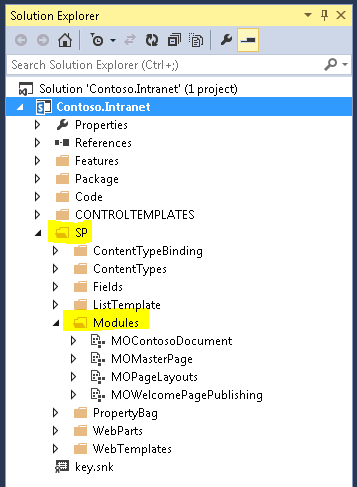
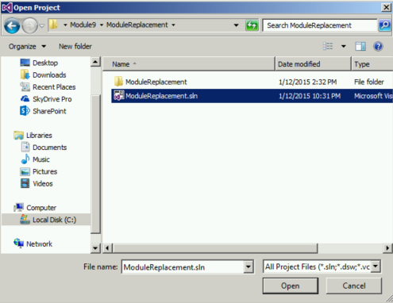
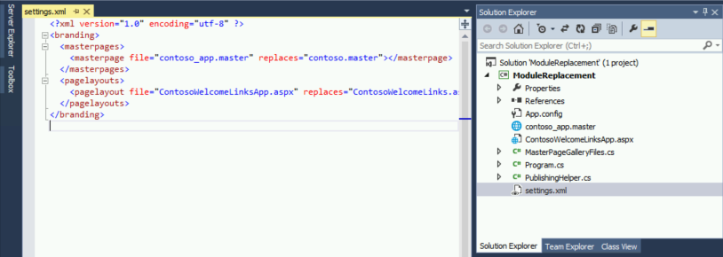
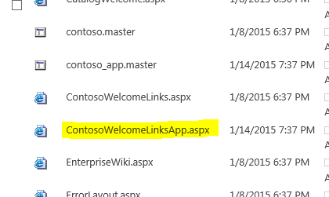

# Module 10-1 — Replacement of files provisioned via Modules in Full Trust Solutions #
  
## Lab Environment ##
During this lab, you will work in the provided virtual machine. The following prerequisites have been completed and are provided should you wish to undertake this lab in your own environment.

### Before You Begin ###
To complete the labs in this course you need to install or configure the following items.
  - Access to a SharePoint 2013 server with the Contoso.Intranet solution deployed and a site collection provisioned using the **WTContosoPublishing Web Template**. (The PowerShell for site creation is available in the [Patterns & Practice reference materials](https://github.com/OfficeDev/PnP/tree/master/Reference%20Material/Contoso.Intranet) .)
    + You should be logged in as an administrator of the site collection to ensure that you have all the necessary permissions for this lab    

  - Visual Studio 2013 Ultimate Update 3 with Azure SDK v2.5, available via the web platform installer.  

  - Ensure you have configured a local NuGet package repository: http://www.mbgreen.com/blog/2014/8/8/sharepoint-2013-apps-fail-on-nuget-package-restore    
  - Download and unzip the Student folder. Note the unzipped location of these files. You will need these files to complete the labs.  The following graphic shows the unzipped file structure.  
    
  
## Lab Overview ##

### Abstract ###
In this lab you will learn how to replace existing master pages and page layouts which have been deployed to an On-Premises SharePoint Server via Modules in a Full Trust Solution. This will involve deploying new files to replace those deployed via Modules and updating the existing usages of these files to remove the dependency on the files which were deployed via declarative means.

### Learning Objectives ###
After completing the exercises in this lab, you will be able to:
  - Upload new master pages to a SharePoint site via CSOM
    + Update the master pages for a given SharePoint site
  - Upload new page layouts to a SharePoint site via CSOM
    + Update existing page instances to use the new page layouts
    + Set the available and default page layouts for a SharePoint WCM site
  
**Estimated time to complete this lab: *40 minutes*.**
  
  
## Exercise 1: Deploy new master pages via CSOM ##
  
### Examine the initial state of the site and modules for replacement. ###
  
1. Start **Visual Studio 2013.**

2. Click **File | Open Project.** 
  
  

3. Move to the **Contoso.Intranet** folder and open the existing solution named  **Contoso.Intranet.sln**.

4. In the **Solution Explorer** expand the **SP** folder then the **Modules** folder.

  

5. Examine the **Elements.xml** file and the **contoso.master** file in the **MOMasterPage** Module.
  * Note that the contoso.master master page makes use of a custom user control which is not supported in Office 365. Our replacement master page will not contain this control.
  
6. Examine the **Elements.xml** file and the **ContosoWelcomeLinks.aspx** file in the **MOPageLayouts** Module.
  * Note that the ContosoWelcomeLinks.aspx master page layout makes use of a custom user control which is not supported in Office 365. Our replacement page layout will not contain this control.

7. It should also be noted that both of these files set the Content Type of the deployed file declaratively. 

8. Open **Internet Explorer** and navigate to **http://w15-sp/sites/ftclab**
  * You should see a home page which uses the custom master page and page layouts shown above: 

  

9. Switch back to **Visual Studio 2013**

10. Click **File | Close Solution** to close the current solution.

  


### Upload the new Master Page. ###

1. Click **File | Open Project.** 

2. Move to the **Module9/ModuleReplacement** folder and open the existing solution named  **ModuleReplacement.sln**.
  * Note: The actual folder location is dependent on where you copied the files to in your local computer. 
  
  

3. Open the **settings.xml** file **ModifyUserExperience** project.
  * Here you can see a xml file defining which files we will upload, the files they are to replace and additional information that is needed to upload the page layouts successfully.
  
  

4. Open the **MasterPageGalleryFiles.cs** file
  * Here you can see two business objects we will use to hold data about the files to be uploaded.
  
  

5. Open **Program.cs**.

  

  * Paste the following code into the **Main** method:  

  ```csharp
  static void Main(string[] args)
  { 
      using (var clientContext = new ClientContext("http://w15-sp/sites/ftclab"))
      {
          XDocument settings = XDocument.Load("settings.xml");

          //Grab the master page gallery folder for uploading and the content types for the masterpage gallery 
          Web web = clientContext.Web;
          List gallery = web.GetCatalog(116);
          Folder folder = gallery.RootFolder;
          //Load info about the master page gallery
          clientContext.Load(folder);
          clientContext.Load(gallery,
                              g => g.ContentTypes,
                              g => g.RootFolder.ServerRelativeUrl);
          //Load the content types and master page info for the web
          clientContext.Load(web,
                              w => w.ContentTypes,
                              w => w.MasterUrl,
                              w => w.CustomMasterUrl);
          clientContext.ExecuteQuery();
          //Get the list contentTypeId for the masterpage upload the master pages we know about
          const string parentMasterPageContentTypeId = "0x010105"; // Master Page 
          ContentType masterPageContentType = gallery.ContentTypes.FirstOrDefault(ct => ct.StringId.StartsWith(parentMasterPageContentTypeId));
          UploadAndSetMasterPages(web, folder, clientContext, settings, masterPageContentType.StringId);
      }
  }
  ```
  * As you can see, we load the master page gallery and its root folder and Content Types, we then query the content types to find the master page content type so that we can set this correctly for the master pages that will be uploaded. 

  * We also gather some additional information about the web in which we are working, then a call is made to the **UploadAndSetMasterPages** method, so let's add that now:
  
  ```csharp
  private static void UploadAndSetMasterPages(Web web, Folder folder, ClientContext clientContext, XDocument settings, string contentTypeId)
  {
      IList<MasterPageGalleryFile> masterPages = (from m in settings.Descendants("masterPage")
                                                  select new MasterPageGalleryFile
                                                  {
                                                      File = (string)m.Attribute("file"),
                                                      Replaces = (string)m.Attribute("replaces"),
                                                      ContentTypeId = contentTypeId
                                                  }).ToList();
      foreach (MasterPageGalleryFile masterPage in masterPages)
      {
          UploadAndSetMasterPage(web, folder, clientContext, masterPage);
      }
  }
```
  * This reads all of the masterPage elements out of the settings.xml file into business objects and then calls the **UploadAndSetMasterPage** for each master page to be added to the site. 

6. Paste in the implementation for the **UploadAndSetMasterPage** method:

  ```csharp
  private static void UploadAndSetMasterPage(Web web, Folder folder, ClientContext clientContext, MasterPageGalleryFile masterPage)
  {
      using (var fileReadingStream = System.IO.File.OpenRead(masterPage.File))
      {
          //Ensure that the masterpage is checked out if this is needed
          PublishingHelper.CheckOutFile(web, masterPage.File, folder.ServerRelativeUrl);

          //Use the FileCreationInformation to upload the new file
          var fileInfo = new FileCreationInformation();
          fileInfo.ContentStream = fileReadingStream;
          fileInfo.Overwrite = true;
          fileInfo.Url = masterPage.File;
          File file = folder.Files.Add(fileInfo);

          //Get the list item associated with the newly uploaded file
          ListItem item = file.ListItemAllFields;
          clientContext.Load(file.ListItemAllFields);
          clientContext.Load(file,
                              f => f.CheckOutType,
                              f => f.Level,
                              f => f.ServerRelativeUrl);
          clientContext.ExecuteQuery();

          item["ContentTypeId"] = masterPage.ContentTypeId;
          item["UIVersion"] = Convert.ToString(15);
          item["MasterPageDescription"] = "Master Page Uploaded using CSOM";
          item.Update();
          clientContext.ExecuteQuery();

          //Check-in, publish and approve and the new masterpage file if needed
          PublishingHelper.CheckInPublishAndApproveFile(file);

          //Update the references to the replaced masterpage if needed
          if (web.MasterUrl.EndsWith("/" + masterPage.Replaces))
          {
              web.MasterUrl = file.ServerRelativeUrl;
          }
          if (web.CustomMasterUrl.EndsWith("/" + masterPage.Replaces))
          {
              web.CustomMasterUrl = file.ServerRelativeUrl;
          }
          web.Update();
          clientContext.ExecuteQuery();
      }
  }
```
7. Press **F5** or choose **Debug – Start Debugging** to run the console application and deploy the new master page.

8. Once the console application has completed execution switch back to **Internet Explorer** and refresh the page.
  * You should now see that the page renders using the Contoso App Master Page and that the custom user control which was visible in the upper right of the page is no longer in use.

  

## Exercise 2: Deploy new page layouts via CSOM ##

### Upload new page layouts. ###
  
1. Return to **Visual Studio 2013** 

2. Move to **Solution View** and open the **Program.cs** file as we need to add more functionality to the console application.

3. Edit the **Main** method and add the following lines at the end of the method inside the **using** statement:

  ```csharp
  //Get the list contentTypeId for the PageLayouts upload the layout pages we know about
  const string parentPageLayoutContentTypeId = "0x01010007FF3E057FA8AB4AA42FCB67B453FFC100E214EEE741181F4E9F7ACC43278EE811"; //Page Layout
  ContentType pageLayoutContentType = gallery.ContentTypes.FirstOrDefault(ct => ct.StringId.StartsWith(parentPageLayoutContentTypeId));
  UploadPageLayoutsAndUpdateReferences(web, folder, clientContext, settings, pageLayoutContentType.StringId);
```
  * This follows the pattern established for adding the master pages where we determine the Content Type for Page Layouts and call into the method **UploadPageLayoutsAndUpdateReferences** which we will now add.

4. Add the **UploadPageLayoutsAndUpdateReferences** method:

  ```csharp
  private static void UploadPageLayoutsAndUpdateReferences(Web web, Folder folder, ClientContext clientContext, XDocument settings, string contentTypeId)
  {
      //Load all the pageLayout replacements from the settings
      IList<LayoutFile> pageLayouts = (from m in settings.Descendants("pageLayout")
                                   select new LayoutFile
                                   {
                                       File = (string)m.Attribute("file"),
                                       Replaces = (string)m.Attribute("replaces"),
                                       Title = (string)m.Attribute("title"),
                                       ContentTypeId = contentTypeId,
                                       AssociatedContentTypeName = (string)m.Attribute("associatedContentTypeName"),
                                       DefaultLayout = m.Attribute("defaultLayout") != null && (bool)m.Attribute("defaultLayout")
                                   }).ToList();

      // Update the content type association
      foreach (LayoutFile pageLayout in pageLayouts)
      {
          ContentType associatedContentType =
              web.ContentTypes.FirstOrDefault(ct => ct.Name == pageLayout.AssociatedContentTypeName);
          pageLayout.AssociatedContentTypeId = associatedContentType.StringId;                
          UploadPageLayout(web, folder, clientContext, pageLayout);
      }
  }
```

  * Again this follows the pattern established for adding Master Pages with some additional functionality. Page Layouts have an associated Content Type, we load the name for this Content Type from the settings file. This is then used to query the Content Types from the site in which we are operating.
  * *Note: Here we derive the Content Type Id from the Web and not the target list*
  * The **UploadPageLayout** method is then invoked for each Page Layout to be uploaded.

5. Add the **UploadPageLayout** method

  ```csharp
  private static void UploadPageLayout(Web web, Folder folder, ClientContext clientContext, LayoutFile pageLayout)
  {
      using (var fileReadingStream = System.IO.File.OpenRead(pageLayout.File))
      {
          PublishingHelper.CheckOutFile(web, pageLayout.File, folder.ServerRelativeUrl);
          //Use the FileCreationInformation to upload the new file
          var fileInfo = new FileCreationInformation();
          fileInfo.ContentStream = fileReadingStream;
          fileInfo.Overwrite = true;
          fileInfo.Url = pageLayout.File;
          File file = folder.Files.Add(fileInfo);
          //Get the list item associated with the newly uploaded file
          ListItem item = file.ListItemAllFields;
          clientContext.Load(file.ListItemAllFields);
          clientContext.Load(file,
                              f => f.CheckOutType,
                              f => f.Level,
                              f => f.ServerRelativeUrl);
          clientContext.ExecuteQuery();

          item["ContentTypeId"] = pageLayout.ContentTypeId;
          item["Title"] = pageLayout.Title;
          item["PublishingAssociatedContentType"] = string.Format(";#{0};#{1};#", pageLayout.AssociatedContentTypeName, pageLayout.AssociatedContentTypeId);
          item.Update();
          clientContext.ExecuteQuery();

          PublishingHelper.CheckInPublishAndApproveFile(file);

          PublishingHelper.UpdateAvailablePageLayouts(web, clientContext, pageLayout, file);

          if (pageLayout.DefaultLayout)
          {
              PublishingHelper.SetDefaultPageLayout(web, clientContext, file);
          }
      }
  }
```
  * This method uses the same approach as was used to upload the master pages, the key differences being that the **PublishingAssociatedContentType** property is set and that it makes use of the **PublishingHelper.UpdateAvailablePageLayouts** and **PublishingHelper.SetDefaultPageLayout** methods.
  
6. Open the **PublishingHelper.cs** file and examine the **UpdateAvailablePageLayouts** and **SetDefaultPageLayout** methods.

  
  * As you can see these methods change the XML stored in the **__PageLayouts** and **__DefaultPageLayout** Properties for the Web.

7. Press **F5** or choose **Debug – Start Debugging** to run the console application and deploy the new page layouts.

8. Once the console application has completed execution switch back to **Internet Explorer** and click on **Site Settings** under the gear in the upper right.

  

9. Under **Web Designer Galleries** click **Master pages and page layouts**

  

  * You should now see the **ContosoWelcomeLinksApp.aspx** page in the Master Page Gallery.

  

10. Navigate **Back** in the browser

11. Under **Look and Feel** click **Page layouts and site templates**

  

  * In the Page Layouts section you will see that the Contoso Welcome Links App page layout is available for use within this site.

  

12. Click on the **FTC Lab** link in the upper left of the screen

  * Note that the home page is not yet using the newly uploaded page layout.


### Update existing pages to use the new layouts. ###

1. Switch back to **Visual Studio 2013**

2. Open the **Program.cs** file.

3. Locate the **UploadPageLayoutsAndUpdateReferences** method, add the following method call as the last line of this method:

  ```csharp
  UpdatePages(web, clientContext, pageLayouts);
```
4. Add the **UpdatePages** method by pasting in the method listed below:

  ```csharp
  private static void UpdatePages(Web web, ClientContext clientContext, IList<LayoutFile> pageLayouts)
  {
      //Get the Pages Library and all the list items it contains
      List pagesList = web.Lists.GetByTitle("Pages");
      var allItemsQuery = CamlQuery.CreateAllItemsQuery();
      ListItemCollection items = pagesList.GetItems(allItemsQuery);
      clientContext.Load(items);
      clientContext.ExecuteQuery();
      foreach (ListItem item in items)
      {
          //Only update those pages that are using a page layout which is being replaced
          var pageLayout = item["PublishingPageLayout"] as FieldUrlValue;
          if (pageLayout != null)
          {
              LayoutFile matchingLayout = pageLayouts.FirstOrDefault(p => pageLayout.Url.EndsWith("/" + p.Replaces));
              if (matchingLayout != null)
              {
                  //Check out the page so we can update the page layout being used
                  PublishingHelper.CheckOutFile(web, item);

                  //Update the pageLayout reference
                  pageLayout.Url = pageLayout.Url.Replace(matchingLayout.Replaces, matchingLayout.File);
                  item["PublishingPageLayout"] = pageLayout;
                  item.Update();
                  File file = item.File;

                  //Grab the file and other attributes so that we can check in etc.
                  clientContext.Load(file,
                      f => f.Level,
                      f => f.CheckOutType);
                  clientContext.ExecuteQuery();

                  //Check-in 
                  PublishingHelper.CheckInPublishAndApproveFile(file);
              }
          }
      }
  }
```
  * This method iterates over all the items in the Pages library and updates the Url property of the PublishingPageLayout field to point at the new page layout where appropriate.

5. Press **F5** or choose **Debug – Start Debugging** to run the console application and update the page layouts being used by existing page instances.

6. Once the console application has completed execution switch back to **Internet Explorer** and refresh the page.

  * You should now see the home page using the new page layout
  
  
