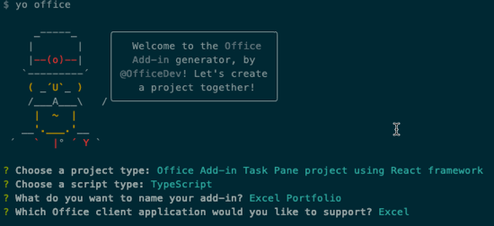

# Build an Office Add-in using React

This demo shows how to build and Office Add-in using React with TypeScript. In addition to Office.js, the demo uses the Office Fabric UI for styling and formatting the user experience.

The finished solution is provided in this folder to simplify demonstrations. If you want to run the finished project, clone the repository, run **npm install**, then **npm run start** and follow one of these methods to sideload and test the Office Add-in.

* Windows: [Sideload Office Add-ins on Windows](https://docs.microsoft.com/en-us/office/dev/add-ins/testing/create-a-network-shared-folder-catalog-for-task-pane-and-content-add-ins)
* Office Online: [Sideload Office Add-ins in Office Online](https://docs.microsoft.com/en-us/office/dev/add-ins/testing/sideload-office-add-ins-for-testing#sideload-an-office-add-in-on-office-online)
* iPad and Mac: [Sideload Office Add-ins on iPad and Mac](https://docs.microsoft.com/en-us/office/dev/add-ins/testing/sideload-an-office-add-in-on-ipad-and-mac)

## Prerequisites

* A consumer [OneDrive](https://www.onedrive.com) account. OneDrive is used to test the Office Add-in.
* Code editor such as [Visual Studio Code](https://code.visualstudio.com/) for developing the solution.
* [Node.js](https://nodejs.org/) LTS: Node is required to setup, build, and run the project.
* [Office Yeoman Generator](https://www.npmjs.com/package/generator-office): The Office Yeoman Generator is used to create the Office Add-in projects and XML manifests.

    ```shell
    npm install -g yo generator-office
    ```

* A free API key from [Alpha Vantage](https://www.alphavantage.co): Registration is free and you will use the API key when creating stock quote requests.

In this exercise, you will develop an Office Add-in using React and TypeScript. You will provision a new project using the Office Yeoman generator, develop the add-in using Office.js, and test the add-in in Microsoft Office Online.

## Running the project

### Provision the Office Add-in

1. Open a terminal/command prompt, and change directories to the location where you want to create the project.
1. Run the **Office Yeoman generator** using the command `yo office`.

    ```shell
    yo office
    ```

1. The Office Yeoman generator will ask a number of question. Use the following responses:
    * Choose a project type? **Office Add-in project using React framework**
    * What do you want to name your add-in? **Excel Portfolio**
    * Which Office client application would you like to support? **Excel**

    

1. When the Yeoman generator completes, change directories to the project folder and open the folder in your favorite code editor (you can use the command `code .` for [Visual Studio Code](https://code.visualstudio.com/)).

    >Note: You should be able to run and sideload the add-in at this point. To do that, follow the steps outlined in [Sideload and Test the Office Add-in](../../Lab.md#exercise-4-sideload-and-test-the-office-add-in). In the next section, you will add additional functionality to the add-in.

### Develop the Office Add-in

1. Open **src/styles.less** and add the following styles to the end of the file.

    ```css
    .container {
        .overlay {
            position: absolute;
            top: 0px;
            bottom: 0px;
            left: 0px;
            right: 0px;
            z-index: 1000;
            display: block;
            .spinner {
                position: absolute;
                top: 50%;
                left: 50%;
                margin-top: -20px;
                margin-left: -20px;
                z-index: 1100;
            }
        }
        .header {
            padding-left: 10px;
        }
        .ms-MessageBar-content {
            padding: 2px !important;
        }
        .pct100 {
            width: 100%;
            float: left;
        }
        .padding10 {
            padding: 10px;
        }
        .right {
            float: right;
        }
        .left {
            float: left;
        }
        .icon {
            padding-left: 8px;
            cursor: pointer;
        }
        .itemRow {
            padding-top: 4px;
            padding-bottom: 4px;
        }
        .itemRow:hover {
            background-color: #eeeeee;
        }
        .tbl-head {
            margin-bottom: 5px;
        }
    }
    ```

1. The project template that the Office Yeoman generator created include a number of React components that need to be updated or deleted.

    Delete the **src/components/HeroList.tsx** file.

1. Open the **src/components/Header.tsx** file and replace the contents with the following code:

    ```typescript
    import * as React from 'react';

    export interface HeaderProps {
        title: string;
    }

    export class Header extends React.Component<HeaderProps, any> {
        constructor(props, context) {
            super(props, context);
        }

        render() {
            return (
                <div className="ms-bgColor-greenDark header">
                    <span className="ms-font-su ms-fontColor-white">{this.props.title}</span>
                </div>
            );
        }
    }
    ```

1. Create a new React component named **Waiting.tsx** in the **src/components** folder and add the following code.

    This component uses the Office UI Fabric React Components for **Overlay** and **Spinner**.

    ```typescript
    import * as React from 'react';
    import { Overlay, Spinner, SpinnerSize } from 'office-ui-fabric-react';

    export class Waiting extends React.Component<any, any> {
      constructor(props, context) {
        super(props, context);
      }

      render() {
        return (
          <Overlay isDarkThemed={true} className="overlay">
            <div className="spinner">
              <Spinner size={SpinnerSize.large} />
            </div>
          </Overlay>
        );
      }
    }
    ```

1. Create a new React component named **StockItem.tsx** in the **src/components** folder and add the following code.

    This component will display a stock with commands for refresh and delete. The component has properties for stock symbol, its index in the list, and the handlers for refresh and delete.

    ```typescript
    import * as React from 'react';

    export interface StockItemProps {
      symbol: string;
      index: number;
      onDelete: any;
      onRefresh: any;
    }

    export class StockItem extends React.Component<StockItemProps, any> {
      constructor(props, context) {
        super(props, context);
      }

      render() {
        return (
          <div className="pct100 itemRow">
            <div className="left">{this.props.symbol}</div>
            <div className="right">
              <div className="left icon">
                <i className="ms-Icon ms-Icon--Refresh" aria-hidden="true" onClick={this.props.onRefresh} />
              </div>
              <div className="left icon">
                <i className="ms-Icon ms-Icon--Delete" aria-hidden="true" onClick={this.props.onDelete} />
              </div>
            </div>
          </div>
        );
      }
    }
    ```

1. Open **src/components/App.tsx** and replace it's contents with the following code.

    ```typescript
    import * as React from 'react';
    import { TextField, MessageBar, MessageBarType } from 'office-ui-fabric-react';
    import { Header } from './header';
    import { Waiting } from './waiting';
    import { StockItem } from './StockItem';

    export interface AppProps {
      title: string;
    }

    export interface AppState {
      listItems: string[];
      waiting: boolean;
      error: string;
    }

    export default class App extends React.Component<AppProps, AppState> {
      constructor(props, context) {
        super(props, context);
        this.state = {
          listItems: [],
          waiting: false,
          error: ''
        };
      }
      
      componentDidMount() {
        // Sync stocks already in Excel table
        this.syncTable().then(() => {});
      }

      // Adds symbol
      addSymbol = async event => {
        //TODO
        console.log(event);
      }

      // Delete symbol
      deleteSymbol = async index => {
        //TODO
        console.log(index);
      }

      // Refresh symbol
      refreshSymbol = async (index: number) => {
        //TODO
        console.log(index);
      }

      // Reads symbols from an existing Excel workbook and pre-populates them in the add-in
      syncTable = async () => {
        //TODO
        console.log('sync');
      }

      // Gets a quote by calling into the stock service
      getQuote = async (symbol: string) => {
        //TODO
        console.log(symbol);
      }

      render() {
        const stocks = this.state.listItems.map((symbol, index) => (
          <StockItem
            symbol={symbol}
            index={index}
            onDelete={this.deleteSymbol.bind(this, index)}
            onRefresh={this.refreshSymbol.bind(this, index)}
          />
        ));
        return (
          <div className="container">
            {this.state.waiting && <Waiting />}
            <Header title={this.props.title} />
            {this.state.error != '' && (
              <MessageBar
                messageBarType={MessageBarType.error}
                isMultiline={false}
                onDismiss={() => {
                  this.setState({ error: '' });
                }}>
                {this.state.error}
              </MessageBar>
            )}
            <div className="padding10">
              <div className="pct100 tbl-head">
                <span className="ms-font-l">Stock Symbols</span>
              </div>
              <div className="pct100">
                <TextField ref="newSymbol" onKeyPress={this.addSymbol.bind(this)} placeholder="Enter a stock symbol (ex: MSFT)" />
              </div>
              {stocks}
            </div>
          </div>
        );
      }
    }
    ```

1. Although the app's functionality isn't complete, the visual markup is. You can see it by saving all your work and returning to Excel Online. It should look similar to the following image.

    > If you previously closed the Excel Online window or if your Office Online session has expired (the add-in doesn't seem to load), follow the [Sideload the Office Add-in](../../Lab.md#exercise-4-sideload-and-test-the-office-add-in) steps.

    

1. The **App.tsx** file has a number of placeholder functions that you will complete to get the add-in functioning. Start by locating the **getQuote** function. This function calls a REST API to get real-time stock statistics on a specific stock symbol. Update it as seen below.

    ```typescript
    getQuote = async (symbol: string) => {
      return new Promise((resolve, reject) => {
        const queryEndpoint = `https://www.alphavantage.co/query?function=BATCH_STOCK_QUOTES&symbols=${escape(symbol)}&interval=1min&apikey=${ALPHAVANTAGE_APIKEY}`;

        fetch(queryEndpoint)
          .then((res: any) => {
            if (!res.ok) {
              reject('Error getting quote');
            }
            return res.json();
          })
          .then((jsonResponse: any) => {
            const quote: any = jsonResponse['Stock Quotes'][0];
            resolve(quote);
          });
      });
    }
    ```

1. Create new **utils** folder in the **src** folder, then create a file named **ExcelTableUtil.tsx**. This TypeScript class will contain helper functions for working with Microsoft Excel tables with office.js. Notice the **ExcelTableUtil** constructor accepts details about the Excel table, including the name, location, and header details.

    ```typescript
    export class ExcelTableUtil {
      tableName: string;
      location: string;
      headers: string[];
      constructor(tableName: string, location: string, headers: string[]) {
        this.tableName = tableName;
        this.location = location;
        this.headers = headers;
      }
    }
    ```

1. Implement the ExcelTableUtil utility class:
    1. Locate and open the file **src/utils/ExcelTableUtil.tsx**.
    1. Add the following methods `ExcelTableUtil` class. These methods access the table in Excel, or creates the table if it doesn't exist.

        ```typescript
        // Create the StocksTable and defines the header row
        createTable = async () => {
          return new Promise(async (resolve, reject) => {
            await Excel.run(async context => {
              // Create a proxy object for the active worksheet and create the table
              const sheet = context.workbook.worksheets.getActiveWorksheet();
              const tableRef = sheet.tables.add(this.location, true);
              tableRef.name = this.tableName;
              tableRef.getHeaderRowRange().values = [this.headers];
              return context.sync().then(() => {
                resolve(tableRef);
              });
            }).catch(createError => {
              reject(createError);
            });
          });
        }

        // Ensures the Excel table is created and tries to get a table reference
        ensureTable = async (forceCreate: boolean) => {
          return new Promise(async (resolve, reject) => {
            await Excel.run(async context => {
              // Create a proxy object for the active worksheet and try getting table reference
              const sheet = context.workbook.worksheets.getActiveWorksheet();
              const tableRef = sheet.tables.getItem(this.tableName);
              return context.sync().then(() => {
                resolve(tableRef);
              });
            }).catch(() => {
              if (forceCreate) {
                // Create a new table because an existing table was not found.
                this.createTable().then(
                  async tableRef => {
                    resolve(tableRef);
                  },
                  createError => {
                    reject(createError);
                  }
                );
              } else {
                resolve(null);
              }
            });
          });
        }
        ```

    1. Add the following method to the `ExcelTableUtil` class.
  
        Notice that it calls the `ensureTable` function we just created to ensure the Excel table has been created.

        ```typescript
        // Appends a row to the table
        addRow = async (data) => {
          return new Promise(async (resolve, reject) => {
            this.ensureTable(true).then(
              async (tableRef: Excel.Table) => {
                await Excel.run(async context => {
                  const sheet = context.workbook.worksheets.getActiveWorksheet();
                  // Add the new row
                  tableRef = sheet.tables.getItem(this.tableName);
                  tableRef.rows.add(null, [data]);
                  // Autofit columns and rows if your Office version supports the API.
                  if (Office.context.requirements.isSetSupported('ExcelApi', 1.2)) {
                    sheet.getUsedRange().format.autofitColumns();
                    sheet.getUsedRange().format.autofitRows();
                  }
                  sheet.activate();
                  return context.sync().then(() => {
                    resolve();
                  });
                }).catch(err => {
                  reject(err);
                });
              },
              err => {
                reject(err);
              }
            );
          });
        }
        ```

1. Update the **App** component to leverage the methods you added to the `ExcelTableUtil` class.
    1. Locate and open the **src/components/App.tsx** file.
    1. Add the following `import` statement after the existing `import` statements for the the new **ExcelTableUtil** class.

        ```typescript
        import { ExcelTableUtil } from '../utils/excelTableUtil';
        ```

    1. Add the following constant after the `import` statements and update the **{{REPLACE_WITH_ALPHAVANTAGE_APIKEY}}** to use your API key.

        ```typescript
        const ALPHAVANTAGE_APIKEY: string = '{{REPLACE_WITH_ALPHAVANTAGE_APIKEY}}';
        ```

    1. Add the following private member to the `App` class:

        ```typescript
        tableUtil: ExcelTableUtil = new ExcelTableUtil('Portfolio', 'A1:H1', [
          'Symbol',
          'Last Price',
          'Timestamp',
          'Quantity',
          'Price Paid',
          'Total Gain',
          'Total Gain %',
          'Value'
        ]);
        ```

    1. Update the `addSymbol()` method to the following code:

        ```typescript
        // Adds symbol
        addSymbol = async (event) => {
          if (event.key === 'Enter') {
            let element = this.refs.newSymbol as TextField;
            let symbol = element.value.toUpperCase();

            // Get quote and add to Excel table
            this.setState({ waiting: true });
            this.getQuote(symbol).then(
              (res: any) => {
                let data = [
                  res['1. symbol'], //Symbol
                  res['2. price'], //Last Price
                  res['4. timestamp'], // Timestamp of quote,
                  0, // quantity (manually entered)
                  0, // price paid (manually entered)
                  '=(B:B * D:D) - (E:E * D:D)', //Total Gain $
                  '=H:H / (E:E * D:D) * 100', //Total Gain %
                  '=B:B * D:D' //Value
                ];
                this.tableUtil.addRow(data).then(
                  () => {
                    let symbols = this.state.listItems;
                    symbols.unshift(element.state.value.toUpperCase());
                    this.setState({ listItems: symbols });
                    element.setState({ value: '' });
                    this.setState({ waiting: false });
                  },
                  err => {
                    this.setState({ error: err });
                    this.setState({ waiting: false });
                  }
                );
              },
              err => {
                this.setState({ error: err });
                this.setState({ waiting: false });
              }
            );
          }
        }
        ```

        >Note: This is a good time to test the **add symbol** function of your add-in.

1. Update the **ExcelTableUtil** utility to add support for accessing and deleting rows:
    1. Locate and open the **src/components/ExcelTableUtil.tsx** file.
    1. Add the following methods to the `ExcelTableUtil` class:

        ```typescript
        // Gets data for a specific named column
        getColumnData = async (column: string) => {
          return new Promise(async (resolve, reject) => {
            this.ensureTable(false).then(
              async (tableRef: Excel.Table) => {
                if (tableRef == null) {
                  resolve([]);
                } else {
                  await Excel.run(async context => {
                    // Get column range by column name
                    const colRange = tableRef.columns
                      .getItem(column)
                      .getDataBodyRange()
                      .load('values');
                    // Sync to populate proxy objects with data from Excel
                    return context.sync().then(async () => {
                      let data: string[] = [];
                      for (let i = 0; i < colRange.values.length; i++) {
                        data.push(colRange.values[i].toString());
                      }
                      resolve(data);
                    });
                  }).catch(err => {
                    reject(err);
                  });
                }
              },
              err => {
                reject(err);
              }
            );
          });
        }

        // Deletes a column based by row index
        deleteRow = async (index: number) => {
          return new Promise(async (resolve, reject) => {
            this.ensureTable(true).then(
              async (tableRef: Excel.Table) => {
                await Excel.run(async context => {
                  const range = tableRef.rows.getItemAt(index).getRange();
                  range.delete(Excel.DeleteShiftDirection.up);
                  return context.sync().then(async () => {
                    resolve();
                  });
                }).catch(err => {
                  reject(err);
                });
              },
              err => {
                reject(err);
              }
            );
          });
        }
        ```

1. Update the **App** component to leverage the methods you added to the `ExcelTableUtil` class.
    1. Locate and open the **src/components/App.tsx** file.
    1. Locate and update the `deleteSymbol()` method in the `App` class to delete specifying symbol from the Excel table

        ```typescript
        // Delete symbol
        deleteSymbol = async index => {
          // Delete from Excel table by index number
          let symbols = this.state.listItems;
          let symbol = symbols[index];
          this.setState({ waiting: true });
          this.tableUtil.getColumnData('Symbol').then(
            async (columnData: string[]) => {
              // Ensure the symbol was found in the Excel table
              if (columnData.indexOf(symbol) !== -1) {
                this.tableUtil.deleteRow(columnData.indexOf(symbol)).then(
                  async () => {
                    symbols.splice(index, 1);
                    this.setState({ listItems: symbols });
                    this.setState({ waiting: false });
                  },
                  err => {
                    this.setState({ error: err });
                    this.setState({ waiting: false });
                  }
                );
              } else {
                symbols.splice(index, 1);
                this.setState({ waiting: false });
              }
            },
            err => {
              this.setState({ error: err });
              this.setState({ waiting: false });
            }
          );
        }
        ```

    >Note: This is a good time to test the **delete symbol** function of your add-in.

1. Update the **ExcelTableUtil** utility to add support for refreshing rows in the table:
    1. Locate and open the **src/components/ExcelTableUtil.tsx** file.
    1. Add the following methods to the `ExcelTableUtil` class:

        ```typescript
        // Updates a specific cell in the table
        updateCell = async (address: string, value: any) => {
          return new Promise(async (resolve, reject) => {
            this.ensureTable(true).then(
              async () => {
                await Excel.run(async context => {
                  const sheet = context.workbook.worksheets.getActiveWorksheet();
                  const range = sheet.getRange(address);
                  range.values = [[value]];
                  return context.sync().then(async () => {
                    resolve();
                  });
                }).catch(err => {
                  reject(err);
                });
              },
              err => {
                reject(err);
              }
            );
          });
        }
        ```

1. Update the **App** component to leverage the methods you added to the `ExcelTableUtil` class.
    1. Locate and open the **src/components/App.tsx** file.
    1. Locate and update the `refreshSymbol()` method in the `App` class to specify a symbol to refresh in the Excel table.

        ```typescript
        // Refresh symbol
        refreshSymbol = async (index: number) => {
          // Refresh stock quote and update Excel table
          let symbols = this.state.listItems;
          let symbol = symbols[index];
          this.setState({ waiting: true });
          this.tableUtil.getColumnData('Symbol').then(
            async (columnData: string[]) => {
              // Ensure the symbol was found in the Excel table
              const rowIndex = columnData.indexOf(symbol);
              if (rowIndex !== -1) {
                this.getQuote(symbol).then((res: any) => {
                  // "last trade" is in column B with a row index offset of 2 (row 0 + the header row)
                  this.tableUtil
                    .updateCell(`B${rowIndex + 2}:B${rowIndex + 2}`, res.current)
                    .then(
                      async () => {
                        this.setState({ waiting: false });
                      },
                      err => {
                        this.setState({ error: err });
                        this.setState({ waiting: false });
                      }
                    );
                });
              } else {
                this.setState({ error: 'Symbol not in table' });
                symbols.splice(index, 1);
                this.setState({ waiting: false });
              }
            },
            err => {
              this.setState({ error: err });
              this.setState({ waiting: false });
            }
          );
        }
        ```

    >Note: This is a good time to test the **refresh symbol** function of your add-in.

1. Update the `syncTable` function, which is called when the add-in is launched in the constructor of **App.tsx** to pull in any stock symbols that might already exist in the worksheet. It calls `getColumnData` to get this data.

    ```typescript
    syncTable = async () => {
      this.setState({ waiting: true });
      this.tableUtil.getColumnData('Symbol').then(
        async (columnData: string[]) => {
          this.setState({ listItems: columnData });
          this.setState({ waiting: false });
        },
        err => {
          this.setState({ error: err });
          this.setState({ waiting: false });
        }
      );
    }
    ```

The Excel Portfolio Add-in written with React and TypeScript is complete. You should now follow the steps to [Sideload and Test the Office Add-in](../../Lab.md#exercise-4-sideload-and-test-the-office-add-in).
