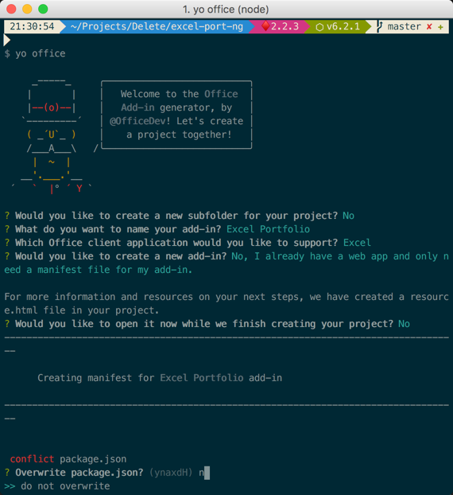
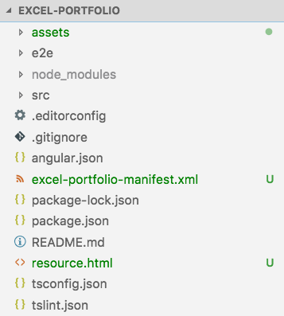

# Build an Office Add-in using Angular

In this exercise, you will develop an Office Add-in using Angular and TypeScript. You will provision a new project using the Angular CLI and Office Yeoman generator, develop the add-in using Office.js, and test the add-in in Office Online.

The finished solution is provided in this folder to simplify demonstrations. If you want to run the finished project, clone the repository, run **npm install**, then **npm run start** and follow one of these methods to sideload and test the Office Add-in.

* Windows: [Sideload Office Add-ins on Windows](https://docs.microsoft.com/en-us/office/dev/add-ins/testing/create-a-network-shared-folder-catalog-for-task-pane-and-content-add-ins)
* Office Online: [Sideload Office Add-ins in Office Online](https://docs.microsoft.com/en-us/office/dev/add-ins/testing/sideload-office-add-ins-for-testing#sideload-an-office-add-in-on-office-online)
* iPad and Mac: [Sideload Office Add-ins on iPad and Mac](https://docs.microsoft.com/en-us/office/dev/add-ins/testing/sideload-an-office-add-in-on-ipad-and-mac)

## Prerequisites

* A consumer [OneDrive](https://www.onedrive.com) account. OneDrive is used to test the Office Add-in.
* Code editor such as [Visual Studio Code](https://code.visualstudio.com/) for developing the solution.
* [Node.js](https://nodejs.org/) LTS: Node is required to setup, build, and run the project.
* [Angular CLI](https://cli.angular.io/) v6: The Angular CLI is used to provision the Angular web application in the [Build an Office Add-in using Angular](#exercise-2-build-an-office-add-in-using-angular) exercise.

    ```shell
    npm install -g @angular/cli
    ```

* [Office Yeoman Generator](https://www.npmjs.com/package/generator-office): The Office Yeoman Generator is used to create the Office Add-in projects and XML manifests.

    ```shell
    npm install -g yo generator-office
    ```

* A free API key from [Alpha Vantage](https://www.alphavantage.co): Registration is free and you will use the API key when creating stock quote requests.

In this exercise, you will develop an Office Add-in using React and TypeScript. You will provision a new project using the Office Yeoman generator, develop the add-in using Office.js, and test the add-in in Microsoft Office Online.

## Running the project

### Provision the Office Add-in

1. Open a terminal/command prompt, and change directories to the location where you want the project provisioned.

1. Use the **Angular CLI** to provision the new application with the name **excel-portfolio**.

    ```shell
    ng new excel-portfolio
    ```

1. After the Angular CLI completes, change directories to the new project folder it created.

    ```shell
    cd excel-portfolio
    ```

1. Run the **Office Yeoman generator** using the command `yo office`.

    ```shell
    yo office
    ```

1. The Office Yeoman generator will ask a number of question. Use the following responses:
    * Choose a project type **Office Add-in containing the manifest only**
    * What do you want to name your add-in? **Excel Portfolio**
    * Which Office client application would you like to support? **Excel**

    

1. When the Yeoman generator completes, locate the **Excel Portfolio** folder and delete the following files:
    * node_modules folder
    * package.json
    * package-lock.json

1. Move all the remaining files/folders in the **Excel Portfolio** folder to the root of the **excel-portfolio** Angular project. The final project structure should look similar to this (subject to updates in Angular CLI):

    

1. Open the **excel-portfolio** project folder in a code editor (you can use the command `code .` for [Visual Studio Code](https://code.visualstudio.com/)).

1. Alter the `package.json` generated by the Angular CLI for Office Add-in specific requirements:
    1. Locate & open the **package.json** file in the root of the project.
    1. Update the `scripts "start"` script to use **ssl** and port **3000** (the port configured in the Office Add-in xml manifest by the Yeoman generator)

    ```json
    "scripts": {
      ...
      "start": "ng serve --ssl true --port 3000",
      ...
    },
    ```

1. Update the project dependencies to update references to RXJS:
    1. Open a command prompt.
    1. Change to the directory in the root of the project, where the `package.json` file is located.
    1. Execute the following command:

    ```shell
    npm install rxjs@6.2.0 rxjs-compat@6.2.0 --save
    ```

1. Add the Office.js TypeScript type declarations to the project:
    1. Open a command prompt.
    1. Change to the directory in the root of the project, where the `package.json` file is located.
    1. Execute the following command:

        ```shell
        npm install @types/office-js --save-dev
        ```

1. Open **src/index.html** and add CDN references to **office.js** and the **Office UI Fabric** to the `<head>` and `<body>` sections of the file:
    > Note: Although this lab adds CDN references to Office.js and the Office UI Fabric, you can alternatively install them locally using npm. The **.angular-cli.json** file can be updated to include any local scripts that should be included in the webpack build.

    ```html
    <!doctype html>
    <html lang="en">
    <head>
        <meta charset="utf-8">
        <title>ExcelPortfolio</title>
        <base href="/">

        <meta name="viewport" content="width=device-width, initial-scale=1">
        <link rel="icon" type="image/x-icon" href="favicon.ico">

        <link rel="stylesheet" href="https://static2.sharepointonline.com/files/fabric/office-ui-fabric-js/1.2.0/css/fabric.min.css" />
        <link rel="stylesheet" href="https://static2.sharepointonline.com/files/fabric/office-ui-fabric-js/1.2.0/css/fabric.components.min.css" />
    </head>
    <body>
        <app-root></app-root>
        <script type="text/javascript" src="https://appsforoffice.microsoft.com/lib/1.1/hosted/office.debug.js"></script>
        <script type="text/javascript" src="https://static2.sharepointonline.com/files/fabric/office-ui-fabric-js/1.2.0/js/fabric.min.js"></script>
    </body>
    </html>
    ```

1. Update the Angular app's bootstrapping process to initialize the Office Add-in:
    1. Locate and open the **src/main.ts** file.
    1. Add the following line to the top of the file to import the TypeScript type declaration:

        ```typescript
        /// <reference types="@types/office-js/index" />
        ```

    1. Locate where the `bootstrapModule()` is being called to bootstrap the `AppModule`. Replace the the entire bootstrapping code with the following code:

    ```typescript
    Office.initialize = () => {
      platformBrowserDynamic()
        .bootstrapModule(AppModule)
        .catch(err => console.log(err));
    };
    ```

    >Note: You should be able to run and sideload the add-in at this point. Follow the steps outlined in [Sideload and Test the Office Add-in](../../Lab.md#exercise-4-sideload-and-test-the-office-add-in). In the next section, you will add additional functionality to the add-in.
    >
    > If the add-in does not load an you eventually see an error message in the task pane, it's likely your workstation is not configured to trust the self-signed certificate used by the Angular CLI. Verify this by trying to navigate to https://localhost:3000/assets/icon-32.png and look at the browser's address bar. If it says something other than "secure", this is the issue as Office will not load add-ins from an unsecure / untrusted location. Refer to the steps in the following document to resolve this before proceeding: [Adding Self-Signed Certificates as Trusted Root Certificate](https://github.com/OfficeDev/generator-office/blob/master/src/docs/ssl.md).

    

### Develop the Office Add-in

1. Open **src/styles.css** and replace the entire file with the contents shown below.

    ```css
    /* You can add global styles to this file, and also import other style files */
    .header {
        padding: 10px;
    }

    .content {
        margin-top: 10px;
    }

    .hover:hover {
        background: #f8f8f8;
    }

    .overlay {
        position: absolute;
        top: 0px;
        bottom: 0px;
        left: 0px;
        right: 0px;
        background: hsla(0,0%,100%,.4);
        z-index: 1000;
    }

    .spinner {
        position: absolute;
        top: 50%;
        left: 50%;
        margin-top: -20px;
        margin-left: -20px;
        z-index: 1100;
    }

    .ms-MessageBar-content {
        padding: 2px !important;
    }

    .pct100 {
        width: 100%;
        float: left;
    }

    .padding10 {
        padding: 10px;
    }

    .right {
        float: right;
    }

    .left {
        float: left;
    }

    .icon {
        padding-left: 8px;
        cursor: pointer;
    }

    .itemRow {
        padding-top: 4px;
        padding-bottom: 4px;
    }

    .itemRow:hover {
        background-color: #eeeeee;
    }

    .tbl-head {
        margin-bottom: 5px;
    }
    ```

1. Copy the **spinner.gif** image from the **LabFiles** folder into **src/assets** of your project directory.

    

1. Update the app module to import Angular's HttpModule that you will use to call a REST API:
    1. Open the **src/app/app.module.ts** file.
    1. Add the following `import` statement after the existing `import` statements:

        ```typescript
        import { HttpModule } from '@angular/http';
        ```

    1. Add the `HttpModule` after the existing `BrowserModule` to the `imports` array that is passed into the `@NgModule` decorator:

        ```typescript
        @NgModule({
          ...
          imports: [
            BrowserModule,
            HttpModule
          ],
          ...
        })
        ```

1. Angular allows you to break your solution up into components. The Angular CLI already created an app component. Open **src/app/app.component.html** to update it's markup as seen below.

    ```html
    <!--The content below is only a placeholder and can be replaced.-->
    <div>
        <div *ngIf="waiting">
            <div class="overlay"></div>
            
        </div>
        <div class="ms-bgColor-greenDark header">
            <span class="ms-font-su ms-fontColor-white">Excel Portfolio</span>
        </div>
        <div>
            <div class="ms-MessageBanner" *ngIf="error">
                <div class="ms-MessageBanner-content" style="text-align: left; margin-left: 40px;">
                    <div class="ms-MessageBanner-text ms-font-s-plus">
                        <div class="ms-MessageBanner-clipper">
                            <i class="ms-Icon ms-Icon--Error"></i>
                            <span style="vertical-align: top;">&nbsp;{{error}}</span>
                        </div>
                    </div>
                </div>
                <button class="ms-MessageBanner-close" (click)="error = null;">
                    <i class="ms-Icon ms-Icon--Clear"></i>
                </button>
            </div>
            <div class="padding10">
                <div class="pct100 tbl-head">
                    <span class="ms-font-l">Stock Symbols</span>
                </div>
                <div class="pct100">
                    <input class="ms-TextField-field" #newSymbol (keyup.enter)="addSymbol(newSymbol.value); newSymbol.value = '';" placeholder="Enter a stock symbol (ex: MSFT)" />
                </div>
                <div class="pct100 itemRow" *ngFor="let symbol of symbols; let i = index" >
                    <div class="left ms-font-l">{{symbol}}</div>
                    <div class="right">
                        <div class="left icon" (click)="refreshSymbol(i)"><i class="ms-Icon ms-Icon--Refresh" aria-hidden="true"></i></div>
                        <div class="left icon" (click)="deleteSymbol(i)"><i class="ms-Icon ms-Icon--Delete" aria-hidden="true"></i></div>
                    </div>
                </div>
                <div class="pct100 itemRow" *ngIf="symbols.length == 0">
                    <em class="ms-font-l">No symbols added</em>
                </div>
            </div>
        </div>
    </div>
    ```

1. Next, open **src/app/app.component.ts** and update it as follows.

    ```typescript
    import { Component, NgZone } from '@angular/core';
    import 'rxjs/add/operator/map';
    import { Observable } from 'rxjs';
    import { map } from 'rxjs/operators';
    import { Http } from '@angular/http';

    @Component({
      selector: 'app-root',
      templateUrl: './app.component.html',
      styleUrls: ['./app.component.css']
    })
    export class AppComponent {
      // AppComponent properties
      symbols: string[] = [];
      error: string = null;
      waiting = false;
      zone: NgZone = new NgZone({});

      // AppComponent constructor
      constructor(private http: Http) {
        this.syncTable().then(() => {});
      }
      // Adds symbol
      addSymbol = async (symbol: string) => {
        //TODO
        console.log(symbol);
      }

      // Delete symbol
      deleteSymbol = async (index: number) => {
        //TODO
        console.log(index);
      }

      // Refresh symbol
      refreshSymbol = async (index: number) => {
        //TODO
        console.log(index);
      }

      // Reads symbols from an existing Excel workbook and pre-populates them in the add-in
      syncTable = async () => {
        //TODO
        console.log('syncTable');
      }

      // Gets a quote by calling into the stock service
      getQuote = async (symbol: string) => {
        //TODO
        console.log(symbol);
      }
    }
    ```

1. Although the app's functionality isn't complete, the visual markup is. You can see it by saving all your work and returning to Office Online. It should look similar to below. If you previously closed the Excel Online window or if your Office Online session has expired (the add-in doesn't seem to load), follow the [Sideload the Office Add-in](../../Lab.md#exercise-4-sideload-and-test-the-office-add-in) steps above.

    

1. The **app.component.ts** file has a number of placeholder functions that you will complete to get the add-in functioning.
    1. Locate & open the **src/app/app.component.ts** file.
    1. Add the following constant after the `import` statements and update the **{{REPLACE_WITH_ALPHAVANTAGE_APIKEY}}** to use your API key.

        ```typescript
        const ALPHAVANTAGE_APIKEY: string = '{{REPLACE_WITH_ALPHAVANTAGE_APIKEY}}';
        ```

    1. Locate the `getQuote()` method. This function calls a REST API to get real-time stock statistics on a specific stock symbol. Update it as seen below.

        ```typescript
        // Gets a quote by calling into the stock service
        getQuote = async (symbol:string) => {
          return new Promise((resolve, reject) => {
            const queryEndpoint = `https://www.alphavantage.co/query?function=BATCH_STOCK_QUOTES&symbols=${escape(
              symbol
            )}&interval=1min&apikey=${ALPHAVANTAGE_APIKEY}`;

            fetch(queryEndpoint)
              .then((res: any) => {
                if (!res.ok) {
                  reject('Error getting quote');
                }
                return res.json();
              })
              .then((jsonResponse: any) => {
                const quote: any = jsonResponse['Stock Quotes'][0];
                resolve(quote);
              });
          });
        }
        ```

1. Create new **utils** folder under **src/app** and then create a file named **excelTableUtil.ts** in it (**src/app/utils/excelTableUtil.ts**). This TypeScript class will contain helper functions for working with Excel tables with office.js. Notice the `ExcelTableUtil` constructor accepts details about the Excel table, including the name, location, and header details.

    ```typescript
    /// <reference path="../../../node_modules/@types/office-js/index.d.ts" />

    export class ExcelTableUtil {
      tableName: string;
      location: string;
      headers: string[];
      constructor(tableName: string, location: string, headers: string[]) {
        this.tableName = tableName;
        this.location = location;
        this.headers = headers;
      }

      // ExcelTableUtil functions here
    }
    ```

1. Implement the ExcelTableUtil utility class:
    1. Locate and open the file **src/utils/ExcelTableUtil.tsx**.
    1. Add the following methods `ExcelTableUtil` class. These methods access the table in Excel, or creates the table if it doesn't exist.

        ```typescript
        // Create the StocksTable and defines the header row
        createTable = async () => {
          return new Promise(async (resolve, reject) => {
            await Excel.run(async context => {
              // Create a proxy object for the active worksheet and create the table
              const sheet = context.workbook.worksheets.getActiveWorksheet();
              const tableRef = sheet.tables.add(this.location, true);
              tableRef.name = this.tableName;
              tableRef.getHeaderRowRange().values = [this.headers];
              return context.sync().then(() => {
                resolve(tableRef);
              });
            }).catch(createError => {
              reject(createError);
            });
          });
        }

        // Ensures the Excel table is created and tries to get a table reference
        ensureTable = async (forceCreate: boolean) => {
          return new Promise(async (resolve, reject) => {
            await Excel.run(async context => {
              // Create a proxy object for the active worksheet and try getting table reference
              const sheet = context.workbook.worksheets.getActiveWorksheet();
              const tableRef = sheet.tables.getItem(this.tableName);
              return context.sync().then(() => {
                resolve(tableRef);
              });
            }).catch(() => {
              if (forceCreate) {
                // Create a new table because an existing table was not found.
                this.createTable().then(
                  async tableRef => {
                    resolve(tableRef);
                  },
                  createError => {
                    reject(createError);
                  }
                );
              } else {
                resolve(null);
              }
            });
          });
        }
        ```

    1. Add the following method to the `ExcelTableUtil` class.
  
        Notice that it calls the `ensureTable` function we just created to ensure the Excel table has been created.

        ```typescript
        // Appends a row to the table
        addRow = async (data) => {
          return new Promise(async (resolve, reject) => {
            this.ensureTable(true).then(
              async (tableRef: Excel.Table) => {
                await Excel.run(async context => {
                  const sheet = context.workbook.worksheets.getActiveWorksheet();
                  // Add the new row
                  tableRef = sheet.tables.getItem(this.tableName);
                  tableRef.rows.add(null, [data]);
                  // Autofit columns and rows if your Office version supports the API.
                  if (Office.context.requirements.isSetSupported('ExcelApi', 1.2)) {
                    sheet.getUsedRange().format.autofitColumns();
                    sheet.getUsedRange().format.autofitRows();
                  }
                  sheet.activate();
                  return context.sync().then(() => {
                    resolve();
                  });
                }).catch(err => {
                  reject(err);
                });
              },
              err => {
                reject(err);
              }
            );
          });
        }
        ```

1. Update the **App** component to leverage the methods you added to the `ExcelTableUtil` class.
    1. Locate and open the **src/app/app.component.ts** file.
    1. Add the following `import` statement after the existing `import` statements for the the new **ExcelTableUtil** class.

        ```typescript
        import { ExcelTableUtil } from './utils/excelTableUtil';
        ```

    1. Add the following private members to the `AppComponent` class:

        ```typescript
        symbols: string[] = [];
        error: string = null;
        waiting = false;
        zone: NgZone = new NgZone({});

        tableUtil: ExcelTableUtil = new ExcelTableUtil('Portfolio', 'A1:H1', [
          'Symbol',
          'Last Price',
          'Timestamp',
          'Quantity',
          'Price Paid',
          'Total Gain',
          'Total Gain %',
          'Value'
        ]);
        ```

    1. Update the `addSymbol()` method to the following code:

        ```typescript
        // Adds symbol
        addSymbol = async (symbol: string) => {
          this.waiting = true;

          // Get quote and add to Excel table
          this.getQuote(symbol).then(
            (res: any) => {
              const data = [
                res['1. symbol'], //Symbol
                res['2. price'], //Last Price
                res['4. timestamp'], // Timestamp of quote,
                0, // quantity (manually entered)
                0, // price paid (manually entered)
                '=(B:B * D:D) - (E:E * D:D)', //Total Gain $
                '=H:H / (E:E * D:D) * 100', //Total Gain %
                '=B:B * D:D' //Value
              ];
              this.tableUtil.addRow(data).then(
                () => {
                  this.symbols.unshift(symbol.toUpperCase());
                  this.waiting = false;
                },
                (err: any) => {
                  this.error = err;
                }
              );
            },
            err => {
              this.error = err;
              this.waiting = false;
            }
          ); // this.getquote
        }
        ```

1. Update the **ExcelTableUtil** utility to add support for accessing and deleting rows:
    1. Locate and open the **src/components/ExcelTableUtil.tsx** file.
    1. Add the following methods to the `ExcelTableUtil` class:

        ```typescript
        // Gets data for a specific named column
        getColumnData = async (column: string) => {
          return new Promise(async (resolve, reject) => {
            this.ensureTable(false).then(
              async (tableRef: Excel.Table) => {
                if (tableRef == null) {
                  resolve([]);
                } else {
                  await Excel.run(async context => {
                    // Get column range by column name
                    const colRange = tableRef.columns
                      .getItem(column)
                      .getDataBodyRange()
                      .load('values');
                    // Sync to populate proxy objects with data from Excel
                    return context.sync().then(async () => {
                      let data: string[] = [];
                      for (let i = 0; i < colRange.values.length; i++) {
                        data.push(colRange.values[i].toString());
                      }
                      resolve(data);
                    });
                  }).catch(err => {
                    reject(err);
                  });
                }
              },
              err => {
                reject(err);
              }
            );
          });
        }

        // Deletes a column based by row index
        deleteRow = async (index: number) => {
          return new Promise(async (resolve, reject) => {
            this.ensureTable(true).then(
              async (tableRef: Excel.Table) => {
                await Excel.run(async context => {
                  const range = tableRef.rows.getItemAt(index).getRange();
                  range.delete(Excel.DeleteShiftDirection.up);
                  return context.sync().then(async () => {
                    resolve();
                  });
                }).catch(err => {
                  reject(err);
                });
              },
              err => {
                reject(err);
              }
            );
          });
        }
        ```

1. Update the **AppComponent** component to leverage the methods you added to the `ExcelTableUtil` class.
    1. Locate and open the **src/app/app.component.ts** file.

    ```typescript
    // Delete symbol
    deleteSymbol = async (index: number) => {
      // Delete from Excel table by index number
      const symbol = this.symbols[index];
      this.waiting = true;
      this.tableUtil.getColumnData('Symbol').then(
        async (columnData: string[]) => {
          // Ensure the symbol was found in the Excel table
          if (columnData.indexOf(symbol) !== -1) {
            this.tableUtil.deleteRow(columnData.indexOf(symbol))
            .then(async () => {
                this.symbols.splice(index, 1);
                this.waiting = false;
            }, err => {
              this.error = err;
              this.waiting = false;
            });
          } else {
            this.symbols.splice(index, 1);
            this.waiting = false;
          }
        }, (err) => {
          this.error = err;
          this.waiting = false;
        }
      );
    }
    ```

    >Note: This is a good time to test the **delete symbol** function of your add-in.

1. Update the **ExcelTableUtil** utility to add support for refreshing rows in the table:
    1. Locate and open the **src/components/ExcelTableUtil.tsx** file.
    1. Add the following methods to the `ExcelTableUtil` class:

        ```typescript
        // Updates a specific cell in the table
        updateCell = async (address: string, value: any) => {
          return new Promise(async (resolve, reject) => {
            this.ensureTable(true).then(
              async () => {
                await Excel.run(async context => {
                  const sheet = context.workbook.worksheets.getActiveWorksheet();
                  const range = sheet.getRange(address);
                  range.values = [[value]];
                  return context.sync().then(async () => {
                    resolve();
                  });
                }).catch(err => {
                  reject(err);
                });
              },
              err => {
                reject(err);
              }
            );
          });
        }
        ```

1. Update the **AppComponent** component to leverage the methods you added to the `ExcelTableUtil` class.
    1. Update the **App** component to leverage the methods you added to the `ExcelTableUtil` class.
    1. Locate and open the **src/app/app.component.ts** file.
    1. Locate and update the `refreshSymbol()` method to specify a symbol to refresh in the Excel table.

        ```typescript
        // Refresh symbol
        refreshSymbol = async (index: number) => {
          // Refresh stock quote and update Excel table
          const symbol = this.symbols[index];
          this.waiting = true;
          this.tableUtil.getColumnData('Symbol')
            .then(async (columnData: string[]) => {
              // Ensure the symbol was found in the Excel table
              const rowIndex = columnData.indexOf(symbol);
              if (rowIndex !== -1) {
                this.getQuote(symbol).then((res: any) => {
                  // "last trade" is in column B with a row index offset of 2 (row 0 + the header row)
                  this.tableUtil.updateCell(`B${rowIndex + 2}:B${rowIndex + 2}`, res['2. price'])
                  .then(async () => {
                    this.waiting = false;
                  }, (err) => {
                    this.error = err;
                    this.waiting = false;
                  });
                });
              } else {
                this.error = `${symbol} not found in Excel`;
                this.symbols.splice(index, 1);
                this.waiting = false;
              }
            }, (err) => {
              this.error = err;
              this.waiting = false;
            });
        }
        ```

    >Note: This is a good time to test the **refresh symbol** function of your add-in.

    1. Finally, update the `syncTable()` method to the following:

        ```typescript
        // Reads symbols from an existing Excel workbook and pre-populates them in the add-in
        syncTable = async () => {
          this.waiting = true;
          this.tableUtil.getColumnData('Symbol')
            .then(async (columnData: string[]) => {
              this.symbols = columnData;
              this.waiting = false;
            }, (err) => {
              this.error = err;
              this.waiting = false;
            });
        }
        ```
