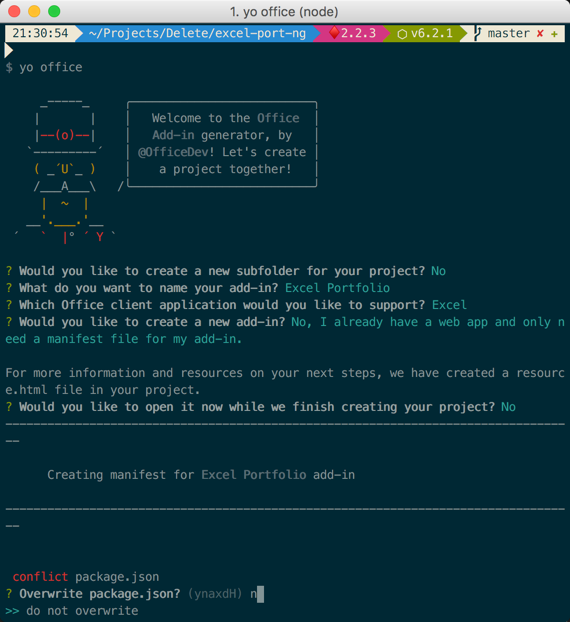
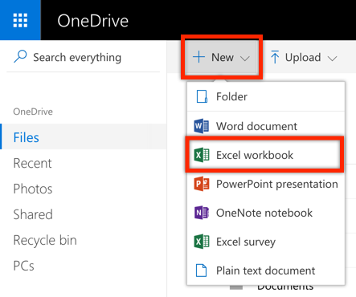
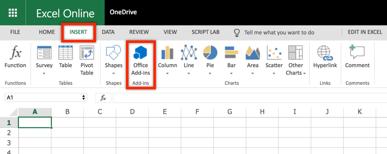
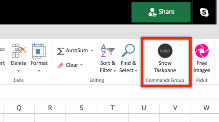
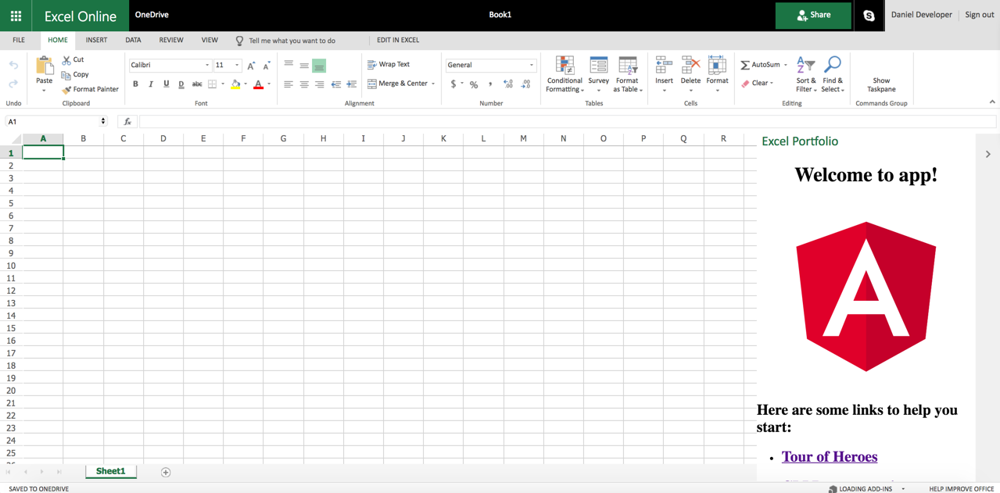
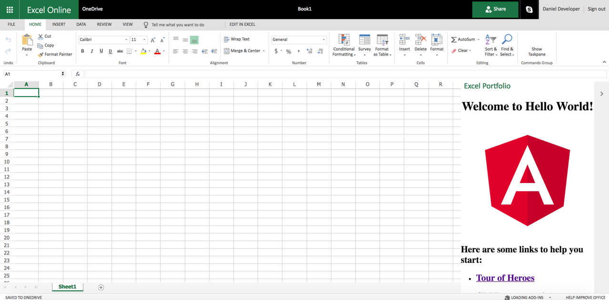

# Office Add-ins: Build an Office Add-in using modern JavaScript tools and techniques - 300 Level

----------------
In this demo, you will build an Office Add-in using a number of popular JavaScript tools and techniques. 

# Running the project

The finished solution is provided in this folder to simplify demonstrations. If you want to run the finished project, clone the repository, run **npm install**, then **npm run start** and follow the steps to [Sideload the Office Add-in](#sideload-the-office-add-in).

# Build an Office Add-in using Vue.js

## Table of contents

* [Introduction](#introduction)
* [Prerequisites](#prerequisites)
* [Provision the Office Add-in](#provision-the-office-add-in)
* [Sideload the Office Add-in](#sideload-the-office-add-in)
* [Develop the Office Add-in](#develop-the-office-add-in)
* [Questions and comments](#questions-and-comments)
* [Contributing](#contributing)
* [Additional resources](#additional-resources)

## Introduction

This sample shows how to build and Office Add-in using Angular with TypeScript. In addition to Office.js, the sample uses the Office Fabric UI for styling and formatting the user experience.

## Prerequisites

To complete this lab, you need the following:

* Consumer [OneDrive](https://www.onedrive.com) account. OneDrive is used to test the Office Add-in  (via Office Online).
* A lightweight code editor such as [Visual Studio Code](https://code.visualstudio.com/) for developing the solution.
* [Node.js](https://nodejs.org/). Node is required to setup, build, and run the project. Node 6.9.0 or higher, together with NPM 3 or higher are recommended.
* [Angular CLI](https://cli.angular.io/). The Angular CLI is used to provision the Angular web application.

    ```shell
    npm install -g @angular/cli
    ```

* [The Office Yeoman Generator](https://www.npmjs.com/package/generator-office). The Office Yeoman Generator is used to create the Office Add-in xml manifest file.

    ```shell
    npm install -g yo generator-office
    ```

## Provision the Office Add-in

In this section you will use the Angular CLI, the Office Yeoman generator, and Node Package Manager (npm) to provision and configure the Office Add-in project.

1. Open a terminal/command prompt, and change directories to the location where you want the project provisioned.

1. Use the **Angular CLI** to provision the new application with the name **excel-portfolio**.

    ```shell
    ng new excel-portfolio
    ```

1. After the Angular CLI completes, change directories to the new project folder it created.

    ```shell
    cd excel-portfolio
    ```

1. Next, run the **Office Yeoman generator** using the "**yo office**" command.

    ```shell
    yo office
    ```

1. Run the **Office Yeoman generator** using the command "**yo office**".

    ```shell
    yo office
    ```

1. The Office Yeoman generator will ask a number of question. Use the following responses:
    * Would you like to create a new subfolder for your project? **No**
    * What do you want to name your add-in? **Excel Portfolio**
    * Which Office client application would you like to support? **Excel**
    * Would you like to create a new add-in? **No, I already have a web app and only need a manifest file for my add-in**
    * For more information and resources on your next steps, we have created a resource.html file in your project. Would you like to open it now while we finish creating your project? **No**
    * Overwrite package.json? **do not overwrite**

    

1. When then Yeoman generator completes, change directories to the project folder (ex: **cd excel-portfolio**) and open the folder in your favorite code editor (you can use the command "**code .**" for [Visual Studio Code](https://code.visualstudio.com/)).

1. Locate the **package.json** file in the root directory and modify the **start** script to use **SSL** and port **3000** (the port configured in the Office Add-in xml manifest by the Yeoman generator)

    ```javascript
    "scripts": {
        "ng": "ng",
        "start": "ng serve --ssl true --port 3000",
        "build": "ng build",
        "test": "ng test",
        "lint": "ng lint",
        "e2e": "ng e2e"
    },
    ```

1. Next, add Office.js typings (**@types/office-js**) to the **dependencies** section.

    ```javascript
    "@types/office-js": "^0.0.48"
    ```

1. Run **npm install** at the command prompt to pull these dependencies into the project.

    ```javascript
    npm install</pre>
    ```

1. Next, open **src/index.html** and add CDN references to **office.js** and the **Office UI Fabric**.
    > Note: although this lab adds CDN references to Office.js and the Office UI Fabric, you can alternatively install them locally using npm. The .angular-cli.json file can be updated to include any local scripts that should be included in the webpack build.

    ````html
    <!doctype html>
    <html lang="en">
    <head>
        <meta charset="utf-8">
        <title>ExcelPortfolio</title>
        <base href="/">

        <meta name="viewport" content="width=device-width, initial-scale=1">
        <link rel="stylesheet" href="https://static2.sharepointonline.com/files/fabric/office-ui-fabric-js/1.2.0/css/fabric.min.css" />
        <link rel="stylesheet" href="https://static2.sharepointonline.com/files/fabric/office-ui-fabric-js/1.2.0/css/fabric.components.min.css" />
    </head>
    <body>
        <app-root></app-root>
        <script type="text/javascript" src="https://appsforoffice.microsoft.com/lib/1.1/hosted/office.debug.js"></script>
        <script type="text/javascript" src="https://static2.sharepointonline.com/files/fabric/office-ui-fabric-js/1.2.0/js/fabric.min.js"></script>
    </body>
    </html>
    ````

1. Angular bootstraps to the UI in the **src/main.ts** file. This is where **Office.initialize** needs to be called so the add-in functions properly. First, add a typings reference to Office.js at the top of this file.

    ````typescript
    /// <reference path="../node_modules/@types/office-js/index.d.ts" />
    ````

1. Next, locate where the **bootstrapModule** is being called to bootstrap the **AppModule** and wrap the entire statement around **Office.initialize**.

    ````typescript
    Office.initialize = function () {
        platformBrowserDynamic().bootstrapModule(AppModule)
            .catch(err => console.log(err));
    }
    ````
    > **IMPORTANT**: you need to call Office.initialize and any page loaded in the add-in before other scripts run.

## Sideload the Office Add-in

In this section you will sideload the Office Add-in using OneDrive and Office Online.

>**NOTE**: The instructions below outline how to sideload an Office Add-in into Office Online, which works in almost any developer environment. If you are working from a PC, you can also sideload the add-in for testing in the full Win32 Office client. For more information on this approach, see the [Sideloading Office Add-ins into Office Desktop or Office Online](https://www.youtube.com/watch?v=XXsAw2UUiQo).

>**NOTE**: Office Add-ins are required to be secured by SSL. These labs leverage self-signed certificates for this that may be blocked by your browser as an untrusted certificate. If so, follow the steps for [Adding Self-Signed Certificates as Trusted Root Certificate](https://github.com/OfficeDev/generator-office/blob/master/src/docs/ssl.md).

1. Open a terminal/command prompt in the location where the project is provisioned.

1. Run the "**npm run start**" command, which will build and host the solution. This command is setup to perform a lot of complex tasks, including compiling all the TypeScript files to JavaScript, using Webpack to combine them into a single script reference, and copying all relevant files to a dist folder for hosting. When the build completes, you should see a note that "*webpack: Compiled successfully*". The TypeScript compiler will also stay in a "watch mode", which will immediately re-compile and refresh the solution when code changes are made. If you need to exit "watch mode", use the Ctrl-C command.

1. Navigate and sign-in to OneDrive ([https://www.onedrive.com](https://www.onedrive.com)). OneDrive offers free consumer accounts, so if you don't have one you can create one.

1. From the OneDrive toolbar, select **New** and then select **Excel workbook** to create a new Excel workbook.

    

1. Once the new Excel workbook opens, select the Insert tab and then click on the Office Add-ins button in the ribbon.

    

1. In the Office Add-in dialog, click on the Manage My Add-ins link in the top right and then select Upload My Add-in.

    

1. Using the file selector of the Upload Add-in dialog, browse to the add-in manifest in the root directory of your project (ex: excel-portfolio-manifest.xml) and click Upload.

    

1. Uploading the add-in manifest should add a new ribbon button for launching your add-in. Look for the **Show Taskpane** button on the far right of the Home tab.

    

1. Click on the **Show Taskpane** button to bring up your Office Add-in in a task pane. It should say "Welcome to app!" with an Angular logo below it.

    

1. Go back to the **src/app/app.component.ts** file and modify title in the **AppComponent** to "Hello World" and then save the file.

    ````typescript
    export class AppComponent {
        title = 'Hello World';
    }
    ````

1. As soon as you save the **app.component.ts** file, the watcher will recompile the TypeScript and refresh the add-in. After the refresh, you see the add-in displaying "Welcome to Hello World!".

    

## Develop the Office Add-in
In this section, you will finish developing the Office Add-in using Angular and TypeScript. The add-in will allow the user to get real-time stock quotes and manage a portfolio in an Excel table. Users will have the ability to add, delete, and refresh stocks. Additionally, the add-in should check for an existing portfolio upon opening and (if found) read the stocks out of the worksheet.

1. Open **src/app.css** and replace the entire file with the contents show below.

    ````css
    /* You can add global styles to this file, and also import other style files */
    .header {
        padding: 10px;
    }

    .content {
        margin-top: 10px;
    }

    .hover:hover {
        background: #f8f8f8;
    }

    .overlay {
        position: absolute;
        top: 0px;
        bottom: 0px;
        left: 0px;
        right: 0px;
        background: hsla(0,0%,100%,.4);
        z-index: 1000;
    }

    .spinner {
        position: absolute;
        top: 50%;
        left: 50%;
        margin-top: -20px;
        margin-left: -20px;
        z-index: 1100;
    }

    .ms-MessageBar-content {
        padding: 2px !important;
    }

    .pct100 {
        width: 100%;
        float: left;
    }
        
    .padding10 {
        padding: 10px;
    }
        
    .right {
        float: right;
    }
        
    .left {
        float: left;
    }
        
    .icon {
        padding-left: 8px;
        cursor: pointer;
    }
        
    .itemRow {
        padding-top: 4px;
        padding-bottom: 4px;
    }

    .itemRow:hover {
        background-color: #eeeeee;
    }

    .tbl-head {
        margin-bottom: 5px;
    }
    ````

1. Copy the **spinner.gif** image from the **README_assets** folder into **src/assets** of your project directory. The Office UI Fabric has a spinner component, but would take additional effort to implement it in an Angular project (at least without adding a jquery reference). Here is the image if you want to copy from here.

    

1. Because the add-in will call a REST API, you need to load Angular's HttpModule. Open **src/app/app/app.module.ts**, import the **HttpModule** and add it to the **imports** section of the **@NgModule** declaration.

    ````typescript
    import { BrowserModule } from '@angular/platform-browser';
    import { NgModule } from '@angular/core';
    import { HttpModule } from '@angular/http';
    import { AppComponent } from './app.component';

    @NgModule({
        declarations: [
            AppComponent
        ],
        imports: [
            BrowserModule,
            HttpModule
        ],
        providers: [],
        bootstrap: [AppComponent]
    })
    export class AppModule { }
    ````

1. Angular allows you to break your solution up into components. The Angular CLI already created an app componen. Open **src/app/app.component.html** to update it's markup as seen below.

    ````html
    <!--The content below is only a placeholder and can be replaced.-->
    <div>
        <div *ngIf="waiting">
            <div class="overlay"></div>
            
        </div>
        <div class="ms-bgColor-greenDark header">
            <span class="ms-font-su ms-fontColor-white">Excel Portfolio</span>
        </div>    
        <div>
            <div class="ms-MessageBanner" *ngIf="error">
                <div class="ms-MessageBanner-content" style="text-align: left; margin-left: 40px;">
                    <div class="ms-MessageBanner-text ms-font-s-plus">
                        <div class="ms-MessageBanner-clipper">
                            <i class="ms-Icon ms-Icon--Error"></i>
                            <span style="vertical-align: top;">&nbsp;{{error}}</span>
                        </div>
                    </div>
                </div>
                <button class="ms-MessageBanner-close" (click)="error = null;">
                    <i class="ms-Icon ms-Icon--Clear"></i>
                </button>
            </div>
            <div class="padding10">
                <div class="pct100 tbl-head">
                    <span class="ms-font-l">Stock Symbols</span>
                </div>
                <div class="pct100">
                    <input class="ms-TextField-field" #newSymbol (keyup.enter)="addSymbol(newSymbol.value); newSymbol.value = '';" placeholder="Enter a stock symbol (ex: MSFT)" />
                </div>
                <div class="pct100 itemRow" *ngFor="let symbol of symbols; let i = index" >
                    <div class="left ms-font-l">{{symbol}}</div>
                    <div class="right">
                        <div class="left icon" (click)="refreshSymbol(i)"><i class="ms-Icon ms-Icon--Refresh" aria-hidden="true"></i></div>
                        <div class="left icon" (click)="deleteSymbol(i)"><i class="ms-Icon ms-Icon--Delete" aria-hidden="true"></i></div>
                    </div>
                </div>
                <div class="pct100 itemRow" *ngIf="symbols.length == 0">
                    <em class="ms-font-l">No symbols added</em>
                </div>
            </div>
        </div>
    </div>
    ````

1. Next, open **src/app/app.component.ts** and update it as follows.

    ````typescript
    import { Component, NgZone } from '@angular/core';
    import 'rxjs/add/operator/map';
    import { Http } from '@angular/http';

    @Component({
        selector: 'app-root',
        templateUrl: './app.component.html',
        styleUrls: ['./app.component.css']
    })
    export class AppComponent {
        // AppComponent properties
        symbols:string[] = [];
        error:string = null;
        waiting = false;
        zone: NgZone = new NgZone({});

        // AppComponent constructor
        constructor(private http: Http) {
            this.syncTable().then(() => {});
        }
  
        // Adds symbol
        addSymbol = async (symbol:string) => {
            //TODO
            console.log(symbol);
        }

        // Delete symbol
        deleteSymbol = async (index:number) => {
            //TODO
            console.log(index);
        }

        // Refresh symbol
        refreshSymbol = async (index:number) => {
            //TODO
            console.log(index);
        }

        // Reads symbols from an existing Excel workbook and pre-populates them in the add-in
        syncTable = async () => {
            //TODO
            console.log("syncTable");
        }

        // Gets a quote by calling into the stock service
        getQuote = async (symbol:string) => {
            //TODO
            console.log(symbol);
        }
    }
    ````

1. Although the app's functionality isn't complete, the visual markup is. You can see it by saving all your work and returning to Office Online. It should look similar to below. If you previously closed the Excel Online window or if your Office Online session has expired (the add-in doesn't seem to load), follow the [Sideload the Office Add-in](#sideload-the-office-add-in) steps above.

    

1. The **app.component.ts** file has a number of placeholder functions that you will complete to get the add-in functioning. Start by locading the **getQuote** function. This function calls a REST API to get real-time stock statistics on a specific stock symbol. Update it as seen below.

    ````typescript
    // Gets a quote by calling into the stock service
    getQuote = async (symbol:string) => {
        return new Promise((resolve, reject) => {
            let url = `https://estx.azurewebsites.net/api/quote/${symbol}`;
            this.http.get(url)
                .map(res => res.json())
                .subscribe(
                    res => resolve(res),
                    err => reject(err),
                    () => console.log(`Quote for ${symbol.toUpperCase()} complete`)
                );
        });
    }
    ````

1. Next, create new **utils** folder under **src/app** and then create a file named **excelTableUtil.ts** in it (**src/app/utils/excelTableUtil.ts**). This TypeScript class will contain helper functions for working with Excel tables with office.js. Notice the **ExcelTableUtil** constructor accepts details about the Excel table, including the name, location, and header details.

    ````typescript
    /// <reference path="../../../node_modules/@types/office-js/index.d.ts" />

    export class ExcelTableUtil {
        tableName:string;
        location:string;
        headers:string[];
        constructor(tableName:string, location:string, headers:string[]) {
            this.tableName = tableName;
            this.location = location;
            this.headers = headers;
        }

        // ExcelTableUtil functions here
    }
    ````

1. Return to **src/app/app.component.ts** and add a import reference to the **ExcelTableUtil** class we just created and create a private property inside the **AppComponent** class (right above the constructor).

    ````typescript
    import { Component, NgZone } from '@angular/core';
    import 'rxjs/add/operator/map';
    import { Http } from '@angular/http';
    import { ExcelTableUtil } from './utils/excelTableUtil';

    @Component({
        selector: 'app-root',
        templateUrl: './app.component.html',
        styleUrls: ['./app.component.css']
    })
    export class AppComponent {
        // AppComponent properties
        symbols:string[] = [];
        error:string = null;
        waiting = false;
        zone: NgZone = new NgZone({});
        tableUtil:ExcelTableUtil = new ExcelTableUtil(
            "Portfolio", "A1:J1", [
                "Symbol", 
                "Last Price", 
                "Change $", 
                "Change %", 
                "Quantity", 
                "Price Paid", 
                "Day's Gain $", 
                "Total Gain $", 
                "Total Gain %", 
                "Value"
            ]
        );

        // AppComponent constructor
        constructor(private http: Http) {
            /* !!! lines removed for readability !!! */
    ````

1. Next, add functions to **src/app/utils/excelTableUtil.ts** for **createTable** and **ensureTable**. These functions will be used to get a handle to the Excel table (and create it if it doesn't exist).

    ````typescript
    // Create the StocksTable and defines the header row
    createTable = async () => {
        return new Promise(async (resolve, reject) => {
            await Excel.run(async (context) => {
                // Create a proxy object for the active worksheet and create the table
                var sheet = context.workbook.worksheets.getActiveWorksheet();
                var tableRef = sheet.tables.add(this.location, true);
                tableRef.name = this.tableName;
                tableRef.getHeaderRowRange().values = [this.headers];
                return context.sync().then(() => {
                    resolve(tableRef);
                });
            }).catch((createError) => {
                reject(createError);
            });
        });
    }

    // Ensures the Excel table is created
    ensureTable = async (forceCreate:boolean) => {
        return new Promise(async (resolve, reject) => {
            await Excel.run(async (context) => {
                // Create a proxy object for the active worksheet and try getting table reference
                var sheet = context.workbook.worksheets.getActiveWorksheet();
                var tableRef = sheet.tables.getItem(this.tableName);
                return context.sync().then(() => {
                    resolve(tableRef);
                });
            }).catch(() => {
                if (forceCreate) {
                    // Unable to find table...create it
                    this.createTable().then(async (tableRef) => {
                        resolve(tableRef);
                    }, (createError) => {
                        reject(createError);
                    });
                }
                else
                    resolve(null);
            });
        });
    }
    ````

1. Next, add the **addRow** function to **src/app/utils/excelTableUtil.cs**. Notice that it call the ensureTable function we just created to ensure the Excel table has been created.

    ````typescript
    // Appends a row to the table
    addRow = async (data) => {
        return new Promise(async (resolve, reject) => { 
            this.ensureTable(true).then(async (tableRef:Excel.Table) => {
                await Excel.run(async (context) => {
                    var sheet = context.workbook.worksheets.getActiveWorksheet();
                    // Add the new row
                    tableRef.rows.add(null, [data]);
                    // Autofit columns and rows if supported by API
                    if (Office.context.requirements.isSetSupported("ExcelApi", 1.2)) {
                        sheet.getUsedRange().format.autofitColumns();
                        sheet.getUsedRange().format.autofitRows();
                    }
                    sheet.activate();
                    return context.sync().then(() => {
                        resolve();
                    });
                }).catch((err) => {
                    reject(err);
                });
            }, (err) => {
                reject(err);
            });
        });
    }
    ````

1. Return to **src/app/app.component.ts** and update the **addSymbol** function to call **getSymbol** for stock stats and then call **addRow** on the **ExcelTableUtil**. Notice the row data contains formulas.

    ````typescript
    // Adds symbol
    addSymbol = async (symbol:string) => {
        // Get quote and add to Excel table
        this.waiting = true;
        this.getQuote(symbol).then((res:any) => {
            let data = [
                res.symbol, 
                res.current, 
                res.curr_change, 
                res.pct_change * 100, 0, 0, 
                "=C:C * E:E", 
                "=(B:B * E:E) - (F:F * E:E)", 
                "=H:H / (F:F * E:E) * 100", 
                "=B:B * E:E"
            ];
            this.tableUtil.addRow(data).then(() => {
                this.symbols.unshift(symbol.toUpperCase());
                this.waiting = false;
            }, (err) => {
                this.error = err;
            });
        }, (err) => {
            this.error = err;
            this.waiting = false;
        });
    }
    ````

    >**Optional**: this is a good time to test the "add symbol" function of your add-in

1. Return to **/src/app/utils/excelTableUtil.ts** and add functions for **getColumnData** and **deleteRow**. getColumnData gets values for a column in the Excel table so a row can be identified for update or delete. deleteRow deletes a row in the Excel table based on it's index.

    ````typescript
    // Gets data for a specific named column
    getColumnData = async (column:string) => {
        return new Promise(async (resolve, reject) => { 
            this.ensureTable(false).then(async (tableRef:Excel.Table) => {
                if (tableRef == null)
                    resolve([]);
                else {
                    await Excel.run(async (context) => {
                        // Get column range by column name
                        var colRange = tableRef.columns.getItem(column).getDataBodyRange().load("values");
                        // Sync to populate proxy objects with data from Excel
                        return context.sync().then(async () => {
                            let data:string[] = [];
                            for (var i = 0; i < colRange.values.length; i++) {
                                data.push(colRange.values[i].toString());
                            }
                            resolve(data);
                        });
                    }).catch((err) => {
                        reject(err);
                    });
                }
            }, (err) => {
                reject(err);
            });
        });
    }

    // Deletes a column based by row index
    deleteRow = async (index:number) => {
        return new Promise(async (resolve, reject) => { 
            this.ensureTable(true).then(async (tableRef:Excel.Table) => {
                await Excel.run(async (context) => {
                    var range = tableRef.rows.getItemAt(index).getRange();
                    range.delete(Excel.DeleteShiftDirection.up);
                    return context.sync().then(async () => {
                        resolve();
                    });
                }).catch((err) => {
                    reject(err);
                });
            }, (err) => {
                reject(err);
            });
        });
    }
    ````

1. Return to **src/app/app.component.ts** and update the **deleteSymbol** function to delete the specified symbol from the Excel table. Do this by first calling **getColumnData** (on **ExcelTableUtil**) to determine the row to delete and then **deleteRow** (also on **ExcelTableUtil**) to perform the delete.

    ````typescript
    // Delete symbol
    deleteSymbol = async (index:number) => {
        // Delete from Excel table by index number
        let symbol = this.symbols[index];
        this.waiting = true;
        this.tableUtil.getColumnData("Symbol").then(async (columnData:string[]) => {
            // make sure the symbol was found in the Excel table
            if (columnData.indexOf(symbol) != -1) {
                this.tableUtil.deleteRow(columnData.indexOf(symbol)).then(async () => {
                    this.symbols.splice(index, 1);
                    this.waiting = false;
                }, (err) => {
                    this.error = err;
                    this.waiting = false;
                });
            }
            else {
                this.symbols.splice(index, 1);
                this.waiting = false;
            }
        }, (err) => {
            this.error = err;
            this.waiting = false;
        });
    }
    ````

    >**Optional**: this is a good time to test the "delete symbol" function of your add-in

1. Make the final update to **src/app/utils/excelTableUtil.ts** by adding the **updateCell** function, which updates the cell at a specific address to a specified value.

    ````typescript
    // Updates a specific cell in the table
    updateCell = async (address:string, value:any) => {
        return new Promise(async (resolve, reject) => { 
            this.ensureTable(true).then(async () => {
                await Excel.run(async (context) => {
                    var sheet = context.workbook.worksheets.getActiveWorksheet();
                    var range = sheet.getRange(address);
                    range.values = [[value]];
                    return context.sync().then(async () => {
                        resolve();
                    });
                }).catch((err) => {
                    reject(err);
                });
            }, (err) => {
                reject(err);
            });
        });
    }
    ````

1. Next, update the **refreshSymbol** function on **src/app/app.component.ts** to call **getQuote** for updated stock statistics and then update the last trade cell in the Excel table. Similar to deleteSymbol, this function will call **getColumnData** to determine the cell address before calling **updateCell**.

    ````typescript
    // Refresh symbol
    refreshSymbol = async (index:number) => {
        // Refresh stock quote and update Excel table
        let symbol = this.symbols[index];
        this.waiting = true;
        this.tableUtil.getColumnData("Symbol").then(async (columnData:string[]) => {
            // make sure the symbol was found in the Excel table
            var rowIndex = columnData.indexOf(symbol);
            if (rowIndex != -1) {
                this.getQuote(symbol).then((res:any) => {
                    // "last trade" is in column B with a row index offset of 2 (row 0 + the header row)
                    this.tableUtil.updateCell(`B${rowIndex + 2}:B${rowIndex + 2}`, res.current).then(async () => {
                        this.waiting = false;
                    }, (err) => {
                        this.error = err;
                        this.waiting = false;
                    });
                });
            }
            else {
                this.error = `${symbol} not found in Excel`;
                this.symbols.splice(index, 1);
                this.waiting = false;
            }
        }, (err) => {
            this.error = err;
            this.waiting = false;
        });
    }
    ````

    >**Optional**: this is a good time to test the "refresh symbol" function of your add-in

1. Finally, update the **syncTable** function, which is called when the add-in is launched (in the constructor of app.tsx) to pull in any stock symbols that might already exist in the worksheet. It calls **getColumnData** to get this data.

    ````typescript
    // Reads symbols from an existing Excel workbook and pre-populates them in the add-in
    syncTable = async () => {
        this.waiting = true;
        this.tableUtil.getColumnData("Symbol").then(async (columnData:string[]) => {
            this.symbols = columnData;
            this.waiting = false;
        }, (err) => {
            this.error = err;
            this.waiting = false;
        });
    }
    ````
1. Test your work by returning to Excel Online. If you previously closed the Excel Online window or if your Office Online session has expired (the add-in doesn't seem to load), follow the [Sideload the Office Add-in](#sideload-the-office-add-in) steps above. You should test all the different operations you created:
    * Add a symbol by typing the symbol and pressing enter/return
    * Refresh a symbol (helps to clear out the **Last Price** cell when outside trading hours)
    * Delete a symbol
    * Reload the add-in with an existing portfolio table and see if the add-in pulls in the symbols

    

## Contributing

If you'd like to contribute to this sample, see [CONTRIBUTING.MD](/CONTRIBUTING.md).

This project has adopted the [Microsoft Open Source Code of Conduct](https://opensource.microsoft.com/codeofconduct/). For more information see the [Code of Conduct FAQ](https://opensource.microsoft.com/codeofconduct/faq/) or contact [opencode@microsoft.com](mailto:opencode@microsoft.com) with any additional questions or comments.

## Questions and comments

We'd love to get your feedback about this sample. You can send your questions and suggestions in the [Issues](https://github.com/officedev/trainingcontent/issues) section of this repository.

Questions about Office development in general should be posted to [Stack Overflow](https://stackoverflow.com/questions/tagged/office-js). Make sure that your questions or comments are tagged with `[office-js]`.

## Additional resources

* [Office Add-in platform overview](https://dev.office.com/docs/add-ins/overview/office-add-ins)
* [Tips for creating Office Add-ins with Angular](https://dev.office.com/docs/add-ins/develop/add-ins-with-angular2)
