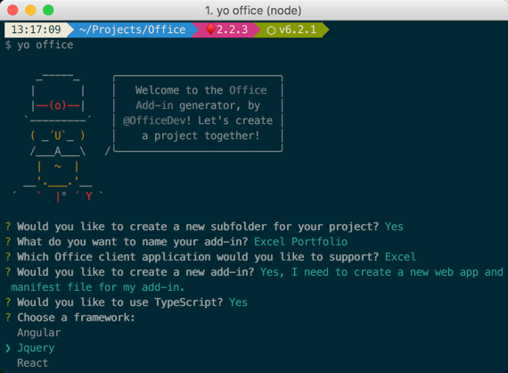
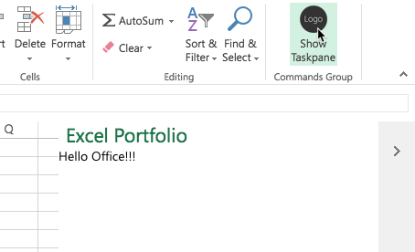

# Build an Office Add-in using VueJS

This sample shows how to build and Office Add-in using Vue.js with TypeScript. In addition to Office.js, the sample uses the Office Fabric UI for styling and formatting the user experience.

The finished solution is provided in this folder to simplify demonstrations. If you want to run the finished project, clone the repository, run **npm install**, then **npm run start** and follow one of these methods to sideload and test the Office Add-in.

* Windows: [Sideload Office Add-ins on Windows](https://docs.microsoft.com/en-us/office/dev/add-ins/testing/create-a-network-shared-folder-catalog-for-task-pane-and-content-add-ins)
* Office Online: [Sideload Office Add-ins in Office Online](https://docs.microsoft.com/en-us/office/dev/add-ins/testing/sideload-office-add-ins-for-testing#sideload-an-office-add-in-on-office-online)
* iPad and Mac: [Sideload Office Add-ins on iPad and Mac](https://docs.microsoft.com/en-us/office/dev/add-ins/testing/sideload-an-office-add-in-on-ipad-and-mac)

## Prerequisites

To complete this ldemoab, you need the following:

* Consumer [OneDrive](https://www.onedrive.com) account. OneDrive is used to test the Office Add-in  (via Office Online).
* A lightweight code editor such as [Visual Studio Code](https://code.visualstudio.com/) for developing the solution.
* [Node.js](https://nodejs.org/). Node is required to setup, build, and run the project. Node 6.9.0 or higher, together with NPM 3 or higher are recommended.
* [The Office Yeoman Generator](https://www.npmjs.com/package/generator-office). The Office Yeoman Generator is used to create the Office Add-in xml manifest file.

    ```shell
    npm install -g yo generator-office
    ```

### Provision the Office Add-in

1. Open a terminal/command prompt, and change directories to the location where you want to create the project.
1. Run the **Office Yeoman generator** using the command `yo office**`.

    ```shell
    yo office
    ```

1. The Office Yeoman generator will ask a number of question. Use the following responses:
    * Choose a project type **Office Add-in project using Jquery framework**
    * Choose a script type **Typescript**
    * What do you want to name your add-in? **Excel Portfolio**
    * Which Office client application would you like to support? **Excel**

    

1. When the Yeoman generator completes, change directories to the project folder and open the folder in your favorite code editor (you can use the command `code .` for [Visual Studio Code](https://code.visualstudio.com/)).

    >Note: You should be able to run and sideload the add-in at this point. To do that, follow the steps outlined in [Sideload and Test the Office Add-in](../../Lab.md#exercise-4-sideload-and-test-the-office-add-in). In the next section, you will add additional functionality to the add-in.

1. The Office Yeoman generator does not have a Vue.js template. In a previous step, you selected the JQuery project template as the starting point so you need to convert the project to leverage Vue.js.
    1. Open a command prompt and change directory to the root folder of the project.
        1. Execute the following commands to install the necessary Vue dependency packages & remove jQuery:

            ```shell
            npm install vue vue-class-component --save
            npm uninstall jquery --save
            ```

        1. Execute the following command to install the necessary dev dependency packages and remove jQuery:

            ```shell
            npm install vue-loader vue-template-compiler --save-dev
            npm uninstall @types/jquery --save-dev
            ```

    1. Locate and open the **webpack.config.js** file in the project root directory. It needs to be updated to support Vue JS.
        1. Locate the section **resolve** and add `.vue` to the array of extensions:
        1. Add the following constant to the top of the file, after the existing plugin imports:

            ```js
            const VueLoaderPlugin = require('vue-loader/lib/plugin');
            ```

        1. Add an **alias** for **Vue**:

            ```js
            resolve: {
              extensions: ['.ts', '.tsx', '.html', '.js', '.vue'],
              alias: {
                vue$: 'vue/dist/vue.js'
              }
            },
            ```

        1. Locate the existing TypeScript loader in the **modules.rules**... it is the one with the `test: /\.tsx?$/` as the test rule entry. Replace the entire TypeScript loader with the following so TypeScript code in Vue templates is also transpiled to JavaScript:

            ```js
            {
                test: /\.tsx?$/,
                exclude: /node_modules/,
                use: [{
                  loader: 'ts-loader',
                  options: {
                    appendTsSuffixTo: [/\.vue$/],
                    transpileOnly: true
                  }
                }]
            },
            ```

        1. Add a new object to the **module.rules** array so Webpack will use the Vue-specific loader:

            ```js
            module: {
              rules: [
                ..
                {
                  test: /\.vue$/,
                  loader: 'vue-loader',
                  options: { esModule: true }
                },
                ..
              ]
            },
            ```

        1. Add the Vue loader plugin into the collection of **plugins**:

            ```js
            plugins: [
              ...
              new VueLoaderPlugin()
            ]
            ```

    1. Update the project so that **.vue** files will be treated like TypeScript. Create a **sfc.d.ts** file in the **src** folder, and add the following code.

        ```typescript
        declare module "*.vue" {
          import Vue from 'vue'
          export default Vue
        }
        ```

    1. Locate and open the **index.html** file in the project root directory.
        1. Replace the `<body>` element with the following:

          ```html
          <body class="ms-font-m ms-welcome">
            <div id="app">{{welcome}}</div>
            <script type="text/javascript" src="node_modules/office-ui-fabric-js/dist/js/fabric.js"></script>
          </body>
          ```

    1. Locate and open the **src/index.ts** file.
        1. Add the following `import` statement after the existing `import`:

            ```ts
            import Vue  from 'vue';
            ```

        1. Remove the existing `$(document).ready();` event code that leverages JQuery:

            ```ts
            $(document).ready(() => {
              $('#run').click(run);
            });
            ```

        1. Replace the contents of the `Office.initialize()` function with the following, replacing the JQuery code with code that updates the UI.

            ```ts
            Office.initialize = (reason) => {
              var app = new Vue({
                el: "#app",
                data: {
                  welcome: "Hello Office!!!"
                }
              });
              console.log(app);
            };
            ```

    >**OPTIONAL**: You should be able to run and sideload the add-in at this point. To do that, follow the steps outlined in [Sideload and Test the Office Add-in](../../Lab.md#exercise-4-sideload-and-test-the-office-add-in). In the next section, you will add additional functionality to the add-in.

      

### Develop the Office Add-in

1. Open **app.css** and replace the entire file with following:

    ```css
    .header {
        padding: 10px;
    }

    .content {
        margin-top: 10px;
    }

    .hover:hover {
        background: #f8f8f8;
    }

    .overlay {
        position: absolute;
        top: 0px;
        bottom: 0px;
        left: 0px;
        right: 0px;
        background: hsla(0,0%,100%,.4);
        z-index: 1000;
    }

    .spinner {
        position: absolute;
        top: 50%;
        left: 50%;
        margin-top: -20px;
        margin-left: -20px;
        z-index: 1100;
    }

    .ms-MessageBar-content {
        padding: 2px !important;
    }

    .pct100 {
        width: 100%;
        float: left;
    }

    .padding10 {
        padding: 10px;
    }

    .right {
        float: right;
    }

    .left {
        float: left;
    }

    .icon {
        padding-left: 8px;
        cursor: pointer;
    }

    .itemRow {
        padding-top: 4px;
        padding-bottom: 4px;
    }
    .itemRow:hover {
        background-color: #eeeeee;
    }

    .tbl-head {
        margin-bottom: 5px;
    }
    ```

1. Copy the **spinner.gif** image from the **LabFiles** folder into **src/assets** folder.

1. Create a new folder **components** in the existing **src** folder to hold the Vue components:
1. Create a **src/components/Waiting.vue** file and add the following code to it:

    ```html
    <template>
    <div>
        <div class="overlay"></div>
        
    </div>
    </template>

    <script lang="ts">
    import Vue from 'vue';
    import Component from 'vue-class-component';

    @Component({})
    export default class waiting extends Vue {
      name: 'waiting'
    }
    </script>
    ```

1. Creating a new file **src/components/HeaderComponent.vue** and ad the following code:

    ```html
    <template>
      <div>
        <div class="ms-bgColor-greenDark header">
          <span class="ms-font-su ms-fontColor-white">{{title}}</span>
        </div>
        <div class="ms-MessageBanner" v-if="error">
          <div class="ms-MessageBanner-content" style="text-align: left; margin-left: 40px;">
            <div class="ms-MessageBanner-text ms-font-s-plus">
              <div class="ms-MessageBanner-clipper">
                <i class="ms-Icon ms-Icon--Error"></i>
                <span style="vertical-align: top;">&nbsp;{{error}}</span>
              </div>
            </div>
          </div>
          <button class="ms-MessageBanner-close" v-on:click="error = null;">
            <i class="ms-Icon ms-Icon--Clear"></i>
          </button>
        </div>
      </div>
    </template>

    <script lang="ts">
    import Vue from 'vue';
    import Component from 'vue-class-component';

    @Component({
      props: {
        title: String,
        error: String
      }
    })
    export default class headerComponent extends Vue {
      name: 'headerComponent';
      title: String;
      error: String;
    }
    </script>
    ```

1. Creating a new file **src/components/Stock.vue** and ad the following code:

    ```html
    <template>
      <div class="pct100 itemRow">
        <div class="left ms-font-l">{{symbol}}</div>
        <div class="right">
          <div class="left icon"><i class="ms-Icon ms-Icon--Refresh" aria-hidden="true" v-on:click="refreshSymbol(index)"></i></div>
          <div class="left icon"><i class="ms-Icon ms-Icon--Delete" aria-hidden="true" v-on:click="deleteSymbol(index)"></i></div>
        </div>
      </div>
    </template>

    <script lang="ts">
    import Vue from 'vue';
    import Component from 'vue-class-component';

    @Component({
      props: {
        symbol: String,
        index: Number
      },
      methods: {
        refreshSymbol(index:Number) {
          this.$emit("refreshSymbol", index);
        },
        deleteSymbol(index:Number) {
          this.$emit("deleteSymbol", index);
        }
      }
    })
    export default class stock extends Vue {
      name: 'stock';
      symbol: string;
      index: Number;
    }
    </script>
    ```

1. Creating a new file **src/components/Root.vue** and ad the following code:

    ```html
    <template>
    <div>
      <waiting v-if="waiting"></waiting>
      <header-component v-bind:error="error" title="Excel Portfolio"></header-component>
      <div class="padding10">
        <div class="pct100 tbl-head">
          <span class="ms-font-l">Stock Symbols</span>
        </div>
        <div class="pct100">
          <input class="ms-TextField-field"
              v-model="newSymbol"
              v-on:keyup="addSymbol(newSymbol)"
              placeholder="Enter a stock symbol (ex: MSFT)" />
        </div>
        <stock v-for="(symbol, index) in symbols"
            v-bind:key="symbol"
            v-bind:symbol="symbol"
            v-bind:index="index"
            v-on:refreshSymbol="refreshSymbol(index)"
            v-on:deleteSymbol="deleteSymbol(index)"></stock>
        <div class="pct100 itemRow" v-if="symbols.length == 0">
          <em class="ms-font-l">No symbols added</em>
        </div>
      </div>
    </div>
    </template>

    <script lang="ts">
      import Vue from 'vue';
      import Component from 'vue-class-component';
      import waiting from "./Waiting.vue";
      import headerComponent from "./HeaderComponent.vue";
      import stock from "./Stock.vue";

      @Component({
        data: function () {
          return {
            symbols: [],
            waiting: false,
            error: "",
            newSymbol: ""
          }
        },
        components: {
          waiting,
          headerComponent,
          stock
        },
        methods: {
          getQuote(symbol:string) {
            //TODO
            console.log(symbol);
          },
          addSymbol(symbol:string) {
            //TODO
            console.log(symbol);
          },
          deleteSymbol(index:number) {
            //TODO
            console.log(index);
          },
          refreshSymbol(index:number) {
            //TODO
            console.log(index);
          },
          syncTable() {
            //TODO
            console.log("sync table");
          }
        },
        mounted: function () {
          (<any>this).syncTable();
        }
      })
      export default class root extends Vue {
        name: 'root'
      }
    </script>
    ```

1. Locate and open **src/index.ts** and update it to load the components that you just created in the project.
    1. Add the following `import` statement after the existing `import` statements:

        ```ts
        import root from './components/Root.vue';
        ```

    1. Update the `Office.initialize` function to load the Vue root component as follows:

        ```typescript
        import Vue  from 'vue';
        import root from './components/Root.vue';

        Office.initialize = (reason) => {
          var app = new Vue({
            el: "#app",
            render: h => h(root, {}),
            comments: { root }
          });
          console.log(app);
        };
        ```

1. Although the app's functionality isn't complete, the visual markup is complete. To review your changes, save all files and then return to Office Online. Your add-in should look similar to the following screenshot. If you previously closed your browser or if your Office Online session expired (the add-in doesn't load), follow the steps in [Sideload the Office Add-in](../../Lab.md#exercise-4-sideload-and-test-the-office-add-in).

    

1. The **src/components/Root.tsx** file has a number of placeholder functions that you will complete to get the add-in functioning. Start by locating the **getQuote** function. This function calls a REST API to get real-time stock statistics on a specific stock symbol. Update it as seen below.

    ```typescript
    getQuote(symbol:string) {
      return new Promise((resolve, reject) => {
        const queryEndpoint = `https://www.alphavantage.co/query?function=BATCH_STOCK_QUOTES&symbols=${escape(symbol)}&interval=1min&apikey=${ALPHAVANTAGE_APIKEY}`;

        fetch(queryEndpoint)
          .then((res: any) => {
            if (!res.ok) {
              reject('Error getting quote');
            }
            return res.json();
          })
          .then((jsonResponse: any) => {
            const quote: any = jsonResponse['Stock Quotes'][0];
            resolve(quote);
          });
      });
    }
    ```

1. Create new **utils** folder in the **src** folder, then create a file named **ExcelTableUtil.tsx**. This TypeScript class will contain helper functions for working with Microsoft Excel tables with office.js. Notice the **ExcelTableUtil** constructor accepts details about the Excel table, including the name, location, and header details.

    ```typescript
    export class ExcelTableUtil {
      tableName: string;
      location: string;
      headers: string[];
      constructor(tableName: string, location: string, headers: string[]) {
        this.tableName = tableName;
        this.location = location;
        this.headers = headers;
      }
    }
    ```

1. Implement the ExcelTableUtil utility class:
    1. Locate and open the file **src/utils/ExcelTableUtil.tsx**.
    1. Add the following methods `ExcelTableUtil` class. These methods access the table in Excel, or creates the table if it doesn't exist.

        ```typescript
        // Create the StocksTable and defines the header row
        createTable = async () => {
          return new Promise(async (resolve, reject) => {
            await Excel.run(async context => {
              // Create a proxy object for the active worksheet and create the table
              const sheet = context.workbook.worksheets.getActiveWorksheet();
              const tableRef = sheet.tables.add(this.location, true);
              tableRef.name = this.tableName;
              tableRef.getHeaderRowRange().values = [this.headers];
              return context.sync().then(() => {
                resolve(tableRef);
              });
            }).catch(createError => {
              reject(createError);
            });
          });
        }

        // Ensures the Excel table is created and tries to get a table reference
        ensureTable = async (forceCreate: boolean) => {
          return new Promise(async (resolve, reject) => {
            await Excel.run(async context => {
              // Create a proxy object for the active worksheet and try getting table reference
              const sheet = context.workbook.worksheets.getActiveWorksheet();
              const tableRef = sheet.tables.getItem(this.tableName);
              return context.sync().then(() => {
                resolve(tableRef);
              });
            }).catch(() => {
              if (forceCreate) {
                // Create a new table because an existing table was not found.
                this.createTable().then(
                  async tableRef => {
                    resolve(tableRef);
                  },
                  createError => {
                    reject(createError);
                  }
                );
              } else {
                resolve(null);
              }
            });
          });
        }
        ```

    1. Add the following method to the `ExcelTableUtil` class.
  
        Notice that it calls the `ensureTable` function we just created to ensure the Excel table has been created.

        ```typescript
        // Appends a row to the table
        addRow = async (data) => {
          return new Promise(async (resolve, reject) => {
            this.ensureTable(true).then(
              async (tableRef: Excel.Table) => {
                await Excel.run(async context => {
                  const sheet = context.workbook.worksheets.getActiveWorksheet();
                  // Add the new row
                  tableRef = sheet.tables.getItem(this.tableName);
                  tableRef.rows.add(null, [data]);
                  // Autofit columns and rows if your Office version supports the API.
                  if (Office.context.requirements.isSetSupported('ExcelApi', 1.2)) {
                    sheet.getUsedRange().format.autofitColumns();
                    sheet.getUsedRange().format.autofitRows();
                  }
                  sheet.activate();
                  return context.sync().then(() => {
                    resolve();
                  });
                }).catch(err => {
                  reject(err);
                });
              },
              err => {
                reject(err);
              }
            );
          });
        }
        ```

1. Update the **Root** component to leverage the methods you added to the `ExcelTableUtil` class.
    1. Locate and open the **src/components/Root.vue** file.
    1. Add the following `import` statement after the existing `import` statements for the the new **ExcelTableUtil** class.

        ```typescript
        import { ExcelTableUtil } from '../utils/ExcelTableUtil';
        ```

    1. Add the following constant after the `import` statements and update the **{{REPLACE_WITH_ALPHAVANTAGE_APIKEY}}** to use your API key.

        ```typescript
        const ALPHAVANTAGE_APIKEY: string = '{{REPLACE_WITH_ALPHAVANTAGE_APIKEY}}';
        ```

    1. Locate the return statement for the `data: function ()` in the `@Component`. Add a new property `tableUtil` to the object returned, as shown int he following code:

        ```typescript
        data: function () {
          return {
            symbols: [],
            waiting: false,
            error: "",
            newSymbol: "",
            tableUtil: new ExcelTableUtil('Portfolio', 'A1:H1', [
              'Symbol',
              'Last Price',
              'Timestamp',
              'Quantity',
              'Price Paid',
              'Total Gain',
              'Total Gain %',
              'Value'
            ])
          };
        },
        ```

    1. Update the `addSymbol()` method to the following code:

        ```typescript
        // Adds symbol
        addSymbol(symbol: string) {
          if ((<KeyboardEvent>event).key == "Enter") {
            this.waiting = true;
            this.getQuote(symbol).then((res:any) => {
              let data = [
                res['1. symbol'], //Symbol
                res['2. price'], //Last Price
                res['4. timestamp'], // Timestamp of quote
                0,
                0,
                '=(B:B * D:D) - (E:E * D:D)', //Total Gain $
                '=H:H / (E:E * D:D) * 100', //Total Gain %
                '=B:B * D:D' //Value
              ];
              this.tableUtil.addRow(data).then(() => {
                this.symbols.unshift(symbol);
                this.waiting = false;
                this.newSymbol = "";
              }, (err) => {
                this.error = err;
              });
            }, (err) => {
              this.error = err;
              this.waiting = false;
            });
          }
        },
        ```

        >Note: This is a good time to test the **add symbol** function of your add-in.

1. Update the **ExcelTableUtil** utility to add support for accessing and deleting rows:
    1. Locate and open the **src/utils/ExcelTableUtil.TS** file.
    1. Add the following methods to the `ExcelTableUtil` class:

        ```typescript
        // Gets data for a specific named column
        getColumnData = async (column:string) => {
          return new Promise(async (resolve, reject) => {
            this.ensureTable(false).then(async (tableRef:Excel.Table) => {
              if (tableRef == null)
                resolve([]);
              else {
                await Excel.run(async (context) => {
                  // Get column range of values by column name.
                  var colRange = tableRef.columns.getItem(column).getDataBodyRange().load("values");
                  // Sync to populate proxy objects with data from Excel
                  return context.sync().then(async () => {
                    let data:string[] = [];
                    for (var i = 0; i < colRange.values.length; i++) {
                      data.push(colRange.values[i].toString());
                    }
                    resolve(data);
                  });
                }).catch((err) => {
                  reject(err);
                });
              }
            }, (err) => {
              reject(err);
            });
          });
        }

        // Deletes a column using the row index.
        deleteRow = async (index:number) => {
          return new Promise(async (resolve, reject) => {
            this.ensureTable(true).then(async (tableRef:Excel.Table) => {
              await Excel.run(async (context) => {
                var range = tableRef.rows.getItemAt(index).getRange();
                range.delete(Excel.DeleteShiftDirection.up);
                return context.sync().then(async () => {
                  resolve();
                });
              }).catch((err) => {
                reject(err);
              });
            }, (err) => {
                reject(err);
            });
          });
        }
        ```

1. Update the **Root** component to leverage the methods you added to the `ExcelTableUtil` class.
    1. Locate and open the **src/components/Root.vue** file.

    ```typescript
    deleteSymbol(index:number) {
      // Delete from the Excel table using the index number.
      let symbol = (<any>this).symbols[index];
      (<any>this).waiting = true;
      (<any>this).tableUtil.getColumnData("Symbol").then(async (columnData:string[]) => {
          // Make sure the symbol was found in the Excel table
          if (columnData.indexOf(symbol) != -1) {
              (<any>this).tableUtil.deleteRow(columnData.indexOf(symbol)).then(async () => {
                  (<any>this).symbols.splice(index, 1);
                  (<any>this).waiting = false;
              }, (err) => {
                  (<any>this).error = err;
                  (<any>this).waiting = false;
              });
          }
          else {
              (<any>this).symbols.splice(index, 1);
              (<any>this).waiting = false;
          }
      }, (err) => {
          (<any>this).error = err;
          (<any>this).waiting = false;
      });
    },
    ```

    >**Optional**: This is a good time to test the deleteSymbol function of your add-in.

1. Update the **ExcelTableUtil** utility to add support for refreshing rows in the table:
    1. Locate and open the **src/utils/ExcelTableUtil.ts** file.
    1. Add the following methods to the `ExcelTableUtil` class:

        ```typescript
        // Updates a specific cell in the table
        updateCell = async (address:string, value:any) => {
            return new Promise(async (resolve, reject) => {
                this.ensureTable(true).then(async () => {
                    await Excel.run(async (context) => {
                        var sheet = context.workbook.worksheets.getActiveWorksheet();
                        var range = sheet.getRange(address);
                        range.values = [[value]];
                        return context.sync().then(async () => {
                            resolve();
                        });
                    }).catch((err) => {
                        reject(err);
                    });
                }, (err) => {
                    reject(err);
                });
            });
        }
        ```

1. Update the **Root** component to leverage the methods you added to the `ExcelTableUtil` class.
    1. Locate and open the **src/components/Root.vue** file.
    1. Locate and update the `refreshSymbol()` method to specify a symbol to refresh in the Excel table.

        ```typescript
        refreshSymbol(index:number) {
          // Refresh stock quote and update the Excel table.
          let symbol = this.symbols[index];
          this.waiting = true;
          this.tableUtil.getColumnData("Symbol").then(async (columnData:string[]) => {
            // Ensure the symbol was found in the Excel table
            var rowIndex = columnData.indexOf(symbol);
            if (rowIndex != -1) {
              this.getQuote(symbol).then((res:any) => {
                  // "last trade" is in column B with a row index offset of 2 (row 0 + the header row)
                  this.tableUtil.updateCell(`B${rowIndex + 2}:B${rowIndex + 2}`, res['2. price']).then(async () => {
                  this.waiting = false;
                }, (err) => {
                  this.error = err;
                  this.waiting = false;
                });
              });
            }
            else {
              this.error = `${symbol} not found in Excel`;
              this.symbols.splice(index, 1);
              this.waiting = false;
            }
          }, (err) => {
            this.error = err;
            this.waiting = false;
          });
        },
        ```

    >**Optional**: This is a good time to test the refreshSymbol function of your add-in.

    1. Finally, update the `syncTable()` method to the following:

        ```typescript
        syncTable() {
          this.waiting = true;
          this.tableUtil.getColumnData("Symbol").then(async (columnData:string[]) => {
            this.symbols = columnData;
            this.waiting = false;
          }, (err) => {
            this.error = err;
            this.waiting = false;
          });
        }
        ```

The Excel Portfolio add-in written with Vue.js and TypeScript is now complete. Follow the steps to [Sideload and Test the Office Add-in](../../Lab.md#exercise-4-sideload-and-test-the-office-add-in).