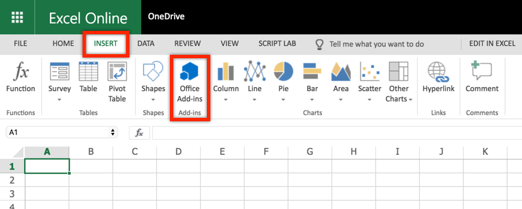

# Office Add-ins: Build an Office Add-in using modern JavaScript tools and techniques - 300 Level

----------------
In this demo, you will build an Office Add-in using a VueJS a popular JavaScript framework. 

# Running the project

The finished solution is provided in this folder to simplify demonstrations. If you want to run the finished project, clone the repository, run **npm install**, then **npm run start** and follow the steps to [Sideload the Office Add-in](#sideload-the-office-add-in).

# Build an Office Add-in using Vue.js

## Table of contents

* [Introduction](#introduction)
* [Prerequisites](#prerequisites)
* [Provision the Office Add-in](#provision-the-office-add-in)
* [Sideload the Office Add-in](#sideload-the-office-add-in)
* [Develop the Office Add-in](#develop-the-office-add-in)
* [Questions and comments](#questions-and-comments)
* [Contributing](#contributing)
* [Additional resources](#additional-resources)

## Introduction

This sample shows how to build and Office Add-in using Vue.js with TypeScript. In addition to Office.js, the sample uses the Office Fabric UI for styling and formatting the user experience.

## Prerequisites

To complete this lab, you need the following:

* Consumer [OneDrive](https://www.onedrive.com) account. OneDrive is used to test the Office Add-in  (via Office Online).
* A lightweight code editor such as [Visual Studio Code](https://code.visualstudio.com/) for developing the solution.
* [Node.js](https://nodejs.org/). Node is required to setup, build, and run the project. Node 6.9.0 or higher, together with NPM 3 or higher are recommended.
* [The Office Yeoman Generator](https://www.npmjs.com/package/generator-office). The Office Yeoman Generator is used to create the Office Add-in xml manifest file.

    ```shell
    npm install -g yo generator-office
    ```

## Provision the Office Add-in

In this section you will use the Office Yeoman generator and Node Package Manager (npm) to provision and configure the Office Add-in project.

1. Open a terminal/command prompt, and change directories to the location where you want the project provisioned.

1. Run the **Office Yeoman generator** using the command "**yo office**".

    ```shell
    yo office
    ```

1. The Office Yeoman generator will ask a number of question. Use the following responses:
    * Would you like to create a new subfolder for your project? **Yes**
    * What do you want to name your add-in? **Excel Portfolio**
    * Which Office client application would you like to support? **Excel**
    * Would you like to create a new add-in? **Yes, I need to create a new web app and manifest for my add-in.**
    * Would you like to use TypeScript? **Yes**
    * Choose a framework **JQuery**
    * For more information and resources on your next steps, we have created a resource.html file in your project. Would you like to open it now while we finish creating your project? **No**

    

1. When then Yeoman generator completes, change directories to the project folder (ex: **cd excel-portfolio**) and open the folder in your favorite code editor (you can use the command "**code .**" for [Visual Studio Code](https://code.visualstudio.com/)).

1. The Office Yeoman generator does not have a Vue.js template, so the instructions had you select the JQuery template which you will now convert to leverage Vue.js. Start by opening **package.json** in the project root directory and add **dependencies** on **vue** and **vue-class-component**. 

    ````javascript
    "dependencies": {
        "core-js": "2.5.3",
        "jquery": "3.3.1",
        "office-addin-validator": "1.0.5",
        "office-ui-fabric-js": "1.5.0",
        "vue":"2.5.13",
        "vue-class-component":"6.2.0"
    },
    ````

1. Unfortunately, the JQuery template the generator uses puts everything into a single TypeScript file. To handle multiple TypeScript (and .vue) files, the project needs to be configured to use [webpack](https://webpack.github.io/). Add **devDependencies** for **webpack**, **vue-loader**, **vue-template-compiler**, and **ts-loader**.

    ````javascript
    "devDependencies": {
        "@types/jquery": "3.3.0",
        "@types/office-js": "0.0.51",
        "browser-sync": "2.23.6",
        "concurrently": "3.5.1",
        "cpx": "1.5.0",
        "rimraf": "2.6.2",
        "ts-loader": "2.3.7",
        "typescript": "2.7.2",
        "vue-loader": "14.1.1",
        "vue-template-compiler": "2.5.13",
        "webpack": "2.3.1"
    }
    ````

1. Return to the terminal/command prompt and run the **npm install** command to pull in the additional dependencies and devDependencies.

1. Next, you need to update the TypeScript config file (**tsconfig.json**) to work with webpack and support multiple modules and Vue.js. Update it as seen below.

    ````javascript
    {
        "compilerOptions": {
            "target": "es5",
            "module": "es6",
            "moduleResolution": "node",
            "sourceMap": true,
            "emitDecoratorMetadata": true,
            "experimentalDecorators": true,
            "removeComments": false,
            "noImplicitAny": false,
            "noEmitOnError": true,
            "rootDir": "src",
            "outDir": "src",
            "allowSyntheticDefaultImports": true,
            "lib": [
                "dom",
                "es2015"
            ]
        },
        "exclude": [
            "node_modules"
        ]
    }
    ````

1. Create a **webpack.config.js** file in the project root directory to configure webpack for this project. Updated it as seen below.

    ````javascript
    var path = require('path')
    var webpack = require('webpack')

    module.exports = {
        context: path.resolve(__dirname, 'src'),
        entry: './app.ts',
        resolve: {
            extensions: ['.js', '.json', '.ts', '.vue'],
            alias: {
                vue$: 'vue/dist/vue.js'
            }
        },
        output: {
            path: path.resolve(__dirname, './dist'),
            publicPath: '/dist/',
            filename: 'bundle.js'
        },
        module: {
            rules: [
                {
                    test: /\.ts$/,
                    loader: 'ts-loader',
                    options: {
                        appendTsSuffixTo: [/\.vue$/]
                    }
                },
                {
                    test: /\.vue$/,
                    loader: 'vue-loader',
                    options: {
                        esModule: true
                    }
                },
                {
                    test: /\.(png|jpg|gif|svg)$/,
                    loader: 'file-loader',
                    options: {
                        name: '[name].[ext]?[hash]'
                    }
                }
            ]
        },
        devServer: {
            historyApiFallback: true,
            noInfo: true
        },
        performance: {
            hints: false
        },
        devtool: '#eval-source-map'
    }
    ````

1. Next, you need to update the project so that **.vue** files will be treated like TypeScript. Create a **sfc.d.ts** file at **src/sfc.d.ts** and update it as seen below.

    ````typescript
    declare module "*.vue" {
        import Vue from 'vue'
        export default Vue
    }
    ````

1. Next, go back to the **package.json** file in the project root directory and update the **scripts** section to leverage webpack as seen below.

    ````javascript
    "scripts": {
        "tsc": "tsc -p tsconfig.json",
        "server": "browser-sync start --config bsconfig.json",
        "copy": "cpx \"src/**/!(*.ts)\" dist",
        "start": "rimraf dist && npm run tsc && webpack --config webpack.config.js --colors --progress --bail && npm run copy && npm run server",
        "validate": "./node_modules/.bin/validate-office-addin"
    },
    ````

    > **NOTE**: the updated script settings does not leverage a watch for file changed like the React and Angular projects in this module. Additional webpack configuration could be applied to archive this. Another option would be to start with the React template from the Office Yeoman generator and convert it to Vue.js.

1. Next, open **src/index.html**, remove the **core.js** and **jquery.js** references and change the **app.js** reference to **bundle.js** (the consolidated script created by webpack). You can also replace the **header** and **main** content with **&lt;div id="app"&gt;{{welcome}}&lt;/div&gt;**.

    ````html
    <!DOCTYPE html>
    <html>
    <head>
        <meta charset="UTF-8" />
        <meta http-equiv="X-UA-Compatible" content="IE=Edge" />
        <meta name="viewport" content="width=device-width, initial-scale=1">
        <title>Excel Portfolio</title>

        <!-- Office JavaScript API -->
        <script type="text/javascript" src="https://appsforoffice.microsoft.com/lib/1.1/hosted/office.debug.js"></script>

        <!-- LOCAL -->
        <link rel="stylesheet" href="node_modules/office-ui-fabric-js/dist/css/fabric.min.css" />
        <link rel="stylesheet" href="node_modules/office-ui-fabric-js/dist/css/fabric.components.css" />

        <!-- Template styles -->
        <link href="app.css" rel="stylesheet" type="text/css" />
    </head>

    <body class="ms-font-m ms-welcome">
        <div id="app">{{welcome}}</div>

        <script type="text/javascript" src="node_modules/office-ui-fabric-js/dist/js/fabric.js"></script>
        <script type="text/javascript" src="bundle.js"></script>
    </body>

    </html>
    ````

1. Finally, update **src/app.ts** to import Vue and initialize it within the **Office.initialize** callback.

    ````typescript
    import Vue  from 'vue';

    (() => {
        // The initialize function must be run each time a new page is loaded
        Office.initialize = (reason) => {
            var app = new Vue({ 
                el: "#app",
                data: {
                    welcome: "Hello Office!!!"
                }
            });
            console.log(app);
        };
    })();
    ````

    > **IMPORTANT**: you need to call Office.initialize and any page loaded in the add-in before other scripts run.

## Sideload the Office Add-in

In this section you will sideload the Office Add-in using OneDrive and Office Online.

>**NOTE**: The instructions below outline how to sideload an Office Add-in into Office Online, which works in almost any developer environment. If you are working from a PC, you can also sideload the add-in for testing in the full Win32 Office client. For more information on this approach, see the [Sideloading Office Add-ins into Office Desktop or Office Online](https://www.youtube.com/watch?v=XXsAw2UUiQo).

>**NOTE**: Office Add-ins are required to be secured by SSL. These labs leverage self-signed certificates for this that may be blocked by your browser as an untrusted certificate. If so, follow the steps for [Adding Self-Signed Certificates as Trusted Root Certificate](https://github.com/OfficeDev/generator-office/blob/master/src/docs/ssl.md).

1. Open a terminal/command prompt in the location where the project is provisioned.

1. Run the "**npm run start**" command, which will build and host the solution. This command is setup to perform a lot of complex tasks, including compiling all the TypeScript files to JavaScript, using Webpack to combine them into a single script reference, and copying all relevant files to a dist folder for hosting. When the build completes, you should see a note that "*webpack: Compiled successfully*". If you need to exit the web host use the Ctrl-C command.

1. Navigate and sign-in to OneDrive ([https://www.onedrive.com](https://www.onedrive.com)). OneDrive offers free consumer accounts, so if you don't have one you can create one.

1. From the OneDrive toolbar, select **New** and then select **Excel workbook** to create a new Excel workbook.

    

1. Once the new Excel workbook opens, select the Insert tab and then click on the Office Add-ins button in the ribbon.

    

1. In the Office Add-in dialog, click on the Manage My Add-ins link in the top right and then select Upload My Add-in.

    

1. Using the file selector of the Upload Add-in dialog, browse to the add-in manifest in the root directory of your project (ex: excel-portfolio-manifest.xml) and click Upload.

    

1. Uploading the add-in manifest should add a new ribbon button for launching your add-in. Look for the **Show Taskpane** button on the far right of the Home tab.

    

1. Click on the **Show Taskpane** button to bring up your Office Add-in in a task pane. It should say "Welcome to app!" with an Angular logo below it.

    

1. Go back to the **src/index.html** file and modify div to include a class of **ms-font-su**.

    ````html
    <div id="app" class="ms-font-su">{{welcome}}</div>
    ````

1. In the terminal/command window, use the **Ctrl-C** command to break out of the web host and run the **npm run start** command again.

1. When webpack has completed, you need to manually refresh the Office Add-in by right clicking it in the browser and reloading the frame.

    

1. After the refresh, you should see the welcome message increase in size as seen below.

    

## Develop the Office Add-in

In this section, you will finish developing the Office Add-in using Vue.js and TypeScript. The add-in will allow the user to get real-time stock quotes and manage a portfolio in an Excel table. Users will have the ability to add, delete, and refresh stocks. Additionally, the add-in should check for an existing portfolio upon opening and (if found) read the stocks out of the worksheet.

1. Open **src/app.css** and replace the entire file with the contents show below.

    ````css
    /* You can add global styles to this file, and also import other style files */
    .header {
        padding: 10px;
    }

    .content {
        margin-top: 10px;
    }

    .hover:hover {
        background: #f8f8f8;
    }

    .overlay {
        position: absolute;
        top: 0px;
        bottom: 0px;
        left: 0px;
        right: 0px;
        background: hsla(0,0%,100%,.4);
        z-index: 1000;
    }

    .spinner {
        position: absolute;
        top: 50%;
        left: 50%;
        margin-top: -20px;
        margin-left: -20px;
        z-index: 1100;
    }

    .ms-MessageBar-content {
        padding: 2px !important;
    }

    .pct100 {
        width: 100%;
        float: left;
    }

    .padding10 {
        padding: 10px;
    }

    .right {
        float: right;
    }

    .left {
        float: left;
    }

    .icon {
        padding-left: 8px;
        cursor: pointer;
    }

    .itemRow {
        padding-top: 4px;
        padding-bottom: 4px;
    }

    .itemRow:hover {
        background-color: #eeeeee;
    }

    .tbl-head {
        margin-bottom: 5px;
    }
    ````

1. Copy the **spinner.gif** image from the **README_assets** folder into **src/assets** of your project directory. The Office UI Fabric has a spinner component, but would take additional effort to implement it in a Vue.js project (at least without adding a jquery reference). Here is the image if you want to copy from here.

    

1. Similar to React and Angular, Vue.js supports custom components. Although these can be built a number of ways,  this exercise will create **.vue** files that combine templates and TypeScript leveraging the **vue-class-component** package. You have already setup the TypeScript compiler and webpack to handle these tiles. Start by creating a **components** folder under **src** (ex: **src/components**).

1. Next, create a **src/components/waiting.vue** file and modify it as seen below.

    ````html
    <template>
    <div>
        <div class="overlay"></div>
        
    </div>
    </template>

    <script lang="ts">
    import Vue from 'vue';
    import Component from 'vue-class-component';

    @Component({})
    export default class waiting extends Vue {
        name: 'waiting'
    }
    </script>
    ````

1. Next, create a new Vue component named **headerComponent** at **src/components/headerComponent.vue** with the code shown below. Notice this component uses a number of predefined Office UI Fabric style classes.

    ````html
    <template>
        <div>
        <div class="ms-bgColor-greenDark header">
            <span class="ms-font-su ms-fontColor-white">{{title}}</span>
        </div>
        <div class="ms-MessageBanner" v-if="error">
            <div class="ms-MessageBanner-content" style="text-align: left; margin-left: 40px;">
                <div class="ms-MessageBanner-text ms-font-s-plus">
                    <div class="ms-MessageBanner-clipper">
                        <i class="ms-Icon ms-Icon--Error"></i>
                        <span style="vertical-align: top;">&nbsp;{{error}}</span>
                    </div>
                </div>
            </div>
            <button class="ms-MessageBanner-close" v-on:click="error = null;">
                <i class="ms-Icon ms-Icon--Clear"></i>
            </button>
        </div>
        </div>
    </template>

    <script lang="ts">
    import Vue from 'vue';
    import Component from 'vue-class-component';

    @Component({
        props: {
            title: String,
            error: String
        }
    })
    export default class headerComponent extends Vue {
        name: 'headerComponent';
        title:String;
        error:String;
    }
    </script>
    ````

1. Create a new React component named **stock** at **src/components/stock.vue** with the code shown below. This component will display a stock with commands for refresh and delete. Notice how the refresh and delete commands emit to the parent.

    ````html
    <template>
        <div class="pct100 itemRow">
            <div class="left ms-font-l">{{symbol}}</div>
            <div class="right">
                <div class="left icon"><i class="ms-Icon ms-Icon--Refresh" aria-hidden="true" v-on:click="refreshSymbol(index)"></i></div>
                <div class="left icon"><i class="ms-Icon ms-Icon--Delete" aria-hidden="true" v-on:click="deleteSymbol(index)"></i></div>
            </div>
        </div>
    </template>

    <script lang="ts">
    import Vue from 'vue';
    import Component from 'vue-class-component';

    @Component({
        props: {
            symbol: String,
            index: Number
        },
        methods: {
            refreshSymbol(index:Number) { 
                this.$emit("refreshSymbol", index);
            },
            deleteSymbol(index:Number) {
                this.$emit("deleteSymbol", index);
            }
        }
    })
    export default class stock extends Vue {
        name: 'stock';
        symbol:string;
        index:Number;
    }
    </script>
    ````

1. Finally, open up **src/components/root.vue** and update it as seen below. Keep it open, as you will make a number of additional updates to this file before the end of this exercise.

    ````html
    <template>
    <div>
        <waiting v-if="waiting"></waiting>
        <header-component v-bind:error="error" title="Excel Portfolio"></header-component>
        <div class="padding10">
            <div class="pct100 tbl-head">
                <span class="ms-font-l">Stock Symbols</span>
            </div>
            <div class="pct100">
                <input class="ms-TextField-field" 
                    v-model="newSymbol" 
                    v-on:keyup="addSymbol(newSymbol)" 
                    placeholder="Enter a stock symbol (ex: MSFT)" />
            </div>
            <stock v-for="(symbol, index) in symbols"  
                v-bind:key="symbol" 
                v-bind:symbol="symbol" 
                v-bind:index="index" 
                v-on:refreshSymbol="refreshSymbol(index)" 
                v-on:deleteSymbol="deleteSymbol(index)"></stock>
            <div class="pct100 itemRow" v-if="symbols.length == 0">
                <em class="ms-font-l">No symbols added</em>
            </div>
        </div>
    </div>
    </template>

    <script lang="ts">
    import Vue from 'vue';
    import Component from 'vue-class-component';
    import waiting from "./waiting.vue";
    import headerComponent from "./headerComponent.vue";
    import stock from "./stock.vue";

    @Component({
        data: function () { 
            return {
                symbols: [],
                waiting: false,
                error: "",
                newSymbol: ""
            } 
        },
        components: {
            waiting,
            headerComponent,
            stock
        },
        methods: {
            getQuote(symbol:string) {
                //TODO
                console.log(symbol);
            },
            addSymbol(symbol:string) {
                //TODO
                console.log(symbol);
            },
            deleteSymbol(index:number) {
                //TODO
                console.log(index);
            },
            refreshSymbol(index:number) {
                //TODO
                console.log(index);
            },
            syncTable() {
                //TODO
                console.log("sync table");
            }
        },
        mounted: function () {
            (<any>this).syncTable();
        }
    })
    export default class root extends Vue {
        name: 'root'
    }
    </script>
    ````

1. Open **src/app.ts** and update it as seen below. This imports all the Vue components you just created and renders the **root** component in the **#app** container.

    ````typescript
    import Vue  from 'vue';
    import root from './components/root.vue';

    (() => {
        // The initialize function must be run each time a new page is loaded
        Office.initialize = (reason) => {
            var app = new Vue({ 
                el: "#app",
                render: h => h(root, { }),
                components: { root }
            });
        };
    })();
    ````

1. Although the app's functionality isn't complete, the visual markup is. You can see it by saving all your work and returning to Office Online. It should look similar to below. If you previously closed the Excel Online window or if your Office Online session has expired (the add-in doesn't seem to load), follow the [Sideload the Office Add-in](#sideload-the-office-add-in) steps above.

    

1. The **root.vue** file has a number of placeholder functions that you will complete to get the add-in functioning. Start by locading the **getQuote** function. This function calls a REST API to get real-time stock statistics on a specific stock symbol. Update it as seen below.

    ````typescript
    getQuote(symbol:string) {
        return new Promise((resolve, reject) => {
            let url = `https://estx.azurewebsites.net/api/quote/${symbol}`;
            fetch(url).then((res) => {
                if (res.ok)
                    resolve(res.json());
                else
                    reject("Error getting quote");
            });
        });
    },
    ````

1. Next, create new **utils** folder under **src** and then create a file named **excelTableUtil.ts** in it (**src/utils/excelTableUtil.ts**). This TypeScript class will contain helper functions for working with Excel tables with office.js. Notice the **ExcelTableUtil** constructor accepts details about the Excel table, including the name, location, and header details.

    ````typescript
    /// <reference path="../../node_modules/@types/office-js/index.d.ts" />

    export class ExcelTableUtil {
        tableName:string;
        location:string;
        headers:string[];
        constructor(tableName:string, location:string, headers:string[]) {
            this.tableName = tableName;
            this.location = location;
            this.headers = headers;
        }

        // ExcelTableUtil functions here
    }
    ````

1. Return to **src/components/root.vue** and add a import reference to the **ExcelTableUtil** class we just created and create a private property inside the data property of the component.

    ````typescript
    /* !!! template removed for readability !!! */
    import Vue from 'vue';
    import Component from 'vue-class-component';
    import waiting from "./waiting.vue";
    import headerComponent from "./headerComponent.vue";
    import stock from "./stock.vue";
    import { ExcelTableUtil } from "../utils/excelTableUtil";

    @Component({
        data: function () { 
            return {
                symbols: [],
                waiting: false,
                error: "",
                newSymbol: "",
                tableUtil: new ExcelTableUtil(
                    "Portfolio", "A1:J1", [
                        "Symbol", 
                        "Last Price", 
                        "Change $", 
                        "Change %", 
                        "Quantity", 
                        "Price Paid", 
                        "Day's Gain $", 
                        "Total Gain $", 
                        "Total Gain %", 
                        "Value"
                    ]
                )
            }
        },
        /* !!! lines removed for readability !!! */
    ````

1. Next, add functions to **src/utils/excelTableUtil.ts** for **createTable** and **ensureTable**. These functions will be used to get a handle to the Excel table (and create it if it doesn't exist).

    ````typescript
    // Create the StocksTable and defines the header row
    createTable = async () => {
        return new Promise(async (resolve, reject) => {
            await Excel.run(async (context) => {
                // Create a proxy object for the active worksheet and create the table
                var sheet = context.workbook.worksheets.getActiveWorksheet();
                var tableRef = sheet.tables.add(this.location, true);
                tableRef.name = this.tableName;
                tableRef.getHeaderRowRange().values = [this.headers];
                return context.sync().then(() => {
                    resolve(tableRef);
                });
            }).catch((createError) => {
                reject(createError);
            });
        });
    }

    // Ensures the Excel table is created
    ensureTable = async (forceCreate:boolean) => {
        return new Promise(async (resolve, reject) => {
            await Excel.run(async (context) => {
                // Create a proxy object for the active worksheet and try getting table reference
                var sheet = context.workbook.worksheets.getActiveWorksheet();
                var tableRef = sheet.tables.getItem(this.tableName);
                return context.sync().then(() => {
                    resolve(tableRef);
                });
            }).catch(() => {
                if (forceCreate) {
                    // Unable to find table...create it
                    this.createTable().then(async (tableRef) => {
                        resolve(tableRef);
                    }, (createError) => {
                        reject(createError);
                    });
                }
                else
                    resolve(null);
            });
        });
    }
    ````

1. Next, add the **addRow** function to **src/utils/excelTableUtil.cs**. Notice that it call the ensureTable function we just created to ensure the Excel table has been created.

    ````typescript
    // Appends a row to the table
    addRow = async (data) => {
        return new Promise(async (resolve, reject) => { 
            this.ensureTable(true).then(async (tableRef:Excel.Table) => {
                await Excel.run(async (context) => {
                    var sheet = context.workbook.worksheets.getActiveWorksheet();
                    // Add the new row
                    tableRef.rows.add(null, [data]);
                    // Autofit columns and rows if supported by API
                    if (Office.context.requirements.isSetSupported("ExcelApi", 1.2)) {
                        sheet.getUsedRange().format.autofitColumns();
                        sheet.getUsedRange().format.autofitRows();
                    }
                    sheet.activate();
                    return context.sync().then(() => {
                        resolve();
                    });
                }).catch((err) => {
                    reject(err);
                });
            }, (err) => {
                reject(err);
            });
        });
    }
    ````

1. Return to **src/components/root.vue** and update the **addSymbol** function to call **getSymbol** for stock stats and then call **addRow** on the **ExcelTableUtil**. Notice the row data contains formulas.

    ````typescript
    addSymbol(symbol:string) {
      if ((<KeyboardEvent>event).key == "Enter") {
        (<any>this).waiting = true;
        (<any>this).getQuote(symbol).then((res:any) => {
          let data = [res.symbol, res.current, res.curr_change, res.pct_change * 100, 0, 0, "=C:C * E:E", "=(B:B * E:E) - (F:F * E:E)", "=H:H / (F:F * E:E) * 100", "=B:B * E:E"];
          (<any>this).tableUtil.addRow(data).then(() => {
            (<any>this).symbols.unshift(symbol);
            (<any>this).waiting = false;
            (<any>this).newSymbol = "";
          }, (err) => {
            (<any>this).error = err;
          });
        }, (err) => {
          (<any>this).error = err;
          (<any>this).waiting = false;
        });
      }
    },
    ````

    >**Optional**: this is a good time to test the "add symbol" function of your add-in

1. Return to **/src/utils/excelTableUtil.ts** and add functions for **getColumnData** and **deleteRow**. getColumnData gets values for a column in the Excel table so a row can be identified for update or delete. deleteRow deletes a row in the Excel table based on it's index.

    ````typescript
    // Gets data for a specific named column
    getColumnData = async (column:string) => {
        return new Promise(async (resolve, reject) => { 
            this.ensureTable(false).then(async (tableRef:Excel.Table) => {
                if (tableRef == null)
                    resolve([]);
                else {
                    await Excel.run(async (context) => {
                        // Get column range by column name
                        var colRange = tableRef.columns.getItem(column).getDataBodyRange().load("values");
                        // Sync to populate proxy objects with data from Excel
                        return context.sync().then(async () => {
                            let data:string[] = [];
                            for (var i = 0; i < colRange.values.length; i++) {
                                data.push(colRange.values[i].toString());
                            }
                            resolve(data);
                        });
                    }).catch((err) => {
                        reject(err);
                    });
                }
            }, (err) => {
                reject(err);
            });
        });
    }

    // Deletes a column based by row index
    deleteRow = async (index:number) => {
        return new Promise(async (resolve, reject) => { 
            this.ensureTable(true).then(async (tableRef:Excel.Table) => {
                await Excel.run(async (context) => {
                    var range = tableRef.rows.getItemAt(index).getRange();
                    range.delete(Excel.DeleteShiftDirection.up);
                    return context.sync().then(async () => {
                        resolve();
                    });
                }).catch((err) => {
                    reject(err);
                });
            }, (err) => {
                reject(err);
            });
        });
    }
    ````

1. Return to **src/components/root.vue** and update the **deleteSymbol** function to delete the specified symbol from the Excel table. Do this by first calling **getColumnData** (on **ExcelTableUtil**) to determine the row to delete and then **deleteRow** (also on **ExcelTableUtil**) to perform the delete.

    ````typescript
    deleteSymbol(index:number) {
        // Delete from Excel table by index number
        let symbol = (<any>this).symbols[index];
        (<any>this).waiting = true;
        (<any>this).tableUtil.getColumnData("Symbol").then(async (columnData:string[]) => {
            // make sure the symbol was found in the Excel table
            if (columnData.indexOf(symbol) != -1) {
                (<any>this).tableUtil.deleteRow(columnData.indexOf(symbol)).then(async () => {
                    (<any>this).symbols.splice(index, 1);
                    (<any>this).waiting = false;
                }, (err) => {
                    (<any>this).error = err;
                    (<any>this).waiting = false;
                });
            }
            else {
                (<any>this).symbols.splice(index, 1);
                (<any>this).waiting = false;
            }
        }, (err) => {
            (<any>this).error = err;
            (<any>this).waiting = false;
        });
    },
    ````

    >**Optional**: this is a good time to test the "delete symbol" function of your add-in

1. Make the final update to **src/utils/excelTableUtil.ts** by adding the **updateCell** function, which updates the cell at a specific address to a specified value.

    ````typescript
    // Updates a specific cell in the table
    updateCell = async (address:string, value:any) => {
        return new Promise(async (resolve, reject) => { 
            this.ensureTable(true).then(async () => {
                await Excel.run(async (context) => {
                    var sheet = context.workbook.worksheets.getActiveWorksheet();
                    var range = sheet.getRange(address);
                    range.values = [[value]];
                    return context.sync().then(async () => {
                        resolve();
                    });
                }).catch((err) => {
                    reject(err);
                });
            }, (err) => {
                reject(err);
            });
        });
    }
    ````

1. Next, update the **refreshSymbol** function on **src/components/root.vue** to call **getQuote** for updated stock statistics and then update the last trade cell in the Excel table. Similar to deleteSymbol, this function will call **getColumnData** to determine the cell address before calling **updateCell**.

    ````typescript
    refreshSymbol(index:number) {
        // Refresh stock quote and update Excel table
        let symbol = (<any>this).symbols[index];
        (<any>this).waiting = true;
        (<any>this).tableUtil.getColumnData("Symbol").then(async (columnData:string[]) => {
            // make sure the symbol was found in the Excel table
            var rowIndex = columnData.indexOf(symbol);
            if (rowIndex != -1) {
                (<any>this).getQuote(symbol).then((res:any) => {
                    // "last trade" is in column B with a row index offset of 2 (row 0 + the header row)
                    (<any>this).tableUtil.updateCell(`B${rowIndex + 2}:B${rowIndex + 2}`, res.current).then(async () => {
                        (<any>this).waiting = false;
                    }, (err) => {
                        (<any>this).error = err;
                        (<any>this).waiting = false;
                    });
                });
            }
            else {
                (<any>this).error = `${symbol} not found in Excel`;
                (<any>this).symbols.splice(index, 1);
                (<any>this).waiting = false;
            }
        }, (err) => {
            (<any>this).error = err;
            (<any>this).waiting = false;
        });
    },
    ````

    >**Optional**: this is a good time to test the "refresh symbol" function of your add-in

1. Finally, update the **syncTable** function in **src/components/root.vue**, which is called when the add-in is launched (in the constructor of app.tsx) to pull in any stock symbols that might already exist in the worksheet. It calls **getColumnData** to get this data.

    ````typescript
		syncTable() {
			(<any>this).waiting = true;
			(<any>this).tableUtil.getColumnData("Symbol").then(async (columnData:string[]) => {
				(<any>this).symbols = columnData;
				(<any>this).waiting = false;
			}, (err) => {
				(<any>this).error = err;
				(<any>this).waiting = false;
			});
		}
    },
    ````

1. Test your work by returning to Excel Online. If you previously closed the Excel Online window or if your Office Online session has expired (the add-in doesn't seem to load), follow the [Sideload the Office Add-in](#sideload-the-office-add-in) steps above. You should test all the different operations you created:
    * Add a symbol by typing the symbol and pressing enter/return
    * Refresh a symbol (helps to clear out the **Last Price** cell when outside trading hours)
    * Delete a symbol
    * Reload the add-in with an existing portfolio table and see if the add-in pulls in the symbols

    

## Contributing

If you'd like to contribute to this sample, see [CONTRIBUTING.MD](/CONTRIBUTING.md).

This project has adopted the [Microsoft Open Source Code of Conduct](https://opensource.microsoft.com/codeofconduct/). For more information see the [Code of Conduct FAQ](https://opensource.microsoft.com/codeofconduct/faq/) or contact [opencode@microsoft.com](mailto:opencode@microsoft.com) with any additional questions or comments.

## Questions and comments

We'd love to get your feedback about this sample. You can send your questions and suggestions in the [Issues](https://github.com/officedev/trainingcontent/issues) section of this repository.

Questions about Office development in general should be posted to [Stack Overflow](https://stackoverflow.com/questions/tagged/office-js). Make sure that your questions or comments are tagged with `[office-js]`.

## Additional resources

* [Office Add-in platform overview](https://dev.office.com/docs/add-ins/overview/office-add-ins)
* [Convert and Office Add-in task pane template in Visual Studio to TypeScript](https://dev.office.com/docs/add-ins/develop/convert-javascript-to-typescript)
