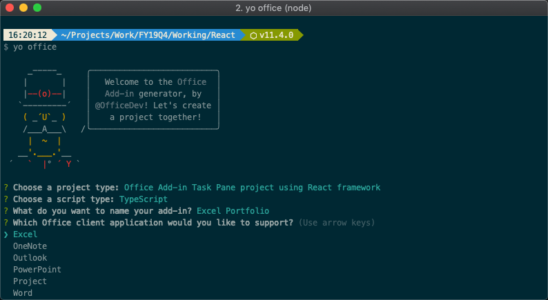
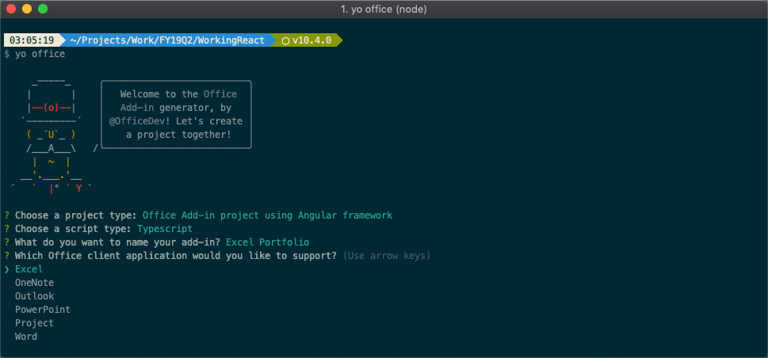

# Build an Office Add-in using modern JavaScript tools and techniques

In this lab, you will walk through building Office Add-ins using a variety of popular JavaScript tools and frameworks, including TypeScript, React, Angular, and VueJS.

## In this lab

1. [Build an Office Add-in using React](#exercise-1-build-an-office-add-in-using-react)
1. [Build an Office Add-in using Angular](#exercise-2-build-an-office-add-in-using-angular)
1. [Build an Office Add-in using VueJS](#exercise-3-build-an-office-add-in-using-vuejs)
1. [Sideload and Test the Office Add-in](#exercise-4-sideload-and-test-the-office-add-in)

## Prerequisites

To complete this lab, you need the following:

* A consumer [OneDrive](https://www.onedrive.com) account. OneDrive is used to test the Office Add-in.
* Code editor such as [Visual Studio Code](https://code.visualstudio.com/) for developing the solution.
* [Node.js](https://nodejs.org/) LTS: Node is required to setup, build, and run the project.
* [Angular CLI](https://cli.angular.io/) v6: The Angular CLI is used to provision the Angular web application in the [Build an Office Add-in using Angular](#exercise-2-build-an-office-add-in-using-angular) exercise.

    ```shell
    npm install -g @angular/cli
    ```

* [Office Yeoman Generator](https://www.npmjs.com/package/generator-office): The Office Yeoman Generator is used to create the Office Add-in projects and XML manifests.

    ```shell
    npm install -g yo generator-office
    ```

* A free API key from [Alpha Vantage](https://www.alphavantage.co): Registration is free and you will use the API key when creating stock quote requests.

> Note: All three exercises in this lab build the same Microsoft Excel stock portfolio solution so you can compare the experience building Office Add-ins with different modern JavaScript tools and frameworks. The add-in will allow you to get real-time stock quotes and manage a portfolio in an Microsoft Excel table. You will have the ability to add, delete, and refresh stocks. Additionally, the add-in checks for an existing portfolio upon opening and (if found) reads the stocks out of the worksheet.


## Exercise 1: Build an Office Add-in using React

In this exercise, you will develop an Office Add-in using React and TypeScript. You will provision a new project using the Office Yeoman generator, develop the add-in using Office.js, and test the add-in in Microsoft Office Online.

### Provision the Office Add-in

1. Open a terminal/command prompt, and change directories to the location where you want to create the project.
1. Run the **Office Yeoman generator** using the command `yo office`.

    ```shell
    yo office
    ```

1. The Office Yeoman generator will ask a number of question. Use the following responses:
    * Choose a project type? **Office Add-in project using React framework**
    * What do you want to name your add-in? **Excel Portfolio**
    * Which Office client application would you like to support? **Excel**

    

1. When the Yeoman generator completes, change directories to the project folder and open the folder in your favorite code editor (you can use the command `code .` for [Visual Studio Code](https://code.visualstudio.com/)).

    >Note: You should be able to run and sideload the add-in at this point. To do that, follow the steps outlined in [Sideload and Test the Office Add-in](#exercise-4-sideload-and-test-the-office-add-in). In the next section, you will add additional functionality to the add-in.

### Develop the Office Add-in

1. Open **src/styles.less** and add the following styles to the end of the file.

    ```css
    .container {
        .overlay {
            position: absolute;
            top: 0px;
            bottom: 0px;
            left: 0px;
            right: 0px;
            z-index: 1000;
            display: block;
            .spinner {
                position: absolute;
                top: 50%;
                left: 50%;
                margin-top: -20px;
                margin-left: -20px;
                z-index: 1100;
            }
        }
        .header {
            padding-left: 10px;
        }
        .ms-MessageBar-content {
            padding: 2px !important;
        }
        .pct100 {
            width: 100%;
            float: left;
        }
        .padding10 {
            padding: 10px;
        }
        .right {
            float: right;
        }
        .left {
            float: left;
        }
        .icon {
            padding-left: 8px;
            cursor: pointer;
        }
        .itemRow {
            padding-top: 4px;
            padding-bottom: 4px;
        }
        .itemRow:hover {
            background-color: #eeeeee;
        }
        .tbl-head {
            margin-bottom: 5px;
        }
    }
    ```

1. The project template that the Office Yeoman generator created include a number of React components that need to be updated or deleted.

    Delete the **src/components/HeroList.tsx** file.

1. Open the **src/components/Header.tsx** file and replace the contents with the following code:

    ```typescript
    import * as React from 'react';

    export interface HeaderProps {
        title: string;
    }

    export class Header extends React.Component<HeaderProps, any> {
        constructor(props, context) {
            super(props, context);
        }

        render() {
            return (
                <div className="ms-bgColor-greenDark header">
                    <span className="ms-font-su ms-fontColor-white">{this.props.title}</span>
                </div>
            );
        }
    }
    ```

1. Create a new React component named **Waiting.tsx** in the **src/components** folder and add the following code.

    This component uses the Office UI Fabric React Components for **Overlay** and **Spinner**.

    ```typescript
    import * as React from 'react';
    import { Overlay, Spinner, SpinnerSize } from 'office-ui-fabric-react';

    export class Waiting extends React.Component<any, any> {
      constructor(props, context) {
        super(props, context);
      }

      render() {
        return (
          <Overlay isDarkThemed={true} className="overlay">
            <div className="spinner">
              <Spinner size={SpinnerSize.large} />
            </div>
          </Overlay>
        );
      }
    }
    ```

1. Create a new React component named **StockItem.tsx** in the **src/components** folder and add the following code.

    This component will display a stock with commands for refresh and delete. The component has properties for stock symbol, its index in the list, and the handlers for refresh and delete.

    ```typescript
    import * as React from 'react';

    export interface StockItemProps {
      symbol: string;
      index: number;
      onDelete: any;
      onRefresh: any;
    }

    export class StockItem extends React.Component<StockItemProps, any> {
      constructor(props, context) {
        super(props, context);
      }

      render() {
        return (
          <div className="pct100 itemRow">
            <div className="left">{this.props.symbol}</div>
            <div className="right">
              <div className="left icon">
                <i className="ms-Icon ms-Icon--Refresh" aria-hidden="true" onClick={this.props.onRefresh} />
              </div>
              <div className="left icon">
                <i className="ms-Icon ms-Icon--Delete" aria-hidden="true" onClick={this.props.onDelete} />
              </div>
            </div>
          </div>
        );
      }
    }
    ```

1. Open **src/components/App.tsx** and replace it's contents with the following code.

    ```typescript
    import * as React from 'react';
    import { TextField, MessageBar, MessageBarType } from 'office-ui-fabric-react';
    import { Header } from './header';
    import { Waiting } from './waiting';
    import { StockItem } from './StockItem';

    export interface AppProps {
      title: string;
    }

    export interface AppState {
      listItems: string[];
      waiting: boolean;
      error: string;
    }

    export default class App extends React.Component<AppProps, AppState> {
      constructor(props, context) {
        super(props, context);
        this.state = {
          listItems: [],
          waiting: false,
          error: ''
        };
      }

      componentDidMount() {
        // Sync stocks already in Excel table
        this.syncTable().then(() => {});
      }

      // Adds symbol
      addSymbol = async event => {
        //TODO
        console.log(event);
      }

      // Delete symbol
      deleteSymbol = async index => {
        //TODO
        console.log(index);
      }

      // Refresh symbol
      refreshSymbol = async (index: number) => {
        //TODO
        console.log(index);
      }

      // Reads symbols from an existing Excel workbook and pre-populates them in the add-in
      syncTable = async () => {
        //TODO
        console.log('sync');
      }

      // Gets a quote by calling into the stock service
      getQuote = async (symbol: string) => {
        //TODO
        console.log(symbol);
      }

      render() {
        const stocks = this.state.listItems.map((symbol, index) => (
          <StockItem
            symbol={symbol}
            index={index}
            onDelete={this.deleteSymbol.bind(this, index)}
            onRefresh={this.refreshSymbol.bind(this, index)}
          />
        ));
        return (
          <div className="container">
            {this.state.waiting && <Waiting />}
            <Header title={this.props.title} />
            {this.state.error != '' && (
              <MessageBar
                messageBarType={MessageBarType.error}
                isMultiline={false}
                onDismiss={() => {
                  this.setState({ error: '' });
                }}>
                {this.state.error}
              </MessageBar>
            )}
            <div className="padding10">
              <div className="pct100 tbl-head">
                <span className="ms-font-l">Stock Symbols</span>
              </div>
              <div className="pct100">
                <TextField ref="newSymbol" onKeyPress={this.addSymbol.bind(this)} placeholder="Enter a stock symbol (ex: MSFT)" />
              </div>
              {stocks}
            </div>
          </div>
        );
      }
    }
    ```

1. Although the app's functionality isn't complete, the visual markup is. You can see it by saving all your work and returning to Excel Online. It should look similar to the following image.

    > If you previously closed the Excel Online window or if your Office Online session has expired (the add-in doesn't seem to load), follow the [Sideload the Office Add-in](#exercise-4-sideload-and-test-the-office-add-in) steps.

    

1. The **App.tsx** file has a number of placeholder functions that you will complete to get the add-in functioning. Start by locating the **getQuote** function. This function calls a REST API to get real-time stock statistics on a specific stock symbol. Update it as seen below.

    ```typescript
    getQuote = async (symbol: string) => {
      return new Promise((resolve, reject) => {
        const queryEndpoint = `https://www.alphavantage.co/query?function=BATCH_STOCK_QUOTES&symbols=${escape(symbol)}&interval=1min&apikey=${ALPHAVANTAGE_APIKEY}`;

        fetch(queryEndpoint)
          .then((res: any) => {
            if (!res.ok) {
              reject('Error getting quote');
            }
            return res.json();
          })
          .then((jsonResponse: any) => {
            const quote: any = jsonResponse['Stock Quotes'][0];
            resolve(quote);
          });
      });
    }
    ```

1. Create new **utils** folder in the **src** folder, then create a file named **ExcelTableUtil.tsx**. This TypeScript class will contain helper functions for working with Microsoft Excel tables with office.js. Notice the **ExcelTableUtil** constructor accepts details about the Excel table, including the name, location, and header details.

    ```typescript
    export class ExcelTableUtil {
      tableName: string;
      location: string;
      headers: string[];
      constructor(tableName: string, location: string, headers: string[]) {
        this.tableName = tableName;
        this.location = location;
        this.headers = headers;
      }
    }
    ```

1. Implement the ExcelTableUtil utility class:
    1. Locate and open the file **src/utils/ExcelTableUtil.tsx**.
    1. Add the following methods `ExcelTableUtil` class. These methods access the table in Excel, or creates the table if it doesn't exist.

        ```typescript
        // Create the StocksTable and defines the header row
        createTable = async () => {
          return new Promise(async (resolve, reject) => {
            await Excel.run(async context => {
              // Create a proxy object for the active worksheet and create the table
              const sheet = context.workbook.worksheets.getActiveWorksheet();
              const tableRef = sheet.tables.add(this.location, true);
              tableRef.name = this.tableName;
              tableRef.getHeaderRowRange().values = [this.headers];
              return context.sync().then(() => {
                resolve(tableRef);
              });
            }).catch(createError => {
              reject(createError);
            });
          });
        }

        // Ensures the Excel table is created and tries to get a table reference
        ensureTable = async (forceCreate: boolean) => {
          return new Promise(async (resolve, reject) => {
            await Excel.run(async context => {
              // Create a proxy object for the active worksheet and try getting table reference
              const sheet = context.workbook.worksheets.getActiveWorksheet();
              const tableRef = sheet.tables.getItem(this.tableName);
              return context.sync().then(() => {
                resolve(tableRef);
              });
            }).catch(() => {
              if (forceCreate) {
                // Create a new table because an existing table was not found.
                this.createTable().then(
                  async tableRef => {
                    resolve(tableRef);
                  },
                  createError => {
                    reject(createError);
                  }
                );
              } else {
                resolve(null);
              }
            });
          });
        }
        ```

    1. Add the following method to the `ExcelTableUtil` class.
  
        Notice that it calls the `ensureTable` function we just created to ensure the Excel table has been created.

        ```typescript
        // Appends a row to the table
        addRow = async (data) => {
          return new Promise(async (resolve, reject) => {
            this.ensureTable(true).then(
              async (tableRef: Excel.Table) => {
                await Excel.run(async context => {
                  const sheet = context.workbook.worksheets.getActiveWorksheet();
                  // Add the new row
                  tableRef = sheet.tables.getItem(this.tableName);
                  tableRef.rows.add(null, [data]);
                  // Autofit columns and rows if your Office version supports the API.
                  if (Office.context.requirements.isSetSupported('ExcelApi', 1.2)) {
                    sheet.getUsedRange().format.autofitColumns();
                    sheet.getUsedRange().format.autofitRows();
                  }
                  sheet.activate();
                  return context.sync().then(() => {
                    resolve();
                  });
                }).catch(err => {
                  reject(err);
                });
              },
              err => {
                reject(err);
              }
            );
          });
        }
        ```

1. Update the **App** component to leverage the methods you added to the `ExcelTableUtil` class.
    1. Locate and open the **src/components/App.tsx** file.
    1. Add the following `import` statement after the existing `import` statements for the the new **ExcelTableUtil** class.

        ```typescript
        import { ExcelTableUtil } from '../utils/excelTableUtil';
        ```

    1. Add the following constant after the `import` statements and update the **{{REPLACE_WITH_ALPHAVANTAGE_APIKEY}}** to use your API key.

        ```typescript
        const ALPHAVANTAGE_APIKEY: string = '{{REPLACE_WITH_ALPHAVANTAGE_APIKEY}}';
        ```

    1. Add the following private member to the `App` class:

        ```typescript
        tableUtil: ExcelTableUtil = new ExcelTableUtil('Portfolio', 'A1:H1', [
          'Symbol',
          'Last Price',
          'Timestamp',
          'Quantity',
          'Price Paid',
          'Total Gain',
          'Total Gain %',
          'Value'
        ]);
        ```

    1. Update the `addSymbol()` method to the following code:

        ```typescript
        // Adds symbol
        addSymbol = async (event) => {
          if (event.key === 'Enter') {
            const element = this.refs.newSymbol as TextField;
            const symbol = element.value.toUpperCase();

            // Get quote and add to Excel table
            this.setState({ waiting: true });
            this.getQuote(symbol).then(
              (res: any) => {
                const data = [
                  res['1. symbol'], //Symbol
                  res['2. price'], //Last Price
                  res['4. timestamp'], // Timestamp of quote,
                  0, // quantity (manually entered)
                  0, // price paid (manually entered)
                  '=(B:B * D:D) - (E:E * D:D)', //Total Gain $
                  '=H:H / (E:E * D:D) * 100', //Total Gain %
                  '=B:B * D:D' //Value
                ];
                this.tableUtil.addRow(data).then(
                  () => {
                    let symbols = this.state.listItems;
                    symbols.unshift(element.state.value.toUpperCase());
                    this.setState({ listItems: symbols });
                    element.setState({ value: '' });
                    this.setState({ waiting: false });
                  },
                  err => {
                    this.setState({ error: err });
                    this.setState({ waiting: false });
                  }
                );
              },
              err => {
                this.setState({ error: err });
                this.setState({ waiting: false });
              }
            );
          }
        }
        ```

        >Note: This is a good time to test the **add symbol** function of your add-in.

1. Update the **ExcelTableUtil** utility to add support for accessing and deleting rows:
    1. Locate and open the **src/components/ExcelTableUtil.tsx** file.
    1. Add the following methods to the `ExcelTableUtil` class:

        ```typescript
        // Gets data for a specific named column
        getColumnData = async (column: string) => {
          return new Promise(async (resolve, reject) => {
            this.ensureTable(false).then(
              async (tableRef: Excel.Table) => {
                if (tableRef == null) {
                  resolve([]);
                } else {
                  await Excel.run(async context => {
                    // Get column range by column name
                    const colRange = tableRef.columns
                      .getItem(column)
                      .getDataBodyRange()
                      .load('values');
                    // Sync to populate proxy objects with data from Excel
                    return context.sync().then(async () => {
                      let data: string[] = [];
                      for (let i = 0; i < colRange.values.length; i++) {
                        data.push(colRange.values[i].toString());
                      }
                      resolve(data);
                    });
                  }).catch(err => {
                    reject(err);
                  });
                }
              },
              err => {
                reject(err);
              }
            );
          });
        }

        // Deletes a column based by row index
        deleteRow = async (index: number) => {
          return new Promise(async (resolve, reject) => {
            this.ensureTable(true).then(
              async (tableRef: Excel.Table) => {
                await Excel.run(async context => {
                  const range = tableRef.rows.getItemAt(index).getRange();
                  range.delete(Excel.DeleteShiftDirection.up);
                  return context.sync().then(async () => {
                    resolve();
                  });
                }).catch(err => {
                  reject(err);
                });
              },
              err => {
                reject(err);
              }
            );
          });
        }
        ```

1. Update the **App** component to leverage the methods you added to the `ExcelTableUtil` class.
    1. Locate and open the **src/components/App.tsx** file.
    1. Locate and update the `deleteSymbol()` method in the `App` class to delete specifying symbol from the Excel table

        ```typescript
        // Delete symbol
        deleteSymbol = async index => {
          // Delete from Excel table by index number
          let symbols = this.state.listItems;
          let symbol = symbols[index];
          this.setState({ waiting: true });
          this.tableUtil.getColumnData('Symbol').then(
            async (columnData: string[]) => {
              // Ensure the symbol was found in the Excel table
              if (columnData.indexOf(symbol) !== -1) {
                this.tableUtil.deleteRow(columnData.indexOf(symbol)).then(
                  async () => {
                    symbols.splice(index, 1);
                    this.setState({ listItems: symbols });
                    this.setState({ waiting: false });
                  },
                  err => {
                    this.setState({ error: err });
                    this.setState({ waiting: false });
                  }
                );
              } else {
                symbols.splice(index, 1);
                this.setState({ waiting: false });
              }
            },
            err => {
              this.setState({ error: err });
              this.setState({ waiting: false });
            }
          );
        }
        ```

    >Note: This is a good time to test the **delete symbol** function of your add-in.

1. Update the **ExcelTableUtil** utility to add support for refreshing rows in the table:
    1. Locate and open the **src/components/ExcelTableUtil.tsx** file.
    1. Add the following methods to the `ExcelTableUtil` class:

        ```typescript
        // Updates a specific cell in the table
        updateCell = async (address: string, value: any) => {
          return new Promise(async (resolve, reject) => {
            this.ensureTable(true).then(
              async () => {
                await Excel.run(async context => {
                  const sheet = context.workbook.worksheets.getActiveWorksheet();
                  const range = sheet.getRange(address);
                  range.values = [[value]];
                  return context.sync().then(async () => {
                    resolve();
                  });
                }).catch(err => {
                  reject(err);
                });
              },
              err => {
                reject(err);
              }
            );
          });
        }
        ```

1. Update the **App** component to leverage the methods you added to the `ExcelTableUtil` class.
    1. Locate and open the **src/components/App.tsx** file.
    1. Locate and update the `refreshSymbol()` method in the `App` class to refresh specifying symbol in the Excel table

        ```typescript
        // Refresh symbol
        refreshSymbol = async (index: number) => {
          // Refresh stock quote and update Excel table
          let symbols = this.state.listItems;
          let symbol = symbols[index];
          this.setState({ waiting: true });
          this.tableUtil.getColumnData('Symbol').then(
            async (columnData: string[]) => {
              // Ensure the symbol was found in the Excel table
              const rowIndex = columnData.indexOf(symbol);
              if (rowIndex !== -1) {
                this.getQuote(symbol).then((res: any) => {
                  // "last trade" is in column B with a row index offset of 2 (row 0 + the header row)
                  this.tableUtil
                    .updateCell(`B${rowIndex + 2}:B${rowIndex + 2}`, res.current)
                    .then(
                      async () => {
                        this.setState({ waiting: false });
                      },
                      err => {
                        this.setState({ error: err });
                        this.setState({ waiting: false });
                      }
                    );
                });
              } else {
                this.setState({ error: 'Symbol not in table' });
                symbols.splice(index, 1);
                this.setState({ waiting: false });
              }
            },
            err => {
              this.setState({ error: err });
              this.setState({ waiting: false });
            }
          );
        }
        ```

    >Note: This is a good time to test the **refresh symbol** function of your add-in.

1. Update the `syncTable` function, which is called when the add-in is launched in the constructor of **App.tsx** to pull in any stock symbols that might already exist in the worksheet. It calls `getColumnData` to get this data.

    ```typescript
    syncTable = async () => {
      this.setState({ waiting: true });
      this.tableUtil.getColumnData('Symbol').then(
        async (columnData: string[]) => {
          this.setState({ listItems: columnData });
          this.setState({ waiting: false });
        },
        err => {
          this.setState({ error: err });
          this.setState({ waiting: false });
        }
      );
    }
    ```

The Excel Portfolio Add-in written with React and TypeScript is complete. You should now follow the steps to [Sideload and Test the Office Add-in](#exercise-4-sideload-and-test-the-office-add-in).

## Exercise 2: Build an Office Add-in using Angular

In this exercise, you will develop an Office Add-in using Angular and TypeScript. You will provision a new project using the Angular CLI and Office Yeoman generator, develop the add-in using Office.js, and test the add-in in Office Online.

### Provision the Office Add-in

1. Open a terminal/command prompt, and change directories to the location where you want to create the project.

1. Use the **Angular CLI** to provision the new application with the name **excel-portfolio**.

    ```shell
    ng new excel-portfolio
    ```

1. After the Angular CLI completes, change directories to the new project folder it created.

    ```shell
    cd excel-portfolio
    ```

1. Run the **Office Yeoman generator** using the command `yo office`.

    ```shell
    yo office
    ```

1. The Office Yeoman generator will ask a number of question. Use the following responses:
    * Choose a project type **Office Add-in containing the manifest only**
    * What do you want to name your add-in? **Excel Portfolio**
    * Which Office client application would you like to support? **Excel**

    

1. When the Yeoman generator completes, locate the **excel-portfolio/Excel Portfolio** folder and delete the following folders & files:
    * node_modules folder
    * package.json
    * package-lock.json

1. Move all the remaining files/folders in the **Excel Portfolio** folder to the root of the **excel-portfolio** Angular project. The final project structure should look similar to this (subject to updates in Angular CLI):

    

1. Open the **excel-portfolio** project folder in a code editor (you can use the command `code .` for [Visual Studio Code](https://code.visualstudio.com/)).

1. Alter the `package.json` generated by the Angular CLI for Office Add-in specific requirements:
    1. Locate & open the **package.json** file in the root of the project.
    1. Update the `scripts "start"` script to use **ssl** and port **3000** (the port configured in the Office Add-in xml manifest by the Yeoman generator)

    ```json
    "scripts": {
      ...
      "start": "ng serve --ssl true --port 3000",
      ...
    },
    ```

1. Update the project dependencies to update references to RXJS:
    1. Open a command prompt.
    1. Change to the directory in the root of the project, where the `package.json` file is located.
    1. Execute the following command:

    ```shell
    npm install rxjs@6.2.0 rxjs-compat@6.2.0 --save
    ```

1. Add the Office.js TypeScript type declarations to the project:
    1. Open a command prompt.
    1. Change to the directory in the root of the project, where the `package.json` file is located.
    1. Execute the following command:

        ```shell
        npm install @types/office-js --save-dev
        ```

1. Open **src/index.html** and add CDN references to **office.js** and the **Office UI Fabric** to the `<head>` and `<body>` sections of the file:
    > Note: Although this lab adds CDN references to Office.js and the Office UI Fabric, you can alternatively install them locally using npm. The **.angular-cli.json** file can be updated to include any local scripts that should be included in the webpack build.

    ```html
    <!doctype html>
    <html lang="en">
    <head>
        <meta charset="utf-8">
        <title>ExcelPortfolio</title>
        <base href="/">

        <meta name="viewport" content="width=device-width, initial-scale=1">
        <link rel="icon" type="image/x-icon" href="favicon.ico">

        <link rel="stylesheet" href="https://static2.sharepointonline.com/files/fabric/office-ui-fabric-js/1.2.0/css/fabric.min.css" />
        <link rel="stylesheet" href="https://static2.sharepointonline.com/files/fabric/office-ui-fabric-js/1.2.0/css/fabric.components.min.css" />
    </head>
    <body>
        <app-root></app-root>
        <script type="text/javascript" src="https://appsforoffice.microsoft.com/lib/1.1/hosted/office.debug.js"></script>
        <script type="text/javascript" src="https://static2.sharepointonline.com/files/fabric/office-ui-fabric-js/1.2.0/js/fabric.min.js"></script>
    </body>
    </html>
    ```

1. Update the Angular app's bootstrapping process to initialize the Office Add-in:
    1. Locate and open the **src/main.ts** file.
    1. Add the following line to the top of the file to import the TypeScript type declaration:

        ```typescript
        /// <reference types="@types/office-js/index" />
        ```

    1. Locate where the `bootstrapModule()` is being called to bootstrap the `AppModule`. Replace the the entire bootstrapping code with the following code:

    ```typescript
    Office.initialize = () => {
      platformBrowserDynamic()
        .bootstrapModule(AppModule)
        .catch(err => console.log(err));
    };
    ```

    >Note: You should be able to run and sideload the add-in at this point. Follow the steps outlined in [Sideload and Test the Office Add-in](#exercise-4-sideload-and-test-the-office-add-in). In the next section, you will add additional functionality to the add-in.
    >
    > If the add-in does not load an you eventually see an error message in the task pane, it's likely your workstation is not configured to trust the self-signed certificate used by the Angular CLI. Verify this by trying to navigate to https://localhost:3000/assets/icon-32.png and look at the browser's address bar. If it says something other than "secure", this is the issue as Office will not load add-ins from an unsecure / untrusted location. Refer to the steps in the following document to resolve this before proceeding: [Adding Self-Signed Certificates as Trusted Root Certificate](https://github.com/OfficeDev/generator-office/blob/master/src/docs/ssl.md).

    

### Develop the Office Add-in

1. Open **src/styles.css** and replace the entire file with the contents shown below.

    ```css
    /* You can add global styles to this file, and also import other style files */
    .header {
        padding: 10px;
    }

    .content {
        margin-top: 10px;
    }

    .hover:hover {
        background: #f8f8f8;
    }

    .overlay {
        position: absolute;
        top: 0px;
        bottom: 0px;
        left: 0px;
        right: 0px;
        background: hsla(0,0%,100%,.4);
        z-index: 1000;
    }

    .spinner {
        position: absolute;
        top: 50%;
        left: 50%;
        margin-top: -20px;
        margin-left: -20px;
        z-index: 1100;
    }

    .ms-MessageBar-content {
        padding: 2px !important;
    }

    .pct100 {
        width: 100%;
        float: left;
    }

    .padding10 {
        padding: 10px;
    }

    .right {
        float: right;
    }

    .left {
        float: left;
    }

    .icon {
        padding-left: 8px;
        cursor: pointer;
    }

    .itemRow {
        padding-top: 4px;
        padding-bottom: 4px;
    }

    .itemRow:hover {
        background-color: #eeeeee;
    }

    .tbl-head {
        margin-bottom: 5px;
    }
    ```

1. Copy the **spinner.gif** image from the **LabFiles** folder into **src/assets** of your project directory.

    

1. Update the app module to import Angular's HttpModule that you will use to call a REST API:
    1. Open the **src/app/app.module.ts** file.
    1. Add the following `import` statement after the existing `import` statements:

        ```typescript
        import { HttpModule } from '@angular/http';
        ```

    1. Add the `HttpModule` after the existing `BrowserModule` to the `imports` array that is passed into the `@NgModule` decorator:

        ```typescript
        @NgModule({
          ...
          imports: [
            BrowserModule,
            HttpModule
          ],
          ...
        })
        ```

1. Angular allows you to break your solution up into components. The Angular CLI already created an app component. Open **src/app/app.component.html** to update it's markup as seen below.

    ```html
    <!--The content below is only a placeholder and can be replaced.-->
    <div>
        <div *ngIf="waiting">
            <div class="overlay"></div>
            
        </div>
        <div class="ms-bgColor-greenDark header">
            <span class="ms-font-su ms-fontColor-white">Excel Portfolio</span>
        </div>
        <div>
            <div class="ms-MessageBanner" *ngIf="error">
                <div class="ms-MessageBanner-content" style="text-align: left; margin-left: 40px;">
                    <div class="ms-MessageBanner-text ms-font-s-plus">
                        <div class="ms-MessageBanner-clipper">
                            <i class="ms-Icon ms-Icon--Error"></i>
                            <span style="vertical-align: top;">&nbsp;{{error}}</span>
                        </div>
                    </div>
                </div>
                <button class="ms-MessageBanner-close" (click)="error = null;">
                    <i class="ms-Icon ms-Icon--Clear"></i>
                </button>
            </div>
            <div class="padding10">
                <div class="pct100 tbl-head">
                    <span class="ms-font-l">Stock Symbols</span>
                </div>
                <div class="pct100">
                    <input class="ms-TextField-field" #newSymbol (keyup.enter)="addSymbol(newSymbol.value); newSymbol.value = '';" placeholder="Enter a stock symbol (ex: MSFT)" />
                </div>
                <div class="pct100 itemRow" *ngFor="let symbol of symbols; let i = index" >
                    <div class="left ms-font-l">{{symbol}}</div>
                    <div class="right">
                        <div class="left icon" (click)="refreshSymbol(i)"><i class="ms-Icon ms-Icon--Refresh" aria-hidden="true"></i></div>
                        <div class="left icon" (click)="deleteSymbol(i)"><i class="ms-Icon ms-Icon--Delete" aria-hidden="true"></i></div>
                    </div>
                </div>
                <div class="pct100 itemRow" *ngIf="symbols.length == 0">
                    <em class="ms-font-l">No symbols added</em>
                </div>
            </div>
        </div>
    </div>
    ```

1. Next, open **src/app/app.component.ts** and update it as follows.

    ```typescript
    import { Component, NgZone } from '@angular/core';
    import 'rxjs/add/operator/map';
    import { Observable } from 'rxjs';
    import { map } from 'rxjs/operators';
    import { Http } from '@angular/http';

    @Component({
      selector: 'app-root',
      templateUrl: './app.component.html',
      styleUrls: ['./app.component.css']
    })
    export class AppComponent {
      // AppComponent properties
      symbols: string[] = [];
      error: string = null;
      waiting = false;
      zone: NgZone = new NgZone({});

      // AppComponent constructor
      constructor(private http: Http) {
        this.syncTable().then(() => {});
      }
      // Adds symbol
      addSymbol = async (symbol: string) => {
        //TODO
        console.log(symbol);
      }

      // Delete symbol
      deleteSymbol = async (index: number) => {
        //TODO
        console.log(index);
      }

      // Refresh symbol
      refreshSymbol = async (index: number) => {
        //TODO
        console.log(index);
      }

      // Reads symbols from an existing Excel workbook and pre-populates them in the add-in
      syncTable = async () => {
        //TODO
        console.log('syncTable');
      }

      // Gets a quote by calling into the stock service
      getQuote = async (symbol: string) => {
        //TODO
        console.log(symbol);
      }
    }
    ```

1. Although the app's functionality isn't complete, the visual markup is. You can see it by saving all your work and returning to Office Online. It should look similar to below. If you previously closed the Excel Online window or if your Office Online session has expired (the add-in doesn't seem to load), follow the [Sideload the Office Add-in](#exercise-4-sideload-and-test-the-office-add-in) steps above.

    

1. The **app.component.ts** file has a number of placeholder functions that you will complete to get the add-in functioning.
    1. Locate & open the **src/app/appcomponent.ts** file.
    1. Add the following constant after the `import` statements and update the **{{REPLACE_WITH_ALPHAVANTAGE_APIKEY}}** to use your API key.

        ```typescript
        const ALPHAVANTAGE_APIKEY: string = '{{REPLACE_WITH_ALPHAVANTAGE_APIKEY}}';
        ```

    1. Locate the `getQuote()` method. This function calls a REST API to get real-time stock statistics on a specific stock symbol. Update it as seen below.

        ```typescript
        // Gets a quote by calling into the stock service
        getQuote = async (symbol:string) => {
          return new Promise((resolve, reject) => {
            const queryEndpoint = `https://www.alphavantage.co/query?function=BATCH_STOCK_QUOTES&symbols=${escape(
              symbol
            )}&interval=1min&apikey=${ALPHAVANTAGE_APIKEY}`;

            fetch(queryEndpoint)
              .then((res: any) => {
                if (!res.ok) {
                  reject('Error getting quote');
                }
                return res.json();
              })
              .then((jsonResponse: any) => {
                const quote: any = jsonResponse['Stock Quotes'][0];
                resolve(quote);
              });
          });
        }
        ```

1. Create new **utils** folder under **src/app** and then create a file named **excelTableUtil.ts** in it (**src/app/utils/excelTableUtil.ts**). This TypeScript class will contain helper functions for working with Excel tables with office.js. Notice the `ExcelTableUtil` constructor accepts details about the Excel table, including the name, location, and header details.

    ```typescript
    /// <reference path="../../../node_modules/@types/office-js/index.d.ts" />

    export class ExcelTableUtil {
      tableName: string;
      location: string;
      headers: string[];
      constructor(tableName: string, location: string, headers: string[]) {
        this.tableName = tableName;
        this.location = location;
        this.headers = headers;
      }

      // ExcelTableUtil functions here
    }
    ```

1. Implement the ExcelTableUtil utility class:
    1. Locate and open the file **src/utils/ExcelTableUtil.tsx**.
    1. Add the following methods `ExcelTableUtil` class. These methods access the table in Excel, or creates the table if it doesn't exist.

        ```typescript
        // Create the StocksTable and defines the header row
        createTable = async () => {
          return new Promise(async (resolve, reject) => {
            await Excel.run(async context => {
              // Create a proxy object for the active worksheet and create the table
              const sheet = context.workbook.worksheets.getActiveWorksheet();
              const tableRef = sheet.tables.add(this.location, true);
              tableRef.name = this.tableName;
              tableRef.getHeaderRowRange().values = [this.headers];
              return context.sync().then(() => {
                resolve(tableRef);
              });
            }).catch(createError => {
              reject(createError);
            });
          });
        }

        // Ensures the Excel table is created and tries to get a table reference
        ensureTable = async (forceCreate: boolean) => {
          return new Promise(async (resolve, reject) => {
            await Excel.run(async context => {
              // Create a proxy object for the active worksheet and try getting table reference
              const sheet = context.workbook.worksheets.getActiveWorksheet();
              const tableRef = sheet.tables.getItem(this.tableName);
              return context.sync().then(() => {
                resolve(tableRef);
              });
            }).catch(() => {
              if (forceCreate) {
                // Create a new table because an existing table was not found.
                this.createTable().then(
                  async tableRef => {
                    resolve(tableRef);
                  },
                  createError => {
                    reject(createError);
                  }
                );
              } else {
                resolve(null);
              }
            });
          });
        }
        ```

    1. Add the following method to the `ExcelTableUtil` class.
  
        Notice that it calls the `ensureTable` function we just created to ensure the Excel table has been created.

        ```typescript
        // Appends a row to the table
        addRow = async (data) => {
          return new Promise(async (resolve, reject) => {
            this.ensureTable(true).then(
              async (tableRef: Excel.Table) => {
                await Excel.run(async context => {
                  const sheet = context.workbook.worksheets.getActiveWorksheet();
                  // Add the new row
                  tableRef = sheet.tables.getItem(this.tableName);
                  tableRef.rows.add(null, [data]);
                  // Autofit columns and rows if your Office version supports the API.
                  if (Office.context.requirements.isSetSupported('ExcelApi', 1.2)) {
                    sheet.getUsedRange().format.autofitColumns();
                    sheet.getUsedRange().format.autofitRows();
                  }
                  sheet.activate();
                  return context.sync().then(() => {
                    resolve();
                  });
                }).catch(err => {
                  reject(err);
                });
              },
              err => {
                reject(err);
              }
            );
          });
        }
        ```

1. Update the **App** component to leverage the methods you added to the `ExcelTableUtil` class.
    1. Locate and open the **src/app/app.component.ts** file.
    1. Add the following `import` statement after the existing `import` statements for the the new **ExcelTableUtil** class.

        ```typescript
        import { ExcelTableUtil } from './utils/excelTableUtil';
        ```

    1. Add the following private members to the `AppComponent` class:

        ```typescript
        symbols: string[] = [];
        error: string = null;
        waiting = false;
        zone: NgZone = new NgZone({});

        tableUtil: ExcelTableUtil = new ExcelTableUtil('Portfolio', 'A1:H1', [
          'Symbol',
          'Last Price',
          'Timestamp',
          'Quantity',
          'Price Paid',
          'Total Gain',
          'Total Gain %',
          'Value'
        ]);
        ```

    1. Update the `addSymbol()` method to the following code:

        ```typescript
        // Adds symbol
        addSymbol = async (symbol: string) => {
          this.waiting = true;

          // Get quote and add to Excel table
          this.getQuote(symbol).then(
            (res: any) => {
              const data = [
                res['1. symbol'], //Symbol
                res['2. price'], //Last Price
                res['4. timestamp'], // Timestamp of quote,
                0, // quantity (manually entered)
                0, // price paid (manually entered)
                '=(B:B * D:D) - (E:E * D:D)', //Total Gain $
                '=H:H / (E:E * D:D) * 100', //Total Gain %
                '=B:B * D:D' //Value
              ];
              this.tableUtil.addRow(data).then(
                () => {
                  this.symbols.unshift(symbol.toUpperCase());
                  this.waiting = false;
                },
                (err: any) => {
                  this.error = err;
                }
              );
            },
            err => {
              this.error = err;
              this.waiting = false;
            }
          ); // this.getquote
        }
        ```

1. Update the **ExcelTableUtil** utility to add support for accessing and deleting rows:
    1. Locate and open the **src/components/ExcelTableUtil.tsx** file.
    1. Add the following methods to the `ExcelTableUtil` class:

        ```typescript
        // Gets data for a specific named column
        getColumnData = async (column: string) => {
          return new Promise(async (resolve, reject) => {
            this.ensureTable(false).then(
              async (tableRef: Excel.Table) => {
                if (tableRef == null) {
                  resolve([]);
                } else {
                  await Excel.run(async context => {
                    // Get column range by column name
                    const colRange = tableRef.columns
                      .getItem(column)
                      .getDataBodyRange()
                      .load('values');
                    // Sync to populate proxy objects with data from Excel
                    return context.sync().then(async () => {
                      let data: string[] = [];
                      for (let i = 0; i < colRange.values.length; i++) {
                        data.push(colRange.values[i].toString());
                      }
                      resolve(data);
                    });
                  }).catch(err => {
                    reject(err);
                  });
                }
              },
              err => {
                reject(err);
              }
            );
          });
        }

        // Deletes a column based by row index
        deleteRow = async (index: number) => {
          return new Promise(async (resolve, reject) => {
            this.ensureTable(true).then(
              async (tableRef: Excel.Table) => {
                await Excel.run(async context => {
                  const range = tableRef.rows.getItemAt(index).getRange();
                  range.delete(Excel.DeleteShiftDirection.up);
                  return context.sync().then(async () => {
                    resolve();
                  });
                }).catch(err => {
                  reject(err);
                });
              },
              err => {
                reject(err);
              }
            );
          });
        }
        ```

1. Update the **AppComponent** component to leverage the methods you added to the `ExcelTableUtil` class.
    1. Update the **App** component to leverage the methods you added to the `ExcelTableUtil` class.
    1. Locate and open the **src/app/app.component.ts** file.

    ```typescript
    // Delete symbol
    deleteSymbol = async (index: number) => {
      // Delete from Excel table by index number
      const symbol = this.symbols[index];
      this.waiting = true;
      this.tableUtil.getColumnData('Symbol').then(
        async (columnData: string[]) => {
          // Ensure the symbol was found in the Excel table
          if (columnData.indexOf(symbol) !== -1) {
            this.tableUtil.deleteRow(columnData.indexOf(symbol))
            .then(async () => {
                this.symbols.splice(index, 1);
                this.waiting = false;
            }, err => {
              this.error = err;
              this.waiting = false;
            });
          } else {
            this.symbols.splice(index, 1);
            this.waiting = false;
          }
        }, (err) => {
          this.error = err;
          this.waiting = false;
        }
      );
    }
    ```

    >Note: This is a good time to test the **delete symbol** function of your add-in.

1. Update the **ExcelTableUtil** utility to add support for refreshing rows in the table:
    1. Locate and open the **src/components/ExcelTableUtil.tsx** file.
    1. Add the following methods to the `ExcelTableUtil` class:

        ```typescript
        // Updates a specific cell in the table
        updateCell = async (address: string, value: any) => {
          return new Promise(async (resolve, reject) => {
            this.ensureTable(true).then(
              async () => {
                await Excel.run(async context => {
                  const sheet = context.workbook.worksheets.getActiveWorksheet();
                  const range = sheet.getRange(address);
                  range.values = [[value]];
                  return context.sync().then(async () => {
                    resolve();
                  });
                }).catch(err => {
                  reject(err);
                });
              },
              err => {
                reject(err);
              }
            );
          });
        }
        ```

1. Update the **AppComponent** component to leverage the methods you added to the `ExcelTableUtil` class.
    1. Locate and open the **src/app/app.component.ts** file.
    1. Update the `refreshSymbol()` method to the following:

        ```typescript
        // Refresh symbol
        refreshSymbol = async (index: number) => {
          // Refresh stock quote and update Excel table
          const symbol = this.symbols[index];
          this.waiting = true;
          this.tableUtil.getColumnData('Symbol')
            .then(async (columnData: string[]) => {
              // Ensure the symbol was found in the Excel table
              const rowIndex = columnData.indexOf(symbol);
              if (rowIndex !== -1) {
                this.getQuote(symbol).then((res: any) => {
                  // "last trade" is in column B with a row index offset of 2 (row 0 + the header row)
                  this.tableUtil.updateCell(`B${rowIndex + 2}:B${rowIndex + 2}`, res['2. price'])
                  .then(async () => {
                    this.waiting = false;
                  }, (err) => {
                    this.error = err;
                    this.waiting = false;
                  });
                });
              } else {
                this.error = `${symbol} not found in Excel`;
                this.symbols.splice(index, 1);
                this.waiting = false;
              }
            }, (err) => {
              this.error = err;
              this.waiting = false;
            });
        }
        ```

    >Note: This is a good time to test the **refresh symbol** function of your add-in.

    1. Finally, update the `syncTable()` method to the following:

        ```typescript
        // Reads symbols from an existing Excel workbook and pre-populates them in the add-in
        syncTable = async () => {
          this.waiting = true;
          this.tableUtil.getColumnData('Symbol')
            .then(async (columnData: string[]) => {
              this.symbols = columnData;
              this.waiting = false;
            }, (err) => {
              this.error = err;
              this.waiting = false;
            });
        }
        ```

The Excel Portfolio Add-in written with Angular and TypeScript is complete. You should now follow the steps to [Sideload and Test the Office Add-in](#exercise-4-sideload-and-test-the-office-add-in).

## Exercise 3: Build an Office Add-in using VueJS

In this exercise, you will develop an Office Add-in using Vue.js and TypeScript. You will provision a new project using the Office Yeoman generator, develop the add-in using Office.js, and test the add-in in Office Online.

### Provision the Office Add-in

1. Open a terminal/command prompt, and change directories to the location where you want to create the project.
1. Run the **Office Yeoman generator** using the command `yo office**`.

    ```shell
    yo office
    ```

1. The Office Yeoman generator will ask a number of question. Use the following responses:
    * Choose a project type **Office Add-in project using Jquery framework**
    * Choose a script type **Typescript**
    * What do you want to name your add-in? **Excel Portfolio**
    * Which Office client application would you like to support? **Excel**

    

1. When the Yeoman generator completes, change directories to the project folder and open the folder in your favorite code editor (you can use the command `code .` for [Visual Studio Code](https://code.visualstudio.com/)).

    >Note: You should be able to run and sideload the add-in at this point. To do that, follow the steps outlined in [Sideload and Test the Office Add-in](#exercise-4-sideload-and-test-the-office-add-in). In the next section, you will add additional functionality to the add-in.

1. The Office Yeoman generator does not have a Vue.js template. In a previous step, you selected the JQuery project template as the starting point so you need to convert the project to leverage Vue.js.
    1. Open a command prompt and change directory to the root folder of the project.
        1. Execute the following commands to install the necessary Vue dependency packages & remove jQuery:

            ```shell
            npm install vue vue-class-component --save
            npm uninstall jquery --save
            ```

        1. Execute the following command to install the necessary dev dependency packages and remove jQuery:

            ```shell
            npm install vue-loader vue-template-compiler --save-dev
            npm uninstall @types/jquery --save-dev
            ```

    1. Locate and open the **webpack.config.js** file in the project root directory. It needs to be updated to support Vue JS.
        1. Locate the section **resolve** and add `.vue` to the array of extensions:
        1. Add the following constant to the top of the file, after the existing plugin imports:

            ```js
            const VueLoaderPlugin = require('vue-loader/lib/plugin');
            ```

        1. Add an **alias** for **Vue**:

            ```js
            resolve: {
              extensions: ['.ts', '.tsx', '.html', '.js', '.vue'],
              alias: {
                vue$: 'vue/dist/vue.js'
              }
            },
            ```

        1. Locate the existing TypeScript loader in the **modules.rules**... it is the one with the `test: /\.tsx?$/` as the test rule entry. Replace the entire TypeScript loader with the following so TypeScript code in Vue templates is also transpiled to JavaScript:

            ```js
            {
                test: /\.tsx?$/,
                exclude: /node_modules/,
                use: [{
                  loader: 'ts-loader',
                  options: {
                    appendTsSuffixTo: [/\.vue$/],
                    transpileOnly: true
                  }
                }]
            },
            ```

        1. Add a new object to the **module.rules** array so Webpack will use the Vue-specific loader:

            ```js
            module: {
              rules: [
                ..
                {
                  test: /\.vue$/,
                  loader: 'vue-loader',
                  options: { esModule: true }
                },
                ..
              ]
            },
            ```

        1. Add the Vue loader plugin into the collection of **plugins**:

            ```js
            plugins: [
              ...
              new VueLoaderPlugin()
            ]
            ```

    1. Update the project so that **.vue** files will be treated like TypeScript. Create a **sfc.d.ts** file in the **src** folder, and add the following code.

        ```typescript
        declare module "*.vue" {
          import Vue from 'vue'
          export default Vue
        }
        ```

    1. Locate and open the **index.html** file in the project root directory.
        1. Replace the `<body>` element with the following:

          ```html
          <body class="ms-font-m ms-welcome">
            <div id="app">{{welcome}}</div>
            <script type="text/javascript" src="node_modules/office-ui-fabric-js/dist/js/fabric.js"></script>
          </body>
          ```

    1. Locate and open the **src/index.ts** file.
        1. Add the following `import` statement after the existing `import`:

            ```ts
            import Vue  from 'vue';
            ```

        1. Remove the existing `$(document).ready();` event code that leverages JQuery:

            ```ts
            $(document).ready(() => {
              $('#run').click(run);
            });
            ```

        1. Replace the contents of the `Office.initialize()` function with the following, replacing the JQuery code with code that updates the UI.

            ```ts
            Office.initialize = (reason) => {
              var app = new Vue({
                el: "#app",
                data: {
                  welcome: "Hello Office!!!"
                }
              });
              console.log(app);
            };
            ```

    >**OPTIONAL**: You should be able to run and sideload the add-in at this point. To do that, follow the steps outlined in [Sideload and Test the Office Add-in](#exercise-4-sideload-and-test-the-office-add-in). In the next section, you will add additional functionality to the add-in.

      

### Develop the Office Add-in

1. Open **app.css** and replace the entire file with following:

    ```css
    .header {
        padding: 10px;
    }

    .content {
        margin-top: 10px;
    }

    .hover:hover {
        background: #f8f8f8;
    }

    .overlay {
        position: absolute;
        top: 0px;
        bottom: 0px;
        left: 0px;
        right: 0px;
        background: hsla(0,0%,100%,.4);
        z-index: 1000;
    }

    .spinner {
        position: absolute;
        top: 50%;
        left: 50%;
        margin-top: -20px;
        margin-left: -20px;
        z-index: 1100;
    }

    .ms-MessageBar-content {
        padding: 2px !important;
    }

    .pct100 {
        width: 100%;
        float: left;
    }

    .padding10 {
        padding: 10px;
    }

    .right {
        float: right;
    }

    .left {
        float: left;
    }

    .icon {
        padding-left: 8px;
        cursor: pointer;
    }

    .itemRow {
        padding-top: 4px;
        padding-bottom: 4px;
    }
    .itemRow:hover {
        background-color: #eeeeee;
    }

    .tbl-head {
        margin-bottom: 5px;
    }
    ```

1. Copy the **spinner.gif** image from the **LabFiles** folder into **src/assets** folder.

1. Create a new folder **components** in the existing **src** folder to hold the Vue components:
1. Create a **src/components/Waiting.vue** file and add the following code to it:

    ```html
    <template>
    <div>
        <div class="overlay"></div>
        
    </div>
    </template>

    <script lang="ts">
    import Vue from 'vue';
    import Component from 'vue-class-component';

    @Component({})
    export default class waiting extends Vue {
      name: 'waiting'
    }
    </script>
    ```

1. Creating a new file **src/components/HeaderComponent.vue** and ad the following code:

    ```html
    <template>
      <div>
        <div class="ms-bgColor-greenDark header">
          <span class="ms-font-su ms-fontColor-white">{{title}}</span>
        </div>
        <div class="ms-MessageBanner" v-if="error">
          <div class="ms-MessageBanner-content" style="text-align: left; margin-left: 40px;">
            <div class="ms-MessageBanner-text ms-font-s-plus">
              <div class="ms-MessageBanner-clipper">
                <i class="ms-Icon ms-Icon--Error"></i>
                <span style="vertical-align: top;">&nbsp;{{error}}</span>
              </div>
            </div>
          </div>
          <button class="ms-MessageBanner-close" v-on:click="error = null;">
            <i class="ms-Icon ms-Icon--Clear"></i>
          </button>
        </div>
      </div>
    </template>

    <script lang="ts">
    import Vue from 'vue';
    import Component from 'vue-class-component';

    @Component({
      props: {
        title: String,
        error: String
      }
    })
    export default class headerComponent extends Vue {
      name: 'headerComponent';
      title: String;
      error: String;
    }
    </script>
    ```

1. Creating a new file **src/components/Stock.vue** and ad the following code:

    ```html
    <template>
      <div class="pct100 itemRow">
        <div class="left ms-font-l">{{symbol}}</div>
        <div class="right">
          <div class="left icon"><i class="ms-Icon ms-Icon--Refresh" aria-hidden="true" v-on:click="refreshSymbol(index)"></i></div>
          <div class="left icon"><i class="ms-Icon ms-Icon--Delete" aria-hidden="true" v-on:click="deleteSymbol(index)"></i></div>
        </div>
      </div>
    </template>

    <script lang="ts">
    import Vue from 'vue';
    import Component from 'vue-class-component';

    @Component({
      props: {
        symbol: String,
        index: Number
      },
      methods: {
        refreshSymbol(index:Number) {
          this.$emit("refreshSymbol", index);
        },
        deleteSymbol(index:Number) {
          this.$emit("deleteSymbol", index);
        }
      }
    })
    export default class stock extends Vue {
      name: 'stock';
      symbol: string;
      index: Number;
    }
    </script>
    ```

1. Creating a new file **src/components/Root.vue** and ad the following code:

    ```html
    <template>
    <div>
      <waiting v-if="waiting"></waiting>
      <header-component v-bind:error="error" title="Excel Portfolio"></header-component>
      <div class="padding10">
        <div class="pct100 tbl-head">
          <span class="ms-font-l">Stock Symbols</span>
        </div>
        <div class="pct100">
          <input class="ms-TextField-field"
              v-model="newSymbol"
              v-on:keyup="addSymbol(newSymbol)"
              placeholder="Enter a stock symbol (ex: MSFT)" />
        </div>
        <stock v-for="(symbol, index) in symbols"
            v-bind:key="symbol"
            v-bind:symbol="symbol"
            v-bind:index="index"
            v-on:refreshSymbol="refreshSymbol(index)"
            v-on:deleteSymbol="deleteSymbol(index)"></stock>
        <div class="pct100 itemRow" v-if="symbols.length == 0">
          <em class="ms-font-l">No symbols added</em>
        </div>
      </div>
    </div>
    </template>

    <script lang="ts">
      import Vue from 'vue';
      import Component from 'vue-class-component';
      import waiting from "./Waiting.vue";
      import headerComponent from "./HeaderComponent.vue";
      import stock from "./Stock.vue";

      @Component({
        data: function () {
          return {
            symbols: [],
            waiting: false,
            error: "",
            newSymbol: ""
          }
        },
        components: {
          waiting,
          headerComponent,
          stock
        },
        methods: {
          getQuote(symbol:string) {
            //TODO
            console.log(symbol);
          },
          addSymbol(symbol:string) {
            //TODO
            console.log(symbol);
          },
          deleteSymbol(index:number) {
            //TODO
            console.log(index);
          },
          refreshSymbol(index:number) {
            //TODO
            console.log(index);
          },
          syncTable() {
            //TODO
            console.log("sync table");
          }
        },
        mounted: function () {
          (<any>this).syncTable();
        }
      })
      export default class root extends Vue {
        name: 'root'
      }
    </script>
    ```

1. Locate and open **src/index.ts** and update it to load the components that you just created in the project.
    1. Add the following `import` statement after the existing `import` statements:

        ```ts
        import root from './components/Root.vue';
        ```

    1. Update the `Office.initialize` function to load the Vue root component as follows:

        ```typescript
        import Vue  from 'vue';
        import root from './components/Root.vue';

        Office.initialize = (reason) => {
          var app = new Vue({
            el: "#app",
            render: h => h(root, {}),
            comments: { root }
          });
          console.log(app);
        };
        ```

1. Although the app's functionality isn't complete, the visual markup is complete. To review your changes, save all files and then return to Office Online. Your add-in should look similar to the following screenshot. If you previously closed your browser or if your Office Online session expired (the add-in doesn't load), follow the steps in [Sideload the Office Add-in](#exercise-4-sideload-and-test-the-office-add-in).

    

1. The **src/components/Root.vue** file has a number of placeholder functions that you will complete to get the add-in functioning. Start by locating the **getQuote** function. This function calls a REST API to get real-time stock statistics on a specific stock symbol. Update it as seen below.

    ```typescript
    getQuote(symbol:string) {
      return new Promise((resolve, reject) => {
        const queryEndpoint = `https://www.alphavantage.co/query?function=BATCH_STOCK_QUOTES&symbols=${escape(symbol)}&interval=1min&apikey=${ALPHAVANTAGE_APIKEY}`;

        fetch(queryEndpoint)
          .then((res: any) => {
            if (!res.ok) {
              reject('Error getting quote');
            }
            return res.json();
          })
          .then((jsonResponse: any) => {
            const quote: any = jsonResponse['Stock Quotes'][0];
            resolve(quote);
          });
      });
    }
    ```

1. Create new **utils** folder in the **src** folder, then create a file named **ExcelTableUtil.tsx**. This TypeScript class will contain helper functions for working with Microsoft Excel tables with office.js. Notice the **ExcelTableUtil** constructor accepts details about the Excel table, including the name, location, and header details.

    ```typescript
    export class ExcelTableUtil {
      tableName: string;
      location: string;
      headers: string[];
      constructor(tableName: string, location: string, headers: string[]) {
        this.tableName = tableName;
        this.location = location;
        this.headers = headers;
      }
    }
    ```

1. Implement the ExcelTableUtil utility class:
    1. Locate and open the file **src/utils/ExcelTableUtil.ts**.
    1. Add the following methods `ExcelTableUtil` class. These methods access the table in Excel, or creates the table if it doesn't exist.

        ```typescript
        // Create the StocksTable and defines the header row
        createTable = async () => {
          return new Promise(async (resolve, reject) => {
            await Excel.run(async context => {
              // Create a proxy object for the active worksheet and create the table
              const sheet = context.workbook.worksheets.getActiveWorksheet();
              const tableRef = sheet.tables.add(this.location, true);
              tableRef.name = this.tableName;
              tableRef.getHeaderRowRange().values = [this.headers];
              return context.sync().then(() => {
                resolve(tableRef);
              });
            }).catch(createError => {
              reject(createError);
            });
          });
        }

        // Ensures the Excel table is created and tries to get a table reference
        ensureTable = async (forceCreate: boolean) => {
          return new Promise(async (resolve, reject) => {
            await Excel.run(async context => {
              // Create a proxy object for the active worksheet and try getting table reference
              const sheet = context.workbook.worksheets.getActiveWorksheet();
              const tableRef = sheet.tables.getItem(this.tableName);
              return context.sync().then(() => {
                resolve(tableRef);
              });
            }).catch(() => {
              if (forceCreate) {
                // Create a new table because an existing table was not found.
                this.createTable().then(
                  async tableRef => {
                    resolve(tableRef);
                  },
                  createError => {
                    reject(createError);
                  }
                );
              } else {
                resolve(null);
              }
            });
          });
        }
        ```

    1. Add the following method to the `ExcelTableUtil` class.
  
        Notice that it calls the `ensureTable` function we just created to ensure the Excel table has been created.

        ```typescript
        // Appends a row to the table
        addRow = async (data) => {
          return new Promise(async (resolve, reject) => {
            this.ensureTable(true).then(
              async (tableRef: Excel.Table) => {
                await Excel.run(async context => {
                  const sheet = context.workbook.worksheets.getActiveWorksheet();
                  // Add the new row
                  tableRef = sheet.tables.getItem(this.tableName);
                  tableRef.rows.add(null, [data]);
                  // Autofit columns and rows if your Office version supports the API.
                  if (Office.context.requirements.isSetSupported('ExcelApi', 1.2)) {
                    sheet.getUsedRange().format.autofitColumns();
                    sheet.getUsedRange().format.autofitRows();
                  }
                  sheet.activate();
                  return context.sync().then(() => {
                    resolve();
                  });
                }).catch(err => {
                  reject(err);
                });
              },
              err => {
                reject(err);
              }
            );
          });
        }
        ```

1. Update the **Root** component to leverage the methods you added to the `ExcelTableUtil` class.
    1. Locate and open the **src/components/Root.vue** file.
    1. Add the following `import` statement after the existing `import` statements for the the new **ExcelTableUtil** class.

        ```typescript
        import { ExcelTableUtil } from '../utils/ExcelTableUtil';
        ```

    1. Add the following constant after the `import` statements and update the **{{REPLACE_WITH_ALPHAVANTAGE_APIKEY}}** to use your API key.

        ```typescript
        const ALPHAVANTAGE_APIKEY: string = '{{REPLACE_WITH_ALPHAVANTAGE_APIKEY}}';
        ```

    1. Locate the return statement for the `data: function ()` in the `@Component`. Add a new property `tableUtil` to the object returned, as shown int he following code:

        ```typescript
        data: function () {
          return {
            symbols: [],
            waiting: false,
            error: "",
            newSymbol: "",
            tableUtil: new ExcelTableUtil('Portfolio', 'A1:H1', [
              'Symbol',
              'Last Price',
              'Timestamp',
              'Quantity',
              'Price Paid',
              'Total Gain',
              'Total Gain %',
              'Value'
            ])
          };
        },
        ```

    1. Update the `addSymbol()` method to the following code:

        ```typescript
        // Adds symbol
        addSymbol(symbol: string) {
          if ((<KeyboardEvent>event).key == "Enter") {
            this.waiting = true;
            this.getQuote(symbol).then((res:any) => {
              let data = [
                res['1. symbol'], //Symbol
                res['2. price'], //Last Price
                res['4. timestamp'], // Timestamp of quote
                0,
                0,
                '=(B:B * D:D) - (E:E * D:D)', //Total Gain $
                '=H:H / (E:E * D:D) * 100', //Total Gain %
                '=B:B * D:D' //Value
              ];
              this.tableUtil.addRow(data).then(() => {
                this.symbols.unshift(symbol);
                this.waiting = false;
                this.newSymbol = "";
              }, (err) => {
                this.error = err;
              });
            }, (err) => {
              this.error = err;
              this.waiting = false;
            });
          }
        },
        ```

        >Note: This is a good time to test the **add symbol** function of your add-in.

1. Update the **ExcelTableUtil** utility to add support for accessing and deleting rows:
    1. Locate and open the **src/utils/ExcelTableUtil.TS** file.
    1. Add the following methods to the `ExcelTableUtil` class:

        ```typescript
        // Gets data for a specific named column
        getColumnData = async (column:string) => {
          return new Promise(async (resolve, reject) => {
            this.ensureTable(false).then(async (tableRef:Excel.Table) => {
              if (tableRef == null)
                resolve([]);
              else {
                await Excel.run(async (context) => {
                  // Get column range of values by column name.
                  var colRange = tableRef.columns.getItem(column).getDataBodyRange().load("values");
                  // Sync to populate proxy objects with data from Excel
                  return context.sync().then(async () => {
                    let data:string[] = [];
                    for (var i = 0; i < colRange.values.length; i++) {
                      data.push(colRange.values[i].toString());
                    }
                    resolve(data);
                  });
                }).catch((err) => {
                  reject(err);
                });
              }
            }, (err) => {
              reject(err);
            });
          });
        }

        // Deletes a column using the row index.
        deleteRow = async (index:number) => {
          return new Promise(async (resolve, reject) => {
            this.ensureTable(true).then(async (tableRef:Excel.Table) => {
              await Excel.run(async (context) => {
                var range = tableRef.rows.getItemAt(index).getRange();
                range.delete(Excel.DeleteShiftDirection.up);
                return context.sync().then(async () => {
                  resolve();
                });
              }).catch((err) => {
                reject(err);
              });
            }, (err) => {
                reject(err);
            });
          });
        }
        ```

1. Update the **Root** component to leverage the methods you added to the `ExcelTableUtil` class.
    1. Locate and open the **src/components/Root.vue** file.

    ```typescript
    deleteSymbol(index:number) {
      // Delete from the Excel table using the index number.
      let symbol = (<any>this).symbols[index];
      (<any>this).waiting = true;
      (<any>this).tableUtil.getColumnData("Symbol").then(async (columnData:string[]) => {
          // Make sure the symbol was found in the Excel table
          if (columnData.indexOf(symbol) != -1) {
              (<any>this).tableUtil.deleteRow(columnData.indexOf(symbol)).then(async () => {
                  (<any>this).symbols.splice(index, 1);
                  (<any>this).waiting = false;
              }, (err) => {
                  (<any>this).error = err;
                  (<any>this).waiting = false;
              });
          }
          else {
              (<any>this).symbols.splice(index, 1);
              (<any>this).waiting = false;
          }
      }, (err) => {
          (<any>this).error = err;
          (<any>this).waiting = false;
      });
    },
    ```

    >**Optional**: This is a good time to test the deleteSymbol function of your add-in.

1. Update the **ExcelTableUtil** utility to add support for refreshing rows in the table:
    1. Locate and open the **src/utils/ExcelTableUtil.ts** file.
    1. Add the following methods to the `ExcelTableUtil` class:

        ```typescript
        // Updates a specific cell in the table
        updateCell = async (address:string, value:any) => {
            return new Promise(async (resolve, reject) => {
                this.ensureTable(true).then(async () => {
                    await Excel.run(async (context) => {
                        var sheet = context.workbook.worksheets.getActiveWorksheet();
                        var range = sheet.getRange(address);
                        range.values = [[value]];
                        return context.sync().then(async () => {
                            resolve();
                        });
                    }).catch((err) => {
                        reject(err);
                    });
                }, (err) => {
                    reject(err);
                });
            });
        }
        ```

1. Update the **Root** component to leverage the methods you added to the `ExcelTableUtil` class.
    1. Locate and open the **src/components/Root.vue** file.
    1. Locate and update the `refreshSymbol()` method to specify a symbol to refresh in the Excel table.

        ```typescript
        refreshSymbol(index:number) {
          // Refresh stock quote and update the Excel table.
          let symbol = this.symbols[index];
          this.waiting = true;
          this.tableUtil.getColumnData("Symbol").then(async (columnData:string[]) => {
            // Ensure the symbol was found in the Excel table
            var rowIndex = columnData.indexOf(symbol);
            if (rowIndex != -1) {
              this.getQuote(symbol).then((res:any) => {
                  // "last trade" is in column B with a row index offset of 2 (row 0 + the header row)
                  this.tableUtil.updateCell(`B${rowIndex + 2}:B${rowIndex + 2}`, res['2. price']).then(async () => {
                  this.waiting = false;
                }, (err) => {
                  this.error = err;
                  this.waiting = false;
                });
              });
            }
            else {
              this.error = `${symbol} not found in Excel`;
              this.symbols.splice(index, 1);
              this.waiting = false;
            }
          }, (err) => {
            this.error = err;
            this.waiting = false;
          });
        },
        ```

    >**Optional**: This is a good time to test the refreshSymbol function of your add-in.

    1. Finally, update the `syncTable()` method to the following:

        ```typescript
        syncTable() {
          this.waiting = true;
          this.tableUtil.getColumnData("Symbol").then(async (columnData:string[]) => {
            this.symbols = columnData;
            this.waiting = false;
          }, (err) => {
            this.error = err;
            this.waiting = false;
          });
        }
        ```

The Excel Portfolio add-in written with Vue.js and TypeScript is now complete. Follow the steps to [Sideload and Test the Office Add-in](#exercise-4-sideload-and-test-the-office-add-in).

## Exercise 4: Sideload and Test the Office Add-in

This section will outline how to sideload and test an Office Add-in using OneDrive and Office Online.

>Note: The instructions below outline how to sideload an Office Add-in into Office Online, which works in almost any developer environment. If you are working from a PC, you can also sideload the add-in for testing in the full Win32 Office client. For more information on this approach, see the [Sideloading Office Add-ins into Office Desktop or Office Online](https://www.youtube.com/watch?v=XXsAw2UUiQo).
>
>Note: Office Add-ins are required to be secured by SSL. These labs leverage self-signed certificates for this that may be blocked by your browser as an untrusted certificate. If so, follow the steps for [Adding Self-Signed Certificates as Trusted Root Certificate](https://github.com/OfficeDev/generator-office/blob/master/src/docs/ssl.md).

1. Open a terminal/command prompt in the location where the project is provisioned.
1. Execute the command **npm run start** to which will build and start the solution.

    This command is setup to perform a lot of complex tasks, including:

      * compiling all the TypeScript files to JavaScript
      * using Webpack to create a single bundle of all script and CSS resources
      * copy all relevant files to the **dist** folder

    When the build completes, you should see a note that "*webpack: Compiled successfully*".

    For the React and Angular labs, the TypeScript compiler will also stay in a "watch mode" to refresh the add-in when code changes are made.

    If you need to exit "watch mode", press <kbd>CTRL</kbd>+<kbd>C</kbd> in the command prompt / terminal.

1. Use one of these methods to sideload and test the Office Add-in.

* Windows: [Sideload Office Add-ins on Windows](https://docs.microsoft.com/en-us/office/dev/add-ins/testing/create-a-network-shared-folder-catalog-for-task-pane-and-content-add-ins)
* Office Online: [Sideload Office Add-ins in Office Online](https://docs.microsoft.com/en-us/office/dev/add-ins/testing/sideload-office-add-ins-for-testing#sideload-an-office-add-in-on-office-online)
* iPad and Mac: [Sideload Office Add-ins on iPad and Mac](https://docs.microsoft.com/en-us/office/dev/add-ins/testing/sideload-an-office-add-in-on-ipad-and-mac)

1. Select the **Show Taskpane** button to bring up your Office Add-in in a task pane.

1. You should test all the different operations you created:

    * Add a symbol by typing the symbol and pressing <kbd>enter</kbd> or <kbd>return</kbd>
    * Refresh a symbol (helps to clear out the **Last Price** cell when outside trading hours)
    * Delete a symbol
    * Reload the add-in with an existing portfolio table and see if the add-in pulls in the symbols

    
