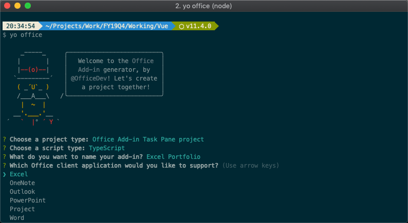
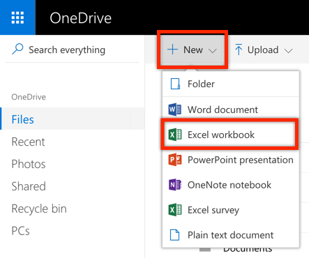
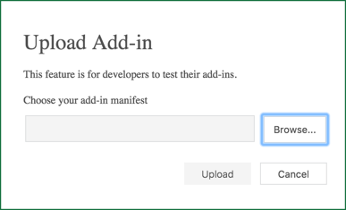

# Office Add-ins: Build an Office add-in using modern JavaScript tools and techniques - 300 Level

In this lab, you will walk through building Office add-ins using a variety of popular JavaScript tools and frameworks, including TypeScript, React, Angular, and VueJS. 

## Table of Contents

1. [Build an Office Add-in using React](#OfficeAddinReact)
1. [Build an Office Add-in using Angular](#OfficeAddinAngular)
1. [Build an Office Add-in using VueJS](#OfficeAddinVuejs)
1. [Side-load and Test the Office add-in](#SideLoadTestAddins)

## Prerequisites

To complete this lab, you need the following:

* Consumer [OneDrive](https://www.onedrive.com) account. OneDrive is used to test the Office add-in  (via Office Online).
* A lightweight code editor such as [Visual Studio Code](https://code.visualstudio.com/) for developing the solution.
* [Node.js](https://nodejs.org/). Node is required to setup, build, and run the project.
* [Angular CLI](https://cli.angular.io/). The Angular CLI is used to provision the Angular web application in the [Build an Office Add-in using Angular](#OfficeAddinAngular) lab.

    ```shell
    npm install -g @angular/cli
    ```

* [The Office Yeoman Generator](https://www.npmjs.com/package/generator-office). The Office Yeoman Generator is used to create the Office add-in projects and xml manifests.

    ```shell
    npm install -g yo generator-office
    ```

## Completed Exercises

Finished solutions are provided in the [Demos](./Demos) folder if you get stuck. If you want to run any of the finished solutions, clone the repository, run **npm install** (from the directory of the finished solution), then **npm run start** and follow the steps to [Side-load and Test the Office add-in](#SideLoadTestAddins).

All three exercises in this lab build the same Excel Stock Portfolio solution so developers can compare the experience building Office add-ins with different modern JavaScript tools and frameworks. The add-in will allow the user to get real-time stock quotes and manage a portfolio in an Excel table. User's will have the ability to add, delete, and refresh stocks. Additionally, the add-in checks for an existing portfolio upon opening and (if found) reads the stocks out of the worksheet.


<a name="OfficeAddinReact"></a>

## 1. Build an Office Add-in using React

In this exercise, you will develop an Office add-in using React and TypeScript. You will provision a new project using the Office Yeoman generator, develop the add-in using Office.js, and test the add-in in Office Online.

### Provision the Office add-in

1. Open a terminal/command prompt, and change directories to the location where you want the project provisioned.
1. Run the **Office Yeoman generator** using the command "**yo office**".

    ```shell
    yo office
    ```

1. The Office Yeoman generator will ask a number of question. Use the following responses:
    * Would you like to create a new subfolder for your project? **Yes**
    * What do you want to name your add-in? **Excel Portfolio**
    * Which Office client application would you like to support? **Excel**
    * Would you like to create a new add-in? **Yes, I need to create a new web app and manifest for my add-in.**
    * Would you like to use TypeScript? **Yes**
    * Choose a framework **React**
    * For more information and resources on your next steps, we have created a resource.html file in your project. Would you like to open it now while we finish creating your project? **No**

    

1. When then Yeoman generator completes, change directories to the open the project folder (ex: **cd excel-portfolio**) and open the folder in your favorite code editor (you can use the command "**code .**" for [Visual Studio Code](https://code.visualstudio.com/)).

    >**OPTIONAL**: You should be able to run and side-load the add-in at this point. To do that, follow the steps outlined in [Side-load and Test the Office add-in](#SideLoadTestAddins). In the next section, you will add additional functionality to the add-in.

### Develop the Office add-in

1. Open **src/assets/styles/global.scss** and add the following styles to the end of the file.

    ````css
    .container {
        .overlay {
            position: absolute;
            top: 0px;
            bottom: 0px;
            left: 0px;
            right: 0px;
            z-index: 1000;
            display: block;
            .spinner {
                position: absolute;
                top: 50%;
                left: 50%;
                margin-top: -20px;
                margin-left: -20px;
                z-index: 1100;
            }
        }
        .header {
            padding-left: 10px;
        }
        .ms-MessageBar-content {
            padding: 2px !important;
        }
        .pct100 {
            width: 100%;
            float: left;
        }
        .padding10 {
            padding: 10px;
        }
        .right {
            float: right;
        }
        .left {
            float: left;
        }
        .icon {
            padding-left: 8px;
            cursor: pointer;
        }
        .itemRow {
            padding-top: 4px;
            padding-bottom: 4px;
        }
        .itemRow:hover {
            background-color: #eeeeee;
        }
        .tbl-head {
            margin-bottom: 5px;
        }
    }
    ````

1. The project template that the Office Yeoman generator created includes a number of React components that need to be updated or deleted. Start by deleting the **src/components/hero-list.tsx** file.
1. Next, open the **src/components/header.tsx** file and modify it as seen below.

    ````typescript
    import * as React from 'react';

    export interface HeaderProps {
        title: string;
    }

    export class Header extends React.Component<HeaderProps, any> {
        constructor(props, context) {
            super(props, context);
        }

        render() {
            return (
                <div className="ms-bgColor-greenDark header">
                    <span className="ms-font-su ms-fontColor-white">{this.props.title}</span>
                </div>
            );
        };
    };
    ````

1. Next, create a new React component named **waiting** at **src/components/waiting.tsx** with the code shown below. Notice this component uses the Office UI Fabric React Components for **Overlay** and **Spinner**.

    ````typescript
    import * as React from "react";
    import { Overlay, Spinner, SpinnerSize } from "office-ui-fabric-react";

    export class Waiting extends React.Component<any, any> {
        constructor(props, context) {
            super(props, context);
        }

        render() {
            return (
                <Overlay isDarkThemed={ true } className="overlay">
                    <div className="spinner">
                        <Spinner size={SpinnerSize.large} />
                    </div>
                </Overlay>
            );
        };
    };
    ````

1. Create a new React component named **stock-item** at **src/components/stock-item.tsx** with the code shown below. This component will display a stock with commands for refresh and delete. The component has properties for stock symbol, it's index in the list, and the handlers for refresh and delete.

    ````typescript
    import * as React from 'react';

    export interface StockItemProps {
        symbol: string;
        index: number;
        onDelete: any;
        onRefresh: any;
    }

    export class StockItem extends React.Component<StockItemProps, any> {
        constructor(props, context) {
            super(props, context);
        }

        render() {
            return (
                <div className="pct100 itemRow">
                    <div className="left">{this.props.symbol}</div>
                    <div className="right">
                        <div className="left icon"><i className="ms-Icon ms-Icon--Refresh" aria-hidden="true" onClick={this.props.onRefresh}></i></div>
                        <div className="left icon"><i className="ms-Icon ms-Icon--Delete" aria-hidden="true" onClick={this.props.onDelete}></i></div>
                    </div>
                </div>
            );
        };
    };
    ````

1. Finally, open up **src/components/app.tsx** and update it as seen below. Keep it open, as you will make a number of additional updates to this file before the end of this exercise.

    ````typescript
    import * as React from 'react';
    import { TextField, MessageBar, MessageBarType } from 'office-ui-fabric-react';
    import { Header } from './header';
    import { Waiting } from './waiting';
    import { StockItem } from './stock-item';

    export interface AppProps {
        title: string;
    }

    export interface AppState {
        listItems: string[];
        waiting: boolean;
        error: string;
    }

    export class App extends React.Component<AppProps, AppState> {
        constructor(props, context) {
            super(props, context);
            this.state = {
                listItems: [],
                waiting: false,
                error: ""
            };

            // Sync stocks already in Excel table
            this.syncTable().then(() => {});
        }

        // Adds symbol
        addSymbol = async (event) => {
            //TODO
            console.log(event);
        }

        // Delete symbol
        deleteSymbol = async (index) => {
            //TODO
            console.log(index);
        }

        // Refresh symbol
        refreshSymbol = async (index:number) => {
            //TODO
            console.log(index);
        }

        // Reads symbols from an existing Excel workbook and pre-populates them in the add-in
        syncTable = async () => {
            //TODO
            console.log("sync");
        }

        // Gets a quote by calling into the stock service
        getQuote = async (symbol:string) => {
            //TODO
            console.log(symbol);
        }

        render() {
            const stocks = this.state.listItems.map((symbol, index) => (
                <StockItem symbol={symbol} index={index} onDelete={this.deleteSymbol.bind(this, index)} onRefresh={this.refreshSymbol.bind(this, index)} />
            ));
            return (
                <div className='container'>
                    { this.state.waiting && 
                        <Waiting />
                    }
                    <Header title={this.props.title} />
                    { (this.state.error != "") &&
                        <MessageBar messageBarType={MessageBarType.error} isMultiline={false} onDismiss={ () => {this.setState({error: ""})} }>{this.state.error}</MessageBar>
                    }
                    <div className="padding10">
                        <div className="pct100 tbl-head">
                            <span className="ms-font-l">Stock Symbols</span>
                        </div>
                        <div className="pct100">
                            <TextField ref="newSymbol" onKeyPress={this.addSymbol.bind(this)} placeholder="Enter a stock symbol (ex: MSFT)" />
                        </div>
                        {stocks}
                    </div>
                </div>
            );
        };
    };
    ````

1. Although the app's functionality isn't complete, the visual markup is. You can see it by saving all your work and returning to Office Online. It should look similar to below. If you previously closed the Excel Online window or if your Office Online session has expired (the add-in doesn't seem to load), follow the [Side-load the Office add-in](#side-load-the-office-add-in) steps above.

    

1. The **app.tsx** file has a number of placeholder functions that you will complete to get the add-in functioning. Start by locading the **getQuote** function. This function calls a REST API to get real-time stock statistics on a specific stock symbol. Update it as seen below.

    ````typescript
    // Gets a quote by calling into the stock service
    getQuote = async (symbol:string) => {
        return new Promise((resolve, reject) => {
            let url = `https://estx.azurewebsites.net/api/quote/${symbol}`;
            fetch(url).then((res) => {
                if (res.ok)
                    resolve(res.json());
                else
                    reject("Error getting quote");
            });
        });
    }
    ````

1. Next, create new **utils** folder under **src** and then create a file named **excelTableUtil.ts** in it (**src/utils/excelTableUtil.ts**). This TypeScript class will contain helper functions for working with Excel tables with office.js. Notice the **ExcelTableUtil** constructor accepts details about the Excel table, including the name, location, and header details.

    ````typescript
    /// <reference path="../../node_modules/@types/office-js/index.d.ts" />

    export class ExcelTableUtil {
        tableName:string;
        location:string;
        headers:string[];
        constructor(tableName:string, location:string, headers:string[]) {
            this.tableName = tableName;
            this.location = location;
            this.headers = headers;
        }

        // ExcelTableUtil functions here
    }
    ````

1. Return to **src/components/app.tsx** and add a import reference to the **ExcelTableUtil** class we just created and create a private property inside the App class.

    ````typescript
    import * as React from 'react';
    import { TextField, MessageBar, MessageBarType } from 'office-ui-fabric-react';
    import { Header } from './header';
    import { Waiting } from './waiting';
    import { StockItem } from './stock-item';
    import { ExcelTableUtil } from '../utils/excelTableUtil';

    /* lines omitted for readability */

    export class App extends React.Component<AppProps, AppState> {
        tableUtil:ExcelTableUtil = new ExcelTableUtil("Portfolio", 
            "A1:J1", [
                "Symbol", "Last Price", 
                "Change $", "Change %", 
                "Quantity", "Price Paid" ,
                "Day's Gain $", "Total Gain $", 
                "Total Gain %", "Value"
            ]);
        constructor(props, context) {
            /* lines omitted for readability */
    ````

1. Next, add functions to **src/utils/excelTableUtil.ts** for **createTable** and **ensureTable**. These functions will be used to get a handle to the Excel table (and create it if it doesn't exist).

    ````typescript
    // Create the StocksTable and defines the header row
    createTable = async () => {
        return new Promise(async (resolve, reject) => {
            await Excel.run(async (context) => {
                // Create a proxy object for the active worksheet and create the table
                var sheet = context.workbook.worksheets.getActiveWorksheet();
                var tableRef = sheet.tables.add(this.location, true);
                tableRef.name = this.tableName;
                tableRef.getHeaderRowRange().values = [this.headers];
                return context.sync().then(() => {
                    resolve(tableRef);
                });
            }).catch((createError) => {
                reject(createError);
            });
        });
    }

    // Ensures the Excel table is created
    ensureTable = async (forceCreate:boolean) => {
        return new Promise(async (resolve, reject) => {
            await Excel.run(async (context) => {
                // Create a proxy object for the active worksheet and try getting table reference
                var sheet = context.workbook.worksheets.getActiveWorksheet();
                var tableRef = sheet.tables.getItem(this.tableName);
                return context.sync().then(() => {
                    resolve(tableRef);
                });
            }).catch(() => {
                if (forceCreate) {
                    // Unable to find table...create it
                    this.createTable().then(async (tableRef) => {
                        resolve(tableRef);
                    }, (createError) => {
                        reject(createError);
                    });
                }
                else
                    resolve(null);
            });
        });
    }
    ````

1. Next, add the **addRow** function to **src/utils/excelTableUtil.cs**. Notice that it call the ensureTable function we just created to ensure the Excel table has been created.

    ````typescript
    // Appends a row to the table
    addRow = async (data) => {
        return new Promise(async (resolve, reject) => { 
            this.ensureTable(true).then(async (tableRef:Excel.Table) => {
                await Excel.run(async (context) => {
                    var sheet = context.workbook.worksheets.getActiveWorksheet();
                    // Add the new row
                    tableRef.rows.add(null, [data]);
                    // Autofit columns and rows if supported by API
                    if (Office.context.requirements.isSetSupported("ExcelApi", 1.2)) {
                        sheet.getUsedRange().format.autofitColumns();
                        sheet.getUsedRange().format.autofitRows();
                    }
                    sheet.activate();
                    return context.sync().then(() => {
                        resolve();
                    });
                }).catch((err) => {
                    reject(err);
                });
            }, (err) => {
                reject(err);
            });
        });
    }
    ````

1. Return to **src/components/app.tsx** and update the **addSymbol** function to call **getSymbol** for stock stats and then call **addRow** on the **ExcelTableUtil**. Notice the row data contains formulas.

    ````typescript
    // Adds symbol
    addSymbol = async (event) => {
        if (event.key == 'Enter') {
            let element = this.refs.newSymbol as TextField; 
            let symbol = element.value.toUpperCase();

            // Get quote and add to Excel table
            this.setState({ waiting: true });
            this.getQuote(symbol).then((res:any) => {
                let data = [
                    res.symbol, //Symbol
                    res.current, //Last Price
                    res.curr_change, //Change $
                    res.pct_change * 100, //Change %
                    0, //Quantity (user provided)
                    0, //Price Paid (user provided)
                    "=C:C * E:E", //Day's Gain $
                    "=(B:B * E:E) - (F:F * E:E)", //Total Gain $
                    "=H:H / (F:F * E:E) * 100", //Total Gain %
                    "=B:B * E:E" //Value
                ];
                this.tableUtil.addRow(data).then(() => {
                    let symbols = this.state.listItems;
                    symbols.unshift(element.state.value.toUpperCase());
                    this.setState({ listItems: symbols });
                    element.setState({ value: "" });
                    this.setState({waiting: false});
                }, (err) => {
                    this.setState({error: err});
                    this.setState({waiting: false});
                });
            }, (err) => {
                this.setState({error: err});
                this.setState({waiting: false});
            });
        }
    }
    ````

    > **Optional**: this is a good time to test the "add symbol" function of your add-in

1. Return to **/src/utils/excelTableUtil.ts** and add functions for **getColumnData** and **deleteRow**. getColumnData gets values for a column in the Excel table so a row can be identified for update or delete. deleteRow deletes a row in the Excel table based on it's index.

    ````typescript
    // Gets data for a specific named column
    getColumnData = async (column:string) => {
        return new Promise(async (resolve, reject) => { 
            this.ensureTable(false).then(async (tableRef:Excel.Table) => {
                if (tableRef == null)
                    resolve([]);
                else {
                    await Excel.run(async (context) => {
                        // Get column range by column name
                        var colRange = tableRef.columns.getItem(column).getDataBodyRange().load("values");
                        // Sync to populate proxy objects with data from Excel
                        return context.sync().then(async () => {
                            let data:string[] = [];
                            for (var i = 0; i < colRange.values.length; i++) {
                                data.push(colRange.values[i].toString());
                            }
                            resolve(data);
                        });
                    }).catch((err) => {
                        reject(err);
                    });
                }
            }, (err) => {
                reject(err);
            });
        });
    }

    // Deletes a column based by row index
    deleteRow = async (index:number) => {
        return new Promise(async (resolve, reject) => { 
            this.ensureTable(true).then(async (tableRef:Excel.Table) => {
                await Excel.run(async (context) => {
                    var range = tableRef.rows.getItemAt(index).getRange();
                    range.delete(Excel.DeleteShiftDirection.up);
                    return context.sync().then(async () => {
                        resolve();
                    });
                }).catch((err) => {
                    reject(err);
                });
            }, (err) => {
                reject(err);
            });
        });
    }
    ````

1. Return to **src/components/app.tsx** and update the **deleteSymbol** function to delete the specified symbol from the Excel table. Do this by first calling **getColumnData** (on **ExcelTableUtil**) to determine the row to delete and then **deleteRow** (also on **ExcelTableUtil**) to perform the delete.

    ````typescript
    // Delete symbol
    deleteSymbol = async (index) => {
        // Delete from Excel table by index number
        let symbols = this.state.listItems;
        let symbol = symbols[index];
        this.setState({ waiting: true });
        this.tableUtil.getColumnData("Symbol").then(async (columnData:string[]) => {
            // make sure the symbol was found in the Excel table
            if (columnData.indexOf(symbol) != -1) {
                this.tableUtil.deleteRow(columnData.indexOf(symbol)).then(async () => {
                    symbols.splice(index, 1);
                    this.setState({ listItems: symbols });
                    this.setState({waiting: false});
                }, (err) => {
                    this.setState({error: err});
                    this.setState({waiting: false});
                });
            }
            else {
                symbols.splice(index, 1);
                this.setState({waiting: false});
            }
        }, (err) => {
            this.setState({error: err});
            this.setState({waiting: false});
        });
    }
    ````

    > **Optional**: this is a good time to test the "delete symbol" function of your add-in

1. Make the final update to **src/utils/excelTableUtil.ts** by adding the **updateCell** function, which updates the cell at a specific address to a specified value.

    ````typescript
    // Updates a specific cell in the table
    updateCell = async (address:string, value:any) => {
        return new Promise(async (resolve, reject) => { 
            this.ensureTable(true).then(async () => {
                await Excel.run(async (context) => {
                    var sheet = context.workbook.worksheets.getActiveWorksheet();
                    var range = sheet.getRange(address);
                    range.values = [[value]];
                    return context.sync().then(async () => {
                        resolve();
                    });
                }).catch((err) => {
                    reject(err);
                });
            }, (err) => {
                reject(err);
            });
        });
    }
    ````

1. Next, update the **refreshSymbol** function on **src/components/app.tsx** to call **getQuote** for updated stock statistics and then update the last trade cell in the Excel table. Similar to deleteSymbol, this function will call **getColumnData** to determine the cell address before calling **updateCell**.

    ````typescript
    // Refresh symbol
    refreshSymbol = async (index:number) => {
        // Refresh stock quote and update Excel table
        let symbols = this.state.listItems;
        let symbol = symbols[index];
        this.setState({ waiting: true });
        this.tableUtil.getColumnData("Symbol").then(async (columnData:string[]) => {
            // make sure the symbol was found in the Excel table
            var rowIndex = columnData.indexOf(symbol);
            if (rowIndex != -1) {
                this.getQuote(symbol).then((res:any) => {
                    // "last trade" is in column B with a row index offset of 2 (row 0 + the header row)
                    this.tableUtil.updateCell(`B${rowIndex + 2}:B${rowIndex + 2}`, res.current).then(async () => {
                        this.setState({ waiting: false });
                    }, (err) => {
                        this.setState({error: err});
                        this.setState({ waiting: false });
                    });
                });
            }
            else {
                this.setState({error: "Symbol not in table"});
                symbols.splice(index, 1);
                this.setState({ waiting: false });
            }
        }, (err) => {
            this.setState({error: err});
            this.setState({ waiting: false });
        });
    }
    ````

    > **Optional**: this is a good time to test the "refresh symbol" function of your add-in

1. Finally, update the **syncTable** function, which is called when the add-in is launched (in the constructor of app.tsx) to pull in any stock symbols that might already exist in the worksheet. It calls **getColumnData** to get this data.

    ````typescript
    // Reads symbols from an existing Excel workbook and pre-populates them in the add-in
    syncTable = async () => {
        this.setState({ waiting: true });
        this.tableUtil.getColumnData("Symbol").then(async (columnData:string[]) => {
            this.setState({ listItems: columnData });
            this.setState({ waiting: false });
        }, (err) => {
            this.setState({error: err});
            this.setState({ waiting: false });
        });
    }
    ````

The Excel Portfolio Add-in written with React and TypeScript is complete. You should follow the steps to [Side-load and Test the Office add-in](#SideLoadTestAddins).

<a name="OfficeAddinAngular"></a>

## 2. Build an Office Add-in using Angular

In this exercise, you will develop an Office add-in using Angular and TypeScript. You will provision a new project using the Angular CLI and Office Yeoman generator, develop the add-in using Office.js, and test the add-in in Office Online.

### Provision the Office add-in

1. Open a terminal/command prompt, and change directories to the location where you want the project provisioned.
1. Use the **Angular CLI** to provision the new application with the name **excel-portfolio**.

    ```shell
    ng new excel-portfolio
    ```

1. After the Angular CLI completes, change directories to the new project folder it created.

    ```shell
    cd excel-portfolio
    ```

1. Next, run the **Office Yeoman generator** using the "**yo office**" command.

    ```shell
    yo office
    ```

1. Run the **Office Yeoman generator** using the command "**yo office**".

    ```shell
    yo office
    ```

1. The Office Yeoman generator will ask a number of question. Use the following responses:
    * Would you like to create a new subfolder for your project? **No**
    * What do you want to name your add-in? **Excel Portfolio**
    * Which Office client application would you like to support? **Excel**
    * Would you like to create a new add-in? **No, I already have a web app and only need a manifest file for my add-in**
    * For more information and resources on your next steps, we have created a resource.html file in your project. Would you like to open it now while we finish creating your project? **No**
    * Overwrite package.json? **do not overwrite**

    

1. When then Yeoman generator completes, change directories to the open the project folder (ex: **cd excel-portfolio**) and open the folder in your favorite code editor (you can use the command "**code .**" for [Visual Studio Code](https://code.visualstudio.com/)).

1. Locate the **package.json** file in the root directory and modify the **start** script to use **SSL** and port **3000** (the port configured in the Office add-in xml manifest by the Yeoman generator)
    
    ```json
    "scripts": {
        "ng": "ng",
        "start": "ng serve --ssl true --port 3000",
        "build": "ng build",
        "test": "ng test",
        "lint": "ng lint",
        "e2e": "ng e2e"
    },
    ```

1. Next, add Office.js typings (**@types/office-js**) to the **dependencies** section.

    ```json
    "@types/office-js": "^0.0.48"
    ```

1. Run **npm install** at the command prompt to pull these dependencies into the project.

    ```shell
    npm install
    ```

1. Next, open **src/index.html** and add CDN references to **office.js** and the **Office UI Fabric**.
    > Note: although this lab adds CDN references to Office.js and the Office UI Fabric, you can alternatively install them locally using npm. The .angular-cli.json file can be updated to include any local scripts that should be included in the webpack build.

    ````html
    <!doctype html>
    <html lang="en">
    <head>
        <meta charset="utf-8">
        <title>ExcelPortfolio</title>
        <base href="/">

        <meta name="viewport" content="width=device-width, initial-scale=1">
        <link rel="stylesheet" href="https://static2.sharepointonline.com/files/fabric/office-ui-fabric-js/1.2.0/css/fabric.min.css" />
        <link rel="stylesheet" href="https://static2.sharepointonline.com/files/fabric/office-ui-fabric-js/1.2.0/css/fabric.components.min.css" />
    </head>
    <body>
        <app-root></app-root>
        <script type="text/javascript" src="https://appsforoffice.microsoft.com/lib/1.1/hosted/office.debug.js"></script>
        <script type="text/javascript" src="https://static2.sharepointonline.com/files/fabric/office-ui-fabric-js/1.2.0/js/fabric.min.js"></script>
    </body>
    </html>
    ````

1. Angular bootstraps to the UI in the **src/main.ts** file. This is where **Office.initialize** needs to be called so the add-in functions properly. First, add a typings reference to **Office.js** at the top of this file.

    ````typescript
    /// <reference path="../node_modules/@types/office-js/index.d.ts" />
    ````

1. Next, locate where the **bootstrapModule** is being called to bootstrap the **AppModule** and wrap the entire statement around **Office.initialize**. You need to call Office.initialize and any page loaded in the add-in before other scripts run.

    ````typescript
    Office.initialize = function () {
        platformBrowserDynamic().bootstrapModule(AppModule)
            .catch(err => console.log(err));
    }
    ````

    >**OPTIONAL**: You should be able to run and side-load the add-in at this point. To do that, follow the steps outlined in [Side-load and Test the Office add-in](#SideLoadTestAddins). In the next section, you will add additional functionality to the add-in.

### Develop the Office add-in

1. Open **src/app.css** and replace the entire file with the contents show below.

    ````css
    /* You can add global styles to this file, and also import other style files */
    .header {
        padding: 10px;
    }

    .content {
        margin-top: 10px;
    }

    .hover:hover {
        background: #f8f8f8;
    }

    .overlay {
        position: absolute;
        top: 0px;
        bottom: 0px;
        left: 0px;
        right: 0px;
        background: hsla(0,0%,100%,.4);
        z-index: 1000;
    }

    .spinner {
        position: absolute;
        top: 50%;
        left: 50%;
        margin-top: -20px;
        margin-left: -20px;
        z-index: 1100;
    }

    .ms-MessageBar-content {
        padding: 2px !important;
    }

    .pct100 {
        width: 100%;
        float: left;
    }

    .padding10 {
        padding: 10px;
    }

    .right {
        float: right;
    }

    .left {
        float: left;
    }

    .icon {
        padding-left: 8px;
        cursor: pointer;
    }

    .itemRow {
        padding-top: 4px;
        padding-bottom: 4px;
    }

    .itemRow:hover {
        background-color: #eeeeee;
    }

    .tbl-head {
        margin-bottom: 5px;
    }
    ````

1. Copy the **spinner.gif** image from the **README_assets** folder into **src/assets** of your project directory. The Office UI Fabric has a spinner component, but would take additional effort to implement it in an Angular project (at least without adding a jquery reference). Here is the image if you want to copy from here.

    

1. Because the add-in will call a REST API, you need to load Angular's HttpModule. Open **src/app/app/app.module.ts**, import the **HttpModule** and add it to the **imports** section of the **@NgModule** declaration.

    ````typescript
    import { BrowserModule } from '@angular/platform-browser';
    import { NgModule } from '@angular/core';
    import { HttpModule } from '@angular/http';
    import { AppComponent } from './app.component';

    @NgModule({
        declarations: [
            AppComponent
        ],
        imports: [
            BrowserModule,
            HttpModule
        ],
        providers: [],
        bootstrap: [AppComponent]
    })
    export class AppModule { }
    ````

1. Angular allows you to break your solution up into components. The Angular CLI already created an app componen. Open **src/app/app.component.html** to update it's markup as seen below.

    ````html
    <!--The content below is only a placeholder and can be replaced.-->
    <div>
        <div *ngIf="waiting">
            <div class="overlay"></div>
            
        </div>
        <div class="ms-bgColor-greenDark header">
            <span class="ms-font-su ms-fontColor-white">Excel Portfolio</span>
        </div>    
        <div>
            <div class="ms-MessageBanner" *ngIf="error">
                <div class="ms-MessageBanner-content" style="text-align: left; margin-left: 40px;">
                    <div class="ms-MessageBanner-text ms-font-s-plus">
                        <div class="ms-MessageBanner-clipper">
                            <i class="ms-Icon ms-Icon--Error"></i>
                            <span style="vertical-align: top;">&nbsp;{{error}}</span>
                        </div>
                    </div>
                </div>
                <button class="ms-MessageBanner-close" (click)="error = null;">
                    <i class="ms-Icon ms-Icon--Clear"></i>
                </button>
            </div>
            <div class="padding10">
                <div class="pct100 tbl-head">
                    <span class="ms-font-l">Stock Symbols</span>
                </div>
                <div class="pct100">
                    <input class="ms-TextField-field" #newSymbol (keyup.enter)="addSymbol(newSymbol.value); newSymbol.value = '';" placeholder="Enter a stock symbol (ex: MSFT)" />
                </div>
                <div class="pct100 itemRow" *ngFor="let symbol of symbols; let i = index" >
                    <div class="left ms-font-l">{{symbol}}</div>
                    <div class="right">
                        <div class="left icon" (click)="refreshSymbol(i)"><i class="ms-Icon ms-Icon--Refresh" aria-hidden="true"></i></div>
                        <div class="left icon" (click)="deleteSymbol(i)"><i class="ms-Icon ms-Icon--Delete" aria-hidden="true"></i></div>
                    </div>
                </div>
                <div class="pct100 itemRow" *ngIf="symbols.length == 0">
                    <em class="ms-font-l">No symbols added</em>
                </div>
            </div>
        </div>
    </div>
    ````

1. Next, open **src/app/app.component.ts** and update it as follows.

    ````typescript
    import { Component, NgZone } from '@angular/core';
    import 'rxjs/add/operator/map';
    import { Http } from '@angular/http';

    @Component({
        selector: 'app-root',
        templateUrl: './app.component.html',
        styleUrls: ['./app.component.css']
    })
    export class AppComponent {
        // AppComponent properties
        symbols:string[] = [];
        error:string = null;
        waiting = false;
        zone: NgZone = new NgZone({});

        // AppComponent constructor
        constructor(private http: Http) {
            this.syncTable().then(() => {});
        }
  
        // Adds symbol
        addSymbol = async (symbol:string) => {
            //TODO
            console.log(symbol);
        }

        // Delete symbol
        deleteSymbol = async (index:number) => {
            //TODO
            console.log(index);
        }

        // Refresh symbol
        refreshSymbol = async (index:number) => {
            //TODO
            console.log(index);
        }

        // Reads symbols from an existing Excel workbook and pre-populates them in the add-in
        syncTable = async () => {
            //TODO
            console.log("syncTable");
        }

        // Gets a quote by calling into the stock service
        getQuote = async (symbol:string) => {
            //TODO
            console.log(symbol);
        }
    }
    ````

1. Although the app's functionality isn't complete, the visual markup is. You can see it by saving all your work and returning to Office Online. It should look similar to below. If you previously closed the Excel Online window or if your Office Online session has expired (the add-in doesn't seem to load), follow the [Side-load the Office add-in](#side-load-the-office-add-in) steps above.

    

1. The **app.component.ts** file has a number of placeholder functions that you will complete to get the add-in functioning. Start by loading the **getQuote** function. This function calls a REST API to get real-time stock statistics on a specific stock symbol. Update it as seen below.

    ````typescript
    // Gets a quote by calling into the stock service
    getQuote = async (symbol:string) => {
        return new Promise((resolve, reject) => {
            let url = `https://estx.azurewebsites.net/api/quote/${symbol}`;
            this.http.get(url)
                .map(res => res.json())
                .subscribe(
                    res => resolve(res),
                    err => reject(err),
                    () => console.log(`Quote for ${symbol.toUpperCase()} complete`)
                );
        });
    }
    ````

1. Next, create new **utils** folder under **src/app** and then create a file named **excelTableUtil.ts** in it (**src/app/utils/excelTableUtil.ts**). This TypeScript class will contain helper functions for working with Excel tables with office.js. Notice the **ExcelTableUtil** constructor accepts details about the Excel table, including the name, location, and header details.

    ````typescript
    /// <reference path="../../../node_modules/@types/office-js/index.d.ts" />

    export class ExcelTableUtil {
        tableName:string;
        location:string;
        headers:string[];
        constructor(tableName:string, location:string, headers:string[]) {
            this.tableName = tableName;
            this.location = location;
            this.headers = headers;
        }

        // ExcelTableUtil functions here
    }
    ````

1. Return to **src/app/app.component.ts** and add a import reference to the **ExcelTableUtil** class we just created and create a private property inside the **AppComponent** class (right above the constructor).

    ````typescript
    import { Component, NgZone } from '@angular/core';
    import 'rxjs/add/operator/map';
    import { Http } from '@angular/http';
    import { ExcelTableUtil } from './utils/excelTableUtil';

    @Component({
        selector: 'app-root',
        templateUrl: './app.component.html',
        styleUrls: ['./app.component.css']
    })
    export class AppComponent {
        // AppComponent properties
        symbols:string[] = [];
        error:string = null;
        waiting = false;
        zone: NgZone = new NgZone({});
        tableUtil:ExcelTableUtil = new ExcelTableUtil(
            "Portfolio", "A1:J1", [
                "Symbol", 
                "Last Price", 
                "Change $", 
                "Change %", 
                "Quantity", 
                "Price Paid", 
                "Day's Gain $", 
                "Total Gain $", 
                "Total Gain %", 
                "Value"
            ]
        );

        // AppComponent constructor
        constructor(private http: Http) {
            /* !!! lines removed for readability !!! */
    ````

1. Next, add functions to **src/app/utils/excelTableUtil.ts** for **createTable** and **ensureTable**. These functions will be used to get a handle to the Excel table (and create it if it doesn't exist).

    ````typescript
    // Create the StocksTable and defines the header row
    createTable = async () => {
        return new Promise(async (resolve, reject) => {
            await Excel.run(async (context) => {
                // Create a proxy object for the active worksheet and create the table
                var sheet = context.workbook.worksheets.getActiveWorksheet();
                var tableRef = sheet.tables.add(this.location, true);
                tableRef.name = this.tableName;
                tableRef.getHeaderRowRange().values = [this.headers];
                return context.sync().then(() => {
                    resolve(tableRef);
                });
            }).catch((createError) => {
                reject(createError);
            });
        });
    }

    // Ensures the Excel table is created
    ensureTable = async (forceCreate:boolean) => {
        return new Promise(async (resolve, reject) => {
            await Excel.run(async (context) => {
                // Create a proxy object for the active worksheet and try getting table reference
                var sheet = context.workbook.worksheets.getActiveWorksheet();
                var tableRef = sheet.tables.getItem(this.tableName);
                return context.sync().then(() => {
                    resolve(tableRef);
                });
            }).catch(() => {
                if (forceCreate) {
                    // Unable to find table...create it
                    this.createTable().then(async (tableRef) => {
                        resolve(tableRef);
                    }, (createError) => {
                        reject(createError);
                    });
                }
                else
                    resolve(null);
            });
        });
    }
    ````

1. Next, add the **addRow** function to **src/app/utils/excelTableUtil.cs**. Notice that it call the ensureTable function we just created to ensure the Excel table has been created.

    ````typescript
    // Appends a row to the table
    addRow = async (data) => {
        return new Promise(async (resolve, reject) => { 
            this.ensureTable(true).then(async (tableRef:Excel.Table) => {
                await Excel.run(async (context) => {
                    var sheet = context.workbook.worksheets.getActiveWorksheet();
                    // Add the new row
                    tableRef.rows.add(null, [data]);
                    // Autofit columns and rows if supported by API
                    if (Office.context.requirements.isSetSupported("ExcelApi", 1.2)) {
                        sheet.getUsedRange().format.autofitColumns();
                        sheet.getUsedRange().format.autofitRows();
                    }
                    sheet.activate();
                    return context.sync().then(() => {
                        resolve();
                    });
                }).catch((err) => {
                    reject(err);
                });
            }, (err) => {
                reject(err);
            });
        });
    }
    ````

1. Return to **src/app/app.component.ts** and update the **addSymbol** function to call **getSymbol** for stock stats and then call **addRow** on the **ExcelTableUtil**. Notice the row data contains formulas.

    ````typescript
    // Adds symbol
    addSymbol = async (symbol:string) => {
        // Get quote and add to Excel table
        this.waiting = true;
        this.getQuote(symbol).then((res:any) => {
            let data = [
                res.symbol, 
                res.current, 
                res.curr_change, 
                res.pct_change * 100, 0, 0, 
                "=C:C * E:E", 
                "=(B:B * E:E) - (F:F * E:E)", 
                "=H:H / (F:F * E:E) * 100", 
                "=B:B * E:E"
            ];
            this.tableUtil.addRow(data).then(() => {
                this.symbols.unshift(symbol.toUpperCase());
                this.waiting = false;
            }, (err) => {
                this.error = err;
            });
        }, (err) => {
            this.error = err;
            this.waiting = false;
        });
    }
    ````

    > **Optional**: this is a good time to test the "add symbol" function of your add-in

1. Return to **/src/app/utils/excelTableUtil.ts** and add functions for **getColumnData** and **deleteRow**. getColumnData gets values for a column in the Excel table so a row can be identified for update or delete. deleteRow deletes a row in the Excel table based on it's index.

    ````typescript
    // Gets data for a specific named column
    getColumnData = async (column:string) => {
        return new Promise(async (resolve, reject) => { 
            this.ensureTable(false).then(async (tableRef:Excel.Table) => {
                if (tableRef == null)
                    resolve([]);
                else {
                    await Excel.run(async (context) => {
                        // Get column range by column name
                        var colRange = tableRef.columns.getItem(column).getDataBodyRange().load("values");
                        // Sync to populate proxy objects with data from Excel
                        return context.sync().then(async () => {
                            let data:string[] = [];
                            for (var i = 0; i < colRange.values.length; i++) {
                                data.push(colRange.values[i].toString());
                            }
                            resolve(data);
                        });
                    }).catch((err) => {
                        reject(err);
                    });
                }
            }, (err) => {
                reject(err);
            });
        });
    }

    // Deletes a column based by row index
    deleteRow = async (index:number) => {
        return new Promise(async (resolve, reject) => { 
            this.ensureTable(true).then(async (tableRef:Excel.Table) => {
                await Excel.run(async (context) => {
                    var range = tableRef.rows.getItemAt(index).getRange();
                    range.delete(Excel.DeleteShiftDirection.up);
                    return context.sync().then(async () => {
                        resolve();
                    });
                }).catch((err) => {
                    reject(err);
                });
            }, (err) => {
                reject(err);
            });
        });
    }
    ````

1. Return to **src/app/app.component.ts** and update the **deleteSymbol** function to delete the specified symbol from the Excel table. Do this by first calling **getColumnData** (on **ExcelTableUtil**) to determine the row to delete and then **deleteRow** (also on **ExcelTableUtil**) to perform the delete.

    ````typescript
    // Delete symbol
    deleteSymbol = async (index:number) => {
        // Delete from Excel table by index number
        let symbol = this.symbols[index];
        this.waiting = true;
        this.tableUtil.getColumnData("Symbol").then(async (columnData:string[]) => {
            // make sure the symbol was found in the Excel table
            if (columnData.indexOf(symbol) != -1) {
                this.tableUtil.deleteRow(columnData.indexOf(symbol)).then(async () => {
                    this.symbols.splice(index, 1);
                    this.waiting = false;
                }, (err) => {
                    this.error = err;
                    this.waiting = false;
                });
            }
            else {
                this.symbols.splice(index, 1);
                this.waiting = false;
            }
        }, (err) => {
            this.error = err;
            this.waiting = false;
        });
    }
    ````

    > **Optional**: this is a good time to test the "delete symbol" function of your add-in

1. Make the final update to **src/app/utils/excelTableUtil.ts** by adding the **updateCell** function, which updates the cell at a specific address to a specified value.

    ````typescript
    // Updates a specific cell in the table
    updateCell = async (address:string, value:any) => {
        return new Promise(async (resolve, reject) => { 
            this.ensureTable(true).then(async () => {
                await Excel.run(async (context) => {
                    var sheet = context.workbook.worksheets.getActiveWorksheet();
                    var range = sheet.getRange(address);
                    range.values = [[value]];
                    return context.sync().then(async () => {
                        resolve();
                    });
                }).catch((err) => {
                    reject(err);
                });
            }, (err) => {
                reject(err);
            });
        });
    }
    ````

1. Next, update the **refreshSymbol** function on **src/app/app.component.ts** to call **getQuote** for updated stock statistics and then update the last trade cell in the Excel table. Similar to deleteSymbol, this function will call **getColumnData** to determine the cell address before calling **updateCell**.

    ````typescript
    // Refresh symbol
    refreshSymbol = async (index:number) => {
        // Refresh stock quote and update Excel table
        let symbol = this.symbols[index];
        this.waiting = true;
        this.tableUtil.getColumnData("Symbol").then(async (columnData:string[]) => {
            // make sure the symbol was found in the Excel table
            var rowIndex = columnData.indexOf(symbol);
            if (rowIndex != -1) {
                this.getQuote(symbol).then((res:any) => {
                    // "last trade" is in column B with a row index offset of 2 (row 0 + the header row)
                    this.tableUtil.updateCell(`B${rowIndex + 2}:B${rowIndex + 2}`, res.current).then(async () => {
                        this.waiting = false;
                    }, (err) => {
                        this.error = err;
                        this.waiting = false;
                    });
                });
            }
            else {
                this.error = `${symbol} not found in Excel`;
                this.symbols.splice(index, 1);
                this.waiting = false;
            }
        }, (err) => {
            this.error = err;
            this.waiting = false;
        });
    }
    ````

    > **Optional**: this is a good time to test the "refresh symbol" function of your add-in

1. Finally, update the **syncTable** function, which is called when the add-in is launched (in the constructor of app.tsx) to pull in any stock symbols that might already exist in the worksheet. It calls **getColumnData** to get this data.

    ````typescript
    // Reads symbols from an existing Excel workbook and pre-populates them in the add-in
    syncTable = async () => {
        this.waiting = true;
        this.tableUtil.getColumnData("Symbol").then(async (columnData:string[]) => {
            this.symbols = columnData;
            this.waiting = false;
        }, (err) => {
            this.error = err;
            this.waiting = false;
        });
    }
    ````

The Excel Portfolio Add-in written with Angular and TypeScript is complete. You should follow the steps to [Side-load and Test the Office add-in](#SideLoadTestAddins).

<a name="OfficeAddinVuejs"></a>

## 3. Build an Office Add-in using VueJS

In this exercise, you will develop an Office add-in using Vue.js and TypeScript. You will provision a new project using the Office Yeoman generator, develop the add-in using Office.js, and test the add-in in Office Online.

### Provision the Office add-in

1. Open a terminal/command prompt, and change directories to the location where you want the project provisioned.
1. Run the **Office Yeoman generator** using the command "**yo office**".

    ```shell
    yo office
    ```

1. The Office Yeoman generator will ask a number of question. Use the following responses:
    * Would you like to create a new subfolder for your project? **Yes**
    * What do you want to name your add-in? **Excel Portfolio**
    * Which Office client application would you like to support? **Excel**
    * Would you like to create a new add-in? **Yes, I need to create a new web app and manifest for my add-in.**
    * Would you like to use TypeScript? **Yes**
    * Choose a framework **JQuery**
    * For more information and resources on your next steps, we have created a resource.html file in your project. Would you like to open it now while we finish creating your project? **No**

    

1. When then Yeoman generator completes, change directories to the open the project folder (ex: **cd excel-portfolio**) and open the folder in your favorite code editor (you can use the command "**code .**" for [Visual Studio Code](https://code.visualstudio.com/)).

1. The Office Yeoman generator does not have a Vue.js template, so the instructions had you select the JQuery template which you will now convert to leverage Vue.js. Start by opening **package.json** in the project root directory and add **dependencies** on **vue** and **vue-class-component**.

    ````javascript
    "dependencies": {
        "core-js": "^2.4.1",
        "office-ui-fabric-js": "^1.3.0",
        "jquery": "^3.1.1",
        "office-addin-validator": "^1.0.1",
        "vue":"^2.4.4",
        "vue-class-component":"^5.0.2",
        "@microsoft/office-js": "^1.1.2"
    },
    ````

1. Unfortunately, the JQuery template the generator uses puts everything into a single TypeScript file. To handle multiple TypeScript (and .vue) files, the project needs to be configured to use [webpack](https://webpack.github.io/). Add **devDependencies** for **webpack**, **vue-loader**, **vue-template-compiler**, and **ts-loader**.

    ````javascript
    "devDependencies": {
        "concurrently": "^3.1.0",
        "cpx": "^1.5.0",
        "rimraf": "^2.5.4",
        "browser-sync": "^2.18.5",
        "typescript": "^2.1.4",
        "@types/office-js": "^0.0.37",
        "@types/jquery": "^2.0.39",
        "webpack": "2.3.1",
        "vue-loader": "^13.0.4",
        "vue-template-compiler": "^2.4.2",
        "ts-loader": "^2.3.7"
    }
    ````

1. Return to the terminal/command prompt and run the **npm install** command to pull in the additional dependencies and devDependencies.
1. Next, you need to update the TypeScript config file (**tsconfig.json**) to work with webpack and support multiple modules and Vue.js. Update it as seen below.

    ````javascript
    {
        "compilerOptions": {
            "target": "es5",
            "module": "es6",
            "moduleResolution": "node",
            "sourceMap": true,
            "emitDecoratorMetadata": true,
            "experimentalDecorators": true,
            "removeComments": false,
            "noImplicitAny": false,
            "noEmitOnError": true,
            "rootDir": "src",
            "outDir": "src",
            "allowSyntheticDefaultImports": true,
            "lib": [
                "dom",
                "es2015"
            ]
        },
        "exclude": [
            "node_modules"
        ]
    }
    ````

1. Create a **webpack.config.js** file in the project root directory to configure webpack for this project. Updated it as seen below.

    ````javascript
    var path = require('path')
    var webpack = require('webpack')

    module.exports = {
        context: path.resolve(__dirname, 'src'),
        entry: './app.ts',
        resolve: {
            extensions: ['.js', '.json', '.ts', '.vue'],
            alias: {
                vue$: 'vue/dist/vue.js'
            }
        },
        output: {
            path: path.resolve(__dirname, './dist'),
            publicPath: '/dist/',
            filename: 'bundle.js'
        },
        module: {
            rules: [
                {
                    test: /\.ts$/,
                    loader: 'ts-loader',
                    options: {
                        appendTsSuffixTo: [/\.vue$/]
                    }
                },
                {
                    test: /\.vue$/,
                    loader: 'vue-loader',
                    options: {
                        esModule: true
                    }
                },
                {
                    test: /\.(png|jpg|gif|svg)$/,
                    loader: 'file-loader',
                    options: {
                        name: '[name].[ext]?[hash]'
                    }
                }
            ]
        },
        devServer: {
            historyApiFallback: true,
            noInfo: true
        },
        performance: {
            hints: false
        },
        devtool: '#eval-source-map'
    }
    ````

1. Next, you need to update the project so that **.vue** files will be treated like TypeScript. Create a **sfc.d.ts** file at **src/sfc.d.ts** and update it as seen below.

    ````typescript
    declare module "*.vue" {
        import Vue from 'vue'
        export default Vue
    }
    ````

1. Next, go back to the **package.json** file in the project root directory and update the **scripts** section to leverage webpack as seen below.

    ````javascript
    "scripts": {
        "tsc": "tsc -p tsconfig.json",
        "server": "browser-sync start --config bsconfig.json",
        "copy": "cpx \"src/**/!(*.ts)\" dist",
        "start": "rimraf dist && npm run tsc && webpack --config webpack.config.js --colors --progress --bail && npm run copy && npm run server",
        "validate": "./node_modules/.bin/validate-office-addin"
    },
    ````

    > **NOTE**: the updated script settings does not leverage a watch for file changed like the React and Angular projects in this module. Additional webpack configuration could be applied to archive this. Another option would be to start with the React template from the Office Yeoman generator and convert it to Vue.js.

1. Next, open **src/index.html**, remove the **core.js** and **jquery.js** references and change the **app.js** reference to **bundle.js** (the consolidated script created by webpack). You can also replace the **header** and **main** content with **&lt;div id="app"&gt;{{welcome}}&lt;/div&gt;**.

    ````html
    <!DOCTYPE html>
    <html>
    <head>
        <meta charset="UTF-8" />
        <meta http-equiv="X-UA-Compatible" content="IE=Edge" />
        <meta name="viewport" content="width=device-width, initial-scale=1">
        <title>Excel Portfolio</title>

        <!-- Office JavaScript API -->
        <script type="text/javascript" src="https://appsforoffice.microsoft.com/lib/1.1/hosted/office.debug.js"></script>

        <!-- LOCAL -->
        <link rel="stylesheet" href="node_modules/office-ui-fabric-js/dist/css/fabric.min.css" />
        <link rel="stylesheet" href="node_modules/office-ui-fabric-js/dist/css/fabric.components.css" />

        <!-- Template styles -->
        <link href="app.css" rel="stylesheet" type="text/css" />
    </head>

    <body class="ms-font-m ms-welcome">
        <div id="app">{{welcome}}</div>

        <script type="text/javascript" src="node_modules/office-ui-fabric-js/dist/js/fabric.js"></script>
        <script type="text/javascript" src="bundle.js"></script>
    </body>

    </html>
    ````

1. Finally, update **src/app.ts** to import Vue and initialize it within the **Office.initialize** callback. You need to call Office.initialize and any page loaded in the add-in before other scripts run.

    ````typescript
    import Vue  from 'vue';

    (() => {
        // The initialize function must be run each time a new page is loaded
        Office.initialize = (reason) => {
            var app = new Vue({ 
                el: "#app",
                data: {
                    welcome: "Hello Office!!!"
                }
            });
            console.log(app);
        };
    })();
    ````

    >**OPTIONAL**: You should be able to run and side-load the add-in at this point. To do that, follow the steps outlined in [Side-load and Test the Office add-in](#SideLoadTestAddins). In the next section, you will add additional functionality to the add-in.

### Develop the Office add-in

1. Open **src/app.css** and replace the entire file with the contents show below.

    ````css
    /* You can add global styles to this file, and also import other style files */
    .header {
        padding: 10px;
    }

    .content {
        margin-top: 10px;
    }

    .hover:hover {
        background: #f8f8f8;
    }

    .overlay {
        position: absolute;
        top: 0px;
        bottom: 0px;
        left: 0px;
        right: 0px;
        background: hsla(0,0%,100%,.4);
        z-index: 1000;
    }

    .spinner {
        position: absolute;
        top: 50%;
        left: 50%;
        margin-top: -20px;
        margin-left: -20px;
        z-index: 1100;
    }

    .ms-MessageBar-content {
        padding: 2px !important;
    }

    .pct100 {
        width: 100%;
        float: left;
    }

    .padding10 {
        padding: 10px;
    }

    .right {
        float: right;
    }

    .left {
        float: left;
    }

    .icon {
        padding-left: 8px;
        cursor: pointer;
    }

    .itemRow {
        padding-top: 4px;
        padding-bottom: 4px;
    }

    .itemRow:hover {
        background-color: #eeeeee;
    }

    .tbl-head {
        margin-bottom: 5px;
    }
    ````

1. Copy the **spinner.gif** image from the **README_assets** folder into **src/assets** of your project directory. The Office UI Fabric has a spinner component, but would take additional effort to implement it in a Vue.js project (at least without adding a jquery reference). Here is the image if you want to copy from here.

    

1. Similar to React and Angular, Vue.js supports custom components. Although these can be built a number of ways,  this exercise will create **.vue** files that combine templates and TypeScript leveraging the **vue-class-component** package. You have already setup the TypeScript compiler and webpack to handle these tiles. Start by creating a **components** folder under **src** (ex: **src/components**).

1. Next, create a **src/components/waiting.vue** file and modify it as seen below.

    ````html
    <template>
    <div>
        <div class="overlay"></div>
        
    </div>
    </template>

    <script lang="ts">
    import Vue from 'vue';
    import Component from 'vue-class-component';

    @Component({})
    export default class waiting extends Vue {
        name: 'waiting'
    }
    </script>
    ````

1. Next, create a new Vue component named **headerComponent** at **src/components/headerComponent.vue** with the code shown below. Notice this component uses a number of predefined Office UI Fabric style classes.

    ````html
    <template>
        <div>
        <div class="ms-bgColor-greenDark header">
            <span class="ms-font-su ms-fontColor-white">{{title}}</span>
        </div>
        <div class="ms-MessageBanner" v-if="error">
            <div class="ms-MessageBanner-content" style="text-align: left; margin-left: 40px;">
                <div class="ms-MessageBanner-text ms-font-s-plus">
                    <div class="ms-MessageBanner-clipper">
                        <i class="ms-Icon ms-Icon--Error"></i>
                        <span style="vertical-align: top;">&nbsp;{{error}}</span>
                    </div>
                </div>
            </div>
            <button class="ms-MessageBanner-close" v-on:click="error = null;">
                <i class="ms-Icon ms-Icon--Clear"></i>
            </button>
        </div>
        </div>
    </template>

    <script lang="ts">
    import Vue from 'vue';
    import Component from 'vue-class-component';

    @Component({
        props: {
            title: String,
            error: String
        }
    })
    export default class headerComponent extends Vue {
        name: 'headerComponent';
        title:String;
        error:String;
    }
    </script>
    ````

1. Create a new React component named **stock** at **src/components/stock.vue** with the code shown below. This component will display a stock with commands for refresh and delete. Notice how the refresh and delete commands emit to the parent.

    ````html
    <template>
        <div class="pct100 itemRow">
            <div class="left ms-font-l">{{symbol}}</div>
            <div class="right">
                <div class="left icon"><i class="ms-Icon ms-Icon--Refresh" aria-hidden="true" v-on:click="refreshSymbol(index)"></i></div>
                <div class="left icon"><i class="ms-Icon ms-Icon--Delete" aria-hidden="true" v-on:click="deleteSymbol(index)"></i></div>
            </div>
        </div>
    </template>

    <script lang="ts">
        import Vue from 'vue';
        import Component from 'vue-class-component';

        @Component({ 
            props: {
                symbol: String,
                index: Number
            },
            methods: {
                refreshSymbol(index:Number) { 
                    this.$emit("refreshSymbol", index);
                },
                deleteSymbol(index:Number) {
                    this.$emit("deleteSymbol", index);
                }
            }
        })
        export default class stock extends Vue {
            name: 'stock';
            symbol:string;
            index:Number;
        }
    </script>
    ````

1. Finally, open up **src/components/root.vue** and update it as seen below. Keep it open, as you will make a number of additional updates to this file before the end of this exercise.

    ````html
    <template>
    <div>
        <waiting v-if="waiting"></waiting>
        <header-component v-bind:error="error" title="Excel Portfolio"></header-component>
        <div class="padding10">
            <div class="pct100 tbl-head">
                <span class="ms-font-l">Stock Symbols</span>
            </div>
            <div class="pct100">
                <input class="ms-TextField-field" 
                    v-model="newSymbol" 
                    v-on:keyup="addSymbol(newSymbol)" 
                    placeholder="Enter a stock symbol (ex: MSFT)" />
            </div>
            <stock v-for="(symbol, index) in symbols"  
                v-bind:key="symbol" 
                v-bind:symbol="symbol" 
                v-bind:index="index" 
                v-on:refreshSymbol="refreshSymbol(index)" 
                v-on:deleteSymbol="deleteSymbol(index)"></stock>
            <div class="pct100 itemRow" v-if="symbols.length == 0">
                <em class="ms-font-l">No symbols added</em>
            </div>
        </div>
    </div>
    </template>

    <script lang="ts">
        import Vue from 'vue';
        import Component from 'vue-class-component';
        import waiting from "./waiting.vue";
        import headerComponent from "./headerComponent.vue";
        import stock from "./stock.vue";

        @Component({
            data: function () { 
                return {
                    symbols: [],
                    waiting: false,
                    error: "",
                    newSymbol: ""
                } 
            },
            components: {
                waiting,
                headerComponent,
                stock
            },
            methods: {
                getQuote(symbol:string) {
                    //TODO
                    console.log(symbol);
                },
                addSymbol(symbol:string) {
                    //TODO
                    console.log(symbol);
                },
                deleteSymbol(index:number) {
                    //TODO
                    console.log(index);
                },
                refreshSymbol(index:number) {
                    //TODO
                    console.log(index);
                },
                syncTable() {
                    //TODO
                    console.log("sync table");
                }
            },
            mounted: function () {
                (<any>this).syncTable();
            }
        })
        export default class root extends Vue {
            name: 'root'
        }
    </script>
    ````

1. Open **src/app.ts** and update it as seen below. This imports all the Vue components you just created and renders the **root** component in the **#app** container.

    ````typescript
    import Vue  from 'vue';
    import root from './components/root.vue';

    (() => {
        // The initialize function must be run each time a new page is loaded
        Office.initialize = (reason) => {
            var app = new Vue({ 
                el: "#app",
                render: h => h(root, { }),
                components: { root }
            });
        };
    })();
    ````

1. Although the app's functionality isn't complete, the visual markup is. You can see it by saving all your work and returning to Office Online. It should look similar to below. If you previously closed the Excel Online window or if your Office Online session has expired (the add-in doesn't seem to load), follow the [Side-load the Office add-in](#side-load-the-office-add-in) steps above.

    

1. The **root.vue** file has a number of placeholder functions that you will complete to get the add-in functioning. Start by locading the **getQuote** function. This function calls a REST API to get real-time stock statistics on a specific stock symbol. Update it as seen below.

    ````typescript
    getQuote(symbol:string) {
        return new Promise((resolve, reject) => {
            let url = `https://estx.azurewebsites.net/api/quote/${symbol}`;
            fetch(url).then((res) => {
                if (res.ok)
                    resolve(res.json());
                else
                    reject("Error getting quote");
            });
        });
    },
    ````

1. Next, create new **utils** folder under **src** and then create a file named **excelTableUtil.ts** in it (**src/utils/excelTableUtil.ts**). This TypeScript class will contain helper functions for working with Excel tables with office.js. Notice the **ExcelTableUtil** constructor accepts details about the Excel table, including the name, location, and header details.

    ````typescript
    /// <reference path="../../node_modules/@types/office-js/index.d.ts" />

    export class ExcelTableUtil {
        tableName:string;
        location:string;
        headers:string[];
        constructor(tableName:string, location:string, headers:string[]) {
            this.tableName = tableName;
            this.location = location;
            this.headers = headers;
        }

        // ExcelTableUtil functions here
    }
    ````

1. Return to **src/components/root.vue** and add a import reference to the **ExcelTableUtil** class we just created and create a private property inside the data property of the component.

    ````typescript
    /* !!! template removed for readability !!! */
    import Vue from 'vue';
    import Component from 'vue-class-component';
    import waiting from "./waiting.vue";
    import headerComponent from "./headerComponent.vue";
    import stock from "./stock.vue";
    import { ExcelTableUtil } from "../utils/excelTableUtil";

    @Component({
        data: function () { 
            return {
                symbols: [],
                waiting: false,
                error: "",
                newSymbol: "",
                tableUtil: new ExcelTableUtil(
                    "Portfolio", "A1:J1", [
                        "Symbol", 
                        "Last Price", 
                        "Change $", 
                        "Change %", 
                        "Quantity", 
                        "Price Paid", 
                        "Day's Gain $", 
                        "Total Gain $", 
                        "Total Gain %", 
                        "Value"
                    ]
                )
            } 
        },
        /* !!! lines removed for readability !!! */
    ````

1. Next, add functions to **src/utils/excelTableUtil.ts** for **createTable** and **ensureTable**. These functions will be used to get a handle to the Excel table (and create it if it doesn't exist).

    ````typescript
    // Create the StocksTable and defines the header row
    createTable = async () => {
        return new Promise(async (resolve, reject) => {
            await Excel.run(async (context) => {
                // Create a proxy object for the active worksheet and create the table
                var sheet = context.workbook.worksheets.getActiveWorksheet();
                var tableRef = sheet.tables.add(this.location, true);
                tableRef.name = this.tableName;
                tableRef.getHeaderRowRange().values = [this.headers];
                return context.sync().then(() => {
                    resolve(tableRef);
                });
            }).catch((createError) => {
                reject(createError);
            });
        });
    }

    // Ensures the Excel table is created
    ensureTable = async (forceCreate:boolean) => {
        return new Promise(async (resolve, reject) => {
            await Excel.run(async (context) => {
                // Create a proxy object for the active worksheet and try getting table reference
                var sheet = context.workbook.worksheets.getActiveWorksheet();
                var tableRef = sheet.tables.getItem(this.tableName);
                return context.sync().then(() => {
                    resolve(tableRef);
                });
            }).catch(() => {
                if (forceCreate) {
                    // Unable to find table...create it
                    this.createTable().then(async (tableRef) => {
                        resolve(tableRef);
                    }, (createError) => {
                        reject(createError);
                    });
                }
                else
                    resolve(null);
            });
        });
    }
    ````

1. Next, add the **addRow** function to **src/utils/excelTableUtil.cs**. Notice that it call the ensureTable function we just created to ensure the Excel table has been created.

    ````typescript
    // Appends a row to the table
    addRow = async (data) => {
        return new Promise(async (resolve, reject) => { 
            this.ensureTable(true).then(async (tableRef:Excel.Table) => {
                await Excel.run(async (context) => {
                    var sheet = context.workbook.worksheets.getActiveWorksheet();
                    // Add the new row
                    tableRef.rows.add(null, [data]);
                    // Autofit columns and rows if supported by API
                    if (Office.context.requirements.isSetSupported("ExcelApi", 1.2)) {
                        sheet.getUsedRange().format.autofitColumns();
                        sheet.getUsedRange().format.autofitRows();
                    }
                    sheet.activate();
                    return context.sync().then(() => {
                        resolve();
                    });
                }).catch((err) => {
                    reject(err);
                });
            }, (err) => {
                reject(err);
            });
        });
    }
    ````

1. Return to **src/components/root.vue** and update the **addSymbol** function to call **getSymbol** for stock stats and then call **addRow** on the **ExcelTableUtil**. Notice the row data contains formulas.

    ````typescript
    // Adds symbol
    addSymbol = async (event) => {
        if (event.key == 'Enter') {
            let element = this.refs.newSymbol as TextField; 
            let symbol = element.value.toUpperCase();

            // Get quote and add to Excel table
            this.setState({ waiting: true });
            this.getQuote(symbol).then((res:any) => {
                let data = [
                    res.symbol, //Symbol
                    res.current, //Last Price
                    res.curr_change, //Change $
                    res.pct_change * 100, //Change %
                    0, //Quantity (user provided)
                    0, //Price Paid (user provided)
                    "=C:C * E:E", //Day's Gain $
                    "=(B:B * E:E) - (F:F * E:E)", //Total Gain $
                    "=H:H / (F:F * E:E) * 100", //Total Gain %
                    "=B:B * E:E" //Value
                ];
                this.tableUtil.addRow(data).then(() => {
                    let symbols = this.state.listItems;
                    symbols.unshift(element.state.value.toUpperCase());
                    this.setState({ listItems: symbols });
                    element.setState({ value: "" });
                    this.setState({waiting: false});
                }, (err) => {
                    this.setState({error: err});
                    this.setState({waiting: false});
                });
            }, (err) => {
                this.setState({error: err});
                this.setState({waiting: false});
            });
        }
    }
    ````

    > **Optional**: this is a good time to test the "add symbol" function of your add-in

1. Return to **/src/utils/excelTableUtil.ts** and add functions for **getColumnData** and **deleteRow**. getColumnData gets values for a column in the Excel table so a row can be identified for update or delete. deleteRow deletes a row in the Excel table based on it's index.

    ````typescript
    // Gets data for a specific named column
    getColumnData = async (column:string) => {
        return new Promise(async (resolve, reject) => { 
            this.ensureTable(false).then(async (tableRef:Excel.Table) => {
                if (tableRef == null)
                    resolve([]);
                else {
                    await Excel.run(async (context) => {
                        // Get column range by column name
                        var colRange = tableRef.columns.getItem(column).getDataBodyRange().load("values");
                        // Sync to populate proxy objects with data from Excel
                        return context.sync().then(async () => {
                            let data:string[] = [];
                            for (var i = 0; i < colRange.values.length; i++) {
                                data.push(colRange.values[i].toString());
                            }
                            resolve(data);
                        });
                    }).catch((err) => {
                        reject(err);
                    });
                }
            }, (err) => {
                reject(err);
            });
        });
    }

    // Deletes a column based by row index
    deleteRow = async (index:number) => {
        return new Promise(async (resolve, reject) => { 
            this.ensureTable(true).then(async (tableRef:Excel.Table) => {
                await Excel.run(async (context) => {
                    var range = tableRef.rows.getItemAt(index).getRange();
                    range.delete(Excel.DeleteShiftDirection.up);
                    return context.sync().then(async () => {
                        resolve();
                    });
                }).catch((err) => {
                    reject(err);
                });
            }, (err) => {
                reject(err);
            });
        });
    }
    ````

1. Return to **src/components/root.vue** and update the **deleteSymbol** function to delete the specified symbol from the Excel table. Do this by first calling **getColumnData** (on **ExcelTableUtil**) to determine the row to delete and then **deleteRow** (also on **ExcelTableUtil**) to perform the delete.

    ````typescript
    deleteSymbol(index:number) {
        // Delete from Excel table by index number
        let symbol = (<any>this).symbols[index];
        (<any>this).waiting = true;
        (<any>this).tableUtil.getColumnData("Symbol").then(async (columnData:string[]) => {
            // make sure the symbol was found in the Excel table
            if (columnData.indexOf(symbol) != -1) {
                (<any>this).tableUtil.deleteRow(columnData.indexOf(symbol)).then(async () => {
                    (<any>this).symbols.splice(index, 1);
                    (<any>this).waiting = false;
                }, (err) => {
                    (<any>this).error = err;
                    (<any>this).waiting = false;
                });
            }
            else {
                (<any>this).symbols.splice(index, 1);
                (<any>this).waiting = false;
            }
        }, (err) => {
            (<any>this).error = err;
            (<any>this).waiting = false;
        });
    },
    ````

    > **Optional**: this is a good time to test the "delete symbol" function of your add-in

1. Make the final update to **src/utils/excelTableUtil.ts** by adding the **updateCell** function, which updates the cell at a specific address to a specified value.

    ````typescript
    // Updates a specific cell in the table
    updateCell = async (address:string, value:any) => {
        return new Promise(async (resolve, reject) => { 
            this.ensureTable(true).then(async () => {
                await Excel.run(async (context) => {
                    var sheet = context.workbook.worksheets.getActiveWorksheet();
                    var range = sheet.getRange(address);
                    range.values = [[value]];
                    return context.sync().then(async () => {
                        resolve();
                    });
                }).catch((err) => {
                    reject(err);
                });
            }, (err) => {
                reject(err);
            });
        });
    }
    ````

1. Next, update the **refreshSymbol** function on **src/components/root.vue** to call **getQuote** for updated stock statistics and then update the last trade cell in the Excel table. Similar to deleteSymbol, this function will call **getColumnData** to determine the cell address before calling **updateCell**.

    ````typescript
    refreshSymbol(index:number) {
        // Refresh stock quote and update Excel table
        let symbol = (<any>this).symbols[index];
        (<any>this).waiting = true;
        (<any>this).tableUtil.getColumnData("Symbol").then(async (columnData:string[]) => {
            // make sure the symbol was found in the Excel table
            var rowIndex = columnData.indexOf(symbol);
            if (rowIndex != -1) {
                (<any>this).getQuote(symbol).then((res:any) => {
                    // "last trade" is in column B with a row index offset of 2 (row 0 + the header row)
                    (<any>this).tableUtil.updateCell(`B${rowIndex + 2}:B${rowIndex + 2}`, res.current).then(async () => {
                        (<any>this).waiting = false;
                    }, (err) => {
                        (<any>this).error = err;
                        (<any>this).waiting = false;
                    });
                });
            }
            else {
                (<any>this).error = `${symbol} not found in Excel`;
                (<any>this).symbols.splice(index, 1);
                (<any>this).waiting = false;
            }
        }, (err) => {
            (<any>this).error = err;
            (<any>this).waiting = false;
        });
    },
    ````

    > **Optional**: this is a good time to test the "refresh symbol" function of your add-in

1. Finally, update the **syncTable** function, which is called when the add-in is launched (in the constructor of app.tsx) to pull in any stock symbols that might already exist in the worksheet. It calls **getColumnData** to get this data.

    ````typescript
    syncTable() {
        (<any>this).waiting = true;
        (<any>this).tableUtil.getColumnData("Symbol").then(async (columnData:string[]) => {
            (<any>this).symbols = columnData;
            (<any>this).waiting = false;
        }, (err) => {
            (<any>this).error = err;
            (<any>this).waiting = false;
        });
    }
    ````

The Excel Portfolio Add-in written with Vue.js and TypeScript is complete. You should follow the steps to [Side-load and Test the Office add-in](#SideLoadTestAddins).

<a name="SideLoadTestAddins"></a>

## 4. Side-load and Test the Office add-in

This section will outline how to side-load and test an Office add-in using OneDrive and Office Online.

>**NOTE**: The instructions below outline how to side-load an Office add-in into Office Online, which works in almost any developer environment. If you are working from a PC, you can also side-load the add-in for testing in the full Win32 Office client. For more information on this approach, see the [Sideloading Office Add-ins into Office Desktop or Office Online](https://www.youtube.com/watch?v=XXsAw2UUiQo).

1. Open a terminal/command prompt in the location where the project is provisioned.
1. Run the "**npm run start**" command, which will build and host the solution. This command is setup to perform a lot of complex tasks, including compiling all the TypeScript files to JavaScript, using Webpack to combine them into a single script reference, and copying all relevant files to a dist folder for hosting. When the build completes, you should see a note that "*webpack: Compiled successfully*". For the React and Angular labs, the TypeScript compiler will also stay in a "watch mode" to refresh the add-in when code changes are made. If you need to exit "watch mode", use the Ctrl-C command.
1. Navigate and sign-in to OneDrive ([https://www.onedrive.com](https://www.onedrive.com)). OneDrive offers free consumer accounts, so if you don't have one you can create one.
1. From the OneDrive toolbar, select **New** and then select **Excel workbook** to create a new Excel workbook.

    

1. Once the new Excel workbook opens, select the Insert tab and then click on the Office Add-ins button in the ribbon.

    

1. In the Office add-in dialog, click on the Manage My Add-ins link in the top right and then select Upload My Add-in.

    

1. Using the file selector of the Upload Add-in dialog, browse to the add-in manifest in the root directory of your project (ex: excel-portfolio-manifest.xml) and click Upload.

    

1. Uploading the add-in manifest should add a new ribbon button for launching your add-in. Look for the **Show Taskpane** button on the far right of the Home tab.

    

1. Click on the **Show Taskpane** button to bring up your Office add-in in a task pane. Congratulations, you have successfully side-loaded an Office add-in.
1. You should test all the different operations you created:

    * Add a symbol by typing the symbol and pressing enter/return
    * Refresh a symbol (helps to clear out the **Last Price** cell when outside trading hours)
    * Delete a symbol
    * Reload the add-in with an existing portfolio table and see if the add-in pulls in the symbols

    

1. By testing in Office Online, you can easily use browser developer tools to investigate any bugs or review the logs.