# Get started with SharePoint webhooks #

>**Note:** SharePoint webhooks are currently in preview and are subject to change. SharePoint webhooks are not currently supported for use in production environments.

This lab demonstrates how to build an application that adds and handles SharePoint webhook requests. You will learn how to use the [Postman client](https://www.getpostman.com/) to construct and execute SharePoint webhook requests quickly while interacting with a simple ASP.NET Web API as the webhook receiver.

In this lab, you will use plain HTTP requests, which is useful for helping you to understand how webhooks work.  

## Prerequisites

To complete the step-by-step instructions in this lab, download and install the following tools:

* [Google Chrome Browser](http://google.com/chrome)
* [Postman](https://www.getpostman.com/)
* [Visual Studio Community Edition](https://go.microsoft.com/fwlink/?LinkId=691978&clcid=0x409)
* [ngrok](https://ngrok.com/) - See [Download and Installation](https://ngrok.com/download) to install ngrok.
* An Office 365 Subscription with SharePoint Online. If you are new to Office 365, you can also [sign up for an Office 365 developer account](http://dev.office.com/devprogram).

## Step 1: Register a Microsoft Azure Active Directory (AD) application for Postman client

For the Postman client to communicate with SharePoint, you will need to register an Azure AD app in the Azure AD associated with your Office 365 tenant. 

1. Sign in to the [Azure classic portal](https://manage.windowsazure.com/).
2. Click on the **Active Directory** icon on the left menu, if you already have an Active Directory created, go to step #5 and continue.
3. Choose **ADD Directory**.
	
	

4. In the **Add directory** dialog, do the following:
   - In the **DIRECTORY** dropdown list, select **Create new directory**.
   - In the **NAME** textbox, type the name of the directory.
   - In the **DOMAIN NAME** textbox, type a not used domain name for the directory.
   - In the **COUNTRY OR REGION** dropdown list, select your country or region.
   - Uncheck **This is a B2C directory**.
   - Choose **Complete** button to create the active directory.

    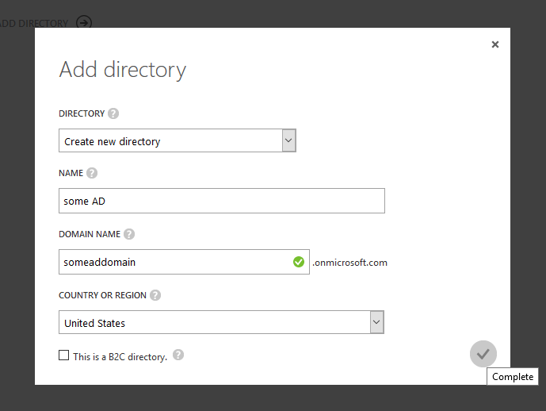

5. Choose the desired directory.
6. On the top menu, choose **Applications**. Then choose Show **Applications my company owns** and click the Check mark button at the right of the search bar.

    

7.  If no apps have been added to your directory, this page will only show the Add an App link. Click on the link, or alternatively you can choose the **Add** button on the command bar.

    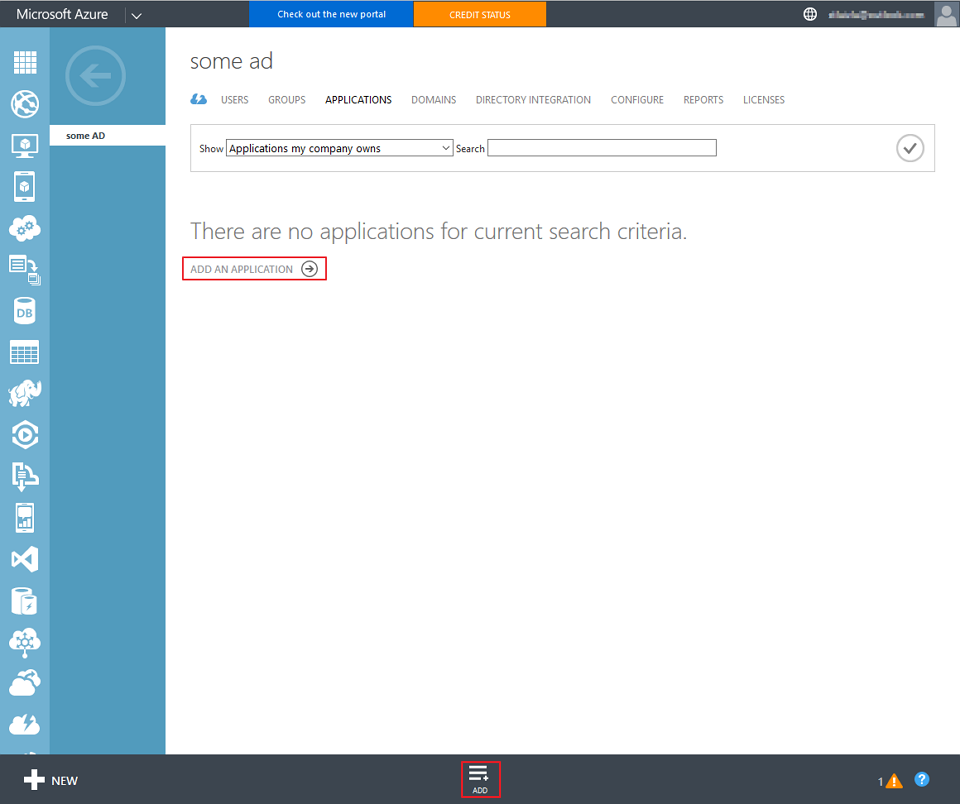

8. On the What do you want to do page, choose on the link to **Add an application my organization is developing**.

    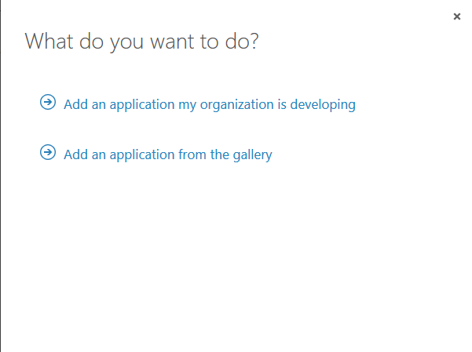

9. On the Tell us about your application page, you must specify a name, and then select **Web application and/or web API**. Then choose the arrow icon on the bottom-right corner of the page.

    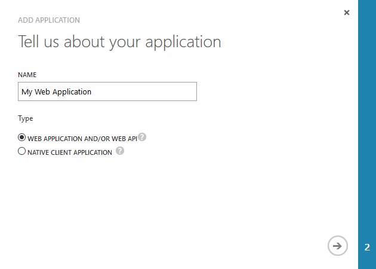

10. On the App properties page, provide the **SIGN-ON URL** and **APP ID URI**, then choose the Check mark button in the bottom right corner of the page.

    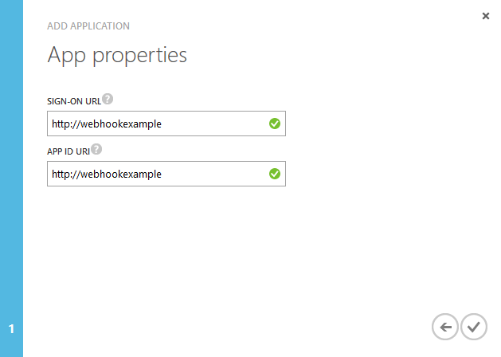
 
11. Your application has been added, and you will be taken to the Quick Start page for your application.
12. On the top menu, choose **Configure**.
13. Enter the following endpoint as the **Reply URL** for the app.

	````
	https://www.getpostman.com/oauth2/callback
	````
	
	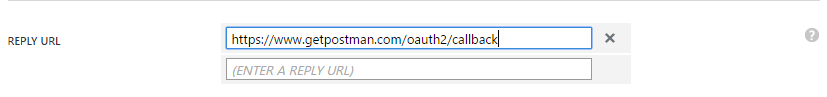

14. In the **permissions to other applications** section, choose the **Add application** button.

	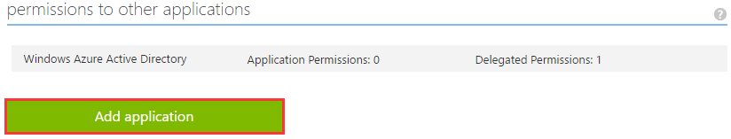
	
15. On the Permissions to other applications page, add **Office 365 SharePoint Online**, then choose the check mark button in the bottom right corner of the page.

	

16. Set the **read and write items and lists in all site collections** permission to **Office 365 SharePoint Online** application.

	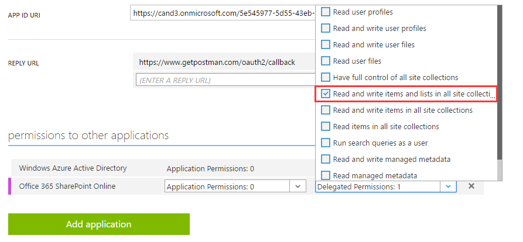

17. In the **Keys** section, select **1 year** as the duration.

	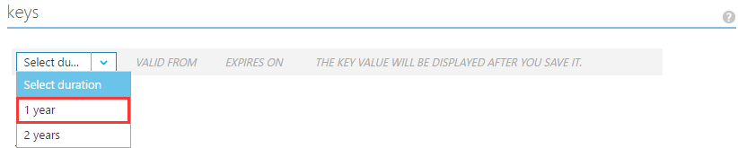

18. Choose the **Save** button on the bottom bar.
19. Once saved, copy the **key value** and **client id** and save them.  You will use them in subsequent steps.

	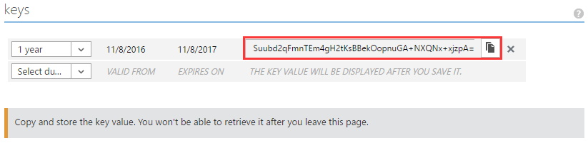

	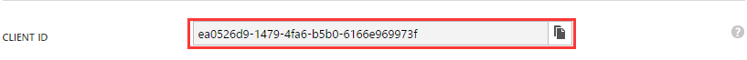


## Step 2: Build a webhook receiver

This example uses the Visual Studio Web API project to build the webhook receiver.

### Create a new ASP.NET Web API project

1. Open Visual Studio.
2. Choose **File > New > Project**.
3. In the left pane, select **Installed > Templates > Visual C# > Web**. 
4. In the list of project templates, select **ASP.NET Web Application**.
5. Name the project **SPWebhooksReceiver** and choose **OK**.

	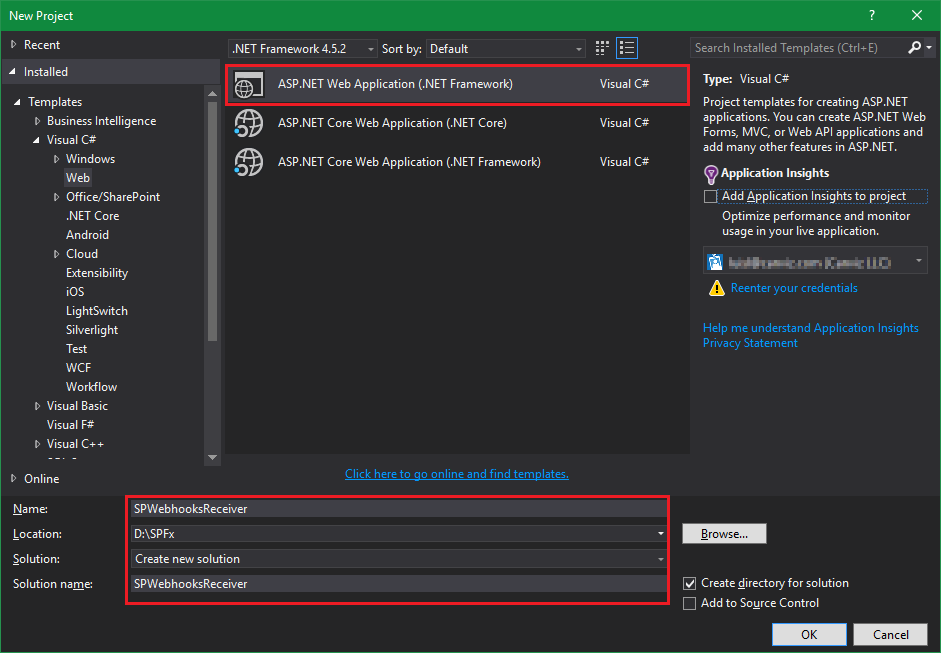

6. In the **New ASP.NET Project** dialog, select the **Web API** template from the **ASP.NET 4.5.X** group.

	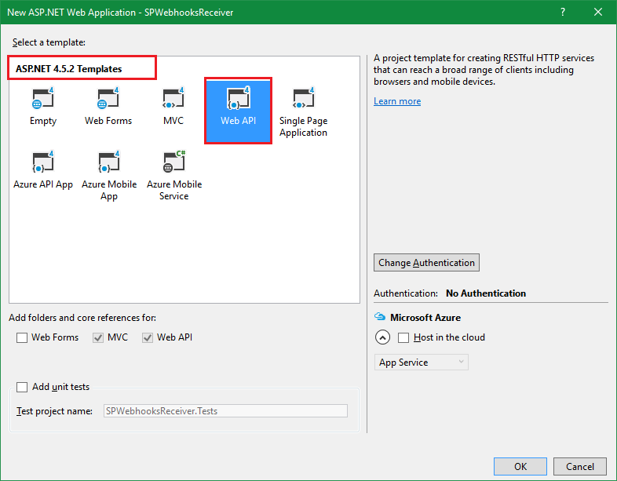
 
7. Choose the **Change Authentication** button.
8. Select the **No Authentication** radio button.
9. Choose **OK**.

	

> **Note:** You can un-check the **Host in the cloud** option because this project will not be deployed to the cloud.

8. Choose **OK** to create the Web API project.

Visual Studio will create the project.

### Webhook receiver

#### Install Nuget packages

Use ASP.NET Web API Tracing to log the requests coming from SharePoint. The following steps install the tracing package:

1. Go to the **Solution Explorer** in Visual Studio.
2. Right-click the **SPWebhooksReceiver** project and choose **Manage Nuget Packages...**.
3. Choose the **Browse** tab.
3. In the search box, enter **Microsoft.AspNet.WebApi.Tracing**. 
4. In the search results, select the **Microsoft.AspNet.WebApi.Tracing** package and choose **Install** to install the package.
5. Choose **I Accept**

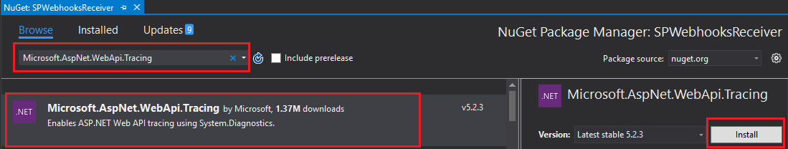

#### SPWebhookNotification model

Each notification generated by the service is serialized into a **webhookNotifiation** instance. You need to build a simple model that represents this notification instance.

1. Go to **Solution Explorer** in Visual Studio.
2. Right-click the **Models** folder and choose **Add -> Class**.
3. Enter **SPWebhookNotification** as the class name and choose **Add** to add the class to your project.
4. Add the following code to the body of the **SPWebhookNotification** class:

	```cs
	public string SubscriptionId { get; set; }

	public string ClientState { get; set; }

	public string ExpirationDateTime { get; set; }

	public string Resource { get; set; }

	public string TenantId { get; set; }

	public string SiteUrl { get; set; }

	public string WebId { get; set; }
	```

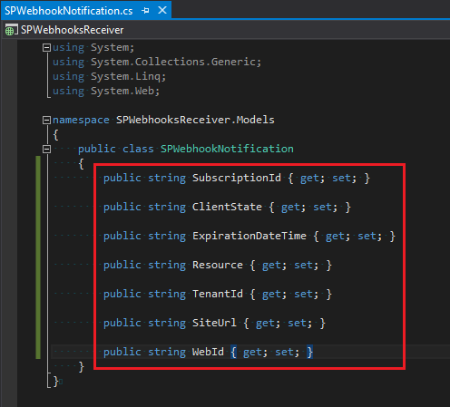

#### SPWebhookContent model

Because multiple notifications can be submitted to your webhook receiver in a single request, they are combined together in an object with a single array value. Build a simple model that represents the array.

1. Go to **Solution Explorer** in Visual Studio.
2. Right-click the **Models** folder and choose **Add -> Class**.
3. Enter **SPWebhookContent** as the class name and choose **Add** to add the class to your project.
4. Add the following code to the body of the **SPWebhookContent** class:

	```cs
	 public List<SPWebhookNotification> Value { get; set; }
	```

#### SharePoint webhook client state

Webhooks provide the ability to use an optional string value that is passed back in the notification message for your subscription. This can be used to verify that the request is indeed coming from the source you trust, which in this case is SharePoint. 

Add a client state value with which the application can verify the incoming requests.

1. Go to **Solution Explorer** in Visual Studio.
2. Open the **web.config** file and add the following key as the client state to the `<appSettings>` section:

	```xml
	<add key="webhookclientstate" value="A0A354EC-97D4-4D83-9DDB-144077ADB449"/>
	```

	

#### Enable tracing

In the **web.config** file, add the following key to the `<system.web>` section:

```xml
<trace enabled="true"/>
```

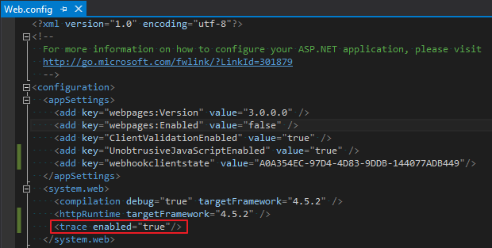

Add a trace writer to the controller configuration (in this case use the one from **System.Diagnostics**).

1. Go to **Solution Explorer** in Visual Studio.
2. In the **App_Start** folder, open the **WebApiConfig.cs** file.
3. Add the following line inside the **Register** method:

	```cs
	config.EnableSystemDiagnosticsTracing();
	```

	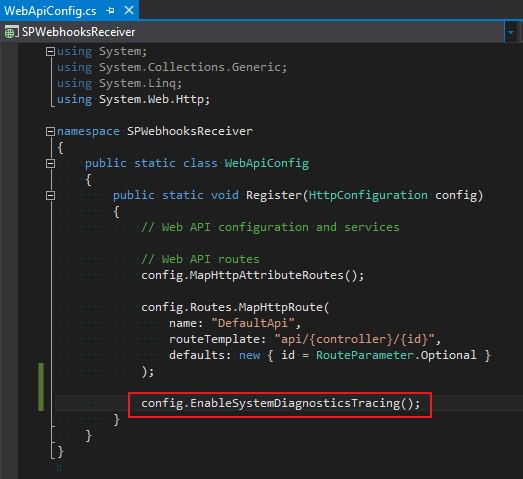

#### SharePoint webhook controller

Now build the webhook receiver controller that will handle the incoming requests from SharePoint and take action accordingly.

1. Go to **Solution Explorer** in Visual Studio.
2. Right-click the **Controllers** folder and choose **Add -> Controller**.
3. In the **Add Scaffold** dialog, select **Web API 2 Controller - Empty**.

	

4. Choose **Add**.
5. Name the controller **SPWebhookController** and choose **Add** to add the API controller to your project.
6. Replace the `using` statements with the following code.

	```cs
	using Newtonsoft.Json;
	using SPWebhooksReceiver.Models;
	using System.Collections.Generic;
	using System.Configuration;
	using System.Linq;
	using System.Net;
	using System.Net.Http;
	using System.Threading.Tasks;
	using System.Web;
	using System.Web.Http;
	using System.Web.Http.Tracing;
	```

	

7. Add the following code in the **SPWebhookController** class.

	> **Note**: The **HandleRequest** method handles the request when SharePoints send HTTP POST notifications. The method parses the data and logs information about the notification.
	
	```cs
	[HttpPost]
	public HttpResponseMessage HandleRequest()
	{
	    HttpResponseMessage httpResponse = new HttpResponseMessage(HttpStatusCode.BadRequest);
	    var traceWriter = Configuration.Services.GetTraceWriter();
	    string validationToken = string.Empty;
	    IEnumerable<string> clientStateHeader = new List<string>();
	    string webhookClientState = ConfigurationManager.AppSettings["webhookclientstate"].ToString();

	    if (Request.Headers.TryGetValues("ClientState", out clientStateHeader))
	    {
	        string clientStateHeaderValue = clientStateHeader.FirstOrDefault() ?? string.Empty;

	        if (!string.IsNullOrEmpty(clientStateHeaderValue) && clientStateHeaderValue.Equals(webhookClientState))
	        {
	            traceWriter.Trace(Request, "SPWebhooks", 
	                TraceLevel.Info, 
	                string.Format("Received client state: {0}", clientStateHeaderValue));

	            var queryStringParams = HttpUtility.ParseQueryString(Request.RequestUri.Query);

	            if (queryStringParams.AllKeys.Contains("validationtoken"))
	            {
	                httpResponse = new HttpResponseMessage(HttpStatusCode.OK);
	                validationToken = queryStringParams.GetValues("validationtoken")[0].ToString();
	                httpResponse.Content = new StringContent(validationToken);

	                traceWriter.Trace(Request, "SPWebhooks", 
	                    TraceLevel.Info, 
	                    string.Format("Received validation token: {0}", validationToken));                        
	                return httpResponse;
	            }
	            else
	            {
	                var requestContent = Request.Content.ReadAsStringAsync().Result;

	                if (!string.IsNullOrEmpty(requestContent))
	                {
	                    SPWebhookNotification notification = null;

	                    try
	                    {
	                        var objNotification = JsonConvert.DeserializeObject<SPWebhookContent>(requestContent);
	                        notification = objNotification.Value[0];
	                    }
	                    catch (JsonException ex)
	                    {
	                        traceWriter.Trace(Request, "SPWebhooks", 
	                            TraceLevel.Error, 
	                            string.Format("JSON deserialization error: {0}", ex.InnerException));
	                        return httpResponse;
	                    }

	                    if (notification != null)
	                    {
	                        Task.Factory.StartNew(() =>
	                        {
	                             //handle the notification here
	                             //you can send this to an Azure queue to be processed later
	                            //for this sample, we just log to the trace

	                            traceWriter.Trace(Request, "SPWebhook Notification", 
	                                TraceLevel.Info, string.Format("Resource: {0}", notification.Resource));
	                            traceWriter.Trace(Request, "SPWebhook Notification", 
	                                TraceLevel.Info, string.Format("SubscriptionId: {0}", notification.SubscriptionId));
	                            traceWriter.Trace(Request, "SPWebhook Notification", 
	                                TraceLevel.Info, string.Format("TenantId: {0}", notification.TenantId));
	                            traceWriter.Trace(Request, "SPWebhook Notification", 
	                                TraceLevel.Info, string.Format("SiteUrl: {0}", notification.SiteUrl));
	                            traceWriter.Trace(Request, "SPWebhook Notification", 
	                                TraceLevel.Info, string.Format("WebId: {0}", notification.WebId));
	                            traceWriter.Trace(Request, "SPWebhook Notification", 
	                                TraceLevel.Info, string.Format("ExpirationDateTime: {0}", notification.ExpirationDateTime));

	                        });

	                        httpResponse = new HttpResponseMessage(HttpStatusCode.OK);
	                    }
	                }
	            }
	        }
	        else
	        {
	            httpResponse = new HttpResponseMessage(HttpStatusCode.Forbidden);
	        }
	    }

	    return httpResponse;
	}
	```

	

8. Save the file.


## Step 3: Debug the webhook receiver

1. Remain in Visual Studio.
2. Choose **F5** to debug the webhook receiver.
3. When you have the browser open, copy the port number from the address bar. For example: **http://localhost:<_port-number_>**.

	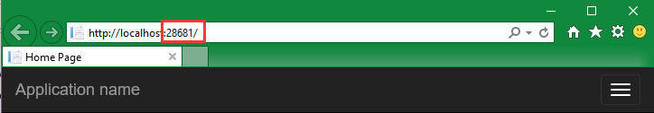


## Step 4: Run ngrok proxy

1. Open a **Command Prompt** window.
2. Change to the **ngrok directory** you downloaded.

	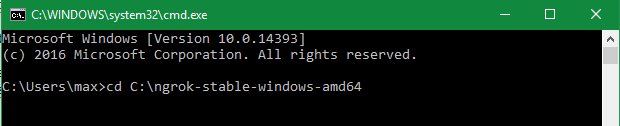

3. Enter the following command and replace the **port-number** placeholders with the port number you copied in previous steps, then press **Enter**.

	````
	ngrok http <port-number> --host-header=localhost:<port-number>
	````

	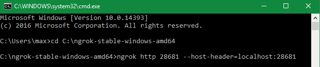	

4. Observe ngrok running.

	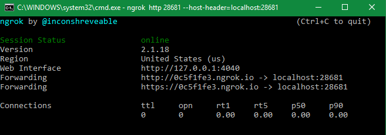

5. Copy the **Forwarding** HTTPS address. You will use this address as the service proxy for SharePoint to send requests. 

## Step 5: Add a webhook subscription to SharePoint using Postman

### Get a new access token

Postman makes it really simple to work with APIs. The first step is to configure Postman to authenticate with Azure AD so you can send API requests to SharePoint. You will use the Azure AD app that you registered in Step 1.

1. Open Postman.
2. Choose the **Authorization** tab in the **Request Editor**.

	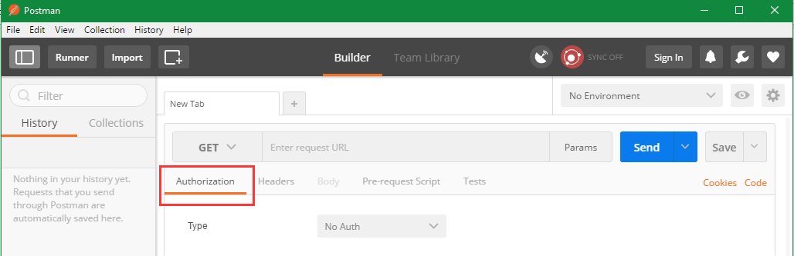

3. Choose **OAuth 2.0** in the **Type** dropdown list.

	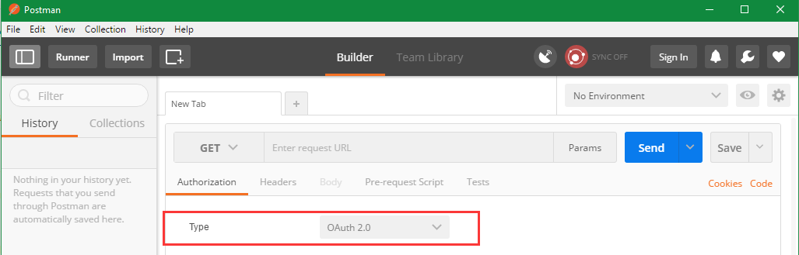

4. Choose the **Get New Access Token** button.

	

5. In the Get New Access Token dialog, enter the following: 
    * Auth URL: 
       * **https://login.microsoftonline.com/common/oauth2/authorize?resource=https%3A%2F%2F<_your-sharepoint-root-site-collection-url-without-https_>**
       * Replace _your-sharepoint-root-site-collection-url-without-https_ with your site collection without the **https** prefix. 
	   
		> **Note**: If your site collection url is https://yourtenant.sharepoint.com/sites/dev, the **Auth URL** should be **https://login.microsoftonline.com/common/oauth2/authorize?resource=https%3A%2F%2Fyourtenant.sharepoint.com**
       
    * Access Token URL:
        * **https://login.microsoftonline.com/common/oauth2/token**
    * Client Id:
        * **Client Id** of the app you registered previously in **Step 1**.
    * Client Secret:
        * **Key value** of the app you registered previously in **Step 1**.
    * Token name:
        * sp_webhooks_token
    * Grant type:
        * Authorization Code
    * Request access token locally:
		* Checked
	    
6. Choose the **Request Token** to sign in, consent, and get the token for the session.
7. When the token is successfully retrieved, you should see **sp_webhooks_token** variable added to the **Authorization** tab.

	


### Get the Documents library list Id

In this example you will manage the webhooks for the default document library provisioned in your default site collection with the name **Documents**.

1. Change the request method to **GET** and then enter the following request URL.

	```
	https://site-collection/_api/web/lists/getbytitle('Documents')?$select=Title,Id
	```

	> **Note**: Replace the **_site-collection_** placeholder with your site collection. 

2. Double-click the **sp_webhooks_token** variable, select add token to **Header**, then choose **Use Token**.

	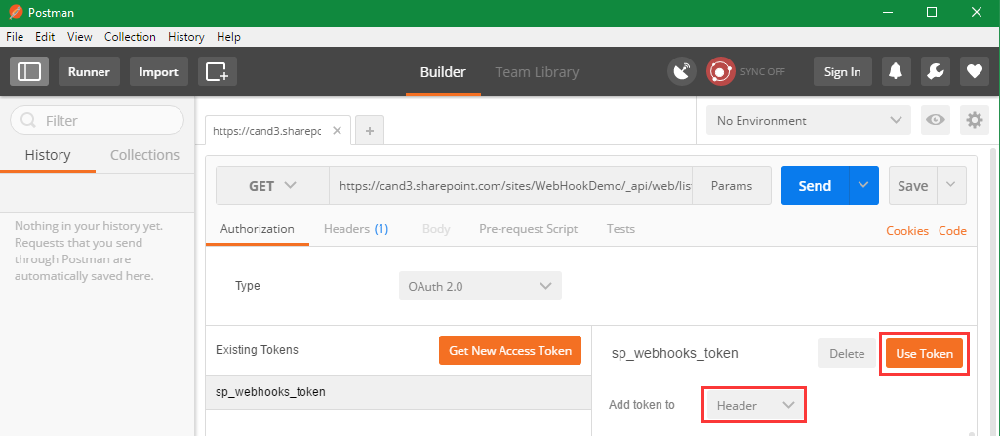

	> **Note**: After youy choose **Use Token**, the token is added to the request header.
	>  
	>   
	
3. Choose the **Send** button.

	
	 
	Postman executes the request, and displays the response.
	 
	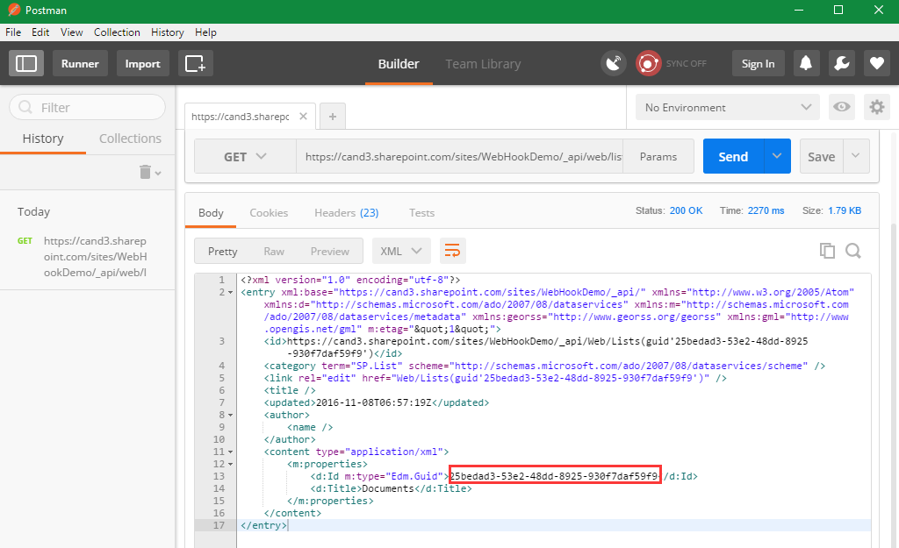 
	
4. Copy the **Id** value from the response. You will use the **Id** in subsequent steps to make webhook requests.

### Add webhook subscription

Now that you have the document library list Id, construct the query and the request to add a webhook subscription to the document library. Use the request editor for the following steps:

1. Change the request to **POST**.
2. Enter the following request URL:

	```
	https://site-collection/_api/web/lists('list-id')/subscriptions
	```

	> **Note**: Replace the **_site-collection_** placeholder with your site collection, and replace the **list-id** placeholder with the Id you copied in the previous step.

3. Go to the **Headers** tab.
4. Make sure you still have the **Authorization** header. If not, you will need to request a new access token.

	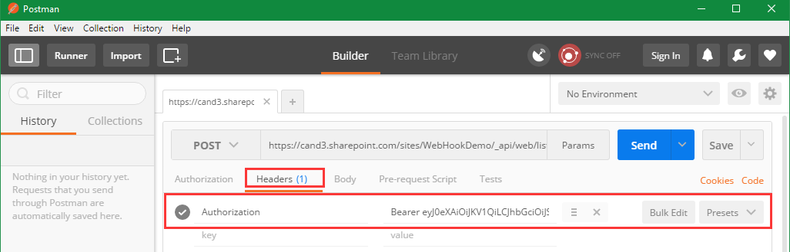

5. Add the following header **key -> value** pairs:
	* Accept -> application/json;odata=nometadata
	* Content-Type -> application/json

	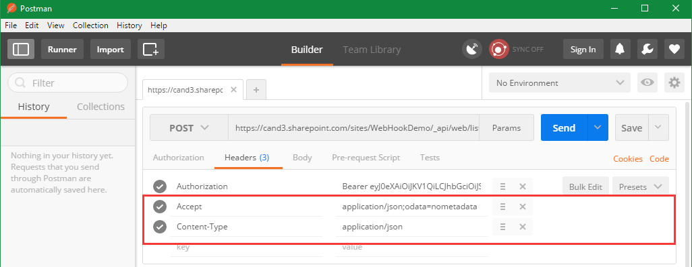

6. Go to the **Body** tab and select **raw** format.

	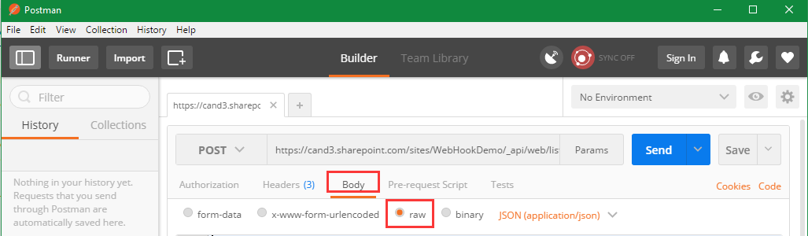

7. Paste the following JSON in the body:

	```json
	{
	  "resource": "https://site-collection/_api/web/lists('list-id')",
	  "notificationUrl": "https://ngrok-forwarding-address/api/spwebhook/handlerequest",
	  "expirationDateTime": "2016-10-27T16:17:57+00:00",
	  "clientState": "A0A354EC-97D4-4D83-9DDB-144077ADB449"
	}
	```

	> **Note**: Replace the **site-collection** placeholder with your site collection.
	> Replace the **list-id** placeholder with the Id you copied in previous step.
	> Replace the **ngrok-forwarding-address** placeholder with the HTTPS address you copied in **Step 4**.
	> 
	> Make sure the expirationDateTime is at most 6 months from today.
	> 
	> Make sure Visual Studio is still debugging the webhook receiver, just like in **Step 4**.
	> 
	> 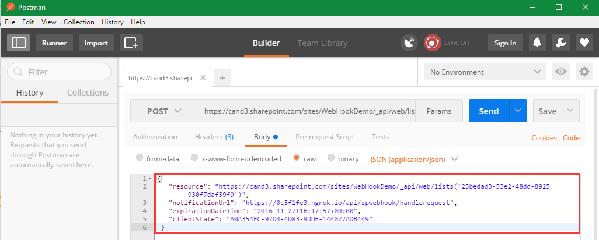

8. Choose **Send** to execute the request that includes the id of the webhook subscription.

	Postman executes the request, and displays the response.

	> 


## Step 6: Test webhook notifications

Now add a file to the Documents library and test if you get a notification from SharePoint in the webhook receiver.

1. Switch to Visual Studio.
2. In the **SPWebhookController** class add a breakpoint on the following line of code:

	```cs
	var requestContent = Request.Content.ReadAsStringAsync().Result;
	```
	>
	> 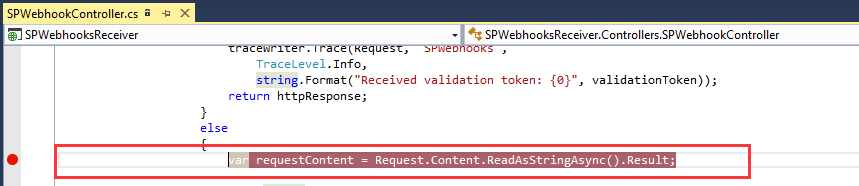

3. In a web browser, open your SharePoint site and go to the **Documents** library.

	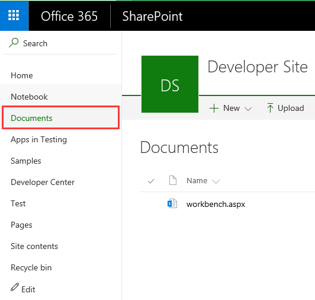

4. Add a new file.
5. Switch to Visual Studio and wait for the breakpoint to be hit.
   
	> **Note**: In preview, the wait time may vary from a few seconds up to five minutes. When the breakpoint is hit, the webhook receiver has just received a notification from SharePoint.
	> 
	> 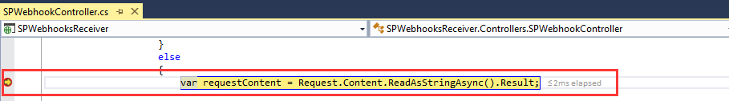
	
6. Choose **F5** to continue.
7. To see the notification data, look in the **Output** window for the following entries:

	


## Contributors
| Roles                                    			| Author(s)                                			|
| -------------------------------------------------	| ------------------------------------------------- |
| Project Lead / Architect / Lab Manuals / Videos | Todd Baginski (Microsoft MVP, Canviz) @tbag		|
| PM / Dev Lead                            			| Alex Chen (Canviz) @alexchx  						|
| Lab Manuals / Source Code                			| Luis Lu (Canviz) @stluislu   						|
| Lab Manuals / Source Code                			| Theodore Shi (Canviz) @TheodoreShi				|
| Lab Manuals / Source Code                			| Max Liu (Canviz) @maxliu0621 						|
| Testing                                  			| Cindy Yan (Canviz) @CindyYan     					|
| Testing                                  			| Melody She (Canviz) @melodyshe   					|
| PM                                       			| John Trivedi (Canviz) @johnt83      				|
| Sponsor / Support                        			| Vesa Juvonen (Microsoft) @VesaJuvonen   			|
| Sponsor / Support                        			| Chakkaradeep Chandran (Microsoft) @chakkaradeep   |
| Sponsor / Support                        			| Mike Ammerlaan (Microsoft) @mammerla         		|
| Sponsor / Support                        			| Rob Howard (Microsoft) @robmhoward      			|

## Version history

| Version | Date          		| Comments        |
| ------- | ------------------- | --------------- |
| 1.0     | November 18, 2016 	| Initial release |

## Disclaimer
**THIS CODE IS PROVIDED *AS IS* WITHOUT WARRANTY OF ANY KIND, EITHER EXPRESS OR IMPLIED, INCLUDING ANY IMPLIED WARRANTIES OF FITNESS FOR A PARTICULAR PURPOSE, MERCHANTABILITY, OR NON-INFRINGEMENT.**
