# Deep Dive of the SharePoint Framework (SPFx) #
In this lab, you will walk through packaging and deploying your web part, debugging your web part with gulp commands, an introduction of the web part project structure, testing your web part in SharePoint, and an introduction to the SPFx Utilities.

## Prerequisites ##
Make sure you have completed the procedures in the following sections of [Getting Started with the SharePoint Framework (SPFx)](../Module-1/Lab.md) module: 
- [Setup development environment](../01%20Getting%20Started%20with%20the%20SharePoint%20Framework/Lab.md#setup-development-environment)
- [Setup Office 365 tenant](../01%20Getting%20Started%20with%20the%20SharePoint%20Framework/Lab.md#setup-office-365-tenant)

## Tools: SharePoint Yeoman generator, gulp, and workbench ##

### Package the HelloWorld web part ###

1. Open a **Command Prompt** window.
2. Change to the **helloworld-webpart** directory created in [Getting Started with the SharePoint Framework (SPFx)](../Module-1/Lab.md).
3. Open the **HelloWorld** web part project in Visual Studio Code, or your preferred IDE.

	> **Note:** If you are using Visual Studio Code, type **code .** and press **Enter**.
	> 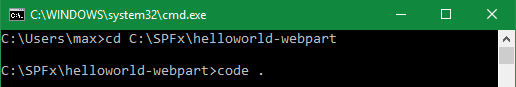
	
4. Open **config/package-solution.json** file.
	
	> **Note:** The **package-solution.json** file defines the package metadata as shown in the following code:
	> ````
	{
	  "solution": {
	    "name": "helloworld-webpart-client-side-solution",
	    "id": "a5921b6b-5b8d-46f4-b3f5-ca95657b2da9",
	    "version": "1.0.0.0"
	  },
	  "paths": {
	    "zippedPackage": "solution/helloworld-webpart.sppkg"
	  }
	}
	> ````
	> 
	> For more information about solution packaging please see [Notes on solution packaging](https://dev.office.com/sharepoint/docs/spfx/web-parts/basics/notes-on-solution-packaging).
	> 
	
5. Switch to **Command Prompt** window and make sure you are still in the **helloworld-webpart** directory.
6. Type **npm install** and press **Enter**.
	
	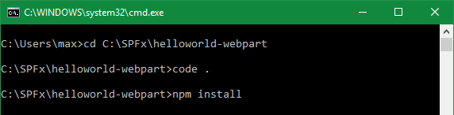

	> **Note:** The command will restore all packages configured for the project.
	
7. Type **gulp bundle** and press **Enter**.
	
	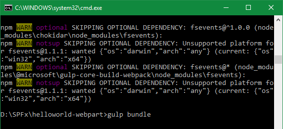

	> **Note:** The command will bundle all the assets of the project to the **dist** folder.
	
8. Type **gulp package-solution** and press **Enter**.
	
	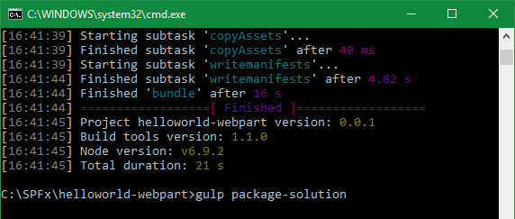
	
	> **Note:** The command will create the package in the **sharepoint** folder.
	> 
	> 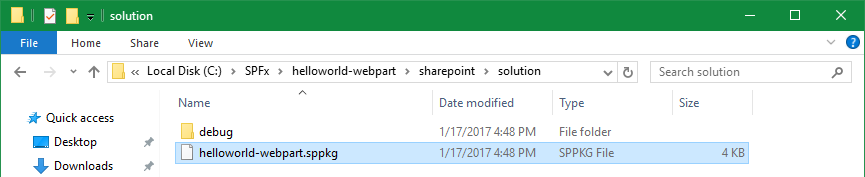
	> 
	> #### Package contents ####
	The package uses a SharePoint Feature to package your web part. By default, the gulp task creates a feature for your web part.
	> 
	> You can view the raw package contents in the **sharepoint** folder.
	> 
	> The contents are then packaged into a **.sppkg** file. The package format is very similar to a SharePoint Add-in package and uses the Microsoft Open Packaging Conventions to package your solution.
	> 
	> **The JavaScript files, CSS and other assets are not packaged and you will have to deploy them to an external location such as a CDN.** In order to test the web part during development, you can load all the assets from your local computer.	

### Deploy the HelloWorld package to the App Catalog ###

1. Go to your site's **App Catalog** by entering [https://yourtenantprefix.sharepoint.com/sites/apps](https://yourtenantprefix.sharepoint.com/sites/apps) in your browser. Replace **yourtenantprefix** with your Office 365 Developer Tenant prefix.
2. Choose **Apps for SharePoint** in the left menu.
3. Choose **Upload** in the top menu.

	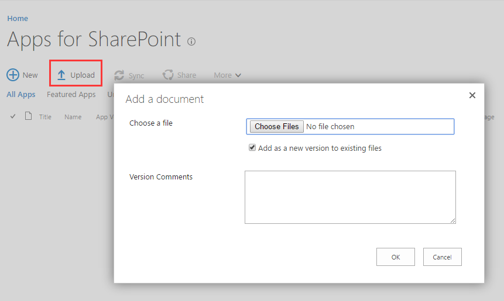

4. Choose **Choose Files**, then select the **helloworld-webpart.sppkg** file, and then choose **OK**.
	
	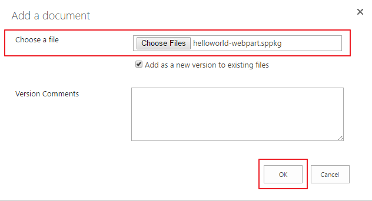
	
5. SharePoint will display a dialog and ask you to trust the client-side solution to deploy.
	
	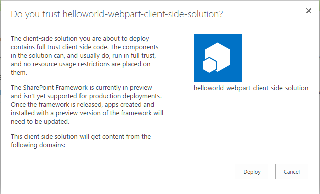
**Do not check Make this solution available to all site in the organization**
6. Choose **Deploy**.


### Install the client-side solution on your team site ###

#### Create a new team site ####

1. Go to the **Site contents** page on your Office 365 Developer Site.
2. Choose the **New** on the top navigation bar, then choose **Subsite**.

	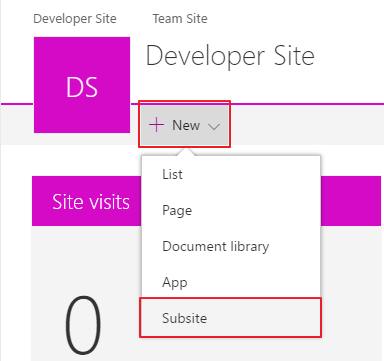

3. Enter **Team Site** as title, enter **teamsite** as site address, select **Team Site** as template, and then choose **Create**.

	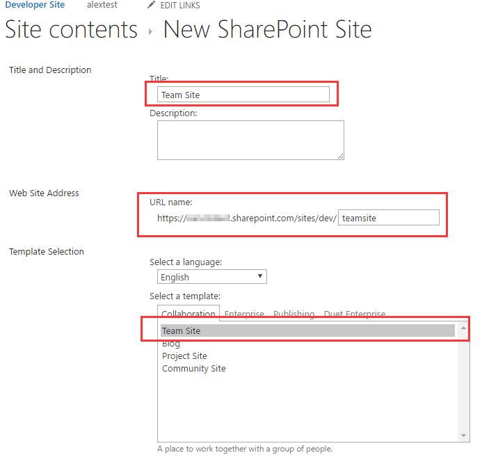


#### Install the client-side solution ####

1. Go to the **site contents** page on your team site.
2. Choose **New** on the top navigation bar, and then choose **App** to go to your Apps page.

	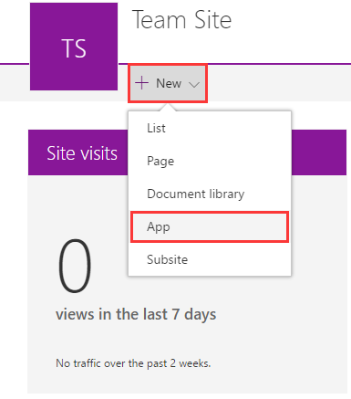
	
3. In the **Search** box, enter **helloworld** and press **Enter** to filter your apps.
4. Choose the **helloworld-webpart-client-side-solution** app to install the app on the team site.
	
	> **Note:** The client-side solution and the web part are installed on your team site. The Site Contents page shows you the installation status of your client-side solutions.
	> 
	> 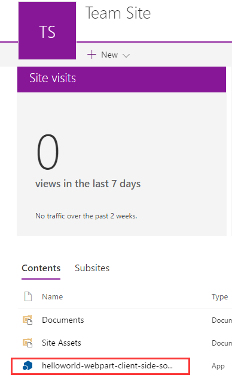 

### SharePoint workbench ###

SharePoint workbench is a developer design surface that enables you to quickly preview and test web parts without deploying them in SharePoint. SharePoint workbench includes the client-side page and the client-side canvas in which you can add, delete, and test your web parts during development.


## Tour of the web part project ##

Switch to Visual Studio Code and make sure you still have the **HelloWorld** project open.
	
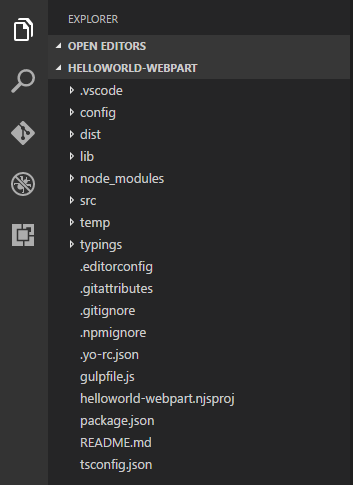

> **Note:** TypeScript is the primary language for building SharePoint client-side web parts. TypeScript is a typed superset of JavaScript that compiles to plain JavaScript. SharePoint client-side development tools are built using TypeScript classes, modules, and interfaces to help developers build robust client-side web parts.

### Top level folders ###

- **.vscode**: includes Visual Studio Code integration files
- **config**: includes all config files
- **dist**: this is created automatically when you build the project - holds debug builds
- **lib**: this is created automatically when you build the project
- **node_modules**: this is created automatically when you build your project, it includes all the npm packages your solution relies upon and their dependencies.
- **src**: this is the main folder of the project, it includes the web part, styles, and a test file.
- **temp**: this is created automatically when you build your project - holds production builds
- **typings**: includes some type definition files. Most type definitions are installed in **node_modules\@types**

### Some of the key files in the project ###

- **src\webparts\helloworld\HelloWorldWebPart.ts**

	**HelloWorldWebPart.ts** defines the main entry point for the web part. The web part class **HelloWorldWebPart** extends the **BaseClientSideWebPart**. Any client-side web part should extend the **BaseClientSideWebPart** class in order to be defined as a valid web part.

	**BaseClientSideWebPart** implements the minimal functionality that is required to build a web part. This class also provides many parameters to validate and access to read-only properties such as **displayMode**, web part properties, web part context, the web part **instanceId**, the web part **domElement** and much more.
	
	Notice that the web part class is defined to accept a property type **IHelloWorldWebPartProps**.
	
	The property type is defined as an interface in a separate file **IHelloWorldWebPartProps.ts**.
	
	````
	export interface IHelloWorldWebPartProps {
	  description: string;
	}
	````

	**Web part render method**
	
	The DOM element where the web part is rendered is available in the **render** method. This method is used to render the web part inside that DOM element. In the **HelloWorld** web part, the DOM element is set to a DIV.
	
	````
	public render(): void {
	  this.domElement.innerHTML = `
	    <div class="${styles.helloWorld}">
	      <div class="${styles.container}">
	        <div class="ms-Grid-row ms-bgColor-themeDark ms-fontColor-white ${styles.row}">
	          <div class="ms-Grid-col ms-u-lg10 ms-u-xl8 ms-u-xlPush2 ms-u-lgPush1">
	            <span class="ms-font-xl ms-fontColor-white">Welcome to SharePoint!</span>
	            <p class="ms-font-l ms-fontColor-white">Customize SharePoint experiences using Web Parts.</p>
	            <p class="ms-font-l ms-fontColor-white">${escape(this.properties.description)}</p>
	            <a href="https://aka.ms/spfx" class="${styles.button}">
	              <span class="${styles.label}">Learn more</span>
	            </a>
	          </div>
	        </div>
	      </div>
	    </div>`;
	}
	````
	
	This model is flexible enough so that web parts can be built in any JavaScript framework and loaded into the DOM element. The following is an example of how you would load a React component instead of plain HTML.
	
	````
	render(): void {
	    let e = React.createElement(TodoComponent, this.properties);
	    ReactDom.render(e, this.domElement);
	}
	````

- **src\webparts\helloworld\IHelloWorldWebPartProps.ts**

	IHelloWorldWebPartProps.ts defines the interface for moving properties between different classes in the web part.
	
- **src\webparts\helloworld\HelloWorldWebPart.manifest.json**
	
	The **HelloWorldWebPart.manifest.json** file defines the web part metadata such as version, id, componentType, manifestVersion, and description. Every web part should contain this manifest.

	````
	{
	  "$schema": "../../../node_modules/@microsoft/sp-module-interfaces/lib/manifestSchemas/jsonSchemas/clientSideComponentManifestSchema.json",
	
	  "id": "1647bc3f-2b07-4927-aea2-95a3cda2082b",
	  "alias": "HelloWorldWebPart",
	  "componentType": "WebPart",
	  "version": "0.0.1",
	  "manifestVersion": 2,
	
	  "preconfiguredEntries": [{
	    "groupId": "1647bc3f-2b07-4927-aea2-95a3cda2082b",
	    "group": { "default": "Under Development" },
	    "title": { "default": "HelloWorld" },
	    "description": { "default": "HelloWorld description" },
	    "officeFabricIconFontName": "Page",
	    "properties": {
	      "description": "HelloWorld"
	    }
	  }]
	}
	````

- **src\webparts\helloworld\HelloWorld.module.scss**

	HelloWorld.module.scss is the SCSS file that defines styles. 

- **src\webparts\helloworld\HelloWorld.module.scss.ts**

	HelloWorld.module.scss.ts is the typescript file that includes the corresponding typings of **HelloWorld.module.scss**, you can then import and reference these styles in your web part code.

- **config\config.json** 

	This file contains information about your bundle(s) and any external dependencies.
 
	- The entries section contains the default bundle information.
	- The externals section contains the libraries that are not bundled with the default bundle.

## Testing the HelloWorld web part in SharePoint ##

### Prerequisites ###
Run **gulp trust-dev-cert** to install and trust a developer certificate on your machine (optional, but recommended. You only need to do this once per machine, not once per project).
> **Note**: If you didn't install it, please install it on your machine.
> 1. Open a **Command Prompt** window and change to the **helloworld-webpart** directory.
> 2. Type **gulp trust-dev-cert** and press **Enter**.

Make sure the **SharePoint workbench** is running locally.

> **Note**: if it is not running, please build and run it on a local web server.
> 1. Open a **Command Prompt** window and change to the **helloworld-webpart** directory.
> 2. Type **gulp serve** and press **Enter**.
> 3. Mozilla Firefox doesn't trust self-signed certificate. If you're using Mozilla Firefox, you will need to choose **Advanced** and add an exception to proceed to the website.

### Testing in the SharePoint workbench ###
The SharePoint workbench is also hosted in SharePoint to preview and test your local web parts in development. The key advantage is that by running in SharePoint the context is available and you are able to interact with SharePoint data.

1. Open your browser and go to the **workbench.aspx** page on your Office 365 Developer Site.

	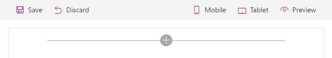

2. Choose **add icon** and then choose **HelloWorld** web part.
	
	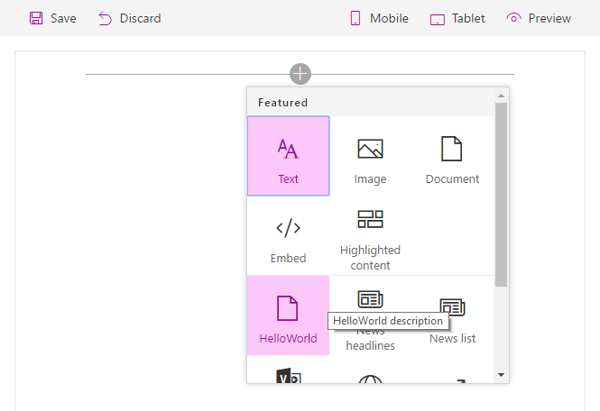

3. Now you're running your web part in the workbench page hosted in SharePoint!

	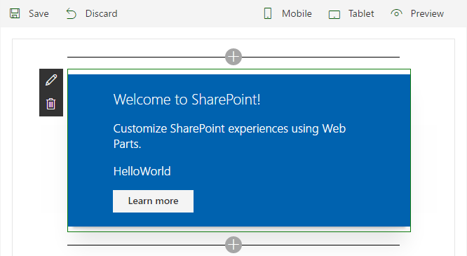


### Testing in a classic SharePoint page ###

1. Make sure you have completed the all steps in the section of **Tools: SharePoint Yeoman generator, gulp, and workbench** above.
2. Open your browser and go to the **site contents** page on your team site.
3. Choose the **Site Pages** library icon to go to the **Site Pages** library.
4. Choose **New** and then choose **Wiki Page** to create a classic SharePoint page.

	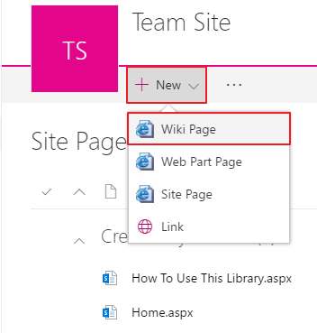

5. Enter **ClassicPage** as the page name.
6. Choose the **Create** button to create the web part page. SharePoint will create your page.
7. In the **ribbon**, choose **Insert** and then choose **Web Part** to open the Web Part Gallery.
8. In the Web Part Gallery, choose the category **Under Development**.
9. Select the **Hello World** web part and choose **Add** to add it to the page.
	
	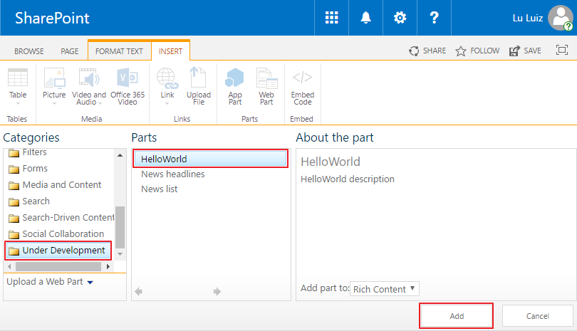

	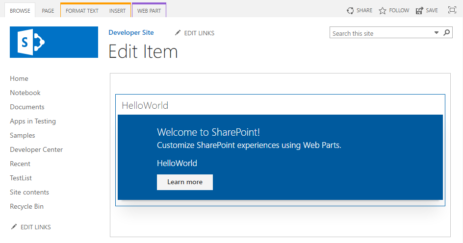

### Testing in a modern SharePoint page ###

1. Make sure you have completed the all steps in the section of **Tools: SharePoint Yeoman generator, gulp, and workbench** above.
2. Open your browser and go to the **site contents** page on your team site.
3. Choose the **gear** icon on the upper-right, and then choose **Add a page**

	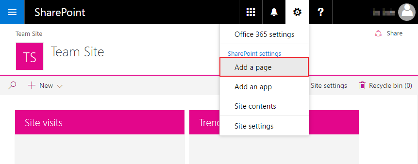

4. Enter **ModernPage** as the page name.

	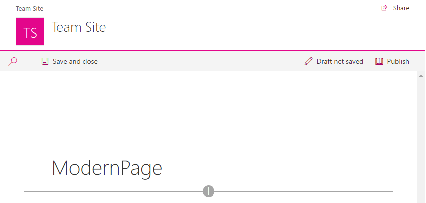

5. Choose the **add icon** and then choose **HelloWorld** web part.

	
	
	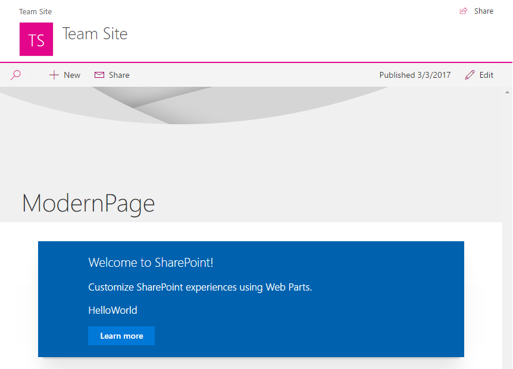

## SPFx Utilities ##
This section showcases some of the SharePoint Framework developer features, utilities, and best practices.

### Status Renderers ###
SharePoint Framework provides status renderers to use when the web part is loading information from SharePoint or to display errors if the web part runs into issues that could prevent it from working properly.

**Loading indicator**
- Used to display the loading indicator. Useful when you are initializing or loading any content in your web part.

**Error indicator**
- Used to display error messages. 


1. Open a **Command Prompt** window.
2. Change to the **helloworld-webpart** directory created in [Getting Started with the SharePoint Framework (SPFx)](../Module-1/Lab.md).
3. Open the **HelloWorld** web part project in Visual Studio Code, or your preferred IDE.

	> **Note:** If you are using Visual Studio Code, type **code .** and press **Enter**.
	> 

4. Open the **HelloWorldWebPart.ts** file.
5. Replace the **render** method with the following code.

	````
	public render(): void {
	  this.context.statusRenderer.displayLoadingIndicator(this.domElement, "message");
	  setTimeout(() => {
	    this.context.statusRenderer.clearLoadingIndicator(this.domElement);
	    try {
	        throw new Error("Error message");
	    } catch(err) {
	      this.context.statusRenderer.renderError(this.domElement, err);
	      setTimeout(() => {
	        this.context.statusRenderer.clearError(this.domElement);
	        this.domElement.innerHTML = `
	          <div class="${styles.helloWorld}">
	            <div class="${styles.container}">
	              <div class="ms-Grid-row ms-bgColor-themeDark ms-fontColor-white ${styles.row}">
	                <div class="ms-Grid-col ms-u-lg10 ms-u-xl8 ms-u-xlPush2 ms-u-lgPush1">
	                  <span class="ms-font-xl ms-fontColor-white">Welcome to SharePoint!</span>
	                  <p class="ms-font-l ms-fontColor-white">Customize SharePoint experiences using Web Parts.</p>
	                  <p class="ms-font-l ms-fontColor-white">${escape(this.properties.description)}</p>
	                  <a href="https://aka.ms/spfx" class="${styles.button}">
	                    <span class="${styles.label}">Learn more</span>
	                  </a>
	                </div>
	              </div>
	            </div>
	          </div>`;
	      }, 2000);
	    }
	  }, 2000);
	}
	````
	
	> **Notes:** 
	These JavaScript methods are invoked in the code above.  Here's what they do:
	>
	>To display the loading indicator call **displayLoadingIndicator**.  
	> ````
	> this.context.statusRenderer.displayLoadingIndicator(this.domElement, "message");
	> ````
	To clear the loading indicator when your operation is complete, call **clearLoadingIndicator**.
	> ````
	> this.context.statusRenderer.clearLoadingIndicator(this.domElement);
	> ````
	To throw an error just call **new Error()** with an error message.
	> ````
	> throw new Error("Error message");
	> ````
	To render the error call **renderError**.
	> ````
	> this.context.statusRenderer.renderError(this.domElement, err);
	> ````
	To clear the error call **clearError**
	> ````
	> this.context.statusRenderer.clearError(this.domElement);
	> ````

6. Save the **HelloWorldWebPart.ts** file and preview your web part in the workbench page hosted in SharePoint.

	> **Note:** You will see the web part display the following statuses by refreshing the page containing the web part. You could also preview the web part in the modern page, classic page, or local workbench. 
	> 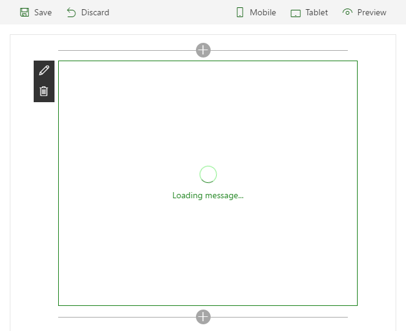
	> 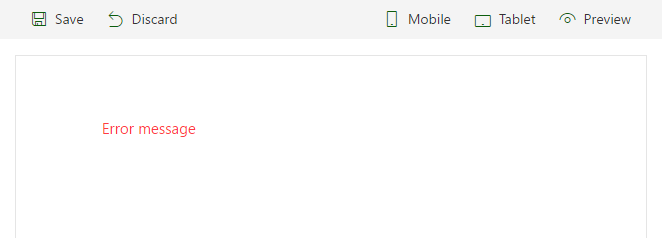
	> 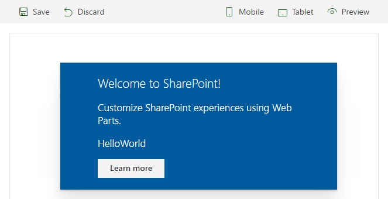

### Lodash Utility Library ###

[Lodash](https://lodash.com/) is a great JavaScript utility library that you can use to perform operations on various objects like arrays, numbers, strings etc., SharePoint Framework includes the  [`lodash` utility library](https://www.npmjs.com/package/@microsoft/sp-lodash-subset) for use with SharePoint Framework out-of-the-box so you do not need to install it separately. To improve run-time performance, it only includes a subset of the most essential lodash functions.

1. Open **HelloWorldWebPart.ts** file.
2. Change the import statement `import { escape } from '@microsoft/sp-lodash-subset';` to the following code to import the **findIndex** function from the **lodash** library:
		
	````
	import { escape, findIndex } from '@microsoft/sp-lodash-subset';
	````

	

	> **Note:** lodash function **escape** is already used in the file. We will demonstrate another lodash function **findIndex**.

3. Define the following interface models above the **HelloWorldWebPart** class.
	
	````
	export interface ISPItem {
	    Title: string;
	    Id: string;
	}
	````
	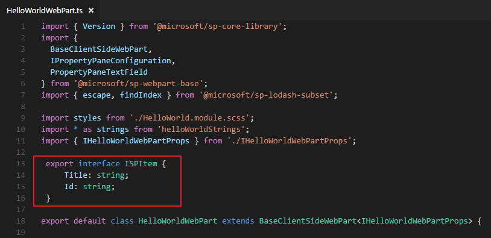

4. Add the following code in the **HelloWorldWebPart** class.
	
	````
	private _spItems: ISPItem[] = [
	    { Title:'Mock Title 1', Id: '1'},
	    { Title:'Mock Title 2', Id: '2'},
	    { Title:'Mock Title 3', Id: '3'},
	    { Title:'Mock Title 4', Id: '4'},
	    { Title:'Mock Title 5', Id: '5'}];
	````
	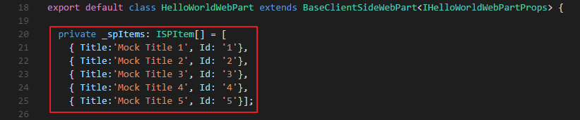

5. Add the following code in the `render` method.

	````
	const index : number = findIndex(
      this._spItems,
      (item: ISPItem) => item.Title === 'Mock Title 3');
	````
	
	````
	<p class="ms-font-l ms-fontColor-white">The index of "Mock Title 3" is: ${index}</p>
	````
	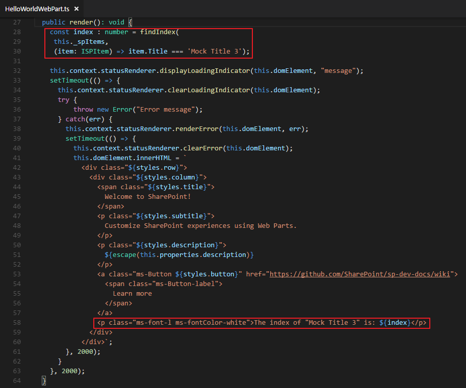

6. Save the **HelloWorldWebPart.ts** file and preview your web part in the workbench in SharePoint.
	
	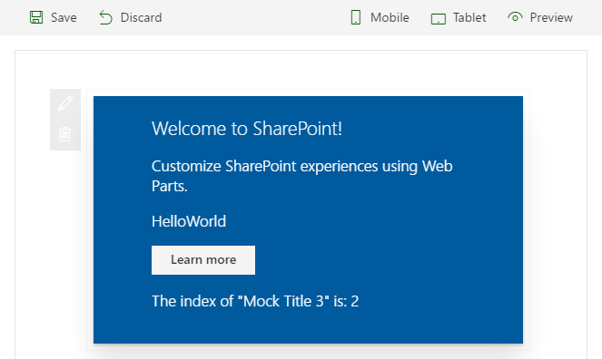

### Page Display Modes ###

SharePoint pages have display modes which indicate in which mode that page and/or its contents (e.g. text and web parts) are displayed. In the classic server-side SharePoint page, the web page and the web part can be in different modes.  For example, the web page can be in edit mode while the web part is not in edit mode.  In the modern client-side SharePoint page, both the page and/or its contents are in the same mode.

1. Open the **HelloWorldWebPart.ts** file.
2. Change the import statement `import { Version } from '@microsoft/sp-core-library';` to the following code to import the **DisplayMode** library:

	````
	import { Version, DisplayMode } from '@microsoft/sp-core-library';
	````

3. Add the following code in the `render` method.

	````
	const pageMode : string = this.displayMode === DisplayMode.Edit ? 'You are in edit mode' : 'You are in read mode';
	````
	
	````
	<p class="ms-font-l ms-fontColor-white">${pageMode}</p>
	````

	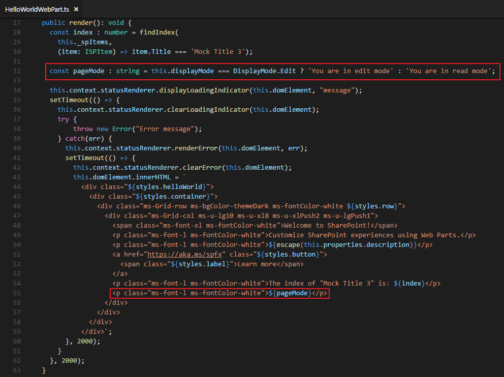

4. Save the **HelloWorldWebPart.ts** file.
5. View the web part in the modern page when the page is not in Edit mode.
	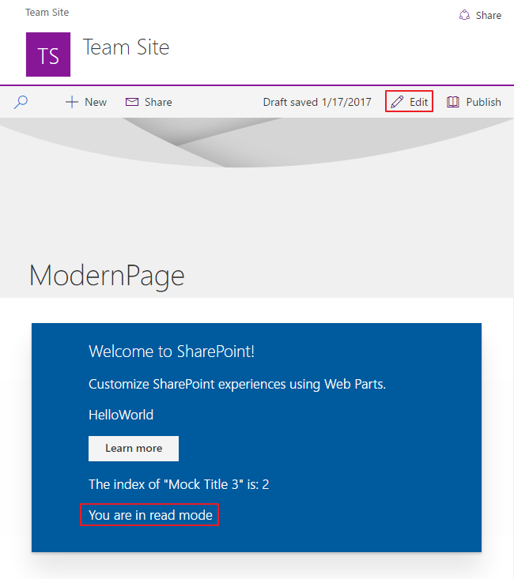 
6. View the web part in the modern page when the page is in Edit mode.	
	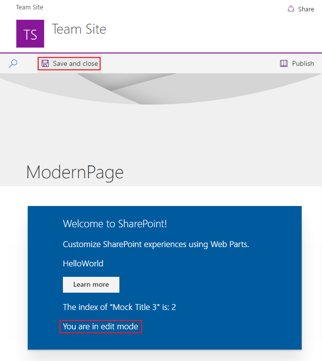
7. View the web part in the classic page when the page is not in Edit mode.
	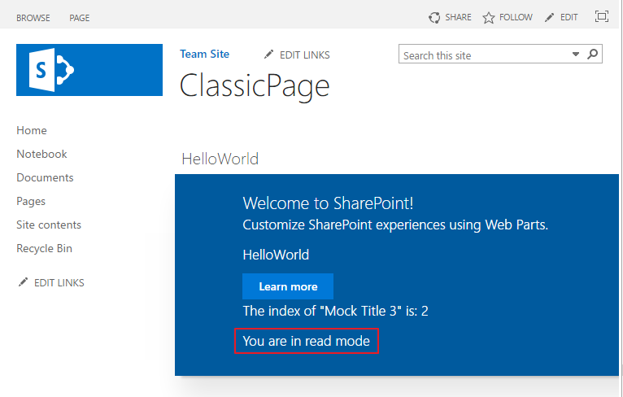 
8. View the web part in the classic page when the page is in Edit mode and the web part is not in Edit mode.	
	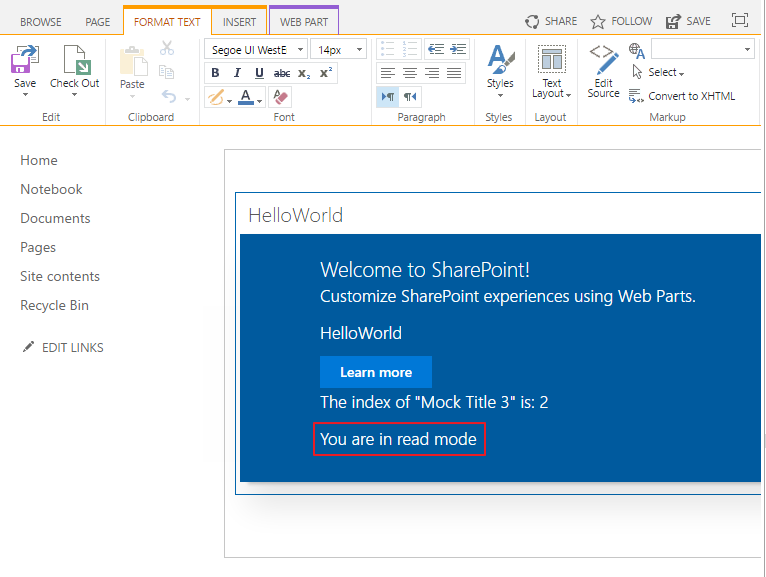
9. View the web part in the classic page when the page is in Edit mode and the web part is in Edit mode.	
	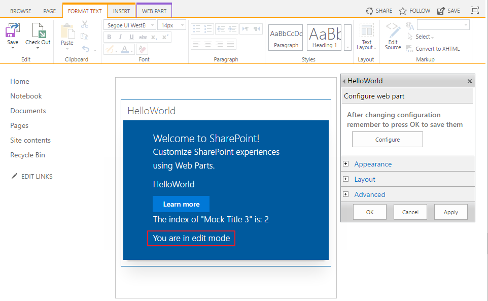	

### Page context ###

When the SharePoint workbench is hosted locally, you do not have the SharePoint page context. However, you can still test your web part in many different ways. For example, you can build the web part's UX and use mock data to simulate SharePoint interaction when you don't have the SharePoint context.

However, when the workbench is hosted in SharePoint, you get access to the page context which provides various key properties, such as:

- Web title
- Web absolute URL
- Web server-relative URL
- User login name

1. Open the **HelloWorldWebPart.ts** file.
2. Add the following code in the `render` method.

	````
	<p class='ms-font-l ms-fontColor-white'>Loading from ${this.context.pageContext.web.title}</p>
	````
	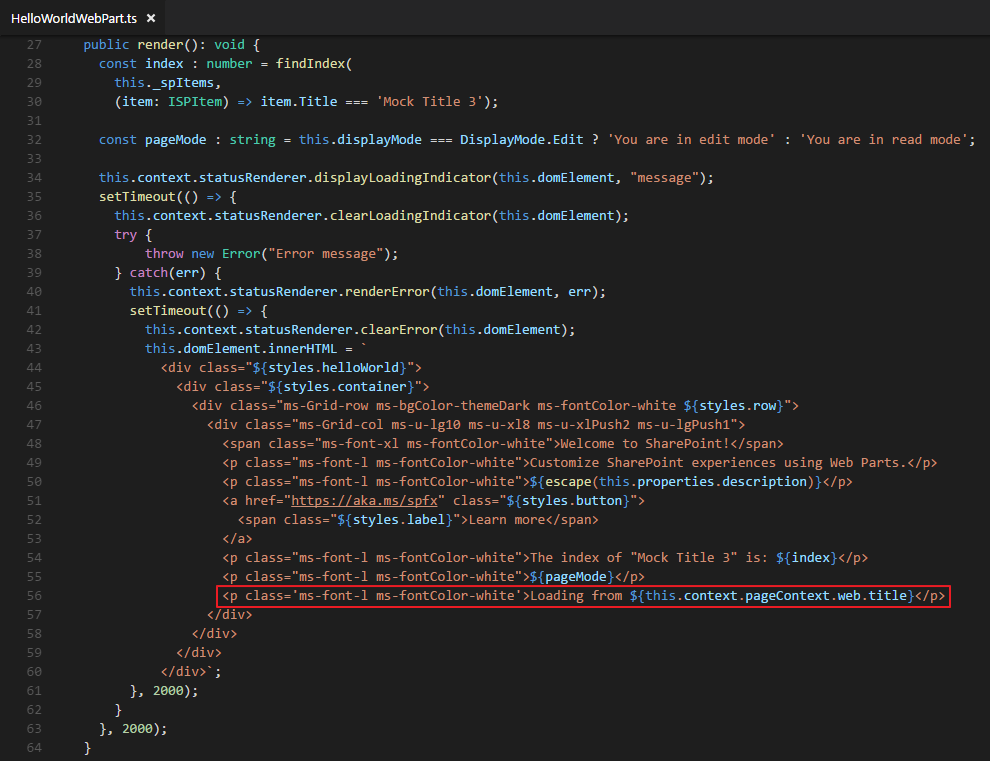

3. Save the **HelloWorldWebPart.ts** file and preview your web part running in the local workbench to see the page context.

	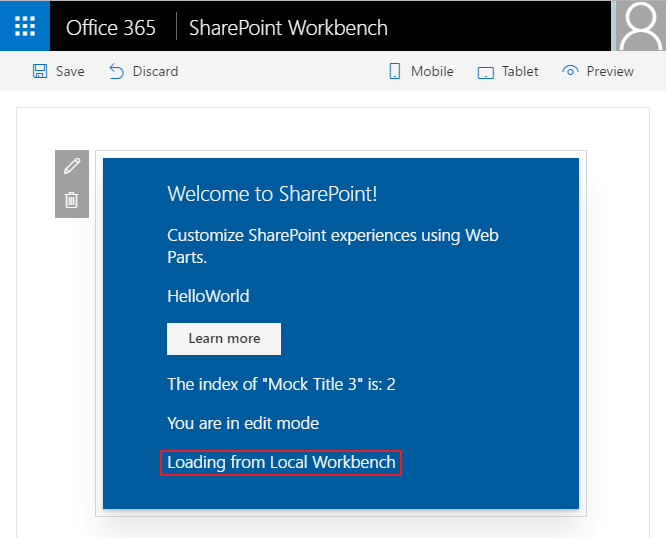

3. Preview your web part in the workbench in SharePoint, a modern page, or a classic page to see the page context.

	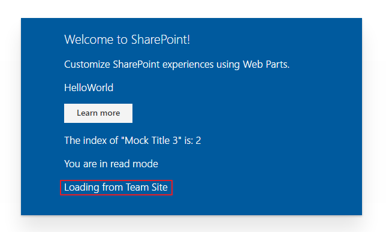

### Environment Type ###

The SharePoint workbench gives you the flexibility to test web parts in your local environment and from a SharePoint site. The EnvironmentType module is used to determine which environment your web part is running in.

1. Open the **HelloWorldWebPart.ts** file.
2. Change the import statement `import { Version, DisplayMode } from '@microsoft/sp-core-library';` to the following code to import the **Environment** and **EnvironmentType** library:

	````
	import { Version, DisplayMode, Environment, EnvironmentType } from '@microsoft/sp-core-library';
	````
	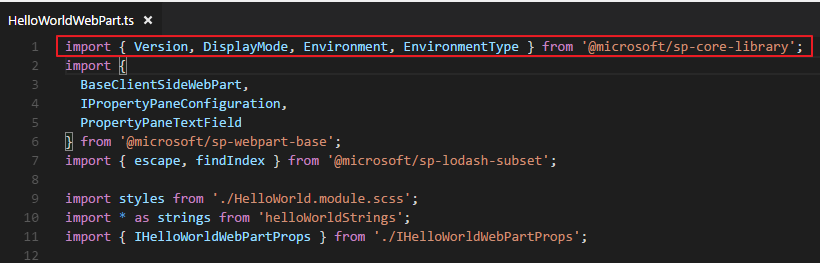

3. Add the following code in the `render` method.

	````
	const environmentType : string = Environment.type === EnvironmentType.Local ? 'You are in local environment' : 'You are in sharepoint environment';
	````
	
	````
	<p class="ms-font-l ms-fontColor-white">${environmentType}</p>
	````
	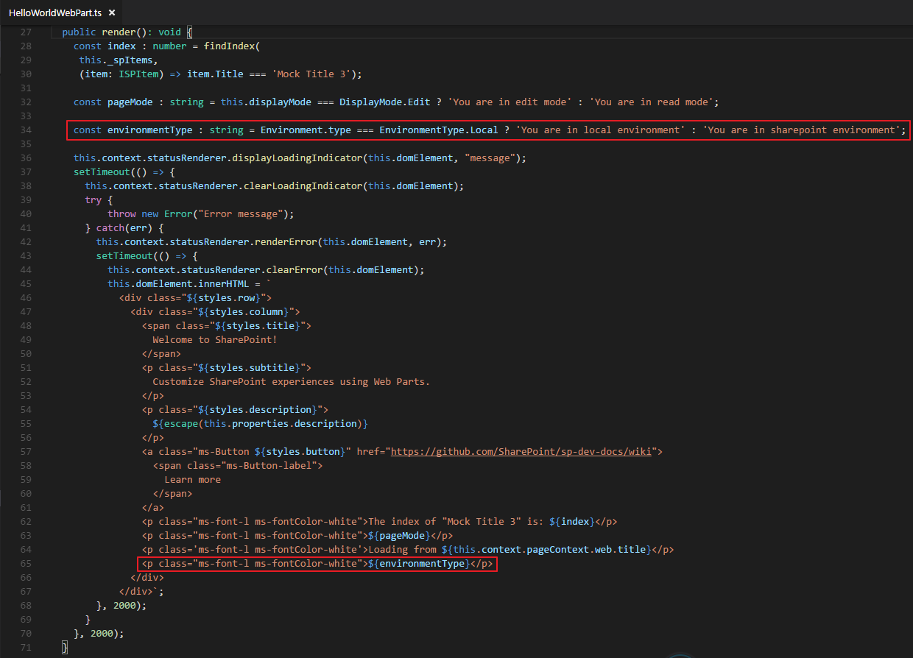

4. Save the **HelloWorldWebPart.ts** file and preview your web part running in the local workbench to see the environment you are running in.
	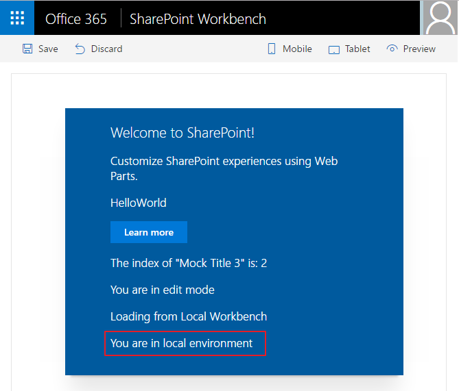

5. Preview your web part running in the workbench in SharePoint to see the environment you are running in.
	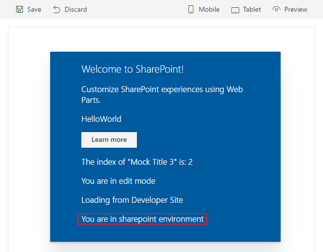

### Logging API ###

Logging is a very convenient and easy way to keep track of events happening in the web part, instead of having breakpoints, or alerts in JavaScript. The SharePoint Framework has a built-in logging mechanism.

1. Open the **HelloWorldWebPart.ts** file.
2. Change the import statement `import { Version, DisplayMode, Environment, EnvironmentType } from '@microsoft/sp-core-library';` to the following code to import the **Log** library:
	
	````
	import { Version, DisplayMode, Environment, EnvironmentType, Log } from '@microsoft/sp-core-library';
	````

	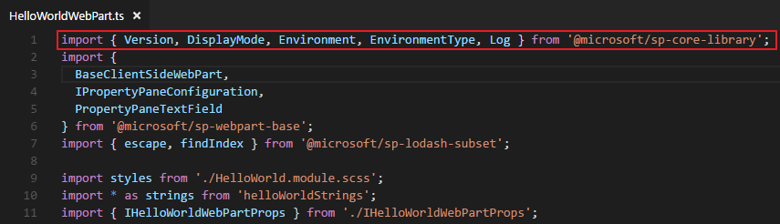	

	> **Note:** The Log class contains four static methods for logging:
	> 
	> - **info** : log information
	> - **warn** : log warnings 
	> - **error** : log errors
	> - **verbose** : log everything
	> 
	> In the SharePoint Framework all logging is done to the JavaScript console and you can see the logging using the developer tools in a web browser.
	> 
	> All static methods have the same signature, except the error method - they take three arguments:
	>
	> - **source**: the source of the logging information (max 20 characters), such as the method or the class name
	> - **message**: the actual message to log (max 100 characters)
	> - **scope**: an optional service scope
	> 
	> The **error** method takes an **Error** object instead of the **message** string, otherwise they are the same. 

3. Add the following code in the `render` method.

	````
	Log.info('HelloWorld', 'message', this.context.serviceScope);
    Log.warn('HelloWorld', 'WARNING message', this.context.serviceScope);
    Log.error('HelloWorld', new Error('Error message'), this.context.serviceScope);
    Log.verbose('HelloWorld', 'VERBOSE message', this.context.serviceScope);
	````

	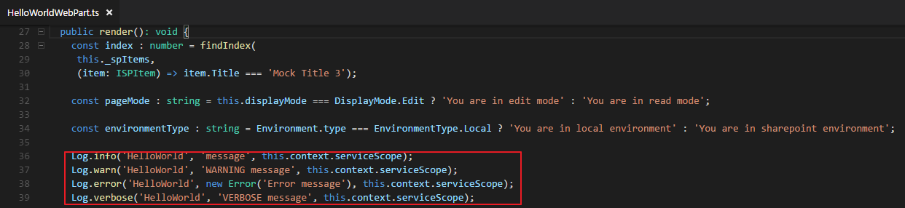

4. Save the **HelloWorldWebPart.ts** file and preview your web part in the local workbench.
5. Open the **Developer tools** and view the log information.

	> **Note**: If you are using **Chrome**, you can press **F12** and then choose the **Console** tab to view the log information.
	
	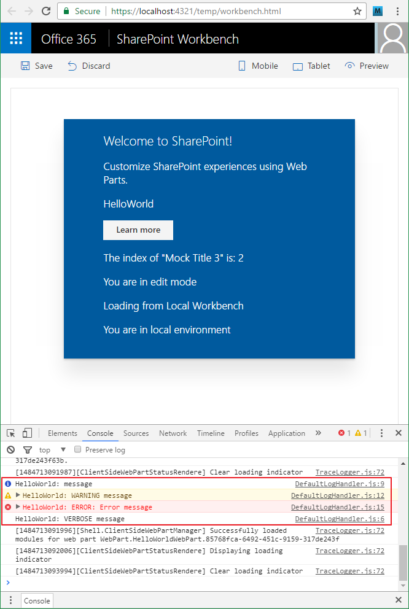
