# Working with SharePoint Content #
In this lab, you will connect your web part to SharePoint to access functionality and data in SharePoint and provide a more integrated experience for end users.

## Prerequisites ##
Make sure you have completed the procedures in the following sections of [Getting Started with the SharePoint Framework (SPFx)](../Module-1/Lab.md) module: 
- [Setup development environment](../Module-1/Lab.md#setup-development-environment)
- [Setup Office 365 tenant](../Module-1/Lab.md#setup-office-365-tenant)

## Exercise 1: Using mocks to simulate SharePoint data ##
In this exercise you will enhance the **HelloWorldReact** web part created in [Getting Started with the SharePoint Framework (SPFx)](../Module-1/Lab.md) to return mock data and render it.

1. Open a **Command Prompt** window.
2. Change to the **helloworld-webpart-react** directory created in [Getting Started with the SharePoint Framework (SPFx)](../Module-1/Lab.md).
3. Open the **HelloWorldReact** web part project in Visual Studio Code, or your preferred IDE.

	>**Note:** To open in Visual Studio code enter **code .** on the command line.

	

4. Create a new file inside the **src\webparts\helloWorldReact** folder named **ISPList.ts**.

	>**Note:** This file is the interface to the SharePoint list used in this exercise.

	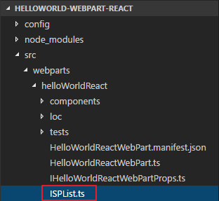

5. Open the **ISPList.ts** file.
6. Copy the following code into **ISPList.ts**.

	````
	export interface ISPList {
	    Title: string;
	    Id: string;
	}
	````

7. Create a new file inside the **src\webparts\helloWorldReact** folder named **MockHttpClient.ts**.

	>**Note:** This file is used to return mock data to simulate list items returned from a query to a Shareoint list.

	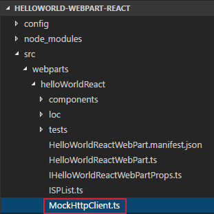

8. Open the **MockHttpClient.ts** file.
9. Copy the following code into **MockHttpClient.ts**.

	````
	import { ISPList } from './ISPList';

	export default class MockHttpClient {
	
	    private static _items: ISPList[] = [
	      { Title: 'Mock List 1', Id: '1' },
	      { Title: 'Mock List 2', Id: '2' },
	      { Title: 'Mock List 3', Id: '3' },
	      { Title: 'Mock List 4', Id: '4' },
	      { Title: 'Mock List 5', Id: '5' }
	    ];
	
	    public static get(restUrl: string, options?: any): Promise<ISPList[]> {
	    return new Promise<ISPList[]>((resolve) => {
	            resolve(MockHttpClient._items);
	        });
	    }
	}
	````

10. Open the **components/IHelloWorldReactProps.ts** file.
11. Add the following code to import the **ISPList** library from `.././ISPList`.

	````
	import { ISPList } from '.././ISPList';
	````

12. Add the following code in the **IHelloWorldReactProps** interface.

	````
	lists: ISPList[];
	````
	
	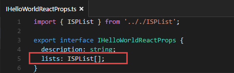
 
13. Open the **HelloWorldReactWebPart.ts** file.
14. Add the following code to import the following libraries.

	````
	import MockHttpClient from './MockHttpClient';
	import { ISPList } from './ISPList';
	````
 
	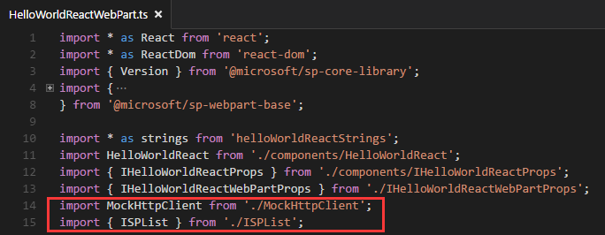

15. Add the following method in **HelloWorldReactWebPart** class.

	>**Note:** This method returns the mock data.

	````
	private _getMockListData(): Promise<ISPList[]> {
		return MockHttpClient.get(this.context.pageContext.web.absoluteUrl)
		    .then((data: ISPList[]) => {
		         return data;
		     });
	}
	````

	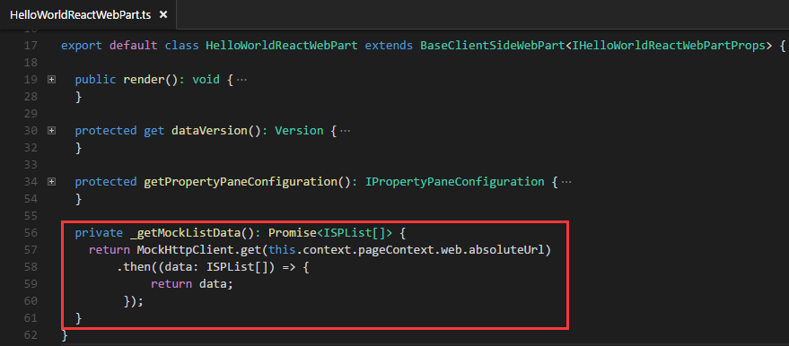

16. Replace the **render** method with the following code.

	>**Note:** This code enhances the render method so it invokes the **_getMockListData** method and renders the mock data.

	````
	public render(): void {
	    this._getMockListData().then(lists => {
	      const element: React.ReactElement<IHelloWorldReactProps> = React.createElement(HelloWorldReact, {
	        description: this.properties.description,
	        lists: lists
	      });
	
	      ReactDom.render(element, this.domElement);
	    });
	}
	````

17. Open the **components\HelloWorldReact.module.scss** file.
18. Add the following styles after the **.button** style.

	````
	.list {
	    color: #333333;
	    font-family: 'Segoe UI Regular WestEuropean', 'Segoe UI', Tahoma, Arial, sans-serif;
	    font-size: 14px;
	    font-weight: normal;
	    box-sizing: border-box;
	    margin: 0 0;
	    padding: 10px 0 100px 0;
	    line-height: 50px;
	    list-style-type: none;
	}
	
	.item {
	    color: #333333;
	    vertical-align: center;
	    font-family: 'Segoe UI Regular WestEuropean', 'Segoe UI', Tahoma, Arial, sans-serif;
	    font-size: 14px;
	    font-weight: normal;
	    box-sizing: border-box;
	    margin: 0;
	    padding: 0;
	    box-shadow: none;
	    *zoom: 1;
	    padding: 0 15px;
	    position: relative;
	    box-shadow: 0 2px 4px 0 rgba(0, 0, 0, 0.2), 0 25px 50px 0 rgba(0, 0, 0, 0.1);
	}
	````

19. Open the **components\HelloWorldReact.tsx** file.
20. Add the following code in the **render** method.

	>**Note:** This markup is used to render the mock data in the the HelloWorldReact component.

	````
	<ul className={styles.list}>
	    {this.props.lists.map((list) =>
	      <li key={list.Id} className={styles.item}>
	        Id: {list.Id}, Title: {list.Title}
	      </li>
	      )}
	</ul>
	````
	
	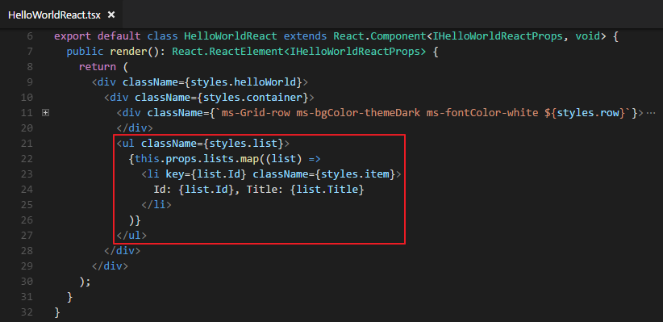

21. Save all files.
22. Preview the web part in your **local workbench** and notice the mock data is displayed.

	> **Note**: If you didn't install and trust a developer certificate on your machine, please install it on your machine.
	> 1. Open a **Command Prompt** window and change to the **helloworld-webpart-react** directory.
	> 2. Type **gulp trust-dev-cert** and press **Enter**.
	
	

## Exercise 2: Using HttpClient to talk to SharePoint ##
In this exercise you will continue to enhance the **HelloWorldReact** web part created in [Getting Started with the SharePoint Framework (SPFx)](../Module-1/Lab.md).  You will modify the web part to invoke the SharePoint REST API to return a list of the lists in the SharePoint site where the web part is executing.

1. Open the **HelloWorldReact** web part project you modified in **Exercise 1** in Visual Studio Code, or your preferred IDE.

	>**Note:** To open in Visual Studio code enter **code .** on the command line.

	

2. Open the **HelloWorldReactWebPart.ts** file.
3. Add the following code to import the **Environment** and **EnvironmentType** library form `@microsoft/sp-core-library`.

	````
	import { Environment, EnvironmentType } from '@microsoft/sp-core-library';
	````

	>**Note:** This library allows you to determine if the web part is running in the local workbench or on a SharePoint web site.

4. Add the following code to import the **SPHttpClient** library from `@microsoft/sp-http`.

	````
	import { SPHttpClient } from '@microsoft/sp-http';
	````

	>**Note:** This library is used to perform REST calls against SharePoint. It includes standard predefined ISPHttpClientConfigurations object for use with the methods of SPHttpClient class.

5. Add the following code in **HelloWorldReactWebPart** class.

	>**Note:** The **_getSharePointListData** method invokes the SharePoint REST API to return the SharePoint lists in the SharePoint site where the web part executes.  The **_getListData** method determines what environment the web part is running in.  It returns mock data when running in the local environment or it returns data from the SharePoint REST API when not running in the local environment.

	````
	private _getSharePointListData(): Promise<ISPList[]> {
     const url: string = this.context.pageContext.web.absoluteUrl + `/_api/web/lists?$filter=Hidden eq false`;
     return this.context.spHttpClient.get(url, SPHttpClient.configurations.v1)
       .then(response => {
         return response.json();
       })
       .then(json => {
         return json.value;
       }) as Promise<ISPList[]>;
	}

	private _getListData(): Promise<ISPList[]> {
	   if(Environment.type === EnvironmentType.Local) {
	      return this._getMockListData();
	   }
	   else {
	     return this._getSharePointListData();
	   }
	}
	````

	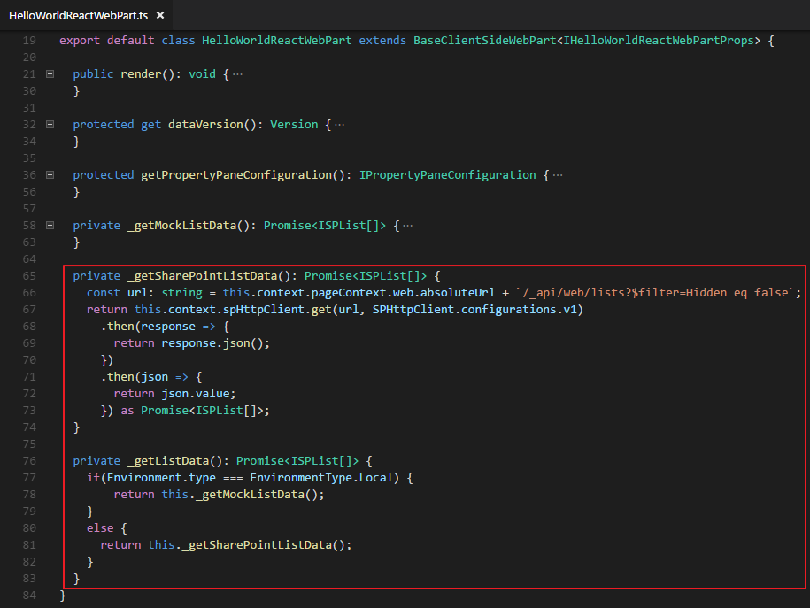

6. Replace the **_getMockListData** method with the **_getListData** method in the **render** method.

	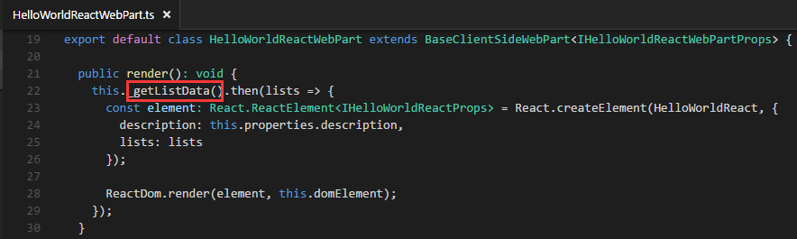

7. Save all files.
8. Preview the web part in the **SharePoint workbench on your Office 365 developer site** and notice the data of the SharePoint lists is displayed.

	> **Note**: If you didn't install and trust a developer certificate on your machine, please install it on your machine.
	> 1. Open a **Command Prompt** window and change to the **helloworld-webpart-react** directory.
	> 2. Type **gulp trust-dev-cert** and press **Enter**.
	
	> **Notes**: 
	> If you followed the instructions in the [Getting Started with the SharePoint Framework (SPFx)](../Module-1/Lab.md) module, the SharePoint workbench on your Office 365 developer site is located at **https://your-sharepoint-site/_layouts/workbench.aspx**.  Replace the your-sharepoint-site placeholder with the name of your Office 365 Developer site.
	> 
	> Delete all of the existing web parts in SharePoint workbench and then add the **HelloWorldReact** web part to preview it.

	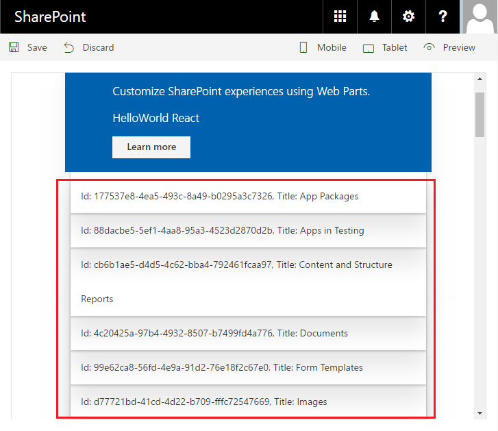


## Exercise 3: Basic CRUD operations with no framework  ##
In this exercise you will enhance the **HelloWorld** web part created in [Getting Started with the SharePoint Framework (SPFx)](../Module-1/Lab.md).  You will modify the web part so it performs create, read, update, and delete (CRUD) operations on a SharePoint list.

### Prepare a SharePoint list ###

1. Go to the **Site Contents** page on your Office 365 Developer Site.
2. Choose the **New** link on the top navigation bar, and then choose **List**.
	
	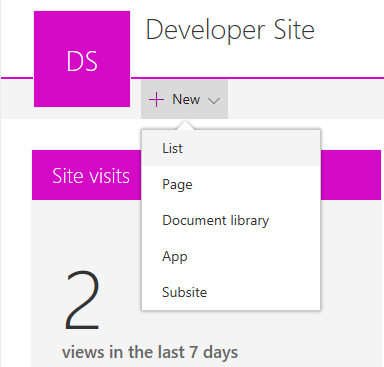

3. In the name textbox enter **Test**, then choose **Create**.

	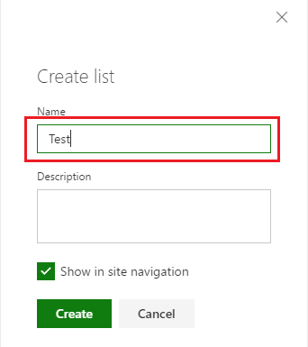

	> **Note**: The list name will be used in the following section. 

### Implement the CRUD operations ###

1. Open a **Command Prompt** window.
2. Change to the **helloworld-webpart** directory created in [Getting Started with the SharePoint Framework (SPFx)](../Module-1/Lab.md).
3. Open the **HelloWorld** web part project in Visual Studio Code, or your preferred IDE.
4. Open the **HelloWorldWebPart.ts** file.
8. Add the following code to import types **SPHttpClient** and **SPHttpClientResponse** from `@microsoft/sp-http`.

	>**Note:** This library is used to perform REST calls against SharePoint. It includes standard predefined ISPHttpClientConfigurations object for use with the methods of SPHttpClient class.
	
	````
	import { SPHttpClient, SPHttpClientResponse } from '@microsoft/sp-http';
	````

9. Define the following interface models just above the **HelloWorldWebPart** class. 

	````
	export interface IListItem {
	  Id: number;
	  Title: string;
	}
	````

	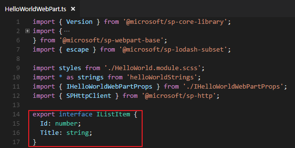

10. Add the following code in **HelloWorldWebPart** class.

	>**Note:** Notice the name of the list you created is assigned to the _listName variable.
	
	````
	private _listName: string = "Test";
	private _listItemEntityTypeFullName: string;
	````

	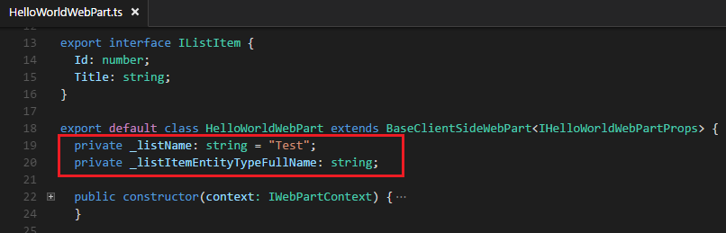

11. Add the following code in **HelloWorldWebPart** class.

	>**Note:** This method invokes the **getListItems** method then creates the HTML to render the list items and the buttons associated with each of them. Then, it wires up the event handlers for the buttons.
	
	````
	protected generateListItemsHtml(): void{
	  const rootContainer: Element = this.domElement.querySelector("#tbodyItems");
	
	  this.getListItems()
	  .then((data: IListItem[]) => {
	    const count: number = data.length;
	    document.getElementById("spanItemLength").innerText = count.toString();
	    document.getElementById("theader").style.display = (count === 0 ? "none" : "");
	
	    for (let i:number = 0; i < count; i++){
	      const Id: number = data[i].Id,
	          Title: string = data[i].Title;
	      rootContainer.insertAdjacentHTML('beforeend', `
	        <tr data-id="${Id}">
	          <td><input class="ms-TextField-field" value="${Title}"></input></td>
	          <td>
	            <button class="${styles.button}">
	              <label class="${styles.label}">Update</label>
	            </button>
	          </td>
	          <td>
	            <button class="${styles.button}">
	              <label class="${styles.label}">Delete</label>
	            </button>
	          </td>
	        </tr>
	      `);
	
	      const buttons = rootContainer.querySelectorAll(`tr[data-id='${Id}'] button`);
	
	      buttons[0].addEventListener("click", (evt: Event): void => {
	        const trNode: Element = this._getTrAncestor(evt.srcElement);
	        this.saveListItem(trNode, trNode.attributes["data-id"].value);
	        evt.preventDefault();
	      });
	
	      buttons[1].addEventListener("click", (evt: Event) : void => {
	        const trNode: Element = this._getTrAncestor(evt.srcElement);
	        this.removeListItem(trNode, trNode.attributes["data-id"].value);
	        evt.preventDefault();
	      });
	    }
	  });
	}
	````

	>**Note:** This method invokes the SharePoint REST API and returns the name of the list specified by the **_listName** variable.
	
	````
	private _getListItemEntityTypeFullName():Promise<string> {
	  if (this._listItemEntityTypeFullName){
	    return Promise.resolve(this._listItemEntityTypeFullName);
	  }
	
	  return this.context.spHttpClient.get(this.context.pageContext["web"]["absoluteUrl"]
	    + `/_api/web/lists/GetByTitle('${this._listName}')`, SPHttpClient.configurations.v1)
	    .then((response: SPHttpClientResponse) => {
	      return response.json();
	    })
	    .then((value) => {
	      this._listItemEntityTypeFullName = value["ListItemEntityTypeFullName"];
	      return this._listItemEntityTypeFullName;
	    });
	}
	````

	>**Note:** This method fires when the Add New Item button is clicked.  It adds the controls to accommodate a new list item to the page and wires up the event handlers for the buttons.
	
	````
	private addNewListItem(): void {
	  const rootContainer: Element = this.domElement.querySelector("#tbodyItems");
	  rootContainer["insertAdjacentHTML"]('beforeend',
	  `<tr data-id="0">
	      <td>
	        <input class='ms-TextField-field' value=""></input>
	      </td>
	      <td>
	        <button class="${styles.button}">
	          <label class="${styles.label}">Add</label>
	        </button>
	      </td>
	      <td>
	        <button class="${styles.button}">
	          <label class="${styles.label}">Cancel</label>
	        </button>
	      </td>
	  </tr>`);
	
	  const buttons = rootContainer.querySelectorAll('tr')[rootContainer.querySelectorAll('tr').length - 1].querySelectorAll('button');
	
	  buttons[0].addEventListener("click", (evt: Event): void => {
	    const trNode: Element = this._getTrAncestor(evt.srcElement);
	    this.saveListItem(trNode, trNode.attributes["data-id"].value);
	    evt.preventDefault();
	  });
	
	  buttons[1].addEventListener("click", (evt: Event) : void => {
	    const trNode: Element = this._getTrAncestor(evt.srcElement);
	    this.removeListItem(trNode, trNode.attributes["data-id"].value);
	    evt.preventDefault();
	  });
	}
	````

	>**Note:** This method invokes the SharePoint REST API and returns the list items from the list specified by the **_listName** variable.
	
	````
	private getListItems(): Promise<IListItem[]> {
	  return this.context.spHttpClient.get(this.context.pageContext["web"]["absoluteUrl"]
	  + `/_api/web/lists/GetByTitle('${this._listName}')/items?$select=Id,Title`, SPHttpClient.configurations.v1)
	  .then((response: SPHttpClientResponse): Promise<any> => {
	    return response.json();
	  })
	  .then((data: any) : IListItem[]  =>{
	    this._showSuccess(`Successfully loaded ${data.value.length} items`);
	    return data.value;
	  }, (error: any): void => {
	    this._showError(`Loading all items failed with error: ${error}`);
	  }) as Promise<IListItem[]>;
	}
	````

	>**Note:** This method invokes the SharePoint REST API and creates new items or updates existing list items in the list specified by the **_listName** variable.
	
	````
	private saveListItem(ContainerNode: Element, Id: string): void {
	  this._clearMessage();
	
	  const title = ContainerNode.querySelector("input").value;
	
	  if(title.trim().length === 0) {
	    this._showError('Title is required');
	    return;
	  }
	
	  this._getListItemEntityTypeFullName()
	  .then((listItemEntityTypeFullName: string) => {
	    const reqJSON: any = {
	      "@odata.type": listItemEntityTypeFullName,
	      "Title": title
	    };
	
	    if(Id === "0") {
	      //create a new item
	      this.context.spHttpClient.post(
	          this.context.pageContext["web"]["absoluteUrl"] +
	          `/_api/web/lists/GetByTitle('${this._listName}')/items`, SPHttpClient.configurations.v1,
	          {
	            body: JSON.stringify(reqJSON),
	            headers: {
	              "accept": "application/json",
	              "content-type": "application/json"
	            }
	      })
	      .then((response: SPHttpClientResponse): Promise<IListItem> => {
	        return response.json();
	      })
	      .then((item: IListItem): void => {
	        ContainerNode.querySelectorAll("button")[0].textContent = "Update";
	        ContainerNode.querySelectorAll("button")[0].parentElement.parentElement.setAttribute("data-id", item.Id.toString());
	        this._showSuccess(`Item '${item.Title}' (ID: ${item.Id}) successfully created`);
	        this._updateItemCount(1);
	      }, (error: any): void => {
	        this._showError('Error while creating the item: ${error}');
	      });
	    }
	    else {
	      //update a list item
	      this.context.spHttpClient.post(
	        this.context.pageContext["web"]["absoluteUrl"] +
	        `/_api/web/lists/GetByTitle('${this._listName}')/items(${Id})`, SPHttpClient.configurations.v1, 
	        {
	          body: JSON.stringify(reqJSON),
	          headers: {
	            "IF-MATCH": "*",
	            "X-HTTP-Method":"MERGE",
	            "accept": "application/json",
	            "content-type": "application/json"
	        }
	      })
	      .then((response: SPHttpClientResponse): void => {
	        this._showSuccess(`Item with ID: ${Id} successfully updated`);
	      }, (error: any): void => {
	        this._showError(`Error updating item: + ${error}`);
	      });
	    }
	  });
	}
	````

	>**Note:** This method invokes the SharePoint REST API and deletes the list item from the list specified by the **_listName** variable.
	
	````
	private removeListItem (ContainerNode: Element, Id: string): void {
	  this._clearMessage();
	
	  if(Id === "0"){
	    ContainerNode.parentNode.removeChild(ContainerNode);
	  }
	  else{
	    this.context.spHttpClient.post(
	      this.context.pageContext["web"]["absoluteUrl"] +
	      `/_api/web/lists/GetByTitle('${this._listName}')/items(${Id})`, SPHttpClient.configurations.v1, 
	      {
	        headers: {
	          "IF-MATCH": "*",
	          "X-HTTP-Method":"DELETE",
	          "accept": "application/json",
	          "content-type": "application/json"
	        }
	    })
	    .then((response: SPHttpClientResponse): void => {
	      ContainerNode.parentNode.removeChild(ContainerNode);
	      this._showSuccess(`Item with ID: ${Id} successfully deleted`);
	      this._updateItemCount(-1);
	    }, (error: any): void => {
	      this._showError(`Error deleting item: ${error}`);
	    });
	  }
	}
	````

	>**Note:** Utility method used to update the list item count.
	
	````
	private _updateItemCount(increment: number){
	  const countElement = document.getElementById("spanItemLength");
	  const count: number = Number(countElement.innerText);
	  countElement.innerText = (count + increment).toString();
	}
	````

	>**Note:** Utility method used to get the closest table row ancestor of an element.
	
	````
	private _getTrAncestor(element: Element): Element{
	  while (element && element.tagName.toLowerCase() != "tr"){
	    element = element.parentElement;
	  }
	  return element;
	}
	````

	>**Note:** Utility method used to clear status messages in the web part.
	
	````
	private _clearMessage() {
	    this.domElement.querySelector("#message").innerHTML = "";
	}
	````

	>**Note:** Utility method used to display success status messages in the web part.
	
	````
	private _showSuccess(message: string) {
	    const elem: Element = this.domElement.querySelector("#message");
	    elem.className = "ms-fontColor-white";
	    elem.innerHTML = message;
	}
	````

	>**Note:** Utility method used to display error status messages in the web part.

	````
	private _showError(message: string) {
	    const elem: Element = this.domElement.querySelector("#message");
	    elem.className = "ms-fontColor-red";
	    elem.innerHTML = message;
	}
	````

12. Replace the **render** method with the following code to enhance the user interface to accommodate this sample scenario.

	````
	public render(): void {
	  this.domElement.innerHTML = `
	    <div class="${styles.helloWorld}">
	      <div class="${styles.container}">
	        <div class="ms-Grid-row ms-bgColor-themeDark ms-fontColor-white ${styles.row}">
	          <p class="ms-font-l">There are <span id="spanItemLength"></span> item(s) in <span id="spanItemName">${this._listName}</span> list</p>
	          <table>
	            <thead id="theader" style="display:none">
	              <tr>
	                <th class="ms-font-xl">Title</th>
	                <th />
	                <th />
	              </tr>
	            </thead>
	            <tbody id="tbodyItems">
	            </tbody>
	          </table>
	        </div>
	        <div class="ms-Grid-row ms-bgColor-themeDark ms-fontColor-white ${styles.row}">
	          <button class="${styles.button}">
	            <label class="${styles.label}">Add New Item</label>
	          </button>
	        </div>
	        <div class="ms-Grid-row ms-bgColor-themeDark ms-fontColor-white ${styles.row}">
	          <div class="ms-font-l" id="message"></div>
	        </div>
	      </div>
	    </div>`;
	
	  this.generateListItemsHtml();
	  this.domElement.getElementsByTagName("button")[0].addEventListener("click", () => {
	    this.addNewListItem();
	  });
	}
	````

13. Remove the unused code `import { escape } from '@microsoft/sp-lodash-subset';`.
14. Preview the web part in the **SharePoint workbench on your Office 365 developer site**.

	> **Note**: If you didn't install and trust a developer certificate on your machine, please install it on your machine.
	> 1. Open a **Command Prompt** window and change to the **helloworld-webpart** directory.
	> 2. Type **gulp trust-dev-cert** and press **Enter**.

	> **Notes**: 
	> If you followed the instructions in the [Getting Started with the SharePoint Framework (SPFx)](../Module-1/Lab.md) module, the SharePoint workbench on your Office 365 developer site is located at **https://TENANCY.sharepoint.com/_layouts/workbench.aspx**.  Replace the TENANCY placeholder with the name of your Office 365 Developer tenancy.
	> 
	> Delete all of the existing web parts in SharePoint workbench and then add the **HelloWorld** web part to preview it.
	
	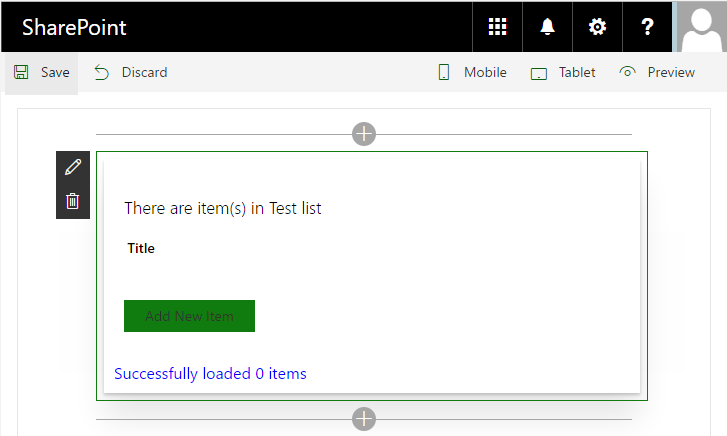

#### Test creating a list item ####

1. Choose **Add New Item**.
2. Enter **Item 1** as the title, then choose **Add**.

	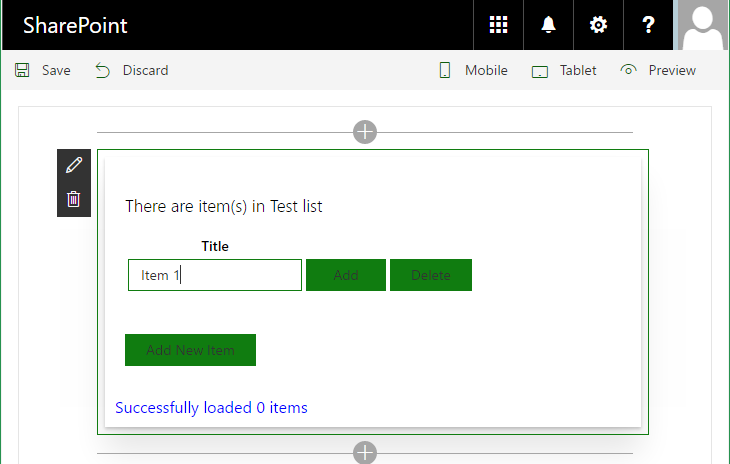

3. The message in the web part indicates **Item 1** is successfully created.

	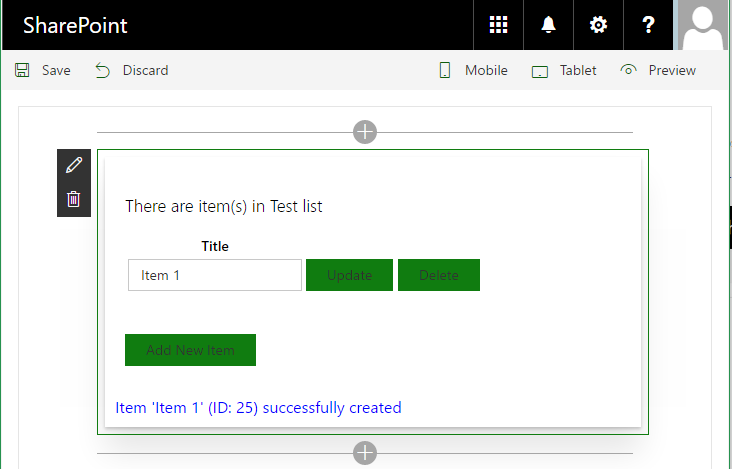

4. Verify the new item is created in the list view page. 

	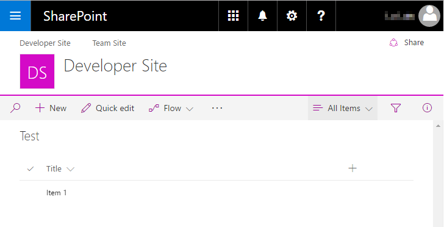


#### Test updating a list item ####

1. Choose **Add New Item**.
2. Enter **Item 2** as the title, then choose **Add**.

	

3. Verify the new item is created in the list view page. 
 
	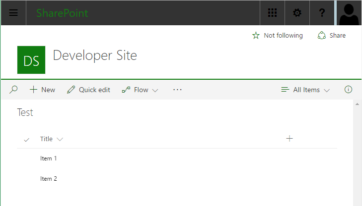

4. Enter **New Item 2** as the new title for **Item 2**, then choose **Update**.

	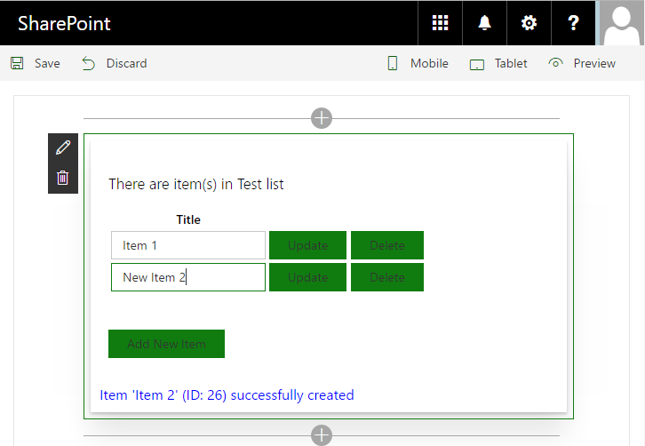

5. The message in the web part indicates the list item was successfully updated.

	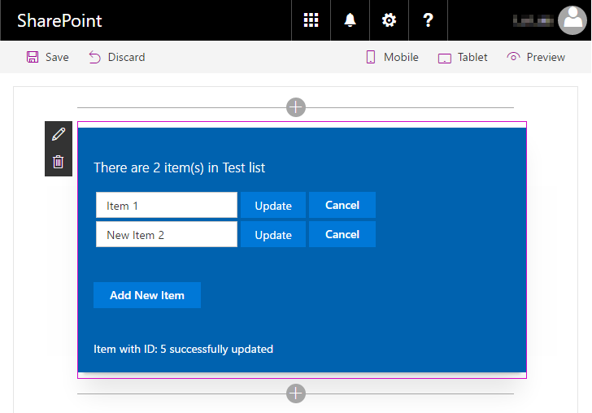

6. Verify the item was updated in the list view page. 

	

#### Test reading all list items ####

1. Refresh the SharePoint workbench page.
2. All list items are loaded.

	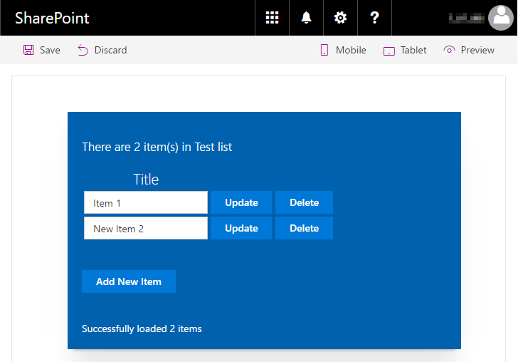

#### Test deleting a list item ####

1. Refresh the SharePoint workbench page.
2. Next to **Item 1**, choose the **Delete** button.

	
 
3. The message in the web part indicates the list item was successfully deleted.

	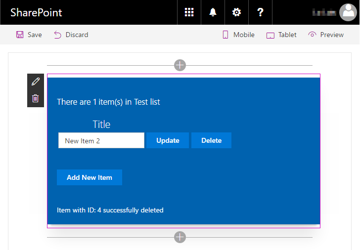
 
4. Verify the item was deleted in the list view page. 

	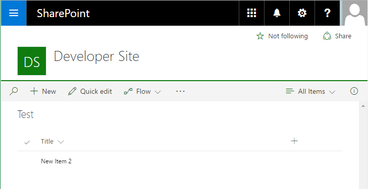
