# Deploying SharePoint Framework components to production #
In this lab, you will walk through deploying your client-side web part to a classic SharePoint page, deploying the web part assets to an Office 365 Public CDN and an Azure Storage CDN.

> **Note:** SharePoint Framework components only contain client side web parts for now.  More components will be introduced in the future.

> This lab uses the [Demos/helloworld-webpart](./Demos/helloworld-webpart) as the starter project.  This is the same project created in [Module 1, Exercise 1](../Module-1/Lab.md#exercise-1-create-a-hello-world-web-part-without-any-framework). In this lab, the code will not change, but the configuration settings will.

## Prerequisites ##
Make sure you have completed the procedures in the following sections of [Getting Started with the SharePoint Framework (SPFx)](../Module-1/Lab.md) module: 
- [Setup development environment](../Module-1/Lab.md#setup-development-environment)
- [Setup Office 365 tenant](../Module-1/Lab.md#setup-office-365-tenant)

## Exercise 1: Deploy your client-side web part to a classic SharePoint page ##

### Package the HelloWorld web part ###
Unlike in the workbench, in order to use client-side web parts on classic SharePoint server-side pages, you need to deploy and register the web part with SharePoint. To do this, first you need to package the web part.

1. Copy the [Demos/helloworld-webpart](./Demos/helloworld-webpart) starter project to a proper directory.  For example **c:\helloworld-wepart**

	> **Note:** Directory paths can become quite long after node modules are imported.  **We suggest you use a directory name without spaces in it and create it in the root folder of your drive.**  This will make working with the web part easier in the future and protect you from potential issues associated with long file paths.

2. Open a Command Prompt window.
3. Change to the directory where you copied the [Demos/helloworld-webpart](./Demos/helloworld-webpart) starter project.
4. Review the web part package metadata.
	1. Open the web part project in Visual Studio Code, or your preferred IDE.

		>**Note:** To open in Visual Studio Code enter **code .** on the command line.

		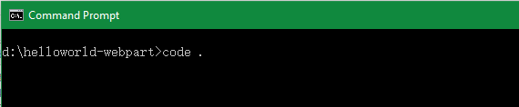

	2. Open package-solution.json from the config folder. This file defines the package metadata as shown in the following code:

		````json
		{
		    "solution": {
		    "name": "helloworld-webpart-client-side-solution",
		    "id": "a5921b6b-5b8d-46f4-b3f5-ca95657b2da9",
		    "version": "1.0.0.0"
		    },
		    "paths": {
		    "zippedPackage": "helloworld-webpart.sppkg"
		    }
		}
		````
	3. You can update the meta-data as you so fit, but for this exercise just review it, do not change it.
	
	>**Note:** The **solution** node contains the following settings:
	>- **name** - The name of the package.  The name appears in the SharePoint app catalog after you upload the package.
	>- **id** : A GUID that uniquely identifies the package. The id appears in the SharePoint app catalog after you upload the package. In theory, you can have two packages with the same name, but different ids.
	>- **version**: The version of the package. The version appears in the SharePoint app catalog after you upload the package. You can use the version to track the version of your package as it is upgraded and evolves over time.
	>
	>The **paths** node contains the following element:
	>- **zippedPackage**: The name of the zip file that is created when you package the solution. This file is used to upload the package to a SharePoint app catalog.
	 
5. Switch to the **Command Prompt** window. Make sure you are still in the helloworld-webpart directory.
6. Install all the npm packages the web part project depends on by executing the following command:

	````shell
	npm install
	````

7. Build the web part by executing the following command:

	````shell
	gulp bundle
	````

8. Package the web part by executing the following command:

	````shell
	gulp package-solution
	````

	The command will create the package in the sharepoint/solution folder:

	````
	helloworld-webpart.sppkg
	````

#### Package contents ####

The package uses SharePoint Feature to package your web part. By default, the gulp task creates a feature for your web part.

You can view the raw package contents in the **sharepoint** directory.

The package format is very similar to a SharePoint Add-in package and uses the Microsoft Open Packaging Conventions.

The JavaScript files, CSS, and other supporting assets are not packaged in the .sppkg file.  These assets must be deployed to an external location such as a CDN. In order to test the web part during development, you can load all the assets from your local computer by running the project locally with the gulp serve command. This exercise demonstrates that approach.  Exercise 2 and exercise 3 demonstrate how to deploy the supporting assets to a CDN and modify the package to load the resources from the CDN.

### Deploy the HelloWorld package to a SharePoint app catalog ###

1. Go to your Office 365 Developer Tenant's App Catalog site.

	> **Notes**:  If you followed the instructions in the [Getting Started with the SharePoint Framework (SPFx)](../Module-1/Lab.md) module, the App Catalog site is located at **https://&lt;TENANCY&gt;.sharepoint.com/sites/apps**.  Replace the **&lt;TENANCY&gt;** placeholder with the name of your Office 365 developer tenancy.

2. In the left sidebar, choose the **Apps for SharePoint**.
3. Upload the **helloworld-webpart.sppkg** to Apps for SharePoint. 
	
	

4. You have now deployed the client-side solution package. Since this is a full trust client-side solution, SharePoint will display a dialog and ask you to trust the client-side solution. Choose **Deploy**. 
	
	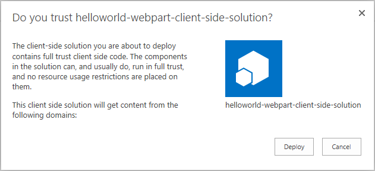

### Install the client-side solution on your site ###

1. Go to your Office 365 Developer Tenant's developer site.

	> **Notes**:  If you followed the instructions in the [Getting Started with the SharePoint Framework (SPFx)](../Module-1/Lab.md) module, the developer site is located at **https://&lt;TENANCY&gt;.sharepoint.com/sites/dev**.  Replace the **&lt;TENANCY&gt;** placeholder with the name of your Office 365 developer tenancy.

2. Choose the gear icon on the top right nav bar, then choose **Add an app** to go to your Apps page.
3. In the **Search** box, enter **helloworld** and press Enter to filter your apps.
	
	

4. Choose the **helloworld-webpart-client-side-solution** app to install the app on the site.
5. Wait until the installation completes.
	
	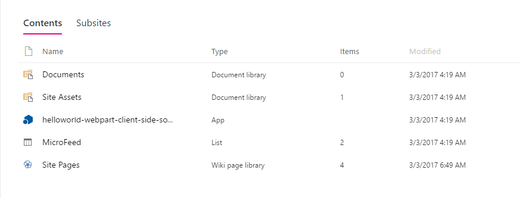

	> **Note:** You could refresh the page to see if the installation completes.

### Inspect the manifest file that specifies where resources are served from ###

Now that you have deployed and installed the client-side solution, add the web part to a classic SharePoint page. Remember that resources such as JavaScript and CSS are available from the local computer.  In this exercise, this is where they are served from.

1. In the **\dist** folder, open the **&lt;your-webpart-guid&gt;.manifest.json** file.

2. Notice that the **internalModuleBaseUrls** property in the **loaderConfig** entry refers to your local computer:

	````json
	"internalModuleBaseUrls": [
  	"http://localhost:4321/"
	]
	````

### Start the local web server to host the resources the web part relies on###

1. Switch to the **Command Prompt** window. Make sure you are still in the **helloworld-webpart** directory.
2. If you haven't installed and trusted a developer certificate, do it by executing the following command.

	````shell
	gulp trust-dev-cert
	````

	> **Note:** The client-side toolchain uses HTTPS endpoint by default. However, since a default certificate is not configured for the local dev environment, your browser will report a certificate error. The command above installs and trusts a developer certificate used by HTTPS endpoint.
	> 
	> You only need to do this once per machine, not once per project. If you have done this in another project, please ignore this step.

3. Start the local web server by executing the following command:

	````shell
	gulp serve
	````

	> **Note:** Mozilla Firefox doesn't trust self-signed certificate. If you're using Mozilla Firefox, you will need to choose **Advanced** and add an exception to proceed to the website.
	> 
	> If you have already done this or you're not using Mozilla Firefox, you can run **gulp serve --nobrowser**, which will not automatically launch the Web Part Workbench.

### Add and preview the HelloWorld web part in a classic page ###

1. Go to your Office 365 Developer Tenant's developer site.

	> **Notes**:  If you followed the instructions in the [Getting Started with the SharePoint Framework (SPFx)](../Module-1/Lab.md) module, the developer site is located at **https://&lt;TENANCY&gt;.sharepoint.com/sites/dev**.  Replace the **&lt;TENANCY&gt;** placeholder with the name of your Office 365 developer tenancy.

2. Choose the gear icon on the top right nav bar, then choose **Site Contents**.
3. Choose the **SitePages** library icon to go to the **SitePages** library.
4. Choose **New**, then choose **Wiki Page** to create a classic SharePoint page.

	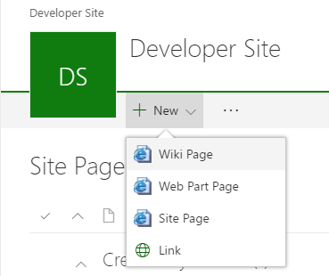

5. Enter **HelloWorld** as the page name.
6. Choose the **Create** button to create the classic web part page. SharePoint will create your page and navigate you to the new page in edit mode.
7. In the ribbon, choose **Insert** then choose **Web Part** to open the Web Part Gallery.
8. In the Web Part Gallery, choose the category **Under Development**.

	> **Note:** The category is configured in file **src\webparts\helloworld\HelloWorldWebPart.manifest.json**.

	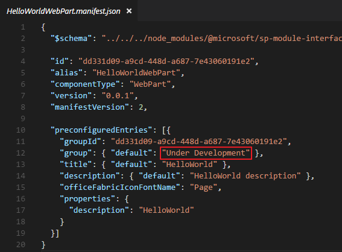

9. Select the **HelloWorld** web part and choose **Add** to add it to the page.
	
	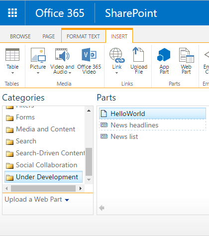

	> **Note:** The web part assets will be loaded from the local environment.

10. Observe the **HelloWorld** web part in the classic page.

	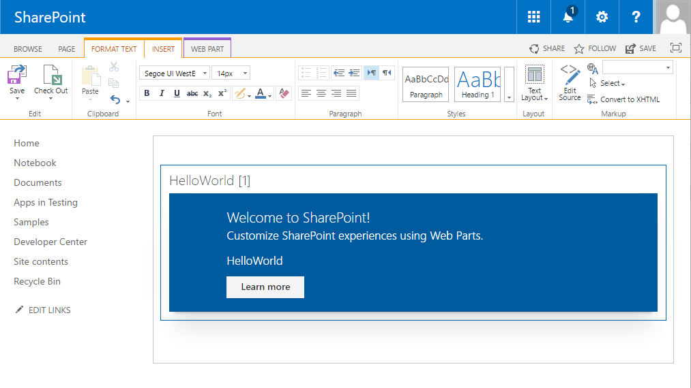

### Edit web part properties ###

1. Open the web part edit menu by choosing the **arrow** at the top right of the web part, then choose **Edit Web Part** to open the property pane for the web part.

	

	> **Note:** The property pane opens as a server-side web part property pane. Even though the property pane runs server-side, you can configure the properties for your client-side web part.

2. Choose the **Configure** button to reveal the new client-side property pane for your client-side web part.

	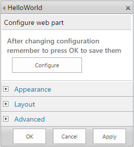

3. In the **Description Field** textbox, enter **Client-side web parts are awesome!**

    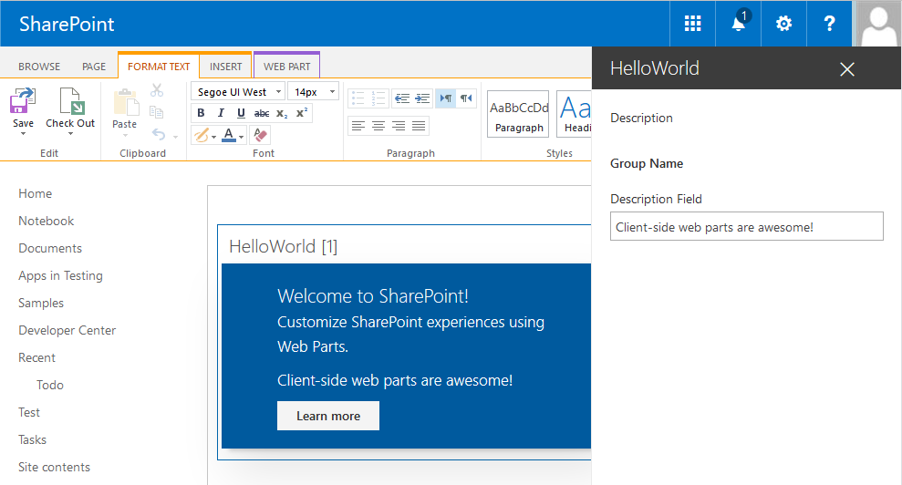

4. Choose the **x** icon to close the client-side property pane.
5. Choose the **OK** button in the server-side property pane to save and close the web part property pane.
6. In the ribbon, choose **Save** to save the page.

## Exercise 2: Deploy the web part resources to a SharePoint CDN ##

### Setup SharePoint CDN ###

#### Prerequisites ####
Make sure that you have installed the [**SharePoint Online Management Shell**](https://www.microsoft.com/en-us/download/details.aspx?id=35588)

#### Create a SharePoint folder to serve as the CDN ####

1. Go to your Office 365 Developer Tenant's developer site.

	> **Notes**:  If you followed the instructions in the [Getting Started with the SharePoint Framework (SPFx)](../Module-1/Lab.md) module, the developer site is located at **https://&lt;TENANCY&gt;.sharepoint.com/sites/dev**.  Replace the **&lt;TENANCY&gt;** placeholder with the name of your Office 365 developer tenancy.

2. Choose the gear icon on the top right nav bar, then choose **Site Contents**.
3. Choose the **Site Assets** library icon to go to the **Site Assets** library.
4. Choose **New**, then choose **New Folder** to create a folder.
5. Enter **cdn** in the folder name textbox.
6. Choose the **Create** button to create the folder.

#### Enable the SharePoint folder as the CDN origin ####

> **Note:** Replace the **&lt;TENANCY&gt;** placeholder with the name of your Office 365 developer tenancy in the following commands.

1. Open the **SharePoint Online Management Shell**.
2. Connect to your Office 365 Developer Tenant within PowerShell session by executing the following commands:

	````powershell
	$creds = Get-Credential
	Connect-SPOService -Url https://<TENANCY>-admin.sharepoint.com/ -Credential $creds
	````

3. Enable the Public CDN in the tenant by executing the following command:

	````powershell
	Set-SPOTenant -PublicCdnEnabled $true
	````

4. Configure the allowed file extensions by executing the following command:

	````powershell
	Set-SPOTenant -PublicCdnAllowedFileTypes "CSS,EOT,GIF,ICO,JPEG,JPG,JS,MAP,PNG,SVG,TTF,WOFF,TXT"
	````

	> **Note:** We only have to allow **JS** files in this exercise. You could execute command `Get-SPOTenant` and check property **PublicCdnAllowedFileTypes**. If **JS** is already included, you could ignore this step. 

5. Add the CDN Origin by executing the following command:

	````powershell
	New-SPOPublicCdnOrigin -Url "https://<TENANCY>.sharepoint.com/sites/dev/siteassets/cdn"
	````

6. Get the CDN Origin Id by executing the following command:

	````powershell
	Get-SPOPublicCdnOrigins
	````

    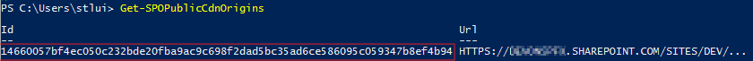

7. Your CDN base path should be: [https://publiccdn.sharepointonline.com/&lt;TENANCY&gt;.sharepoint.com/&lt;your-CDN-origin-Id&gt;](). Replace the **&lt;TENANCY&gt;** placeholder with the name of your Office 365 developer tenancy, and the **&lt;your-CDN-origin-Id&gt;** placeholder with the **CDN Origin Id** you created in the previous steps.

For more information on the **SharePoint CDN**, please see [this](https://dev.office.com/blogs/office-365-public-cdn-developer-preview-release) article.

### Configure the web part to load resources from the SharePoint CDN ###

1. Switch to your IDE.
2. Open the **write-manifests.json** in the **config** folder.
3. Enter the CDN base path you created in the previous section for the **cdnBasePath** property.

	````json
	{
	  "cdnBasePath": "<!-- PATH TO CDN -->"
	}
	````

4. Save the file.

### Update the HelloWorld package in the SharePoint app catalog ###
1. Switch to the **Command Prompt** window. End the **gulp serve** task by pressing **Ctrl+C**. Make sure you are still in the **helloworld-webpart** directory.
2. Package the solution again by executing the following commands:

	````shell
	gulp bundle --ship
	gulp package-solution --ship
	````

3. Upload the web part resources to the SharePoint folder you created and configured as the CDN Origin.

	> **Note:** The web part resources are all the files in the &lt;helloworld-webpart directory&gt;\temp\deploy folder, except the &lt;your-webpart-guid&gt;.json file.

4. Upload the updated solution package to your App Catalog by repeating the steps in the [Deploy the HelloWorld package to app catalog](#deploy-the-helloworld-package-to-a-sharepoint-app-catalog) section.

	> **Note:** Because you already deployed the package, you will be prompted if you want to replace the existing package. Choose **Replace It**.

    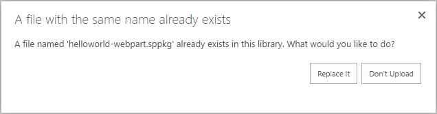
	
### Test the updated web part ###

1. In a web browser, go to the **HelloWorld** web part classic page you created.
2. Refresh the page.
3. The **HelloWorld** web part now loads the web part bundle and other resources from the SharePoint CDN.

> **Note:** You are no longer running gulp serve, and therefore nothing is served from localhost.  You can verify the files are being served by the SharePoint CDN by pressing F12 and looking at the network traffic.

## Exercise 3: Deploy the web part resources to an Azure Storage CDN ##

### Create an Azure Storage Account and configure it to serve as a CDN ###

#### Create an Azure Storage Account ####

1. Sign in to the [Azure Portal](https://portal.azure.com/).
2. In the upper left corner, choose the **New** button. In the **New** blade, choose **Storage**, then choose **Storage account**.

    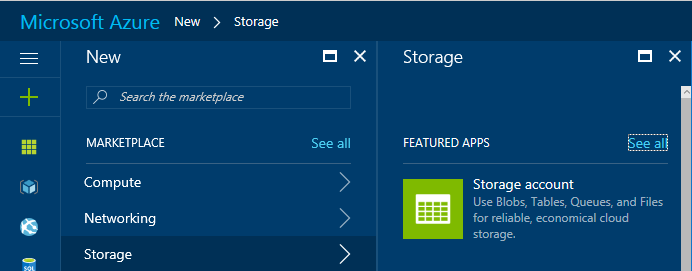

3. In the **Create storage account** blade, configure the following settings:
   - In the **Name** field, type a subdomain name, such as **spfxstorage**.
   - Leave the defaults for **Deployment model**, **Account kind**, **Performance**, **Replication**, and **Storage service encryption**.
   - Select the **Subscription** that the storage account will be used with.
   - Select or create a **Resource Group**.
   - Select a **location** for your storage account.
   - Choose **Create**. 
   
	>**Note:** Creating the Storage Account might take several minutes to complete.

    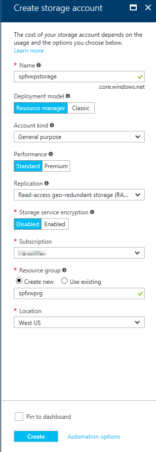

#### Create a BLOB container ####

1. Go to the Storage account you just created. To locate the Storage Account, enter the name of the Storage account in the **Search resources** box and press Enter.
2. In the **Storage account** dashboard, choose **Blobs** in the **Services** section.

    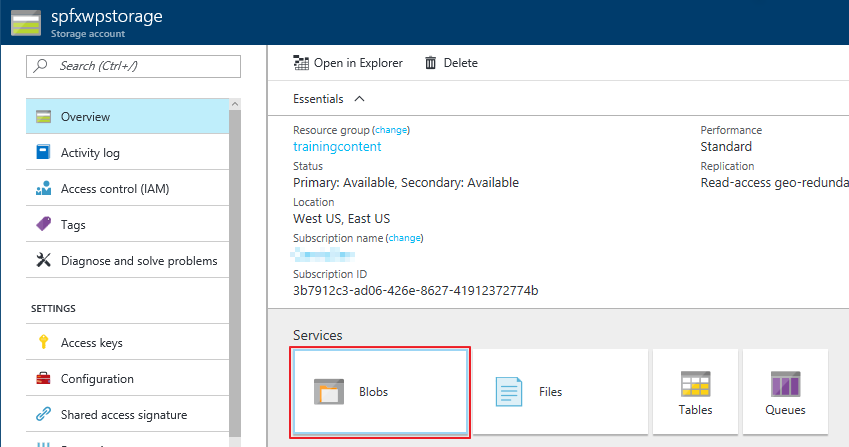

3. Choose the **+ Container** and create a new container with the following settings:
   - Name: **helloworld-webpart**
   - Access type: **Container**

    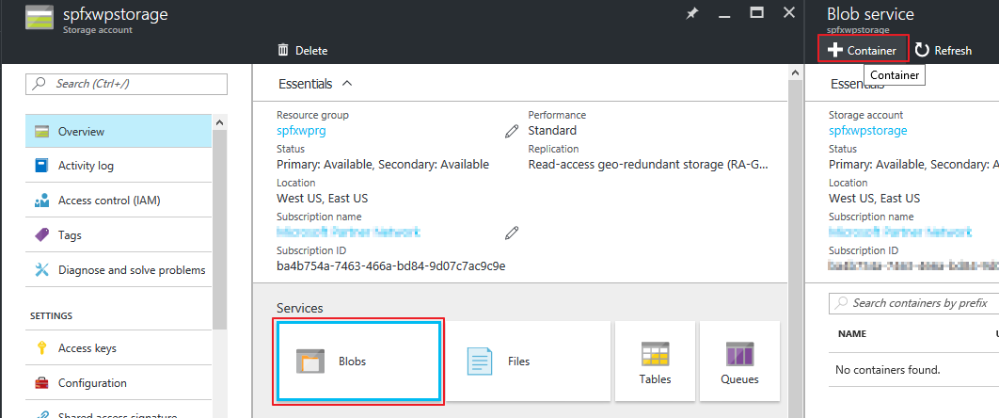

3. Choose **Create** to create the container.
3. Choose the **Container** you just created, then choose **Properties**.

    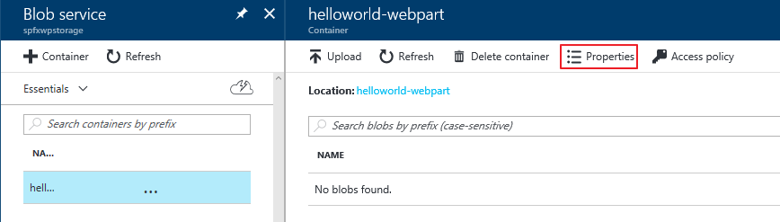

4. In the **Container properties** blade, copy and save the URL. You will use it in subsequent steps.

    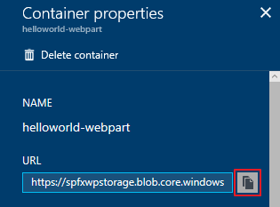

#### Obtain the Storage account access key ####

1.	Go back to the **Storage account** dashboard, choose **Access Keys**.
2.	Copy and save one of the access keys.  You will use the access key in subsequent steps.

	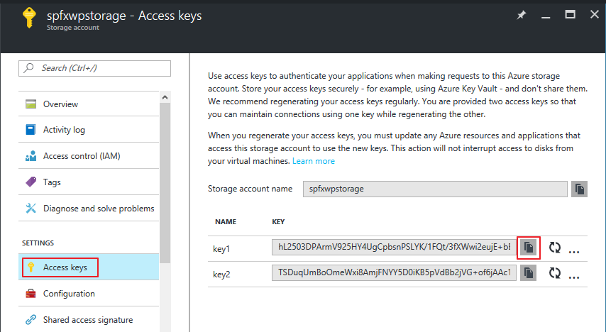

#### Create CDN profile ####

1. In the upper left corner, choose **New** button. 
2. In the **New** blade, choose **Web + Mobile**, then choose **CDN**.

    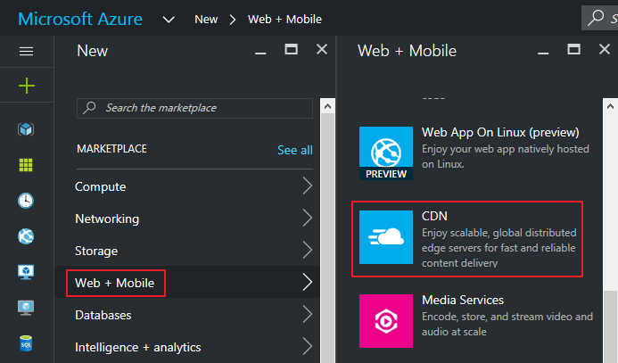

3. In the **CDN profile** blade, configure the following settings:
   - Enter a name for your CDN profile.
   - Select the **Subscription** for the CDN profile.
   - Select or create a **Resource Group**.
   - Select a **Resource group location**.
   - Select a **Pricing tier**.
   - Choose **Create**.
   
	>**Note:** Creating the CDN profile might take several minutes to complete.

    

#### Create CDN endpoint ####

1. Go to the CDN profile you just created. To locate the CDN profile, enter the name of the CND profile in the **Search resources** box and press Enter.
2. In the **CDN profile** dashboard, choose **+ Endpoint**.
3. In the **Add an endpoint** blade, configure the following settings:
   - Enter a **Name** for this CDN endpoint.
   - In the **Origin type** dropdown, select **Storage**.
   - In the **Origin hostname** dropdown, select the **storage account** you created.
   - Leave the default values for **Origin path**, **Origin host header**, and **Protocol/Origin port**.
   - Choose the **Add** button to create the new endpoint.

    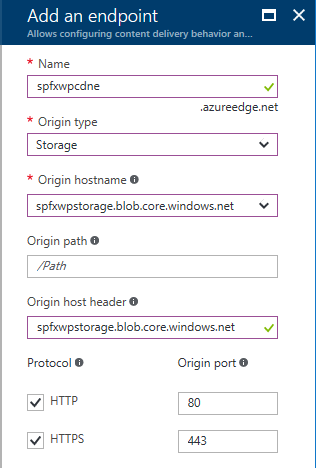

#### Configuring the web part to load resources from the Azure Storage CDN ####

1. Switch to your IDE.
2. Open the **write-manifests.json** in the **config** folder.
3. Enter the URL of the Blob container you created for the **cdnBasePath** property.

	````json
	{
	  "cdnBasePath": "<!-- PATH TO CDN -->"
	}
	````

4. Save the file.

#### Deploy the web part resources to the Azure Storage CDN ####

1. Open the **deploy-azure-storage.json** in the **config** folder in your IDE.
2. Replace **account**, **container**, **accessKey** with your Storage Account name, BLOB container and Storage Account access key respectively.
3. Save the file.

    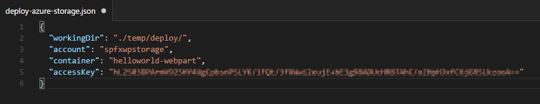

4. Switch to the **Command Prompt** window. Make sure you are still in the **helloworld-webpart** directory.
5. Build the project by executing the following command:

	````shell
	gulp bundle --ship
	````

6. Deploy the resources to your Storage Account CDN by executing the following command:

	````shell
	gulp deploy-azure-storage
	````

#### Update the HelloWorld package in the SharePoint app catalog ####

1. Package the solution again by executing the following commands:

	````shell
	gulp package-solution --ship
	````

2. Upload the updated solution package to your App Catalog by repeating the steps in the [Deploy the HelloWorld package to app catalog](#deploy-the-helloworld-package-to-a-sharepoint-app-catalog) section.

	> **Note:** Because you already deployed the package, you will be prompted if you want to replace the existing package. Choose **Replace It**.

    

### Test the updated web part ###

1. In a web browser, go to the **HelloWorld** web part classic page you created.
2. Refresh the page.
3. The **HelloWorld** web part now loads the web part bundle and other resources from the Azure Storage Account CDN.

> **Note:** You can verify the files are being served by the Azure Storage Account CDN by pressing F12 and looking at the network traffic.
