## Using React and Office UI Fabric React components #
This lab describes how use [Office UI Fabric Core](https://github.com/OfficeDev/office-ui-fabric-core) styles and the [Office UI Fabric React Components](https://github.com/OfficeDev/office-ui-fabric-react) to build user interfaces in SharePoint Framework client-side web parts. 

The [Office UI Fabric Core](https://github.com/OfficeDev/office-ui-fabric-core) is the front-end framework for building experiences for Office and Office 365.

The [Office UI Fabric React Components](https://github.com/OfficeDev/office-ui-fabric-react) includes a robust collection of responsive, mobile-first components that make it easy to create web experiences using the Office Design Language.

## Prerequisites ##
Make sure you have completed the procedures in the following sections of [Getting Started with the SharePoint Framework (SPFx)](../Module-1/Lab.md) module: 
- [Setup development environment](../Module-1/Lab.md#setup-development-environment)
- [Setup Office 365 tenant](../Module-1/Lab.md#setup-office-365-tenant)

### Explore the basic project structure generated by yeoman ###
1. Open a **Command Prompt** window.
2. Change to the **helloworld-webpart-react** directory created in [Getting Started with the SharePoint Framework (SPFx)](../Module-1/Lab.md).
3. Open the **HelloWorldReact** web part project in Visual Studio Code, or your preferred IDE.

	>**Note:** To open in Visual Studio code enter **code .** on the command line.

	

4. The project structure is shown in the following figure.

	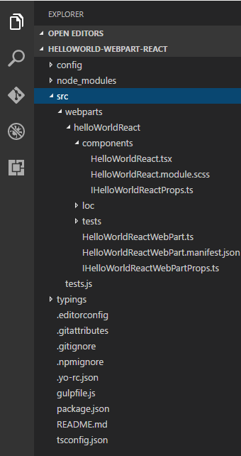
 
	> **Note**: The **src\webparts\helloWorldReact** folder contains the styles, configuration and script files used to implement the client-side web part.
	> 
	> **HelloWorldReact.tsx** is the container component for the web part; it returns an element. 
	> 
	> **HelloWorldReact.module.scss** contains the styles used in the web part.
	>
	> **IHelloWorldReactProps.ts** defines the interface for the React component properties.
	> 
	> **HelloWorldReactWebPart.ts** is the main web part script file.
	>  
	> **HelloWorldReactWebPart.manifest.json** contains configuration information for the web part, including the **version**, **title**, **description** , etc.
	> 
	> **IHelloWorldReactWebPartProps.ts** defines the interface for the web part properties.

### Install Office UI Fabric ###

To work with the Office UI Fabric, first install the npm package that contains it.

1. Switch to **Command Prompt** window and make sure your are in the **helloworld-webpart-react** directory.
2. Type **npm i office-ui-fabric-react --save** and press **Enter**.

	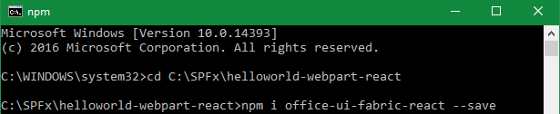

	> **Note**: If you're using Windows, you might get the following exception during this installation: "Error: EPERM: operation not permitted,...". To solve the issue, reopen your console application as an administrator. Open the context menu (right-click) and choose **Run as administrator**.


### Exercise 1: Office UI Fabric Core ###
In this exercise you will enhance the **HelloWorldReact** web part created in [Getting Started with the SharePoint Framework (SPFx)](../Module-1/Lab.md) to work with Office UI Fabric Styles.

#### Animations ####
Use the animation library to create web experiences that integrate with Office 365. You can use the animation CSS classes for navigation, panels, dialogs, and more. Animations include directionality (up, down, left, right relating to origin and completion of tasks), enter/exit (fade in, fade out, zoom in, zoom out), and duration (speed of enter/exit relating to urgency or content type).

1. Switch to Visual Studio Code and open the **HelloWorldReact** project you previously modified in the **Install Office UI Fabric** section.
2. Open the the **HelloWorldReact.tsx** file.
3. Add the following code to the **render** method.

	````
	<div className="ms-u-slideRightIn10">This content will slide in.</div>
	````
	
	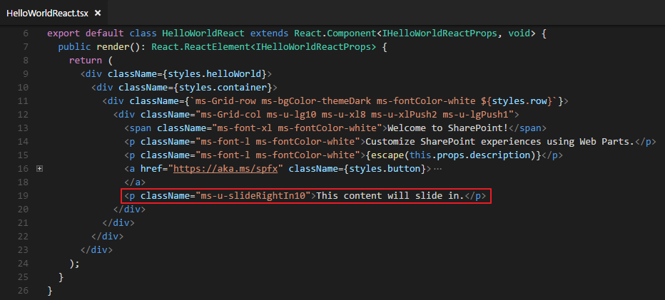
	
4. Save the file.
5. Preview the web part in your local workbench and notice the animation effects.

	> **Note**: If you didn't install and trust a developer certificate on your machine, please install it on your machine.
	> 1. Open a **Command Prompt** window and change to the **helloworld-webpart-react** directory.
	> 2. Type **gulp trust-dev-cert** and press **Enter**.

	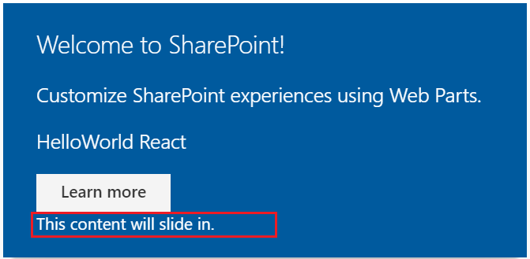

	> **Note**: For more information about **animations**, see [http://dev.office.com/fabric#/styles/animations](http://dev.office.com/fabric#/styles/animations).

#### Colors ####
Office UI Fabric includes 9 theme colors and 11 neutral colors. Each has helper classes for text, background, border, and hover states. 

1. Open the the **HelloWorldReact.tsx** file.
2. Add the following code to the **render** method.

	````
	<div className="ms-bgColor-themeDarker ms-fontColor-white">This theme is darker.</div>
	````
	
	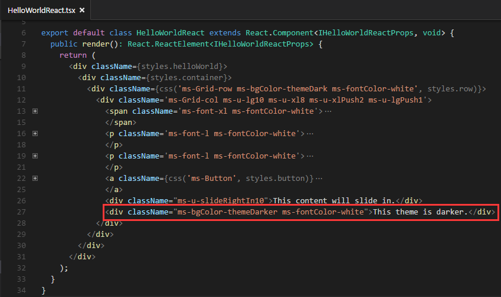

3. Save the file.
4. Preview the web part in your local workbench and notice the  darker color is displayed.
	
	> **Note**: If you didn't install and trust a developer certificate on your machine, please install it on your machine.
	> 1. Open a **Command Prompt** window and change to the **helloworld-webpart-react** directory.
	> 2. Type **gulp trust-dev-cert** and press **Enter**.

	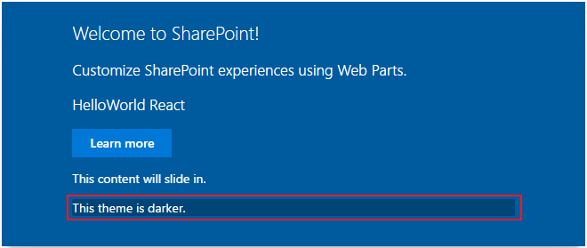

	> **Note**: For more information about **color**, please check the link [http://dev.office.com/fabric#/styles/colors](http://dev.office.com/fabric#/styles/colors)

#### Icons ####
Fabric uses a custom font for its iconography. This font contains glyphs that you can scale, color, and style in any way. You can even flip them for right-to-left localization. To use the icons, combine the base ms-Icon class with a modifier class for the specific icon.

1. Open the **HelloWorldReact.tsx** file.
2. Add the following code to the **render** method.

	````
	<i className="ms-Icon ms-Icon--Mail" aria-hidden="true"></i>
	````
	
	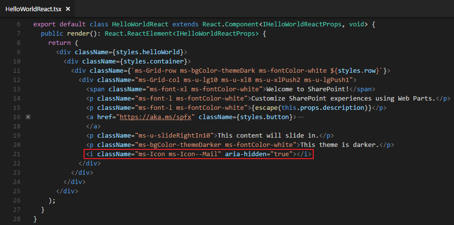
	
	> **Note**: The aria-hidden attribute, which prevents screen readers from reading the icon. In cases where meaning is conveyed only through the icon, such as an icon-only navigation bar, be sure to apply an aria-label to the button for accessibility.

3. Preview the web part in your local workbench and notice the mail icon is displayed.

	> **Note**: If you didn't install and trust a developer certificate on your machine, please install it on your machine.
	> 1. Open a **Command Prompt** window and change to the **helloworld-webpart-react** directory.
	> 2. Type **gulp trust-dev-cert** and press **Enter**.

	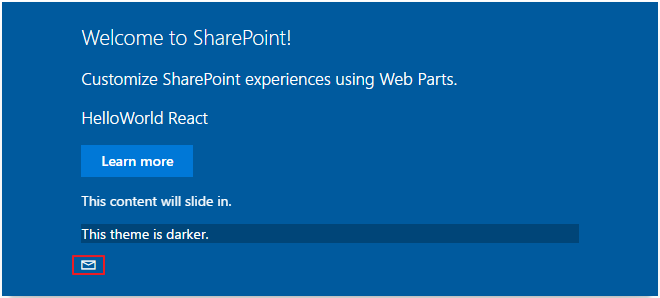

	> **Note**: For more information about **icons**, please check the link [http://dev.office.com/fabric#/styles/icons](http://dev.office.com/fabric#/styles/icons)


#### Font Size ####
Fabric includes 10 base font classes that represent the type ramp for the Office Design Language. Each class sets the text size along with a default weight.

1. Open the **HelloWorldReact.tsx** file.
2. Add the following code to the **render** method.

	````
	<div className="ms-fontSize-xxl">The quick brown fox jumps over the lazy dog</div>
	````
	
	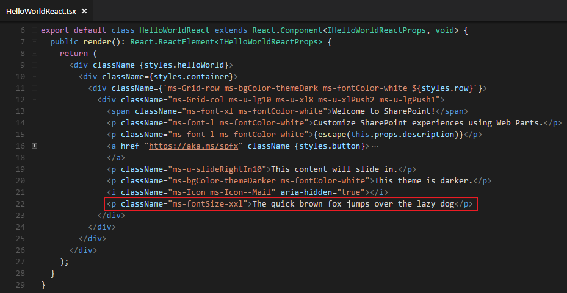

3. Preview the web part in your local workbench and notice the large font size is displayed.

	> **Note**: If you didn't install and trust a developer certificate on your machine, please install it on your machine.
	> 1. Open a **Command Prompt** window and change to the **helloworld-webpart-react** directory.
	> 2. Type **gulp trust-dev-cert** and press **Enter**.

	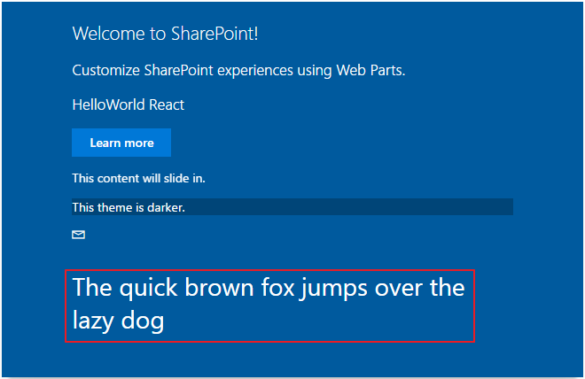

	> **Note**: For more information about **font size**, please check the link [http://dev.office.com/fabric#/styles/typography](http://dev.office.com/fabric#/styles/typography)


#### Grid ####
Fabric comes with a mobile-first, 12-column, responsive grid that you can use to create flexible layouts for a variety of screen sizes and device types.

1. Open the **HelloWorldReact.tsx** file.
2. Add the following code to the **render** method.

	````
	<div className="ms-Grid">
	    <div className="ms-Grid-row">
	      <div className="ms-Grid-col ms-u-sm6 ms-u-md4 ms-u-lg2">
	        <div className="ms-bgColor-neutralDark">A</div>
	      </div>
	      <div className="ms-Grid-col ms-u-sm6 ms-u-md8 ms-u-lg10">
	        <div className="ms-bgColor-neutralDark">B</div>
	      </div>
	    </div>
	</div>
	````
	
	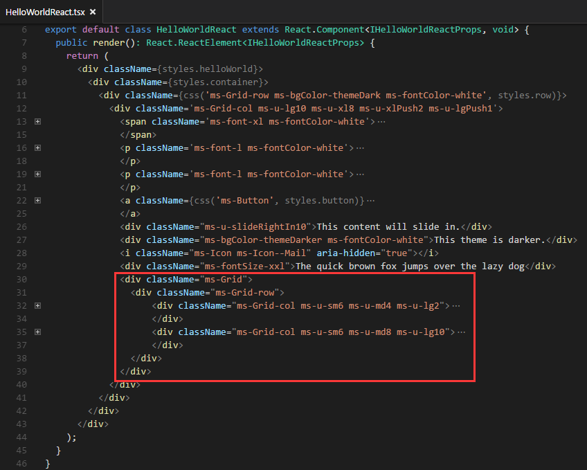

3. Preview the web part in your local workbench and notice the grid is displayed differently depending how wide your web browser width is.

	> **Note**: If you didn't install and trust a developer certificate on your machine, please install it on your machine.
	> 1. Open a **Command Prompt** window and change to the **helloworld-webpart-react** directory.
	> 2. Type **gulp trust-dev-cert** and press **Enter**.

	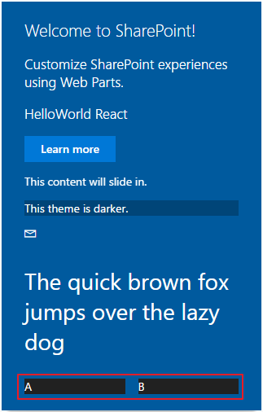

	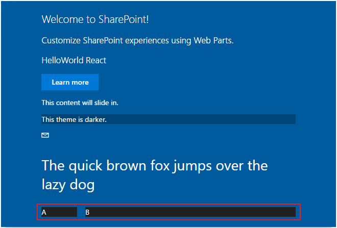

	> **Note**: For more information about **grid**, see [http://dev.office.com/fabric#/styles/layout](http://dev.office.com/fabric#/styles/layout)

### Exercise 2: Office UI Fabric React ###
In this exercise you will enhance the **HelloWorldReact** web part created in [Getting Started with the SharePoint Framework (SPFx)](../Module-1/Lab.md) to work with Office UI Fabric Components.

Fabric has a variety of components, including navigation, commands, containers, and content. In this exercise you will use **Button**, **Navigation** and **Panel** components.

To learn about additional components see [http://dev.office.com/fabric#/components](http://dev.office.com/fabric#/components). 

#### Button ####
1. Open the **HelloWorldReact** web part project you modified in **Exercise 1** in Visual Studio Code, or your preferred IDE.
2. Open **HelloWorldReact.tsx** file.
3. Add the following code to import the **Button** and **ButtonType** Office UI Fabric React Components from `office-ui-fabric-react`.

	````
	import { Button, ButtonType } from 'office-ui-fabric-react';
	````

	

4. Replace the **render** method with the following code.

	````
	public render(): JSX.Element {
	    return (
	      <div>
	        <div className='ms-BasicButtonsExample'>
	          <Button
	            data-automation-id='test'>Normal button</Button>
	          <Button
	            data-automation-id='test'
	            buttonType={ ButtonType.primary } onClick={ this._buttonOnClickHandler.bind(this) }>Primary button</Button>
	        </div>
	      </div>
	    );
	}
	````

	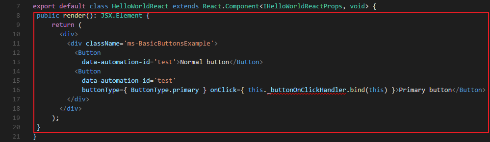

	>**Note:** This code uses the Office UI React Button component to create buttons.  The second Button component has an event handler assigned to the onClick event.

5. Add the following code to the **HelloWorldReact** class.

	````
	private _buttonOnClickHandler() {
    	alert('You clicked the primary button');
    	return false;
  	}
	````

	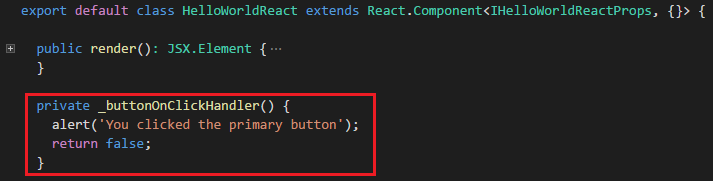

	>**Note:** This code implements the event handler assigned to the onClick event for the second Button component.  It displays an alert.

6. Save the file.
7. Preview the web part in your local workbench and notice the button is displayed.

	> **Note**: If you didn't install and trust a developer certificate on your machine, please install it on your machine.
	> 1. Open a **Command Prompt** window and change to the **helloworld-webpart-react** directory.
	> 2. Type **gulp trust-dev-cert** and press **Enter**.

	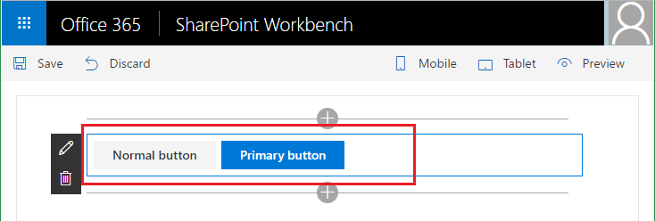

7. Click on the **Primary button** to trigger the alert dialog.

	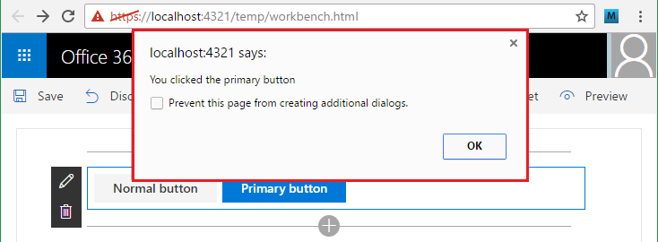


#### Navigation ####
1. Open the **HelloWorldReact.tsx** file.
2. Add the following code to import the **Nav** Office UI Fabric React Component from `office-ui-fabric-react`.

	````
	import { Button, ButtonType, Nav } from 'office-ui-fabric-react';
	````

	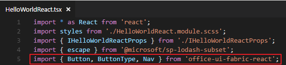

3. Add the following code to the **render** method.

	````
	<div className='ms-NavExample-LeftPane'>
          <Nav
            groups={
              [
                {
                  links:
                  [
                    {
                    name: 'Home',
                    url: 'http://example.com',
                    links: [{
                      name: 'Activity',
                      url: 'http://msn.com'
                      },
                      {
                        name: 'News',
                        url: 'http://msn.com'
                      }],
                    isExpanded: true
                    },
                    { name: 'Documents', url: 'http://example.com', isExpanded: true },
                    { name: 'Pages', url: 'http://msn.com' },
                    { name: 'Notebook', url: 'http://msn.com' },
                    { name: 'Long Name Test for elipse', url: 'http://msn.com' },
                    { name: 'Edit Link', url: 'http://example.com', iconClassName: 'ms-Icon--Edit' },
                    {
                      name: 'Edit',
                      url: '#',
                      onClick: this._navOnClickHandler,
                      icon: 'Edit'
                    }
                  ]
                }
              ]
            }
            />
    </div>
	````

	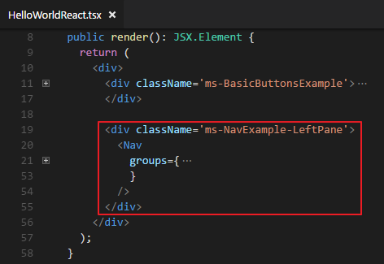

	>**Note:** This code uses the Office UI React Nav component to create a navigation menu.  The links array defines the items in the navigation menu.  Notice the links arrays may contain other links arows that allow you to nest links.  The name property for each item in the linsk array defines what is rendered in the web browser, the url property defines the url for the link, the iconClassName and icon properties defines the icons displayed next to the links; the last two items in the list use this.  The last item in the menu has an event handler assigned to the onClick event.

4. Add the following code to the **HelloWorldReact** class.

	````
	private _navOnClickHandler() {
	    alert('You clicked the edit button in navigation');
	    return false;
	}
	````

	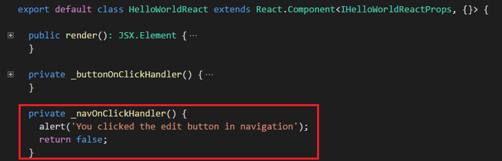

	>**Note:** This code implements the event handler assigned to the onClick event for the last link in the Nav component.  It displays an alert.

5. Save the file.
6. Preview the web part in your local workbench and notice the navigation is displayed.

	> **Note**: If you didn't install and trust a developer certificate on your machine, please install it on your machine.
	> 1. Open a **Command Prompt** window and change to the **helloworld-webpart-react** directory.
	> 2. Type **gulp trust-dev-cert** and press **Enter**.

	

7. Click the **Edit** link to display the alert dialog.

	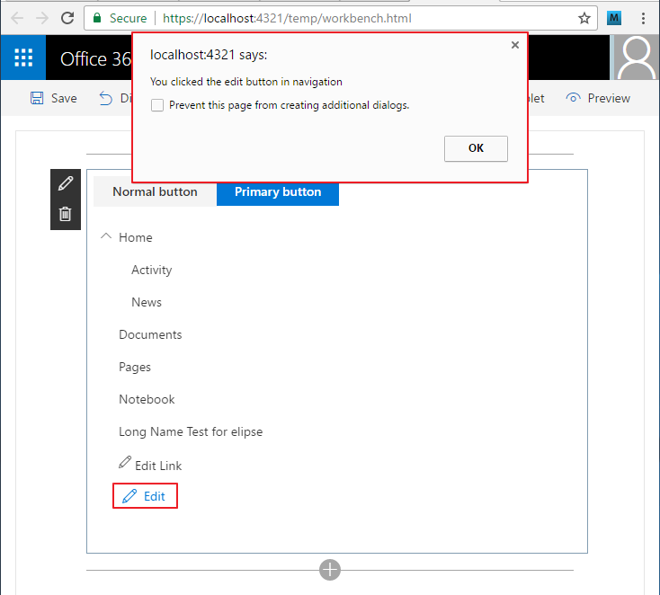

#### Panel ####
1. Open the **HelloWorldReact.tsx** file.
2. Add the following code to import the **Panel** and **PanelType** Office UI Fabric React Components from `office-ui-fabric-react`.

	````
	import { Button, ButtonType, Nav, Panel, PanelType } from 'office-ui-fabric-react';
	````

	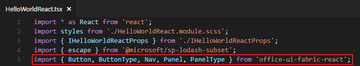

3. Change the `void` parameter in the **HelloWorldReact** class to `any`.

	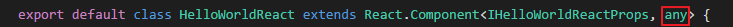

4. Add the following code to the **HelloWorldReact** class.

	````
	constructor() {
	    super();
	    this.state = {
	      showPanel: false
	    };
	}
	````

	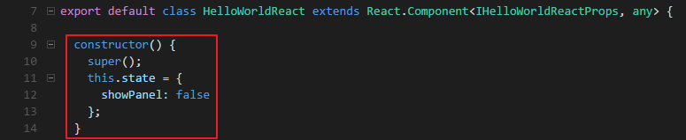

	>**Note:** This code hides the Panel component when the web part is initially loaded.  
>
5. Add the following code to the **render** method.

	````
	<div className='ms-PanelExample'>
          <Button description='Opens the Sample Panel' onClick={ this._showPanel.bind(this) }>Open Panel</Button>
          <Panel
            isOpen={ this.state.showPanel }
            type={ PanelType.smallFixedFar }
            onDismiss= { this._closePanel.bind(this) }
            headerText='Panel - Small, right-aligned, fixed'>
            <span className='ms-font-m'>Content goes here.</span>
          </Panel>
    </div>
	````

	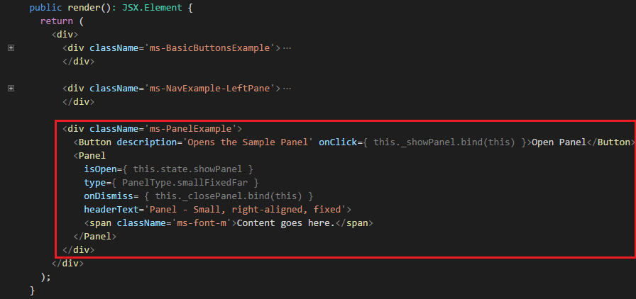

	>**Note:** This code uses an Office UI React Nav Button component and a Panel component to demonstrate how to show and hide a Panel.  The Button component has an event handler assigned to the onClick event.  The Panel component has an event handler assigned to the onDismiss event.

6. Add the following code to the **HelloWorldReact** class.

	````
	private _showPanel() {
		this.setState( {showPanel: true } );
	}
	````

	````
	private _closePanel() {
		this.setState( {showPanel: false } );
	}
	````

	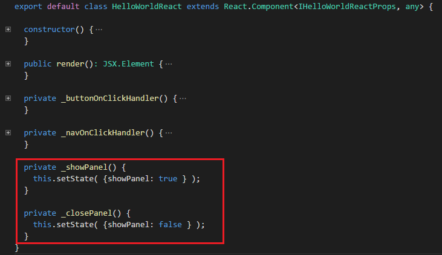

	>**Note:** This code implements the event handlers assigned to the onClick event for the button component and the onDismiss event for the panel component.  The event handlers show and hide the panel.

7. Save the file.
8. Preview the web part in your local workbench.
	
	> **Note**: If you didn't install and trust a developer certificate on your machine, please install it on your machine.
	> 1. Open a **Command Prompt** window and change to the **helloworld-webpart-react** directory.
	> 2. Type **gulp trust-dev-cert** and press **Enter**.

9. Choose the **Open Panel** button to display the panel.

	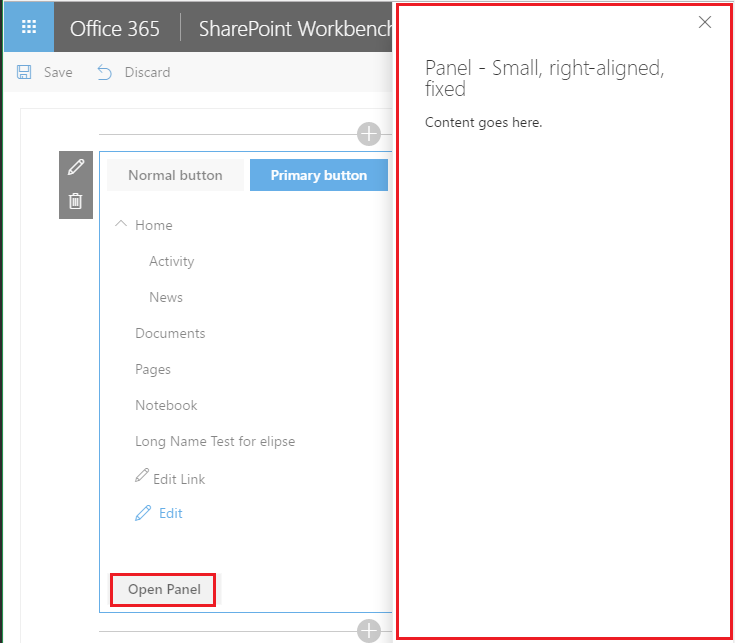
