# Working with different JavaScript frameworks and libraries #
In this lab, you will enhance the web parts created in the [Getting Started with the SharePoint Framework (SPFx)](../Module-1/Lab.md) module.  First, you will implement CRUD operations on SharePoint data in both Angular and Knockout client-side web parts.  Then you will use multiple JavaScript libraries (jQuery, Chartist, Moment) to manipulate the SharePoint data and render it in a chart.

## Prerequisites ##
Make sure you have completed the procedures in the following sections of [Getting Started with the SharePoint Framework (SPFx)](../Module-1/Lab.md) module: 
- [Setup development environment](../Module-1/Lab.md#setup-development-environment)
- [Setup Office 365 tenant](../Module-1/Lab.md#setup-office-365-tenant)

## Exercise 1: Implement CRUD operations in a SPFx client-side web part with the Angular 1.x framework ##
In this exercise, you will use the [Module-1/Demos/Exercise 3/helloworld-webpart-angular1](../Module-1/Demos/Exercise 3/helloworld-webpart-angular1) starter project. This is the same project created in [Module 1 - Exercise 3](../Module-1/Lab.md#exercise-3-create-a-hello-world-web-part-in-angular-1x).

#### Prerequisites ####
Create a list in your Office 365 developer tenant's developer site.

1. Go to your Office 365 developer tenant's developer site.

	> **Notes**:  If you followed the instructions in the [Getting Started with the SharePoint Framework (SPFx)](../Module-1/Lab.md) module, the developer site is located at **https://&lt;TENANCY&gt;.sharepoint.com/sites/dev**.  Replace the **&lt;TENANCY&gt;** placeholder with the name of your Office 365 Developer tenancy.

2. Choose the gear icon on the top nav bar on the right, then choose **Add an app** to go to your Apps page.
3. Choose **Custom List**.
4. In the popup window, enter a name in the name textbox(e.g. **Test**).
5. Choose the **Create** button to create the list.
6. Add some items for the list.

### Implement Angular application. ###

1. Copy the [Module-1/Demos/Exercise 3/helloworld-webpart-angular1](../Module-1/Demos/Exercise 3/helloworld-webpart-angular1) starter project to a proper directory.  For example **c:\SPFX\helloworld-webpart-angular1**

	> **Note:** Directory paths can become quite long after node modules are imported.  **We suggest you use a directory name without spaces in it and create it in the root folder of your drive.**  This will make working with the web part easier in the future and protect you from potential issues associated with long file paths.

2. Open a Command Prompt window.
3. Change to the directory where you copied the [Module-1/Demos/Exercise 3/helloworld-webpart-angular1](../Module-1/Demos/Exercise 3/helloworld-webpart-angular1) starter project.
4. Install all the npm packages the web part project depends on by executing the following command:
	
	````shell
	npm install
	````

5. Open the web part project in Visual Studio Code, or your preferred IDE.

	>**Note:** To open in Visual Studio Code enter **code .** on the command line.

	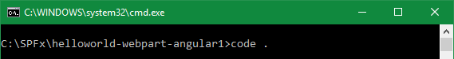

6. Create a folder named **app** under the **src/webparts/helloWorldAngular1** directory.

	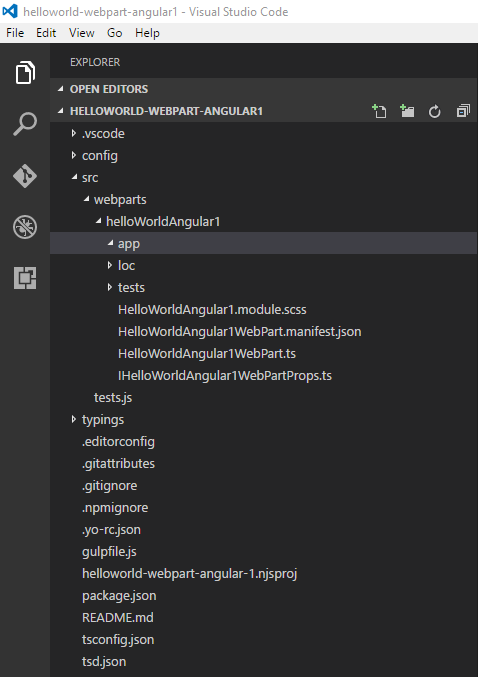

#### Implement the Angular data service ####

7. In the newly created **app** folder, create a new file named **DataService.ts**. Paste the following code into the file:

	>**Note:** This code imports Angular.
	
	````typescript
	import * as angular from 'angular';
	````

	>**Note:** This code defines the interface to the SharePoint list used in this exercise.

	````typescript
	export interface IListItem {
	  Id: number;
	  Title: string;
	}
	````

	>**Note:** This code defines the interface to the Data Service used in this exercise.

	````typescript	
	export interface IDataService {
	  getListItems: (siteUrl: string, listName: string) => angular.IPromise<IListItem[]>;
	  addListItem: (listTitle: string, siteUrl: string, listName: string) => angular.IPromise<number>;
	  updateListItem: (item: IListItem, siteUrl: string, listName: string) => angular.IPromise<{}>;
	  deleteListItem: (item: IListItem, siteUrl: string, listName: string) => angular.IPromise<number>;
	}
	````

	>**Note:** This code implements the Data Service interface. It contains public methods to read all items, add a new item, update and delete an item in the SharePoint list.  It also contains 2 private methods used by the public methods.

	````typescript	
	export default class DataService implements IDataService {
	  public static $inject: string[] = ['$q', '$http'];
	
	  constructor(private $q: angular.IQService, private $http: angular.IHttpService) {
	  }

	  public getListItems(siteUrl: string, listName: string): angular.IPromise<IListItem[]> {
	    const deferred: angular.IDeferred<IListItem[]> = this.$q.defer();
	
	    const url: string = `${siteUrl}/_api/web/lists/getbytitle('${listName}')/items?$select=Id,Title&$orderby=ID desc`;
	
	    this.$http({
	      url: url,
	      method: 'GET',
	      headers: {
	        'Accept': 'application/json'
	      }
	    }).then((result: angular.IHttpPromiseCallbackArg<{ value: IListItem[] }>): void => {
	      const items: IListItem[] = [];
	      for (let i: number = 0; i < result.data.value.length; i++) {
	        const item: IListItem = result.data.value[i];
	        items.push(item);
	      }
	      deferred.resolve(items);
	    }, (err: any): void => {
	      deferred.reject(err);
	    });
	
	    return deferred.promise;
	  }
	
	  public addListItem(listTitle: string, siteUrl: string, listName: string): angular.IPromise<number> {
	    const deferred: angular.IDeferred<{}> = this.$q.defer();
	
	    let listItemEntityTypeFullName: string = undefined;
	    this.getListItemEntityTypeFullName(siteUrl, listName)
	      .then((entityTypeName: string): angular.IPromise<string> => {
	        listItemEntityTypeFullName = entityTypeName;
	        return this.getRequestDigest(siteUrl);
	      })
	      .then((requestDigest: string): void => {
	        const body: string = JSON.stringify({
	          '@odata.type': listItemEntityTypeFullName,
	          'Title': listTitle
	        });
	        this.$http({
	          url: `${siteUrl}/_api/web/lists/getbytitle('${listName}')/items`,
	          method: 'POST',
	          headers: {
	            'odata-version': '4.0',
	            'accept': 'application/json',
	            'content-type': 'application/json',
	            'X-RequestDigest': requestDigest
	          },
	          data: body
	        }).then((result: angular.IHttpPromiseCallbackArg<{Id: number}>): void => {
	          deferred.resolve(result.data.Id);
	        }, (err: any): void => {
	          deferred.reject(err);
	        });
	      });
	
	    return deferred.promise;
	  }
	
	  public updateListItem(item: IListItem, siteUrl: string, listName: string): angular.IPromise<{}> {
	    const deferred: angular.IDeferred<{}> = this.$q.defer();
	
	    let listItemEntityTypeFullName: string = undefined;
	    this.getListItemEntityTypeFullName(siteUrl, listName)
	      .then((entityTypeName: string): angular.IPromise<string> => {
	        listItemEntityTypeFullName = entityTypeName;
	        return this.getRequestDigest(siteUrl);
	      })
	      .then((requestDigest: string): void => {
	        const body: string = JSON.stringify({
	          '@odata.type': listItemEntityTypeFullName,
	          'Title': item.Title
	        });
	        this.$http({
	          url: `${siteUrl}/_api/web/lists/getbytitle('${listName}')/items(${item.Id})`,
	          method: 'POST',
	          headers: {
	            'odata-version': '4.0',
	            'accept': 'application/json',
	            'content-type': 'application/json',
	            'X-RequestDigest': requestDigest,
	            'IF-MATCH': '*',
	            'X-HTTP-Method': 'MERGE'
	          },
	          data: body
	        }).then((result: angular.IHttpPromiseCallbackArg<{}>): void => {
	          deferred.resolve();
	        }, (err: any): void => {
	          deferred.reject(err);
	        });
	      });
	
	    return deferred.promise;
	  }
	
	  public deleteListItem(item: IListItem, siteUrl: string, listName: string): angular.IPromise<number> {
	    const deferred: angular.IDeferred<{}> = this.$q.defer();
	
	    this.getRequestDigest(siteUrl)
	      .then((requestDigest: string): void => {
	        this.$http({
	          url: `${siteUrl}/_api/web/lists/getbytitle('${listName}')/items(${item.Id})`,
	          method: 'POST',
	          headers: {
	            'Accept': 'application/json',
	            'X-RequestDigest': requestDigest,
	            'IF-MATCH': '*',
	            'X-HTTP-Method': 'DELETE'
	          }
	        }).then((result: angular.IHttpPromiseCallbackArg<{}>): void => {
	          deferred.resolve();
	        });
	      });
	
	    return deferred.promise;
	  }
	
	  private getRequestDigest(siteUrl: string): angular.IPromise<string> {
	    const deferred: angular.IDeferred<string> = this.$q.defer();
	
	    this.$http({
	      url: siteUrl + '/_api/contextinfo',
	      method: 'POST',
	      headers: {
	        'Accept': 'application/json'
	      }
	    }).then((result: angular.IHttpPromiseCallbackArg<{ FormDigestValue: string }>): void => {
	      deferred.resolve(result.data.FormDigestValue);
	    }, (err: any): void => {
	      deferred.reject(err);
	    });
	
	    return deferred.promise;
	  }
	
	  private getListItemEntityTypeFullName(siteUrl: string, listName: string): angular.IPromise<string> {
	    const deferred: angular.IDeferred<string> = this.$q.defer();
	
	    this.$http({
	      url: `${siteUrl}/_api/web/lists/getbytitle('${listName}')?$select=ListItemEntityTypeFullName`,
	      method: 'GET',
	      headers: {
	        'Accept': 'application/json'
	      }
	    }).then((result: angular.IHttpPromiseCallbackArg<{ ListItemEntityTypeFullName: string }>): void => {
	      deferred.resolve(result.data.ListItemEntityTypeFullName);
	    }, (err: any): void => {
	      deferred.reject(err);
	    });
	
	    return deferred.promise;
	  }
	}
	````

	

8. Save the file.
9. Implement the controller that will facilitate communication between the view and the data service. In the **app** folder create a new file named **HomeController.ts**, then add the following code to it:

	````typescript
	import * as angular from 'angular';
	import { IDataService, IListItem } from './DataService';
	
	export default class HomeController {
	  public isAdding: boolean = false;
	  public hasError: boolean = false;
	  public message: string = "";
	  public newItem: string = null;
	  public listItems: IListItem[] = [];
	  private siteUrl: string = undefined;
	  private listName: string = undefined;
	
	  public static $inject: string[] = ['DataService', '$window', '$rootScope'];
	
	  constructor(private dataService: IDataService,
	    private $window: angular.IWindowService,
	    $rootScope: angular.IRootScopeService) {
	    const vm: HomeController = this;
	
	    $rootScope.$on('init',
	      (event: angular.IAngularEvent,
	        args: {
	          siteUrl: string;
	          listName: string;
	        }): void => {
	        vm.init(args.siteUrl, args.listName);
	      });
	  }
	
	  public showAddNew(show: boolean): void {
	    this.isAdding = show;
	    if (!show) {
	      this.newItem = null;
	    }
	  }
	
	  public addNewItem(): void {
	    this.dataService.addListItem(this.newItem, this.siteUrl, this.listName)
	      .then((Id: number): void => {
	        this.listItems.unshift({Id: Id, Title: this.newItem});
	        this.newItem = null;
	        this.message = "Add succeeded";
	        this.hasError = false;
	      },
	      (error: any): void => {
	        this.message = "Add failed";
	        this.hasError = true;
	      });
	  }
	
	  public updateItem(item: IListItem): void {
	    this.dataService.updateListItem(item, this.siteUrl, this.listName)
	      .then((): void => {
	        this.message = "Update succeeded";
	        this.hasError = false;
	      },
	      (error: any): void => {
	        this.message = "Update failed";
	        this.hasError = true;
	      });
	  }
	
	  public deleteItem(item: IListItem): void {
	    this.dataService.deleteListItem(item, this.siteUrl, this.listName)
	      .then((Id: number): void => {
	        const index: number = this.listItems.indexOf(item);
	        if (index > -1) {
	          this.listItems.splice(index, 1);
	        }
	        this.message = "Delete succeeded";
	        this.hasError = false;
	      },
	      (error: any): void => {
	        this.message = "Delete failed";
	        this.hasError = true;
	      });
	  }
	
	  private init(siteUrl: string, listName: string): void {
	    let siteUrlValid: boolean = false;
	    let listNameValid: boolean = false;
	    if (siteUrl != undefined && siteUrl != null && siteUrl.length > 0) {
	      this.siteUrl = siteUrl;
	      siteUrlValid = true;
	    }
	    if (listName != undefined && listName != null && listName.length > 0) {
	      this.listName = listName;
	      listNameValid = true;
	    }
	    if (siteUrlValid && listNameValid) {
	      this.loadListItems();
	    }
	  }
	
	  private loadListItems(): void {
	    this.message = "Loading...";
	    this.dataService.getListItems(this.siteUrl, this.listName)
	      .then((items: IListItem[]): void => {
	        this.listItems = items;
	        this.message = "Load succeeded";
	        this.hasError = false;
	      },
	      (error: any): void => {
	        this.message = "Load failed";
	        this.hasError = true;
	      });
	  }
	}
	````

	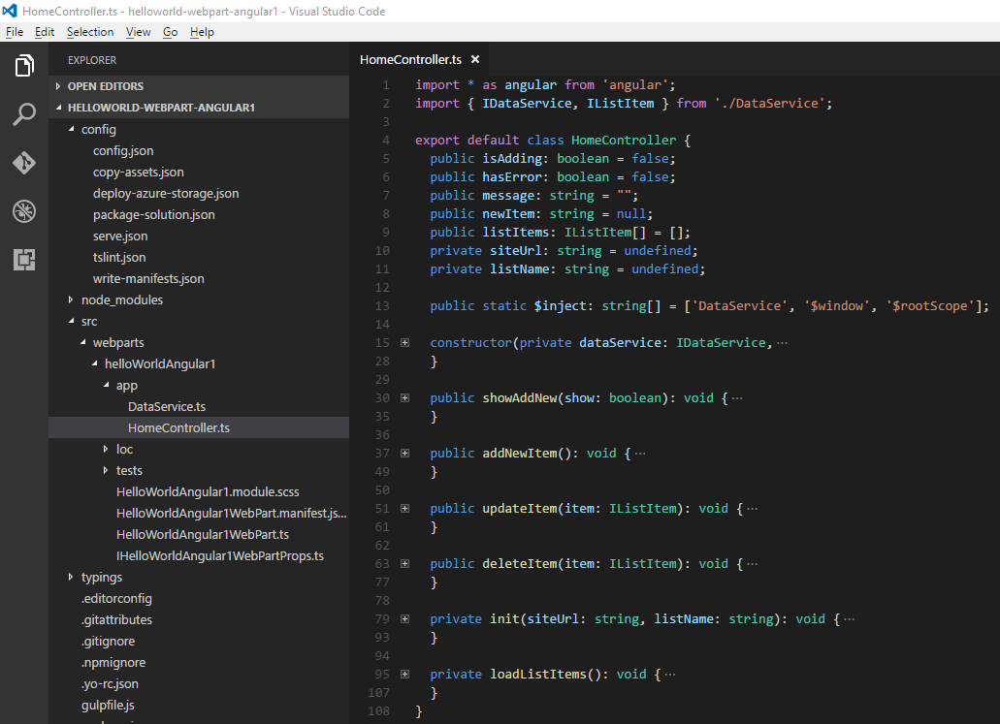

	Using Angular's dependency injection the data service is injected into the controller. The controller implements a number of methods that are exposed to the view model and will be called from the template for CRUD operations.

10. Save the file.

The data service and the controller are now implemented.  The next steps is to define the main module for the application and register the data service and controller with it.

11. In the **app** folder create a new file named **app-module.ts**, then add the following code to it:

	````typescript
	import * as angular from 'angular';
	import HomeController from './HomeController';
	import DataService from './DataService';
	
	const angularApp: angular.IModule = angular.module('angularApp', []);
	
	angularApp
	  .controller('HomeController', HomeController)
	  .service('DataService', DataService);
	````

	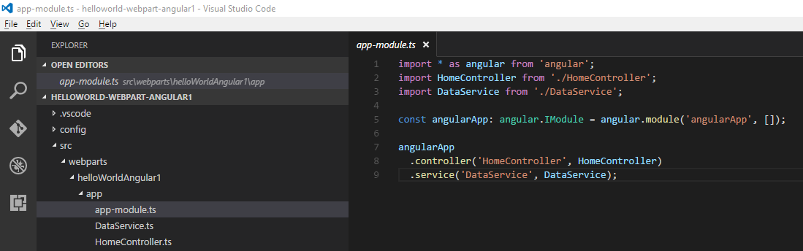

12. Save the file.

### Register the Angular application with the web part ###

1. In the code editor, open the **HelloWorldAngular1WebPart.ts** file, then add the following code after the **import** directives.

	````typescript
	import * as angular from 'angular';
	import './app/app-module';
	````

	

	This code allows loads a reference to Angular and the Angular application created in previous steps. Both of these items are necessary to bootstrap the Angular application.

	> **Note:** The IntelliSense error associated with the **HelloworldAngular1.module.scss** file will disappear after you build the project when the compiler generates the **HelloworldAngular1.module.scss.ts** file.

2. Add the following code at the beginning of **HelloWorldAngularWebPart** class:

	````typescript
	private $injector: ng.auto.IInjectorService;
	private listName: string = "Test";
	````

	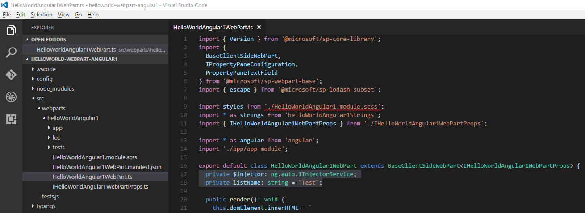

	> **Note:** This first line in this code snippet enables the ability to broadcast events to the Angular application.
	 
	> **IMPORTANT!**  Make sure the value of the **listName** member matches the name of the list you created in your Office 365 developer tenant's developer site.

3. Replace the existing **render** method in the web part with the following code to enhance the user interface to accommodate this sample scenario:

	````typescript
	public render(): void {
	  if (!this.renderedOnce) {
	    this.domElement.innerHTML = `
	        <div class="${styles.helloWorld}" ng-controller="HomeController as vm">
	          <div class="${styles.container}">
	            <div class="ms-Grid-row ms-bgColor-themeDark ms-fontColor-white ${styles.row}">
	              <p class='ms-font-l'>There are {{vm.listItems.length}} item(s) in {{vm.listName}} list</p>
	              <table>
	                  <thead ng-show="vm.listItems.length > 0">
	                      <tr>
	                          <th>Title</th>
	                          <th />
	                          <th />
	                      </tr>
	                  </thead>
	                  <tbody>
	                    <tr ng-repeat="item in vm.listItems">
	                      <td><input class='ms-TextField-field' ng-model="item.Title" /></td>
	                      <td>
	                        <button class="${styles.button}" ng-click="vm.updateItem(item)">
	                          <label class="${styles.label}">Update</label>
	                        </button>
	                      </td>
	                      <td>
	                        <button class="${styles.button}" ng-click="vm.deleteItem(item)">
	                          <label class="${styles.label}">Delete</label>
	                        </button>
	                      </td>
	                    </tr>
	                  </tbody>
	              </table>
	            </div>
	            <div class="ms-Grid-row ms-bgColor-themeDark ms-fontColor-white ${styles.row}" ng-show="vm.isAdding">
	              <table>
	                <tr>
	                  <td><input class='ms-TextField-field' ng-model="vm.newItem" /></td>
	                  <td>
	                    <button class="${styles.button}" ng-click="vm.addNewItem()">
	                      <label class="${styles.label}">Add</label>
	                    </button>
	                  </td>
	                  <td>
	                    <button class="${styles.button}" ng-click="vm.showAddNew(false)">
	                      <label class="${styles.label}">Cancel</label>
	                    </button>
	                  </td>
	                </tr>
	              </table>
	            </div>
	            <div class="ms-Grid-row ms-bgColor-themeDark ms-fontColor-white ${styles.row}">
	              <button class="${styles.button}" ng-click="vm.showAddNew(true)">
	                <label class="${styles.label}">Add New Item</label>
	              </button>
	            </div>
	            <div class="ms-Grid-row ms-bgColor-themeDark ms-fontColor-white ${styles.row}">
	              <p class='ms-font-l' ng-class="vm.hasError ? 'ms-fontColor-red': 'ms-fontColor-white'">{{vm.message}}</p>
	            </div>
	          </div>
	        </div>`;
	
	    this.$injector = angular.bootstrap(this.domElement, ['angularApp']);
	  }
	}
	````

	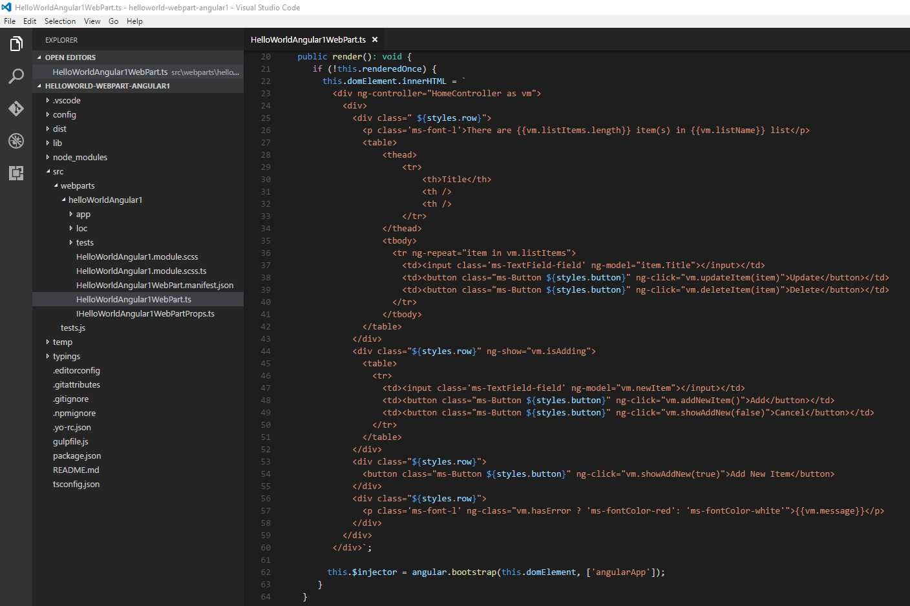

	>**Note:** The code first assigns the template associated with the custom Angular application directly to the web part's DOM element. 
	>
	>The name of the controller that will handle events and data binding in the template is set on the root element.
	>
	>The application is bootstrapped using the angularApp name previously used when the main module was declared. 
	>
	>The renderedOnce web part property ensures that the Angular application is bootstrapped only once. Without it, if one of the web part's properties changed, the render method would be invoked again bootstrapping the Angular application.  This would lead to errors.

4. Add the following code at the end of the **render** method to initialize the Angular application:

	````typescript
	this.$injector.get('$rootScope').$broadcast('init', {
      siteUrl: this.context.pageContext.web.absoluteUrl,
      listName: this.listName
    });
	````

	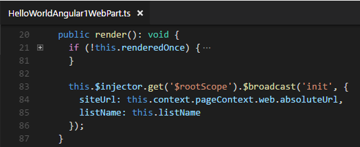

	>**Note:** This code broadcasts an **init** event to the Angular application.  The Angular application initializes itself after it receives the event.

5. Remove the following statement at the beginning section of the file as it's not used any more:

	````typescript
	import { escape } from '@microsoft/sp-lodash-subset';
	````

6. Save the file.

<a name="exercise-1-preview-the-web-part"></a>
### Preview the web part in the SharePoint workbench on your Office 365 developer site ###

1. Switch to the **Command Prompt** window. Make sure you are still in the web part project directory.
2. If you haven't installed and trusted a developer certificate, do it by executing the following command.

	````shell
	gulp trust-dev-cert
	````

	> **Note:** The client-side toolchain uses HTTPS endpoint by default. However, since a default certificate is not configured for the local dev environment, your browser will report a certificate error. The command above installs and trusts a developer certificate used by HTTPS endpoint.
	> 
	> You only need to do this once per machine, not once per project. If you have done this in another project, please ignore this step.

2. Start the local server by executing the following command:

	````shell
	gulp serve
	````

	> **Note:** Mozilla Firefox doesn't trust self-signed certificate. If you're using Mozilla Firefox, you will need to choose **Advanced** and add an exception to proceed to the website.
	> 
	> If you have already done this or you're not using Mozilla Firefox, you can run **gulp serve --nobrowser**, which will not automatically launch the Web Part Workbench.

3. Open your browser and go to the **workbench** page on your Office 365 Developer Site.

	> **Notes**: 
	> If you followed the instructions in the [Getting Started with the SharePoint Framework (SPFx)](../Module-1/Lab.md) module, the SharePoint workbench on your Office 365 developer site is located at **https://&lt;TENANCY&gt;.sharepoint.com/sites/dev/_layouts/workbench.aspx**.  Replace the &lt;TENANCY&gt; placeholder with the name of your Office 365 Developer tenancy.
	> 
	> The web part assets will be loaded from the local environment. In order to load the scripts hosted on your local computer, you need to enable the browser to load unsafe scripts. Depending on the browser you are using, make sure you enable loading unsafe scripts for this session. For more information, please see [Getting Started with the SharePoint Framework (SPFx)](../Module-1/Lab.md)

4. Add the web part **HelloWorld Angular 1** to the page and notice the list items are displayed with Update, Delete, and Add New Item buttons.

	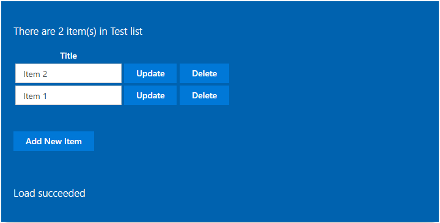

<a name="exercise-1-test-the-web-part"></a>
### Test the client-side web part ###
1. In the workbench page, use the client-side web part to add new items, update and delete existing items. Then, go to the list to see the results. 
3. In the list, add new items, update and delete existing items in the list. Then, refresh the workbench page to see the results.

## Exercise 2: Implement CRUD operations in a SPFx client-side web part with the Knockout framework ##
In this exercise, you will use the [Module-1/Demos/Exercise 4/helloworld-webpart-knockout](../Module-1/Demos/Exercise 4/helloworld-webpart-knockout) starter project. This is the same project created in  [Module 1 - Exercise 4](../Module-1/Lab.md#exercise-4-create-a-hello-world-web-part-in-knockout).

#### Prerequisites ####
This exercises uses the same list created in [Exercise 1](#exercise-1-implement-crud-operations-in-a-spfx-client-side-web-part-with-the-angular-1-x-framework).  Create this list if it does not already exist in your environment. Add some items for the list if it's empty.

### Implement the Knockout view model ###

1. Copy the [Module-1/Demos/Exercise 4/helloworld-webpart-knockout](../Module-1/Demos/Exercise 4/helloworld-webpart-knockout) starter project to a proper directory.  For example **c:\SPFX\helloworld-webpart-knockout**

	> **Note:** Directory paths can become quite long after node modules are imported.  **We suggest you use a directory name without spaces in it and create it in the root folder of your drive.**  This will make working with the web part easier in the future and protect you from potential issues associated with long file paths.

2. Open a Command Prompt window.
3. Change to the directory where you copied the [Module-1/Demos/Exercise 4/helloworld-webpart-knockout](../Module-1/Demos/Exercise 4/helloworld-webpart-knockout) starter project.
4. Install all the npm packages the web part project depends on by executing the following command:
	
	````shell
	npm install
	````

5. Open the web part project in Visual Studio Code, or your preferred IDE.

	>**Note:** To open in Visual Studio Code enter **code .** on the command line.

	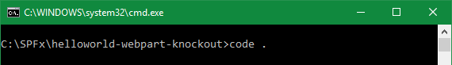

6. Open the **HelloWorldKnockoutViewModel.ts** file. Add the following code after the **import** directives.

	````typescript
	import { IWebPartContext } from '@microsoft/sp-webpart-base';
	import { SPHttpClient, SPHttpClientResponse } from '@microsoft/sp-http';
	````

	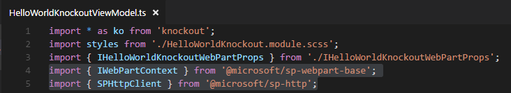

	> **Note:** The IntelliSense error associated with the **HelloworldKnockout.module.scss** file will disappear after you build the project when the compiler generates the **HelloworldKnockout.module.scss.ts** file.

7. Change the declaration of the **IHelloWorldKnockoutBindingContext** interface to the following:

	````typescript
	export interface IHelloWorldKnockoutBindingContext extends IHelloWorldKnockoutWebPartProps {
	  shouter: KnockoutSubscribable<{}>;
	  context: IWebPartContext;
	}
	````

	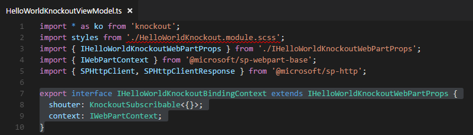

8. Add interfaces to the SharePoint list by adding the following code after the declaration of  the **IHelloWorldKnockoutBindingContext** interface.

	````typescript
	export interface IlistItems {
	  value: IlistItem[];
	}
	
	export interface IlistItem {
	  Id: number;
	  Title: string;
	}
	````

	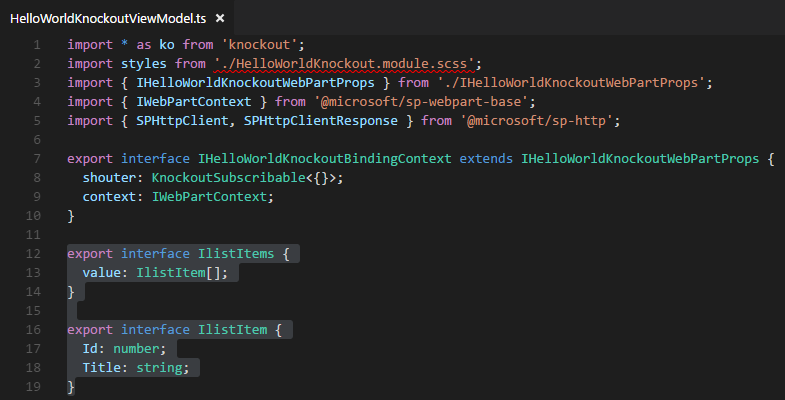

9. Add the following code at the beginning of the definition of **HelloWorldKnockoutViewModel**:

	````typescript
	private _context: IWebPartContext;
	private _listName: string = "Test";
	private _listItemEntityTypeFullName: string;
	````

	> **IMPORTANT!**  Make sure the value of the **_listName** member matches the name of the list you created in your Office 365 developer tenant's developer site.

	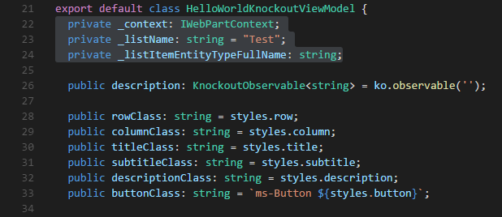

10. Add the following code after the **KnockoutObservable** members:

	> **Note:** These properties are used to bind the UI.

	````typescript
	public listName: KnockoutObservable<string> = ko.observable(this._listName);
	public listItems: KnockoutObservableArray<IlistItem> = ko.observableArray([]);
	public isAdding: KnockoutObservable<boolean> = ko.observable(false);
	public hasError: KnockoutObservable<boolean> = ko.observable(false);
	public message: KnockoutObservable<string> = ko.observable('');
	public newItemTitle: KnockoutObservable<string> = ko.observable('');
	````

	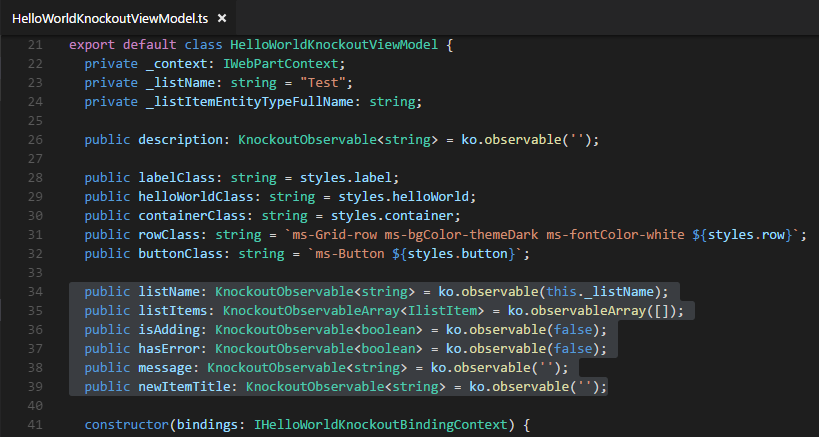

11. Add the following private methods after the **constructor**:

	> **Note:** This method returns the full name of entity type of list item of the list specified by the **_listName** member.

	````typescript
	private _getListItemEntityTypeFullName(): Promise<string> {
	  if (this._listItemEntityTypeFullName) {
	    return Promise.resolve(this._listItemEntityTypeFullName);
	  }
	
	  return this._context.spHttpClient.get(this._context.pageContext["web"]["absoluteUrl"]
	    + `/_api/web/lists/GetByTitle('${this._listName}')`, SPHttpClient.configurations.v1)
	    .then((response: SPHttpClientResponse) => {
	      return response.json();
	    })
	    .then((value) => {
	      this._listItemEntityTypeFullName = value["ListItemEntityTypeFullName"];
	      return this._listItemEntityTypeFullName;
	    });
	}
	````

	> **Note:** This method returns all the list items in the list specified by the **_listName** member.
	
	````typescript
	private _getListItems(): Promise<IlistItems> {
	  return this._context.spHttpClient.get(this._context.pageContext["web"]["absoluteUrl"]
	    + `/_api/web/lists/GetByTitle('${this._listName}')/items?$select=Id,Title`, SPHttpClient.configurations.v1)
	    .then((response: SPHttpClientResponse): Promise<any> => {
	      return response.json();
	    })
	    .then((data: any): IlistItems => {
	      this.message("Load succeeded");
	      this.hasError(false);
	      const listData: IlistItems = { value: data["value"] };
	      return listData;
	    },
	    (error: any) => {
	      this.message("Load failed");
	      this.hasError(true);
	    }) as Promise<IlistItems>;
	}
	````

	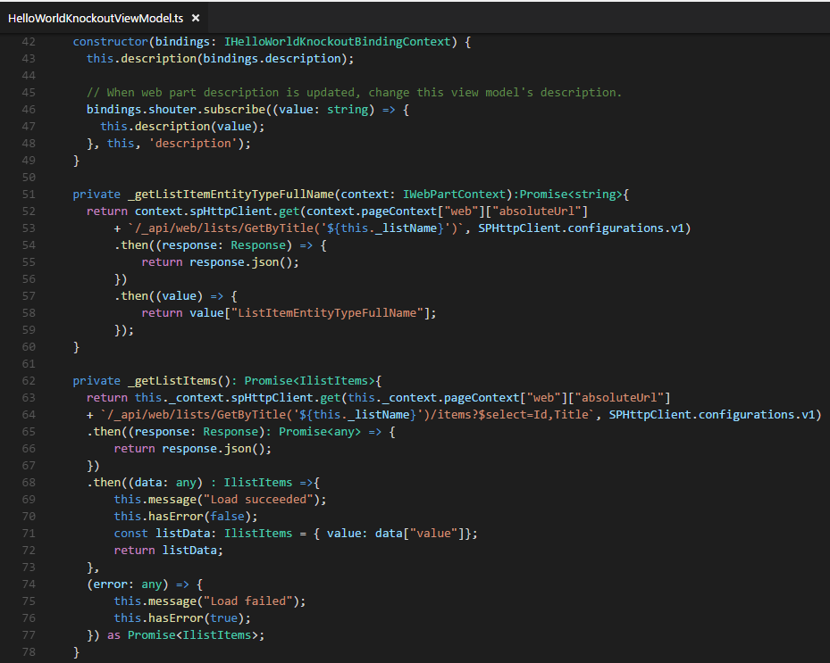

12. Add the public methods that will be bound to the knockout template by adding the following code after the **constructor**:

	>**Note:** This method fires when the Add New Item button is clicked.  It adds the controls to accommodate a new list item to the page.

	````typescript
	public showAddNew = (show: boolean): void => {
	  this.isAdding(show);
	  if (!show) {
	    this.newItemTitle("");
	  }
	}
	````

	>**Note:** This method fires when the Add button is clicked.  It invokes the SharePoint REST API and creates a new item in the list specified by the **_listName** member.

    ````typescript
	public addListItem = (): void => {
	  this._getListItemEntityTypeFullName()
	    .then((listItemEntityTypeFullName: string) => {
	      const newItemTitle: string = this.newItemTitle();
	      const reqJSON: any = JSON.parse(
	        `{
	        "@odata.type": "${this._listItemEntityTypeFullName}",
	        "Title": "${newItemTitle}"
	      }`);
	
	      this._context.spHttpClient.post(
	        this._context.pageContext["web"]["absoluteUrl"] +
	        `/_api/web/lists/GetByTitle('${this._listName}')/items`,
	        SPHttpClient.configurations.v1,
	        {
	          body: JSON.stringify(reqJSON),
	          headers: {
	            "accept": "application/json",
	            "content-type": "application/json"
	          }
	        })
	        .then((response: SPHttpClientResponse): Promise<any> => {
	          return response.json();
	        })
	        .then((data: any) => {
	          this.listItems.push({ Id: data["Id"], Title: newItemTitle });
	          this.newItemTitle("");
	          this.message("Add succeeded");
	          this.hasError(false);
	        },
	        (error: any) => {
	          this.message("Add failed");
	          this.hasError(true);
	        });
	    });
	}
    ````

	>**Note:** This method fires when the Update button is clicked.  It invokes the SharePoint REST API and updates an existing list item in the list specified by the **_listName** member.

	````typescript
	public updateListItem = (item: IlistItem): void => {
	  this._getListItemEntityTypeFullName()
	    .then((listItemEntityTypeFullName: string) => {
	      const reqJSON: any = {
	        "@odata.type": this._listItemEntityTypeFullName,
	        "Title": item.Title
	      };
	
	      this._context.spHttpClient.post(
	        this._context.pageContext["web"]["absoluteUrl"] +
	        `/_api/web/lists/GetByTitle('${this._listName}')/items(${item.Id})`,
	        SPHttpClient.configurations.v1,
	        {
	          body: JSON.stringify(reqJSON),
	          headers: {
	            "IF-MATCH": "*",
	            "X-HTTP-Method": "MERGE",
	            "accept": "application/json",
	            "content-type": "application/json"
	          }
	        })
	        .then(() => {
	          this.message("Update succeeded");
	          this.hasError(false);
	        },
	        (error: any) => {
	          this.message("Update failed");
	          this.hasError(true);
	        });
	    });
	}
	````

	>**Note:** This method fires when the Delete button is clicked.  It invokes the SharePoint REST API and deletes an existing list item in the list specified by the **_listName** member.

	````typescript
	public removeListItem = (item: IlistItem): void => {
	  this._context.spHttpClient.post(
	    this._context.pageContext["web"]["absoluteUrl"] +
	    `/_api/web/lists/GetByTitle('${this._listName}')/items(${item.Id})`,
	    SPHttpClient.configurations.v1,
	    {
	      headers: {
	        "IF-MATCH": "*",
	        "X-HTTP-Method": "DELETE",
	        "accept": "application/json",
	        "content-type": "application/json"
	      }
	    })
	    .then((): void => {
	      this.listItems.remove(item);
	      this.message("Remove succeeded");
	      this.hasError(false);
	    },
	    (error: any) => {
	      this.message("Remove failed");
	      this.hasError(true);
	    });
	}
	````

	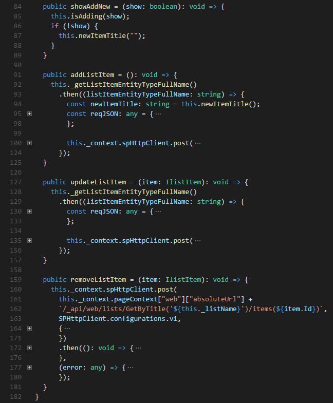

13. Add the following code at the end of the **constructor** to initialize the private data members and the page:

	````typescript
	this._context = bindings.context;
	this._getListItems()
	.then((data: IlistItems) => {
	  this.listItems(data.value);
	});
	````

	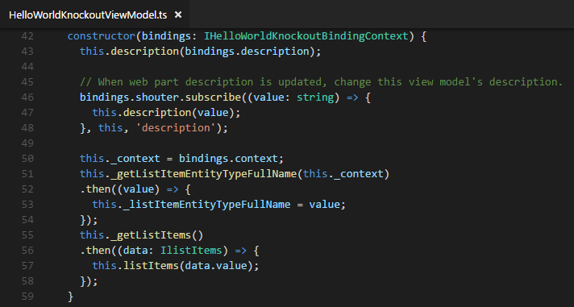

14. Save the file.
15. Open the **HelloWorldKnockoutWebPart.ts** file. Replace the **const bindings** in the **onInit** method with the following code:

	````typescript
	const bindings: IHelloWorldKnockoutBindingContext = {
      description: this.properties.description,
      context: this.context,
      shouter: this._shouter
    };
	````

	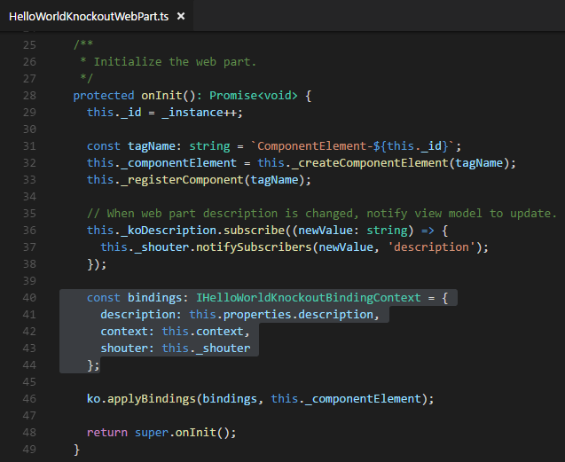

16. Save the file.

### Implement the Knockout template ###

1. Open the **HelloWorldKnockout.template.html** file. Replace the content with the following code:

	````html
	<div data-bind="attr: {class: helloWorldClass}">
	  <div data-bind="attr: {class: containerClass}">
	    <div data-bind="attr: {class:rowClass}">
	      <p class='ms-font-l ms-fontColor-white'>There are <span class="ms-fontWeight-semibold" data-bind='text: listItems().length'></span> item(s) in <span class="ms-fontWeight-semibold"
	          data-bind='text: listName'></span> list</p>
	      <table>
	        <thead>
	          <tr>
	            <th class='ms-font-l ms-fontColor-white'>Title</th>
	            <th />
	            <th />
	          </tr>
	        </thead>
	        <tbody data-bind="foreach: listItems">
	          <tr>
	            <td><input class='ms-TextField-field' data-bind="{value: Title}" /></td>
	            <td>
	              <button data-bind="attr: {class: $parent.buttonClass}, click: $parent.updateListItem">
	                <label class="attr: {class: $parent.labelClass}">Update</label>
	              </button>
	            </td>
	            <td>
	              <button data-bind="attr: {class: $parent.buttonClass}, click: $parent.removeListItem">
	                <label class="attr: {class: $parent.labelClass}">Delete</label>
	              </button>
	            </td>
	          </tr>
	        </tbody>
	      </table>
	    </div>
	    <div data-bind="attr: {class:rowClass}, visible: isAdding">
	      <table>
	        <tr>
	          <td><input class='ms-TextField-field' data-bind="value: newItemTitle" /></td>
	          <td>
	            <button data-bind="attr: {class: buttonClass}, click: addListItem">
	              <label class="attr: {class: labelClass}">Add</label>
	            </button>
	          </td>
	          <td>
	            <button data-bind="attr: {class: buttonClass}, click: showAddNew.bind(null, false)">
	              <label class="attr: {class: labelClass}">Cancel</label>
	            </button>
	          </td>
	        </tr>
	      </table>
	    </div>
	    <div data-bind="attr: {class:rowClass}">
	      <button data-bind="attr: {class: buttonClass}, click: showAddNew.bind(null, true)">
	        <label class="attr: {class: labelClass}">Add New Item</label>
	      </button>
	    </div>
	    <div data-bind="attr: {class:rowClass}">
	      <p class="ms-font-l" data-bind="{ css: hasError() ? 'ms-fontColor-red' : 'ms-fontColor-white', text: message }"></p>
	    </div>
	  </div>
	</div>
	````

2. Save the file.
 
### Preview the web part in the SharePoint workbench on your Office 365 developer site ###
Repeat the steps in [**Exercise 1 - Preview the web part in the SharePoint workbench on your Office 365 developer site**](#preview-the-web-part-in-the-sharepoint-workbench-on-your-office-365-developer-site).

> **Note:** add the **HelloWorld Knockout** web part to the workbench page.

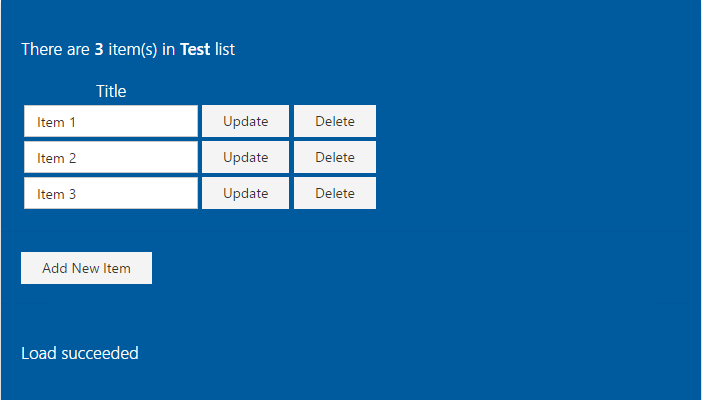

### Test the client-side web part ###
Repeat the steps in [**Exercise 1 - Test the client-side web part**](#test-the-client-side-web-part).

## Exercise 3: Use different JavaScript libraries (jQuery, Chartist, Moment) in a SPFx client-side web part ##
In this exercise, you will use the [Module-1/Demos/Exercise 5/helloworld-webpart-jquery](../Module-1/Demos/Exercise 5/helloworld-webpart-jquery) starter project. This is the same project created in [Module 1 - Exercise 5](../Module-1/Lab.md#exercise-5-create-a-hello-world-web-part-with-jquery).

#### Prerequisites ####

1. Follow the steps in the Prerequisites section of [Exercise 1](#exercise-1-implement-crud-operations-in-a-spfx-client-side-web-part-with-the-angular-1-x-framework) to create another list named **Tasks**.
2. After the list is created, configure the list to use the Task Content Type.
   1. Choose the list name to go to the list.
   2. Choose the gears icon on the top nav bar on the right, then choose **List Settings**.
   2. In the **General Settings** section, choose **Advanced Settings**.
   3. In the **Allow management of content types?** field, choose **Yes**.
   4. Choose **OK** at the bottom of the page.
   5. In the **Content Types** section, choose **Add from existing site content types**.
   6. In the **Available Site Content Types:** list, choose **Task**, then choose **Add**.
      
	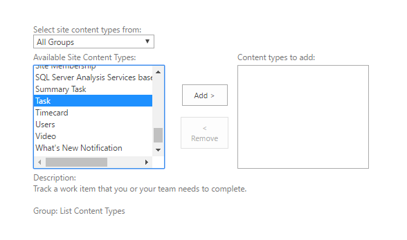

   7. Choose **OK** to add the content type.
   8. In the **Content Types** section, choose **Item**.
   9. Choose **Delete this content type**, then choose **OK** on the confirmation box to delete the content type.
3. Add some items for the list.
   1. In the breadcrumb bar, choose the **Tasks** to go back to the list.
      
	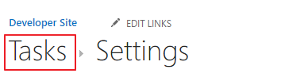

   2. At the top of the list, choose **New**.
     
	

   3. Enter a task name in the **Task Name** field.
   4. Choose a date for the **Start Date** field.
   5. Choose **SHOW MORE** to show detail information.
     
	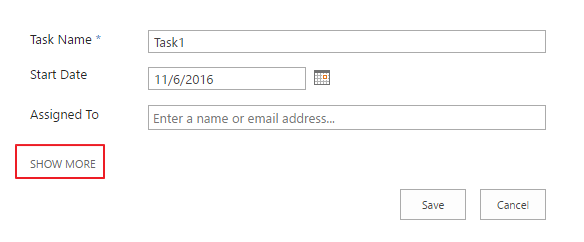

   6. Choose a date for the **Due Date** field.
   7. Choose a value for the **Task Status** field.
     
	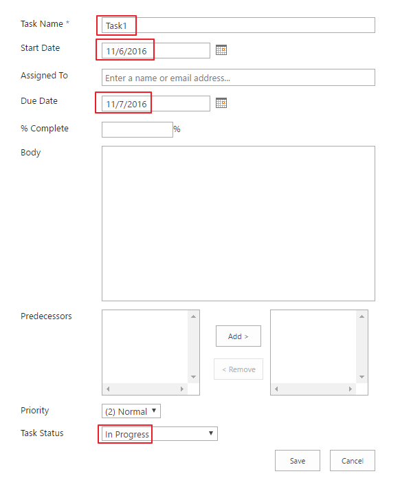

   8. Choose **Save** to create the task.
   9. Add more items by repeating step#1-step#8. 
   
   >**IMPORTANT Note:** Make sure you create tasks with at least 2 different statuses. 

### Install the jQueryUI, Chartist and Moment libraries ###

1. Copy the [Module-1/Demos/Exercise 5/helloworld-webpart-jquery](../Module-1/Demos/Exercise 5/helloworld-webpart-jquery) starter project to a proper directory. For example **c:\SPFX\helloworld-webpart-jquery**

	> **Note:** Directory paths can become quite long after node modules are imported.  **We suggest you use a directory name without spaces in it and create it in the root folder of your drive.**  This will make working with the web part easier in the future and protect you from potential issues associated with long file paths.

2. Open a Command Prompt window.
3. Change to the directory where you copied the [Module-1/Demos/Exercise 5/helloworld-webpart-jquery](../Module-1/Demos/Exercise 5/helloworld-webpart-jquery) starter project.
4. Install all the npm packages the web part project depends on by executing the following command:

	````shell
	npm install
	````

4. Install jQueryUI, Chartist and Moment libraries by executing the following commands:
 
	````shell
	npm install jqueryui --save
	npm install chartist --save
	npm install moment --save
	````

	> **Note:** The starter project already has the jQuery library  installed.

5. Install the Typescript definitions for the jQueryUI, Chartist by executing the following commands:

	````shell
	npm install @types/jqueryui -D
	npm install @types/chartist -D
	````

	> **Note:** Moment provides its own type definitions, so you don't need @types/moment installed.

### Retrieve data from SharePoint ###

1. Open the web part project in Visual Studio Code, or your preferred IDE.

	>**Note:** To open in Visual Studio Code enter **code .** on the command line.

	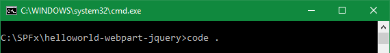

2. Open the **HelloWorldJQueryWebPart.ts** file.
3. Add the following code after the **import** directives to import jquery and jqueryui.

	````typescript
	import { SPHttpClient, SPHttpClientResponse } from '@microsoft/sp-http';
	import * as jQuery from 'jquery';
	import * as Chartist from 'chartist';
	import * as moment from 'moment';
	import 'jqueryui';
	````

	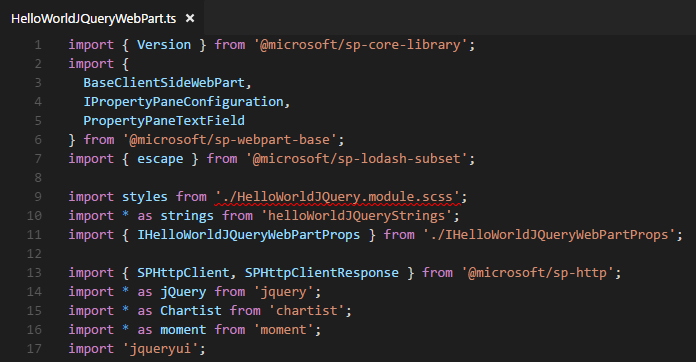

	> **Note:** The IntelliSense error associated with the **HelloWorldJQuery.module.scss** file will disappear after you build the project when the compiler generates the **HelloWorldJQuery.module.scss.ts** file.

4. Define the interface model for list items by adding the following code right before the declaration of the  **HelloWorldJQueryWebPart** class.

	> **Note:** This is the interface to the SharePoint list used in this exercise.

	````typescript
	interface ITask {
	  Id: number;
	  Title: string;
	  StartDate: Date;
	  DueDate: Date;
	  TaskStatus: string;
	}
	````

	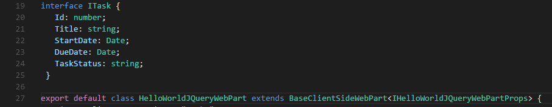

5. Add a private data member by adding the following code at the beginning of the definition of the **HelloWorldJQueryWebPart** class:

	````typescript
	private _listName: string = "Tasks";
	````

	> **IMPORTANT!**  Make sure the value of the **_listName** member matches the name of the tasks list you created in your Office 365 developer tenant's developer site.

	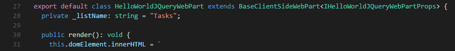

7. Add a method to retrieve list items from the SharePoint list by adding the following code at the end of the **HelloWorldJQueryWebPart** class.

	````typescript
	private getListItems(): Promise<ITask[]> {
	  const url: string = this.context.pageContext["web"]["absoluteUrl"]
	    + `/_api/web/lists/GetByTitle('${this._listName}')/items?$select=Id,Title,StartDate,TaskDueDate,TaskStatus`;
	  return this.context.spHttpClient.get(url, SPHttpClient.configurations.v1)
	    .then((response: SPHttpClientResponse): Promise<any> => {
	      return response.json();
	    })
	    .then((data: any): ITask[] => {
	      return data.value;
	    }) as Promise<ITask[]>;
	}
	````

	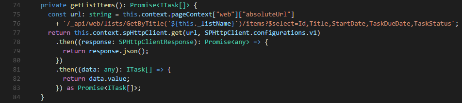

8. Save the file.

### Render the SharePoint list data ###
1. In the code editor, open the **HelloWorldJQuery.module.scss** file, then add the following styles:

	````css
	td {
	  padding:10px;
	}
	
	.pieChartContainer {
	  padding:20px;
	}
	
	.pieChartContainer h3 {
	  text-align: center;
	}
	````

	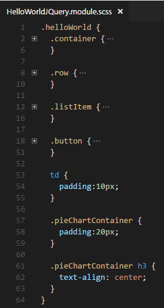

2. Save the file.
3. Open the **HelloWorldJQueryWebPart.ts** file. Add a method to generate the HTML to show the list items in a jQuery accordion and a Chartist chart.

	````typescript
	private renderListItems(items: ITask[]): void {
	  const groupedItems = {};
	  for (const item of items) {
	    if (groupedItems[item.TaskStatus] == undefined) {
	      groupedItems[item.TaskStatus] = [];
	    }
	    groupedItems[item.TaskStatus].push(item);
	  }
	
	  const chartistData = {
	    labels: [],
	    series: []
	  };
	
	  let html: string = '<div class="accordion">';
	  for (const key in groupedItems) {
	    const value = groupedItems[key];
	    html += `<h3>${key}</h3>`;
	    html += '<div><table><thead><tr><td>Task Name</td><td>Start Date</td><td>Due Date</td></tr></thead>';
	    for (const item of value) {
	      html += `<tr><td>${item.Title}</td><td>${moment(item.StartDate).format('MM/DD/YYYY')}</td><td>${moment(item.TaskDueDate).format('MM/DD/YYYY')}</td></tr>`;
	    }
	    html += '</table></div>';
	
	    chartistData.labels.push(key);
	    chartistData.series.push(value.length);
	  }
	  html += '</div>';
	  html += `<div class="${styles.pieChartContainer}"><h3>Pie Chart</h3><div><div class="ct-chart"></div></div></div>`;
	  this.domElement.innerHTML = `<div class="${styles.helloWorld}"><div class="${styles.container}">${html}</div></div>`;
	
	  const accordionOptions: JQueryUI.AccordionOptions = {
	    animate: true,
	    collapsible: false,
	    icons: {
	      header: 'ui-icon-circle-arrow-e',
	      activeHeader: 'ui-icon-circle-arrow-s'
	    }
	  };
	
	  const rootDom = jQuery(this.domElement);
	  rootDom.find('.accordion').accordion(accordionOptions);
	
	  var options = {
	    height: "200px"
	  };
	
	  new Chartist.Pie(rootDom.find(`.${styles.pieChartContainer} .ct-chart`)[0], chartistData, options);
	}
	````

	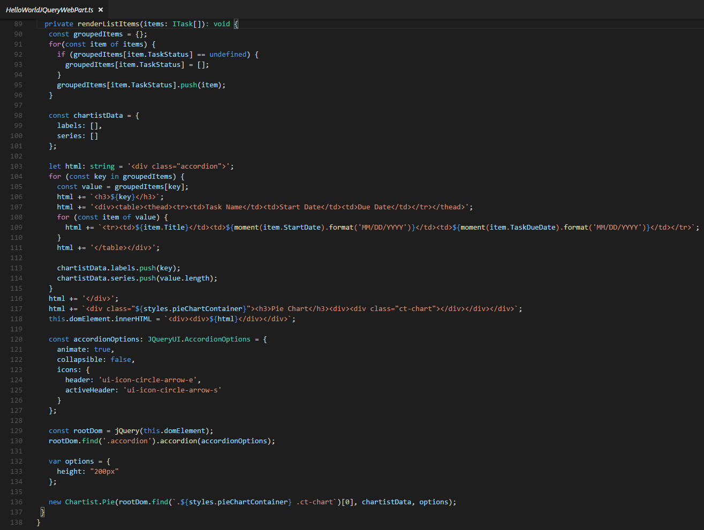

4. Replace the existing **render** method in the web part with the following code to enhance the user interface to accommodate this sample scenario:

	````typescript
	public render(): void {    
      require("../../../node_modules/jqueryui/jquery-ui.css");
      require("../../../node_modules/chartist/dist/chartist.min.css");

	  this.getListItems()
	  .then((items: ITask[]) => {
	    this.renderListItems(items);
	  });
	}
	````

	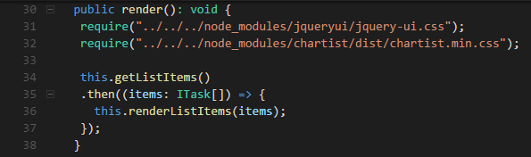

5. Remove the following statement at the beginning section of the file as it's not used any more:

	````typescript
	import { escape } from '@microsoft/sp-lodash-subset';
	````

6. Save the file.

### Preview the web part in the SharePoint workbench on your Office 365 developer site ###

Repeat the steps in [**Exercise 1 - Preview the web part in the SharePoint workbench on your Office 365 developer site**](#exercise-1-preview-the-web-part). 

> **Note:** add the **HelloWorld jQuery** web part to the workbench page.

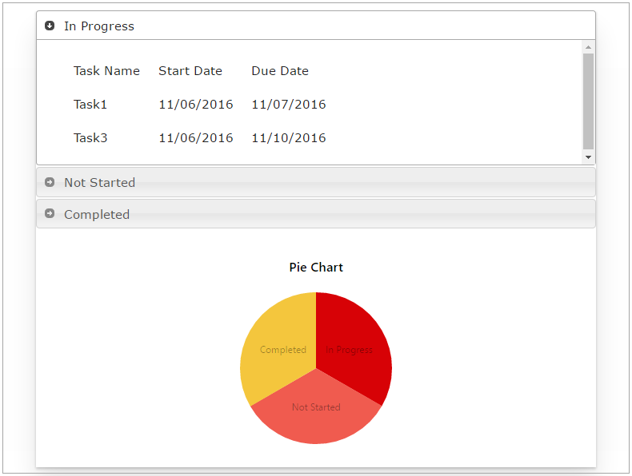

### Test the client-side web part ###
Repeat the steps in [**Exercise 1 - Test the client-side web part**](#exercise-1-test-the-web-part).