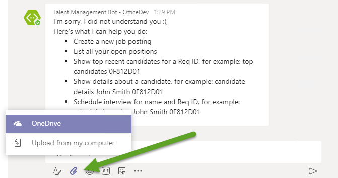
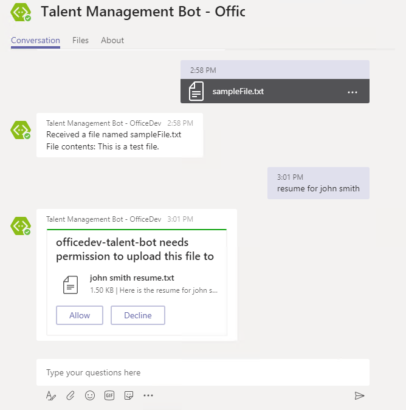

# Demo 1: Sending and receiving files

1. In a private chat with the bot, the message compose area now includes the attachment icon. Clicking the icon presents a context menu with the supported choices for the source of the file.

    

1. Continue to select and upload a file. You must select the send button after the file is uploaded.

1. In a private chat with the bot, issue the command `resume for john smith`. The bot will respond with a **FileConsent** card. The bot can only send files when consent is granted by the user.

1. Once consent is granted, the bot can upload the file to the OneDrive of the user. The bot will display a `FileInfo` card, enabling the user to view the file.

    

1. Navigate to the OneDrive folder of the user. Note that the file sent by the user was first uploaded to the **Microsoft Teams Chat Files** folder before being sent to the bot.

1. In a channel, @ message the bot and issue the command `resume John Smith`. (The actual name specified does not matter, but both a given and surname must be provided.)

1. The bot will respond with a file card. The actual file is added to the OneDrive of the current user, in a folder named after the bot. In this demo, the folder is named **Applications\officedev-talent-management**.