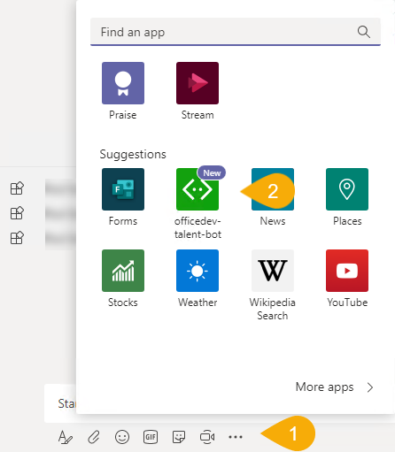
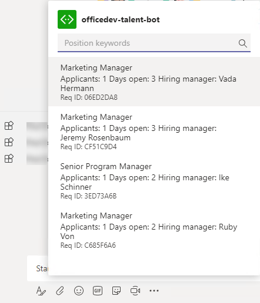
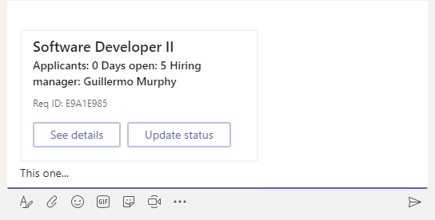

# Demo 2: Messaging Extension

The messaging extension must be invoked in a channel due to the scopes entered in the manifest.

1. The extension is invoked by selecting the **ellipsis** below the compose box and selecting the bot.

    

1. The `initialRun` property of a command  is set to true, so Microsoft Teams will issue a command immediately when the extension is opened.

    

1. Selecting an item in the messaging extension will populate the message compose area the result. The user can then augment the message.

    