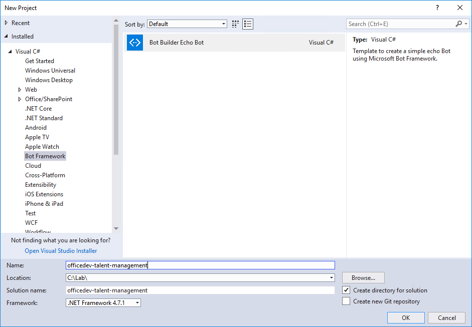
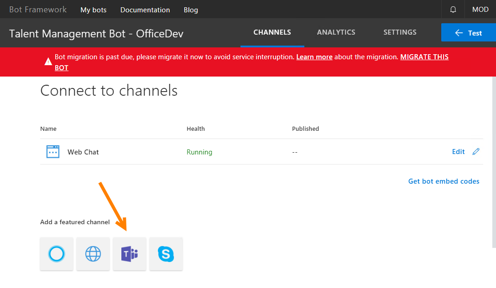
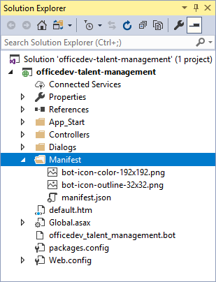
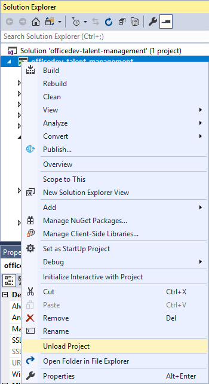
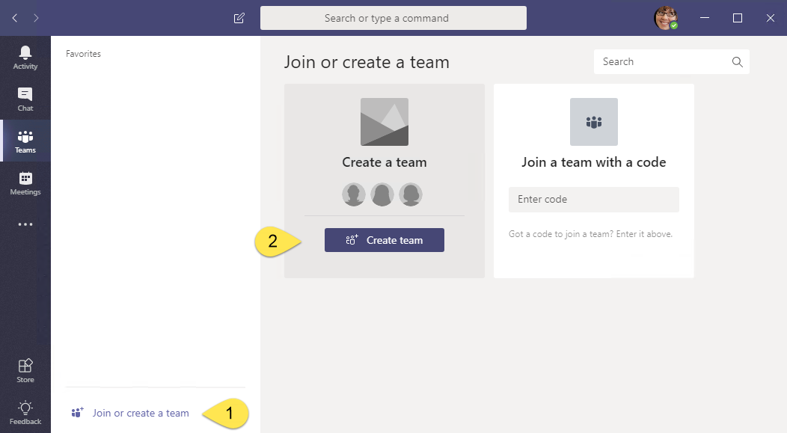
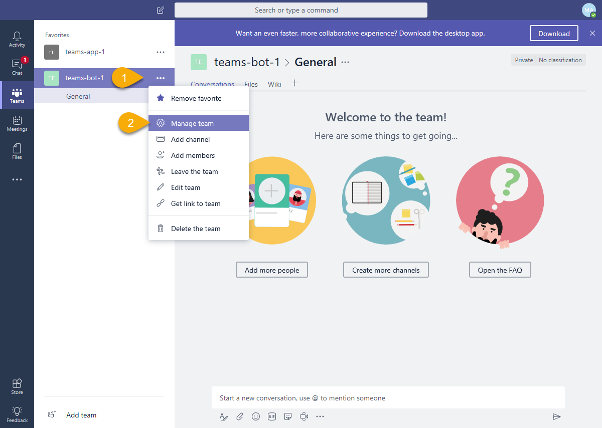
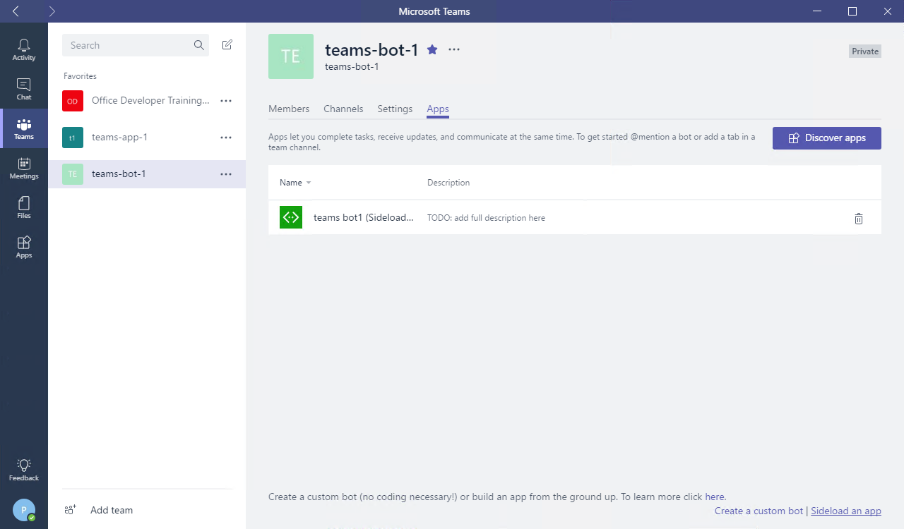
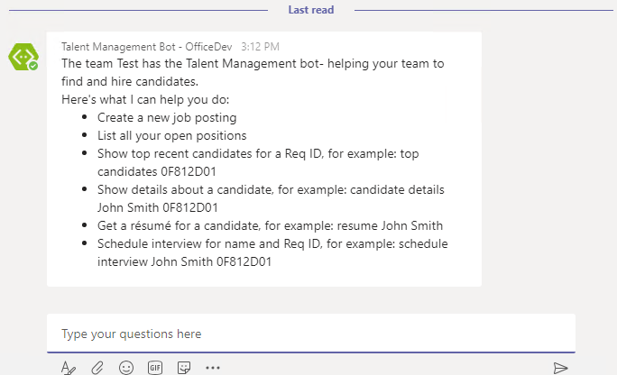
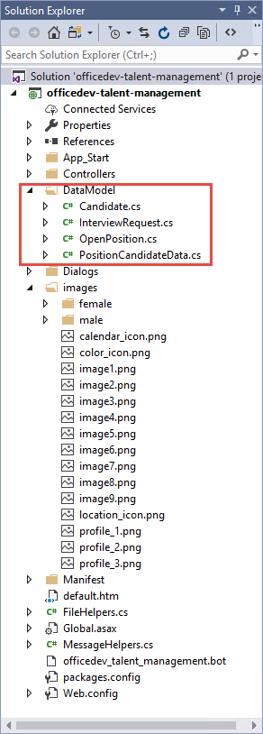
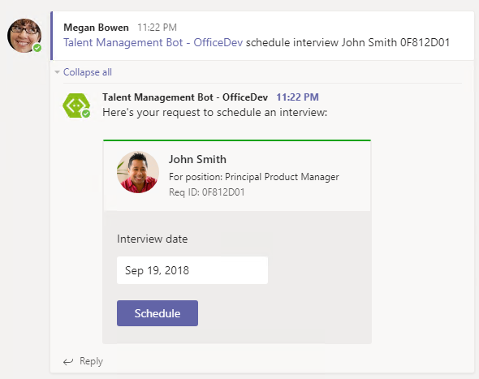

# Lab: Microsoft Teams - Bots, Messaging Extensions, and Cards

In this lab, you will walk through building a bot that demonstrates several capabilities of Microsoft Teams: events, messaging extensions and cards.

## In this lab

- [Bots in Microsoft Teams](#exercise1)
- [Messaging Extensions](#exercise2)
- [Using cards in Microsoft Teams](#exercise3)

## Prerequisites

Developing apps for Microsoft Teams requires preparation for both the Office 365 tenant and the development workstation.

For the Office 365 Tenant, the setup steps are detailed on the [Prepare your Office 365 tenant page](https://docs.microsoft.com/en-us/microsoftteams/platform/get-started/get-started-tenant). Note that while the getting started page indicates that the Public Developer Preview is optional, this lab includes steps that are not possible unless the preview is enabled. Information about the Developer Preview program and participation instructions are detailed on the [What is the Developer Preview for Microsoft Teams? page](https://docs.microsoft.com/en-us/microsoftteams/platform/resources/dev-preview/developer-preview-intro).

### Azure Subscription

The Azure Bot service requires an Azure subscription. A free trial subscription is sufficient.

### Install developer tools

The developer workstation requires the following tools for this lab.

#### Download ngrok

As Microsoft Teams is an entirely cloud-based product, it requires all services it accesses to be available from the cloud using HTTPS endpoints. To enable the exercises to work within Microsoft Teams, a tunneling application is required.

This lab uses [ngrok](https://ngrok.com) for tunneling publicly-available HTTPS endpoints to a web server running locally on the developer workstation. ngrok is a single-file download that is run from a console.

#### Bot template for Visual Studio 2017

Download and install the [bot template for C#](https://github.com/Microsoft/BotFramework-Samples/tree/master/docs-samples/CSharp/Simple-LUIS-Notes-Sample/VSIX) from Github. Additional step-by-step information for creating a bot to run locally is available on the [Create a bot with the Bot Builder SDK for .NET page](https://docs.microsoft.com/en-us/azure/bot-service/dotnet/bot-builder-dotnet-quickstart?view=azure-bot-service-3.0) in the Azure Bot Service documentation.

  > **Note:** This lab uses the BotBuilder v3 SDK. BotBuilder v4 SDK was recently released. All new development should be targeting the BotBuilder v4 SDK. In our next release, this sample will be updated to the BotBuilder v4 SDK.

<a name="exercise1"></a>

## Exercise 1: Bots in Microsoft Teams

This section of the lab creates a bot framework bot and extends it with Microsoft Teams functionality. In this exercise, you will create a bot to respond to events in Microsoft Teams and to use the Microsoft Teams-specific bot APIs to interrogate the context in which the bot is running.

1. Launch **Visual Studio 2017** as an administrator: right-click **Visual Studio 2017** and select **Run as administrator**.

1. In Visual Studio 2017, select **File > New > Project**.

1. Create a new Visual C# project using the **Bot Builder Echo Bot** (**Visual C# > Bot Framework > Bot Builder Echo Bot**).

   

   > **Note:** The template may also be called the **Simple Echo Bot Application** depending when you installed the bot template for Visual Studio.

1. Build the solution to download all configured NuGet packages.

In order to run the bot inside Microsoft Teams:

  - The bot must be accessible from the internet
  - The bot must be registered with the bot connector
  - The `AppId` and `AppPassword` from the bot framework registration page have to be recorded in the project's `web.config`
  - The bot must be added to Microsoft Teams

### Find the project URL

1. In **Solution Explorer** tool window, double-click on **Properties**.

1. In the **Properties** designer, select the **Web** tab.

1. Note the **Project Url**.

    

### Run the ngrok secure tunnel application

1. Open a new **Command Prompt** window.
1. Change to the directory that contains the **ngrok.exe** application.

1. Run the command `ht= http [port] -host-header=localhost:[port]`. Replace `[port]` with the port portion of the URL noted above.

    The ngrok application will fill the entire prompt window. Make note of the forwarding address using HTTPS. This address is required in the next step.

1. Minimize the ngrok command prompt window. It is no longer referenced in this lab, but it must remain running.

    

### Register the bot

1. Open the [Azure Portal](https://portal.azure.com).

1. Select **Create a resource**.

1. In the **Search the marketplace** box, enter `bot`.

1. Choose **Bot Channels Registration**

1. Select the **Create** button.

1. Complete the **Bot Channels Registration** blade. For the **Bot name**, enter a descriptive name.

1. Enter the following address for the **Messaging endpoint**. Replace the token `[from-ngrok]` with the forwarding address displayed in the ngrok window.

    ```
    https://[from-ngrok].ngrok.io/api/Messages
    ```

1. Allow the service to auto-create an application.

1. Select **Create**.

1. When the deployment completes, navigate to the resource in the Azure portal. In the left-most navigation, select **All resources**. In the **All resources** blade, select the Bot Channels Registration.

    

1. In the **Bot Management** section, select **Channels**.

    

1. Click on the Microsoft Teams logo to create a connection to Teams. Select **Save**. Agree to the Terms of Service.

    

#### Record the Bot Channel Registration Bot Id and secret

1. In the **Bot Channels Registration** blade, select **Settings** under **Bot Management**

1. The **Microsoft App Id** is displayed. Record this value.

1. Next to the **Microsoft App Id**, select the **Manage** link. This will open the Application Registration Portal in a new tab. If prompted, select the button titled **View the app in the Azure Portal".

1. In the application blade, select **Certificates & Secrets**.

1. Select **New client secret**.

1. Enter a description and select an expiration interval. Select **Add**.

1. A new secret is created and displayed. Record the new secret.

    

### Configure the web project

The bot project must be configured with information from the registration.

1. In **Visual Studio**, open the **Web.config** file and locate the `<appSettings>` section.

1. Enter the `MicrosoftAppId` from the **Configuration** section of the app registration.

1. Enter the `MicrosoftAppPassword`, the auto-generated app password displayed in the dialog box during app registration.

    > **Note:** If you do not have the app password, the bot must be deleted and re-registered. An app password cannot be reset nor displayed.

### Configure Visual Studio to package bot

Packaging a bot for Microsoft Teams requires that a manifest file and related resources are compressed into a zip file and added to a team.

1. In **Visual Studio** right-click on the project, choose **Add > New Folder**. Name the folder **Manifest**.

1. Add the displayed files from the **[Lab Files](./Lab%20Files)** folder of this lab.

    

1. Open the **manifest.json** file just added to the project. The **manifest.json** file requires several updates:
    - The `id` property must contain the app ID from registration. Replace the token `[microsoft-app-id]` with the app ID.
    - The `packageName` property must contain a unique identifier. The industry standard is to use the bot's URL in reverse format. Replace the token `[from-ngrok]` with the unique identifier from the forwarding address.
    - The `developer` property has three URLs that should match the hostname of the Messaging endpoint. Replace the token `[from-ngrok]` with the unique identifier from the forwarding address.
    - The `botId` property in the `bots` collection property also requires the app ID from registration. Replace the token `[microsoft-app-id]` with the app ID.
    - Save and close the **manifest.json** file.

### Compress the manifest folder

1. In the **Solution Explorer** tool window, right-click on the project and choose **Unload Project**. If prompted, select **Yes** to save changes.

    

1. Right-click on the project file and choose **Edit [project-name].csproj**.

1. Move to the bottom of the file. Add the following target to the file. Be sure to add the target outside of the comment. This target will invoke a custom build task to compress the files in the manifest directory.

    ```xml
    <Target Name="AfterBuild">
      <ZipDir InputBaseDirectory="manifest"
              OutputFileName="$(OutputPath)\$(MSBuildProjectName).zip"
              OverwriteExistingFile="true"
              IncludeBaseDirectory="false" />
    </Target>
    ```

1. Add the following task element to the **.csproj** file.

    ```xml
    <UsingTask TaskName="ZipDir" TaskFactory="CodeTaskFactory"
              AssemblyFile="$(MSBuildToolsPath)\Microsoft.Build.Tasks.v4.0.dll">
      <ParameterGroup>
        <InputBaseDirectory ParameterType="System.String" Required="true" />
        <OutputFileName ParameterType="System.String" Required="true" />
        <OverwriteExistingFile ParameterType="System.Boolean" Required="false" />
        <IncludeBaseDirectory ParameterType="System.Boolean" Required="false" />
      </ParameterGroup>
      <Task>
        <Reference Include="System.IO.Compression" />
        <Reference Include="System.IO.Compression.FileSystem" />
        <Using Namespace="System.IO.Compression" />
        <Code Type="Fragment" Language="cs"><![CDATA[
          if (File.Exists(OutputFileName))
          {
            if (!OverwriteExistingFile)
            {
              return false;
            }
            File.Delete(OutputFileName);
          }
          ZipFile.CreateFromDirectory
          (
            InputBaseDirectory, OutputFileName,
            CompressionLevel.Optimal, IncludeBaseDirectory
          );
        ]]></Code>
      </Task>
    </UsingTask>
    ```

1. Save and close the project file.

1. In the **Solution Explorer** tool window, right-click on the project and choose **Reload Project**.

1. Press **Ctrl+Shift+B** to build the project. The new **AfterBuild target** will run, creating a zip file in the build output folder **bin**.

### Install the Microsoft.Bot.Connector.Teams package

The Microsoft Teams engineering group built and maintains extensions to the Bot Builder SDK. These packages for .Net and Node.js, extend the basic bot builder classes and methods with the following:

- Specialized teams card types like the Office 365 connector card
- Consuming and setting teams-specific channel data on activities
- Processing messaging extension requests
- Handling rate limiting

Both packages install dependencies, including the Bot Builder SDK.

1. In Visual Studio, install the **Microsoft.Bot.Connector.Teams** package via the **Tools > NuGet Package Manager > Package Manager Console**.

    ```powershell
    Install-Package Microsoft.Bot.Connector.Teams
    ```

### Update bot to implement event (system message) handling

The project template creates a messages controller that receives messages from the bot service. This controller checks the incoming activity to determine if it is a user or system message. This step of the lab will implement the system message handling.

1. Open the file **Controllers/MessagesController.cs**.
1. Add the following statements to the top of the file.

    ```cs
    using Microsoft.Bot.Connector.Teams;
    using Microsoft.Bot.Connector.Teams.Models;
    using Polly;
    using System;
    using System.Collections.Generic;
    using System.Linq;
    ```

1. Locate the `HandleSystemMessage` method. Replace the method with the following code. The code is available in the **[Lab Files\HandleSystemMessageAsync.cs](./Lab%20Files/HandleSystemMessageAsync.cs)** file.

    ```cs
    private async Task<Activity> HandleSystemMessageAsync(Activity message)
    {
      TeamEventBase eventData = message.GetConversationUpdateData();
      switch (eventData.EventType)
      {
        case TeamEventType.MembersAdded:
          var connector = new ConnectorClient(new Uri(message.ServiceUrl));
          connector.SetRetryPolicy(
            RetryHelpers.DefaultPolicyBuilder.WaitAndRetryAsync(
              new[] { TimeSpan.FromSeconds(2),
                      TimeSpan.FromSeconds(5),
                      TimeSpan.FromSeconds(10) })
          );

          var tenantId = message.GetTenantId();
          var botAccount = message.Recipient;
          var channelData = message.GetChannelData<TeamsChannelData>();

          // if the bot is in the collection of added members,
          // then send a welcome to all team members
          if (message.MembersAdded.Any(m => m.Id.Equals(botAccount.Id)))
          {
            // Fetch the members in the current conversation
            IList<ChannelAccount> channelAccount =
              await connector.Conversations.GetConversationMembersAsync(
                message.Conversation.Id);
            IEnumerable<TeamsChannelAccount> members =
              channelAccount.AsTeamsChannelAccounts();

            // send a OneToOne message to each member
            foreach (TeamsChannelAccount member in members)
            {
              await MessageHelpers.SendOneToOneWelcomeMessage(
                connector, channelData, botAccount, member, tenantId);
            }
          }
          else
          {
            // send a OneToOne message to new members
            foreach (TeamsChannelAccount member in message.MembersAdded.AsTeamsChannelAccounts())
            {
              await MessageHelpers.SendOneToOneWelcomeMessage(
                connector, channelData, botAccount, member, tenantId);
            }
          }
          break;
        case TeamEventType.MembersRemoved:
          break;
        case TeamEventType.ChannelCreated:
          break;
        case TeamEventType.ChannelDeleted:
          break;
        case TeamEventType.ChannelRenamed:
          break;
        case TeamEventType.TeamRenamed:
          break;
        default:
          break;
      }
      return null;
    }
    ```

1. In the `Post` method, change the call to method `HandleSystemMessage` to call the new method.

    ```cs
    await HandleSystemMessageAsync(activity);
    ```

1. In the **Solution Explorer** tool window, add a new class file named **MessageHelpers** to the project.

1. Add the following statements to the top of the **MessageHelpers.cs** file.

    ```cs
    using Microsoft.Bot.Connector;
    using Microsoft.Bot.Connector.Teams.Models;
    using System.Text;
    using System.Threading.Tasks;
    ```

1. Replace the generated `MessageHelpers` class with the following code. The code is in the **[Lab Files\MessageHelpers.cs](./Lab%20Files/MessageHelpers.cs)** file. (*Note that the help message includes capabilities that are implemented later in this lab.*)

    ```cs
    public class MessageHelpers
    {
      public static string CreateHelpMessage(string firstLine)
      {
        var sb = new StringBuilder();
        sb.AppendLine(firstLine);
        sb.AppendLine();
        sb.AppendLine("Here's what I can help you do:");
        sb.AppendLine();
        sb.AppendLine("* Create a new job posting");
        sb.AppendLine("* List all your open positions");
        sb.AppendLine("* Show top recent candidates for a Req ID, for example: top candidates 0F812D01");
        sb.AppendLine("* Show details about a candidate, for example: candidate John Smith 0F812D01");
        sb.AppendLine("* Get a résumé for a candidate, for example: resume John Smith");
        sb.AppendLine("* Schedule interview for name and Req ID, for example: schedule John Smith 0F812D01");
        return sb.ToString();
        }

      public static async Task SendOneToOneWelcomeMessage(
        ConnectorClient connector,
        TeamsChannelData channelData,
        ChannelAccount botAccount, ChannelAccount userAccount,
        string tenantId)
      {
        string welcomeMessage = CreateHelpMessage($"The team {channelData.Team.Name} has the Talent Management bot- helping your team to find and hire candidates.");

        // create or get existing chat conversation with user
        var response = connector.Conversations.CreateOrGetDirectConversation(botAccount, userAccount, tenantId);

        // Construct the message to post to conversation
        Activity newActivity = new Activity()
        {
          Text = welcomeMessage,
          Type = ActivityTypes.Message,
          Conversation = new ConversationAccount
          {
            Id = response.Id
          },
        };

        // Post the message to chat conversation with user
        await connector.Conversations.SendToConversationAsync(newActivity);
      }
    }
    ```

1. In Visual Studio, press **F5** to build the solution and package and start the web service in the debugger. The debugger will start the default browser, which can be ignored. The next step uses the teams client.

### Upload app into Microsoft Teams

Although not strictly necessary, in this lab the bot will be added to a new team.

1. In the Microsoft Teams application, select the **Add team** link. Then select the **Create team** button.

    

1. Enter a team name and description. In this example, the team is named **teams-bot-1**. Select **Next**.

1. Optionally, invite others from your organization to the team. This step can be skipped in this lab.

1. The new team is shown. In the left-side panel, select the ellipses next to the team name. Choose **Manage team** from the context menu.

    

1. On the Manage team display, select **Apps** in the tab strip. Then select the **Upload a custom app** link at the bottom right corner of the application.

1. Select the zip file from the **bin** folder that represents your app. Select **Open**.

1. The app is displayed. The description and icon for the app is displayed.

    

    The app is now uploaded into the Microsoft Teams application and the bot is available.

    > **Note:** Adding the bot to a team invokes the system message **ConversationUpdated**. The code in `MessageHelpers.cs` determines if the message is in response to the bot being added, and initiates a 1:1 message with each member of the team.

    

### Using the Teams API to receive and send files

A bot can directly send and receive files with users in the personal context using Teams APIs. Files shared in Teams typically appear as cards, and allow rich in-app viewing. This step of the lab demonstrates sending and receiving files. (Files sent to the bot are simply echoed back to the user. To receive a file from the bot, the **resume** command will send a résumé of the specified candidate.)

1. If the **Visual Studio 2017** debugger is still running from the previous step, stop the debugger.

1. Open the **manifest.json** file in the **Manifest** folder.

1. Locate the **bots** node of the document. After the **botId** node, and an entry to indicate the bot supports files. The **bots** node should be similar to the following:

    ```json
    "bots": [
      {
        "botId": "[microsoft-app-id]",
        "supportsFiles": true,
        "scopes": [
          "personal",
          "team"
        ]
      }
    ],
    ```

1. Open the **MessagesController.cs** file in the **Controllers** folder.

1. Locate the `Post` method. Replace the method with the following code.

    ```cs
    public async Task<HttpResponseMessage> Post([FromBody]Activity activity)
    {
      if (activity.GetActivityType() == ActivityTypes.Message)
      {
        await Conversation.SendAsync(activity, () => new Dialogs.RootDialog());
      }
      else if (activity.Type == ActivityTypes.Invoke)
      {
        if (activity.Name == "fileConsent/invoke")
        {
          await HandleFileConsentActivity(activity);
        }
      }
      else
      {
        await HandleSystemMessageAsync(activity);
      }
      var response = Request.CreateResponse(HttpStatusCode.OK);
      return response;
    }
    ```

1. Add the following method to the **MessagesController.cs** file.

    ```cs
    private async Task HandleFileConsentActivity(Activity activity)
    {
      Activity reply;
      try
      {
        reply = await FileHelpers.ProcessFileConsentResponse(activity.Value);
      }
      catch (Exception ex)
      {
        reply = new Activity { Text = ex.ToString() };
      }

      // Production bot would retrieve the message containing the FileConsent card and update it with results.
      // This would prevent the user from consenting again
      //
      //var consentMessageReplyConversationId  = <read from state>
      //var consentMessageReplyId = <read from state>
      //Activity updatedReply = activity.CreateReply(messageText);
      //await connector.Conversations.UpdateActivityAsync(consentMessageReplyConversationId, consentMessageReplyId, updatedReply);

      // sending files happens in personal scope, so send a 1:1 message
      var user = activity.From;
      var bot = activity.Recipient;
      var connector = new ConnectorClient(new Uri(activity.ServiceUrl));
      var tenantId = activity.GetTenantId();

      // create or get existing chat conversation with user
      var response = connector.Conversations.CreateOrGetDirectConversation(bot, user, tenantId);
      reply.Conversation = new ConversationAccount { Id = response.Id };
      // Post the message to chat conversation with user
      await connector.Conversations.SendToConversationAsync(reply);
    }
    ```

1. Open the **RootDialog.cs** file in the **Dialogs** folder.

1. Add the following to the top of the file.

    ```cs
    using Microsoft.Bot.Connector.Teams;
    using Microsoft.Bot.Connector.Teams.Models;
    using Newtonsoft.Json.Linq;
    using System.Collections.Generic;
    using System.Linq;
    ```

1. Locate the `MessageReceivedAsync` method. This is the standard Bot Framework code to respond to a message. Replace the code in the method with this Microsoft Teams Bot extension code.

    ```cs
    var activity = await result as Activity;

    // Strip out all mentions.  As all channel messages to a bot must @mention the bot itself, you must strip out the bot name at minimum.
    // This uses the extension SDK function GetTextWithoutMentions() to strip out ALL mentions
    var text = activity.GetTextWithoutMentions();

    if (text == null && (activity.Attachments != null && activity.Attachments.Count == 0))
    {
      // if the activity is not a system event, and it does not have text or attachment, treat it as a SubmitAction
      //await HandleSubmitAction(context, activity);
    }
    else
    {
      #region Receive file
      // If a file was sent, echo back its name try to read it.
      if (activity.Attachments != null && activity.Attachments.Count > 0)
      {
        foreach (var attachment in activity.Attachments)
        {
          if (attachment.ContentType == FileDownloadInfo.ContentType)
          {
            await context.PostAsync($"Received a file named {attachment.Name}");
            await FileHelpers.ProcessAttachment(attachment, context);
          }
        }
      }
      #endregion

      if (!String.IsNullOrEmpty(text))
      {
        // Check for supported commands
        // This simple text parsing assumes the command is the first token,
        // and parameters are the remainder.
        var split = text.Split(' ');
        // The user is asking for one of the supported commands.
        if (split.Length >= 2)
        {
          var cmd = split[0].ToLower();
          var keywords = split.Skip(1).ToArray();

          #region Commands

          if (cmd.Contains("resume"))
          {
            // Return "resume file" for the given candidate name.
            await HandleResumeCommand(context, keywords);
          }

          #endregion

        }
        else if (text.Contains("help"))
        {
          // Respond with standard help message.
          await MessageHelpers.SendMessage(context, MessageHelpers.CreateHelpMessage("Sure, I can provide help info about me."));
        }
        else if (text.Contains("welcome") || text.Contains("hello") || text.Contains("hi"))
        {
          await MessageHelpers.SendMessage(context, MessageHelpers.CreateHelpMessage("## Welcome to the Contoso Talent Management app"));
        }
        else
        // Don't know what to say so this is the generic handling here.
        {
          await MessageHelpers.SendMessage(context, MessageHelpers.CreateHelpMessage("I'm sorry, I did not understand you :("));
        }
      }
    }
    context.Wait(MessageReceivedAsync);
    ```

1. Below the **MessageReceivedAsync** method, add this method to the **RootDialog** class.

    ```cs
    private static async Task HandleResumeCommand(IDialogContext context, string[] keywords)
    {
      if (keywords.Length > 0)
      {
        string name = string.Join(" ", keywords).ToLower();

        //
        //  Access the file from some storage location and capture its metadata
        //
        var fileID = "abc";
        var fileSize = 1500;

        IMessageActivity reply = context.MakeMessage();
        reply.Attachments = new List<Attachment>();

        JObject acceptContext = new JObject();
        // Fill in any additional context to be sent back when the user accepts the file.
        acceptContext["fileId"] = fileID;
        acceptContext["name"] = name;

        JObject declineContext = new JObject();
        // Fill in any additional context to be sent back when the user declines the file.

        FileConsentCard card = new FileConsentCard()
        {
          Name = $"{name} resume.txt",
          AcceptContext = acceptContext,
          DeclineContext = declineContext,
          SizeInBytes = fileSize,
          Description = $"Here is the resume for {name}"
        };

        reply.Attachments.Add(card.ToAttachment());

        // A production bot would save the reply id so it can be updated later with file send status
        // https://docs.microsoft.com/en-us/azure/bot-service/dotnet/bot-builder-dotnet-state?view=azure-bot-service-3.0
        //
        //var consentMessageReplyId = (reply as Activity).Id;
        //var consentMessageReplyConversationId = reply.Conversation.Id;

        await context.PostAsync(reply);
     }
    }
    ```

1. Open the **MessageHelpers.cs** file and add the following using statement at the top:

    ```cs
    using Microsoft.Bot.Builder.Dialogs;
    ```

1. Add the following method to the `MessageHelpers` class:

    ```cs
    public static async Task SendMessage(IDialogContext context, string message)
    {
     await context.PostAsync(message);
    }
    ```

1. In the **Solution Explorer** tool window, add a new class file named **FileHelpers** to the project.

1. Add the following statements to the top of the **FileHelpers.cs** file.

    ```cs
    using Microsoft.Bot.Builder.Dialogs;
    using Microsoft.Bot.Connector;
    using Microsoft.Bot.Connector.Teams.Models;
    using Newtonsoft.Json.Linq;
    using System.Collections.Generic;
    using System.Net.Http;
    using System.Threading.Tasks;
    ```

1. Replace the generated `FileHelpers` class with the following code. The code is in the **[Lab Files\FileHelpers.cs](Lab%20Files/FileHelpers.cs)** file.

    ```cs
    public class FileHelpers
    {
      internal static async Task ProcessAttachment(Attachment attachment, IDialogContext context)
      {
        var replyMessage = context.MakeMessage();

        if (attachment.ContentType == FileDownloadInfo.ContentType)
        {
          FileDownloadInfo downloadInfo = (attachment.Content as JObject).ToObject<FileDownloadInfo>();
          if (downloadInfo != null)
          {
            if (downloadInfo.FileType == "txt")
            {
              try
              {
                var httpClient = new HttpClient();
                HttpResponseMessage response = await httpClient.GetAsync(downloadInfo.DownloadUrl);
                var fileContents = await response.Content.ReadAsStringAsync();

                replyMessage.Text = (fileContents.Length < 25)
                  ? $"File contents: {fileContents}"
                  : $"First 25 bytes: {fileContents.Substring(0, 25)}";
              }
              catch (Exception ex)
              {
                replyMessage.Text = $"Could not read file: {ex.Message}";
              }
            }
          }
        }
        await context.PostAsync(replyMessage);
      }

      internal static async Task<Activity> ProcessFileConsentResponse(object invokeValue)
      {
        Activity reply = new Activity
        {
          Type = ActivityTypes.Message
        };

        var response = ((JObject)invokeValue).ToObject<FileConsentCardResponse>();

        if (response.Action == FileConsentCardResponse.AcceptAction)
        {
          var context = (JObject)response.Context;
          var name = (string)context["name"];
          var fileId = (string)context["fileId"];

          //
          //  Access the file from some storage location and capture its metadata
          //
          //var fileID = "abc";
          var fileSize = 1500;

          var fileContent = $"This is the resume for {name}";
          fileContent += new String(' ', fileSize - fileContent.Length);

          var httpContent = new StringContent(fileContent);
          httpContent.Headers.ContentLength = fileContent.Length;
          httpContent.Headers.ContentRange =
            new System.Net.Http.Headers.ContentRangeHeaderValue(0, fileContent.Length - 1, fileContent.Length);

          var httpClient = new HttpClient();
          var httpResponse = await httpClient.PutAsync(response.UploadInfo.UploadUrl, httpContent);
          var responseText = await httpResponse.Content.ReadAsStringAsync();

          if (httpResponse.IsSuccessStatusCode)
          {
            FileInfoCard card = FileInfoCard.FromFileUploadInfo(response.UploadInfo);
            reply.Attachments.Add(card.ToAttachment());
          }
          else
          {
            reply.Text =  responseText;
          }
        }
        else
        {
          reply.Text = "Upload was declined";
        }
        return reply;
      }
    }
    ```

1. In Visual Studio, press **F5** to compile, create the package and start the debugger. Since the manifest file has changed, the app must be re-uploaded to Microsoft Teams.
1. In a private chat with the bot, the message compose area now includes the attachment icon. Selecting the icon presents a context menu with the supported choices for the source of the file.

    

1. Continue to select and upload a text file. You must select the send button after the file is uploaded.

1. In a private chat with the bot, issue the command `resume john smith`. The bot will respond with a **FileConsent** card. The bot can only send files when consent is granted by the user.

1. Once consent is granted, the bot can upload the file to the OneDrive of the user. The bot will display a `FileInfo` card, enabling the user to view the file.

    

1. In **Visual Studio 2017**, stop the application.

<a name="exercise2"></a>

## Exercise 2: Messaging Extensions

This section of the lab extends the bot from exercise 1 with Microsoft Teams functionality called messaging extension. Messaging extensions provide help for users when composing a message for posting in a channel or in one-to-one chats.

1. In Visual Studio, install the **Bogus** package via the **Package Manager Console**.

    ```powershell
    Install-Package Bogus
    ```

1. The messaging extension code requires data that can be displayed. The data generation code and supporting images are provided in the **[Lab Files\DataModel](./Lab%20Files/DataModel)** folder. The files in this folder can be added to the project without modification. In **Visual Studio** right-click on the project, choose **Add > New Folder**. Name the folder **DataModels**.

1. Add the displayed files from the **[Lab Files\DataModel](./Lab%20Files/DataModel)** folder to the **DataModels** folder in Visual Studio.

    

1. In **Visual Studio** right-click on the project, choose **Add > New Folder**. Name the folder **images**.

1. Add the displayed files from the **[Lab Files\DataModel\images](./Lab%20Files/DataModel/images)** folder to the **images** folder in Visual Studio.

    

1. In Visual Studio, install the **AdaptiveCards** package via the **Package Manager Console**.

    ```powershell
    Install-Package AdaptiveCards
    ```

1. Open the **MessagesController.cs** file in the **Controllers** folder.

1. Locate the `Post` method. Replace the method with the following snippet. Messaging extensions are posted to the bot via an `Invoke` message.

    ```cs
    public async Task<HttpResponseMessage> Post([FromBody]Activity activity)
    {
      if (activity.GetActivityType() == ActivityTypes.Message)
      {
        await Conversation.SendAsync(activity, () => new Dialogs.RootDialog());
      }
      else if (activity.Type == ActivityTypes.Invoke)
      {
        if (activity.Name == "fileConsent/invoke")
        {
          await HandleFileConsentActivity(activity);
        }
        else if (activity.IsComposeExtensionQuery())
        {
          // Determine the response object to reply with
          var invokeResponse = await MessagingExtensionHelper.CreateResponse(activity);
          // Messaging Extensions require the response body to have the response data
          // explicitly return the response rather that falling thru to the default return
          return Request.CreateResponse(HttpStatusCode.OK, invokeResponse);
        }
      }
      else
      {
        await HandleSystemMessageAsync(activity);
      }
      var response = Request.CreateResponse(HttpStatusCode.OK);
      return response;
    }
    ```

1. In the **Solution Explorer** tool window, add a new class to the project. Name the class **MessagingExtensionHelper**. Add the code from the **[Lab Files\MessagingExtensionHelper.cs](./Lab%20Files/MessagingExtensionHelper.cs)** file.

1. Add the following to the top of the **MessagingExtensionHelper.cs** file.

    ```cs
    using Microsoft.Bot.Connector;
    using Microsoft.Bot.Connector.Teams;
    using Microsoft.Bot.Connector.Teams.Models;
    using Newtonsoft.Json.Linq;
    using OfficeDev.Talent.Management;
    using System.Globalization;
    using System.Threading.Tasks;
    ```

1. In the **Solution Explorer** tool window, add a new class to the project. Name the class **CardHelper**. Add the code from the **[Lab Files\CardHelper.cs](./Lab%20Files/CardHelper.cs)** file.

1. Add the following to the top of the **CardHelper.cs** file.

    ```cs
    using AdaptiveCards;
    using Microsoft.Bot.Connector;
    using Microsoft.Bot.Connector.Teams.Models;
    using Newtonsoft.Json.Linq;
    using OfficeDev.Talent.Management;
    ```

1. In the **Solution Explorer** tool window, add a new JSON file to the project. Name the file **cardtemplate.json**. Add the code from the **[Lab Files\cardtemplate.json](./Lab%20Files\cardtemplate.json)** file.

1. Open the **manifest.json** file in the **Manifest** folder. Locate the `composeExtensions` node and replace it with the following snippet. Replace the `[MicrosoftAppId]` token with the app ID from the settings page of the [bot registration](https://dev.botframework.com).

    ```json
    "composeExtensions": [
      {
        "botId": "[MicrosoftAppId]",
        "commands": [
          {
            "id": "searchPositions",
            "title": "Search positions",
            "initialRun": true,
            "description": "Search open positions by keyword",
            "parameters": [
              {
              "name": "keyword",
              "title": "Keywords",
              "description": "Position keywords"
              }
            ]
          }
        ]
      }
    ],
    ```

1. In **Visual Studio 2017**, press **F5** to re-build the app package and start the debugger.

1. Re-upload the app. Since the **manifest.json** file has been updated, the bot must be re-uploaded to the Microsoft Teams application.

### Invoke the messaging extension

The messaging extension is configured for use in a channel due to the scopes entered in the manifest.

1. The extension is invoked by selecting the **ellipsis** below the compose box and selecting the bot.

    

1. If the `initialRun` property of a command  is set to true, Microsoft Teams will issue that command immediately when the extension is opened. Your service can respond to this query with a set of prepopulated results. This can be useful for displaying, for instance, recently viewed items, favorites, or any other information that is not dependent on user input.

    

1. Selecting an item in the messaging extension will populate the message compose area the result. The user can then augment the message.

    

<a name="exercise3"></a>

## Exercise 3: Using cards in Microsoft Teams

This section of the lab extends the bot to answer specific commands with Cards that present the requested information.

1. Open the **RootDialog.cs** file in the **Dialogs** folder.

1. Locate the `Commands` region in the  `MessageReceivedAsync` method. The region contains an `if` statement with the expression `cmd.contains("resume")`. Replace that `if` block with the following to implement additional bot commands.

    ```cs
    #region Commands

    if (cmd.Contains("resume"))
    {
      // Return "resume file" for the given candidate name.
      await HandleResumeCommand(context, keywords);
    }
    else if (cmd.Contains("schedule"))
    {
      await CommandHandlers.HandleScheduleCommand(context, activity, keywords);
    }
    else if (cmd.Contains("open"))
    {
      await CommandHandlers.HandleOpenCommand(context);
    }
    else if (cmd.Contains("candidate"))
    {
      await CommandHandlers.HandleCandidateCommand(context, activity, keywords);
    }
    else if (cmd.Contains("new"))
    {
      await CommandHandlers.HandleNewCommand(context);
    }
    else if (cmd.Contains("assign"))
    {
      await CommandHandlers.HandleAssignCommand(context, split);
    }

    #endregion
    ```

1. In the **Solution Explorer** tool window, add a new class named **CommandHandlers** to the project.

1. Replace the generated `CommandHandlers` class with the code in the **[Lab Files\CommandHandlers.cs](./Lab%20Files/CommandHandlers.cs)** file.

1. Add the following using statements at the top of the `CommandHandlers` class:

    ```cs
    using AdaptiveCards;
    using Microsoft.Bot.Builder.Dialogs;
    using Microsoft.Bot.Connector;
    using Microsoft.Bot.Connector.Teams.Models;
    using Newtonsoft.Json.Linq;
    using OfficeDev.Talent.Management;
    using System.Threading.Tasks;
    ```

    To understand how cards are used in Bot messages, review the following methods in the `CommandHandlers` class:

    - The `SendScheduleInterviewMessage` method creates an Office 365 Connector card. This card captures user input and contains an action to post the data back to the bot. The card data is sent using an `invoke` message.
    - The `SendCandidateDetailsMessage` method creates an Adaptive card showcasing many capabilities of Adaptive cards.

1. To process the Office 365 Connector card invoke, open the **MessagesController.cs** file.

1. In the `Post` method, locate the `if` block that tests for the `activity.Name == "fileConsent/invoke"`.

1. Add the following code after that block.

    ```cs
    else if (activity.IsO365ConnectorCardActionQuery())
    {
      Newtonsoft.Json.Linq.JObject ctx = activity.Value as Newtonsoft.Json.Linq.JObject;
      if ((string)ctx["actionId"] == "scheduleInterview")
      {
        activity.Text = "schedule interview invoke";
        await Conversation.SendAsync(activity, () => new Dialogs.RootDialog());
      }
    }
    ```

1. In Visual Studio, press **F5** to compile, create the package and start the debugger. Since the manifest file has not changed, there is no need to re-upload the app.

1. In a channel with the bot added, @ mention the bot with the command **schedule John Smith 0F812D01**. (The name and id specified do not matter, but the command must have 4 words.)

1. The bot will display a card with a date picker.

    

1. Enter or select a date and select the **Schedule** button. The bot will reply with a message containing the schedule details.

    
