# Create a tab for Microsoft Teams #
You can build a Microsoft Teams tab from scratch or by adapting your existing web app.

## Prerequisites ##
1. You must have an Office 365 tenant and Windows Azure subscription to complete this lab. If you do not have one, the lab for **O3651-7 Setting up your Developer environment in Office 365** shows you how to obtain a trial.
2. You must turn on Microsoft Teams for your organization.
   - Follow the instructions in this link [https://msdn.microsoft.com/en-us/microsoft-teams/setup](https://msdn.microsoft.com/en-us/microsoft-teams/setup)
3. You must have Microsoft Teams installed.
   - Download it at this link [https://teams.microsoft.com/downloads](https://teams.microsoft.com/downloads).
4. You must have Visual Studio 2017 with the ASP.NET and web application components installed.
   - To ensure ASP.NET and web application components are installed in Visual Studio, go to Tools > Get Tools and Features and in the Visual Studio Installer that opens up, look in Web & Cloud and if ASP.NET and web development is not checked, check and then install. 
   
## Exercise 1: Create configuration and content pages for Microsoft Teams tab ##
In this exercise, you will create a web site to host the configuration and content pages for the Microsoft Teams tab and publish it to Azure.

### Create a new Azure Web App to host the pages for the Microsoft Teams tab ###
Here you will create an Azure Web App where you will publish the web site containing the page for the Microsoft Teams tab.

1. In a web browser, open the [Azure Portal](https://portal.azure.com/) and log in with an account with proper permissions.
2. In the left navigation bar, select **App Services**, then click **Add**.

	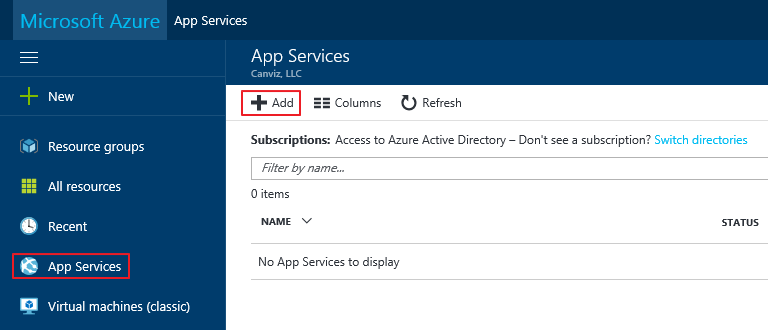

3. In the **Web + Mobile** blade, select **Web App**.

	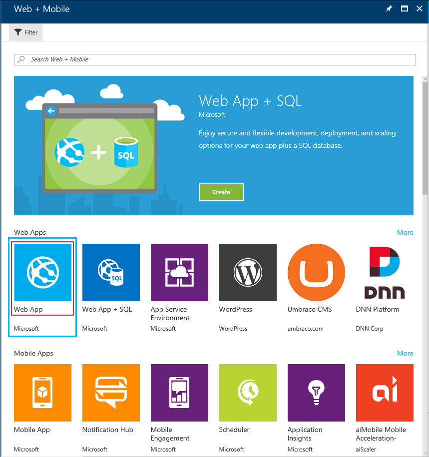

4. In the **Web App** blade, click the **Create** button. 

	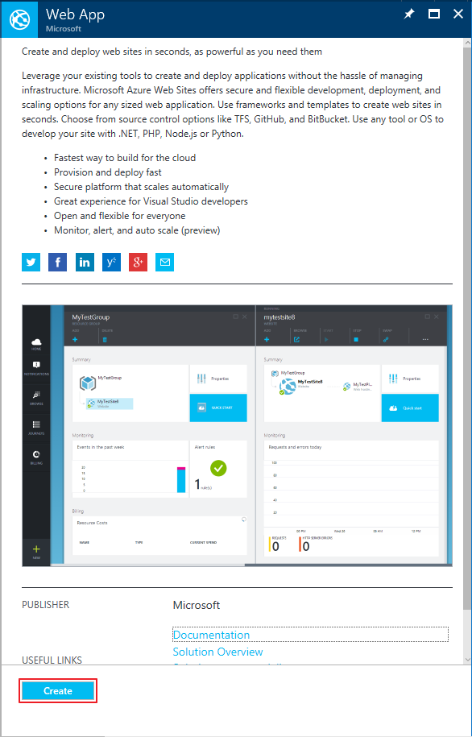

4. In the next **Web App** blade, configure the following settings, then click the **Create** button at the bottom. 
	- In the **App name** field, type **bike-sharing** or something else if it's not available.
	- In the **Subscription** field, select a subscription.
	- In the **Resource Group** field, select an existing or create a new Resource Group.
	- In the **App Service plan/Location** field, select an existing or create a new App Service plan.

	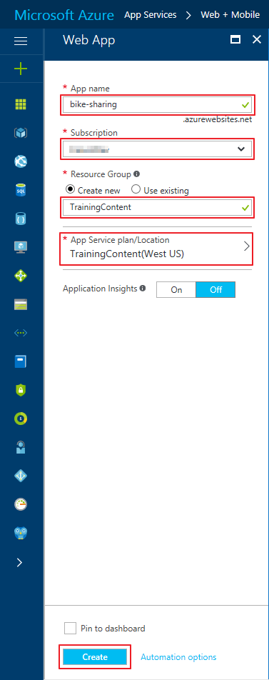

	> **Note:** Please copy and save the **App name**. You will need replace every **&lt;APPNAME&gt;** placeholder with it in this lab.

### Create a new Azure Active Directory Application for authentication of the pages for the Microsoft Teams tab ###
Here you will create an Azure Active Directory Application to allow the pages for the Microsoft Teams tab to authenticate and interact with the Microsoft Graph and SharePoint APIs.

1. In a web browser, open the [Azure Portal](https://portal.azure.com/) and log in with an account with proper permissions.
2. In the left navigation bar, select **Azure Active Directory**, then select **App Registration** and click **Add**.

	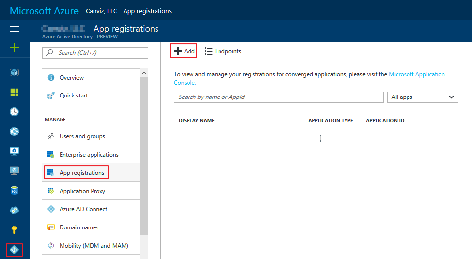

3. In the App Registration Create blade, configure the following settings, then click the **Create** button at the bottom.
	- In the **Name** field, type **Bike Sharing** or something else if it's not available.
	- In the **Application Type** field, Select **Web App / API**.
	- In the **Sign-on URL** field, type **https://&lt;APPNAME&gt;.azurewebsites.net**.

	> **Note:** Replace the **&lt;APPNAME&gt;** placeholder with the App name value you previously saved.

4. Find the Application you just created, then click it to go to its Settings blade.
5. In the **Settings** blade, click **Reply URLs**, then update the URL to **https://&lt;APPNAME&gt;.azurewebsites.net/index.html**. Click **Save**.

	> **Note:** Replace the **&lt;APPNAME&gt;** placeholder with the App name value you previously saved.
	
	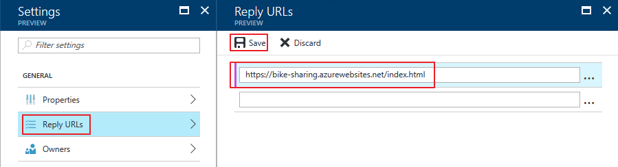

6. Click **Required permissions**, then click **Add**.

	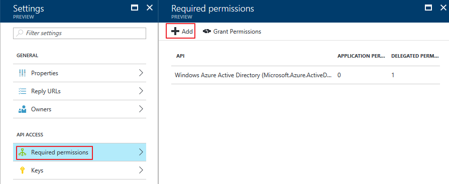

7. In the **Add API access** blade, click **Select an API**.
8. In the **Select an API** blade, select **Microsoft Graph**, then click the **Select** button at the bottom of the blade.

	

9. **Select permissions** will be automatically selected. In the **Enable Access** blade, select **Read items in all site collections** in the **DELEGATED PERMISSIONS** group, then click the **Select** button at the bottom of the blade.

	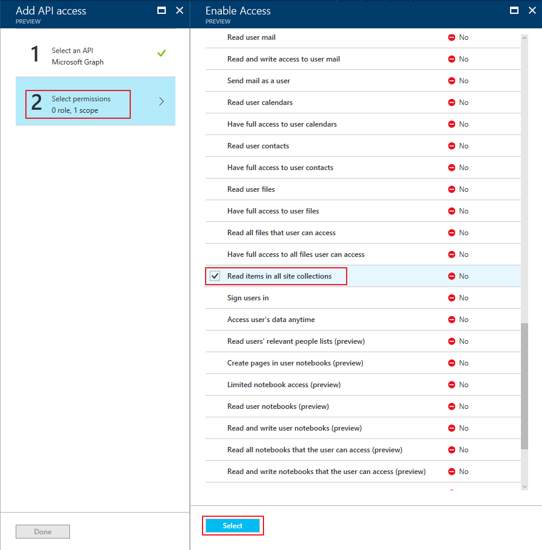

10. In the **Add API access** blade, click the **Done** button at the bottom of the blade.
11. In the **Required permissions** blade, click **Grant Permissions**, then click the **Yes** button in the confirmation window.

	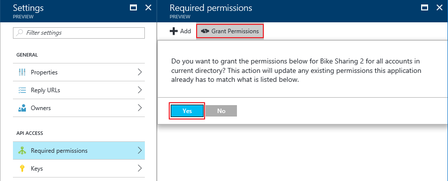

12. Close the **Required permissions** blade. Go to the primary blade of the registered app.
13. Copy and save the **Application ID**.  You will need it for subsequent steps.

	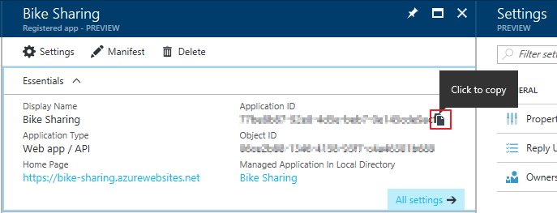

14. Click **Manifest** at the top of the blade.
15. In the **Edit manifest** blade, set the property **oauth2AllowImplicitFlow** to **true**, then click **Save**.

	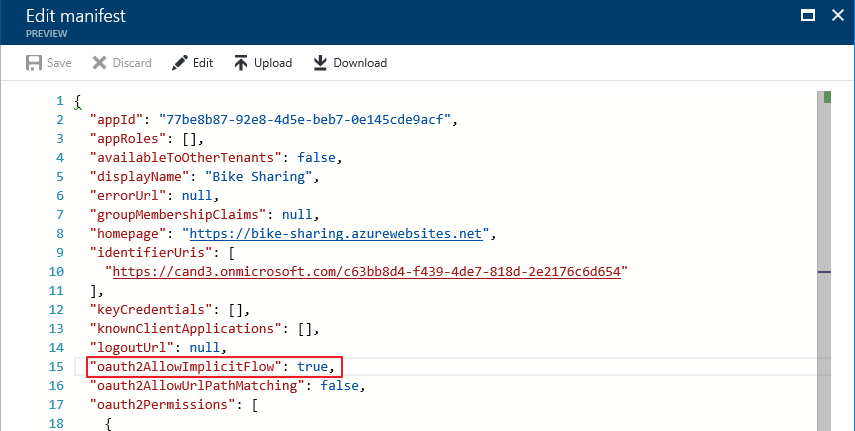

### Create a SharePoint document library to store the documents and a list to store the data of bikes ###
Here you will create a document library and a list in a SharePoint site to store the documents and data for bikes.

1. In a web browser, open the SharePoint site and log in with an account with proper permissions.
2. Click the gear icon on the top nav bar on the right, then select **Add an app** to go to your Apps page.
3. Select **Document Library**.

	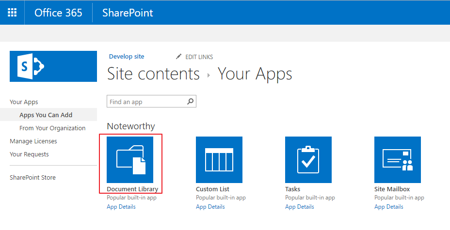

4. In the popup window, type **BikeDocuments** or something else if it's not available in the name textbox, then click **Create** button.

	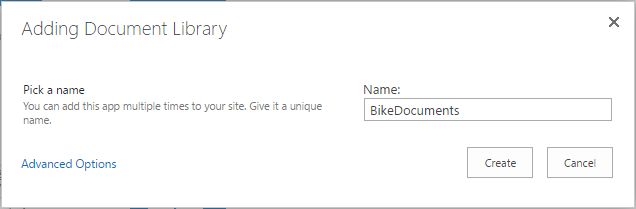

	> **Note:** Please copy and save the document library name.  You will use it in subsequent steps.

5. Add some word documents to the document library.
6. Click the gear icon on the top nav bar on the right, then select **Add an app** to go to your Apps page.
7. Select **Custom List**.
8. In the popup window, type **BikeInventory** or something else if it's not available in the name textbox, then click **Create** button.

	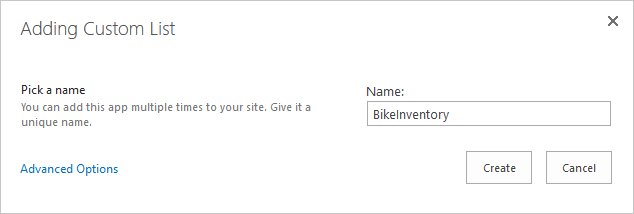

	> **Note:** Please copy and save the list name.  You will use it in subsequent steps.

9. Go to the list by clicking its name.
10. Click the gear icon on the top nav bar on the right, then select **List settings** to go to your Apps page.
11. Click **Create column** in **Columns** section.
12. In the **Create Column** page, set the **Column name** to **Serial**, configure the following settings, then click the **OK** button at the bottom.
	- In the **The type of information in this column is** field, select **Single line of text**.
	- In all other fields, keep the default settings.
13. Create the columns **Color Swatch**, **Color Scheme**, **Location** with the same settings as the column **Serial**.
14. Create the column **Description** with the following settings.
	- In the **The type of information in this column is** field, select **Multiple lines of text**.
	- In the **Specify the type of text to allow** field, select **Plain text**.
	- In all other fields, keep the default settings.
15. Create the column **Price** with the following settings.
	- In the **The type of information in this column is** field, select **Currency ($, ¥, €)**.
	- In the **Currency format** field, select **$123,456.00 (United States)**.
	- In all other fields, keep the default settings.
16. Create the column **Picture** with the following settings.
	- In the **The type of information in this column is** field, select **Hyperlink or Picture**.
	- In the **Format URL as** field, select **Picture**.
	- In all other fields, keep the default settings.
17. Create the column **Condition** with the following settings.
	- In the **The type of information in this column is** field, select **Choice (menu to choose from)**.
	- In the **Type each choice on a separate line** field, type **Available**, **Taken**.
	- In all other fields, keep the default settings.
18. Go back to the list page. Click the **New** button.

	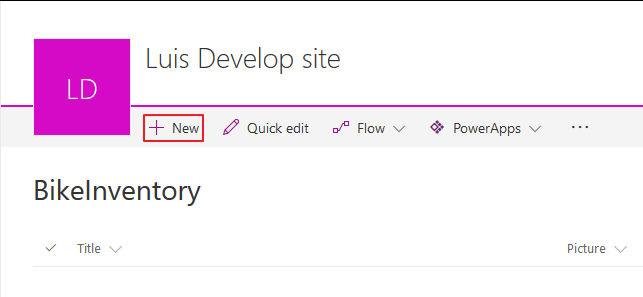

19. Enter values into the **Title**, **Serial**, **Color Swatch**, **Color Scheme**, **Location**, **Description**, **Price**, **Picture**, **Condition** columns.

	> **Note:** the value of **Color Scheme** is a color name(e.g. Black), the value of **Color Swatch** should be the corresponding RGB value for the **Color Scheme** (e.g. #000000).

	> The URL of the **Picture** field should be locate under https://&lt;APPNAME&gt;.azurewebsites.net/images. You will add images to the web site project and publish them to the Azure web site later.

### Create a web site to host the pages for the Microsoft Teams tab ###
Here you will use Visual Studio to create a web site to host the pages for the Microsoft Teams tab and publish it to Azure.

#### Create a visual studio web site ####
1. Launch **Visual Studio 2017**.
2. In Visual Studio 2017, select **File | New | Web Site**.
3. Select **Visual C#** under **Templates**, then select **ASP.NET Empty Web Site**.
4. Select a folder for **Web location**, then click **OK**.

	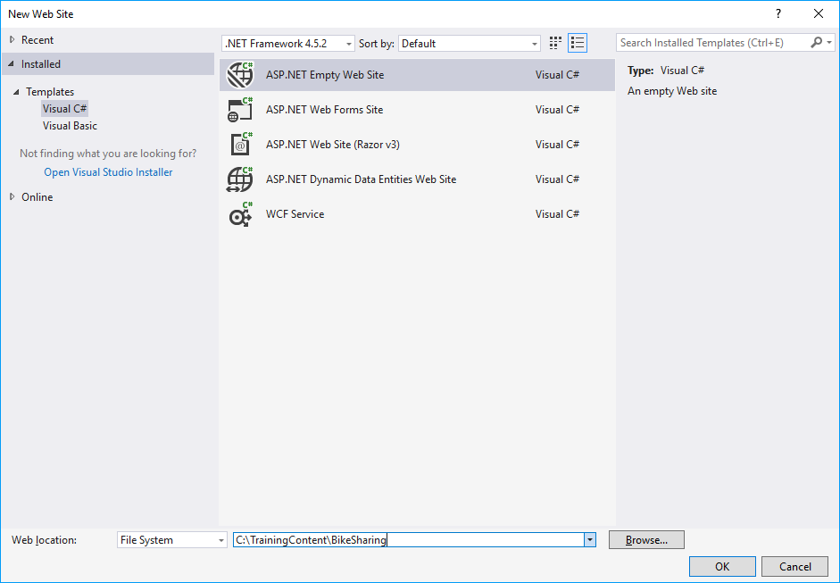

#### Create the configuration page ####
1. Open the **Solution Explorer**, right click the project and select **Add | Add New Item**.
2. In the **Add New Item** dialog, select **HTML Page**, enter **configuration.html** in the **Name** textbox, the click the **Add** button.
3. Open the file **configuration.html**, add the following code into the **&lt;body&gt;** section, then save the file.

	````javascript
	<script src="https://statics.teams.microsoft.com/sdk/v0.4/js/MicrosoftTeams.min.js"></script>
    <script type="text/javascript">
        microsoftTeams.initialize();
        microsoftTeams.settings.registerOnSaveHandler(function(saveEvent){
            microsoftTeams.settings.setSettings({
                entityId: "BikeSharing",
                contentUrl: "https://<APPNAME>.azurewebsites.net/index.html",
                suggestedDisplayName: "Bike Sharing",
                websiteUrl: "https://<APPNAME>.azurewebsites.net"
            });
            saveEvent.notifySuccess();
        });
        microsoftTeams.settings.setValidityState(true);
    </script>
	````

	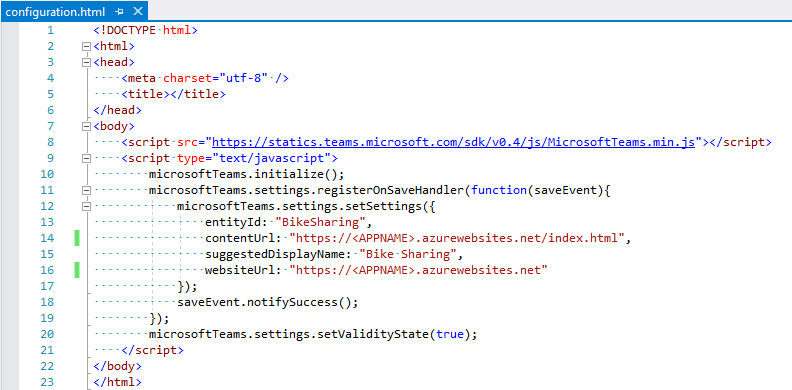

	> **Note:** Replace the **&lt;APPNAME&gt;** placeholder with the App name value you previously saved.

#### Create the content page ####
1. Add another **HTML Page** named **index.html** using the same steps you used to add the **configuration.html** file.
2. Open the file **index.html**, set the **title** to be **Bike Sharing** in the **&lt;head&gt;** section.

	````html
	<title>Bike Sharing</title>
	````

3. Add the following code into the **&lt;head&gt;** section.

	````html
    <link rel="stylesheet" href="https://static2.sharepointonline.com/files/fabric/office-ui-fabric-core/4.1.0/css/fabric.min.css">
    <link rel="stylesheet" href="main.css">
    <script src="https://code.jquery.com/jquery-3.1.1.min.js"></script>
    <script src="https://statics.teams.microsoft.com/sdk/v0.4/js/MicrosoftTeams.min.js"></script>
    <script src="https://secure.aadcdn.microsoftonline-p.com/lib/1.0.14/js/adal.min.js"></script>
	<script src="main.js"></script>
	````

	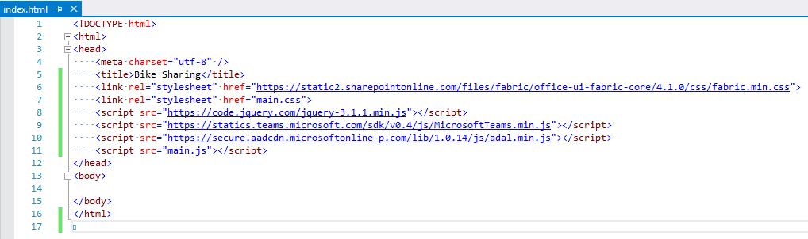

4. Add the following code into the **&lt;body&gt;** section, then save the file.

	```html
    <div class="header">
        <div class="ms-font-xl ms-Grid-col ms-u-lg6 headerText">Bike Inventory</div>
        <div id="signedInAs" class="ms-Grid-col ms-u-lg6">
            <span class="ms-font-m userLabel" id="signedInAsLabel">Signed in as:</span>
            <span class='app-userDisplay ms-font-m'></span>
            <button class="app-signOut ms-font-m" onclick="logOut();">Log Out</button>
            <button class="app-signIn ms-font-m" onclick="login();">Login</button>
        </div>
    </div>

    <div class="contentArea">
        <div id="splashBar"></div>
        <div id="inventoryPage" class="ms-u-slideLeftIn40">
            <h3 class="areaHeader">Advisories and Notices</h3>
            <div id="docBin"></div>
            <h3 class="areaHeader">Bicycles and Accessories</h3>
            <div id="inventoryBin"></div>
        </div>
        <div id="detailsPage" class="ms-font-m ms-Grid ms-u-slideRightIn40">
            <div id="bikeBanner" class="ms-Grid-row">
                <div id="backButton" onclick="showDetailsPage(false);">
                    <div class="backButtonElement">
                        <i class="ms-Icon ms-Icon--Back"></i>
                    </div>
                    <div class="backButtonElement">Back</div>
                </div>
                <div id="bikeTitle"></div>
            </div>
            <div class="ms-Grid-row">
                <div class="ms-Grid-col ms-u-lg8">
                    <div id="bikeDetailsArea">
                        <button class="bigButton operation checkOut" onclick="bikeAction.call(this);">
                            <span>
                                <i class="ms-Icon ms-Icon--Down bigButtonIcon sub-operation checkOut"></i>
                                <i class="ms-Icon ms-Icon--Refresh bigButtonIcon sub-operation wait"></i>
                                <i class="ms-Icon ms-Icon--CheckMark bigButtonIcon sub-operation checkIn"></i>
                            </span>
                            <span class="sub-operation checkOut">
                                Check out
                            </span>
                            <span class="sub-operation wait">
                                Please wait...
                            </span>
                            <span class="sub-operation checkIn">
                                Check in
                            </span>
                        </button>
                        <div id="bikeDescription"></div>
                        <div class="bikeDetailsTable">
                            <div class="bikeDetailsRow">
                                <div class="bikeDetailsLabel">Price</div>
                                <div id="bikeDetailsPrice" class="bikeDetailsValue"></div>
                            </div>
                            <div class="bikeDetailsRow">
                                <div class="bikeDetailsLabel">Location</div>
                                <div id="bikeDetailsLocation" class="bikeDetailsValue"></div>
                            </div>
                            <div class="bikeDetailsRow">
                                <div class="bikeDetailsLabel">Condition</div>
                                <div id="bikeDetailsCondition" class="bikeDetailsValue"></div>
                            </div>
                        </div>
                    </div>
                </div>
                <div class="ms-Grid-col ms-u-lg4">
                    <div id="bikeImage"></div>
                </div>
            </div>
        </div>
        <div id="message" class="ms-font-l ms-fontColor-red"></div>
    </div>
	````

	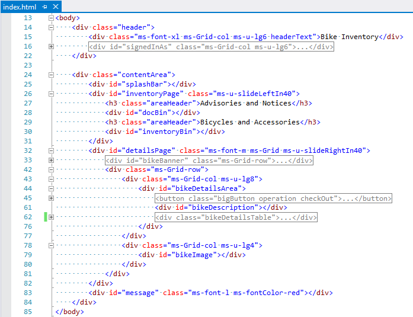

5. Add a **Style Sheet** named **main.css** using the same steps you used to add the **configuration.html** file.
6. Open the file **main.css**, replace its content with the following code, then save the file.

	````css
	body {display:none; padding:0px;  margin:0px; background-color:#F4F4F9; font-family:Helvetica, Arial, sans-serif;}
	table {padding:0px; margin:0px}
	h3 {font-weight:normal; font-size:x-large}
	button {background-color:#EAEAEA; border:solid 1px #BABABA; padding:6px; margin:3px; background-color:transparent; color:#D0D0E0}
	select {font-size:12pt}
	.bigButtonIcon {position:relative; top:1px; left:-2px}
	.bigButton {background-color:#EAEAEA; border:solid 1px #BABABA; padding:12px; margin:0px; width:125px; text-align:left; margin-top:10px; margin-bottom:10px; background-color:#3063F5}
	.bigButton:hover {background-color:#4083F5}
	.header {background-color:#3063F5; padding:20px; padding-top:20px; padding-bottom:10px; height:40px; color:white}
	.headerText {padding:4px}
	#signedInAs {padding-bottom:20px; text-align:right; color:#9090C0}
	#signedInAsLabel, #detailsPage {display: none}
	#message {margin:20px}
	.app-userDisplay {margin-right:14px}
	.userLabel {width:100px; display:inline-block}
	#splashBar {height:1em; background-color:#FFDC3A; box-shadow:0px 5px 5px rgba(220,220,220,0.6)}
	.docTile {text-decoration:none; width:120px; height:120px; margin:20px; display:inline-block; border:solid 1px #C0C0C0; vertical-align:top; padding:8px; color:white; background-color:rgba(38, 86, 229, 0.8)}
	.areaHeader {margin:20px; margin-bottom:0px}
	.itemTile {width:280px; height:380px; border:solid 1px #C0C0C0; vertical-align:bottom; margin:20px; display:inline-block}
	.itemTileImage {width:100%; height:240px; background-size:contain; background-repeat:no-repeat; background-color:#E0E0E0; background-position:center center}
	.itemTileContent {width:100%; height:140px; background-color:#F2F2F2}
	.itemTileText {padding:6px; display:inline-block; color:#3063F5; font-size:20pt}
	.itemColorSwatch {vertical-align:middle;border:solid 1px #C0C0C0; width:20px; height:20px; display:inline-block; margin:6px; margin-left:16px}
	.itemColorTitle {vertical-align:middle;display:inline-block; margin:6px; margin-left:0}
	.itemFieldArea {padding-left:45px; font-size:x-small}
	.itemFieldLabel {display:inline-block; width:50px}
	.itemFieldValue {display:inline-block}
	#backButton {color:#225AFF; padding-left:20px; cursor:default}
	.backButtonElement {display:inline-block}
	#bikeTitle {padding-top:27px; padding-left:19px; font-size:38pt; color:#225AFF; vertical-align:bottom}
	#bikeDetailsArea {padding:20px}
	#bikeDetailsArea .operation .sub-operation{display: none}
	#bikeDetailsArea .operation.checkOut .sub-operation.checkOut, #bikeDetailsArea .operation.wait .sub-operation.wait, #bikeDetailsArea .operation.checkIn .sub-operation.checkIn {display: inline}
	#bikeDescription {margin-top:20px}
	.bikeDetailsTable {display:table; margin-top:40px}
	.bikeDetailsRow {display:table-row}
	.bikeDetailsLabel {display:table-cell; background-color:#E0E0E0; padding:4px; width:80px; border-bottom:solid 1px #C0C0C0}
	.bikeDetailsValue {display:table-cell; padding:4px; text-align:right; border-bottom:solid 1px #C0C0C0; min-width:180px}
	.topToolbarArea {background-color:#2656E5; padding-top:10px; padding-bottom:10px; color:white; padding-left:20px}
	.toolbarItem {display:inline-block; vertical-align:middle; padding-left:8px; padding-right:8px}
	.toolbarItem > .ms-Icon {padding-top:3px}
	#bikeImage {background-repeat:no-repeat; background-size:contain; background-position:center top; vertical-align:middle; text-align:center; display:block; min-height:40vh; min-width:240px; width:100%; height:100%; margin-top:20px; margin-left:12px; margin-right:12px}
	.twocol {display:table}
	.twocolRow {display:table-row}
	.twocolColA {display:table-cell; width:70vw}
	.twocolColB {display:table-cell; width:30vw}
	.docTileText {height:96px}
	.docTileIcon {vertical-align:bottom; text-align:right; font-size:16pt; height:100%}
	#bikeBanner {background-color:#FFDC3A; color:#225AFF; box-shadow:0px 5px 5px rgba(220,220,220,0.6); height:110px; padding-left:9px}
	````

7. In the **Solution Explorer**, right click the project and select **Add | Existing Item**. Locate and select the **main.js** file from the [Lab Files](./Lab Files) folder, then click the **Add** button.
8. Open the **main.js** file, replace the **&lt;TENANT&gt;** placeholder with the name of your tenant, the **&lt;CLIENTID&gt;** placeholder with the **Application ID** of the app you previously registered, and the **&lt;RELATIVE SITE URL&gt;** placeholder with the relative URL of your site within the default site collection(eg. /sites/example).

	> **Note:** If you are using the root site of the default site collection, please replace the **&lt;RELATIVE SITE URL&gt;** placeholder with null.

9. Replace the **&lt;BIKE DOCUMENTS&gt;** placeholder with the name of the SharePoint document library you previously created, the **&lt;BIKE INVENTORY&gt;** placeholder with the name of the SharePoint list you previously created, as well as replacing the **&lt;APPNAME&gt;** placeholder. 
10. Save the file.
11. Add an **HTML Page** named **logout.html** using the same steps you used to add the **configuration.html** file.
12. Open the file **logout.html**, add the following code into the **&lt;body&gt;** section, then save the file.

	````html
	<script src="https://statics.teams.microsoft.com/sdk/v0.4/js/MicrosoftTeams.min.js"></script>
    <script type="text/javascript">
        microsoftTeams.initialize();
        microsoftTeams.authentication.notifySuccess("");
    </script>
	````

	> **Note:** Rhe logout.html is used as the post log out redirect page.

#### Add images to the project ####
1. In the **Solution Explorer**, right click the project and select **Add | New Folder**. Name the folder **images**.
2. Right click the folder **images**, then select **Add | Existing Item**.
3. In the **Add Existing Item** dialog, select **Image Files** in the file type dropdown, then locate and select the images from the [Lab Files\package](.\Lab Files\package) folder, then click **Add**.

	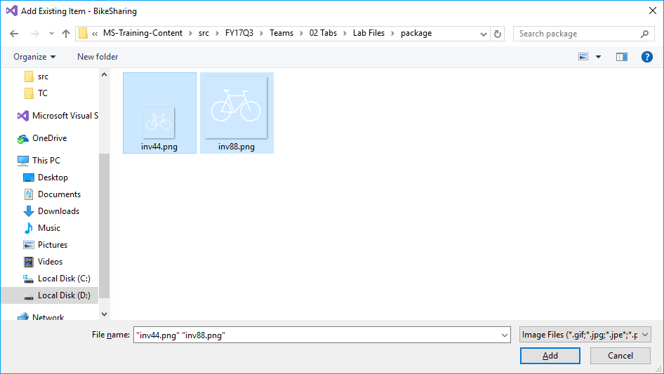

	> **Note:** The images will be published to the Azure web site, and be used as the pictures in the Microsoft Teams tab.

4. Add the images from the [Lab Files\images](.\Lab Files\images) folder to the **images** folder of the web site.

	> **Note:** You could also add other images. They will be published to Azure web site, and be referenced in the **Picture** column of the SharePoint list where the bike information is stored.

#### Publish the web site to Azure ####
1. In the **Solution Explorer**, right click the project and select **Publish Web App**.
2. In the **Publish** dialog, click **Microsoft Azure App Service**.

	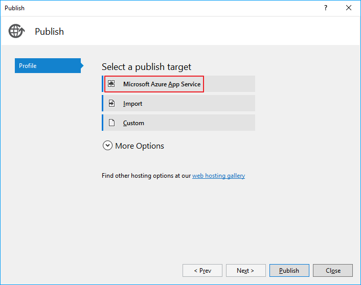

2. In the **App Service** dialog, sign in with an account with proper permissions, select the proper **Subscription**, find and select the Azure Web App you previously created, then click **OK**.

	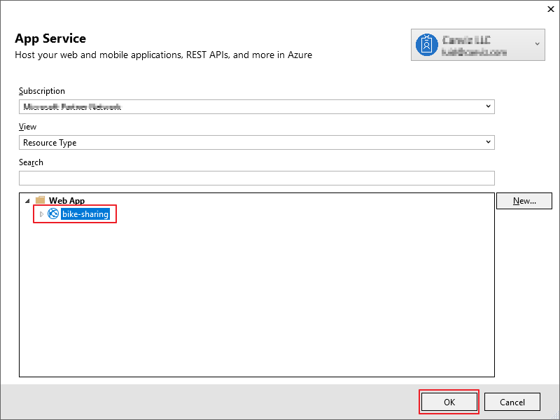

3. In the **Publish** dialog, select **Settings** tab, expand **File Publish Options**, check **Remove additional files at destination**, **Precompile during publishing**, and **Exclude files from the App_Data folder**, then click the **Publish** button.

	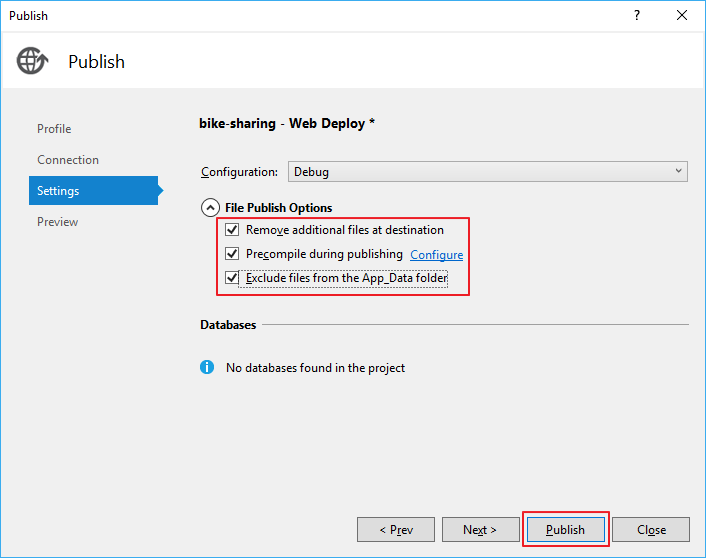

4. Wait until the publish operation finishes.

#### Create a team ####
1. Open **Microsoft Teams** and sign in.
2. If it's the first time for the account you're using to log in Microsoft Teams, you will be asked to create one. Enter a name for the team, keep other fields the default values, then select **Create a team**. 

	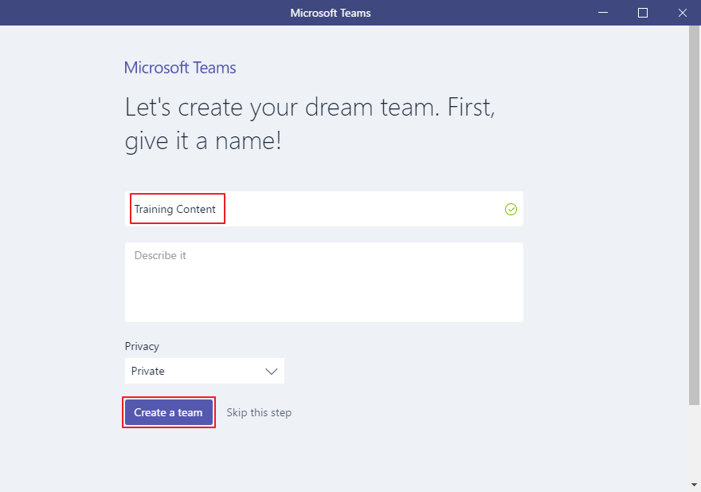

3. Then you will be asked to add some members to the team. Enter an account name in the textbox, then select **Add**. Add more members by repeating the operation. You also can skip this step by selecting **Skip**.

	

	> **Note:** If the wizard to create a new team doesn't show, you could start to create a new team by clicking **Add team** in the bottom left corner. 

	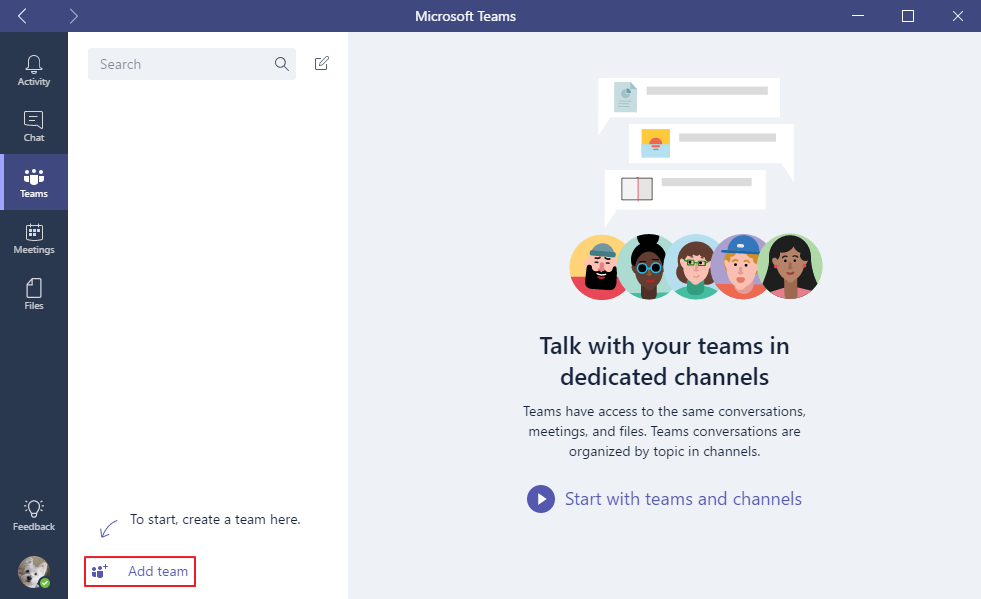

#### Create and preview the tab in Microsoft Teams ####
1. Locate and open the file **manifest.json** in the [Lab Files/package](./Lab Files/package) folder. Replace the **&lt;APPNAME&gt;** placeholder with the **App name** of the Azure Web App you previously created, then save the file. 

	> **Note:** You could update other properties, such as developer, description, and so on. For more information, please see [this](https://msdn.microsoft.com/en-us/microsoft-teams/schema) article.

2. Within **manifest.json**, modify the icon paths to point to include the paths within the .zip package we're about to create, and then save the manifest.json file.

	````json
      "icons": {
        "44": "inv44.png",
        "88": "inv88.png"
      },
	````

3. Package the file **manifest.json** and the two image files in the [Lab Files/package](./Lab Files/package) folder into a .zip file named BikeSharing.zip.
4. Switch to the **Microsoft Teams** application.
5. Click **Teams** in the left panel, then select a Team.
6. Click **...** next to the team name and then select **Manage team** (the selection has changed from **View team**, shown below).

	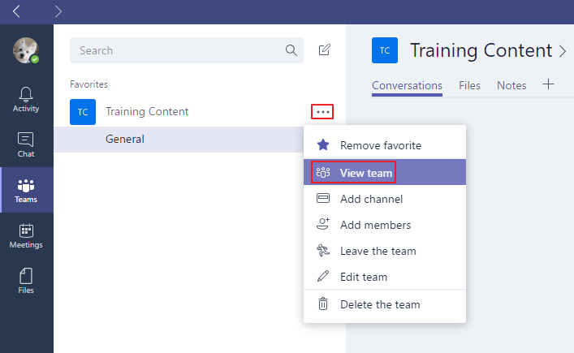

7. Click the **Bots** tab, click **Sideload a bot or tab** at the bottom right corner, select the BikeSharing.zip file, then click **Open**.

	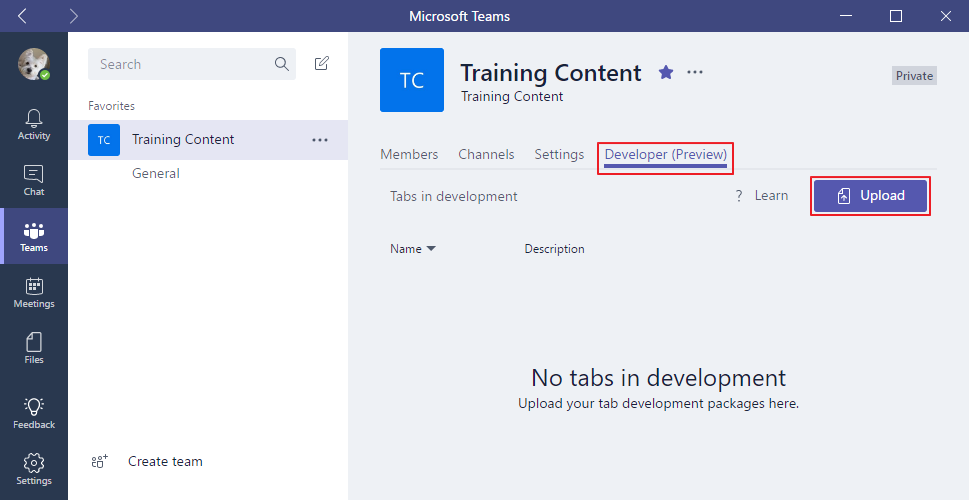

8. Wait a moment, the app will appear in the **Bots** tab.

	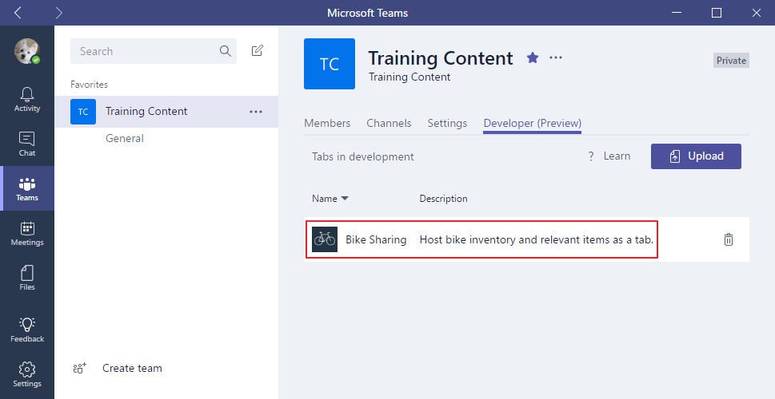

9. Click the **General** Channel in the team, then click the **+** button next to the last tab.

	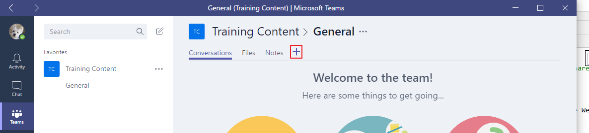

10. In the **Add a tab** dialog, select **Bike Sharing** in the gallery.

	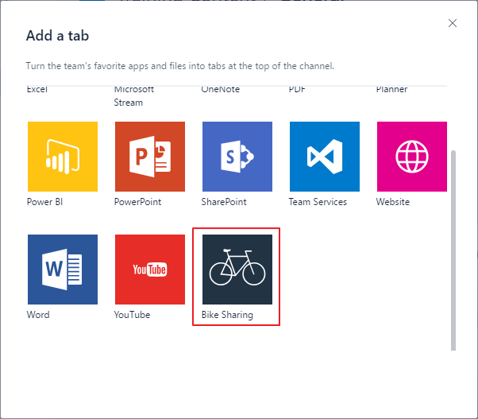

11. In the confirmation dialog, click the **Accept** button.

	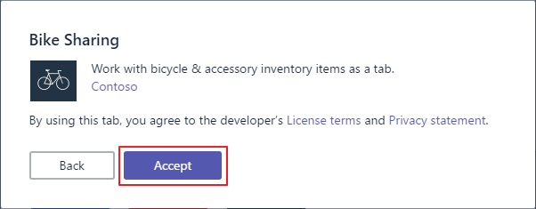

12. In the configuration dialog, click the **Save** button.

	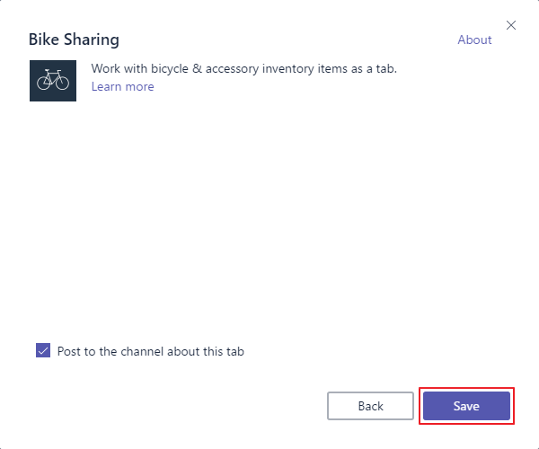

13. Wait until the tab is added and appears.

	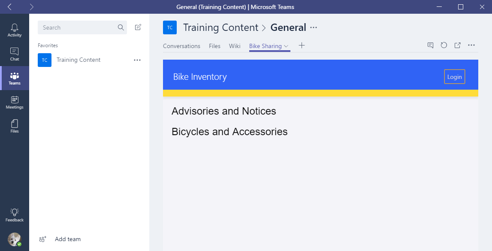

14. Click the **Login** button, in the popup window, sign in with an account with proper permissions.

	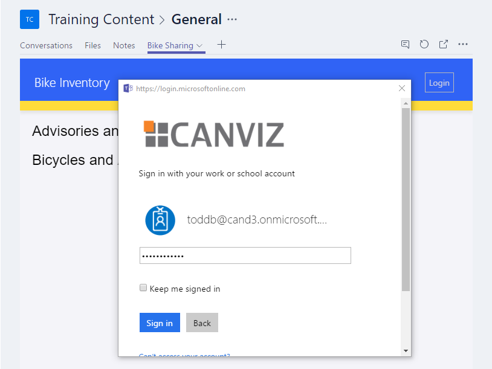

15. You will see the documents and bikes are shown.

	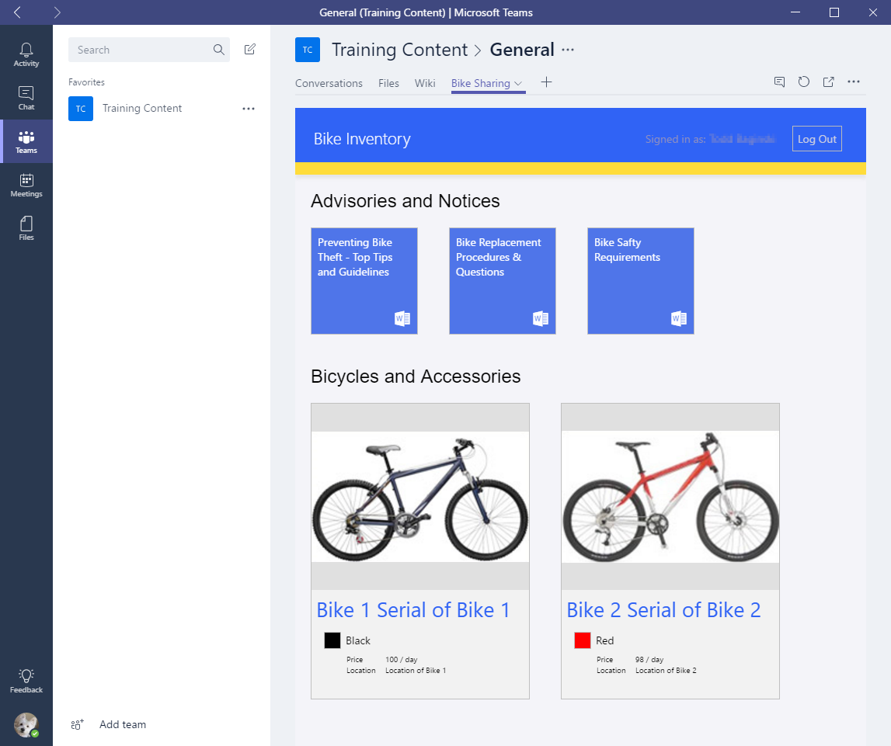

16. Click a bike, the details for the bike are shown.

	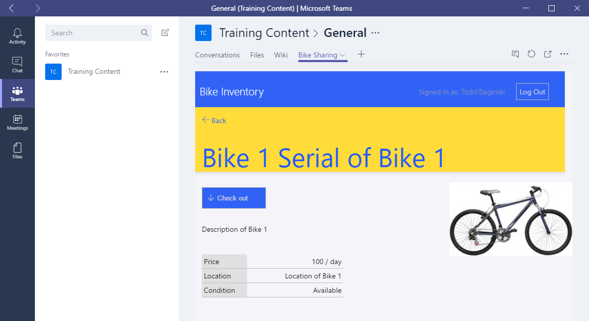

17. Click the **Check out** button to check out the bike. When **Check out** is finished, you can **Check in** the bike.

	>**Note:** The Check in and Check out functionality is a simulation.  Nothing is actually happening to any data sources when you click these buttons.

Congratulations! You have created an web site and added it as a Tab in Microsoft Teams.
