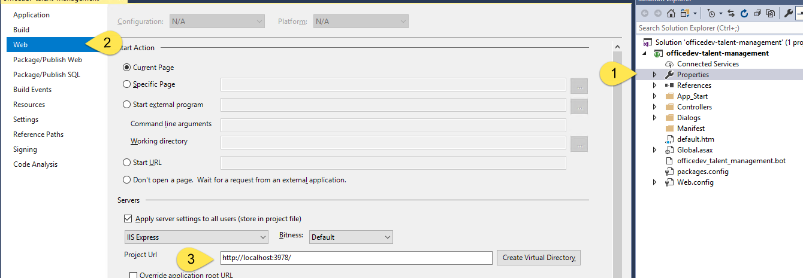
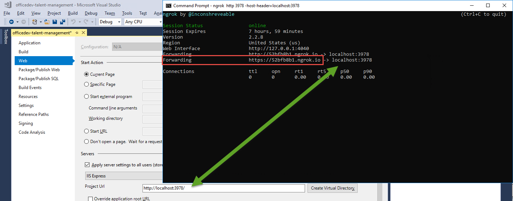
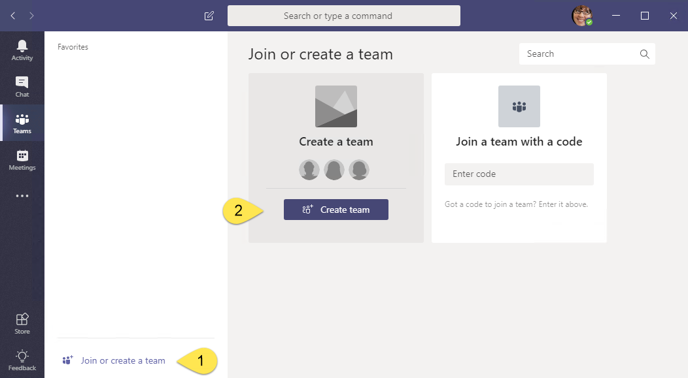
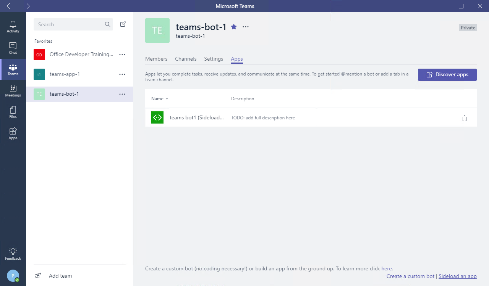

# Demos Readme

The module has two demos. The application to run is the same for each demo.

The step-by-step instructions for each demo are detailed in the following files:

1. [Add authentication to a tab](./readme01.md)
1. [Add authentication to a bot](./readme02.md)

To run the demo application, perform the following steps.

## Prerequisites

Developing apps for Microsoft Teams requires preparation for both the Office 365 tenant and the development workstation.

For the Office 365 Tenant, the setup steps are detailed on the [Prepare your Office 365 Tenant page](https://docs.microsoft.com/en-us/microsoftteams/platform/get-started/get-started-tenant).

### Azure Subscription

The Azure Bot service requires an Azure subscription. A free trial subscription is sufficient.

### Download ngrok

As Microsoft Teams is an entirely cloud-based product, it requires all services it accesses to be available from the cloud using HTTPS endpoints. To enable the exercises to work within Microsoft Teams, a tunneling application is required.

This lab uses [ngrok](https://ngrok.com) for tunneling publicly-available HTTPS endpoints to a web server running locally on the developer workstation. ngrok is a single-file download that is run from a console.

## Update Demo solution

Make the following updates to the demo solution.

1. Launch Visual Studio 2017 as an administrator.

1. In Visual Studio 2017, select **File > Open > Project/Solution**.

1. Select the **officedev-talent-management.sln** file from the **Demos\solution** folder.

### Find the project URL

1. In Solution Explorer, double-click on **Properties**.

1. In the properties designer, select the **Web** tab.

1. Note the project URL.

    

### Run the ngrok secure tunnel application

1. Open a new **Command Prompt** window.

1. Change to the directory that contains the **ngrok.exe** application.

1. Run the command `ngrok http [port] -host-header=localhost:[port]`. Replace `[port]` with the port portion of the URL noted above.

1. The ngrok application will fill the entire prompt window. Make note of the forwarding address using HTTPS. This address is required in the next step.

1. Minimize the ngrok command prompt window. It is no longer referenced in this lab, but it must remain running.

    

## Register application in the Azure Active Directory

1. Open the [Azure Active Directory admin center](https://aad.portal.azure.com).

1. Log in with the work or school account used to register the bot.

1. Select **App registrations**.

1. Select **New application registration**.

1. Enter a name for the application.

1. Select `Web app / API` for the **Application type*

1. Enter the following address **Sign-in URL**, replacing the placeholder [from-ngrok] with the https tunnel address.

    ```
    https://[from-ngrok]/Tabs/auth.html
    ```

1. Select **Create**.

1. On the application blade, copy the **Application Id**.

1. On the application page, select **Settings**.

1. In the **Settings** blade, select **Required permissions**.

1. In the **Required permissions** blade, select **Add**.

1. In the **Add API Access** blade, select **Microsoft Graph**. In the resulting **Enable access blade**, select **Read all users basic profiles**. Select the **Select** button at the bottom of the page. Select **Done(())

## Create a Bot Service Channel registration

The bot framework can facilitate the token acquisition for a bot. This requires the bot to be registered with the Azure Bot service and a second application registration (separate from the bot itself) is required.

1. Open the [Azure Portal](https://portal.azure.com).

The Bot must be connected to the application created above. Updates to that application are required.

1. In the Azure Portal, select **Azure Active Directory**.

1. Select **App Registrations**. Select **View All registrations**.

1. Select the application created above.

1. Copy the **Application Id**.

1. Select **Settings**. In the **General** section, select **Reply URLs**.

1. Add the following as a reply url: `https://token.botframework.com/.auth/web/redirect`.

1. In the **API Access** section, select **Keys**.

1. Under Passwords, create a `BotLogin` key. Set its Duration to **Never expires**.

1. Select Save and record the key value. You provide this later for the application secret.

The application must be associated with the Bot.

1. Select **Create a resource**.

1. In the **Search the marketplace** box, enter `bot`.

1. Choose **Bot Channels Registration**

1. Select the **Create** button.

1. Complete the **Bot Channels Registration** blade. For the messaging endpoint, use the ngrok tunnel endpoint prepended to `/api/messages`. Allow the service to auto-create an application.

1. When the deployment completes, go to the resource in the Azure portal.

1. In the **Bot Management** section, select **Channels**.

1. Click on the Microsoft Teams logo to create a connection to Teams. Agree to the Terms of Service.

1. In the **Bot Management** section, selet *Settings**.

1. Select **Add Setting** in the **OAuth Connection Settings** section.

1. Fill in the form as follows:
    - For Name, enter a name for your connection. You'll use in your bot code.
    - For Service Provider, select `Azure Active Directory`. Once you select this, the Azure AD-specific fields will be displayed.
    - For Client id, enter the application ID that you recorded for your Azure AD v1 application.
    - For Client secret, enter the key that your recorded for your application's BotLogin key.
    - For Grant Type, enter `authorization_code`.
    - For Login URL, enter `https://login.microsoftonline.com`.
    - For Tenant ID, enter the tenant ID for your Azure Active Directory, for example `microsoft.com` or `common`.
    - For Resource URL, enter `https://graph.microsoft.com/`.
    - Leave Scopes blank.

1. Select Save.

1. Record the bot's id and secret. To manage these:
    - In the **Bot Channels Registration** blade, select **Settings** under **Bot Management**
    - The **Microsoft App Id** is displayed. Record this value.
    - Select the **Manage** link. This will open the Application Registration Portal.
    - Select **Generate New Password**. Record the new value.

## Configure the web project

The bot project must be configured with information from the registration.

1. In **Visual Studio**, open the **Web.config** file. Locate the `<appSettings>` section.

1. Enter the `BotId`. The `BotId` is the **Bot handle** from the **Configuration** section of the registration.

1. Enter the `MicrosoftAppId` from the **Configuration** section of the registration.

1. Enter the `MicrosoftAppPassword`, the auto-generated app password displayed in the dialog box during registration.

    > **Note:** If you do not have the app password, the bot must be deleted and re-registered. An app password cannot be reset nor displayed.

1. Enter the `OAuth Connection name` from the Bot channel registartion.

1. Open the **manifest.json** file just added to the project. The `manifest.json` file requires several updates:
    - The `id` property must contain the app ID from registration. Replace the token `[microsoft-app-id]` with the app ID.
    - The `packageName` property must contain a unique identifier. The industry standard is to use the bot's URL in reverse format. Replace the token `[from-ngrok]` with the unique identifier from the forwarding address.
    - The `developer` property has three URLs that should match the hostname of the Messaging endpoint. Replace the token `[from-ngrok]` with the unique identifier from the forwarding address.
    - The `botId` property in the `bots` collection property also requires the app ID from registration. Replace the token `[microsoft-app-id]` with the app ID.
    - Save and close the **manifest.json** file.

1. Press **F5** to build the solution and package and start the web service in the debugger. The debugger will start the default browser, which can be ignored. The next step uses the teams client.

### Upload app into Microsoft Teams

Although not strictly necessary, in this lab the bot will be added to a new team.

1. In the Microsoft Teams application, click the **Add team** link. Then click the **Create team** button.

    

1. Enter a team name and description. Select **Next**.

1. Invite others from the organization to the team. The demo provides more impact with members in addition to the owner.

1. The new team is shown. In the left-side panel, select the ellipses next to the team name. Choose **Manage team** from the context menu.

    

1. On the Manage team display, select **Apps** in the tab strip. Then select the **Upload a custom app** link at the bottom right corner of the application.

1. Select the zip file from the **bin** folder that represents your app. Select **Open**.

1. The app is displayed. The description and icon for the app is displayed.

    

    The app is now uploaded into the Microsoft Teams application and the bot is available.

The app is now installed and ready to run. Refer to the appropriate demo instructions to continue.

1. [Demo 1: Add authentication to a tab](./readme01.md)
1. [Demo 2: Add authentication to a bot](./readme02.md)
