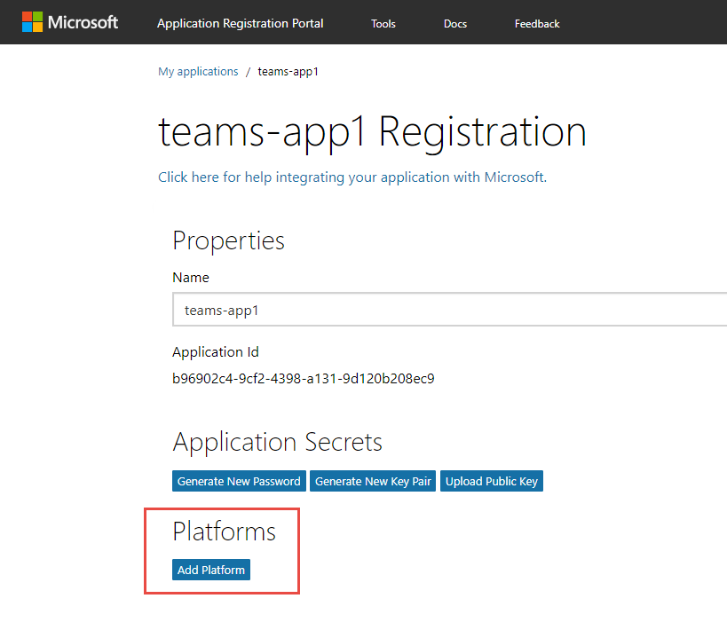
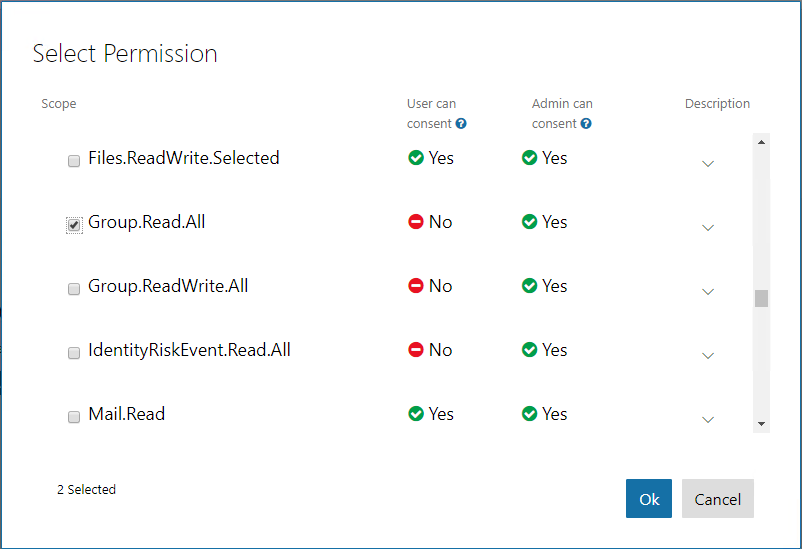

### Register an application in AAD

To enable an application to call the Microsoft Graph API, an application registration is required. This lab uses the [Azure Active Directory v2.0 endpoint](https://docs.microsoft.com/en-us/azure/active-directory/develop/active-directory-v2-compare).

1. Open the [Application Registration Portal](https://apps.dev.microsoft.com).

1. Log in with a work or school account.

1. Select **Add an app**.

1. Complete the **Register your application** section by entering an application name and contact email. Clear the checkbox for **Guided Setup**. Select **Create**.

    

1. On the registration page, in the **Platforms** section, select **Add Platform**.

    

1. In the **Add Platform** dialog, select **Web**.

1. Using the hostname from ngrok, enter a **Redirect URL** to the **auth.html** file.

    ```
    https://[replace-this].ngrok.io/auth.html
    ```

1. Select the **Add URL** button.

1. Using the hostname from ngrok, enter a **Redirect URL** to the **adminconsent.html** file.

    ```
    https://[replace-this].ngrok.io/adminconsent.html
    ```

    

1. Select **Save**.

1. Make note of the application ID. This value is used in the authentication / token code.

### Request permission to read groups

1. Move to the **Microsoft Graph Permissions** section.

1. Next to **Delegated Permissions**, select the **Add** button.

1. In the **Select Permission** dialog, scroll down and select **Group.Read.All**. Select **OK**.

      

1. Select **Save**.
