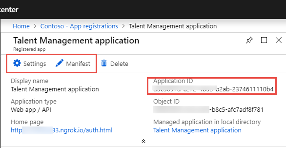
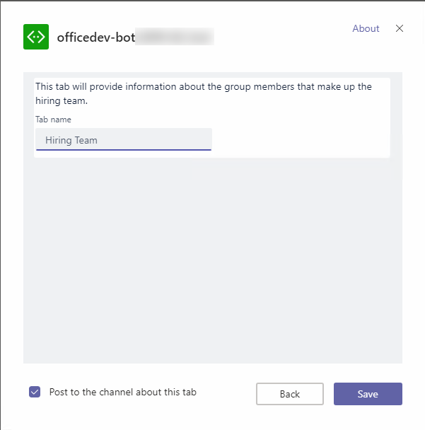
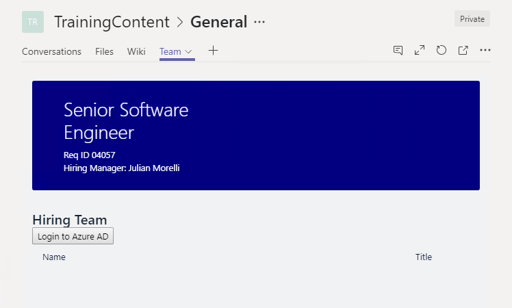
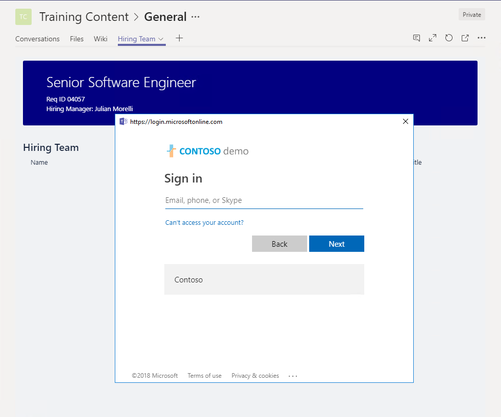

# Lab - Authentication

In this lab, you will walk through extending a Microsoft Teams app with the capability of calling secured resources via OAuth2.0 and Azure Active Directory.

## In this lab

- [Add authentication to a tab](#exercise1)
- [Add authentication to a bot](#exercise2)

## Application Registration worksheet

This lab requires the registration of multiple applications in Azure Active Directory (Azure AD), the Bot Framework and the Azure Portal. The **[LabFiles](./LabFiles)** folder of this module contains a file **[AppWorksheet.txt](./LabFiles/AppWorksheet.txt)** which can be used to record the various ids and secrets generated in the lab.

## Prerequisites

Developing apps for Microsoft Teams requires preparation for both the Office 365 tenant and the development workstation.

For the Office 365 Tenant, the setup steps are detailed on the [Get started developing apps for Microsoft Teams](https://docs.microsoft.com/en-us/microsoftteams/platform/get-started/get-started).  Note that while the getting started page indicates that the Public Developer Preview is optional, this lab includes steps that are not possible unless the preview is enabled. Information about the Developer Preview program and participation instructions are detailed on the [What is the Developer Preview for Microsoft Teams? page](https://docs.microsoft.com/en-us/microsoftteams/platform/resources/dev-preview/developer-preview-intro).

### Administrator credentials to tenant

This lab requires delegated permissions that are consented by a tenant administrator. If you are not an administrator in your tenant, you can request a developer tenant through the [Office 365 developer program](https://developer.microsoft.com/en-us/office/dev-program)

### Azure Subscription

The Azure Bot service requires an Azure subscription. A free trial subscription is sufficient.

### Install developer tools

The developer workstation requires the following tools for this lab:

#### Download ngrok

As Microsoft Teams is an entirely cloud-based product, it requires all services it accesses to be available from the cloud using HTTPS endpoints. To enable the exercises to work within Microsoft Teams, a tunneling application is required.

This lab uses [ngrok](https://ngrok.com) for tunneling publicly-available HTTPS endpoints to a web server running locally on the developer workstation. ngrok is a single-file download that is run from a console.

#### Code editors

Tabs in Microsoft Teams are HTML pages hosted in an iframe. The pages can reference CSS and JavaScript like any web page in a browser. Connectors are implemented via a web service, running server-side code.

You can use any code editor or IDE that supports these technologies, however the steps and code samples in this training use [Visual Studio 2017](https://www.visualstudio.com/).

### Starter solution

The exercises in this lab will extend the Microsoft Teams app built in the module [02 - Tabs and Connectors](../02%20Tabs%20and%20Connectors). A working copy of that application is in the **[LabFiles\Starter](./LabFiles/Starter)** folder.

## Update Starter solution

1. Launch **Visual Studio 2017** as an administrator: right-click **Visual Studio 2017** and select **Run as administrator**.

1. In **Visual Studio 2017**, select **File > Open > Project/Solution**.

1. Select the **officedev-talent-management.sln** file from the **[LabFiles\Starter](./LabFiles/Starter)** folder.

### Find the project URL

1. In **Solution Explorer**, double-click on **Properties**.

1. In the **Properties** designer, select the **Web** tab.

1. Note the **Project URL**.

    

### Run the ngrok secure tunnel application

1. Open a new **Command Prompt** window.

1. Change to the directory that contains the **ngrok.exe** application.

1. Run the command `ngrok http [port] -host-header=localhost:[port]`. Replace `[port]` with the port portion of the URL noted above.

1. The ngrok application will fill the entire prompt window.

    > **NOTE:** Record the Forwarding address using https on the AppWorksheet as the **ngrok forwarding address**.

1. Minimize the ngrok command prompt window. It is no longer referenced in this lab, but it must remain running.

    

### Register the bot

1. Open the [Azure Portal](https://portal.azure.com).

1. Select **Create a resource**.

1. In the **Search the marketplace** box, enter `bot`.

1. Choose **Bot Channels Registration**

1. Select the **Create** button.

1. Complete the **Bot Channels Registration** blade. For the **Bot name**, enter a descriptive name.

1. For the **Messaging endpoint**, use the value recorded on the AppWorksheet as ngrok forwarding address prepended to the route to the MessagesController in the Visual Studio project.

    ```
    https://[from-ngrok].ngrok.io/api/Messages
    ```

1. Allow the service to auto-create an application.

1. Select **Create**.

1. When the deployment completes, navigate to the resource in the Azure portal. In the left-most navigation, select **All resources**. In the **All resources** blade, select the Bot Channels Registration.

    

1. In the **Bot Management** section, select **Channels**.

    

1. Click on the Microsoft Teams logo to create a connection to Teams. Select **Save**. Agree to the Terms of Service.

    

#### Record the Bot Channel Registration Bot Id and secret

1. In the **Bot Channels Registration** blade, select **Settings** under **Bot Management**

1. The **Microsoft App Id** is displayed.

    > **NOTE:** Record the app ID on the AppWorksheet as the **BotChannelRegistrationId**.

1. Next to the **Microsoft App Id**, select the **Manage** link. This will navigate to the Application Registration blade.

1. In the application blade, select **Certificates & Secrets**.

1. Select **New client secret**.

1. Enter a description and select an expiration interval. Select **Add**.

1. A new secret is created and displayed.

    > **NOTE:** Record the password on the AppWorksheet as the **BotChannelRegistrationPassword**.

    

### Configure the web project

The bot project must be configured with information from the registration.

1. In **Visual Studio**, open the **Web.config** file. Locate the `<appSettings>` section.

1. Replace the token `[MicrosoftAppId]` with the value recorded on the AppWorksheet as **BotChannelRegistrationId**.

1. Replace the token `[MicrosoftAppPassword]` with the value recorded on the AppWorksheet as **BotChannelRegistrationPassword**.

1. Save and close the **web.config** file.

1. In the **Manifest** folder , open the **manifest.json** file. The **manifest.json** file requires several updates:
    - The `id` property must contain the app ID from registration. Replace the token `[MicrosoftAppID]` with the value recorded on the AppWorksheet as **BotChannelRegistrationId**.
    - The `packageName` property must contain a unique identifier. The industry standard is to use the bot's URL in reverse format. Replace the token `[from-ngrok]` with the value recorded on the AppWorksheet as **ngrok forwarding address id**.
    - The `developer` property has three URLs that should match the hostname of the Messaging endpoint. Replace the token `[from-ngrok]` with the value recorded on the AppWorksheet as **ngrok forwarding address id**.
    - The `botId` property in the `bots` collection property also requires the app ID from registration. Replace the token `[MicrosoftAppID]` with the value recorded on the AppWorksheet as **BotChannelRegistrationId**.
    - The `configurableTabs` property also contains a URL. This value will be updated later in the lab, so no update is required at this time.
    - The `validDomains` property requires a string array of all domains that will be accessed by the Teams app. Replace the token `[from-ngrok]` with the value recorded on the AppWorksheet as **ngrok forwarding address id**.
    - Save and close the **manifest.json** file.

1. Press **F5** to build the solution and package and start the web service in the debugger. The debugger will start the default browser, which can be ignored. The next step uses the teams client.

### Upload app into Microsoft Teams

Although not strictly necessary, in this lab the bot will be added to a new team. Use the same team throughout this lab.

1. In the Microsoft Teams application, click the **Add team** link. Then click the **Create team** button.

    

1. Enter a team name and description. Select **Next**.

1. Optionally, invite others from your organization to the team. This step can be skipped in this lab.

1. The new team is shown. In the left-side panel, select the ellipses next to the team name. Choose **Manage team** from the context menu.

    

1. On the Manage team display, select **Apps** in the tab strip. Then select the **Upload a custom app** link at the bottom right corner of the application.

1. Select the zip file from the **bin** folder that represents your app. Select **Open**.

1. The app is loaded to the Team. The description and icon for the app is displayed.

    

The app is now installed. The following exercises will extend this app.

<a name="exercise1"></a>

## Exercise 1: Add authentication to a tab

In this exercise, an additional tab is added to the app to show the hiring team (which is the membership of the current group). Although the Microsoft Teams API can provide the group members, that information is intended to facilitate communication with those members. To get the authoritative information about a user, the Microsoft Graph must be called.

When the bot was registered, an application registration was created in the AAD tenant. While it is possible to update this registration, the recommended practice is to create a separate application registration to represent your code. This new application must have permission to read the group members and read information about all users.

### Register application in the Azure Active Directory

1. Open the [Azure Active Directory admin center](https://aad.portal.azure.com).

1. Log in with the work or school account that is an administrator in the tenant.

1. Select **Azure Active Directory** in the left-most blade.

1. Select **App registrations** in the left-hand menu.

1. Select **New registration**.

1. Enter a name for the application. A suggested name is `Talent Management application` which distinguishes this application from the bot. Select **Register**.

1. In the **Overview** blade, copy the **Application (client) ID**.

    > **NOTE:** Record the **Application (client) ID** on the AppWorksheet as the **AzureAppID**.

1. In the **Overview** blade, , copy the **Directory (tenant) ID**.

    > **NOTE:** Record the **Directory (tenant) ID** on the AppWorksheet as the **AzureTenantID**.

1. Select **Authentication** in the left-hand menu.

1. In the **Redirect URIs section, enter the following address for the **Redirect URI**. Replace the token `[from-ngrok]` with the value recorded on the AppWorksheet as **ngrok forwarding address id**. (The Sign-in URL is case-sensitive.) Leave the **Type** as **Web**.

    ```
    https://[from-ngrok].ngrok.io/Tabs/auth-end.html
    ```

1. In the **Implicit grant** section, select **Access tokens** and **ID tokens**.

1. Select **Save** from the toolbar at the top of the Authentication blade.

1. Select **API permissions** in the left-hand menu.

1. In the **API permissions** blade, select **Add a permission**. Select **Microsoft Graph**. Select **Delegated permissions**.

1. The following permissions are required for the lab. Select any that are not included by default:

- openid (Sign users in)
- profile (View users' basic profile)
- Group > Group.Read.All (Read all groups)
- User > User.Read (Sign in and read user profile)
- User > User.Read.All (Read all users' full profiles)

Select **Add permissions**.

Select **Grant admin consent for [Directory]**. Select **Yes** in the confirmation banner.

  

### Replace the tab in the Teams app

> **NOTE**: If Visual Studio's debugger is still running from setting up the starter application prior to this exercise, stop it.

1. In **Visual Studio**, open the `manifest.json` file in the **Manifest** folder.

1. Locate the `configurableTabs` node of the document. Replace the existing tab definition with the following entry. Replace the token `[from-ngrok]` with the value recorded on the AppWorksheet as **ngrok forwarding address id**.

    ```json
    {
      "configurationUrl": "https://[from ngrok].ngrok.io/Tabs/hiringTeamConfig.html",
      "canUpdateConfiguration": true,
      "scopes": [ "team" ]
    }
    ```

### Add the tab pages to the solution

1. Add the following pages from the **[LabFiles](./LabFiles)** folder to the project, in the **Tabs** folder:

    - hiringTeam.html
    - hiringTeamConfig.html
    - auth-start.html
    - auth-end.html

1. Open file **auth-start.html** in the **Tabs** folder. The **auth-start.html** contains JavaScript code that will redirect the user to the AAD Login page, passing configuration data.

    - Replace the token `[AzureAppID]` with the value recorded on the AppWorksheet as **AzureAppID**.

1. Press **F5** to compile, create the package and start the debugger. Since the manifest file has changed, the app must be re-uploaded to Microsoft Teams.

### Remove and upload app

1. In the left-side panel of Microsoft Teams, select the ellipses next to the team name. Choose **Manage team** from the context menu.

    

1. On the Manage team display, select **Apps** in the tab strip. Locate app in the list and select the trash can icon on the right.

    

1. Select the **Uninstall** button to complete to uninstall the app.

1. Select the **Upload a custom app** link at the bottom right corner of the application.

1. Select the zip file from the **bin** folder that represents your app. Select **Open**.

1. The app is loaded to the Team. The description and icon for the app is displayed.

    

### Add tab to team view

Configurable tabs are displayed in a channel.

1. Tabs are not automatically displayed for the team. To add the tab, select **General** channel in the team.

1. Select the **+** icon at the end of the tab strip.

1. In the tab gallery, uploaded tabs are displayed in the **Tabs for your team** section. Tabs in this section are arranged alphabetically. Select the tab created in this lab.

    

1. Type a name for the tab. Select **Save**.

    

1. The tab is displayed in the channel tab strip.

    

1. Select the **Login to Azure AD** button. When the tab is first viewed by a user, the Talent Management application does not have a token to use for calls to the Microsoft Graph. Microsoft Teams will display a popup window which may request login credentials. If a valid token is cached for the user, the popup window will close without user intervention.

    

1. The tab will display the members of the Azure Active Directory group that supports the Team. Changes to the Team members will be reflected the next time the tab is displayed.

    

<a name="exercise2"></a>

## Exercise 2: Add authentication to a bot

In this exercise, an additional command is added to the bot to display the profile of the current user. This information is retrieved from the Microsoft Graph API.

When the bot was registered, an application registration was created in the AAD tenant. While it is possible to update this registration, the recommended practice is to create a separate application registration to represent your code. This new application must have permission to read the current user profile information. The application registered in Exercise 1 has this permission granted already. In this exercise, that application is referenced using AzureAppId and AzureTenantID.

### Update the Application Registration

1. Open the [Azure Portal](https://portal.azure.com).

1. In the Azure Portal, select **Azure Active Directory**.

1. Select **App registrations** in the left-hand menu.

1. Select the application created in Exercise 1. The suggested name was **Talent Management application**.

1. Copy the **Application (client) ID**.

    > NOTE: This value should match the entry in the AppWorksheet named **AzureAppID**.

1. Select **Authentication** in the left-hand menu.

1. Add an additional redirect URI. Leave the **Type** as **Web**. Add the following as a reply url: `https://token.botframework.com/.auth/web/redirect`. (The existing reply url for the tab can remain.) Select **Save**.

1. Select **Certificates & secrets** in the left-hand menu.

1. Select **New client secret**. Enter a description and select an expiration. Select **Add**.

1. Record the client secret value.

    > **NOTE:** Record the client secret value on the AppWorksheet as the **AzureAppSecret**.

### Update the Bot Service Channel registration

1. Close all open blades in the Azure Portal.

1. Select **All resources**.

1. In the **Search everything** box, enter `bot`.

1. Select **Bot Services**

1. Select the Bot Channels Registration created earlier in this lab.

1. In the **Bot Management** section, select **Settings**.

1. Select **Add Setting** in the **OAuth Connection Settings** section.

1. Fill in the form as follows:
    - For Name, enter `TalentManagementApplication`.
      > NOTE: Record this name on the AppWorksheet as **OAuthConnectionName**.
    - For **Service Provider**, select `Azure Active Directory V2`. Once you select this, the Azure AD-specific fields will be displayed.
    - For **Client id**, enter the value recorded on the AppWorksheet as **AzureAppID**.
    - For **Client secret**, enter the value recorded on the AppWorksheet as **AzureAppSecret**
    - For **Tenant ID**, enter the value recorded on the AppWorksheet as **AzureTenantID**.
    - For **Scopes**, enter `https://graph.microsoft.com/.default`

1. Select Save.

### Update Visual Studio solution configuration

The Visual Studio solution will use the Bot Channel Registration, replacing the Bot Framework registration.

1. In **Visual Studio**, right-click on the project in **Solution Explorer**.

1. Select **Add > Reference**.

1. Add a reference to **System.Configuration**. Select **OK**.

1. Open the **web.config** file.

1. Add a new key to the `appSettings` section. Replace the token **[OAuthConnectionName]** with the value recorded on the AppWorksheet named **OAuthConnectionName**.

    ```xml
    <add key="OAuthConnectionName" value="[OAuthConnectionName]"/>
    ```

1. Save and close the **web.config** file.

1. Open the **manifest.json** file in the **Manifest** folder.

1. Locate the `validDomains` node. Add the domain `token.botframework.com`. (The node value is a string array.)

1. Save and close **manifest.json**.

### Update Bot to process new command

1. Open the **MessagesController.cs** file in the **Controllers** folder.

1. In the `Post` method, the `Type` property of the incoming Activity is inspected. In the branch of the code where the Activity.Type property is `ActivityTypes.Invoke`, add the following code:

    ```csharp
    else if (activity.IsTeamsVerificationInvoke())
    {
      await Conversation.SendAsync(activity, () => new Dialogs.RootDialog());
    }
    ```

1. Open the **RootDialog.cs** file in the **Dialogs** folder.

1. In the `MessageReceivedAsync` method, after the region named **Commands**, the message text is inspected for single-word commands. Add the following test to the method:

    ```csharp
    else if (text.Contains("profile"))
    {
      await CommandHandlers.HandleProfileCommand(context);
      return;
    }
    ```

1. Open the **CommandHelpers.cs** file in the root folder of the project.

1. Add the following methods to the **CommandHandlers** class.

    ```cs
    #region HandleProfileCommand

    private static string ConnectionName = System.Configuration.ConfigurationManager.AppSettings["OAuthConnectionName"];

    public static async Task HandleProfileCommand(IDialogContext context)
    {
      // Display information about the logged in user
      context.Call(CreateGetTokenDialog(), ListMe);
    }

    private static GetTokenDialog CreateGetTokenDialog()
    {
      return new GetTokenDialog(
          ConnectionName,
          $"Please sign in to {ConnectionName} to proceed.",
          "Sign In",
          2,
          "Hmm. Something went wrong, let's try again.");
    }

    private static async Task ListMe(IDialogContext context, IAwaitable<GetTokenResponse> tokenResponse)
    {
      try
      {
        var token = await tokenResponse;

        var httpRequest = new System.Net.Http.HttpRequestMessage(System.Net.Http.HttpMethod.Get, "https://graph.microsoft.com/v1.0/me");
        httpRequest.Headers.Authorization = new System.Net.Http.Headers.AuthenticationHeaderValue("Bearer", token.Token);

        var httpClient = new System.Net.Http.HttpClient();
        System.Net.Http.HttpResponseMessage response = await httpClient.SendAsync(httpRequest);
        var responseContent = await response.Content.ReadAsStringAsync();
        JObject me = JObject.Parse(responseContent);

        await context.PostAsync($"You are {me["displayName"]} and your title is {me["jobTitle"]}.");
      }
      catch (Exception ex)
      {
        await context.PostAsync($"Error: {ex.Message}");
      }

    }

    #endregion
    ```

    1. Press **F5** to compile, create the package and start the debugger. Since the manifest file has changed, the app must be re-uploaded to Microsoft Teams.

### Remove and re-upload app

1. In the left-side panel of Microsoft Teams, select the ellipses next to the team name. Choose **Manage team** from the context menu.

    

1. On the Manage team display, select **Apps** in the tab strip. Locate app in the list and select the trash can icon on the right.

    

1. Select the **Uninstall** button to complete to uninstall the app.

1. Select the **Upload a custom app** link at the bottom right corner of the application.

1. Select the zip file from the **bin** folder that represents your app. Select **Open**.

1. The app is loaded to the Team. The description and icon for the app is displayed.

    

### Use the new Profile command

1. In a channel conversation, "at" mention the bot and issue the command `profile`.

1. The bot will attempt to acquire a token for the current user from the Azure Bot Service. If the token is stale, missing, does not have the requested scopes or is otherwise not valid, the bot will reply with a sign-in card.

    

1. On the sign-in card, select **Sign in**. Microsoft Teams will display a popup dialog with the Azure AD login. Complete the login.

1. Once sign-in ins complete, the bot will access profile information for the current user and write a message.

    
