# Lab - Authentication

In this lab, you will walk through extending a Microsoft Teams app with the capability of calling secured resources via OAuth2.0 and Azure Active Directory.

## In this lab

- [Add authentication to a tab](#exercise1)
- [Add authentication to a bot](#exercise2)

## Prerequisites

Developing apps for Microsoft Teams requires preparation for both the Office 365 tenant and the development workstation.

For the Office 365 Tenant, the setup steps are detailed on the [Getting Started page](https://msdn.microsoft.com/en-us/microsoft-teams/setup). Note that while the getting started page indicates that the Public Developer Preview is optional, this lab includes steps that are not possible unless the preview is enabled.

### Azure Subscription

The Azure Bot service requires an Azure subscription. A free trial subscription is sufficient.

### Install developer tools

The developer workstation requires the following tools for this lab.

#### Download ngrok

As Microsoft Teams is an entirely cloud-based product, it requires all services it accesses to be available from the cloud using HTTPS endpoints. To enable the exercises to work within Microsoft Teams, a tunneling application is required.

This lab uses [ngrok](https://ngrok.com) for tunneling publicly-available HTTPS endpoints to a web server running locally on the developer workstation. ngrok is a single-file download that is run from a console.

#### Code editors

Tabs in Microsoft Teams are HTML pages hosted in an iframe. The pages can reference CSS and JavaScript like any web page in a browser. Connectors are implemented via a web service, running server-side code.

You can use any code editor or IDE that supports these technologies, however the steps and code samples in this training use [Visual Studio 2017](https://www.visualstudio.com/).

### Starter solution

The exercises in this lab will extend the Microsoft Teams app built in the module [02 - Tabs and Connectors](../02%20Tabs%20and%20Connectors). A working copy of that application is in the **LabFiles\Starter** folder.

If you completed module 2, then you may skip ahead to [Exercise 1 - Add auth to a tab](#exercise1)

## Update Starter solution

1. Launch Visual Studio 2017 as an administrator.

1. In Visual Studio 2017, select **File > Open > Project/Solution**.

1. Select the **officedev-talent-management.sln** file from the **LabFiles\Starter** folder.

### Find the project URL

1. In Solution Explorer, double-click on **Properties**.

1. In the properties designer, select the **Web** tab.

1. Note the project URL.

    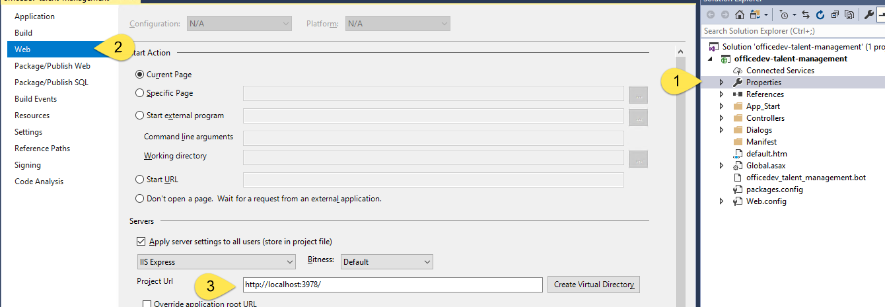

### Run the ngrok secure tunnel application

1. Open a new **Command Prompt** window.

1. Change to the directory that contains the **ngrok.exe** application.

1. Run the command `ngrok http [port] -host-header=localhost:[port]`. Replace `[port]` with the port portion of the URL noted above.

1. The ngrok application will fill the entire prompt window. Make note of the forwarding address using HTTPS. This address is required in the next step.

1. Minimize the ngrok command prompt window. It is no longer referenced in this lab, but it must remain running.

    

### Register the bot

1. Go to the [Microsoft Bot Framework](https://dev.botframework.com/bots/new) and sign in. The bot registration portal accepts a work or school account or a Microsoft account.

> **NOTE:** You must use this link to create a new bot: https://dev.botframework.com/bots/new. If you select the **Create a bot button** in the Bot Framework portal instead, you will create your bot in Microsoft Azure instead.

1. Complete the **bot profile section**, entering a display name, unique bot handle and description.

    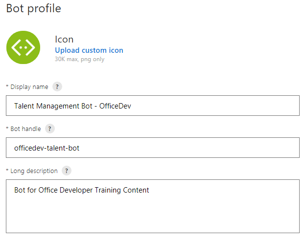

1. Complete the configuration section.
    - For the Messaging endpoint, prepend the forwarding HTTPS address from ngrok  to the route to the `MessagesController` in the Visual Studio project. In the example, this is `https://52bfb8b1.ngrok.io/API/Messages`.
    - Select the **Create Microsoft App ID and password button**. This opens a new browser window.
    - In the new browser window, the application is registered in Azure Active Directory. Select **Generate an app password to continue**.
    - An app password is generated. Copy the password and save it. You will use it in a subsequent step.
    - Select **OK** to close the dialog box.
    - Select the **Finish and go back to Bot Framework** button to close the new browser window and populate the app ID in the **Paste your app ID below to continue textbox**.

        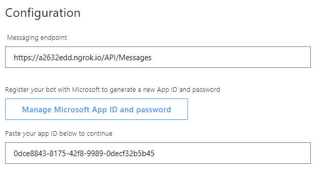

1. Move to the bottom of the page. Agree to the privacy statement, terms of use and code of conduct and select the **Register** button. Once the bot is created, select **OK** to dismiss the dialog box. The **Connect to channels** page is displayed for the newly-created bot.

> **Note:** The Bot migration message (shown in red) can be ignored for Microsoft5 Teams bots. Additional information can be found in the Microsoft Teams developer documentation, on the [Create a bot page](https://docs.microsoft.com/en-us/microsoftteams/platform/concepts/bots/bots-create#bots-and-microsoft-azure).

1. The bot must be connected to Microsoft Teams. Select the **Microsoft Teams** logo.

    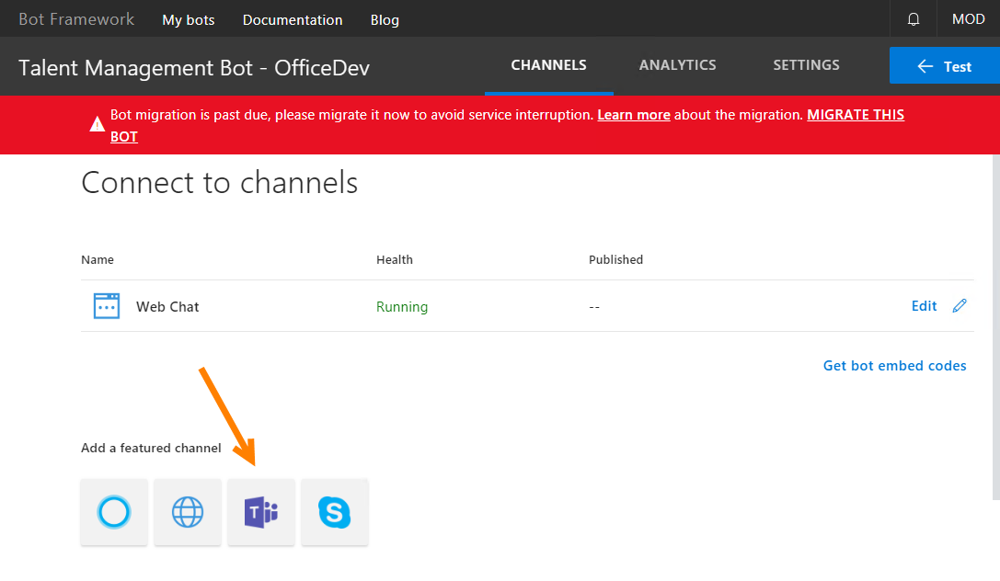

1. Once the connection is complete, ensure the connection is enabled and select **Done**. The bot registration is complete.

    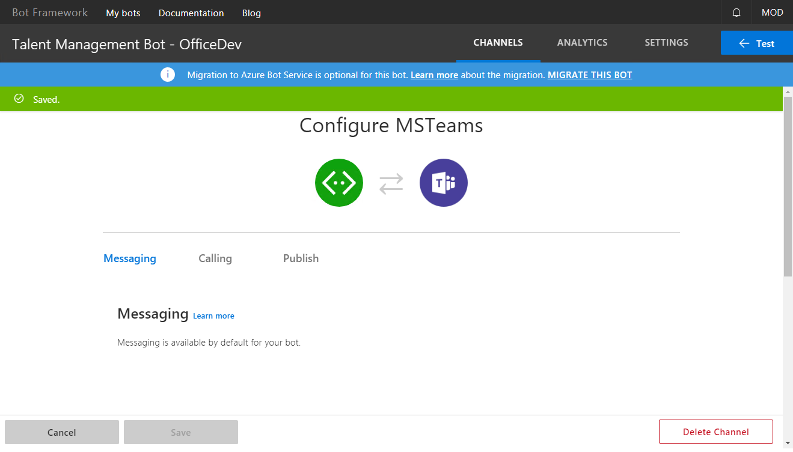

    >**Note:** Selecting **Settings** in the top navigation will re-display the profile and configuration sections. This can be used to update the messaging endpoint in the event ngrok is stopped, or the bot is moved to staging & production.

### Configure the web project

The bot project must be configured with information from the registration.

1. In **Visual Studio**, open the **Web.config** file. Locate the `<appSettings>` section.

1. Enter the `BotId`. The `BotId` is the **Bot handle** from the **Configuration** section of the registration.

1. Enter the `MicrosoftAppId` from the **Configuration** section of the registration.

1. Enter the `MicrosoftAppPassword`, the auto-generated app password displayed in the dialog box during registration.

    > **Note:** If you do not have the app password, the bot must be deleted and re-registered. An app password cannot be reset nor displayed.

1. In the **Manifest** folder , open the **manifest.json** file. The `manifest.json` file requires several updates:
    - The `id` property must contain the app ID from registration. Replace the token `[microsoft-app-id]` with the app ID.
    - The `packageName` property must contain a unique identifier. The industry standard is to use the bot's URL in reverse format. Replace the token `[from-ngrok]` with the unique identifier from the forwarding address.
    - The `developer` property has three URLs that should match the hostname of the Messaging endpoint. Replace the token `[from-ngrok]` with the unique identifier from the forwarding address.
    - The `botId` property in the `bots` collection property also requires the app ID from registration. Replace the token `[microsoft-app-id]` with the app ID.
    - Save and close the **manifest.json** file.

1. Press **F5** to build the solution and package and start the web service in the debugger. The debugger will start the default browser, which can be ignored. The next step uses the teams client.

### Upload app into Microsoft Teams

Although not strictly necessary, in this lab the bot will be added to a new team.

1. In the Microsoft Teams application, click the **Add team** link. Then click the **Create team** button.

    

1. Enter a team name and description. Select **Next**.

1. Optionally, invite others from your organization to the team. This step can be skipped in this lab.

1. The new team is shown. In the left-side panel, select the ellipses next to the team name. Choose **Manage team** from the context menu.

    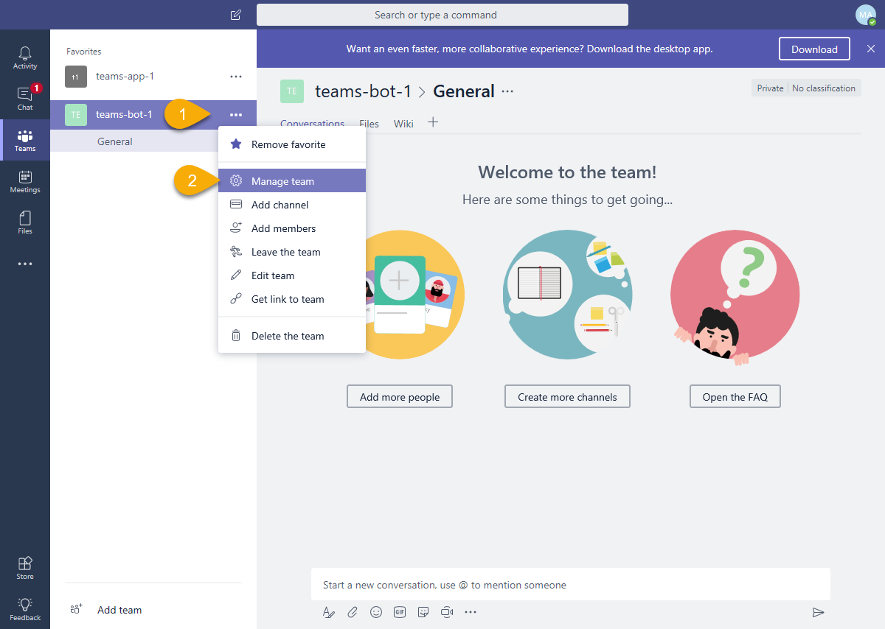

1. On the Manage team display, select **Apps** in the tab strip. Then select the **Upload a custom app** link at the bottom right corner of the application.

1. Select the zip file from the **bin** folder that represents your app. Select **Open**.

1. The app is displayed. The description and icon for the app is displayed.

    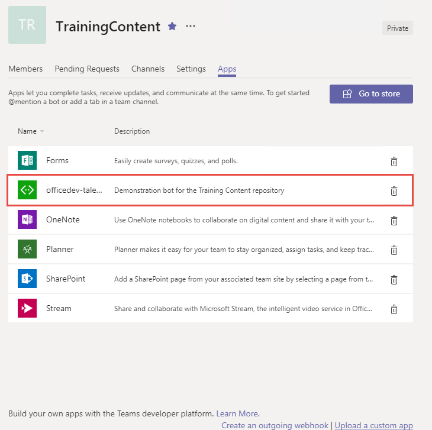

    The app is now uploaded into the Microsoft Teams application and the bot is available.

    > **Note:** Adding the bot to a team invokes the system message **ConversationUpdated**. The code in `MessageHelpers.cs` determines if the message is in response to the bot being added, and initiates a 1:1 message with each member of the team.

    

The app is now installed. The following exercises will extend this app.

<a name="exercise1"></a>

## Exercise 1: Add authentication to a tab

In this exercise, an additional tab is added to the app to show the hiring team (which is the membership of the current group). Although the Microsoft Teams API can provide the group members, this information is intended to facilitate communication with those members. To get the authoritative information about a user, the Microsoft Graph must be called.

When the bot was registered, and application registration was created in the AAD tenant. This application must have additional permission to read the group members.

### Register application in the Azure Active Directory

1. Open the [Azure Active Directory admin center](https://aad.portal.azure.com).

1. Log in with the work or school account used to register the bot.

1. Select **App registrations**.

1. Select **New application registration**.

1. Enter a name for the application.

1. Select `Web app / API` for the **Application type*

1. Enter the following address **Sign-in URL**, replacing the placeholder [from-ngrok] with the https tunnel address.

    ```
    https://[from-ngrok]/Tabs/auth.html
    ```

1. Select **Create**.

1. On the application blade, copy the **Application Id**.

1. On the application page, select **Settings**.

1. In the **Settings** blade, select **Required permissions**.

1. In the **Required permissions** blade, select **Add**.

1. In the **Add API Access** blade, select **Microsoft Graph**. In the resulting **Enable access blade**, select **Read all users basic profiles**. Select the **Select** button at the bottom of the page. Select **Done(())

### Replace the tab in the Teams app

1. Open the `manifest.json` file in the **Manifest** folder.

1. Locate the `configurableTabs` node of the document. Replace the existing tab definition with the following entry:

    ```json
    {
      "configurationUrl": "https://[from ngrok].ngrok.io/Tabs/hiringTeamConfig.html",
      "canUpdateConfiguration": true,
      "scopes": [ "team" ]
    }
    ```

### Add the tab pages to the solution

1. Add the following pages from the **LabFiles** folder to the project, in the **Tabs** folder:

- hiringTeam.html
- hiringTeamConfig.html
- auth.html

1. Open file **hiringTeam.html** in the **Tabs** folder.

1. Replace the token `[AAD-app-id]` with the application id copied from the AAD portal earlier.

1. Open file **auth.html** in the **Tabs** folder.

1. Replace the token `[AAD-app-id]` with the application id copied from the AAD portal earlier.

1. Press **F5** to compile, create the package and start the debugger. Since the manifest file has changed, the app must be re-uploaded to Microsoft Teams.

### Remove and upload app

1. In the left-side panel of Microsoft Teams, select the ellipses next to the team name. Choose **Manage team** from the context menu.

    

1. On the Manage team display, select **Apps** in the tab strip. Locate app in the list and select the trash can icon on the right.

    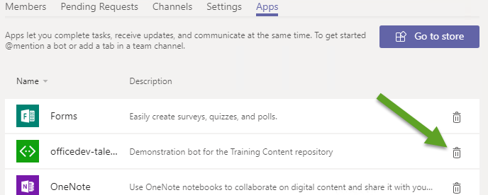

1. Select the **Uninstall** button to complete to uninstall the app.

1. Select the **Upload a custom app** link at the bottom right corner of the application.

1. Select the zip file from the **bin** folder that represents your app. Select **Open**.

1. The app is displayed. The description and icon for the app is displayed.

    

### Add tab to team view

Configurable tabs are displayed in a channel.

1. Tabs are not automatically displayed for the team. To add the tab, select **General** channel in the team.

1. Select the **+** icon at the end of the tab strip.

1. In the tab gallery, uploaded tabs are displayed in the **Tabs for your team** section. Tabs in this section are arranged alphabetically. Select the tab created in this lab.

    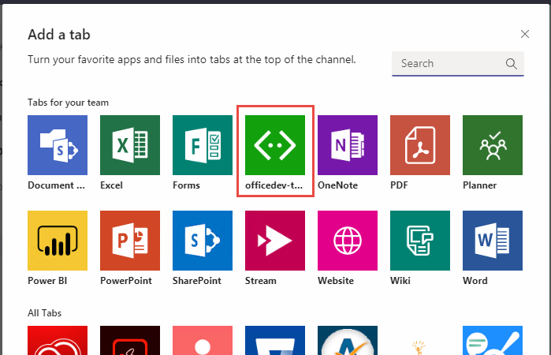

1. Type a name for the tab and select a position. Select **Save**.

1. The tab is displayed in the channel tab strip.

    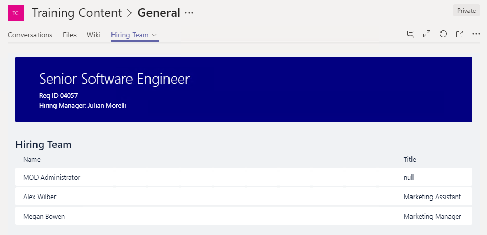

<a name="exercise2"></a>

## Exercise 2: Add authentication to a bot

In this exercise, an additional command is added to the bot to display the profile of the current user.

### Create a Bot Service Channel registration

The bot framework can facilitate the token acquisition for a bot. This requires the bot to be registered with the Azure Bot service and a second application registration (separate from the bot itself) is required.

1. Open the [Azure Portal](https://portal.azure.com).

The Bot can be connected to the application created in Exercise 1. Updates to that application are required.

1. In the Azure Portal, select **Azure Active Directory**.

1. Select **App Registrations**. Select **View All registrations**.

1. Select the application created in Exercise 1.

1. Copy the **Application Id**.

1. Select **Settings**. In the **General** section, select **Reply URLs**.

1. Add the following as a reply url: `https://token.botframework.com/.auth/web/redirect`.

1. In the **API Access** section, select **Keys**.

1. Under Passwords, create a `BotLogin` key. Set its Duration to **Never expires**.

1. Select Save and record the key value. You provide this later for the application secret.

The application must be associated with the Bot.

1. Select **Create a resource**.

1. In the **Search the marketplace** box, enter `bot`.

1. Choose **Bot Channels Registration**

1. Select the **Create** button.

1. Complete the **Bot Channels Registration** blade. For the messaging endpoint, use the ngrok tunnel endpoint prepended to `/api/messages`. Allow the service to auto-create an application.

1. When the deployment completes, go to the resource in the Azure portal.

1. In the **Bot Management** section, select **Channels**.

1. Click on the Microsoft Teams logo to create a connection to Teams. Agree to the Terms of Service.

1. In the **Bot Management** section, selet *Settings**.

1. Select **Add Setting** in the **OAuth Connection Settings** section.

1. Fill in the form as follows:
    - For Name, enter a name for your connection. You'll use in your bot code.
    - For Service Provider, select `Azure Active Directory`. Once you select this, the Azure AD-specific fields will be displayed.
    - For Client id, enter the application ID that you recorded for your Azure AD v1 application.
    - For Client secret, enter the key that your recorded for your application's BotLogin key.
    - For Grant Type, enter `authorization_code`.
    - For Login URL, enter `https://login.microsoftonline.com`.
    - For Tenant ID, enter the tenant ID for your Azure Active Directory, for example `microsoft.com` or `common`.
    - For Resource URL, enter `https://graph.microsoft.com/`.
    - Leave Scopes blank.

1. Select Save.

1. Record the bot's id and secret. To manage these:
    - In the **Bot Channels Registration** blade, select **Settings** under **Bot Management**
    - The **Microsoft App Id** is displayed. Record this value.
    - Select the **Manage** link. This will open the Application Registration Portal.
    - Select **Generate New Password**. Record the new value.

### Update Visual Studio solution configuration

1. In Visual Studio, right-click on the project in Soution Explorer.

1. Select **Add > Reference**.

1. Add a reference to **System.Configuration**. Select **OK**.

1. Open the `web.config` file.

1. Add a new key to the `appSettings` section.

    ```xml
    <add key="ConnectionName" value="<your-AAD-connection-name>"/>
    ```

1. Change the values for `MicrosoftAppId` and `MicrosoftAppPassword` to the values from the Azure Bot Service registration.

1. Open the `manifest.json` file in the **Manifest** folder.

1. Locate the `bots` node. Replace the `botId` value with the Microsoft App Id from the Azure Bot Service registration.

1. Locate the `validDomains` node. Add the domain `token.botframework.com`. (The node value is a string array.)

### Update Bot to process logins

1. Open the `MessagesController.cs` file in the **Controllers** folder.

1. In the `Post` method, the `Type` property of incoming Activity is inspected. In the branch of the code where the Activity.Type property is `ActivityTypes.Invoke`, add the following code:

    ```csharp
    else if (activity.IsTeamsVerificationInvoke())
    {
      await Conversation.SendAsync(activity, () => new Dialogs.RootDialog());
    }
    ```

1. Open the `RootDialog.cs` file in the **Dialogs** folder.

1. In the `MessageReceivedAsync` method, after the region named **Commands**, the message text is inspected for single-word commands. Add the following test to the method:

    ```csharp
    else if (text.Contains("profile"))
    {
      await CommandHandlers.HandleProfileCommand(context);
      return;
    }
    ```

1. Open the `CommandHelpers.cs` file in the root folder of the project.

1. Add the following methods to the **CommandHandlers** class.

    ```cs
    #region HandleProfileCommand

    private static string ConnectionName = System.Configuration.ConfigurationManager.AppSettings["ConnectionName"];

    public static async Task HandleProfileCommand(IDialogContext context)
    {
      // Display information about the logged in user
      context.Call(CreateGetTokenDialog(), ListMe);
    }

    private static GetTokenDialog CreateGetTokenDialog()
    {
      return new GetTokenDialog(
          ConnectionName,
          $"Please sign in to {ConnectionName} to proceed.",
          "Sign In",
          2,
          "Hmm. Something went wrong, let's try again.");
    }

    private static async Task ListMe(IDialogContext context, IAwaitable<GetTokenResponse> tokenResponse)
    {
      try
      {
        var token = await tokenResponse;

        var httpRequest = new System.Net.Http.HttpRequestMessage(System.Net.Http.HttpMethod.Get, "https://graph.microsoft.com/v1.0/me");
        httpRequest.Headers.Authorization = new System.Net.Http.Headers.AuthenticationHeaderValue("Bearer", token.Token);

        var httpClient = new System.Net.Http.HttpClient();
        System.Net.Http.HttpResponseMessage response = await httpClient.SendAsync(httpRequest);
        var responseContent = await response.Content.ReadAsStringAsync();
        JObject me = JObject.Parse(responseContent);

        await context.PostAsync($"You are {me["displayName"]} and your title is {me["jobTitle"]}.");
      }
      catch (Exception ex)
      {
        await context.PostAsync($"Error: {ex.Message}");
      }

    }

    #endregion
    ```

    1. Press **F5** to compile, create the package and start the debugger. Since the manifest file has changed, the app must be re-uploaded to Microsoft Teams.

### Remove and re-upload app

1. In the left-side panel of Microsoft Teams, select the ellipses next to the team name. Choose **Manage team** from the context menu.

    

1. On the Manage team display, select **Apps** in the tab strip. Locate app in the list and select the trash can icon on the right.

    

1. Select the **Uninstall** button to complete to uninstall the app.

1. Select the **Upload a custom app** link at the bottom right corner of the application.

1. Select the zip file from the **bin** folder that represents your app. Select **Open**.

1. The app is displayed. The description and icon for the app is displayed.

    

### Use the new Profile command

1. In a channel conversation, "at" mention the bot and issue the command `profile`.

1. The bot will attempt to acquire a token for the current user from the Azure Bot Service. If the token is stale, missing, does not have the requested scopes or is otherwise not valid, the bot will reply with a sign-in card.

    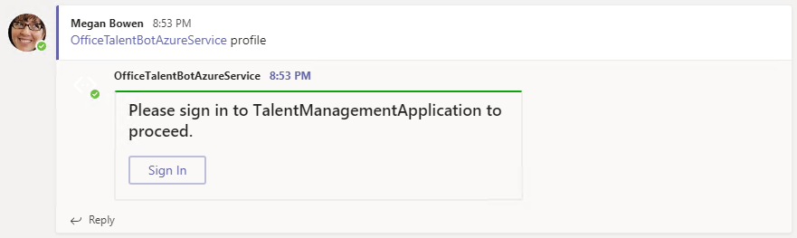

1. Once sign-in ins complete, the bot will access profile information for the current user and write a message.

    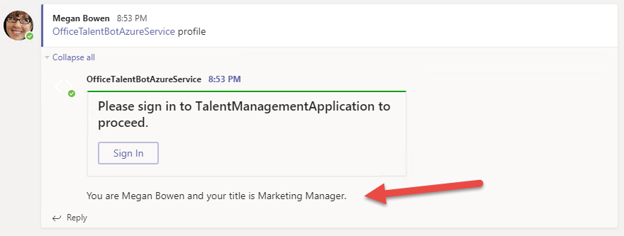