# Create bots, connectors, and tabs in Microsoft Teams
Microsoft Teams is a chat-based conversation tool, that contains everything your team needs to keep in touch.  You can extend Teams by building Bots and Connectors, as well as extending the user interface with custom Tabs.  In this training module, we’ll build a Bot that integrates with Teams.

## Prerequisites
1. You must have an Office 365 tenant and Windows Azure subscription to complete this lab. If you do not have one, the lab for **O3651-7 Setting up your Developer environment in Office 365** shows you how to obtain a trial.
2. You must have Visual Studio 2017 and the Bot templates installed.
   - Download the [Bot Application](http://aka.ms/bf-bc-vstemplate), [Bot Controller](http://aka.ms/bf-bc-vscontrollertemplate), and [Bot Dialog](http://aka.ms/bf-bc-vsdialogtemplate) .zip files. Install the project template by copying Bot Applicztion.zip  to your Visual Studio 2017 project templates directory. Install the item templates by copying Bot Controller.zip and Bot Dialog.zip to your Visual Studio 2017 item templates directory. The templates directories are traditionally located in `%USERPROFILE%\Documents\Visual Studio 2017\Templates\`   
   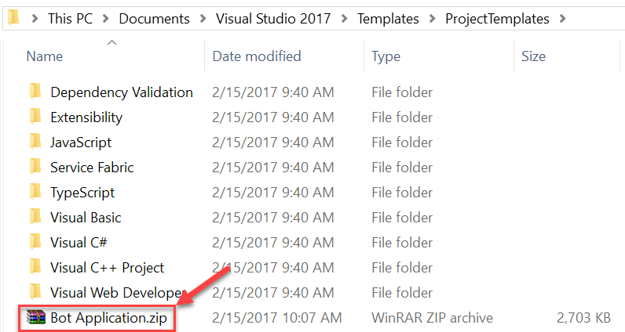  
3. You must turn on Microsoft Teams for your organization and enable side-loading for your bots.
   - Follow the instructions in this link [https://msdn.microsoft.com/en-us/microsoft-teams/setup](https://msdn.microsoft.com/en-us/microsoft-teams/setup)
4. You must have Microsoft Teams installed.
   - Download it at this link [https://teams.microsoft.com/downloads](https://teams.microsoft.com/downloads).

## Exercise 1: Create a Bot in Azure
In this exercise, you will create a simple bot web application.

1. In the Azure portal, click **+ New** and select **AI and Congitive Services**. Select **Web App Bot** from the list of services.
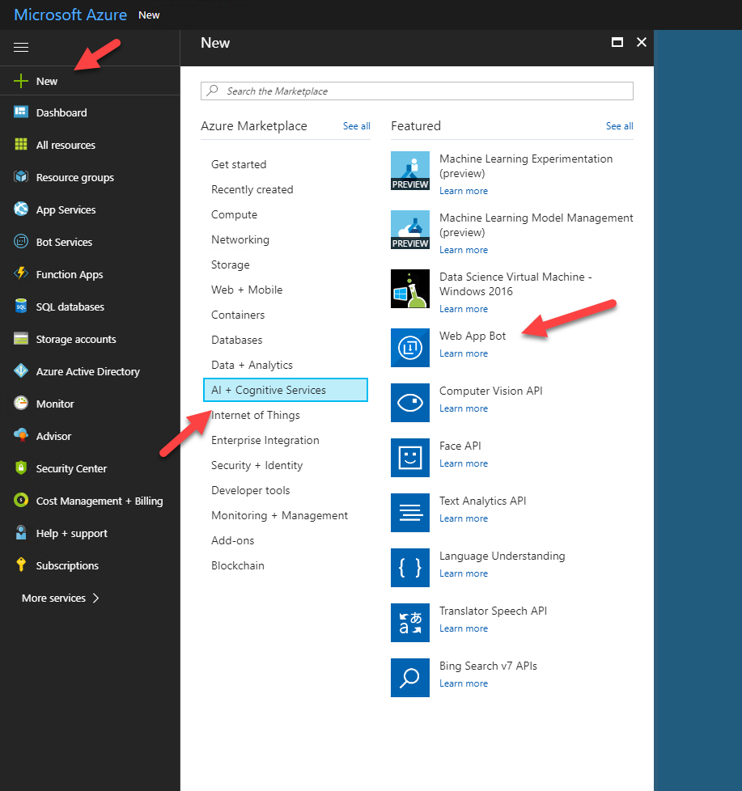
2. In the **Bot name** textbox, enter a name for your Bot. Select a subscription, resource group, and pricing tier for your Bot; the F0 tier is free, and will work fine for this lab. Ensure the **Basic (C#)** Bot template is selected, and click create. It may take a few minutes.
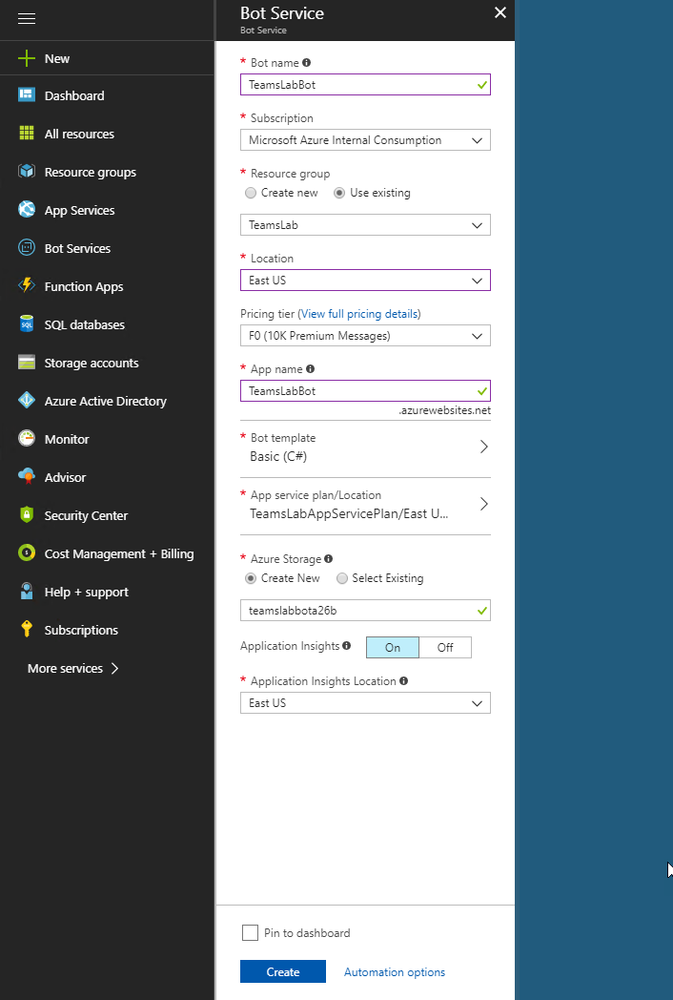
3. Test your bot. Open the **Bot Services** blade and select your Bot. Under **Bot Management** click **Test in Web Chat**. Try chatting to your bot, and it will echo the messages back to you.

4. Next, modify your bot in the web user interface. To do that, click the Build button in the Web App Bot blade, and click on **Open online code editor**.
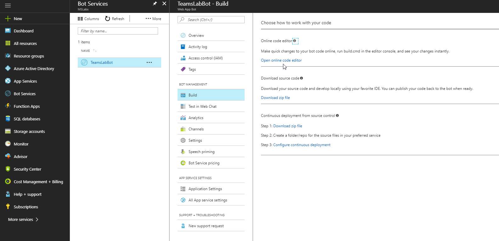

    The editor looks a lot like Visual Studio Code. Open the Dialogs folder and, as a simple test, edit the EchoDialog.cs file. In the MessageReceivedAsync() method, find the line,

    ````csharp
    await context.PostAsync($"{this.count++}: You said {message.Text}");
    ````
    
    Edit the message in some simple way, such as changing "You said" to "I received".

    Open the console by clicking the button on the left.

    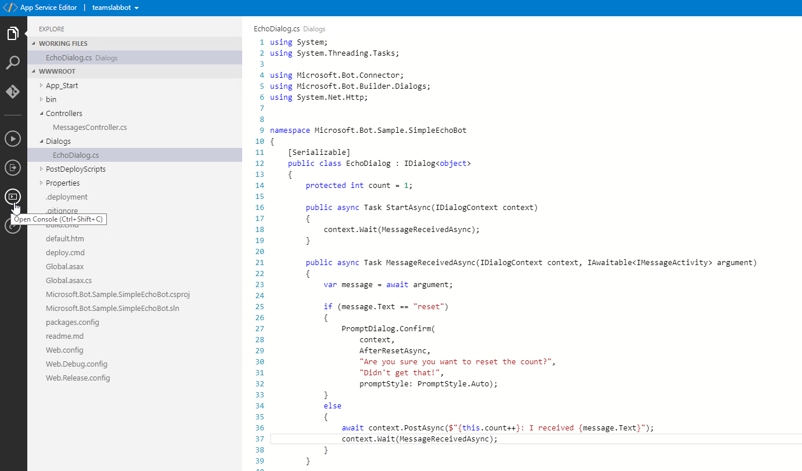

    Enter the command "Build.cmd", and your project should rebuild.

    Note that the App Service Editor is in preview; if you get an error about kudu sync, pull down the dropdown in the top bar of the editor and select "Open Kudu Console". Type the commands:

    ```
    cd site/wwwroot
    build.cmd
    ```

    The project should compile.

5. Return to the **Test in Web Chat** screen and try your service to see the change in effect. You may have to try a couple times as the site warms up.

6. Back in the Azure console, find your bot under Bot Services and click **Settings**. Above the **Microsoft App ID** field click the **(Manage)** link. Save a copy of:
 - The name (this is your "Bot ID")
 - The Application ID (a GUID)
 - The Application Secret (you will need to Generate a New Password in order to have an opportunity to copy this)

    Keep this in a safe place as it allows anyone to use your bot application.

## Exercise 2: Bot development in Visual Studio

1. Ensure you are using the latest update of Visual Studio 2017, and that you have installed the Bot templates (links and other details above under "Prerequisites")
2. Launch **Visual Studio 2017** as an administrator
3. In Visual Studio 2017 select **File | New | Project**
4. Create a new Visual C# project using the **Bot Application** template  
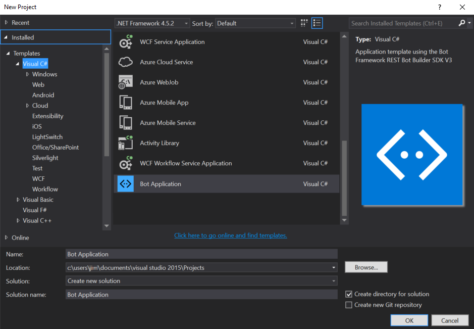  

5. Open the web.config file, and paste in the Bot ID, Application ID and Secret you saved in the previous exercise. (The Bot ID is just the name of the Bot).

6. Open the **Controllers\MessagesController.cs** class. Replace the Post method with the following code.

	```csharp	
    public async Task<HttpResponseMessage> Post([FromBody]Activity activity)
    {
        if (activity.Type == ActivityTypes.Message)
        {
            ConnectorClient connector = new ConnectorClient(new Uri(activity.ServiceUrl));
            Activity reply;
            
			if (activity.Text.ToLower().Equals("what is our inventory of replacement tires?"))
            {
                Random random = new Random();
                reply = activity.CreateReply($"{random.Next(1,100)}");
            }
            else {
				// calculate something for us to return
            	int length = (activity.Text ?? string.Empty).Length;
            
                // return our reply to the user
                reply = activity.CreateReply($"You sent {activity.Text} which was {length} characters");
            }

            await connector.Conversations.ReplyToActivityAsync(reply);
        }
        else
        {
            HandleSystemMessage(activity);
        }
        var response = Request.CreateResponse(HttpStatusCode.OK);
        return response;
    }
	```
    
    Add a using statement at the top of the controller so it will compile.

    ``` csharp	
    using System;
    ```


7. Right click on the project and select **Manage Nuget Packages**. Click on the Updates tab and ensure all the packages are up-to-date. In particular, make sure the Microsoft.Bot.Builder is at version 3.12.2.4 or greater.

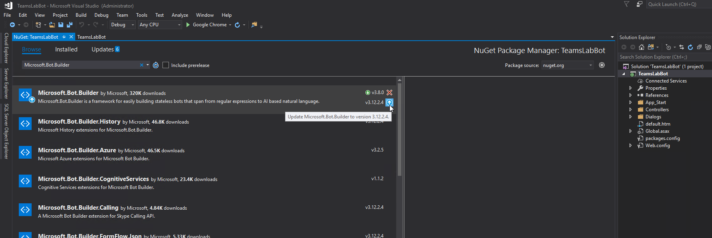

8. Right-click on the project and select **Publish...**. Click **Microsoft Azure App Service** and select the **Select Existing** radio button.

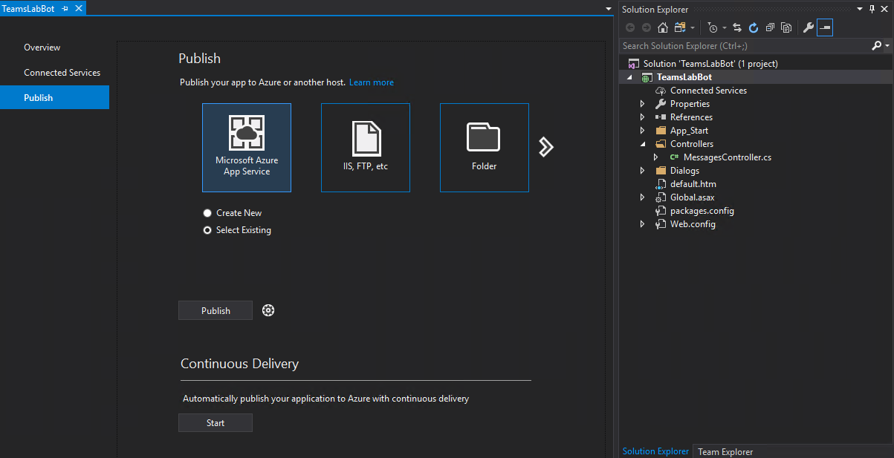

 Then click the **Settings** link (under **Summary**), and then click **Settings** again. Then click the **Settings** tab on the left and open the **File Publish Options** accordian. Ensure that **Remove additional files at destination** is checked off, then click Save.
 


 Now, click **Publish**. In the pop-up dialog, drill into the Bot web app you created in Exercise 1. Visual Studio will build your project and deploy it to Azure.

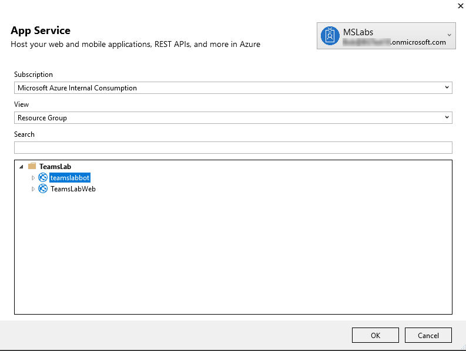

9. Re-test the Bot using the 
**Test in Web Chat** feature in the Azure portal. Try typing "what is our inventory of replacement tires?", which should respond with a random number.


## Exercise 3: Remote Debugging (optional)

When you start to develop more sophisticated bots, you may want to debug them. The [quickstart article](https://docs.microsoft.com/en-us/bot-framework/dotnet/bot-builder-dotnet-quickstart) provides one approach, which allows local debugging using the [Bot Framework Emulator](https://docs.microsoft.com/en-us/bot-framework/bot-service-debug-emulator). Here we will remotely debug the Bot directly in Azure.

1. In Visual Studio 2017, right-click on the project and select **Publish...**. Click the **Settings** link and then the **Settings** tab. Change the configuration to **Debug**.

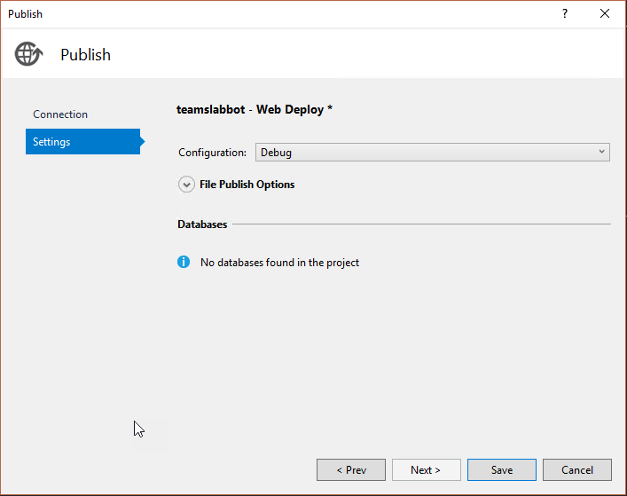

Click **Save** then **Publish** to publish a debugger version of your Bot.

2. Open the **MessagesController.cs** file again and put your cursor on the **if** statement in the new Post method, and click F9 to set a breakpoint.

3. On the **View** menu, open the **Cloud Explorer**. Drill into the resource group you used for this project, and find the Bot Web Application. If the resource group doesn't show, you may need to log into the correct Azure subscription; click the person icon at the top of the Cloud Explorer to log in.

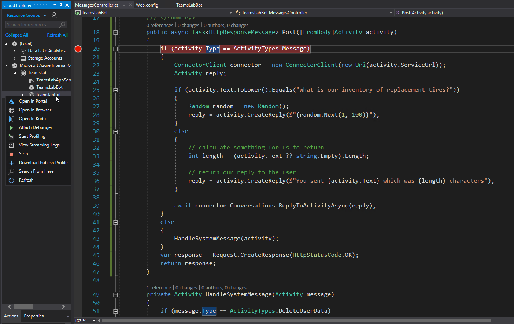

 Once you've found the Bot Web Application, right click on it and select **Attach Debugger**.

4. When Visual Studio finishes connecting to the remote debugger, return to the test page in the Azure portal and type a message. You should hit the breakpoint and be able to debug your Bot.

## Exercise 4: Add bot to Microsoft Teams

1. In the Azure Portal under Bot Services, open your Bot and click **Channels**. Under "Add a featured channel", click the Teams logo.


2. Agree to the terms of service if you want to complete the lab


3. Ensure the channel is enabled and click the **Done** button
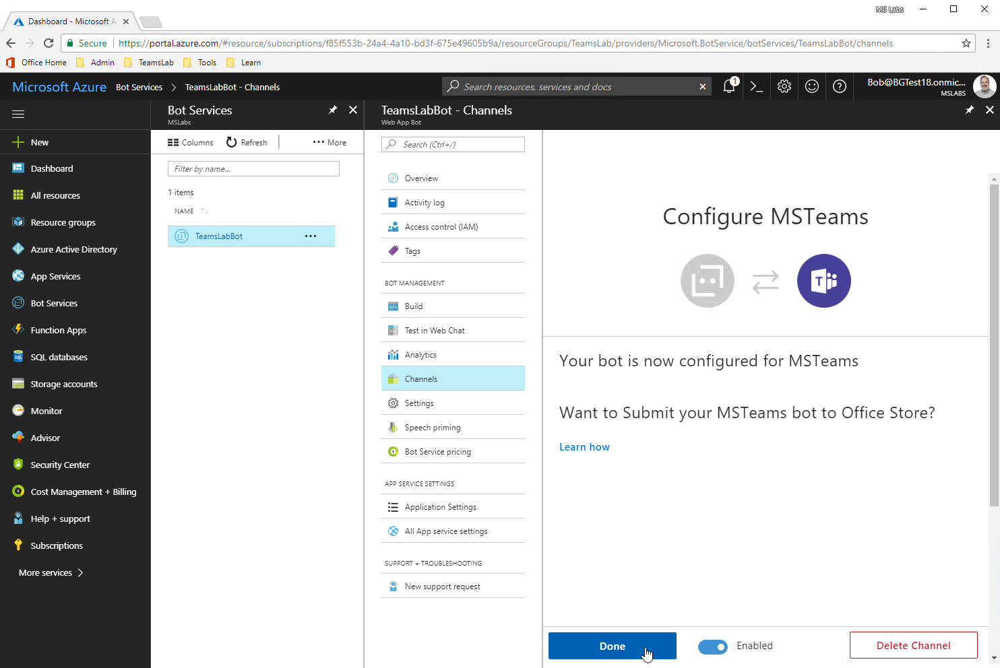

4. Open the **Microsoft Teams** desktop app and sign in using your Microsoft Account.
5. Click the **Chat** button
6. In the **Chat** pane, click the **New chat** icon. In the **To:** textbox, enter the Microsoft App ID for your Bot.  Then, click **your bot** when the Bot name pops up.

7. You have now successfully added the Bot to Microsoft Teams.
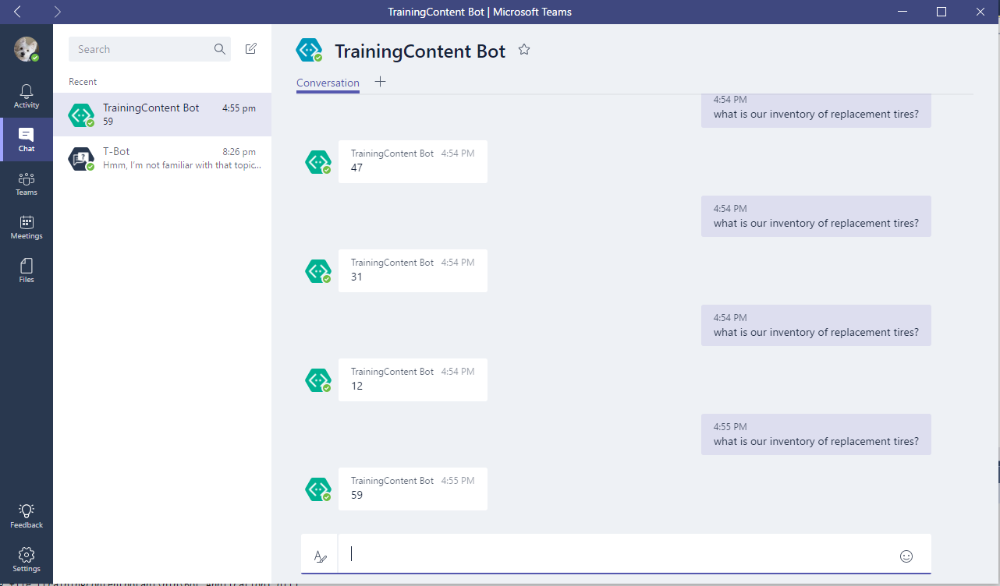
8. In the chat window, type "what is our inventory of replacement tires?"

> **IMPORTANT NOTE:**  ***Do not copy and paste the question into the chat window.**  **Type it.*** Copy and pasting the text into the window may look correct, but it will not always work.

9. Observe the random number the Bot returns. 

Congratulations! You have created a simple Bot and added it to Microsoft Teams.