# Create bots, connectors, and tabs in Microsoft Teams
Microsoft Teams is a chat-based conversation tool, that contains everything your team needs to keep in touch.  You can extend Teams by building Bots and Connectors, as well as extending the user interface with custom Tabs.  In this training module, we’ll build a Bot that integrates with Teams.

## Prerequisites
1. You must have an Office 365 tenant and Windows Azure subscription to complete this lab. If you do not have one, the lab for **O3651-7 Setting up your Developer environment in Office 365** shows you how to obtain a trial.
2. You must have Visual Studio 2017 and the Bot Application template installed.
   - Download and install the Bot Application template zip from the direct download link [http://aka.ms/bf-bc-vstemplate](http://aka.ms/bf-bc-vstemplate)
   - Save the zip file to your Visual Studio 2017 templates directory which is traditionally located in `%USERPROFILE%\Documents\Visual Studio 2017\Templates\ProjectTemplates\`   
     
3. You must turn on Microsoft Teams for your organization and enable side-loading for your bots.
   - Follow the instructions in this link [https://msdn.microsoft.com/en-us/microsoft-teams/setup](https://msdn.microsoft.com/en-us/microsoft-teams/setup)
4. You must have Microsoft Teams installed.
   - Download it at this link [https://teams.microsoft.com/downloads](https://teams.microsoft.com/downloads).

## Lab Setup: Create a Bot for Teams

## Exercise 1: Building your Bot
In this exercise, you will create a Azure Web App to host your bot application and use VS to build your bot.

1. In a web browser, open the [Azure Management Portal](https://portal.azure.com/) and log in with an administrator account
2. Click the **+** button
3. Click **Web + Mobile** | **Web App** 
4. Enter a unique name such as ***trainingcontentbotapi*** in the **App name** textbox. Save this name somewhere as you will need it later in the exercise
5. Select a **Subscription**
6. Create or select a **Resource Group**
7. Create or select an **App Service Plan**
8. Click the **Create** button
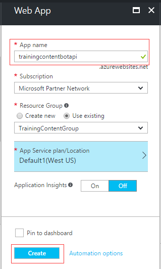  
9. After the Web Site is completed, click **App Services**
10. Click the Web Site you just created
11. Copy the web site **URL** and save it.  You will use it later.
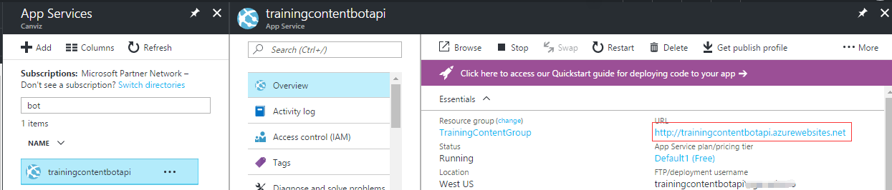  
12. Launch **Visual Studio 2017** as an administrator
13. In Visual Studio 2017 select **File | New | Project**
14. Create a new Visual C# project using the **Bot Application** template  
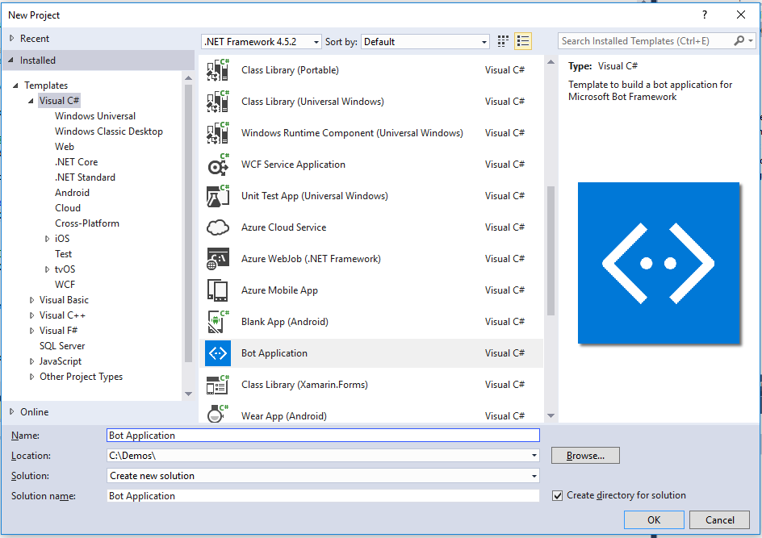  

The template is a fully functional Echo Bot that takes the user's text utterance as input and returns it as output. In order to run the bot inside Microsoft Teams:

- The bot must be registered with the Bot Connector
- The AppId and AppPassword from the Bot Framework registration page have to be recorded in the project's web.config
- The Bot must be added to Microsoft Teams

The core functionality of the Bot Template is all in the Post method within the **Controllers\MessagesController.cs** class. The code that comes with the new Bot project takes user's text utterance as input, then creates a reply message using the **CreateReplyMessage** method.  The out of the box reply displays the user's text utterance and how many characters it contained.  

```csharp
public async Task<HttpResponseMessage> Post([FromBody]Activity activity)
{
    if (activity.Type == ActivityTypes.Message)
    {
        ConnectorClient connector = new ConnectorClient(new Uri(activity.ServiceUrl));
        // calculate something for us to return
        int length = (activity.Text ?? string.Empty).Length;

        // return our reply to the user
        Activity reply = activity.CreateReply($"You sent {activity.Text} which was {length} characters");
        await connector.Conversations.ReplyToActivityAsync(reply);
    }
    else
    {
        HandleSystemMessage(activity);
    }
    var response = Request.CreateResponse(HttpStatusCode.OK);
    return response;
}
```

In this lab you will modify the **Controllers\MessagesController.cs** class to answer the question "What is our inventory of replacement tires?" and return a random number.

The **BotAuthentication** decoration on the class is used to validate your Bot Connector credentials over HTTPS.

```csharp
[BotAuthentication]
public class MessagesController : ApiController
```

15. Open the **Controllers\MessagesController.cs** class.
16. Replace the Post method with the following code.

	```csharp	
    public async Task<HttpResponseMessage> Post([FromBody]Activity activity)
    {
        if (activity.Type == ActivityTypes.Message)
        {
            ConnectorClient connector = new ConnectorClient(new Uri(activity.ServiceUrl));
            Activity reply;
            
			if (activity.Text.ToLower().Equals("what is our inventory of replacement tires?"))
            {
                Random random = new Random();
                reply = activity.CreateReply($"{random.Next(1,100)}");
            }
            else {
				// calculate something for us to return
            	int length = (activity.Text ?? string.Empty).Length;
            
                // return our reply to the user
                reply = activity.CreateReply($"You sent {activity.Text} which was {length} characters");
            }

            await connector.Conversations.ReplyToActivityAsync(reply);
        }
        else
        {
            HandleSystemMessage(activity);
        }
        var response = Request.CreateResponse(HttpStatusCode.OK);
        return response;
    }
	```
    
    Add a using statement at the top of the controller so it will compile.

    ``` csharp	
    using System;
    ```

17. Right click on the project in the Solution Explorer and select **Publish**
18. Select **Microsoft Azure App Service** as the publish target
19. Select the **Select Existing** radio button
20. Click the **Publish** button
21. Select the Subscription where you created the Web Site
22. Select the App Service that you created earlier, shown as **trainingcontentbotapi** in the lab example
23. Click the **OK** button

24. Click the **Publish** button, wait and make sure the Bot is successfully published to the App Service.  
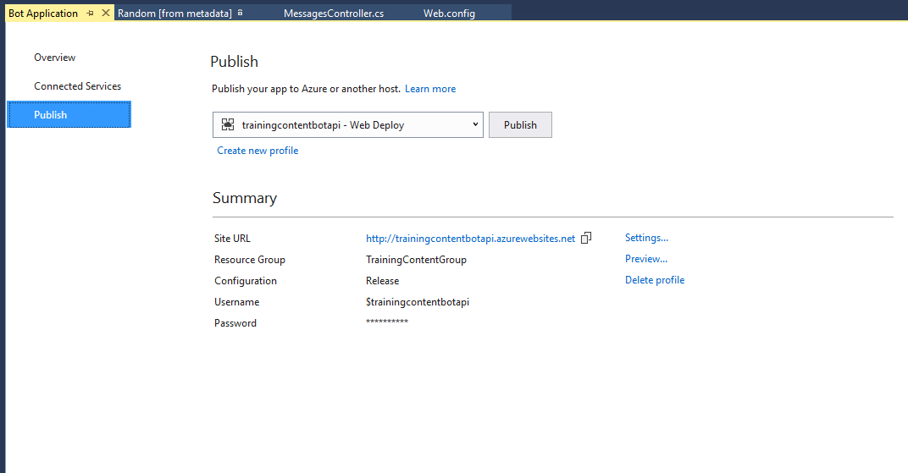

## Exercise 2: Register your Bot

#### THIS MAY BE THE NEW START FOR THE LAB - RADICAL CHANGES IN TOOLS!

1. In the Azure portal, click **+ New** and select **AI and Congitive Services**. Select ** Web App Bot** from the list of services.

2. In the **Bot name** textbox, enter a name for your Bot. Select a subscription, resource group, and pricing tier for your Bot; the F0 tier is free, and will work fine for this lab. Ensure the **Basic (C#)** Bot template is selected, and click create. It may take a few minutes.

3. Test your bot. Open the **Bot Services** blade and select your Bot. Under **Bot Managemnt** click **Test in Web Chat**. Tryt chatting to your bot, and it will echo the messages back to you.


#### LEFT OFF HERE


4. In the **handle** textbox, enter the handle for your Bot
5. In the Description textbox, enter a description for your Bot
6. In the Configuration section, in the Messaging endpoint textbox, enter the URL of your web app

	Use the URL for the web site you copied in the previous steps and add **/API/Messages** to the end of the URL.

	**Format:** https://\<YOUR WEB SITE\>.azurewebsites.net/API/Messages

	**Example:** https://trainingcontentbotapi.azurewebsites.net/API/Messages

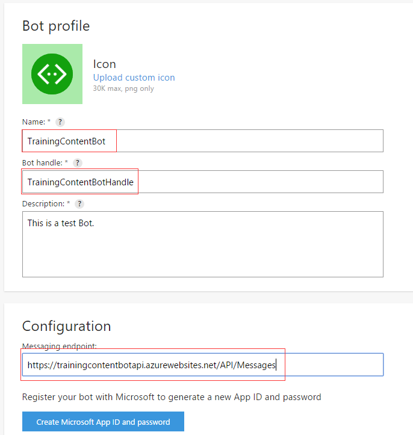
4. Click the **Create Microsoft App ID and password** button.  This opens a new browser tab/window.
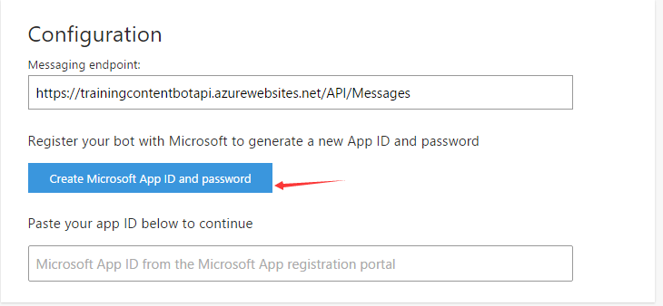
5. In the new browser tab/window, after the new application has been registered in Azure Active Directory, copy the **Application Id** and save it.  You will use it in a subsequent step.  
6. Click the **Generate an app password to continue** button.  This opens a popup and displays the password.
7. Copy the **password** and save it.  You will use it in a subsequent step.
8. Click **OK**.  This closes the popup.
9. Click the **Finish and go back to Bot Framework** button.  This closes the new browser tab/window and populates the app Id in the **Paste your app ID below to continue** textbox. 
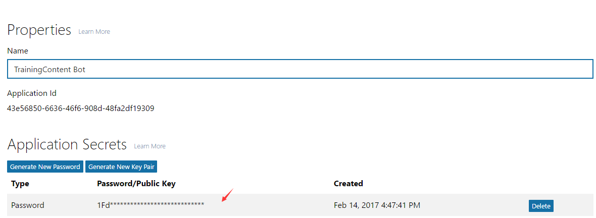
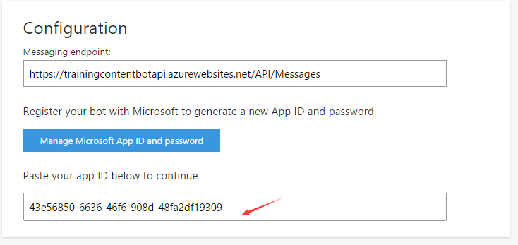
7. Select the **By clicking Register, you agree to the Privacy statement, Terms of use, and Code of conduct.** checkbox
8. Click the **Register** button
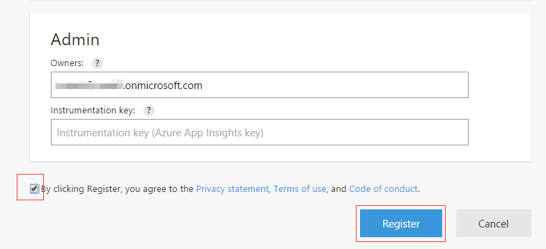
8. Verify your Bot was created successfully
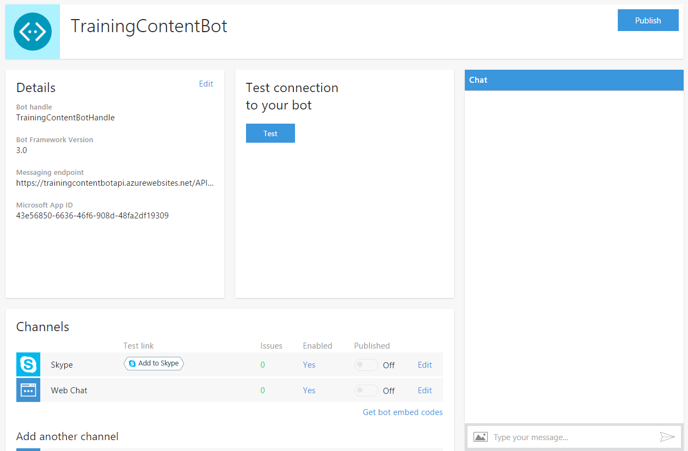
9. Open the **Web.config** file in the Visual Studio Bot project you created
10. Paste the **Microsoft App ID** and **password** that you created into the value attributes for the **MicrosoftAppId** and **MicrosoftAppPassword** keys in the **appSettings** section in the **web.config** file
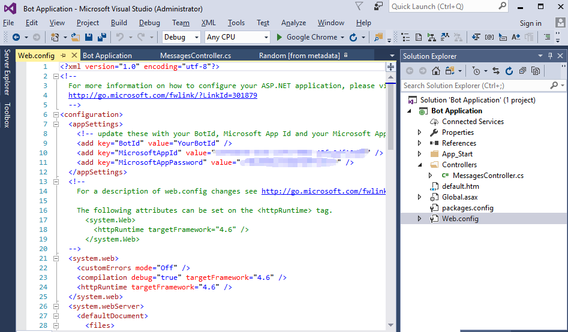
11. Save the web.config file
10. Re-publish your Bot to Azure

## Exercise 3: Add bot to Microsoft Teams

1. Go to the Microsoft Bot Framework portal at [https://dev.botframework.com](https://dev.botframework.com) and sign in with your Microsoft Account
2. Click **My bots** and open your bot that you just registered.
3. In the **Add another channel** section, click the **Add** link next to **Microsoft Teams**
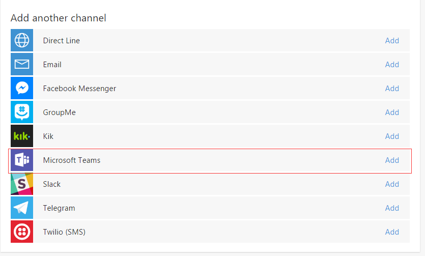
4. Click the **I'm done configuring Microsoft Teams >** button
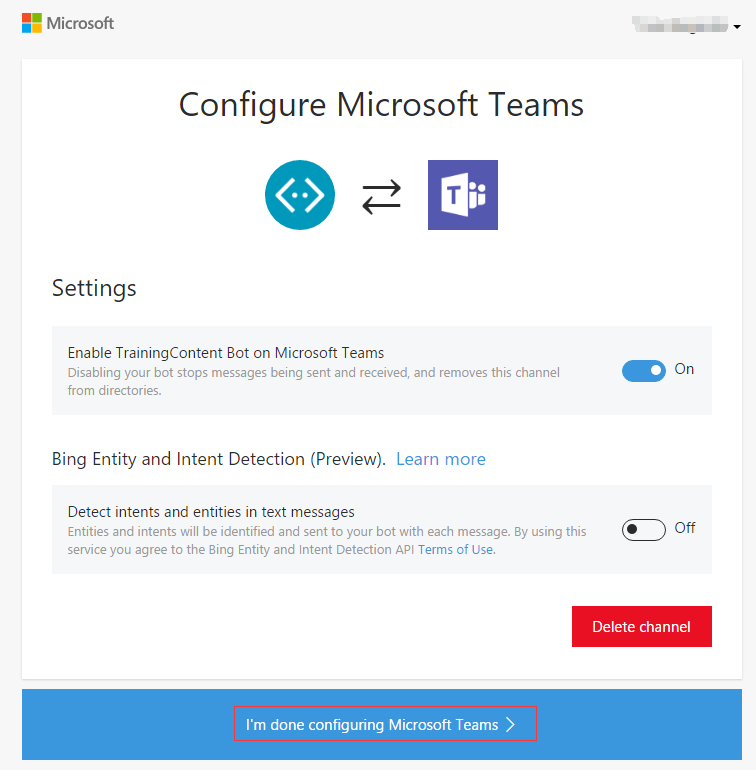
5. Open the **Microsoft Teams** desktop app and sign in using your Microsoft Account.
6. Click the **Chat** button
7. In the **Chat** pane, click the **Add chat** icon
8. In the **To:** textbox, enter the Microsoft App ID for your Bot.  Then, click **your bot** when the Bot name pops up.

7. You have now successfully added the Bot to Microsoft Teams.

8. In the chat window, type what is our inventory of replacement tires?

> **IMPORTANT NOTE:**  ***Do not copy and paste the question into the chat window.**  **Type it.*** Copy and pasting the text into the window may look correct, but it will not always work.

9. Observe the random number the Bot returns. 

Congratulations! You have created a simple Bot and added it to Microsoft Teams.