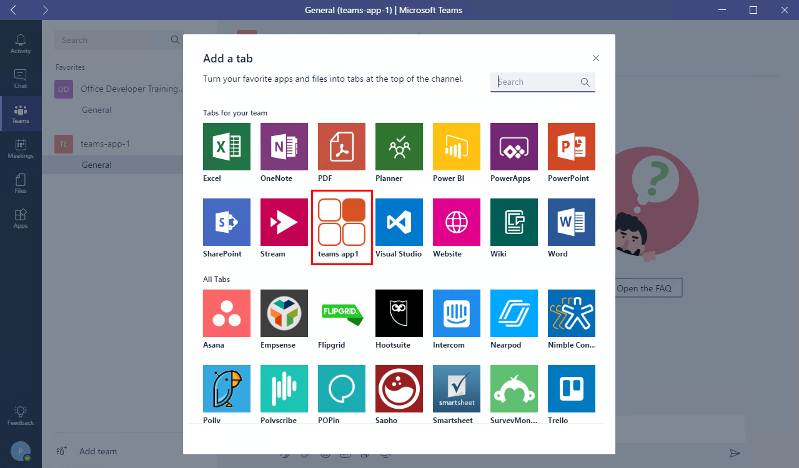
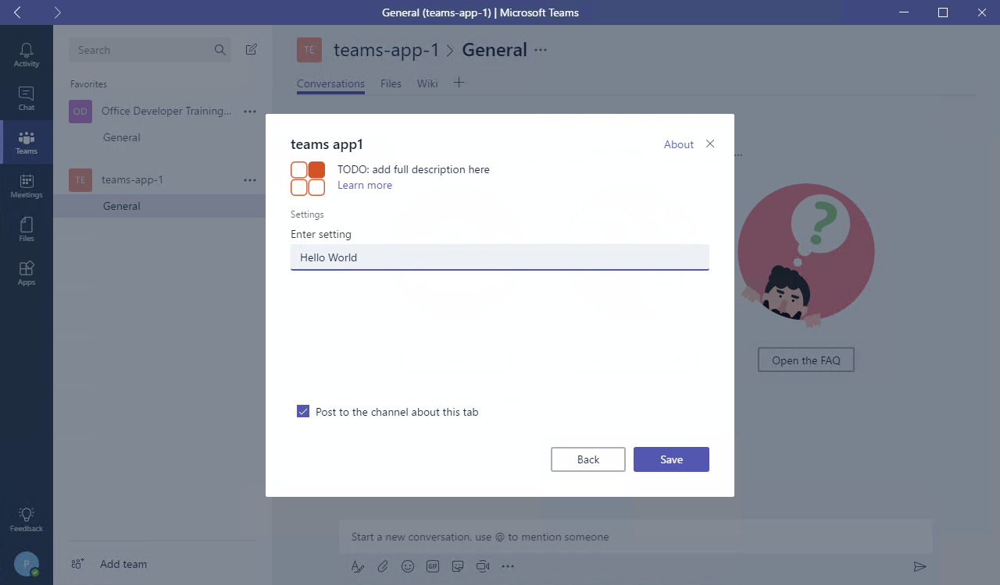

# Demo - Section 1: Teams Application Packaging and Testing

To run this demo, perform the following steps from the lab:

## Complete the prerequisites from the lab

1. Install developer tools
1. Install NodeJS and npm
1. Install Yeoman, gulp, gulp-cli and typescript
1. Download ngrok

## Run the ngrok secure tunnel application

1. Open a new **Command Prompt** window.
1. Change to the directory that contains the ngrok.exe application.
1. Run the command `ngrok http 3007`
1. The ngrok application will fill the entire prompt window. Make note of the Forwarding address using https. This address is required in the next step.

    

1. Minimize the ngrok Command Prompt window. It is no longer referenced in this exercise, but it must remain running.

## Update the manifest and build the package

1. Return to the first **Command Prompt** window in which the generator was run.

1. Launch **VS Code** by running the command `code .`

    

1. Open the **manifest.json** file in the **manifest** folder.

1. Replace all instances of `tbd.ngrok.io` with the HTTPS forwarding address from the ngrok window. In this example, the forwarding address is **0f3b4f62.ngrok.io**. There are five URLs that need to be changed.

1. Save the **manifest.json** file.

1. In the **Command Prompt** window, run the command `gulp manifest`. This command will create the package as a zip file in the **package** folder.

    

1. Build the webpack and start the express web server by running the following commands:

    ```shell
    gulp build
    gulp serve
    ```

    

    > Note: The gulp serve process must be running in order to see the tab in the Microsoft Teams application. When the process is no longer needed, press **CTRL+C** to cancel the server.

## Upload app into Microsoft Teams

1. In the Microsoft Teams application, select the **Create and join team** link. Then select the **Create team** button.

    

1. Enter a team name and description. In this example, the team is named **teams-app-1**. Select **Next**.

1. Optionally, invite others from your organization to the team. This step can be skipped in this lab.

1. The new team is shown. In the side panel on the left, select the ellipses next to the team name. Choose **Manage team** from the context menu.

    

1. On the Manage team menu, select **Apps** in the tab strip. Then select the **Upload a custom app** link at the bottom right corner of the application. If you don't have this link, check the sideload settings in the [Getting Started article](https://msdn.microsoft.com/en-us/microsoft-teams/setup).

    

1. Select the **teams-app-1.zip** file from the **package** folder. Select **Open**.

    

1. The app is displayed. Notice information about the app from the manifest (Description and Icon) is displayed.

    

## Add Tab to Team view

1. Tabs are not automatically displayed for the team. To add the tab, select **General** channel in the team.

1. Select the **+** icon at the end of the tab strip.

1. In the tab gallery, uploaded tabs are displayed in the **Tabs for your team** section. Tabs in this section are arranged alphabetically. Select the tab created in this lab.

    

1. The generator creates a configurable tab. When the tab is added to the team, the configuration page is displayed. Enter any value in the **Setting** box and select **Save**.

    

1. The value entered will then be displayed in the tab window.

    