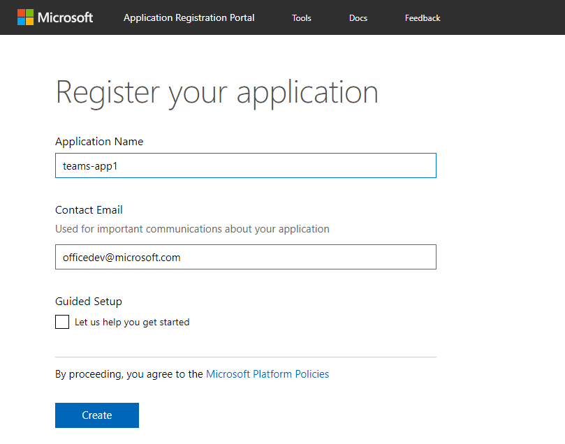
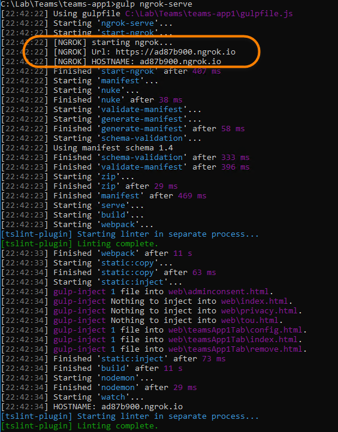
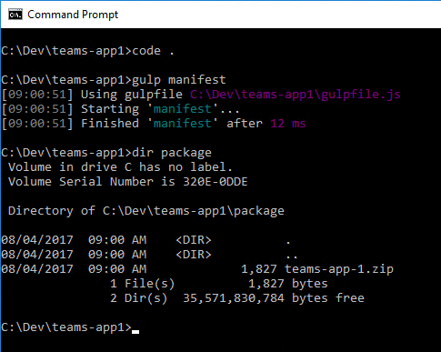
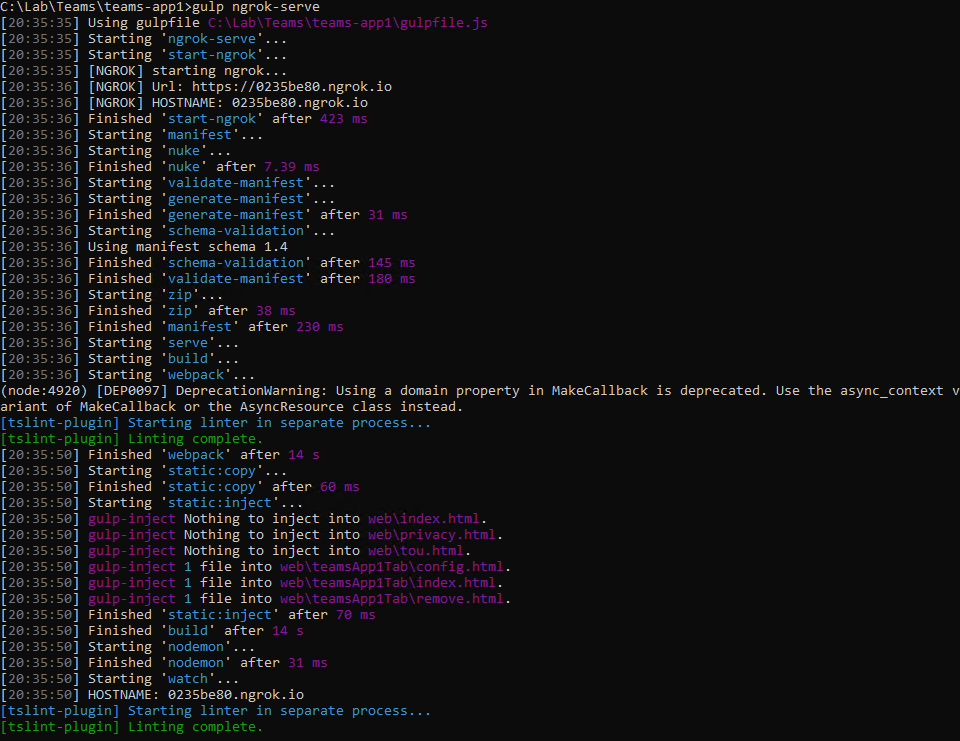
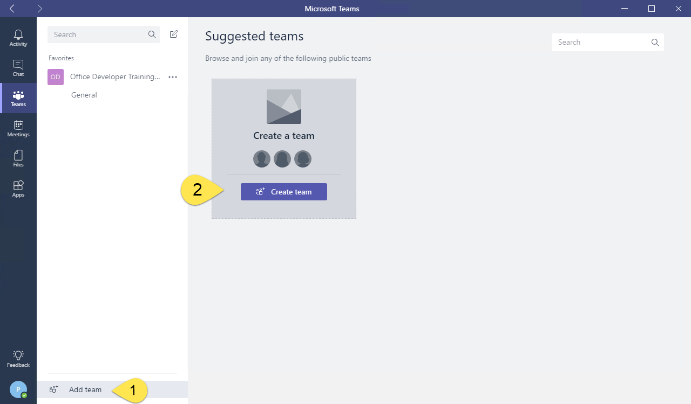
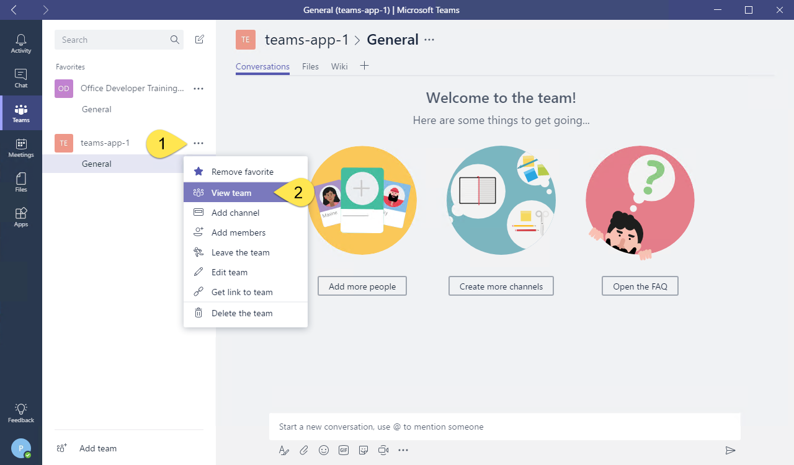
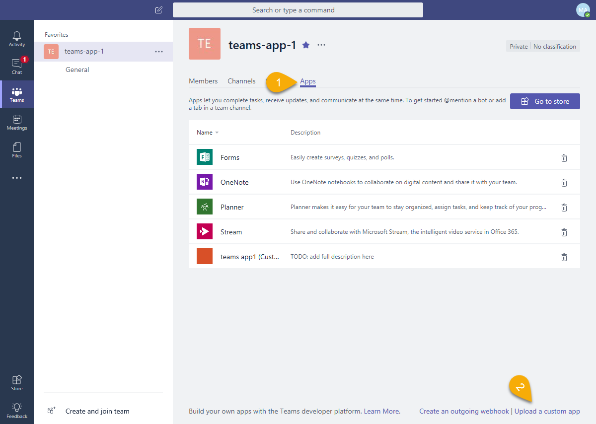
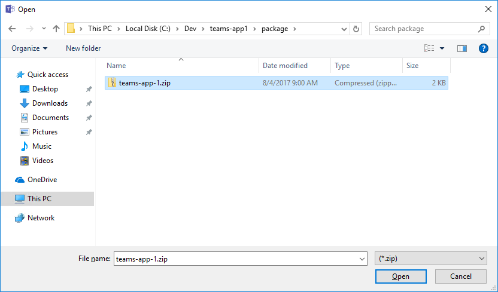
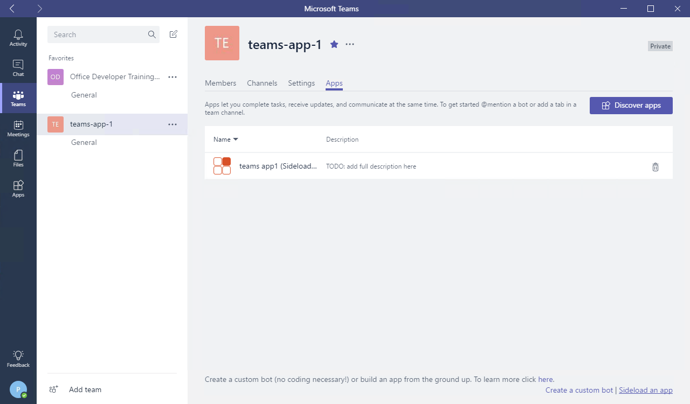

# Demo - Section 3: Build a Microsoft Teams Tab

To run this demo, perform the following steps from the lab:

## Complete the prerequisites from the lab

1. Install developer tools
1. Install NodeJS and npm
1. Install Yeoman and gulp
1. Download ngrok

## Run the ngrok secure tunnel application

1. Open a new **Command Prompt** window.

1. Change to the directory that contains the **ngrok.exe** application.

1. Run the command `ngrok http 3007`.

1. The **ngrok** application will fill the entire prompt window. Make note of the forwarding address using HTTPS. This address is required in the next step.

1. Minimize the ngrok command prompt window. It is no longer referenced in this exercise, but it must remain running.

## Register an application in AAD

To enable an application to call the Microsoft Graph API, an application registration is required. This lab uses the [Azure Active Directory v2.0 endpoint](https://docs.microsoft.com/en-us/azure/active-directory/develop/active-directory-v2-compare).

1. Open the [Application Registration Portal](https://apps.dev.microsoft.com).

1. Log in with a work or school account.

1. Select **Add an app**.

1. Complete the **Register your application** section by entering an application name and contact email. Clear the checkbox for **Guided Setup**. Select **Create**.

    

1. On the registration page, in the **Platforms** section, select **Add Platform**.

    

1. In the **Add Platform** dialog, select **Web**.

1. Using the hostname from ngrok, enter a **Redirect URL** to the **auth.html** file.

    ```
    https://[replace-this].ngrok.io/auth.html
    ```

1. Select the **Add URL** button.

1. Using the hostname from ngrok, enter a **Redirect URL** to the **adminconsent.html** file.

    ```
    https://[replace-this].ngrok.io/adminconsent.html
    ```

    

1. Select **Save**.

## Update the manifest and build the package

1. Open the **manifest.json** file in the **manifest** folder.

1. Replace all instances of `tbd.ngrok.io` with the HTTPS forwarding address from the ngrok window. In this example, the forwarding address is **https://0f3b4f62.ngrok.io**. There are six URLs that need to be changed.

1. Save the **manifest.json** file.

1. In the **Command Prompt** window, run the command `gulp manifest`. This command will create the package as a zip file in the **package** folder.

    

1. Build the webpack and start the express web server by running the following commands:

    ```shell
    gulp build
    gulp serve
    ```

    

    > Note: The gulp serve process must be running in order to see the tab in the Microsoft Teams application. When the process is no longer needed, press **CTRL+C** to cancel the server.

## Upload app into Microsoft Teams

1. In the Microsoft Teams application, select the **Create and join team** link. Then select the **Create team** button.

    

1. Enter a team name and description. In this example, the team is named **teams-app-1**. Select **Next**.

1. Optionally, invite others from your organization to the team. This step can be skipped in this lab.

1. The new team is shown. In the side panel on the left, select the ellipses next to the team name. Choose **Manage team** from the context menu.

    

1. On the Manage team menu, select **Apps** in the tab strip. Then select the **Upload a custom app** link at the bottom right corner of the application. If you don't have this link, check the sideload settings in the [Getting Started article](https://msdn.microsoft.com/en-us/microsoft-teams/setup).

    

1. Select the **teams-app-1.zip** file from the **package** folder. Select **Open**.

    

1. The app is displayed. Notice information about the app from the manifest (Description and Icon) is displayed.

    
