# Lab: Fundamentals of Microsoft Teams development

In this lab, you will prepare your computer for developing Microsoft Teams apps, learn the steps to package and test your application, build a basic Microsoft Teams bot and a Microsoft Teams tab.

## In this lab

1. [Create and test a basic Microsoft Teams app using Yeoman](#exercise1)
1. [Create and test a basic Microsoft Teams bot using Visual Studio](#exercise2)
1. [Call the Microsoft Graph API inside a tab](#exercise3)

## Prerequisites

Developing apps for Microsoft Teams requires preparation for both the Office 365 tenant and the development workstation.

For the Office 365 Tenant, the setup steps are detailed on the [Getting Started page](https://msdn.microsoft.com/en-us/microsoft-teams/setup). Note that while the getting started page indicates that the Public Developer Preview is optional, this lab includes steps that are not possible unless the preview is enabled.

### Install developer tools

The developer workstation requires the following tools for this lab.

#### Install NodeJS & NPM

Install [NodeJS](https://nodejs.org/) Long Term Support (LTS) version. If you have NodeJS already installed please check you have the latest version using `node -v`. It should return the current [LTS version](https://nodejs.org/en/download/). Allowing the **Node setup** program to update the computer `PATH` during setup will make the console-based tasks in this easier to accomplish.

After installing node, make sure **npm** is up to date by running following command:

````shell
npm install -g npm
````

#### Install Yeoman, Gulp, Gulp-cli and TypeScript

[Yeoman](http://yeoman.io/) helps you start new projects, and prescribes best practices and tools to help you stay productive. This lab uses a Yeoman generator for Microsoft Teams to quickly create a working, JavaScript-based solution. The generated solution uses Gulp, Gulp CLI and TypeScript to run tasks.

Enter the following command to install the prerequisites:

````shell
npm install -g yo gulp gulp-cli typescript
````

#### Install Yeoman Teams generator

The Yeoman Teams generator helps you quickly create a Microsoft Teams solution project with boilerplate code and a project structure & tools to rapidly create and test your app.

Enter the following command to install the Yeoman Teams generator:

````shell
npm install generator-teams@preview -g
````

#### Download ngrok

As Microsoft Teams is an entirely cloud-based product, it requires all services it accesses to be available from the cloud using HTTPS endpoints. To enable the exercises to work within Microsoft Teams, a tunneling application is required.

This lab uses [ngrok](https://ngrok.com) for tunneling publicly-available HTTPS endpoints to a web server running locally on the developer workstation. ngrok is a single-file download that is run from a console.

#### Code editors

Tabs in Microsoft Teams are HTML pages hosted in an iframe. The pages can reference CSS and JavaScript like any web page in a browser.

Microsoft Teams supports much of the common [bot framework](https://dev.botframework.com/) functionality. The Bot Framework provides an SDK for C# and Node.

You can use any code editor or IDE that supports these technologies, however the steps and code samples in this training use [Visual Studio Code](https://code.visualstudio.com/) for tabs using HTML/JavaScript and [Visual Studio 2017](https://www.visualstudio.com/) for bots using the C# SDK.

#### Bot template for Visual Studio 2017

Download and install the [bot application template](https://marketplace.visualstudio.com/items?itemName=BotBuilder.BotBuilderV3). The extension can be installed by double-clicking on the VSIX file.

   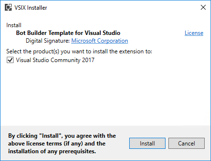

<a name="exercise1"></a>

## Exercise 1: Create and test a basic Microsoft Teams app using Yeoman

This exercise introduces the Yeoman generator and its capabilities for scaffolding a project and testing its functionality. In this exercise, you will create a basic Microsoft Teams App.

1. Open a **Command Prompt** window.

1. Change to the directory where you will create the tab.

     > **Note:** Directory paths can become quite long after node modules are imported.  It is recommended that you use a directory name without spaces in it and create it in the root folder of your drive.  This will make working with the solution easier in the future and protect you from potential issues associated with long file paths. In this example, you will use `c:\Dev` as the working directory.

1. Type `md teams-app1` and press **Enter**.

1. Type `cd teams-app1` and press **Enter**.

### Run the Yeoman Teams generator

1. Type `yo teams` and press **Enter**.

    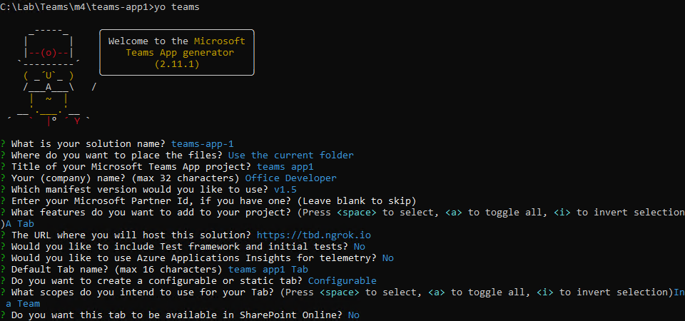

1. When prompted, accept the default **teams-app-1** as your solution name and press **Enter**.

1. Select **Use the current folder** for the file location and select **Enter**. The next set of prompts asks for specific information about your Microsoft Teams app:
    - Accept the default **teams app1** as the name of your Microsoft Teams app project and press **Enter**.
    - Enter your name and press **Enter**.
    - Accept the default selection of **Tab** for what you want to add to your project and press **Enter**.
    - Enter **https://tbd.ngrok.io** as the URL where you will host this tab and press **Enter**. You will change this URL later in the exercise.
    - Accept the default **teams app1 Tab** as the default tab name and press **Enter**.

      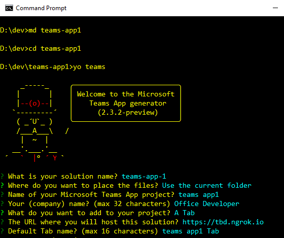

    At this point, Yeoman will install the required dependencies and scaffold the solution files along with the basic tab. This might take a few minutes. When the scaffold is complete, you should see the following message indicating success.

    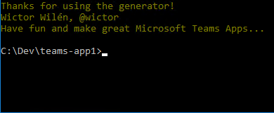

### Run the ngrok secure tunnel application

1. Open a new **Command Prompt** window.

1. Change to the directory that contains the **ngrok.exe** application.

1. Run the command `ngrok http 3007`.

1. The ngrok application will fill the entire prompt window. Make note of the forwarding address using HTTPS. This address is required in the next step.

1. Minimize the ngrok command prompt window. It is no longer referenced in this exercise, but it must remain running.

    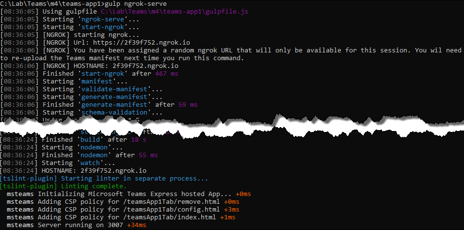

### Update the Microsoft Teams app manifest and create package

When the solution was generated, you used a placeholder URL. Now that the tunnel is running, you need to use the actual URL that is routed to your computer.

1. Return to the first **Command Prompt** window in which the generator was run.

1. Launch **VS Code** by running the command `code .`

    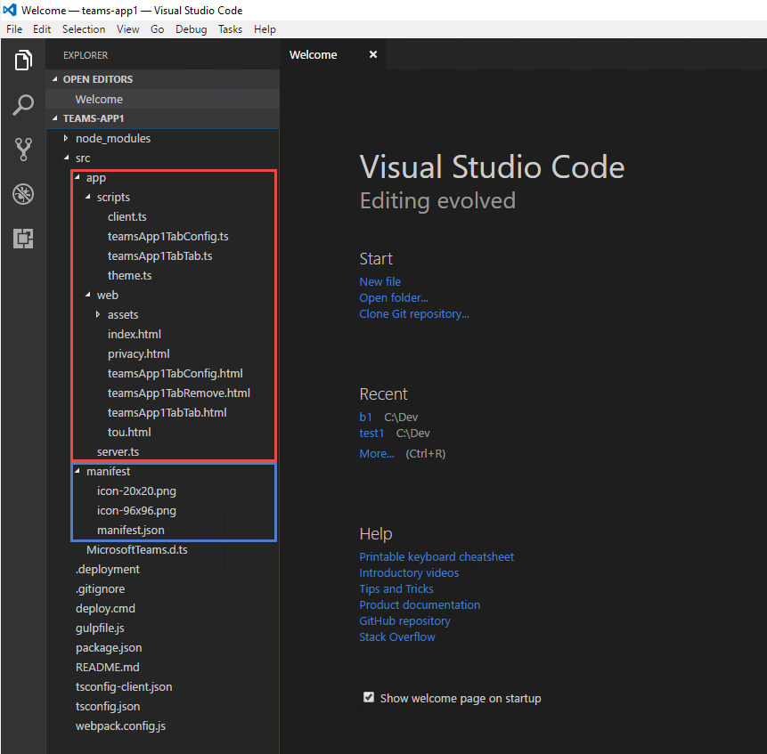

1. Open the **manifest.json** file in the **manifest** folder.

1. Replace all instances of `tbd.ngrok.io` with the HTTPS forwarding address from the ngrok window. In this example, the forwarding address is **0f3b4f62.ngrok.io**. There are five URLs that need to be changed.

1. Save the **manifest.json** file.

1. In the **Command Prompt** window, run the command `gulp manifest`. This command will create the package as a zip file in the **package** folder.

    

1. Build the webpack and start the express web server by running the following commands:

    ```shell
    gulp build
    gulp serve
    ```

    

    > Note: The gulp serve process must be running in order to see the tab in the Microsoft Teams application. When the process is no longer needed, press **CTRL+C** to cancel the server.

### Upload app into Microsoft Teams

1. In the Microsoft Teams application, select the **Create and join team** link. Then select the **Create team** button.

    

1. Enter a team name and description. In this example, the team is named **Training Content**. Select **Next**.

1. Optionally, invite others from your organization to the team. This step can be skipped in this lab.

1. The new team is shown. In the side panel on the left, select the ellipses next to the team name. Choose **Manage team** from the context menu.

    

1. On the Manage team menu, select **Apps** in the tab strip. Then select the **Upload a custom app** link at the bottom right corner of the application. If you don't have this link, check the sideload settings in the [Getting Started article](https://msdn.microsoft.com/en-us/microsoft-teams/setup).

    

1. Select the **teams-app-1.zip** file from the **package** folder. Select **Open**.

    

1. The app is displayed. Notice information about the app from the manifest (Description and Icon) is displayed.

    

The app is now uploaded into the Microsoft Teams application and the tab is available in the **Tab Gallery**.

### Add tab to team view

1. Tabs are not automatically displayed for the team. To add the tab, select **General** channel in the team.

1. Select the **+** icon at the end of the tab strip.

1. In the tab gallery, uploaded tabs are displayed in the **Tabs for your team** section. Tabs in this section are arranged alphabetically. Select the tab created in this lab.

    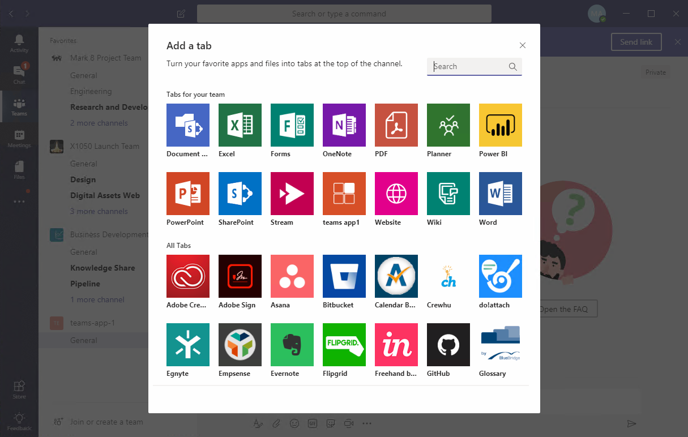

1. The generator creates a configurable tab. When the tab is added to the team, the configuration page is displayed. Enter any value in the **Setting** box and select **Save**.

    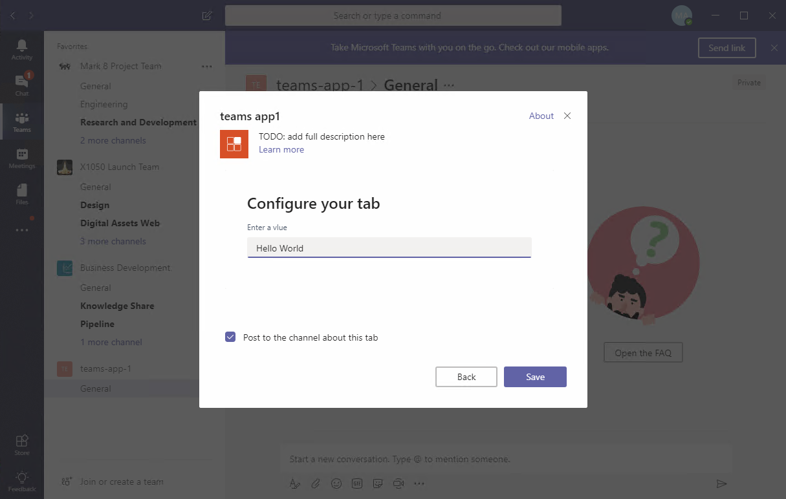

1. The value entered will then be displayed in the tab window.

    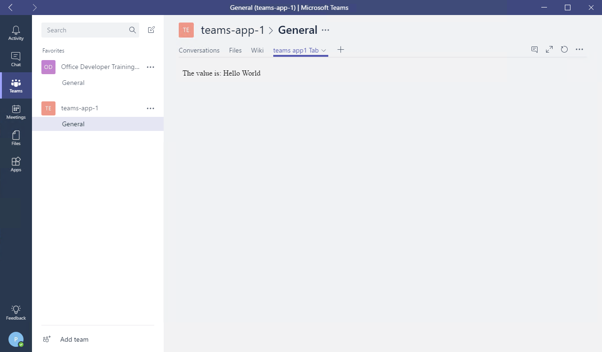

<a name="exercise2"></a>

## Exercise 2: Create and test a basic Microsoft Teams bot using Visual Studio

This section of the lab introduces the Bot Framework template and its capabilities for scaffolding a project and testing its functionality. In this exercise, you will create a basic Microsoft Teams bot.

1. Launch Visual Studio 2017 as an administrator.

1. In Visual Studio 2017, select **File > New > Project**.

1. Create a new Bot Framework project using the **Bot Builder Echo Bot** template.

   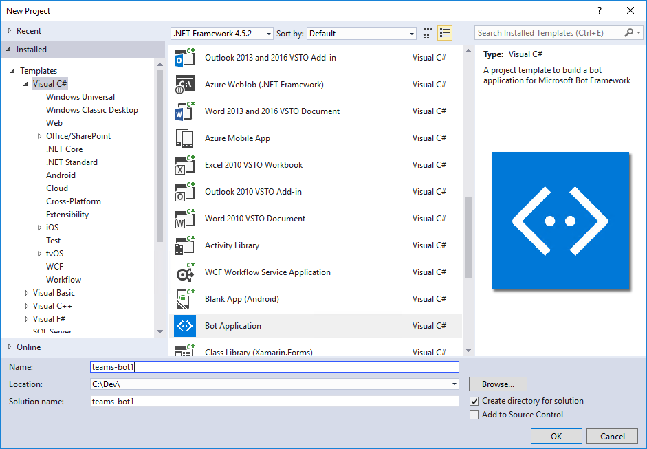

    The bot application template is a fully functional echo bot that takes the user's text utterance as input and returns it as output. In order to run the bot inside Microsoft Teams:

    - The bot must be accessible from the internet
    - The bot must be registered with the Bot Connector
    - The `AppId` and `AppSecret` from the Bot Framework registration page have to be recorded in the project's `web.config`
    - The bot must be added to Microsoft Teams

    Before registering the bot, note the URL configured for the solution in Visual Studio.

1. In Solution Explorer, double-click on **Properties**.

1. In the **Properties** designer, select the **Web** tab.

1. Note the **Project URL**.

    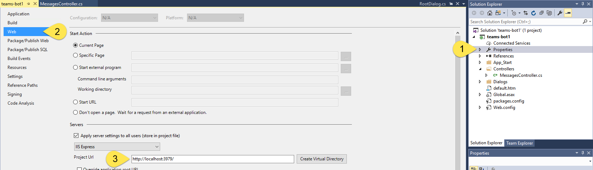

### Run the ngrok secure tunnel application

1. Open a new **Command Prompt** window.

1. Download [ngrok](https://ngrok.com/download) and unzip the **ngrok secure tunnel application**. Change to the directory that contains the **ngrok.exe** application.

1. Run the command `ngrok http [port] -host-header=localhost:[port]` Replace `port` with the port portion of the URL noted above.

1. The ngrok application will fill the entire prompt window. Make note of the forwarding address using HTTPS. This address is required in the next step.

1. Minimize the ngrok command prompt window. It is no longer referenced in this lab, but it must remain running.

    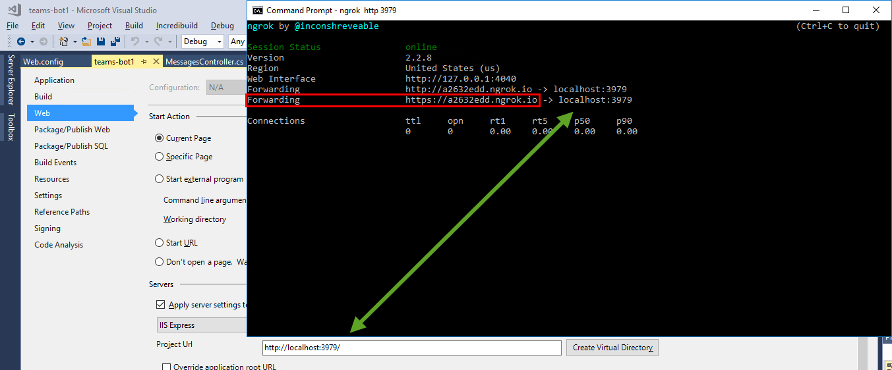

### Register the bot

1. Go to the [Microsoft Bot Framework create page](https://dev.botframework.com/bots/new) at https://dev.botframework.com/bots/new. (Do not use the Create button on the Bot Framework portal home page, as this will redirect to the Azure Portal.) Sign in with your work or school account. If necessary, accept the Terms of service.

1. Complete the bot profile section, entering a display name, unique bot handle and description.

    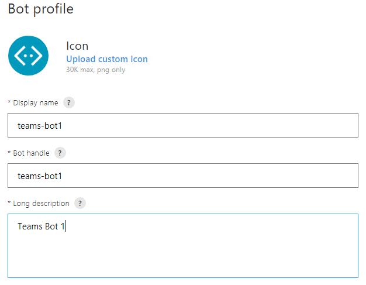

1. Complete the configuration section.
    - For the **Messaging endpoint**, use the forwarding HTTPS address from ngrok with `/api/messages` appended to provide the route to the **MessagesController** in the Visual Studio project. In the example, this is `https://a2632edd.ngrok.io/api/messages`.
    - Select the **Create Microsoft App ID and password button** to open a new browser window.
    - In the new browser window the application is registered in Azure Active Directory. Select **Generate an app password to continue**. An app secret is generated. Copy the secret and save it. You will use it in a subsequent step.
    - Select **OK** to close the dialogue box.
    - Select the **Finish and go back to Bot Framework** button to close the new browser window and populate the app ID in the **Paste your app ID below to continue textbox**.

        

1. Move to the bottom of the page. Agree to the privacy statement, terms of use, and code of conduct and select the **Register** button. Once the bot is created, select **OK** to dismiss the dialogue box. The **Connect to channels** page is displayed for the newly-created bot.

**Note:** The Bot migration message (shown in red) can be ignored for Microsoft Teams bots.

1. The bot must then be connected to Microsoft Teams. Select the **Teams** logo.

    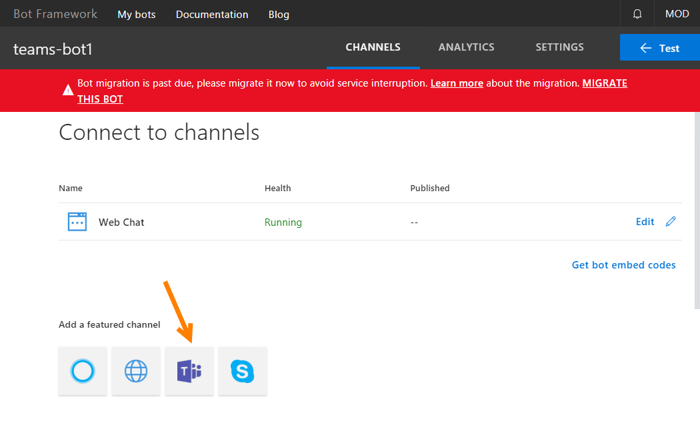

1. When the connection is complete, ensure the connection is enabled and select **Done**.

    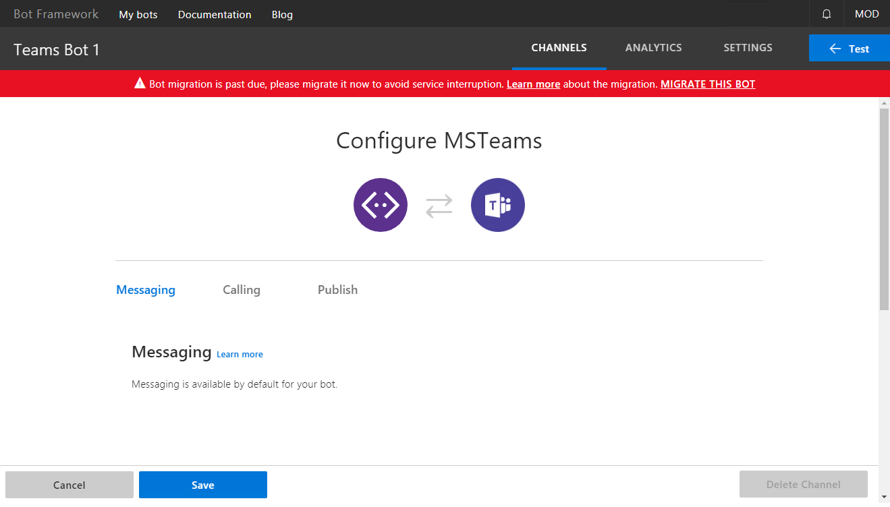

    The bot registration is complete. Selecting **Settings** in the top navigation will re-display the profile and configuration sections. This can be used to update the messaging endpoint in the event ngrok is stopped, or the bot is moved to production.

### Configure the web project

The bot project must be configured with information from the registration.

1. In Visual Studio, open the **Web.config** file. Locate the `<appSettings>` section.

1. Enter the `BotId` value. The `BotId` is the **Bot handle** from the **Configuration** section of the registration.

1. Enter the `MicrosoftAppId`. The `MicrosoftAppId` is the app ID from the **Configuration** section of the registration.

1. Enter the `MicrosoftAppPassword`. The `MicrosoftAppPassword` is the auto-generated app secret displayed in the dialogue box during registration. If you do not have the app secret, the bot must be deleted and re-registered. An app secret cannot be reset nor displayed.

### Test the bot using the portal

The Bot registration portal can be used to test the bot.

1. Ensure ngrok is still running, and the Messaging endpoint of the bot registration is using the hostname shown as the forwarding HTTPS address in ngrok.

1. In Visual Studio, select **F5** to start the project.

1. When the **default.htm** page is displayed, return to the [Bot registration portal](https://dev.botframework.com/bots).

1. Select your bot.

1. In the top-right corner of the page, select the **Test** button.

1. Enter a message and select **Enter**. The message is echoed back along with the length of the message. If the message cannot be sent, there is an error in the configuration of the Bot registration, ngrok and Visual Studio. The request should be visible in the ngrok command window. For additional detail on the request in ngrok, open the address `http://localhost:4040`. If no requests are displayed in ngrok, then the Messaging endpoint has the wrong hostname, or there is a disruption in the network connectivity.

    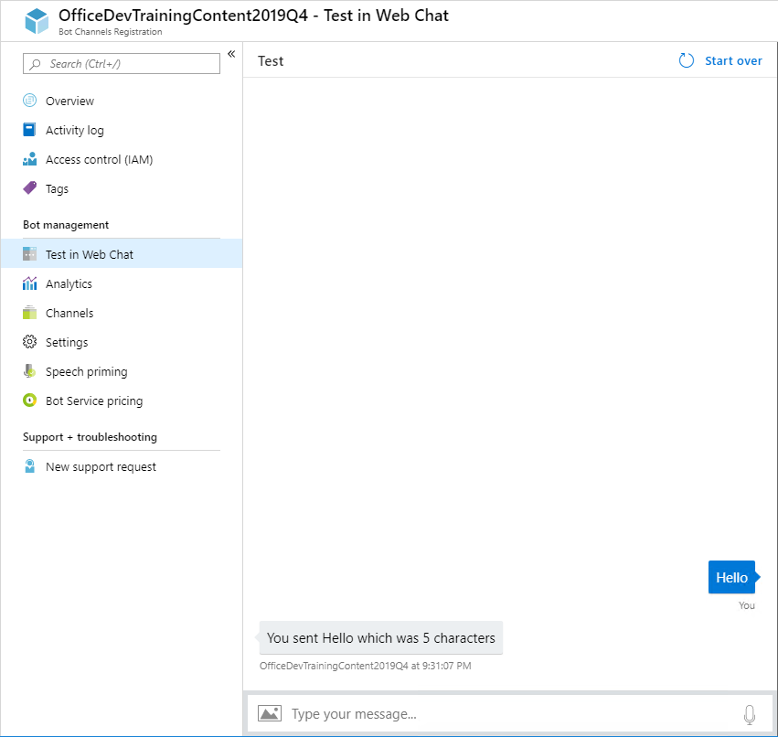

### Configure Visual Studio to package bot

Packaging a bot for Microsoft Teams is identical to packaging a tab. A manifest file and related resources are compressed into a zip file and added to a team. The follow steps will be performed in Visual Studio.

1. Stop debugging before continuing but leave ngrok running.

1. Right-click on the project, choose **Add > New Folder**. Name the folder **Manifest**.

1. Add the displayed files from the **Lab Files** folder of this repository.

    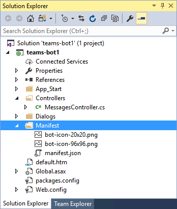

1. Open the **manifest.json** file just added to the project. The **manifest.json** file requires several updates:
      - The `id` property must contain the app ID from registration. Replace the token `[microsoft-app-id]` with the app ID.
      - The `packageName` property must contain a unique identifier. The industry standard is to use the bot's URL in reverse format. Replace the token `[from-ngrok]` with the unique identifier from the forwarding address.
      - The `developer` property has three URLs that should match the hostname of the Messaging endpoint. Replace the token `[from-ngrok]` with the unique identifier from the forwarding address.
      - The `botId` property in the `bots` collection property also requires the app ID from registration. Replace the token `[microsoft-app-id]` with the app ID.
      - Save and close the **manifest.json** file.

### Compress the manifest folder

1. In Solution Explorer, right-click on the project and choose **Unload Project**. If prompted, select **Yes** to save changes.

    

1. Right-click on the project file and choose **Edit [project-name].csproj**.

    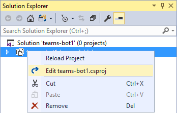

1. Move to the end of the file. Add the following target to the file. Be sure to add the target outside of the comment. This target will invoke a custom build task to compress the files in the manifest directory.

    ```xml
    <Target Name="AfterBuild">
      <ZipDir InputBaseDirectory="manifest"
              OutputFileName="$(OutputPath)\$(MSBuildProjectName).zip"
              OverwriteExistingFile="true"
              IncludeBaseDirectory="false" />
    </Target>
    ```

1. Add the following Task element to the **.csproj** file.

    ```xml
    <UsingTask TaskName="ZipDir" TaskFactory="CodeTaskFactory"
              AssemblyFile="$(MSBuildToolsPath)\Microsoft.Build.Tasks.v4.0.dll">
      <ParameterGroup>
        <InputBaseDirectory ParameterType="System.String" Required="true" />
        <OutputFileName ParameterType="System.String" Required="true" />
        <OverwriteExistingFile ParameterType="System.Boolean" Required="false" />
        <IncludeBaseDirectory ParameterType="System.Boolean" Required="false" />
      </ParameterGroup>
      <Task>
        <Reference Include="System.IO.Compression" />
        <Reference Include="System.IO.Compression.FileSystem" />
        <Using Namespace="System.IO.Compression" />
        <Code Type="Fragment" Language="cs"><![CDATA[
          if (File.Exists(OutputFileName))
          {
            if (!OverwriteExistingFile)
            {
              return false;
            }
            File.Delete(OutputFileName);
          }
          ZipFile.CreateFromDirectory
          (
            InputBaseDirectory, OutputFileName,
            CompressionLevel.Optimal, IncludeBaseDirectory
          );
        ]]></Code>
      </Task>
    </UsingTask>
    ```

1. **Save** and **close** the project file.

1. In **Solution Explorer**, right-click on the project and choose **Reload Project**.

1. Select **F5** to run the project. The new **AfterBuild target** will run, creating a zip file in the build output folder (`bin`).

### Upload app into Microsoft Teams

Although not strictly necessary, in this lab you will add the bot to a new team.

1. In the Microsoft Teams application, select the ellipses next to the team name. Choose **Manage team** from the menu.

    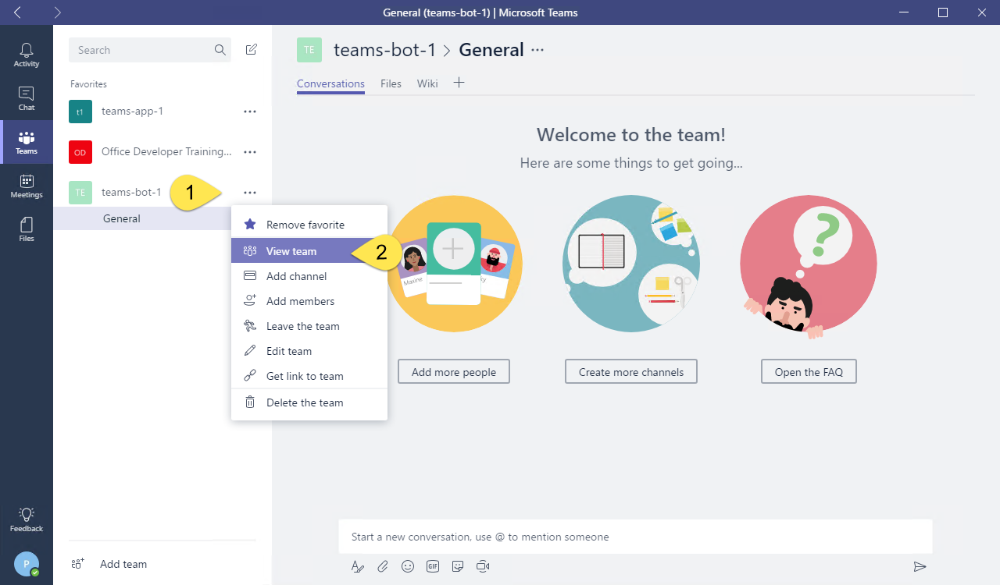

1. On the manage team page, select **Apps** in the tab strip. Then select the **Upload a custom app** link at the bottom right corner of the application.

1. Select the **teams-bot1.zip** file from the **bin** folder. Select **Open**.

1. The app is displayed. Notice the description and icon for the app from the manifest is displayed.

    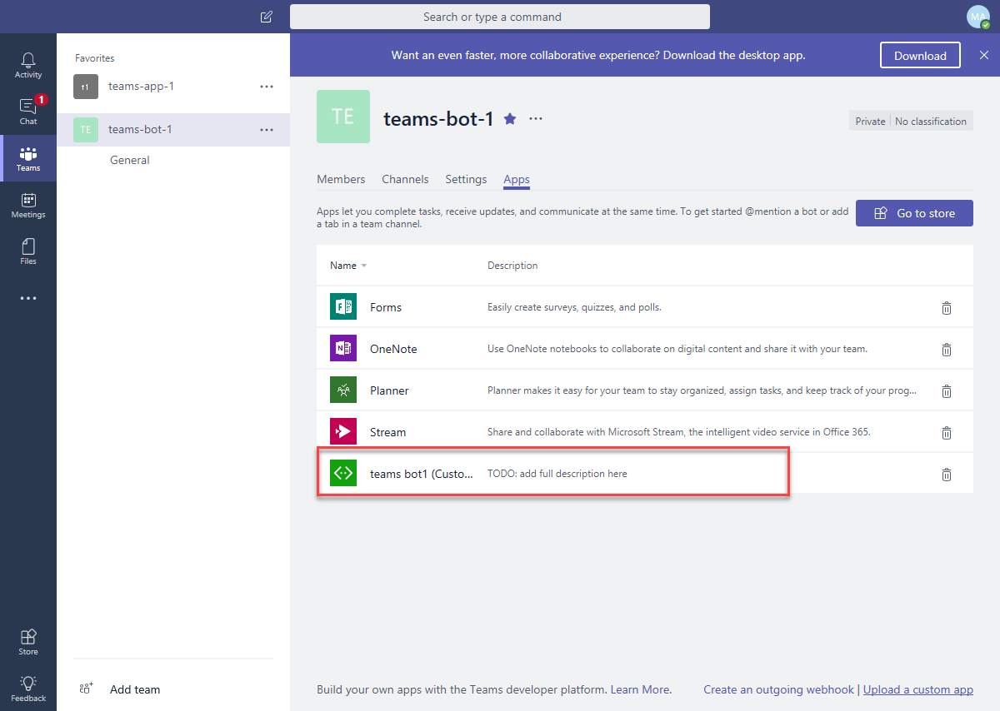

    The app is now uploaded into the Microsoft Teams application and the bot is available.

### Interact with the bot

1. In the general channel for the team, a message is created announcing the bot has been added to the team. To interact with the bot, @ mention the bot.

    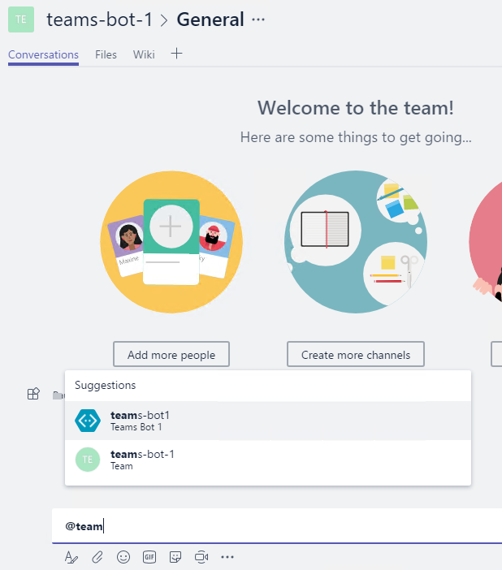

1. As you test the bot, you will notice that the character count is not correct. You can set breakpoints in the Visual Studio project to debug the code. (Remember, however, that the count was correct using the registration portal.) Later modules of this training will review how to remove mentions from the message.

<a name="exercise3"></a>

## Exercise 3: Call the Microsoft Graph API inside a tab

This section of the lab will extend the tab created in Exercise 1 to call the Microsoft Graph API. The exercise contains many code files. The **Lab Files** folder contains files that contain the code and are provided to facilitate copying the code.

### Run the ngrok secure tunnel application

1. Open a new **Command Prompt** window.

1. Change to the directory that contains the **ngrok.exe** application.

1. Run the command `ngrok http 3007`.

1. The **ngrok** application will fill the entire prompt window. Make note of the forwarding address using HTTPS. This address is required in the next step.

1. Minimize the ngrok command prompt window. It is no longer referenced in this exercise, but it must remain running.

    

### Register an application in AAD

To enable an application to call the Microsoft Graph API, an application registration is required. This lab uses the [Azure Active Directory v2.0 endpoint](https://docs.microsoft.com/en-us/azure/active-directory/develop/active-directory-v2-compare).

1. Open the [Application Registration Portal](https://apps.dev.microsoft.com).

1. Log in with a work or school account.

1. Select **Add an app**.

1. Complete the **Register your application** section by entering an application name and contact email. Clear the checkbox for **Guided Setup**. Select **Create**.

    

1. On the registration page, in the **Platforms** section, select **Add Platform**.

    

1. In the **Add Platform** dialog, select **Web**.

1. Using the hostname from ngrok, enter a **Redirect URL** to the **auth.html** file.

    ```
    https://[replace-this].ngrok.io/auth.html
    ```

1. Select the **Add URL** button.

1. Using the hostname from ngrok, enter a **Redirect URL** to the **adminconsent.html** file.

    ```
    https://[replace-this].ngrok.io/adminconsent.html
    ```

    

1. Select **Save**.

1. Make note of the application ID. This value is used in the authentication / token code.

### Request permission to read groups

1. Move to the **Microsoft Graph Permissions** section.

1. Next to **Delegated Permissions**, select the **Add** button.

1. In the **Select Permission** dialog, scroll down and select **Group.Read.All**. Select **OK**.

      

1. Select **Save**.

### Add the Microsoft Authentication Library (MSAL) to the project

1. Open a **Command Prompt** window.

1. Change to the directory containing the tab application.

1. Run the following command:

    ```shell
    npm install msal
    ```

### Configure tab when added to channel

The tab in this exercise can be configured to read information from Microsoft Graph API about the current member or about the group in which the channel exists. Perform the following to update the tab configuration.

**Note:** These steps assume that the application created in Exercise 1 is named **teams-app-1**. Paths listed in this section are relative to the **src/app/** folder in the generated application.

1. Open the file **scripts/teamsApp1TabConfig.tsx**.
1. At the top of the file is an `import` statement with several components from `msteams-ui-components-react`. Add `Dropdown` to the list of components.
1. Locate the `IteamsApp1TabConfigState` class. Rename the `value` property to `selectedConfiguration`.

    ```typescript
    export interface IteamsApp1TabConfigState extends ITeamsBaseComponentState {
      selectedConfiguration: string;
    }
    ```

1. Locate the `teamsApp1TabConfig` class. Create the following member variables by inserting the lines before the first method.

    ```typescript
    configOptions = [
      { key: 'MBR', value: 'Member information' },
      { key: 'GRP', value: 'Group information (requires admin consent)' }
    ];
    selectedOption: string = "";
    tenantId?: string = "";
    ```

1. In the `teamsApp1TabConfig` class is a method named `componentWillMount`. In this method, there is a call to `microsoftTeams.getContext`. Update the `getContext` callback to use the proper state variable, and to update the tenant id.

    ```typescript
    microsoftTeams.getContext((context: microsoftTeams.Context) => {
      this.tenantId = context.tid;
      this.setState({
        selectedConfiguration: context.entityId
      });
      this.setValidityState(true);
    });
    ```

1. In the `componentWillMount` method is a call to `microsoftTeams.settings.setSettings`. Update the parameter of this method call to use the proper state variable.

    ```typescript
    microsoftTeams.settings.setSettings({
      contentUrl: host + "/teamsApp1Tab.html?data=",
      suggestedDisplayName: 'teams app1 Tab',
      removeUrl: host + "/teamsApp1TabRemove.html",
      entityId: this.state.selectedConfiguration
    });
    ```

1. Add the following snippet as a new method to the `teamsApp1TabConfig` class.

    ```typescript
    private onConfigSelect(cfgOption: string) {
      let selectedItem = this.configOptions.filter((pos, idx) => pos.key === cfgOption)[0];
      if (selectedItem) {
        this.setState({
          selectedConfiguration: selectedItem.key
        });
        this.selectedOption = selectedItem.value;
        this.setValidityState(true);
      }
    }
    ```

1. The tab configuration page has a button for granting admin consent. Admin consent requires the `tenantId`, which is not known until runtime, so the button has an `onclick` event. Add the following function to the `teamsApp1TabConfigure` class.

    ```typescript
    private getAdminConsent() {
      microsoftTeams.authentication.authenticate({
        url: "/adminconsent.html?tenantId=" + this.tenantId,
        width: 800,
        height: 600,
        successCallback: () => { },
        failureCallback: (err) => { }
      });
    }
    ```

1. Locate the `<PanelHeader>` element. Replace the text of the `<div>` element.

    ```html
    <div style={styles.header}>Settings</div>
    ```

1. Locate the `<PanelBody>` element. Replace the contents of the `<PanelBody>` element with the following snippet.

    ```typescript
    <PanelBody>
      <div style={styles.section}>Microsoft Graph Functionality</div>
      <Dropdown
        autoFocus
        mainButtonText={this.selectedOption}
        style={{ width: '100%' }}
        items={
          this.configOptions.map((cfgOpt, idx) => {
            return ({ text: cfgOpt.value, onClick: () => this.onConfigSelect(cfgOpt.key) });
          })
        }
      />
      <div style={styles.section}>
        <PrimaryButton onClick={() => this.getAdminConsent()}>Provide administrator consent - click if Tenant Admin</PrimaryButton>
      </div>
    </PanelBody>
    ```

1. Add a new file to the **web** folder named **adminconsent.html**.

1. Add the following to the **adminconsent.html** file.

    ```html
    <!DOCTYPE html>
    <html lang="en">

    <head>
      <meta charset="UTF-8">
      <title>AdminConsent</title>
      <!-- inject:css -->
      <!-- endinject -->
    </head>

    <body>
      <script src="https://statics.teams.microsoft.com/sdk/v1.0/js/MicrosoftTeams.min.js"></script>
      <!-- inject:js -->
      <!-- endinject -->

      <script type="text/javascript">
        function getURLParam(name) {
          var url = window.location.search.substring(1);
          var variables = url.split('&');
          for (var i = 0; i < variables.length; i++) {
            var variable = variables[i].split('=');
            if (variable[0] === name) {
              return decodeURIComponent(variable[1]);
            }
          }
        }

        var ac = new teamsApp1.AdminConsent();

        var response = getURLParam("admin_consent");
        if (response) {
          ac.processResponse(true);
        } else {
          var error = getURLParam("error_description")
          if (error) {
            ac.processResponse(false, error);
          } else {
            var tenantId = getURLParam("tenantId");
            ac.requestConsent(tenantId);
          }
        }
      </script>
    </body>
    </html>
    ```

1. Add a new file to the **scripts** folder named **adminconsent.ts**.

1. Add the following to the **adminconsent.ts** file. There is a token named `app-id-from-registration` that must be replaced. Use the value of the Application ID copied from the application registration page.

    ```typescript
    /**
    * Implementation of the teams tab1 AdminConsent page
    */
    export class AdminConsent {
      /**
      * Constructor for Tab that initializes the Microsoft Teams script and themes management
      */
      constructor() {
        microsoftTeams.initialize();
      }

      public requestConsent(tenantId:string) {
        let host = "https://" + window.location.host;
        let redirectUri = "https://" + window.location.host + "/adminconsent.html";
        let clientId = "[app-id-from-registration]";
        let state = "officedev-trainingconent"; // any unique value

        var consentEndpoint = "https://login.microsoftonline.com/common/adminconsent?" +
                              "client_id=" + clientId +
                              "&state=" + state +
                              "&redirect_uri=" + redirectUri;

        window.location.replace(consentEndpoint);
      }

      public processResponse(response:boolean, error:string){
        if (response) {
          microsoftTeams.authentication.notifySuccess();
        } else {
          microsoftTeams.authentication.notifyFailure(error);
        }
      }
    }
    ```

1. Locate the file **scripts/client.ts**.

1. Add the following line to the bottom of **scripts/client.ts**.

    ```typescript
    export * from './adminconsent';
    ```

1. Following the steps from [Exercise 1]("#exercise1") , redeploy the app.

1. Add the tab to a channel, or update the settings of the tab in the existing channel. To update the settings of an existing tab, select the chevron next to the tab name.

    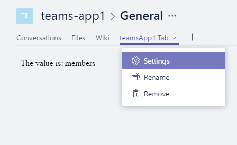

1. Click the **Provide administrator consent - click if Tenant Admin** button.

    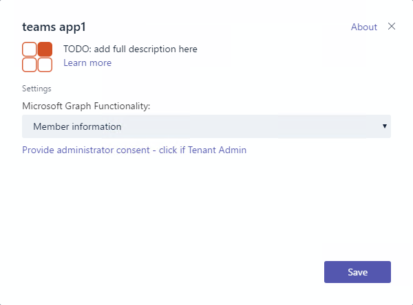

1. Verify that the Azure Active Directory login and consent flow completes. If you log in with an account that is not a tenant administrator, the consent action will fail. Admin consent is only necessary to view the group calendar, not the member information.

    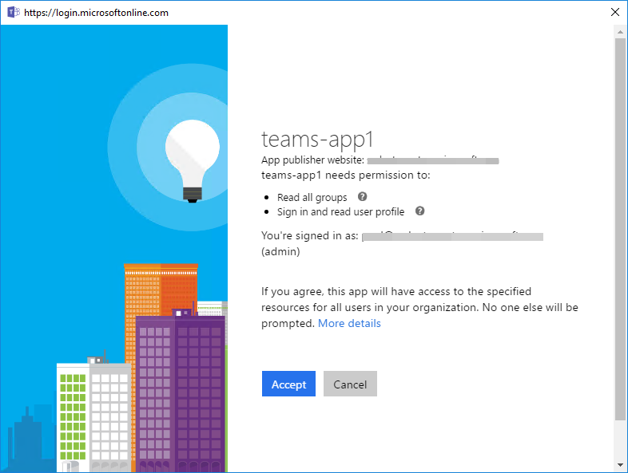

### Content page and authentication

With the tab configured, the content page can now render information as selected.  Perform the following to update the tab content.

**Note:** These steps assume that the application created in Exercise 1 is named **teams-app-1**. Paths listed in this section are relative to the **src/app/** folder in the generated application.

1. Open the file **scripts/teamsApp1Tab.tsx**.

1. Locate the `IteamsApp1TabState` interface. Replace the interface definition with the following.

    ```typescript
    export interface IteamsApp1TabState extends ITeamsBaseComponentState {
      entityId?: string;
      graphData?: string;
    }
    ```

1. Locate the `teamsApp1Tab` class. Add the following class-level variable declarations.

    ```typescript
    configuration?: string;
    groupId?: string;
    token?: string;
    ```

1. Add the following function to the `teamsApp1Tab` object. This function runs in response to the button selection.

    ```typescript
    private getGraphData() {
      let token = "";

      let graphElement = document.getElementById("graph");
      graphElement!.innerText = "Loading...";
      if (token == null) {
        microsoftTeams.authentication.authenticate({
          url: "/auth.html",
          width: 400,
          height: 400,
          successCallback: (data) => {
            // Note: token is only good for one hour
            token = data!;
            this.getData(token);
          },
          failureCallback: function (err) {
            document.getElementById("graph")!.innerHTML = "Failed to authenticate and get token.<br/>" + err;
          }
        });
      }
      else {
        this.getData(token);
      }
    }
    ```

1. Add the following method to the `teamsApp1TabTab` class. This method uses XMLHTTP to make a call to the Microsoft Graph API and displays the result.

    ```typescript
    public getData(token: string) {
      let graphEndpoint = "https://graph.microsoft.com/v1.0/me";
      if (this.configuration === "group") {
        graphEndpoint = "https://graph.microsoft.com/v1.0/groups/" + this.groupId;
      }

      var req = new XMLHttpRequest();
      req.open("GET", graphEndpoint, false);
      req.setRequestHeader("Authorization", "Bearer " + token);
      req.setRequestHeader("Accept", "application/json;odata.metadata=minimal;");
      req.send();
      var result = JSON.parse(req.responseText);
      document.getElementById("graph")!.innerHTML = `<pre>${JSON.stringify(result, null, 2)}</pre>`;
    }
    ```

1. Locate the `<PanelBody>` element. Replace that element with the following code snippet.

    ```typescript
    <PanelBody>
      <div style={styles.section}>
        {this.state.graphData}
      </div>
      <div style={styles.section}>
        <PrimaryButton onClick={() => this.getGraphData()}>Get Microsoft Graph data</PrimaryButton>
      </div>
    </PanelBody>
    ```

1. Add a new file to the **web** folder named **auth.html**.

1. Add the following to the **auth.html** file.

    ```html
    <!DOCTYPE html>
    <html lang="en">
    <head>
      <meta charset="UTF-8">
      <title>Auth</title>
      <!-- inject:css -->
      <!-- endinject -->
    </head>
    <body>
      <script src="https://secure.aadcdn.microsoftonline-p.com/lib/0.1.1/js/msal.min.js"></script>
      <script src="https://statics.teams.microsoft.com/sdk/v1.0/js/MicrosoftTeams.min.js"></script>
      <!-- inject:js -->
      <!-- endinject -->
      <script type='text/javascript'>
        var auth = new teamsApp1.Auth();
        auth.performAuthV2();
      </script>
    </body>
    </html>
    ```

1. Add a new file to the **scripts** folder named **auth.ts**.

1. Add the following to the **auth.ts** file. Note that there is a token named `[app-id-from-registration]` that must be replaced. Use the value of the Application ID copied from the application registration page.

    ```typescript
    import * as Msal from 'msal';
    /**
    * Implementation of the teams app1 Auth page
    */
    export class Auth {
      private token: string = "";
      private user: Msal.User;

      /**
      * Constructor for Tab that initializes the Microsoft Teams script
      */
      constructor() {
        microsoftTeams.initialize();
      }

      public performAuthV2(level: string) {
        // Setup auth parameters for MSAL
        let graphAPIScopes: string[] = ["https://graph.microsoft.com/user.read", "https://graph.microsoft.com/group.read.all"];
        let userAgentApplication = new Msal.UserAgentApplication(
                                            "[app-id-from-registration]",
                                            "https://login.microsoftonline.com/common",
                                            this.tokenReceivedCallback);

        if (userAgentApplication.isCallback(window.location.hash)) {
          var user = userAgentApplication.getUser();
          if (user) {
            this.getToken(userAgentApplication, graphAPIScopes);
          }
        } else {
          this.user = userAgentApplication.getUser();
          if (!this.user) {
            // If user is not signed in, then prompt user to sign in via loginRedirect.
            // This will redirect user to the Azure Active Directory v2 Endpoint
            userAgentApplication.loginRedirect(graphAPIScopes);
          } else {
            this.getToken(userAgentApplication, graphAPIScopes);
          }
        }
      }

      private getToken(userAgentApplication: Msal.UserAgentApplication, graphAPIScopes: string[]) {
        // In order to call the Microsoft Graph API, an access token needs to be acquired.
        // Try to acquire the token used to query Microsoft Graph API silently first:
        userAgentApplication.acquireTokenSilent(graphAPIScopes).then(
          (token) => {
            //After the access token is acquired, return to MS Teams, sending the acquired token
            microsoftTeams.authentication.notifySuccess(token);
          },
          (error) => {
            // If the acquireTokenSilent() method fails, then acquire the token interactively via acquireTokenRedirect().
            // In this case, the browser will redirect user back to the Azure Active Directory v2 Endpoint so the user
            // can reenter the current username/ password and/ or give consent to new permissions your application is requesting.
            if (error) {
              userAgentApplication.acquireTokenRedirect(graphAPIScopes);
            }
          }
        );
      }

      private tokenReceivedCallback(errorDesc, token, error, tokenType) {
        //  suppress typescript compile errors
      }
    }
    ```

1. Locate the file **scripts/client.ts**. Add the following line to the bottom of **scripts/client.ts**.

    ```typescript
    export * from './auth';
    ```

1. Refresh the tab in Microsoft Teams. Select the **Get Microsoft Graph Data** button to invoke the authentication and call to **graph.microsoft.com**.

    