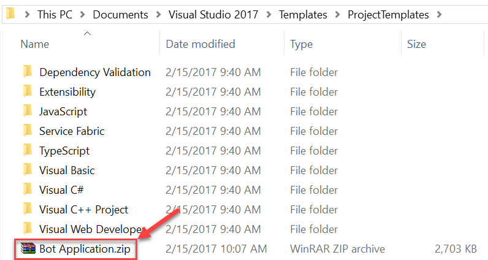

# Fundamentals of Teams Development
----------------
In this lab, you will prepare your computer for developing Microsoft Teams apps, learn the steps to package and test your application, build a basic Micorosft Teams Bot and a Microsoft Teams Tab.

## Table of Contents

1. [Create and test a basic Teams App using Yeoman](#exercise1)
1. [Create and test a basic Teams Bot using Visual Studio](#exercise2)
1. [Call Microsoft Graph inside a Tab](#exercise3)

## Prerequisites

Developing Apps for Microsoft Teams requires preparation for both the Office 365 Tenant and the development workstation.

For the Office 365 Tenant, the setup steps are detailed on the [Getting Started page](https://msdn.microsoft.com/en-us/microsoft-teams/setup). Note that while the Getting Started page indicates that the Public Developer Preview is optional, this lab includes steps that not possible unless the Preview is enabled.

### Install Developer Tools

The developer workstation requires the following tools for this lab.

#### Install NodeJS & NPM

Install [NodeJS](https://nodejs.org/) Long Term Support (LTS) version.

- If you have NodeJS already installed please check you have the latest version using `node -v`. It should return the current [LTS version](https://nodejs.org/en/download/).
- Allowing the Node setup program to update the computer PATH during setup will make the console-based tasks in this easier to accomplish.

After installing node, make sure npm is up to date by running following command:

````shell
npm install -g npm
````

#### Install Yeoman and Gulp

[Yeoman](http://yeoman.io/) helps you kick-start new projects, and prescribes best practices and tools to help you stay productive. This lab uses a Yeoman generator for Microsoft Teams to quickly create a working, JavaScript-based solution.

Enter the following command to install Yeoman and gulp:

````shell
npm install -g yo gulp
````

#### Install Yeoman Teams Generator

The Yeoman Teams generator helps you quickly create a Microsoft Teams solution project with boilerplate code and a project structure & tools to rapidly create and test your app.

Enter the following command to install the Yeoman Teams generator:

````shell
npm install generator-teams@preview -g
````

#### Download ngrok

As Microsoft Teams is an entirely cloud-based product, it requires all services it accesses to be available from the cloud using HTTPS endpoints. Therefore, to enable the exercises to work within Teams, a tunneling application is required.

This lab uses [ngrok](https://ngrok.com) for tunneling publicly-available HTTPS endpoints to a web server running locally on the developer workstation. ngrok is a single-file download that is run from a console.

#### Code Editors

Tabs in Microsoft Teams are HTML pages hosted in an IFrame. The pages can reference CSS and JavaScript like any web page in a browser.

Microsoft Teams supports much of the common [Bot Framework](https://dev.botframework.com/) functionality. The Bot Framework provides an SDK for C# and Node.

You can use any code editor or IDE that supports these technologies, however the steps and code samples in this training use [Visual Studio Code](https://code.visualstudio.com/) for Tabs using HTML/JavaScript and [Visual Studio 2017](https://www.visualstudio.com/) for Bots using the C# SDK.

#### Bot Template for Visual Studio 2017

Download and install the Bot Application template zip from the direct download link [http://aka.ms/bf-bc-vstemplate](http://aka.ms/bf-bc-vstemplate). Save the zip file to your Visual Studio 2017 templates directory which is traditionally located in `%USERPROFILE%\Documents\Visual Studio 2017\Templates\ProjectTemplates\`

   

<a name="exercise1"></a>

## Exercise 1: Create and Test a Basic Teams App using Yeoman

This exercise introduces the Yeoman generator and its capabilities for scaffolding a project and testing its functionality.
In this exercise, you will create a basic Teams app.

1. Open a **Command Prompt** window.
1. Change to the directory where you will create the tab.

  > **Note:** Directory paths can become quite long after node modules are imported.  **We suggest you use a directory name without spaces in it and create it in the root folder of your drive.**  This will make working with the solution easier in the future and protect you from potential issues associated with long file paths. In this example, we use `c:\Dev` as the working directory.

1. Type `md teams-app1` and press **Enter**.
1. Type `cd teams-app1` and press **Enter**.

### Run the Yeoman Teams Generator

1. Type `yo teams` and press **Enter**.

    

1. When prompted:
    1. Accept the default **teams-app-1** as your solution name and press **Enter**.
    1. Select **Use the current folder** for where to place the files and press **Enter**.
1. The next set of prompts asks for specific information about your Teams App:
    1. Accept the default **teams app1** as the name of your Microsoft Teams App project and press **Enter**.
    1. Enter your name and press **Enter**.
    1. Enter **https://tbd.ngrok.io** as the URL where you will host this tab and press **Enter**. (We will change this URL later.)
    1. Accept the default selection of **Tab** for what you want to add to your project and press **Enter**.
    1. Accept the default **teams app1 Tab** as the default tab name and press **Enter**.

      

  >**Note:** At this point, Yeoman will install the required dependencies and scaffold the solution files along with the basic tab. This might take a few minutes.
  > When the scaffold is complete, you should see the following message indicating success.
  >
  > 

### Run the ngrok secure tunnel application

1. Open a new **Command Prompt** window.
1. Change to the directory that contains the ngrok.exe application.
1. run the command `ngrok http 3007`
1. The ngrok application will fill the entire prompt window. Make note of the Forwarding address using https. This address is required in the next step.
1. Minimize the ngrok Command Prompt window. It is no longer referenced in this exercise, but it must remain running.


### Update the Teams app manifest and create package

When the solution was generated, we used a placeholder URL. Now that the tunnel is running, we need to use the actual URL that is routed to our computer.

1. Return to the first **Command Prompt** window in which the generator was run.
1. Launch Visual Studio Code by running the command `code .`

    

1. Open the **manifest.json** file in the **manifest** folder.
1. Replace all instances of **tbd.ngrok.io** with the HTTPS Forwarding address from the ngrok window. (In this example, the forwarding address is **https://0f3b4f62.ngrok.io**.) There are 6 URLs that need to be changed.
1. Save the **manifest.json** file.
1. In the **Command Prompt** window, run the command `gulp manifest`. This command will create the package as a zip file in the **package** folder

    

1. Build the webpack and start the Express web server by running the following commands:

    ```shell
    gulp build
    gulp serve
    ```

    

    > Note: The gulp serve process must be running in order to see the tab in the Teams application. When the process is no longer needed, press `CTRL+C` to cancel the server.

### Sideload app into Microsoft Teams

1. In the Microsoft Teams application, click the **Add team** link. Then click the **Create team** button.

    

1. Enter a team name and description. In this example, the Team is named **teams-app-1**. Click **Next**.
1. Optionally, invite others from your organization to the team. This step can be skipped in this lab.
1. The new team is shown. In the left-side panel, click the elipses next to the team name. Choose **Manage team** from the context menu.

    

1. On the Manage team display, click **Bots** in the tab strip. Then click the **Sideload a Bot or Tab** link at the bottom right corner of the application.

    

1. Select the **teams-app-1.zip** file from the **package** folder. Click **Open**.

    

1. The app is displayed. Notice information about the app from the manifest (Description and Icon) is displayed.

    

The app is now sideloaded into the Microsoft Teams application and the Tab is available in the **Tab Gallery**.

### Add Tab to Team view

1. Tabs are not automatically displayed for the Team. To add the tab, click on the **General** channel in the Team.
1. Click the **+** icon at the end of the tab strip.
1. In the Tab gallery, sideloaded tabs are displayed in the **Tabs for your team** section. Tabs in this section are arranged alphabetically. Select the tab created in this lab.

    

1. The generator creates a configurable tab. When the Tab is added to the Team, the configuration page is displayed. Enter any value in the **Setting** box and click **Save**.

    

1. The value entered will then be displayed in the Tab window.

    

This concludes Exercise 1.

<a name="exercise2"></a>

## Exercise 2: Create and test a basic Teams Bot using Visual Studio

This section of the lab introduces the Bot Framework template and its capabilities for scaffolding a project and testing its functionality. In this exercise, you will create a basic Teams bot.

1. Launch Visual Studio 2017 as an administrator
1. In Visual Studio 2017, select **File | New | Project**
1. Create a new Visual C# project using the **Bot Application Template**

   

1. Build the solution to download all configured NuGet packages.

1. Right-click on the project in Solution Explorer and select **Manage Nuget Packages**. Update all the packages, ensuring that the **Microsoft.Bot.Builder** is at least version 3.12. Repeat until all the packages are up-to-date.

The Bot Application template is a fully functional Echo Bot that takes the user's text utterance as input and returns it as output. In order to run the bot inside Microsoft Teams:

- The bot must be accessible from the internet
- The bot must be registered with the Bot Connector
- The AppId and AppPassword from the Bot Framework registration page have to be recorded in the project's web.config
- The bot must be added to Microsoft Teams

Before registering the bot, note the URL configured for the solution in Visual Studio.

1. In Solution Explorer, double-click on **Properties**.
1. In the **Properties** designer, select the **Web** tab.
1. Note the **Project URL**.

    

### Run the ngrok secure tunnel application

1. Open a new **Command Prompt** window.
1. Download ngrok (https://ngrok.com/download) and unzip the ngrok secure tunnel application. Change to the directory that contains the ngrok.exe application.
1. Run the command `ngrok http [port] -host-header=localhost:[port]` *(Replace [port] with the port portion of the URL noted above.)*
1. The ngrok application will fill the entire prompt window. Make note of the Forwarding address using https. This address is required in the next step.
1. Minimize the ngrok Command Prompt window. It is no longer referenced in this lab, but it must remain running.

  

### Register the bot

1. Go to the Microsoft Bot Framework Portal at https://dev.botframework.com/bots/new and sign in. 

1. Complete the Bot profile section, entering a Display name, Bot handle and description.

    

1. Complete the Configuration section.
    1. For the Messaging endpoint, use the Forwarding https address from ngrok with /api/messages appended to provide the route to the MessagesController in the Visual Studio project. In the example, this is `https://a2632edd.ngrok.io/api/messages`
    1. Click the **Create Microsoft App ID and password button**. This opens a new browser tab/window.
    1. In the new browser tab/window the application is registered in Azure Active Directory. Click **Generate an app password to continue**.
    1. An app password is generated. Copy the password and save it. You will use it in a subsequent step.
    1. Click **OK**. This closes the popup.
    1. Click the **Finish and go back to Bot Framework** button. This closes the new browser tab/window and populates the app Id in the **Paste your app ID below to continue textbox**.

        

1. Scroll to the bottom of the page. Agree to the Privacy statement, Terms of use, and Code of conduct and click the **Register** button. Once the Bot is created, click **OK** to dismiss the pop-up.

The **Connect to channels** page is displayed for the newly-created bot. The bot must be connected to Microsoft Teams.

1. Click the **Teams** logo.

    

1. Once the connection is complete, ensure the connection is Enabled and click **Done**

    

The bot registration is complete.

> Clicking on Settings in the top navigation will re-display the profile and configuration sections. This can be used to update the Messaging endpoint in the event ngrok is stopped, or the bot is moved to staging/production.

### Configure the web project

The bot project must be configured with information from the registration.

1. In Visual Studio, open the **Web.config** file. Locate the `<appSettings>` section.
1. Enter the `BotId` value. the `BotId` is the **Bot handle** from the **Configuration** section of the registration.
1. Enter the `MicrosoftAppId`. The `MicrosoftAppId` is the app ID from the **Configuration** section of the registration.
1. Enter the `MicrosoftAppPassword`. The `MicrosoftAppPassword` is the auto-generated app password displayed in the pop-up during registration.

    > If you do not have the app password, the bot must be deleted and re-registered. An app password cannot be reset nor displayed.

### Test the bot using the portal

The Bot registration portal can be used to test the bot.

1. Ensure ngrok is still running, and the Messaging endpoint of the bot registration is using the hostname shown as the Forwarding https address in ngrok.
1. In Visual Studio, press **F5** to start the project.
1. Once the **default.htm** page is displayed, return to the [Bot registration portal](https://dev.botframework.com/bots).
1. Select your bot.
1. In the top-right corner of the page, click the **Test** button.
1. Enter a message and press **Enter**. The message is echoed back along with the length of the mesage.

    

    > If the message cannot be sent, there is an error in the configuration of the Bot registration, ngrok and Visual Studio. The request should be visible in the ngrok command window. For additional detail on the request in ngrok, open the address `http://localhost:4040`. If no requests are displayed in ngrok, then the Messaging endpoint has the wrong hostname, or there is a disruption in the network connectivity.

### Configure Visual Studio to Package bot

Packaging a bot for Microsoft Teams is identical to packaging a tab. A manifest file (and related resources) are compressed into a zip file and added to a team.

Perform the following in Visual Studio. (Stop debugging before continuing. Leave ngrok running.)
1.  Right-click on the project, choose **Add | New Folder**. Name the folder **Manifest**.
1. Add the displayed files from the **Lab Files** folder of this repository.

    

1. Open the **manifest.json** file just added to the project.

    The **manifest.json** file requires several updates:
    - The `id` property must contain the app ID from registration. Replace the token `[microsoft-app-id]` with the app ID.
    - The `packageName` property must contain a unique identifier. The convention is to use the bot's URL in reverse format. Replace the token `[from-ngrok]` with the unique identifier from the Forwarding address.
    - Similarly, the `developer` property has three URLs that should match the hostname of the Messaging endpoint. Replace the token `[from-ngrok]` with the unique identifier from the Forwarding address.
    - The `botId` property (in the `bots` collection property) also requires the app ID from registration. Replace the token `[microsoft-app-id]` with the app ID.
    - Save and close the **manifest.json** file.

1. Update the Visual Studio project to compress the Manifest folder during build.
    - In Solution Explorer, right-click on the project and choose **Unload Project**. If prompted, click **Yes** to save changes.

        

    - Right-click on the project file and choose **Edit [project-name].csproj**. *(In the image, the project name is teams-bot1.)*

        

    - Scroll to the bottom of the file. Add the following Target to the file. *(Be sure to add the target outside of the comment.)* This target will invoke a custom build task to compress the files in the Manfest directory.

      ```xml
      <Target Name="AfterBuild">
        <ZipDir InputBaseDirectory="manifest"
                OutputFileName="$(OutputPath)\$(MSBuildProjectName).zip"
                OverwriteExistingFile="true"
                IncludeBaseDirectory="false" />
      </Target>
      ```

    - Add the following Task element to the **.csproj** file.

      ```xml
      <UsingTask TaskName="ZipDir" TaskFactory="CodeTaskFactory"
                AssemblyFile="$(MSBuildToolsPath)\Microsoft.Build.Tasks.v4.0.dll">
        <ParameterGroup>
          <InputBaseDirectory ParameterType="System.String" Required="true" />
          <OutputFileName ParameterType="System.String" Required="true" />
          <OverwriteExistingFile ParameterType="System.Boolean" Required="false" />
          <IncludeBaseDirectory ParameterType="System.Boolean" Required="false" />
        </ParameterGroup>
        <Task>
          <Reference Include="System.IO.Compression" />
          <Reference Include="System.IO.Compression.FileSystem" />
          <Using Namespace="System.IO.Compression" />
          <Code Type="Fragment" Language="cs"><![CDATA[
            if (File.Exists(OutputFileName))
            {
              if (!OverwriteExistingFile)
              {
                return false;
              }
              File.Delete(OutputFileName);
            }
            ZipFile.CreateFromDirectory
            (
              InputBaseDirectory, OutputFileName,
              CompressionLevel.Optimal, IncludeBaseDirectory
            );
          ]]></Code>
        </Task>
      </UsingTask>
      ```

    - Save and close the project file.
    - In **Solution Explorer**, right-click on the project and choose **Reload Project**.

1. Press **F5** to run the project. The new AfterBuild target will run, creating a zip file in the build output folder (bin\\)

### Sideload app into Microsoft Teams

Although not strictly necessary, in this lab the bot will be added to a new Team.

1. In the Microsoft Teams application, click the **Add team** link. Then click the **Create team** button.

    

1. Enter a team name and description. In this example, the Team is named **teams-bot-1**. Click **Next**.
1. Optionally, invite others from your organization to the team. This step can be skipped in this lab.
1. The new team is shown. In the left-side panel, click the ellipses next to the team name. Choose **Manage team** from the context menu.

    

1. On the View team display, click **Bots** in the tab strip. Then click the **Sideload a bot or app** link at the bottom right corner of the application.
1. Select the **teams-bot1.zip** file from the *bin* folder. Click **Open**.
1. The app is displayed. Notice information about the app from the manifest (Description and Icon) is displayed.

    

The app is now sideloaded into the Microsoft Teams application and the bot is available.

### Interact with the Bot

In the General channel for the team, a message is created announcing the bot has been added to the Team. To interact with the bot, @ mention the bot.


As you test the bot, you will notice that the character count is not correct. You can set breakpoints in the Visual Studio project to debug the code. (Remember, however, that the count was correct using the registration portal.) Later modules of this training will review how to remove mentions from the message.

This concludes Exercise 2.

<a name="exercise3"></a>

## STOPPED HERE TO TRY ALTERNATE REGISTRATION PATH

## Exercise 3: Call Microsoft Graph inside a Tab

This section of the lab will extend the tab created in Exercise 1 to call the Microsoft Graph. The Exercise contains many code files. The **Lab Files** folder contains files that contain the code and are provided to facilitate copy/paste of the code rather than typing.

### Run the ngrok secure tunnel application

1. Open a new **Command Prompt** window.
1. Change to the directory that contains the ngrok.exe application.
1. run the command `ngrok http 3007`
1. The ngrok application will fill the entire prompt window. Make note of the Forwarding address using https. This address is required in the next step.
1. Minimize the ngrok Command Prompt window. It is no longer referenced in this exercise, but it must remain running.

  

### Register an application in AAD

To enable an application to call the Microsoft Graph, an application registration is required. This lab uses the [Azure Active Directory v2.0 endpoint](https://docs.microsoft.com/en-us/azure/active-directory/develop/active-directory-v2-compare).

1. Open a browser to the url **https://apps.dev.microsoft.com**
1. Log in with a Work or School account.
1. Click **Add an app**
1. Complete the **Register your application** section, entering an Application name and Contact email. Clear the checkbox for Guided Setup. Click **Create**

    

1. On the registration page, in the **Platforms** section, click **Add Platform**.

    

1. In the **Add Platform** dialog, click **Web**.
1. Using the hostname from ngrok, enter a **Redirect URL** to the auth.html file.

    ```
    https://[replace-this].ngrok.io/auth.html
    ```

1. Click the **Add URL** button.
1. Using the hostname from ngrok, enter a **Redirect URL** to the adminconsent.html file.

    ```
    https://[replace-this].ngrok.io/adminconsent.html
    ```

    

1. Click **Save**.
1. Make note of the Application Id. This value is used in the authentication / token code.
1. Request permission to read Groups.
    1. Scroll down to the **Microsoft Graph Permissions** section.
    1. Next to **Delegated Permissions**, click the **Add** button.
    1. In the **Select Permission** dialog, scroll down and select **Group.Read.All**. Click OK.

        

    1. Click **Save**.

### Add the Microsoft Authentication Library (MSAL) to the project

Using **npm**, add the Microsoft Authentication library to the project.

1. Open a **Command Prompt** window.
1. Change to the directory containing the tab application.
1. Run the following command:

    ```shell
    npm install msal
    ```

### Configure Tab when added to channel

The Tab in this exercise can be configured to read information from Microsoft Graph about the current member or about the Group in which the channel exists. Perform the following to update the Tab configuration.

These steps assume that the application created in Exercise 1 is named **teams-app-1**. Furthermore, paths listed in this section are relative to the `src/app/` folder in the generated application.

1. Open the file **web/teamsApp1TabConfig.html**
    1. Locate the `<div>` element with the class of `settings-container`. Replace that element with the following code snippet.

        ```html
        <div class="settings-container">
          <div class="section-caption">Settings</div>
          <div class="form-field-title">
            <div for="graph">Microsoft Graph Functionality:</div>
          </div>
          <div>
            <select name="graph" id="graph"  class="form-control" onchange="onChange(this.value);">
              <option value="" selected>Select one...</option>>
              <option value="member">Member information</option>
              <option value="group">Group information (requires admin consent)</option>
            </select>
          </div>
          <div class="form-field-title">
            <a href="#" onclick="requestConsent();">Provide administrator consent - click if Tenant Admin</a>
          </div>
        </div>
        ```

    1. Add the following function to the `<script>` tag on the page.

        ```js
        function requestConsent() {
          c.getAdminConsent();
          return false;
        }
        ```

1. Open the file **scripts/teamsApp1TabConfig.ts**.
    1. Locate the constructor method.  Replace the constructor with the following code snippet. (The snippet includes code to save the **tenantId** for use in the admin consent process.)

        ```typescript
        tenantId?: string;

        constructor() {
          microsoftTeams.initialize();

          microsoftTeams.getContext((context: microsoftTeams.Context) => {
            TeamsTheme.fix(context);
            this.tenantId = context.tid;

            // hack: the state should be retrieved from storage, not from Teams
            let val = <HTMLInputElement>document.getElementById("graph");
            if (context.entityId) {
              val.value = context.entityId;
            }
            this.setValidityState(val.value !== "");
          });

          microsoftTeams.settings.registerOnSaveHandler((saveEvent: microsoftTeams.settings.SaveEvent) => {
            let val = <HTMLInputElement>document.getElementById("graph");

            // Calculate host dynamically to enable local debugging
            let host = "https://" + window.location.host;
            microsoftTeams.settings.setSettings({
              contentUrl: host + "/teamsApp1TabTab.html",
              suggestedDisplayName: 'teamsApp1 Tab',
              removeUrl: host + "/teamsApp1TabRemove.html",
              // hack: the state should be stored in external storage, not in Teams
              entityId: val.value
            });

            saveEvent.notifySuccess();

          });
        }
        ```

    1. The tab configuration page has a link for granting admin consent. This link requires the `tenantId`, which is not known until runtime. The anchor tag has an `onclick` event. Add the following function to the **teamsApp1TabConfigure** object.

        ```typescript
        public getAdminConsent() {
          microsoftTeams.authentication.authenticate({
            url: "/adminconsent.html?tenantId=" + this.tenantId,
            width: 800,
            height: 600,
            successCallback: () => { },
            failureCallback: (err) => { }
          });
        }
        ```

1. Add a new file to the **web** folder named **adminconsent.html**
    1. Add the following to the **adminconsent.html** file.

        ```html
        <!DOCTYPE html>
        <html lang="en">

        <head>
          <meta charset="UTF-8">
          <title>AdminConsent</title>
          <!-- inject:css -->
          <!-- endinject -->
        </head>

        <body>
          <script src="https://statics.teams.microsoft.com/sdk/v1.0/js/MicrosoftTeams.min.js"></script>
          <!-- inject:js -->
          <!-- endinject -->

          <script type="text/javascript">
            function getURLParam(name) {
              var url = window.location.search.substring(1);
              var variables = url.split('&');
              for (var i = 0; i < variables.length; i++) {
                var variable = variables[i].split('=');
                if (variable[0] === name) {
                  return decodeURIComponent(variable[1]);
                }
              }
            }

            var ac = new teamsApp1.AdminConsent();

            var response = getURLParam("admin_consent");
            if (response) {
              ac.processResponse(true);
            } else {
              var error = getURLParam("error_description")
              if (error) {
                ac.processResponse(false, error);
              } else {
                var tenantId = getURLParam("tenantId");
                ac.requestConsent(tenantId);
              }
            }
          </script>
        </body>
        </html>
        ```

1. Add a new file to the **scripts** folder named **adminconsent.ts**
    1. Add the following to the **adminconsent.ts** file. Note that there is a token named **[application-id-from-registration]** that must be replaced. Use the value of the Application Id copied from the Application Registration page.

        ```typescript
        /// <reference path="../../../node_modules/msal/out/msal.d.ts" />
        /**
        * Implementation of the teams tab1 AdminConsent page
        */
        export class AdminConsent {
          /**
          * Constructor for Tab that initializes the Microsoft Teams script and themes management
          */
          constructor() {
            microsoftTeams.initialize();
          }

          public requestConsent(tenantId:string) {
            let host = "https://" + window.location.host;
            let redirectUri = "https://" + window.location.host + "/adminconsent.html";
            let clientId = "[application-id-from-registration]";
            let state = "officedev-traniningconent"; // any unique value

            var consentEndpoint = "https://login.microsoftonline.com/common/adminconsent?" +
                                  "client_id=" + clientId +
                                  "&state=" + state +
                                  "&redirect_uri=" + redirectUri;

            window.location.replace(consentEndpoint);
          }

          public processResponse(response:boolean, error:string){
            if (response) {
              microsoftTeams.authentication.notifySuccess();
            } else {
              microsoftTeams.authentication.notifyFailure(error);
            }
          }
        }
        ```

1. Locate the file **scripts/client.ts**
    1. Add the following line to the bottom of **scripts/client.ts**

        ```typescript
        export * from './adminconsent';
        ```

1. Following the steps from Exercise 1, redeploy the app. In summary, perform the following steps.
    1. Update the manifest (if necessary) with the ngrok forwarding address.
    1. Run `gulp build` and resolve errors.
    1. Run `gulp serve`
    1. Sideload the app into Microsoft Teams.

1. Add the tab to a channel, or update the settings of the tab in the existing channel. (To update the settings of an existing tab, click the chevron next to the tab name.)

    

1. Click the **Provide administrator consent - click if Tenant Admin** link.

    

1. Verify that the Azure Active Directory login and consent flow completes. (If you log in with an account that is not a Tenant administrator, the consent action will fail. Admin Consent is only necessary to view the Group calendar, not the member information.)

    

### Content Page and Authentication

With the tab configured, the content page can now render information as selected.  Perform the following to update the Tab content.

These steps assume that the application created in Exercise 1 is named **teams-app-1**. Furthermore, paths listed in this section are relative to the `src/app/` folder in the generated application.

1. Open the file **web/teamsApp1TabTab.html**
    1. Locate the `<div>` element with the id of `app`. Replace that element with the following code snippet.

        ```html
        <div id='app'>
          Loading...
        </div>
        <div>
          <button id="getDataButton">Get MSGraph Data</button>
          <div id="graph"></div>
        </div>
        ```

    1. Add the following CSS link to the `<head>` element.

        ```html
        <link rel="stylesheet" type="text/css" href="assets/css/msteams-app.css">
        ```

1. Open the file **scripts/teamsApp1TabTab.ts**.
    1. Locate the constructor method.  Replace the constructor with the following code snippet. (The snippet includes code to save the configured value as a class-level variable.)

        ```typescript
        configuration?: string;
        groupId?: string;
        token?: string;

        /**
        * Constructor for teamsApp1Tab that initializes the Microsoft Teams script
        */
        constructor() {
          microsoftTeams.initialize();
        }
        ```

    1. Locate the `doStuff` method. Replace the method with the following code snippet. This method will display the configured value and attach a handler to the GetData button.

        ```typescript
        public doStuff() {
          let button = document.getElementById('getDataButton');
          button!.addEventListener('click', e => { this.refresh(); });

          microsoftTeams.getContext((context: microsoftTeams.Context) => {
            TeamsTheme.fix(context);
            this.groupId = context.groupId;
            // hack
            if (context.entityId) {
              this.configuration = context.entityId;
              let element = document.getElementById('app');
              if (element) {
                element.innerHTML = `The value is: ${this.configuration}`;
              }
            }
          });
        }
        ```

    1. Add the following function to the `teamsApp1TabTab` object. This function runs in response to the button click.

        ```typescript
        public refresh() {
          let token = "";

          let graphElement = document.getElementById("graph");
          graphElement!.innerText = "Loading...";
          if (token == null) {
            microsoftTeams.authentication.authenticate({
              url: "/auth.html",
              width: 400,
              height: 400,
              successCallback: (data) => {
                // Note: token is only good for one hour
                token = data!;
                this.getData(token);
              },
              failureCallback: function (err) {
                document.getElementById("graph")!.innerHTML = "Failed to authenticate and get token.<br/>" + err;
              }
            });
          }
          else {
            this.getData(token);
          }
        }
        ```

    1. Add the follow method to the `teamsApp1TabTab` class. This method uses XMLHttp to make a call to the Microsoft Graph and displays the result.

        ```typescript
        public getData(token: string) {
          let graphEndpoint = "https://graph.microsoft.com/v1.0/me";
          if (this.configuration === "group") {
            graphEndpoint = "https://graph.microsoft.com/v1.0/groups/" + this.groupId;
          }

          var req = new XMLHttpRequest();
          req.open("GET", graphEndpoint, false);
          req.setRequestHeader("Authorization", "Bearer " + token);
          req.setRequestHeader("Accept", "application/json;odata.metadata=minimal;");
          req.send();
          var result = JSON.parse(req.responseText);
          document.getElementById("graph")!.innerHTML = `<pre>${JSON.stringify(result, null, 2)}</pre>`;
        }
        ```

1. Add a new file to the **web** folder named **auth.html**
    1. Add the following to the **adminconsent.html** file.

        ```html
        <!DOCTYPE html>
        <html lang="en">
        <head>
          <meta charset="UTF-8">
          <title>Auth</title>
          <!-- inject:css -->
          <!-- endinject -->
        </head>
        <body>
          <script src="https://secure.aadcdn.microsoftonline-p.com/lib/0.1.1/js/msal.min.js"></script>
          <script src="https://statics.teams.microsoft.com/sdk/v1.0/js/MicrosoftTeams.min.js"></script>
          <!-- inject:js -->
          <!-- endinject -->
          <script type='text/javascript'>
            var auth = new teamsApp1.Auth();
            auth.performAuthV2();
          </script>
        </body>
        </html>
        ```

1. Add a new file to the **scripts** folder named **auth.ts**

    1. Add the following to the **auth.ts** file. Note that there is a token named `[application-id-from-registration]` that must be replaced. Use the value of the Application Id copied from the Application Registration page.

        ```typescript
        /**
        * Implementation of the teams app1 Auth page
        */
        export class Auth {
          private token: string = "";
          private user: Msal.User;

          /**
          * Constructor for Tab that initializes the Microsoft Teams script
          */
          constructor() {
            microsoftTeams.initialize();
          }

          public performAuthV2(level: string) {
            // Setup auth parameters for MSAL
            let graphAPIScopes: string[] = ["https://graph.microsoft.com/user.read", "https://graph.microsoft.com/group.read.all"];
            let userAgentApplication = new Msal.UserAgentApplication(
                                                "[application-id-from-registration]",
                                                "https://login.microsoftonline.com/common",
                                                this.tokenReceivedCallback);

            if (userAgentApplication.isCallback(window.location.hash)) {
              userAgentApplication.handleAuthenticationResponse(
                window.location.hash,
                (token) => {
                  if (this.user == null) {
                    this.user = userAgentApplication.getUser()!;
                    this.getToken(userAgentApplication, graphAPIScopes);
                  } else {
                    microsoftTeams.authentication.notifySuccess(token);
                  }
                },
                (error) => { microsoftTeams.authentication.notifyFailure(error); }
              );
            } else {
              this.user = userAgentApplication.getUser();
              if (!this.user) {
                // If user is not signed in, then prompt user to sign in via loginRedirect.
                // This will redirect user to the Azure Active Directory v2 Endpoint
                userAgentApplication.loginRedirect(graphAPIScopes);
              } else {
                this.getToken(userAgentApplication, graphAPIScopes);
              }
            }
          }

          private getToken(userAgentApplication: Msal.UserAgentApplication, graphAPIScopes: string[]) {
            // In order to call the Graph API, an access token needs to be acquired.
            // Try to acquire the token used to query Graph API silently first:
            userAgentApplication.acquireTokenSilent(graphAPIScopes).then(
              (token) => {
                //After the access token is acquired, return to MS Teams, sending the acquired token
                microsoftTeams.authentication.notifySuccess(token);
              },
              (error) => {
                // If the acquireTokenSilent() method fails, then acquire the token interactively via acquireTokenRedirect().
                // In this case, the browser will redirect user back to the Azure Active Directory v2 Endpoint so the user
                // can reenter the current username/ password and/ or give consent to new permissions your application is requesting.
                if (error) {
                  userAgentApplication.acquireTokenRedirect(graphAPIScopes);
                }
              }
            );
          }

          private tokenReceivedCallback(errorDesc, token, error, tokenType) {
            //  suppress typescript compile errors
          }
        }
        ```

1. Locate the file **scripts/client.ts**
    1. Add the following line to the bottom of **scripts/client.ts**

      ```typescript
      export * from './auth';
      ```

1. Refresh the Tab in Microsoft Teams. Click the **Get MSGraph Data** button to invoke the authentication and call to graph.microsoft.com.

    

This concludes Exercise 3.