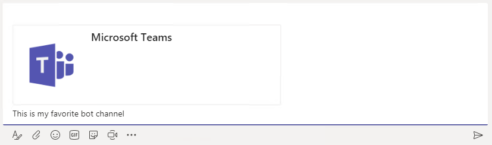

# Create a Messaging Extension

In this demo, you will demonstrate the messaging extension capability of Microsoft Teams.

## Prerequisites

Developing apps for Microsoft Teams requires preparation for both the Office 365 tenant and the development workstation.

For the Office 365 Tenant, the setup steps are detailed on the [Prepare your Office 365 tenant page](https://docs.microsoft.com/en-us/microsoftteams/platform/get-started/get-started-tenant). Note that while the getting started page indicates that the Public Developer Preview is optional, this lab includes steps that are not possible unless the preview is enabled. Information about the Developer Preview program and participation instructions are detailed on the [What is the Developer Preview for Microsoft Teams? page](https://docs.microsoft.com/en-us/microsoftteams/platform/resources/dev-preview/developer-preview-intro).

### Download ngrok

As Microsoft Teams is an entirely cloud-based product, it requires all services it accesses to be available from the cloud using HTTPS endpoints. To enable the exercises to work within Microsoft Teams, a tunneling application is required.

This lab uses [ngrok](https://ngrok.com) for tunneling publicly-available HTTPS endpoints to a web server running locally on the developer workstation. ngrok is a single-file download that is run from a console.

## Run the ngrok secure tunnel application

1. Open a new **Command Prompt** window.

1. Change to the directory that contains the **ngrok.exe** application.

1. Run the command `ngrok http [port] -host-header=localhost:[port]` Replace `[port]` with the port portion of the URL noted above.

1. The ngrok application will fill the entire prompt window. Make note of the forwarding address using https. This address is required in the next step.

1. Minimize the ngrok command prompt window. It is no longer referenced in this lab, but it must remain running.

    

## Register the bot

1. Go to the [Microsoft Bot Framework](https://dev.botframework.com/bots/new) and sign in. The bot registration portal accepts a work or school account or a Microsoft account.

    > NOTE: You must use this link to create a new bot: https://dev.botframework.com/bots/new. If you select the **Create a bot** button in the Bot Framework portal instead, you will create your bot in Microsoft Azure instead.

1. Complete the **bot profile section**, entering a display name, unique bot handle and description.

    

1. Complete the configuration section.
    - For the Messaging endpoint, use the forwarding HTTPS address from ngrok prepended to the route to the `MessagesController` in the Visual Studio project. In the example, this is `https://a2632edd.ngrok.io/API/Messages`.
    - Select the **Create Microsoft App ID and password button**. This opens a new browser window.
    - In the new browser window, the application is registered in Azure Active Directory. Select **Generate an app password to continue**.
    - An app password is generated. Copy the password and save it. You will use it in a subsequent step.
    - Select **OK** to close the dialog box.
    - Select the **Finish and go back to Bot Framework** button to close the new browser window and populate the app ID in the **Paste your app ID below to continue textbox**.

        

1. Move to the bottom of the page. Agree to the privacy statement, terms of use and code of conduct and select the **Register** button. Once the bot is created, select **OK** to dismiss the dialog box. The **Connect to channels** page is displayed for the newly-created bot.

> **Note:** The Bot migration message (shown in red) can be ignored for Microsoft5 Teams bots. Additional information can be found in the Microsoft Teams developer documentation, on the [Create a bot page](https://docs.microsoft.com/en-us/microsoftteams/platform/concepts/bots/bots-create#bots-and-microsoft-azure).

1. The bot must be connected to Microsoft Teams. Select the **Microsoft Teams** logo.

    

1. Select the **Save button. Agree to the Terms of Service. The bot registration is complete.

    

    >**Note:** Selecting **Settings** in the top navigation will re-display the profile and configuration sections. This can be used to update the messaging endpoint in the event ngrok is stopped, or the bot is moved to staging & production.

## Update Demo solution

Make the following updates to the demo solution.

1. Launch **Visual Studio 2017**.

1. In **Visual Studio 2017**, select **File > Open > Project/Solution**.

1. Select the **teams-m5-bot.sln** file from the **Demos\01-messaging-extension\solution** folder.

1. Open the **Web.config** file. Locate the `<appSettings>` section.

1. Replace the token **[BotId]** with the value of the **Bot handle** from the **Configuration** section of the registration.

1. Replace the token **[MicrosoftAppId]** with the application Id from the **Configuration** section of the registration.

1. Replace the token *[MicrosoftAppPassword]** with the auto-generated app password displayed in the dialog box during registration.

    > **Note:** If you do not have the app password, the bot must be deleted and re-registered. An app password cannot be reset nor displayed.

1. Save and close the **web.config** file.

1. Open the **manifest.json** file in the **Manifest** folder.

1. The `id` property must contain the app ID from registration. Replace the token `[microsoft-app-id]` with the app ID.

1. The `packageName` property must contain a unique identifier. The industry standard is to use the bot's URL in reverse format. Replace the token `[from-ngrok]` with the unique identifier from the forwarding address.

1. The `developer` property has three URLs that should match the hostname of the Messaging endpoint. Replace the token `[from-ngrok]` with the unique identifier from the forwarding address.

1. The `botId` property in the `bots` collection property requires the app ID from registration. Replace the token `[microsoft-app-id]` with the app ID.

1. The `botId` property in the `composeExtensions` collection property requires the app ID from registration. Replace the token `[microsoft-app-id]` with the app ID.

1. Save and close the **manifest.json** file.

1. Press F5 to compile the project, build the app package and start the web server. The default browser will open. This browser window is not necessary for the demo.

## Upload app into Microsoft Teams

1. In the left-side panel, select the ellipses next to the team name. Choose **Manage team** from the context menu.

    

1. On the Manage team display, select **Apps** in the tab strip. Then select the **Upload a custom app** link at the bottom right corner of the application.

1. Select the file **teams-m5-bot.zip** from the **bin** folder. Select **Open**.

1. The app is displayed. The description and icon for the app is displayed.

    

    The app is now uploaded into the Microsoft Teams application and the bot is available.

## Invoke the Compose Extension

The messaging extension is configured for use in a channel due to the scopes entered in the manifest.

1. The extension is invoked by selecting the **ellipsis** below the compose box and selecting the bot.

    

1. The extension is displayed. If the **initialRun** property is set to `true`, the extension is invoked and the results displayed. Since the **initialRun** property is `false`, the **description** is displayed. Note that the **parameters/description** property is displayed as an input hint in the search box.

    

1. Type in the search box. After several characters are entered, the messaging extension is called and the results displayed. (Search for `sky` to see multiple results.)

    

1. Select a result card. The selected card is inserted into the message compose area. The user can augment the message with text as desired. The card/message is not sent until the users selects the send button.

    