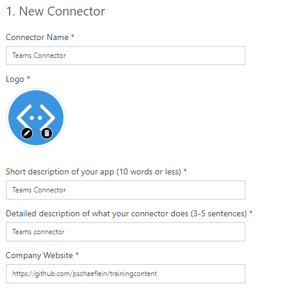
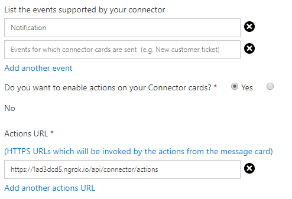
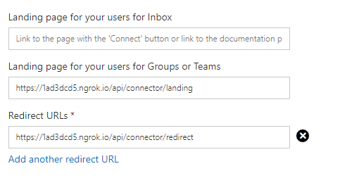
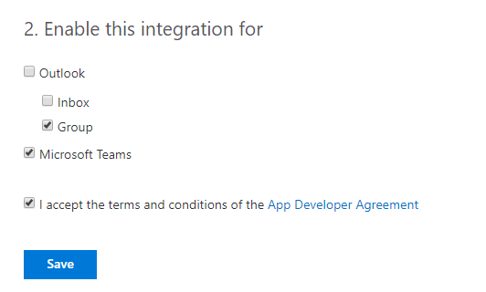
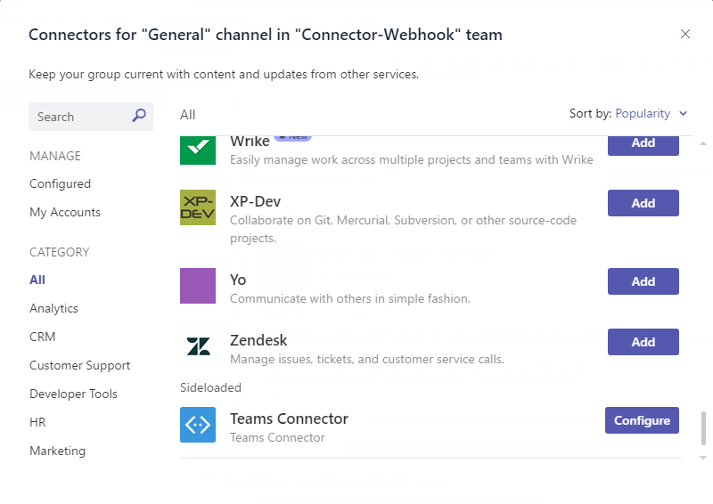
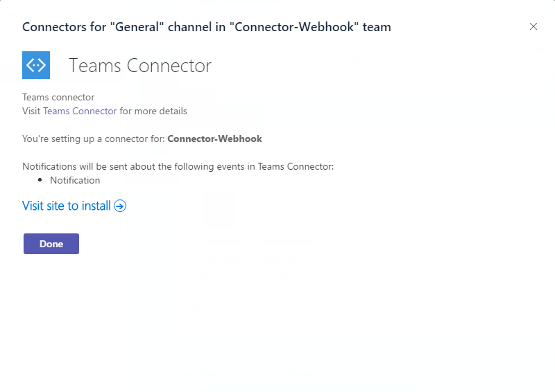
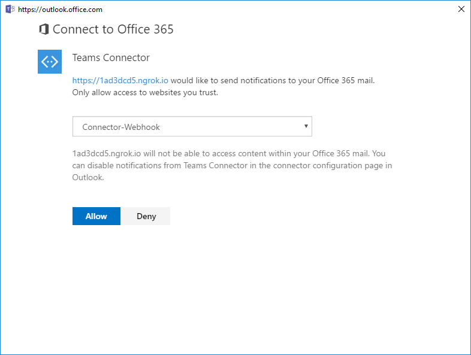
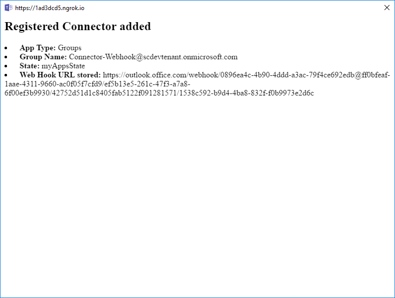

# Demo - Section 3:  Microsoft Teams Apps with multiple capabilities

To run this demo, perform the following steps from the lab:

## Download NuGet packages

1. Launch Visual Studio 2017 as an administrator

1. Build the solution to download all configured NuGet packages.

## Configure URL

1. In Solution Explorer, double-click on **Properties**.

1. In the properties designer, select the **Web** tab.

1. Note the project URL.

    

### Run the ngrok secure tunnel application

1. Open a new **Command Prompt** window.

1. Change to the directory that contains the **ngrok.exe** application.

1. Run the command `ngrok http [port] -host-header=localhost:[port]`. Replace `[port]` with the port portion of the URL noted above.

1. The ngrok application will fill the entire prompt window. Make note of the forwarding address using HTTPS. This address is required in the next step.

1. Minimize the ngrok command prompt window. It is no longer referenced in this lab, but it must remain running.

    

### Register the bot

1. Go to the [Microsoft Bot Framework](https://dev.botframework.com/bots/new) and sign in. The bot registration portal accepts a work or school account or a Microsoft account.

1. Complete the **bot profile section**, entering a display name, unique bot handle and description.

    

1. Complete the configuration section.
    - For the Messaging endpoint, use the forwarding HTTPS address from ngrok prepended to the route to the `MessagesController` in the Visual Studio project. In the example, this is `https://a2632edd.ngrok.io/API/Messages`.
    - Select the **Create Microsoft App ID and password button**. This opens a new browser window.
    - In the new browser window, the application is registered in Azure Active Directory. Select **Generate an app password to continue**.
    - An app password is generated. Copy the password and save it. You will use it in a subsequent step.
    - Select **OK** to close the dialog box.
    - Select the **Finish and go back to Bot Framework** button to close the new browser window and populate the app ID in the **Paste your app ID below to continue textbox**.

        ![Screenshot of configuration page with messaging endpoint and app ID displayed.]../../(Images/Exercise1-05.png)

1. Move to the bottom of the page. Agree to the privacy statement, terms of use and code of conduct and select the **Register** button. Once the bot is created, select **OK** to dismiss the dialog box. The **Connect to channels** page is displayed for the newly-created bot.

1. The bot must be connected to Microsoft Teams. Select the **Microsoft Teams** logo.

    

1. Once the connection is complete, ensure the connection is enabled and select **Done**. The bot registration is complete.

    

### Office 365 Connector registration

The following steps are used to register an Office 365 connector.

1. Register the connector on the [Connectors Developer Dashboard](https://go.microsoft.com/fwlink/?LinkID=780623). Log on the the site and click **New Connector**.

1. On the **New Connector** page, complete the name and description as appropriate for your connector. Upload the **bot-icon-blue-300x300.png** from the lab files folder for your logo.

    

1. In the Events/Notifications section, the list of events are displayed when registering the connector in the Microsoft Teams user interface on a consent dialog. The connector framework will only allow cards sent by your connector to have **Actions URLs** that match what is provided here.

    

1. The **Landing page for your users for Groups or Teams** is a URL that is rendered by the Microsoft Teams application when users initiate the registration flow from a channel. This page is rendered in a dialog box provided by Microsoft Teams. The **Redirect URLs** is a list of valid URLs to which the completed registration information can be sent. This functionality is similar to the redirect URL processing for Azure Active Directory apps.

1. For this lab, ensure that the hostname matches the ngrok forwarding address. For the landing page, append `/api/connector/landing` to the hostname. For the redirect page, append `/api/connector/redirect` to the hostname.

    

1. In the **Enable this integration for** section, both **Group** and **Microsoft Teams** must be selected.

    

1. Agree to the terms and conditions and select **Save**.

1. The registration page will refresh with additional buttons in the integration section. The buttons provide sample code for the **Landing** page and a **manifest.json** file for a Microsoft Teams app. Save both of these assets.

1. In a text editor, paste the landing page code copied from the registration page and replace all of the double quotes `"` with the single quote character `'`. You will need this code in a moment.

### Configure the web project

The bot project must be configured with information from the registration.

1. In **Visual Studio**, open the **Web.config** file. Locate the `<appSettings>` section.

1. Enter the `BotId`. The `BotId` is the **Bot handle** from the **Configuration** section of the registration.

1. Enter the `MicrosoftAppId` from the **Configuration** section of the registration.

1. Enter the `MicrosoftAppPassword`, the auto-generated app password displayed in the dialog box during registration.

    > **Note:** If you do not have the app password, the bot must be deleted and re-registered. An app password cannot be reset nor displayed.

### Configure Visual Studio to Package bot

Packaging a bot for Microsoft Teams requires that a manifest file and related resources are compressed into a zip file and added to a team.

1. In **Visual Studio** right-click on the project, choose **Add > New Folder**. Name the folder **Manifest**.

1. Add the displayed files from the **Lab Files** folder of this repository.

    

1. Open the **manifest.json** file just added to the project. The `manifest.json` file requires several updates:
    - The `id` property must contain the app ID from registration. Replace the token `[microsoft-app-id]` with the app ID.
    - The `packageName` property must contain a unique identifier. The industry standard is to use the bot's URL in reverse format. Replace the token `[from-ngrok]` with the unique identifier from the forwarding address.
    - The `developer` property has three URLs that should match the hostname of the Messaging endpoint. Replace the token `[from-ngrok]` with the unique identifier from the forwarding address.
    - The `botId` property in the `bots` collection property also requires the app ID from registration. Replace the token `[microsoft-app-id]` with the app ID.
    - Replace the empty `connectors` node in the `manifest.json` file with the `connectors` node from the manifest downloaded from the Connector registration.
    - Save and close the `manifest.json` file.

1. Open the `Controllers\ConnectorController.cs` file and replace the `[Landing Page Code]` token with the landing page code you edited previously.

1. Press **Ctrl+Shift+B** to build the project. The new **AfterBuild target** will run, creating a zip file in the build output folder **`bin`**.

## Start the demo

### Sideload app into Microsoft Teams

1. In the Microsoft Teams application,. In the left-side panel, select the ellipses next to the team name. Choose **Manage team** from the context menu.

    

1. On the Manage team display, select **Apps** in the tab strip. Then select the **Upload a custom app** link at the bottom right corner of the application.

1. Select the zip file (**teams-bot1.zip** in this example) from the **bin** folder. Select **Open**.

1. The app is displayed. The description and icon for the app is displayed.

    

    The app is now sideloaded into the Microsoft Teams application and the bot is available.

    > **Note:** Adding the bot to a team invokes the system message **ConversationUpdated**. The code in `EventHelpers.cs` determines if the message is in response to the bot being added, and initiates a 1:1 message with each member of the team.

    

### Add Connector to a channel

1. Click **...** next to the channel name, then select **Connectors**.

    

1. Move to the bottom of the connector list. A section named **Sideloaded** contains the connector described by the app. Select **Configure**.

    

1. An dialog box is shown with general and notification information described on the Connector Developer portal. Select the **Visit site to install** button.

    

1. Select the **Connect to Office 365** button. Office 365 will process the registration flow, which may include login and team/channel selection. Make note of the selected team/channel and select **Allow**.

    

1. The dialog box will display the **Redirect** action which presents the information registration provided by Microsoft Office 365. In a production application, this information must be persisted and used to sent notifications to the channel.

    

    > Note: Before your connector can receive callbacks for actionable messages, you must register it and publish the app.
