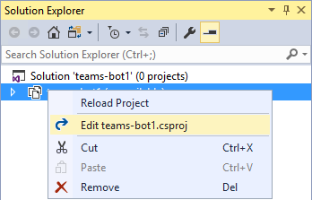
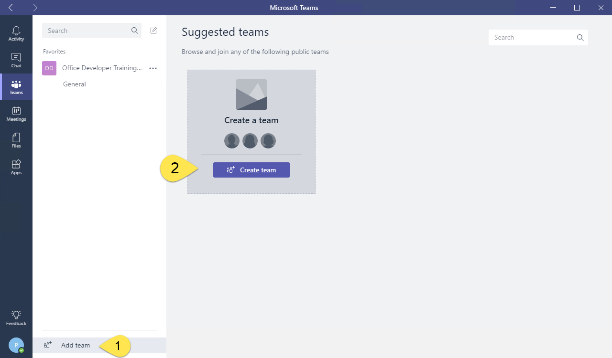

# Microsoft Teams apps - Advanced Techniques

In this lab, you will use advanced techniques to build a more-sophisticated bot, a compose extension and a Microsoft Teams app that has multiple components.

## Table of Contents

- [Advanced Teams Bot capabilities](#exercise1)
- [Compose Extensions](#exercise2)
- [Microsoft Teams Apps with multiple capabilities](#exercise3)

## Prerequisites

Refer to the Prerequisites section in the [lab manual for Module 4](../04 Fundamentals of Microsoft Teams/Lab.md#prerequisites).

<a name="exercise1"></a>

## Exercise 1: Advanced Teams Bot capabilities

This section of the lab creates a Bot Framework bot and extends it with Microsoft Teams functionality. In this exercise, you will create a bot to interact with the Teams API.

1. Launch Visual Studio 2017 as an administrator
1. In Visual Studio 2017, select **File | New | Project**
1. Create a new Visual C# project using the **Bot Application Template**

   

1. Build the solution to download all configured NuGet packages.

In order to run the bot inside Microsoft Teams:

- The bot must be accessible from the internet
- The bot must be registered with the Bot Connector
- The AppId and AppPassword from the Bot Framework registration page have to be recorded in the project's web.config
- The bot must be added to Microsoft Teams

Before registering the bot, note the URL configured for the solution in Visual Studio.

1. In Solution Explorer, double-click on **Properties**
1. In the Properties designer, select the **Web** tab.
1. Note the Project URL.

    

### Run the ngrok secure tunnel application

1. Open a new **Command Prompt** window.
1. Change to the directory that contains the ngrok.exe application.
1. Run the command `ngrok http [port] -host-header=localhost:[port]` (Replace [port] with the port portion of the URL noted above.)
1. The ngrok application will fill the entire prompt window. Make note of the Forwarding address using https. This address is required in the next step.
1. Minimize the ngrok Command Prompt window. It is no longer referenced in this lab, but it must remain running.

    

### Register the bot

1. Go to the Microsoft Bot Framework portal at https://dev.botframework.com/bots/new and sign in. (The bot registration portal accepts a Work or School Account or a Microsoft Account.)
1. Complete the Bot profile section, entering a Display name, unique Bot handle and description.

    

1. Complete the Configuration section.
    1. For the Messaging endpoint, use the Forwarding https address from ngrok prepended to the route to the `MessagesController` in the Visual Studio project. In the example, this is `https://a2632edd.ngrok.io/API/Messages`.
    1. Click the **Create Microsoft App ID and password button**. This opens a new browser tab/window.
    1. In the new browser tab/window the application is registered in Azure Active Directory. Click **Generate an app password to continue**.
    1. An app password is generated. Copy the password and save it. You will use it in a subsequent step.
    1. Click **OK**. This closes the popup.
    1. Click the **Finish and go back to Bot Framework** button. This closes the new browser tab/window and populates the app Id in the **Paste your app ID below to continue textbox**.

        

1. Scroll to the bottom of the page. Agree to the Privacy statement, Terms of use, and Code of conduct and click the **Register** button. Once the Bot is created, click **OK** to dismiss the pop-up.

    The **Connect to channels** page is displayed for the newly-created bot. The bot must be connected to Microsoft Teams.

1. Click the Teams logo.

    

1. Once the connection is complete, ensure the connection is Enabled and click **Done**

    

The bot registration is complete.

> Clicking on **Settings** in the top navigation will re-display the profile and configuration sections. This can be used to update the Messaging endpoint in the event ngrok is stopped, or the bot is moved to staging/production.

### Configure the web project

The bot project must be configured with information from the registration.

1. In Visual Studio, open the `Web.config` file. Locate the `<appSettings>` section.
1. Enter the `BotId` value. The `BotId` is the **Bot handle** from the **Configuration** section of the registration.
1. Enter the `MicrosoftAppId`. The `MicrosoftAppId` is the app ID from the **Configuration** section of the registration.
1. Enter the `MicrosoftAppPassword`. The `MicrosoftAppPassword` is the auto-generated app password displayed in the pop-up during registration.
    > If you do not have the app password, the bot must be deleted and re-registered. An app password cannot be reset nor displayed.

### Configure Visual Studio to Package bot

Packaging a bot for Microsoft Teams requires that a manifest file (and related resources) are compressed into a zip file and added to a team.

Perform the following in Visual Studio.

1. Right-click on the project, choose Add | New Folder. Name the folder **Manifest**.
1. Add the displayed files from the **Lab Files** folder of this repository.

    

1. Open the **manifest.json** file just added to the project.

    The `manifest.json` file requires several updates:
    - The `id` property must contain the app ID from registration. Replace the token `[microsoft-app-id]` with the app ID.
    - The `packageName` property must contain a unique identifier. The convention is to use the bot's URL in reverse format. Replace the token `[from-ngrok]` with the unique identifier from the Forwarding address.
    - Similarly, the `developer` property has three URLs that should match the hostname of the Messaging endpoint. Replace the token `[from-ngrok]` with the unique identifier from the Forwarding address.
    - The `botId` property (in the `bots` collection property) also requires the app ID from registration. Replace the token `[microsoft-app-id]` with the app ID.
    - Save and close the `manifest.json` file.

1. Update the Visual Studio project to compress the Manifest folder during build.

    - In Solution Explorer, right-click on the project and choose **Unload Project**. If prompted, click **Yes** to save changes.

        

    - Right-click on the project file and choose **Edit [project-name].csproj**. (In the image, the project name is teams-bot1.)

        

    - Scroll to the bottom of the file. Add the following Target to the file. (Be sure to add the target outside of the comment.) This target will invoke a custom build task to compress the files in the Manfest directory.

      ```xml
      <Target Name="AfterBuild">
        <ZipDir InputBaseDirectory="manifest"
                OutputFileName="$(OutputPath)\$(MSBuildProjectName).zip"
                OverwriteExistingFile="true"
                IncludeBaseDirectory="false" />
      </Target>
      ```

    - Add the following Task element to the `.csproj` file.

      ```xml
      <UsingTask TaskName="ZipDir" TaskFactory="CodeTaskFactory"
                AssemblyFile="$(MSBuildToolsPath)\Microsoft.Build.Tasks.v4.0.dll">
        <ParameterGroup>
          <InputBaseDirectory ParameterType="System.String" Required="true" />
          <OutputFileName ParameterType="System.String" Required="true" />
          <OverwriteExistingFile ParameterType="System.Boolean" Required="false" />
          <IncludeBaseDirectory ParameterType="System.Boolean" Required="false" />
        </ParameterGroup>
        <Task>
          <Reference Include="System.IO.Compression" />
          <Reference Include="System.IO.Compression.FileSystem" />
          <Using Namespace="System.IO.Compression" />
          <Code Type="Fragment" Language="cs"><![CDATA[
            if (File.Exists(OutputFileName))
            {
              if (!OverwriteExistingFile)
              {
                return false;
              }
              File.Delete(OutputFileName);
            }
            ZipFile.CreateFromDirectory
            (
              InputBaseDirectory, OutputFileName,
              CompressionLevel.Optimal, IncludeBaseDirectory
            );
          ]]></Code>
        </Task>
      </UsingTask>
      ```

    - Save and close the project file.
    - In Solution Explorer, right-click on the project and choose **Reload Project**.

1. Press **Ctrl+Shift+B** to build the project. The new AfterBuild target will run, creating a zip file in the build output folder (`bin`)

### Install the Microsoft.Bot.Connector.Teams package

The Microsoft Teams engineering group built and maintains extensions to the Bot Builder SDK. These packages (for .Net  and Node.js) extend the basic Bot Builder classes and methods with the following:

- Specialized Teams card types like the Office 365 Connector card
- Consuming and setting Teams-specific channel data on activities
- Processing compose extension requests
- Handling rate limiting

Both packages install dependencies, including the Bot Builder SDK.

In Visual Studio, install the **Microsoft.Bot.Connector.Teams** package via the **Package Manager Console**:

  ```powershell
  Install-Package Microsoft.Bot.Connector.Teams
  ```

### Update bot to send 1:1 message when added and to new team members

The project template creates a Messages controller that receives messages from the bot service. This controller checks the incoming activity to determine if it is a user or system message. This step of the lab will implement the system message handling.

1. Open the file **Controllers/MessagesController.cs**
1. Add the following statements to the top of the file.

    ```cs
    using Microsoft.Bot.Connector.Teams;
    using Microsoft.Bot.Connector.Teams.Models;
    using Polly;
    using System;
    using System.Collections.Generic;
    using System.Configuration;
    ```

1. Locate the `HandleSystemMessage` method.
1. Replace the method with the following code. (The code is available in the `Lab Files/HandleSystemMessageAsync.cs` file.)

    ```cs
    private async Task<Activity> HandleSystemMessageAsync(Activity message)
    {
      TeamEventBase eventData = message.GetConversationUpdateData();
      switch (eventData.EventType)
      {
        case TeamEventType.MembersAdded:
          var client = new ConnectorClient(
                new Uri(message.ServiceUrl),
                ConfigurationManager.AppSettings["MicrosoftAppId"],
                ConfigurationManager.AppSettings["MicrosoftAppPassword"]);
          client.SetRetryPolicy(
            RetryHelpers.DefaultPolicyBuilder.WaitAndRetryAsync(
              new[] { TimeSpan.FromSeconds(2),
                      TimeSpan.FromSeconds(5),
                      TimeSpan.FromSeconds(10) })
          );

          var tenantId = message.GetTenantId();
          var botAccount = message.Recipient;
          var channelData = message.GetChannelData<TeamsChannelData>();

          if (EventHelpers.MemberAddedIsBot(message))
          {
            // Fetch the members in the current conversation
            ChannelAccount[] channelAccount =
              await client.Conversations.GetConversationMembersAsync(
                message.Conversation.Id);
            IEnumerable<TeamsChannelAccount> members =
              channelAccount.AsTeamsChannelAccounts();

            // send a OneToOne message to each member
            foreach (TeamsChannelAccount member in members)
            {
              await EventHelpers.SendOneToOneWelcomeMessage(
                client, channelData, botAccount, member, tenantId);
            }
          }
          else
          {
            // send a OneToOne message to new member
            await EventHelpers.SendOneToOneWelcomeMessage(
              client, channelData, botAccount, message.From, tenantId);
          }
          break;
        case TeamEventType.MembersRemoved:
          break;
        case TeamEventType.ChannelCreated:
          break;
        case TeamEventType.ChannelDeleted:
          break;
        case TeamEventType.ChannelRenamed:
          break;
        case TeamEventType.TeamRenamed:
          break;
        default:
          break;
      }
      return null;
    }
    ```

1. In the `Post` method, change the call to method `HandleSystemMessage` to call the new method.

    ```cs
    await HandleSystemMessageAsync(activity);
    ```

1. In **Solution Explorer**, add a new class named `EventHelpers` to the project.
1. Replace the generated `EventHelpers` class with the following code. (The code is in the `Lab Files/EventHelper.cs` file)

    ```cs
    public class EventHelpers
    {
      public static bool MemberAddedIsBot(Activity memberAddedActivity)
      {
        return memberAddedActivity.MembersAdded.Any(m => m.Id.Equals(memberAddedActivity.Recipient.Id));
      }

      public static async Task SendOneToOneWelcomeMessage(
        ConnectorClient client,
        TeamsChannelData channelData,
        ChannelAccount botAccount, ChannelAccount userAccount,
        string tenantId)
      {
        string welcomeMessage = $"The team {channelData.Team.Name} has CardBot - helping your team understand Cards.";

        // create or get existing chat conversation with user
        var response = client.Conversations.CreateOrGetDirectConversation(botAccount, userAccount, tenantId);

        // Construct the message to post to conversation
        Activity newActivity = new Activity()
        {
          Text = welcomeMessage,
          Type = ActivityTypes.Message,
          Conversation = new ConversationAccount
          {
            Id = response.Id
          },
        };

        // Post the message to chat conversation with user
        await client.Conversations.SendToConversationAsync(newActivity, response.Id);
      }
    }
    ```

1. Add the following statements to the top of the `EventHelpers.cs` file.

    ```cs
    using Microsoft.Bot.Connector;
    using Microsoft.Bot.Connector.Teams.Models;
    using System.Threading.Tasks;
    ```

1. Press **F5** to build the solution, the package and start the web service in the debugger. The debugger will start the default browser, which can be ignored. The next step uses the Teams client.

### Sideload app into Microsoft Teams

Although not strictly necessary, in this lab the bot will be added to a new Team.

1. In the Microsoft Teams application, click the **Add team** link. Then click the **Create team** button.

    

1. Enter a team name and description. In this example, the Team is named **teams-bot-1**. Click **Next**.
1. Optionally, invite others from your organization to the team. This step can be skipped in this lab.
1. The new team is shown. In the left-side panel, click the ellipses next to the team name. Choose **Manage team** from the context menu.

    

1. On the Manage team display, click **Apps** in the tab strip. Then click the **Upload a custom app** link at the bottom right corner of the application.
1. Select the zip file (**teams-bot1.zip** in this example) from the *bin* folder. Click **Open**.
1. The app is displayed. Notice information about the app from the manifest (Description and Icon) is displayed.

    

The app is now sideloaded into the Microsoft Teams application and the bot is available.

Adding the bot to a team invokes the system message **ConversationUpdated**. The code in `EventHelpers.cs` determines if the message is in response to the bot being added, and initiates a 1:1 message with each member of the team.


### Update messages to reflect current state

The Bot Extension for Teams provides an easy mechanism to update a message. This step of the lab demonstrates that as well as utility functions for messages.

1. Stop the debugger.
1. Open the `RootDialog.cs` file in the `Dialogs` folder.
1. Add the following to the top of the file.

    ```cs
    using Microsoft.Bot.Connector.Teams;
    ```

1. Locate the `MessageReceivedAsync` method. This is the standard Bot Framework code to respond to a message. Replace the code in the method with this Teams Bot Extension code.

    ```cs
    var activity = await result as Activity;

    // calculate something for us to return
    int length = (activity.Text ?? string.Empty).Length;

    ConnectorClient connector = new ConnectorClient(new Uri(activity.ServiceUrl));
    Activity reply = activity.CreateReply($"You sent {activity.Text} which was {activity.Text.Length} characters");
    var msgToUpdate = await connector.Conversations.ReplyToActivityAsync(reply);

    // Simulate external activity
    System.Threading.Thread.Sleep(5000);

    var withoutMentions = activity.GetTextWithoutMentions();

    Activity updatedReply = activity.CreateReply($"Actually, removing the @ mention, it was {withoutMentions.Length} characters");
    await connector.Conversations.UpdateActivityAsync(reply.Conversation.Id, msgToUpdate.Id, updatedReply);
    ```

1. Press **F5** to test the changes to the bot logic. It is not necessary to re-sideload the bot unless the manifest file is changed.
1. In a channel, @ mention the bot. The initial response will have the wrong character count, but the message will update 5 seconds later with the correct value. Depending on the Bot service latency, you may not see the original response.

    

### Respond with cards instead of text

The Bot framework allows for responding with cards instead of simply text. Microsoft Teams supports a subset of the cards in the Bot Framework. This section of the lab will add a dialog class to respond with cards.

1. Stop the debugger.
1. Open the `WebApiConfig.cs` file in the `App_Start` folder.
1. Update the `JsonConvert.DefaultSettings` property to ignore reference loops when serializing response.

    ```cs
    JsonConvert.DefaultSettings = () => new JsonSerializerSettings()
    {
      ReferenceLoopHandling = ReferenceLoopHandling.Ignore,
      ContractResolver = new CamelCasePropertyNamesContractResolver(),
      Formatting = Newtonsoft.Json.Formatting.Indented,
      NullValueHandling = NullValueHandling.Ignore,
    };
    ```

1. Open the `RootDialog.cs` file in the `Dialogs` folder.
1. Add the following to the top of the file.

    ```cs
    using System.Threading;
    ```

1. Replace the `StartAsync` method with the following snippet:

    ```cs
    public async Task StartAsync(IDialogContext context)
    {
      context.Wait(MessageReceivedAsync);
    }
    ```

1. Replace the `MessageReceivedAsync` method with the following snippet. (If the incoming message contains "ping" then a message with an alert is returned. If the incoming message contains "card" then the message is passed to the CardsDialog.)

    ```cs
    public virtual async Task MessageReceivedAsync(IDialogContext context, IAwaitable<IMessageActivity> result)
    {
      var activity = await result as Activity;

      if (activity.GetTextWithoutMentions().ToLower().Trim() == "ping")
      {
        ConnectorClient connector = new ConnectorClient(new Uri(activity.ServiceUrl));
        Activity reply = activity.CreateReply();
        reply.NotifyUser();
        reply.Summary = "One ping only, please.";
        reply.Text += "Give me a ping, Vasili. One ping only, please.";
        await connector.Conversations.ReplyToActivityAsync(reply);
      }
      else if (activity.Text.ToLower().Contains("card"))
      {
        await context.Forward(new Dialogs.CardsDialog(), this.ResumeAfterCardsDialog, activity, CancellationToken.None);
      }
      else
      {
        // calculate something for us to return
        int length = (activity.Text ?? string.Empty).Length;

        ConnectorClient connector = new ConnectorClient(new Uri(activity.ServiceUrl));
        Activity reply = activity.CreateReply($"You sent {activity.Text} which was {activity.Text.Length} characters");
        var msgToUpdate = await connector.Conversations.ReplyToActivityAsync(reply);

        // Simulate external activity
        System.Threading.Thread.Sleep(5000);

        var withoutMentions = activity.GetTextWithoutMentions();

        Activity updatedReply = activity.CreateReply($"Actually, removing the @ mention, it was {withoutMentions.Length} characters");
        await connector.Conversations.UpdateActivityAsync(reply.Conversation.Id, msgToUpdate.Id, updatedReply);
      }
    }
    ```

1. Add the following method to the `RootDialog` class.

    ```cs
    private async Task ResumeAfterCardsDialog(IDialogContext context, IAwaitable<IMessageActivity> result)
    {
      context.Wait(this.MessageReceivedAsync);
    }
    ```

1. In **Solution Explorer**, add a new class to the `Dialogs` folder. Name the class `CardsDialogs`.
1. Add the following to the top of the class.

    ```cs
    using System.Threading.Tasks;
    using Microsoft.Bot.Builder.Dialogs;
    using Microsoft.Bot.Connector;
    using Microsoft.Bot.Connector.Teams;
    ```

1. Replace the class declaration with the following snippet. (This code is in the `Lab Files/CardsDialogs.cs` file.)

    ```cs
    [Serializable]
    public class CardsDialog : IDialog<IMessageActivity>
    {
      private const string HeroCard = "Hero card";
      private const string ThumbnailCard = "Thumbnail card";

      private IEnumerable<string> options = new List<string> { HeroCard, ThumbnailCard };

      public async Task StartAsync(IDialogContext context)
      {
        context.Wait(this.MessageReceivedAsync);
      }

      public virtual async Task MessageReceivedAsync(IDialogContext context, IAwaitable<IMessageActivity> result)
      {
        var message = await result;

        string cardName = message.GetTextWithoutMentions().Trim().ToLower();
        if (cardName == HeroCard.ToLower())
        {
          await DisplaySelectedCard(context, HeroCard);
        }
        else if (cardName == ThumbnailCard.ToLower())
        {
          await DisplaySelectedCard(context, ThumbnailCard);
        }
        else
        {
          var reply = context.MakeMessage();
          reply.Text = "I don't support that kind of card.";
          await context.PostAsync(reply);
          context.Done(reply);
        }
      }

      public async Task DisplaySelectedCard(IDialogContext context, string selectedCard)
      {
        var message = context.MakeMessage();
        var attachment = GetSelectedCard(selectedCard);
        message.Attachments.Add(attachment);

        await context.PostAsync(message);

        context.Done(message);

        //context.Wait(this.MessageReceivedAsync);
      }

      private static Attachment GetSelectedCard(string selectedCard)
      {
        switch (selectedCard)
        {
          case HeroCard:
            return GetHeroCard();
          case ThumbnailCard:
            return GetThumbnailCard();
          default:
            return GetHeroCard();
        }
      }

      private static Attachment GetHeroCard()
      {
        var heroCard = new HeroCard
        {
          Title = "BotFramework Hero Card",
          Subtitle = "Your bots — wherever your users are talking",
          Text = "Build and connect intelligent bots to interact with your users naturally wherever they are, from text/sms to Skype, Slack, Office 365 mail and other popular services.",
          Images = new List<CardImage> { new CardImage("https://sec.ch9.ms/ch9/7ff5/e07cfef0-aa3b-40bb-9baa-7c9ef8ff7ff5/buildreactionbotframework_960.jpg") },
          Buttons = new List<CardAction> { new CardAction(ActionTypes.OpenUrl, "Get Started", value: "https://docs.microsoft.com/bot-framework") }
        };
        return heroCard.ToAttachment();
      }

      private static Attachment GetThumbnailCard()
      {
        var thumbnailCard = new ThumbnailCard
        {
          Title = "BotFramework Thumbnail Card",
          Subtitle = "Your bots — wherever your users are talking",
          Text = "Build and connect intelligent bots to interact with your users naturally wherever they are, from text/sms to Skype, Slack, Office 365 mail and other popular services.",
          Images = new List<CardImage> { new CardImage("https://sec.ch9.ms/ch9/7ff5/e07cfef0-aa3b-40bb-9baa-7c9ef8ff7ff5/buildreactionbotframework_960.jpg") },
          Buttons = new List<CardAction> { new CardAction(ActionTypes.OpenUrl, "Get Started", value: "https://docs.microsoft.com/bot-framework") }
        };
        return thumbnailCard.ToAttachment();
      }
    }
    ```

Now that there are specific commands that the bot can execute, we can provide a menu for users. This is done by providing a **commandsLists** node in the `manifest.json` file.

1. Open the `manifest.json` file in the `Manifest` folder.
1. Locate the `/bots/commandLists/commands` node.
1. Replace the `commands` node with the following:

    ```json
    "commands": [
      {
        "title": "Hero card",
        "description": "Display a sample Hero card"
      },
      {
        "title": "Thumbnail card",
        "description": "Display a sample Thumbnail"
      }
    ]
    ```

1. Press **F5** to re-package the bot and start the web service. Re-sideload the app to update the capabilities with the new menu.
1. Choosing one of the commands from the manifest will display a sample card. Entering the word 'card' without 'Hero' or 'Thumbnail' will result in a message about unsupported card types. Any other message is echo'ed as before.

    

    

This concludes Exercise 1.

<a name="exercise2"></a>
## Exercise 2: Compose Extensions

This section of the lab extends the bot from Exercise 1 with Microsoft Teams functionality called Compose Extension. Compose Extensions provide help for users when composing a message for posting in a channel or in 1:1 chats.

1. Open the `MessagesController.cs` file in the `Controllers` folder.
1. Locate the `Post` method. Replace the method the following snippet. Rather than repeating if statements, the logic is converted to a switch statement. Compose Extensions are posted to the bot via an `Invoke` message.

    ```cs
    public async Task<HttpResponseMessage> Post([FromBody]Activity activity)
    {
      switch (activity.Type)
      {
        case ActivityTypes.Message:
          await Conversation.SendAsync(activity, () => new Dialogs.RootDialog());
          break;

        case ActivityTypes.ConversationUpdate:
          await HandleSystemMessageAsync(activity);
          break;

        case ActivityTypes.Invoke:
          var composeResponse = await ComposeHelpers.HandleInvoke(activity);
          var stringContent = new StringContent(composeResponse);
          HttpResponseMessage httpResponseMessage = new HttpResponseMessage(HttpStatusCode.OK);
          httpResponseMessage.Content = stringContent;
          return httpResponseMessage;
          break;

        default:
          break;
      }
      var response = Request.CreateResponse(HttpStatusCode.OK);
      return response;
    }
    ```

1. In **Solution Explorer**, add a new class to the project. Name the class `BotChannelsData`. Replace the generated class with the code from file `Lab Files/BotChannelData.cs`.

    ```cs
    using System.Collections.Generic;

    namespace teams_bot2
    {
      public class BotChannel
      {
        public string Title { get; set; }
        public string LogoUrl { get; set; }
      }

      public class BotChannels
      {
        public static List<BotChannel> GetBotChannels()
        {
          var data = new List<BotChannel>();
          data.Add(new BotChannel { Title = "Bing", LogoUrl = "https://dev.botframework.com/client/images/channels/icons/bing.png" });
          data.Add(new BotChannel { Title = "Cortana", LogoUrl = "https://dev.botframework.com/client/images/channels/icons/cortana.png" });
          data.Add(new BotChannel { Title = "Direct Line", LogoUrl = "https://dev.botframework.com/client/images/channels/icons/directline.png" });
          data.Add(new BotChannel { Title = "Email", LogoUrl = "https://dev.botframework.com/client/images/channels/icons/email.png" });
          data.Add(new BotChannel { Title = "Facebook Messenger", LogoUrl = "https://dev.botframework.com/client/images/channels/icons/facebook.png" });
          data.Add(new BotChannel { Title = "GroupMe", LogoUrl = "https://dev.botframework.com/client/images/channels/icons/groupme.png" });
          data.Add(new BotChannel { Title = "Kik", LogoUrl = "https://dev.botframework.com/client/images/channels/icons/kik.png" });
          data.Add(new BotChannel { Title = "Microsoft Teams", LogoUrl = "https://dev.botframework.com/client/images/channels/icons/msteams.png" });
          data.Add(new BotChannel { Title = "Skype", LogoUrl = "https://dev.botframework.com/client/images/channels/icons/skype.png" });
          data.Add(new BotChannel { Title = "Skype for Business", LogoUrl = "https://dev.botframework.com/client/images/channels/icons/skypeforbusiness.png" });
          data.Add(new BotChannel { Title = "Slack", LogoUrl = "https://dev.botframework.com/client/images/channels/icons/slack.png" });
          data.Add(new BotChannel { Title = "Telegram", LogoUrl = "https://dev.botframework.com/client/images/channels/icons/telegram.png" });
          data.Add(new BotChannel { Title = "Twilio (SMS)", LogoUrl = "https://dev.botframework.com/client/images/channels/icons/sms.png" });
          data.Add(new BotChannel { Title = "Web Chat", LogoUrl = "https://dev.botframework.com/client/images/channels/icons/webchat.png" });
          return data;
        }
      }
    }
    ```

1. In **Solution Explorer**, add a new class to the project. Name the class `ComposeHelpers`. Add the code from the `Lab Files/ComposeHelpers.cs` file.

    ```cs
    using Microsoft.Bot.Connector;
    using Microsoft.Bot.Connector.Teams;
    using Microsoft.Bot.Connector.Teams.Models;
    using Newtonsoft.Json;
    using System;
    using System.Collections.Generic;
    using System.Linq;
    using System.Net;
    using System.Net.Http;
    using System.Threading.Tasks;

    namespace teams_bot2
    {
      public class ComposeHelpers
      {
        public static async Task<HttpResponseMessage> HandleInvoke(Activity activity)
        {
          // these are the values specified in manifest.json
          string COMMANDID = "searchCmd";
          string PARAMNAME = "searchText";

          var unrecognizedResponse = new HttpResponseMessage(HttpStatusCode.BadRequest);
          unrecognizedResponse.Content = new StringContent("Invoke request was not recognized.");

          if (!activity.IsComposeExtensionQuery())
          {
            return unrecognizedResponse;
          }

          // This helper method gets the query as an object.
          var query = activity.GetComposeExtensionQueryData();
          if (query.CommandId == null || query.Parameters == null)
          {
            return unrecognizedResponse;
          }

          if (query.CommandId != COMMANDID)
          {
            return unrecognizedResponse;
          }

          var param = query.Parameters.FirstOrDefault(p => p.Name.Equals(PARAMNAME)).Value.ToString();
          if (String.IsNullOrEmpty(param))
          {
            return unrecognizedResponse;
          }

          // This is the response object that will get sent back to the compose extension request.
          ComposeExtensionResponse invokeResponse = null;

          // search our data
          var resultData = BotChannels.GetBotChannels().FindAll(t => t.Title.Contains(param));

          // format the results
          var results = new ComposeExtensionResult()
          {
            AttachmentLayout = "list",
            Type = "result",
            Attachments = new List<ComposeExtensionAttachment>(),
          };

          foreach (var resultDataItem in resultData)
          {
            var card = new ThumbnailCard()
            {
              Title = resultDataItem.Title,
              Images = new List<CardImage>() { new CardImage() { Url = resultDataItem.LogoUrl } }
            };

            var composeExtensionAttachment = card.ToAttachment().ToComposeExtensionAttachment();
            results.Attachments.Add(composeExtensionAttachment);
          }

          invokeResponse.ComposeExtension = results;

          // Return the response
          StringContent stringContent;
          try
          {
            stringContent = new StringContent(JsonConvert.SerializeObject(invokeResponse));
          }
          catch (Exception ex)
          {
            stringContent = new StringContent(ex.ToString());
          }
          var response = new HttpResponseMessage(HttpStatusCode.OK);
          response.Content = stringContent;
          return response;
        }

      }
    }
    ```

1. Open the `manifest.json` file in the `Manifest` folder. Locate the `composeExtensions` node and replace it with the following snippet. Replace the `[MicrosoftAppId]` token with the app ID from the settings page of the bot registration (https://dev.botframework.com).

    ```json
    "composeExtensions": [
      {
        "botId": "[MicrosoftAppId]",
        "scopes": [
          "team"
        ],
        "canUpdateConfiguration": true,
        "commands": [
          {
            "id": "searchCmd",
            "description": "Search Bot Channels",
            "title": "Bot Channels",
            "initialRun": false,
            "parameters": [
              {
                "name": "searchText",
                "description": "Enter your search text",
                "title": "Search Text"
              }
            ]
          }
        ]
      }
    ],
    ```

1. Press **F5** to re-build the app package and start the debugger.
1. Re-sideload the app. Since the `manifest.json` has been updated, the bot must be re-sideloaded to the Microsoft Teams application.

### Invoke the Compose Extension

The Compose Extension is configured for use in a Channel (due to the scopes entered in the manifest.) The extension is invoked by clicking the elipsis below the compose box and selecting the bot.


This concludes Exercise 2.

<a name="exercise3"></a>

## Exercise 3: Microsoft Teams Apps with multiple capabilities

This section of the lab creates a Microsoft Teams app from the Tab and Bot created previously along with a connector.

### Office 365 Connector & Webhooks

In Microsoft Teams, full functionality for Office 365 Connectors is restricted to connectors that have been published to the Office Store. However, communicating with Microsfot Teams using Office 365 Connectors is identical to using the Incoming Webhook. This lab will show the messaging mechanics via the Webhook feature and then show the Teams user interface experience for registering a connector.

### Incoming Webhook

1. Click **Teams** in the left panel, then select a Team.
1. Select the **General** Channel in the selected team.
1. Click **...** next to the channel name, then select **Connectors**.

    

1. Find **Incoming Webhook** in the list, click **Add** then **Install**.

  

1. Enter a name for the webhook, upload an image to associate with the data from the webhook, then select **Create**.
1. Click the button next to the webhook URL to copy it.  (You will use the webhook URL in a subsequent step.)
1. Click **Done**.
1. Close the **Connectors** dialog.

### Create a simple Connector Card message to the webhook

1. Copy the `sample-connector-message.json` file from the `Lab Files` folder to your development machine.
1. Open a **PowerShell** window, go to the directory that contains the `sample-connector-message.json`, and enter the following commands:

    ```powershell
    $message = Get-Content .\sample-connector-message.json
    $url = "<YOUR WEBHOOK URL>"
    Invoke-RestMethod -ContentType "application/json" -Body $message -Uri $url -Method Post
    ```

    

    > **Note:** Replace **&lt;YOUR WEBHOOK URL&gt;** with the webhook URL you saved when you created the **Incoming Webhook** connector.

1. When the POST succeeds, you will see a simple 1 outputted by the Invoke-RestMethod cmdlet.
1. Check the Conversations tab in the Microsoft Teams application. You will see the new  card message posted to the conversation.

    

    > Note: The action buttons will not work. Action buttons work only for Connectors registered and published in the Office Store.

### Run the ngrok secure tunnel application

1. Open a new **Command Prompt** window.
1. Change to the directory that contains the ngrok.exe application.
1. Run the command `ngrok http [port] -host-header=localhost:[port]` (Replace [port] with the port portion of the URL noted above.)
1. The ngrok application will fill the entire prompt window. Make note of the Forwarding address using https. This address is required in the next step.
1. Minimize the ngrok Command Prompt window. It is no longer referenced in this lab, but it must remain running.

### Office 365 Connector registration

The following steps are used to register an Office 365 Connector.

1. Register the Connector on the [Connectors Developer Dashboard](https://go.microsoft.com/fwlink/?LinkID=780623). Log on the the site and click **New Connector**.
1. On the **New Connector** page:

    1. Complete the Name and Description as appropriate for your connector. Upload the **bot-icon-blue-300x300.png** from the Lab Files folder for your logo.

        

    1. In the Events/Notifications section the list of events are displayed when registering the Connector in the Teams user inteface on a consent dialog. The Connector framework will only allow cards sent by your connector  to have **Actions URLs** that match what is provided here.

        

    1. The **Landing page for your users for Groups or Teams** is a URL that is rendered by the Microsoft Teams Application when users initiate the registration flow from a channel. This page is rendered in a popup provided by Teams. The **Redirect URLs** is a list of valid URLs to which the completed registration information can be sent. This functionality is similar to the Redirect URL processing for Azure Active Directory apps.

        For this lab, ensure that the hostname matches the ngrok forwarding address. For the landing page, append `/api/connector/landing` to the hostname. For the redirect page, append `/api/connector/redirect` to the hostname.

        

    1. In the **Enable this integration for** section, both **Group** and **Microsoft Teams** must be selected.

        

    1. Agree to the terms and conditions and click **Save**

1. The registration page will refresh with additional buttons in the integration section. The buttons provide sample code for the **Landing** page and a `manifest.json` file for a Teams app. Save both of these assets. In a text editor paste the Landing page code copied from the registration page and replace all of the double quotes `"` with the single quote character `'`. You will need this code in a moment.

### Add Connector to existing Bot

In Visual Studio 2017, open the **teams-bot2** solution from the `Demos/02 - teams-bot2` folder. This bot will serve as the foundation for the complete Microsoft Teams app.

1. Open the `manifest.json` file in the solution's `Manifest` folder.
1. Replace the empty `connectors` node in the `manifest.json` file with the `connectors` node from the downloaded manifest. Save and close `manifest.json`
1. Open the file `WebApiConfig.cs` in the `App_Start` folder.
1. Modify the route configuration as shown. The original `routeTemplate` is `"api/{controller}/{id}"`. Replace the `id` token with the `action` token. Once complete, the statement should read as follows.

    ```cs
    config.Routes.MapHttpRoute(
      name: "DefaultApi",
      routeTemplate: "api/{controller}/{action}",
      defaults: new { id = RouteParameter.Optional }
    );
    ```

1. Right-click on the `Controllers` folder and select **Add | Controller...** Choose **Web API 2 Controller - Empty** and click **Add**. Name the new controller **ConnectorController** and click **Add**.
1. Add the following to the top of the `ConnectorController`.

    ```cs
    using System.Threading.Tasks;
    using System.Net.Http.Headers;
    ```

1. Add the following `Landing` method to the `ConnectorController` class.

    ```cs
    [HttpGet]
    public async Task<HttpResponseMessage> Landing()
    {
      var htmlBody = "<html><title>Set up connector</title><body>";
      htmlBody += "<H2>Adding your Connector Portal-registered connector</H2>";
      htmlBody += "<p>Click the button to initiate the registration and consent flow for the connector in the selected channel.</p>";
      htmlBody += "[Landing Page Code]";

      var response = Request.CreateResponse(HttpStatusCode.OK);
      response.Content = new StringContent(htmlBody);
      response.Content.Headers.ContentType = new MediaTypeHeaderValue("text/html");
      return response;
    }
    ```
1. Replace the `[Landing Page Code]` token with the landing page code you edited previously.
1. Add the following `Redirect` method to the `ConnectorController` class.

    ```cs
    [HttpGet]
    public async Task<HttpResponseMessage> Redirect()
    {
      // Parse register message from connector, find the group name and webhook url
      //var query = req.query;
      var query = Request.GetQueryNameValuePairs();
      string webhook_url = query.LastOrDefault(p => p.Key.Equals("webhook_url")).Value;
      var group_name = query.LastOrDefault(p => p.Key.Equals("group_name")).Value;
      var appType = query.LastOrDefault(p => p.Key.Equals("app_type")).Value;
      var state = query.LastOrDefault(p => p.Key.Equals("state")).Value;

      var htmlBody = "<html><body><H2>Registered Connector added</H2>";
      htmlBody += "<li><b>App Type:</b> " + appType + "</li>";
      htmlBody += "<li><b>Group Name:</b> " + group_name + "</li>";
      htmlBody += "<li><b>State:</b> " + state + "</li>";
      htmlBody += "<li><b>Web Hook URL stored:</b> " + webhook_url + "</li>";
      htmlBody += "</body></html>";

      var response = Request.CreateResponse(HttpStatusCode.OK);
      response.Content = new StringContent(htmlBody);
      response.Content.Headers.ContentType = new MediaTypeHeaderValue("text/html");
      return response;
    }
    ```

1. Press **F5** to run the application. This will also build the app package.
1. Re-sideload the application following the steps used earlier.

### Add Connector to a channel

1. Click **...** next to the channel name, then select **Connectors**.

    

1. Scroll to the bottom of the connector list. A section named **Sideloaded** contains the Connector described by the app. Click **Configure**.

    

1. An information dialog is shown with the general and notification information described on the Connector Developer portal. Click the **Visit site to install** button.

    

1. Click the **Connect to Office 365** button. Office 365 will process the registration flow, which may include login and Team/Channel selection. Make note of the selected Team-Channel and click **Allow**.

    

1. The dialog will display the **Redirect** action which presents the information registration provided by Office 365. In a production application, this information must be persisted and used to sent notifications to the channel.

    

    > Note: Before your Connector can receive callbacks for actionable messages, you must register it and publish the app.

This concludes Exercise 3.