# Lab: Microsoft Teams apps - advanced techniques

In this lab, you will use advanced techniques to build a more sophisticated bot, a messaging extension and a Microsoft Teams app that has multiple components.

## In this lab

- [Advanced Microsoft Teams bot capabilities](#exercise1)
- [Messaging extensions](#exercise2)
- [Microsoft Teams apps with multiple capabilities](#exercise3)

## Prerequisites

Refer to the prerequisites section in the lab manual for [Module 4](../04FundamentalsofMicrosoftTeams/Lab.md#prerequisites).

<a name="exercise1"></a>

## Exercise 1: Advanced Microsoft Teams bot capabilities

This section of the lab creates a bot framework bot and extends it with Microsoft Teams functionality. In this exercise, you will create a bot to interact with the Microsoft Teams API.

1. Launch Visual Studio 2017 as an administrator.

1. In Visual Studio 2017, select **File > New > Project**.

1. Create a new Visual C# project using the **Bot Builder Echo Bot** template.

   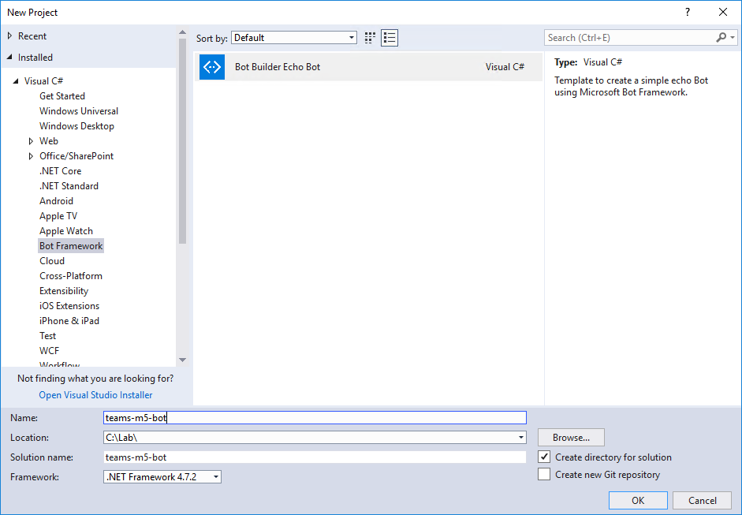

1. The bot application template is a fully functional echo bot that takes the user's text utterance as input and returns it as output. In order to run the bot inside Microsoft Teams:

    - The bot must be accessible from the internet
    - The bot must be registered with the bot connector
    - The `AppId` and `AppPassword` from the bot framework registration page have to be recorded in the project's `web.config`
    - The bot must be added to Microsoft Teams

Before registering the bot, note the URL configured for the solution in Visual Studio.

1. In Solution Explorer, double-click on **Properties**.

1. In the properties designer, select the **Web** tab.

1. Note the project URL.

    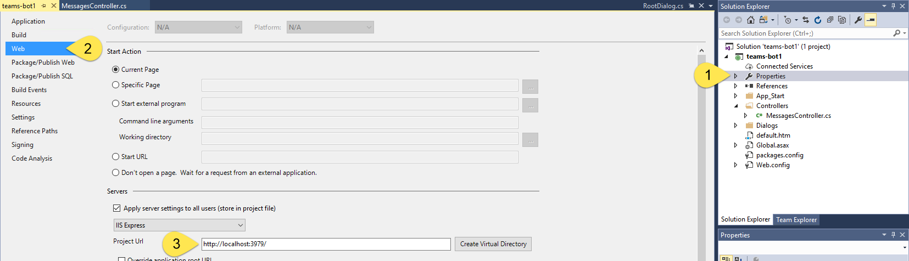

### Run the ngrok secure tunnel application

1. Open a new **Command Prompt** window.

1. Change to the directory that contains the **ngrok.exe** application.

1. Run the command `ngrok http [port] -host-header=localhost:[port]`. Replace `[port]` with the port portion of the URL noted above.

1. The ngrok application will fill the entire prompt window. Make note of the forwarding address using HTTPS. This address is required in the next step.

1. Minimize the ngrok command prompt window. It is no longer referenced in this lab, but it must remain running.

    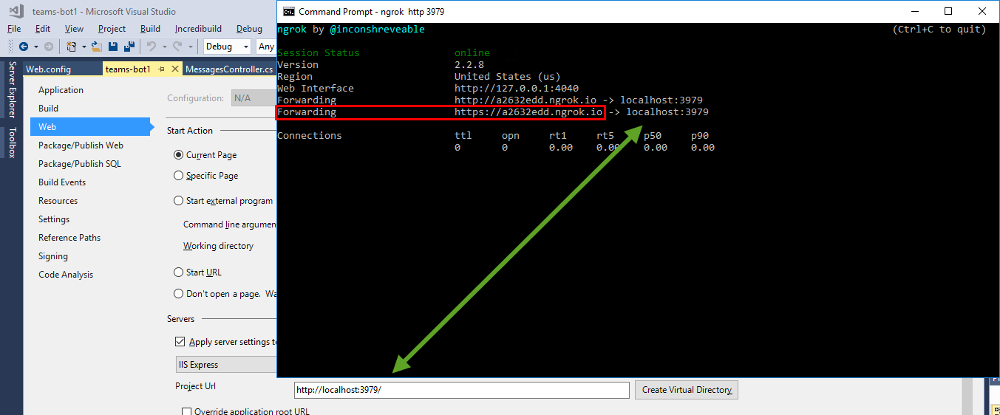

### Register the bot

1. Go to the [Microsoft Bot Framework](https://dev.botframework.com/bots/new) and sign in. The bot registration portal accepts a work or school account or a Microsoft account.

1. Complete the **bot profile section**, entering a display name, unique bot handle and description.

    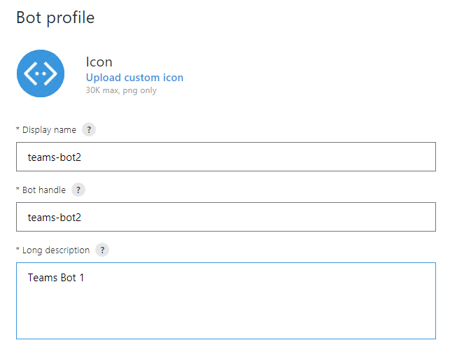

1. Complete the configuration section.
    - For the Messaging endpoint, use the forwarding HTTPS address from ngrok prepended to the route to the `MessagesController` in the Visual Studio project. In the example, this is `https://a2632edd.ngrok.io/API/Messages`.
    - Select the **Create Microsoft App ID and password button**. This opens a new browser window.
    - In the new browser window, the application is registered in Azure Active Directory. Select **Generate an app password to continue**.
    - An app password is generated. Copy the password and save it. You will use it in a subsequent step.
    - Select **OK** to close the dialog box.
    - Select the **Finish and go back to Bot Framework** button to close the new browser window and populate the app ID in the **Paste your app ID below to continue textbox**.

        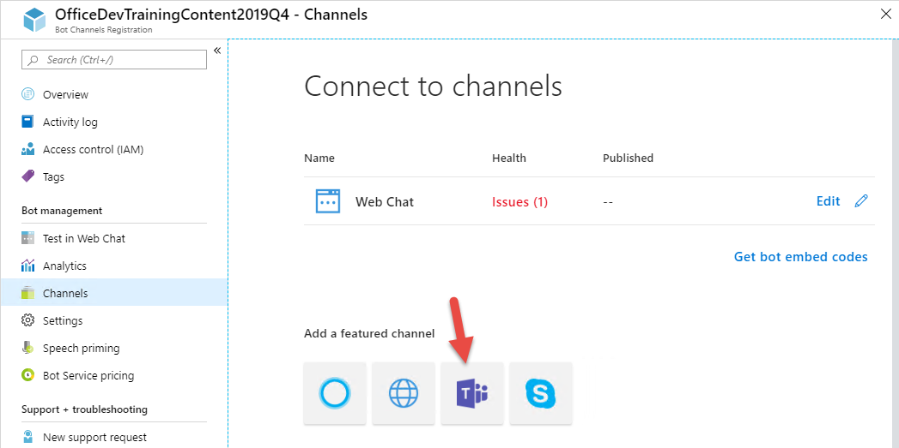

1. Move to the bottom of the page. Agree to the privacy statement, terms of use and code of conduct and select the **Register** button. Once the bot is created, select **OK** to dismiss the dialog box. The **Connect to channels** page is displayed for the newly-created bot.

1. The bot must be connected to Microsoft Teams. Select the **Microsoft Teams** logo.

    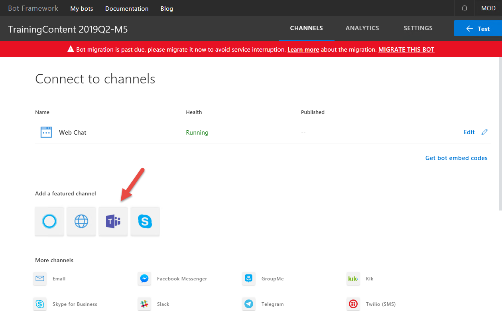

1. Once the connection is complete, ensure the connection is enabled and select **Done**. The bot registration is complete.

    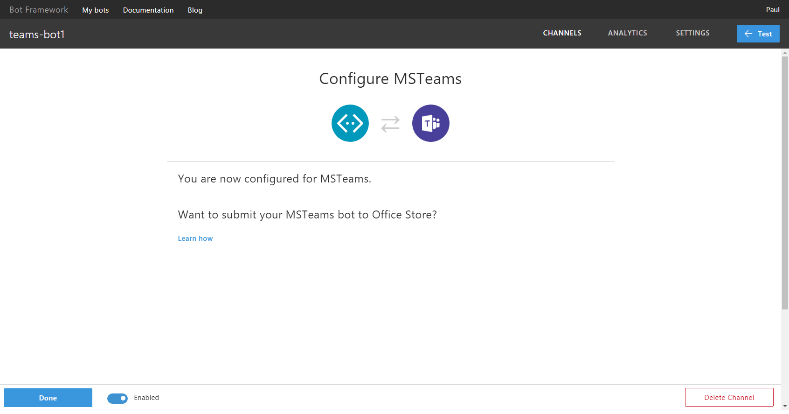

    >**Note:** Selecting **Settings** in the top navigation will re-display the profile and configuration sections. This can be used to update the messaging endpoint in the event ngrok is stopped, or the bot is moved to staging & production.

### Configure the web project

The bot project must be configured with information from the registration.

1. In **Visual Studio**, open the **Web.config** file. Locate the `<appSettings>` section.

1. Enter the `BotId`. The `BotId` is the **Bot handle** from the **Configuration** section of the registration.

1. Enter the `MicrosoftAppId` from the **Configuration** section of the registration.

1. Enter the `MicrosoftAppPassword`, the auto-generated app password displayed in the dialog box during registration.

    > **Note:** If you do not have the app password, the bot must be deleted and re-registered. An app password cannot be reset nor displayed.

### Configure Visual Studio to package bot

Packaging a bot for Microsoft Teams requires that a manifest file and related resources are compressed into a zip file and added to a team.

1. In **Visual Studio** right-click on the project, choose **Add > New Folder**. Name the folder **Manifest**.

1. Add the displayed files from the **Lab Files** folder of this repository.

    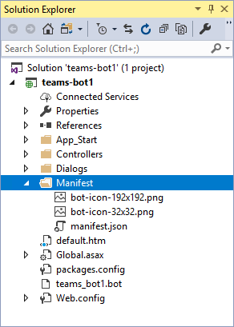

1. Open the **manifest.json** file just added to the project. The `manifest.json` file requires several updates:
    - The `id` property must contain the app ID from registration. Replace the token `[microsoft-app-id]` with the app ID.
    - The `packageName` property must contain a unique identifier. The industry standard is to use the bot's URL in reverse format. Replace the token `[from-ngrok]` with the unique identifier from the forwarding address.
    - The `developer` property has three URLs that should match the hostname of the Messaging endpoint. Replace the token `[from-ngrok]` with the unique identifier from the forwarding address.
    - The `botId` property in the `bots` collection property also requires the app ID from registration. Replace the token `[microsoft-app-id]` with the app ID.
    - Save and close the **manifest.json** file.

### Compress the manifest folder

1. In Solution Explorer, right-click on the project and choose **Unload Project**. If prompted, select **Yes** to save changes.

    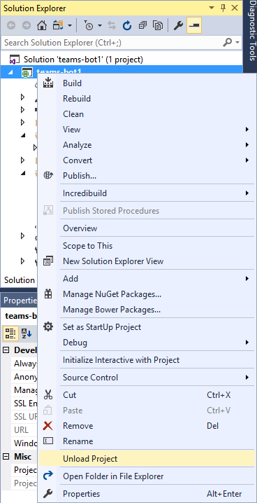

1. Right-click on the project file and choose **Edit [project-name].csproj**. In the image, the project name is teams-bot1.

1. Move to the bottom of the file. Add the following target to the file. Be sure to add the target outside of the comment. This target will invoke a custom build task to compress the files in the manifest directory.

    ```xml
    <Target Name="AfterBuild">
      <ZipDir InputBaseDirectory="manifest"
              OutputFileName="$(OutputPath)\$(MSBuildProjectName).zip"
              OverwriteExistingFile="true"
              IncludeBaseDirectory="false" />
    </Target>
    ```

1. Add the following task element to the **.csproj** file.

    ```xml
    <UsingTask TaskName="ZipDir" TaskFactory="CodeTaskFactory"
              AssemblyFile="$(MSBuildToolsPath)\Microsoft.Build.Tasks.v4.0.dll">
      <ParameterGroup>
        <InputBaseDirectory ParameterType="System.String" Required="true" />
        <OutputFileName ParameterType="System.String" Required="true" />
        <OverwriteExistingFile ParameterType="System.Boolean" Required="false" />
        <IncludeBaseDirectory ParameterType="System.Boolean" Required="false" />
      </ParameterGroup>
      <Task>
        <Reference Include="System.IO.Compression" />
        <Reference Include="System.IO.Compression.FileSystem" />
        <Using Namespace="System.IO.Compression" />
        <Code Type="Fragment" Language="cs"><![CDATA[
          if (File.Exists(OutputFileName))
          {
            if (!OverwriteExistingFile)
            {
              return false;
            }
            File.Delete(OutputFileName);
          }
          ZipFile.CreateFromDirectory
          (
            InputBaseDirectory, OutputFileName,
            CompressionLevel.Optimal, IncludeBaseDirectory
          );
        ]]></Code>
      </Task>
    </UsingTask>
    ```

1. Save and close the project file.

1. In Solution Explorer, right-click on the project and choose **Reload Project**.

1. Press **Ctrl+Shift+B** to build the project. The new **AfterBuild target** will run, creating a zip file in the build output folder **`bin`**.

### Install the Microsoft.Bot.Connector.Teams package

The Microsoft Teams engineering group built and maintains extensions to the Bot Builder SDK. These packages for .Net and Node.js, extend the basic bot builder classes and methods with the following:

- Specialized teams card types like the Office 365 connector card
- Consuming and setting teams-specific channel data on activities
- Processing messaging extension requests
- Handling rate limiting

Both packages install dependencies, including the Bot Builder SDK.

1. In Visual Studio, install the **Microsoft.Bot.Connector.Teams** package via the **Package Manager Console**.

    ```powershell
    Install-Package Microsoft.Bot.Connector.Teams
    ```

### Update bot to implement message handling

The project template creates a messages controller that receives messages from the bot service. This controller checks the incoming activity to determine if it is a user or system message. This step of the lab will implement the system message handling.

1. In **Visual Studio**, select the Project menu and choose **Add Reference...**. Add a reference to the **System.Configuration** assembly.

    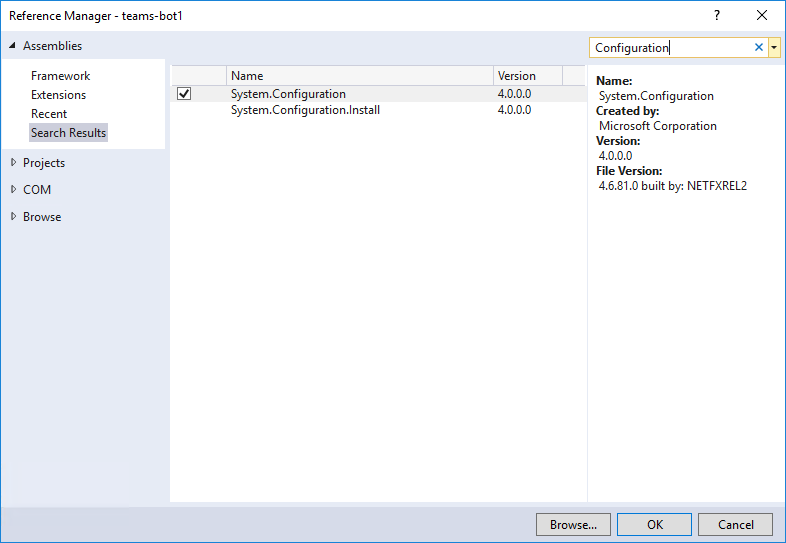

1. Open the file **Controllers/MessagesController.cs**.

1. Add the following statements to the top of the file.

    ```cs
    using Microsoft.Bot.Connector.Teams;
    using Microsoft.Bot.Connector.Teams.Models;
    using Polly;
    using System;
    using System.Collections.Generic;
    using System.Configuration;
    ```

1. Locate the `HandleSystemMessage` method. Replace the method with the following code. The code is available in the **Lab Files/HandleSystemMessageAsync.cs** file.

    ```cs
    private async Task<Activity> HandleSystemMessageAsync(Activity message)
    {
      TeamEventBase eventData = message.GetConversationUpdateData();
      switch (eventData.EventType)
      {
        case TeamEventType.MembersAdded:
          var client = new ConnectorClient(
                new Uri(message.ServiceUrl),
                ConfigurationManager.AppSettings["MicrosoftAppId"],
                ConfigurationManager.AppSettings["MicrosoftAppPassword"]);
          client.SetRetryPolicy(
            RetryHelpers.DefaultPolicyBuilder.WaitAndRetryAsync(
              new[] { TimeSpan.FromSeconds(2),
                      TimeSpan.FromSeconds(5),
                      TimeSpan.FromSeconds(10) })
          );

          var tenantId = message.GetTenantId();
          var botAccount = message.Recipient;
          var channelData = message.GetChannelData<TeamsChannelData>();

          if (EventHelpers.MemberAddedIsBot(message))
          {
            // Fetch the members in the current conversation
            IList<ChannelAccount> channelAccount =
              await client.Conversations.GetConversationMembersAsync(
                message.Conversation.Id);
            IEnumerable<TeamsChannelAccount> members =
              channelAccount.AsTeamsChannelAccounts();

            // send a OneToOne message to each member
            foreach (TeamsChannelAccount member in members)
            {
              await EventHelpers.SendOneToOneWelcomeMessage(
                client, channelData, botAccount, member, tenantId);
            }
          }
          else
          {
            // send a OneToOne message to new member
            await EventHelpers.SendOneToOneWelcomeMessage(
              client, channelData, botAccount, message.From, tenantId);
          }
          break;
        case TeamEventType.MembersRemoved:
          break;
        case TeamEventType.ChannelCreated:
          break;
        case TeamEventType.ChannelDeleted:
          break;
        case TeamEventType.ChannelRenamed:
          break;
        case TeamEventType.TeamRenamed:
          break;
        default:
          break;
      }
      return null;
    }
    ```

1. In the `Post` method, change the call to method `HandleSystemMessage` to call the new method.

    ```cs
    await HandleSystemMessageAsync(activity);
    ```

1. In **Solution Explorer**, add a new class named `EventHelpers` to the project.

1. Replace the generated `EventHelpers` class with the following code. The code is in the `Lab Files/EventHelper.cs` file.

    ```cs
    public class EventHelpers
    {
      public static bool MemberAddedIsBot(Activity memberAddedActivity)
      {
        return memberAddedActivity.MembersAdded.Any(m => m.Id.Equals(memberAddedActivity.Recipient.Id));
      }

      public static async Task SendOneToOneWelcomeMessage(
        ConnectorClient client,
        TeamsChannelData channelData,
        ChannelAccount botAccount, ChannelAccount userAccount,
        string tenantId)
      {
        string welcomeMessage = $"The team {channelData.Team.Name} has CardBot - helping your team understand Cards.";

        // create or get existing chat conversation with user
        var response = client.Conversations.CreateOrGetDirectConversation(botAccount, userAccount, tenantId);

        // Construct the message to post to conversation
        Activity newActivity = new Activity()
        {
          Text = welcomeMessage,
          Type = ActivityTypes.Message,
          Conversation = new ConversationAccount
          {
            Id = response.Id
          },
        };

        // Post the message to chat conversation with user
        await client.Conversations.SendToConversationAsync(newActivity);
      }
    }
    ```

1. Add the following statements to the top of the **EventHelpers.cs** file.

    ```cs
    using Microsoft.Bot.Connector;
    using Microsoft.Bot.Connector.Teams.Models;
    using System.Threading.Tasks;
    ```

1. Press **F5** to build the solution and package and start the web service in the debugger. The debugger will start the default browser, which can be ignored. The next step uses the teams client.

### Upload app into Microsoft Teams

Add the bot to a team.

1. In the Microsoft Teams application, select the ellipses next to the team name. Choose **Manage team** from the context menu.

    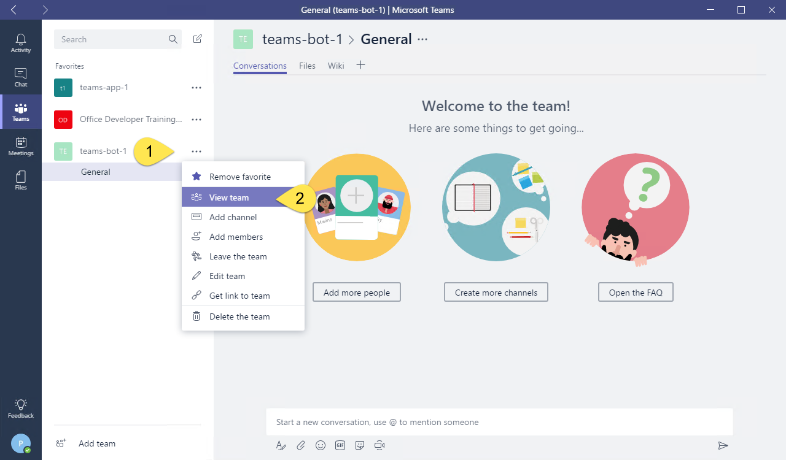

1. On the Manage team display, select **Apps** in the tab strip. Then select the **Upload a custom app** link at the bottom right corner of the application.

1. Select the zip file (**teams-bot1.zip** in this example) from the **bin** folder. Select **Open**.

1. The app is displayed. The description and icon for the app is displayed.

    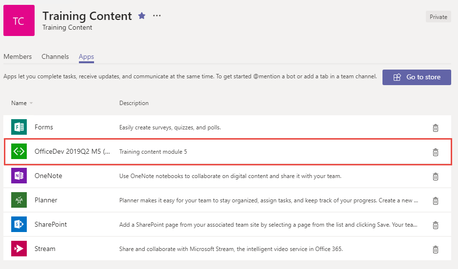

    The app is now uploaded into the Microsoft Teams application and the bot is available.

    > **Note:** Adding the bot to a team invokes the system message **ConversationUpdated**. The code in `EventHelpers.cs` determines if the message is in response to the bot being added, and initiates a 1:1 message with each member of the team.

    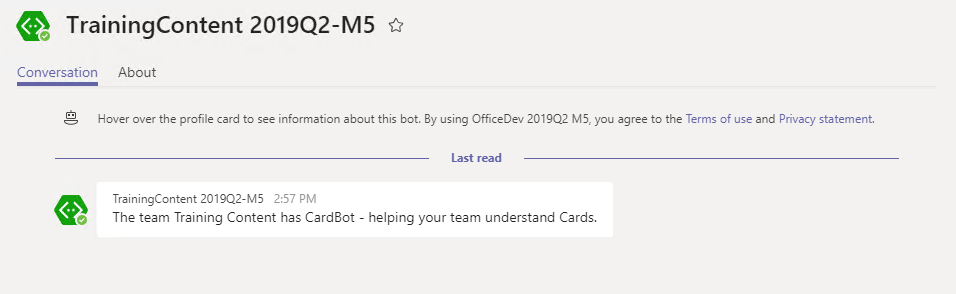

### Update messages to reflect current state

The bot extension for Microsoft Teams provides an easy mechanism to update a message. This step of the lab demonstrates that as well as utility functions for messages.

1. Stop the debugger.

1. Open the **RootDialog.cs** file in the **Dialogs** folder.

1. Add the following to the top of the file.

    ```cs
    using Microsoft.Bot.Connector.Teams;
    ```

1. Locate the `MessageReceivedAsync` method. This is the standard Bot Framework code to respond to a message. Replace the code in the method with this Microsoft Teams Bot extension code.

    ```cs
    var activity = await result as Activity;

    // calculate something for us to return
    int length = (activity.Text ?? string.Empty).Length;

    ConnectorClient connector = new ConnectorClient(new Uri(activity.ServiceUrl));
    Activity reply = activity.CreateReply($"You sent {activity.Text} which was {activity.Text.Length} characters");
    var msgToUpdate = await connector.Conversations.ReplyToActivityAsync(reply);

    // Simulate external activity
    System.Threading.Thread.Sleep(5000);

    var withoutMentions = activity.GetTextWithoutMentions();

    Activity updatedReply = activity.CreateReply($"Actually, removing the @ mention, it was {withoutMentions.Length} characters");
    await connector.Conversations.UpdateActivityAsync(reply.Conversation.Id, msgToUpdate.Id, updatedReply);
    ```

1. Press **F5** to test the changes to the bot logic. It is not necessary to re-upload the bot unless the manifest file is changed.

1. In a channel, @ mention the bot. The initial response will have the wrong character count, but the message will update five seconds later with the correct value. Depending on the bot service latency, you may not see the original response.

    

### Respond with cards instead of text

The Bot Framework allows for responding with cards instead of simply text. Microsoft Teams supports a subset of the cards in the Bot Framework. This section of the lab will add a dialog class to respond with cards.

1. Stop the debugger.

1. Open the **WebApiConfig.cs** file in the **App_Start** folder.

1. Update the `JsonConvert.DefaultSettings` property to ignore reference loops when serializing response.

    ```cs
    JsonConvert.DefaultSettings = () => new JsonSerializerSettings()
    {
      ReferenceLoopHandling = ReferenceLoopHandling.Ignore,
      ContractResolver = new CamelCasePropertyNamesContractResolver(),
      Formatting = Newtonsoft.Json.Formatting.Indented,
      NullValueHandling = NullValueHandling.Ignore,
    };
    ```

1. Open the **RootDialog.cs** file in the **Dialogs** folder.

1. Add the following to the top of the file.

    ```cs
    using System.Threading;
    ```

1. Replace the `StartAsync` method with the following snippet:

    ```cs
    public async Task StartAsync(IDialogContext context)
    {
      context.Wait(MessageReceivedAsync);
    }
    ```

1. Replace the `MessageReceivedAsync` method with the following snippet. If the incoming message contains "ping" then a message with an alert is returned. If the incoming message contains "card" then the message is passed to the `CardsDialog`.

    ```cs
    public virtual async Task MessageReceivedAsync(IDialogContext context, IAwaitable<IMessageActivity> result)
    {
      var activity = await result as Activity;

      if (activity.GetTextWithoutMentions().ToLower().Trim() == "ping")
      {
        ConnectorClient connector = new ConnectorClient(new Uri(activity.ServiceUrl));
        Activity reply = activity.CreateReply();
        reply.NotifyUser();
        reply.Summary = "One ping only, please.";
        reply.Text += "Give me a ping, Vasili. One ping only, please.";
        await connector.Conversations.ReplyToActivityAsync(reply);
      }
      else if (activity.Text.ToLower().Contains("card"))
      {
        await context.Forward(new Dialogs.CardsDialog(), this.ResumeAfterCardsDialog, activity, CancellationToken.None);
      }
      else
      {
        // calculate something for us to return
        int length = (activity.Text ?? string.Empty).Length;

        ConnectorClient connector = new ConnectorClient(new Uri(activity.ServiceUrl));
        Activity reply = activity.CreateReply($"You sent {activity.Text} which was {activity.Text.Length} characters");
        var msgToUpdate = await connector.Conversations.ReplyToActivityAsync(reply);

        // Simulate external activity
        System.Threading.Thread.Sleep(5000);

        var withoutMentions = activity.GetTextWithoutMentions();

        Activity updatedReply = activity.CreateReply($"Actually, removing the @ mention, it was {withoutMentions.Length} characters");
        await connector.Conversations.UpdateActivityAsync(reply.Conversation.Id, msgToUpdate.Id, updatedReply);
      }
    }
    ```

1. Add the following method to the `RootDialog` class.

    ```cs
    private async Task ResumeAfterCardsDialog(IDialogContext context, IAwaitable<IMessageActivity> result)
    {
      context.Wait(this.MessageReceivedAsync);
    }
    ```

1. In **Solution Explorer**, add a new class to the **Dialogs** folder. Name the class **CardsDialogs**.

1. Add the following to the top of the class.

    ```cs
    using System.Threading.Tasks;
    using Microsoft.Bot.Builder.Dialogs;
    using Microsoft.Bot.Connector;
    using Microsoft.Bot.Connector.Teams;
    ```

1. Replace the class declaration with the following snippet. This code is in the **Lab Files/CardsDialogs.cs** file.

    ```cs
    [Serializable]
    public class CardsDialog : IDialog<IMessageActivity>
    {
      private const string HeroCard = "Hero card";
      private const string ThumbnailCard = "Thumbnail card";

      private IEnumerable<string> options = new List<string> { HeroCard, ThumbnailCard };

      public async Task StartAsync(IDialogContext context)
      {
        context.Wait(this.MessageReceivedAsync);
      }

      public virtual async Task MessageReceivedAsync(IDialogContext context, IAwaitable<IMessageActivity> result)
      {
        var message = await result;

        string cardName = message.GetTextWithoutMentions().Trim().ToLower();
        if (cardName == HeroCard.ToLower())
        {
          await DisplaySelectedCard(context, HeroCard);
        }
        else if (cardName == ThumbnailCard.ToLower())
        {
          await DisplaySelectedCard(context, ThumbnailCard);
        }
        else
        {
          var reply = context.MakeMessage();
          reply.Text = "I don't support that kind of card.";
          await context.PostAsync(reply);
          context.Done(reply);
        }
      }

      public async Task DisplaySelectedCard(IDialogContext context, string selectedCard)
      {
        var message = context.MakeMessage();
        var attachment = GetSelectedCard(selectedCard);
        message.Attachments.Add(attachment);

        await context.PostAsync(message);

        context.Done(message);

        //context.Wait(this.MessageReceivedAsync);
      }

      private static Attachment GetSelectedCard(string selectedCard)
      {
        switch (selectedCard)
        {
          case HeroCard:
            return GetHeroCard();
          case ThumbnailCard:
            return GetThumbnailCard();
          default:
            return GetHeroCard();
        }
      }

      private static Attachment GetHeroCard()
      {
        var heroCard = new HeroCard
        {
          Title = "BotFramework Hero Card",
          Subtitle = "Your bots — wherever your users are talking",
          Text = "Build and connect intelligent bots to interact with your users naturally wherever they are, from text/sms to Skype, Slack, Office 365 mail and other popular services.",
          Images = new List<CardImage> { new CardImage("https://sec.ch9.ms/ch9/7ff5/e07cfef0-aa3b-40bb-9baa-7c9ef8ff7ff5/buildreactionbotframework_960.jpg") },
          Buttons = new List<CardAction> { new CardAction(ActionTypes.OpenUrl, "Get Started", value: "https://docs.microsoft.com/bot-framework") }
        };
        return heroCard.ToAttachment();
      }

      private static Attachment GetThumbnailCard()
      {
        var thumbnailCard = new ThumbnailCard
        {
          Title = "BotFramework Thumbnail Card",
          Subtitle = "Your bots — wherever your users are talking",
          Text = "Build and connect intelligent bots to interact with your users naturally wherever they are, from text/sms to Skype, Slack, Office 365 mail and other popular services.",
          Images = new List<CardImage> { new CardImage("https://sec.ch9.ms/ch9/7ff5/e07cfef0-aa3b-40bb-9baa-7c9ef8ff7ff5/buildreactionbotframework_960.jpg") },
          Buttons = new List<CardAction> { new CardAction(ActionTypes.OpenUrl, "Get Started", value: "https://docs.microsoft.com/bot-framework") }
        };
        return thumbnailCard.ToAttachment();
      }
    }
    ```

### Provide a user menu

1. Open the **manifest.json** file in the **Manifest** folder.

1. Locate the `/bots/commandLists/commands` node.

1. Replace the `commands` node with the following:

    ```json
    "commands": [
      {
        "title": "Hero card",
        "description": "Display a sample Hero card"
      },
      {
        "title": "Thumbnail card",
        "description": "Display a sample Thumbnail"
      }
    ]
    ```

1. Press **F5** to re-package the bot and start the web service. Re-upload the app to update the capabilities with the new menu.

1. Choosing one of the commands from the manifest will display a sample card. Entering the word **'card'** without **'hero'** or **'thumbnail'** will result in a message about unsupported card types. Any other message is echoed as before.

    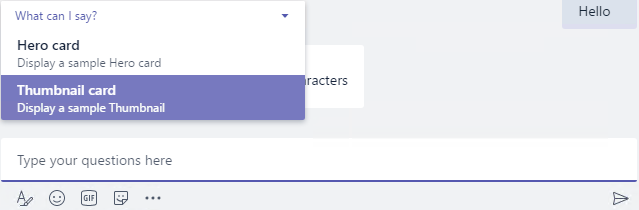

    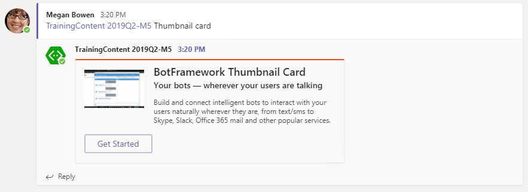

<a name="exercise2"></a>

## Exercise 2: Messaging Extensions

This section of the lab extends the bot from exercise 1 with Microsoft Teams functionality called messaging extension. Messaging extensions provide help for users when composing a message for posting in a channel or in one-to-one chats.

1. Open the **MessagesController.cs** file in the **Controllers** folder.

1. Locate the `Post` method. Replace the method the following snippet. Rather than repeating if statements, the logic is converted to a switch statement. Messaging extensions are posted to the bot via an `Invoke` message.

    ```cs
    public async Task<HttpResponseMessage> Post([FromBody]Activity activity)
    {
      switch (activity.Type)
      {
        case ActivityTypes.Message:
          await Conversation.SendAsync(activity, () => new Dialogs.RootDialog());
          break;

        case ActivityTypes.ConversationUpdate:
          await HandleSystemMessageAsync(activity);
          break;

        case ActivityTypes.Invoke:
          var composeResponse = await ComposeHelpers.HandleInvoke(activity);
          return composeResponse;
          break;

        default:
          break;
      }
      var response = Request.CreateResponse(HttpStatusCode.OK);
      return response;
    }
    ```

1. In **Solution Explorer**, add a new class to the project. Name the class `BotChannelsData`.

1. Add the following to the top of the class.

    ```cs
    using System.Collections.Generic;
    ```

1. Replace the class declaration with the following snippet. This code is in the **Lab Files/BotChannelData.cs** file.

    ```cs
    public class BotChannel
    {
      public string Title { get; set; }
      public string LogoUrl { get; set; }
    }

    public class BotChannels
    {
      public static List<BotChannel> GetBotChannels()
      {
        var data = new List<BotChannel>();
        data.Add(new BotChannel { Title = "Bing", LogoUrl = "https://dev.botframework.com/client/images/channels/icons/bing.png" });
        data.Add(new BotChannel { Title = "Cortana", LogoUrl = "https://dev.botframework.com/client/images/channels/icons/cortana.png" });
        data.Add(new BotChannel { Title = "Direct Line", LogoUrl = "https://dev.botframework.com/client/images/channels/icons/directline.png" });
        data.Add(new BotChannel { Title = "Email", LogoUrl = "https://dev.botframework.com/client/images/channels/icons/email.png" });
        data.Add(new BotChannel { Title = "Facebook Messenger", LogoUrl = "https://dev.botframework.com/client/images/channels/icons/facebook.png" });
        data.Add(new BotChannel { Title = "GroupMe", LogoUrl = "https://dev.botframework.com/client/images/channels/icons/groupme.png" });
        data.Add(new BotChannel { Title = "Kik", LogoUrl = "https://dev.botframework.com/client/images/channels/icons/kik.png" });
        data.Add(new BotChannel { Title = "Microsoft Teams", LogoUrl = "https://dev.botframework.com/client/images/channels/icons/msteams.png" });
        data.Add(new BotChannel { Title = "Skype", LogoUrl = "https://dev.botframework.com/client/images/channels/icons/skype.png" });
        data.Add(new BotChannel { Title = "Skype for Business", LogoUrl = "https://dev.botframework.com/client/images/channels/icons/skypeforbusiness.png" });
        data.Add(new BotChannel { Title = "Slack", LogoUrl = "https://dev.botframework.com/client/images/channels/icons/slack.png" });
        data.Add(new BotChannel { Title = "Telegram", LogoUrl = "https://dev.botframework.com/client/images/channels/icons/telegram.png" });
        data.Add(new BotChannel { Title = "Twilio (SMS)", LogoUrl = "https://dev.botframework.com/client/images/channels/icons/sms.png" });
        data.Add(new BotChannel { Title = "Web Chat", LogoUrl = "https://dev.botframework.com/client/images/channels/icons/webchat.png" });
        return data;
      }
    }
    ```

1. In **Solution Explorer**, add a new class to the project. Name the class **ComposeHelpers**.

1. Add the following to the top of the class.

    ```cs
    using Microsoft.Bot.Connector;
    using Microsoft.Bot.Connector.Teams;
    using Microsoft.Bot.Connector.Teams.Models;
    using Newtonsoft.Json;
    using System;
    using System.Collections.Generic;
    using System.Linq;
    using System.Net;
    using System.Net.Http;
    using System.Threading.Tasks;
    ```

1. Replace the class declaration with the following snippet. This code is in the **Lab Files/ComposeHelpers.cs** file.

    ```cs
    public class ComposeHelpers
    {
      public static async Task<HttpResponseMessage> HandleInvoke(Activity activity)
      {
        // these are the values specified in manifest.json
        string COMMANDID = "searchCmd";
        string PARAMNAME = "searchText";

        var unrecognizedResponse = new HttpResponseMessage(HttpStatusCode.BadRequest);
        unrecognizedResponse.Content = new StringContent("Invoke request was not recognized.");

        if (!activity.IsComposeExtensionQuery())
        {
          return unrecognizedResponse;
        }

        // This helper method gets the query as an object.
        var query = activity.GetComposeExtensionQueryData();
        if (query.CommandId == null || query.Parameters == null)
        {
          return unrecognizedResponse;
        }

        if (query.CommandId != COMMANDID)
        {
          return unrecognizedResponse;
        }

        var param = query.Parameters.FirstOrDefault(p => p.Name.Equals(PARAMNAME)).Value.ToString();
        if (String.IsNullOrEmpty(param))
        {
          return unrecognizedResponse;
        }

        // This is the response object that will get sent back to the compose extension request.
        ComposeExtensionResponse invokeResponse = new ComposeExtensionResponse();

        // search our data
        var resultData = BotChannels.GetBotChannels().FindAll(t => t.Title.ToLowerInvariant().Contains(param.ToLowerInvariant()));

        // format the results
        var results = new ComposeExtensionResult()
        {
          AttachmentLayout = "list",
          Type = "result",
          Attachments = new List<ComposeExtensionAttachment>(),
        };

        foreach (var resultDataItem in resultData)
        {
          var card = new ThumbnailCard()
          {
            Title = resultDataItem.Title,
            Images = new List<CardImage>() { new CardImage() { Url = resultDataItem.LogoUrl } }
          };

          var composeExtensionAttachment = card.ToAttachment().ToComposeExtensionAttachment();
          results.Attachments.Add(composeExtensionAttachment);
        }

        invokeResponse.ComposeExtension = results;

        // Return the response
        StringContent stringContent;
        try
        {
          stringContent = new StringContent(JsonConvert.SerializeObject(invokeResponse));
        }
        catch (Exception ex)
        {
          stringContent = new StringContent(ex.ToString());
        }
        var response = new HttpResponseMessage(HttpStatusCode.OK);
        response.Content = stringContent;
        return response;
      }

    }
    ```

1. Open the **manifest.json** file in the **Manifest** folder. Locate the `composeExtensions` node and replace it with the following snippet. Replace the `[MicrosoftAppId]` token with the app ID from the settings page of the [bot registration](https://dev.botframework.com).

    ```json
    "composeExtensions": [
      {
        "botId": "[MicrosoftAppId]",
        "scopes": [
          "team"
        ],
        "canUpdateConfiguration": true,
        "commands": [
          {
            "id": "searchCmd",
            "description": "Search Bot Channels",
            "title": "Bot Channels",
            "initialRun": false,
            "parameters": [
              {
                "name": "searchText",
                "description": "Enter your search text",
                "title": "Search Text"
              }
            ]
          }
        ]
      }
    ],
    ```

1. Press **F5** to re-build the app package and start the debugger.

1. Re-upload the app. Since the **manifest.json** file has been updated, the bot must be re-uploaded to the Microsoft Teams application.

### Invoke the messaging extension

The messaging extension is configured for use in a channel due to the scopes entered in the manifest.

1. The extension is invoked by selecting the **ellipsis** below the compose box and selecting the bot.

    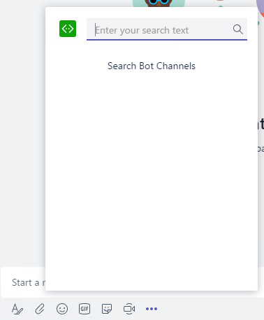

    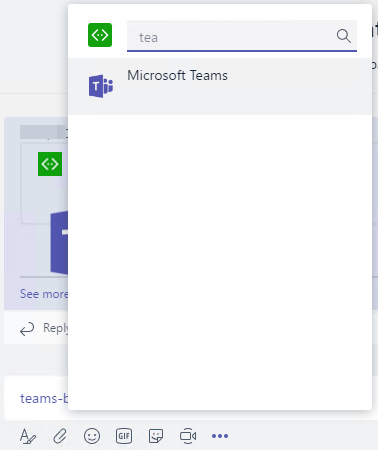

    

<a name="exercise3"></a>

## Exercise 3: Microsoft Teams apps with multiple capabilities

This section of the lab creates a Microsoft Teams app from the tab and bot created previously along with a connector.

### Office 365 connector & webhooks

In Microsoft Teams, full functionality for Office 365 Connectors is restricted to connectors that have been published to the Microsoft Office store. However, communicating with Microsoft Teams using Office 365 connectors is identical to using the incoming webhook. This exercise will show the messaging mechanics via the webhook feature and then show the Microsoft Teams user interface experience for registering a connector.

### Incoming webhook

1. Select **Teams** in the left panel, then select a team.

1. Select the **General** channel in the selected team.

1. Select **...** next to the channel name, then select **Connectors**.

    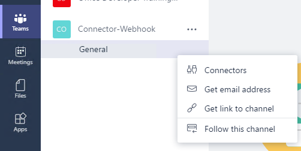

1. Find **Incoming Webhook** in the list, select **Add** then **Install**.

  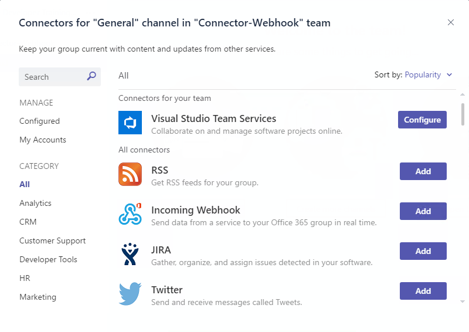

1. Enter a name for the webhook, upload an image to associate with the data from the webhook, then select **Create**.

1. Select the button next to the webhook URL to copy it. You will use the webhook URL in a subsequent step.

1. Select **Done**.

1. Close the **Connectors** dialog.

### Create a simple connector card message to the webhook

1. Copy the **sample-connector-message.json** file from the **Lab Files** folder to your development machine.

1. Open a **PowerShell** window, go to the directory that contains the **sample-connector-message.json**, and enter the following commands:

    ```powershell
    $message = Get-Content .\sample-connector-message.json
    $url = "<YOUR WEBHOOK URL>"
    Invoke-RestMethod -ContentType "application/json" -Body $message -Uri $url -Method Post
    ```

    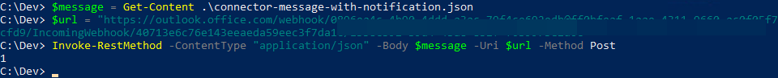

    > **Note:** Replace `<YOUR WEBHOOK URL>` with the webhook URL you saved when you created the **Incoming Webhook** connector.

1. When the POST succeeds, you will see a simple **"1"** outputted by the `Invoke-RestMethod` cmdlet.

1. Check the conversations tab in the Microsoft Teams application. You will see the new card message posted to the conversation.

    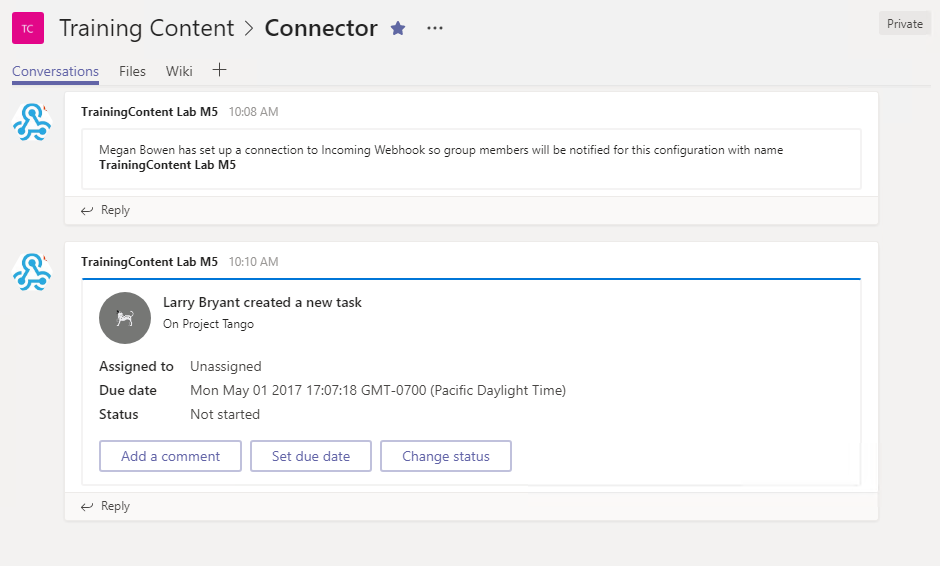

    > Note: The action buttons will not work. Action buttons work only for connectors registered and published in the Microsoft Office store.