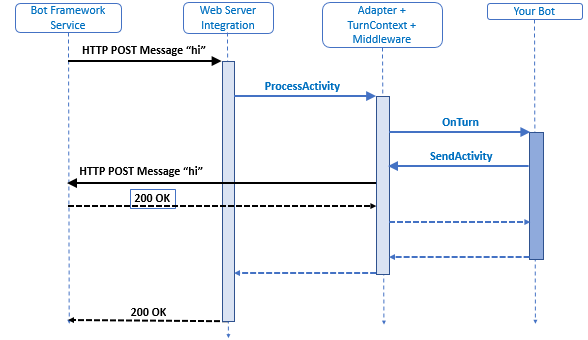

# Microsoft Teams - Bot Lab (Bot Builder SDK 4.0)

## Prerequisites 
- Visual Studio Code (https://code.visualstudio.com/download)
- .NET Core SDK 2.1 (https://www.microsoft.com/net/download) 
- Node v8.9.0 (LTS) (https://nodejs.org/en/blog/release/v8.9.0/)
- Bot Emulator 4.1 (https://github.com/Microsoft/BotFramework-Emulator/releases)
- Ngrok (https://ngrok.com/)
- - C# for Visual Studio Code (https://marketplace.visualstudio.com/items?itemName=ms-vscode.csharp)
- Office 365 (Dev) Subscription (https://docs.microsoft.com/en-us/office/developer-program/office-365-developer-program-get-started)
- Azure Subscription (https://azure.microsoft.com/en-us/free/)
- Prepare your Office 365 Tenant (https://docs.microsoft.com/en-us/microsoftteams/platform/get-started/get-started-tenant)


## 1. Setup the project
You can either use the dotnet new echo bot template or clone this repository and start with the project under [src/bot/start/TeamsBot](/src/bot/start/TeamsBot).

### Create the project with dotnet new
Create a folder for your poject and execute the following commands:
```bash
dotnet new -i "Ltwlf.BotBuilderV4.Echo"
dotnet new bot-echo -n TeamsBot
```
## First Test
You should have a runnig echo bot now. Let's try it:
- Open the project in Visual Studio Code
- Start the debugger with STRG+SHIFT+D
- Start the Bot **Framework Emulator V4**
    - Open Bot
    - Browse to your project folder and choose the **BotConfiguration.bot** file
    - Enter "Hello" into the chat window and press enter
    - The bot should reply with "Turn 1: You sent 'Hello'"
  
     

### Explanation
The .bot file was introduced with the Bot Builder SDK 4.0 and describes the configuration and services a bot uses. If you take a look to our .bot file, you will that our simple echo bot only contains an endpoint for our bot: http://localhost:3978/api/messages. The emulator used this endpoint to communicate with our bot. You can see the message flow on the right side of the emulator. 

### Message Flow


### Turn-taking
Let's have a look the implementation of the bot in the **Bot.cs** file. The most important method is **OnTurnAsync(ITurnContext turnContext)**. The bot builder defines a concept **Turn-taking**. In gneral Turn-taking defines a type of organization in conversation and discourse where participants speak one at a time in alternating turns. A turn consists of the user's incoming activity to the bot and any activity the bot sends back to the user as an immediate response. 

The turn context object provides information about the activity such as the sender and receiver, the channel, and other data needed to process the activity. It also allows for the addition of information during the turn across various layers of the bot.



Our echo bot just returns the message of the user and the count of the current turn.

Read more at: https://docs.microsoft.com/en-us/azure/bot-service/

## 2. Connect the Bot with Teams
To let out Bot communicate with Teams with we need a middleware in Azure, the such called Bot Connector. The bot connector is an abstraction between the Bot and the various channels the Bot can communicate with. 
You can host your Bot wherever you want, but the Bot Connector must be hosted on Azure. 


In this Lab we are going to host the bot on our dev box so that we can debug the bot. For the Bot Connector later we need to make the bot endpoint public available. We do this with tool called ngrok.
[**Ngrok**](https://ngrok.com/) is a multiplatform tunnelling, reverse proxy software that establishes secure tunnels from a public endpoint such as internet to a locally running network service like our bot.

### Public endpoint
- Download [Ngrok](https://ngrok.com/) and extract the zip to a local folder.
- Navigate with Bash or PowerShell to the previous created folder.
- Execute the following command:
```bash
.\ngrok http localhost:3978
```
The result should look like this:


The yellow marked address is our public endpoint that we need later. You test the tunnel, verify that the bot is started and than browse to the endpoint, for example https://5c0c876a.ngrok.io/. You should see the bot welcome screen.
The the shell with ngrok have to keep open and running.

### Create the Bot Connector in Azure
The next step is to create the Bot Connector in Azure
-   Login to https://portal.azure.com
-   Click on "Create Resource"
-   Search for, choose and create a **Bot Channels Registration**
-   Enter the following data:
    -   Bot name: this is the bot handle and name. This will be the chat handle you use in Teams and other channels to communcatie with the bot. You have to find a unique name. In this demo the bot name is "TeamsBot101".
    -   Subscription: subscription where you want to host the connector
    -   Resource group: choose an existing one or create a new one, for example "TeamsBot"
    -   Location: the location where you want to host the connector. 
    -   Pricing tier: choose F0
    -   Message endpoint: enter the ngrok endpoint from above and append /api/messages, for example https://5c0c876a.ngrok.io/api/messages  
    -  Application Insights: On
    -  Application Insights Location: choose the same location as above
    -  Microsoft App ID and password: "Auto Create App ID and password"
    -  Create
    -  ...
-  When the connector is created, browse to its details blade in the Azure Portal
-  Choose Settings
    -  Optional: Upload a bot icon, for example [this](/documents/images/bot-icon.png).
    -  Look for the subheadline "Microsoft App ID" and click on "Manage".
    -  Copy and save the "Application Id" (we need this later)
    -  Click on "Generate New Password", copy and save the password (we need this later). 
-  Navigate to "Channels"
    -  Click on the Teams Channel
    -  Save
  
The connector is ready now!
  
### Configure the Bot
- Back in VS Code open the BotConfiguration.bot file
- Replace the endpoint with our public endpoint URL, for example https://5c0c876a.ngrok.io/api/messages   
- Copy & paste the "appId" from above
- Copy & paste the "appPassword" from above
- Restart the Bot
- First you can can check that everything is working in the Bot Emulator. You have just to reload the BotConfiguration.bot file.

### Add the Bot to Teams (via Deep Link)
Without any further configuration you can now start chating with the Bot via a deep link. To get the deep link just go back to the "Channel Settings" in Bot Connector's details blade on Azure and click on the "Microsoft Teams Channel" link. The link will start a direct chat with your Bot. Let's say hi!


You can distribute your Bot to everybody with sharing the deep link. With the deep link you can only start direct chats. You can't add the Bot to a Teams Channel.

To leverage the full potential of Bots in Teams you have to create a Teams App.

## 3. Create a Teams App
Teams App are only registrations, the services are hosted wherever you want. The easiest and recommend way to create a Teams App is the "App Studio", which is a Teams App itself. 

- Install "App Studio" App via the Teams Store

- Within the App Studio switch to the "Manifest Editor"
- "Create a new app"

- "App Details" (fill out the required fields):
    - Short name: "My Teams App"
    - App ID: click generate
    - Package Name: for example com.contoso.teams.app101
    - Version: 0.0.1
    - Short description: First Test App
    - Long description: First Test App
    - Name: your name/company
    - Website: your website
    - Privacy Statemets: for the demo you can just take any URL
    - Terms of use: for the demo you can just take any URL
- Switch to "Capabilities"
    - Bots -> Set up
    - Existing bot
        - Name: use the same name for the bot as in the connector above
        - Connect to a different bot id: copy & paste the "appId" from above 
        - Scope:
            - (x) Personal 
            - (x) Team
        - Save
    - Optional: Commands - with commands you can give the users hint about the bot's capabilities 
        - Command Text: "Say hello"
        - Help Test: Replies "Just returns the echo"
        - Scope: 
            - (x) Personal 
            - (x) Team
        - Save
- Finish
    - Click "Test and distribute"
    - Click "Install"
        - "Add for you" -> Yes
        - "Add to team" -> select the team where you want to install the bot
        - Install
        - Pick the channel where you want to add the bot
        - Set up
- Now you can chat with your bot either via direct messages or in a Teams channel


You can download the App Package or publish it to the store.

## 4. Adaptive Cards

Adaptive Cards are an open framework for card-based UI that are designed to work cross platforms. Adaptive Cards are a great fit for Bots. They let you author cards and let it render beautifully inside of most the bot channels like for example in Microsoft Teams or Skype.

Because it is a good bot design principle that Bots introduce themselves and tell the users how they can help we create a Welcome Card. 

- Install the AdaptiveCard Library 
```bash
dotnet add package AdaptiveCards
dotnet restore
```
- Open the App Studio Teams App again and navigate to the Card Editor. The editor allows you to create and  preview cards and to send you the cards as chat message. 
- However in our lab we are going to use the Adaptive Card Designer Beta (https://acdesignerbeta.azurewebsites.net/). This designer has much richer experience. Play around with the designer and create your own welcome card.


- Optional: When you are done you can test the card in App Studio and send it to you as a test message.
- Now we add the card to the Bot project. Create a new file with the name "***WelcomeCard.json***" in the root of the Bot project and copy & paste your Json from the designer or the Json bellow and save.

```json
{
    "type": "AdaptiveCard",
    "body": [
        {
            "type": "Image",
            "url": "https://encrypted-tbn0.gstatic.com/images?q=tbn:ANd9GcQtB3AwMUeNoq4gUBGe6Ocj8kyh3bXa9ZbV7u1fVKQoyKFHdkqU",
            "size": "stretch"
        },
        {
            "type": "TextBlock",
            "spacing": "Medium",
            "weight": "Bolder",
            "text": "Welcome to Bot Framework!",
            "wrap": true
        },
        {
            "type": "TextBlock",
            "text": "Now that you have successfully run your bot, follow the links in this Adaptive Card to expand your knowledge of Bot Framework.",
            "wrap": true
        }
    ],
    "actions": [
        {
            "type": "Action.OpenUrl",
            "title": "Get an overview",
            "url": "https://docs.microsoft.com/en-us/azure/bot-service/?view=azure-bot-service-4.0"
        },
        {
            "type": "Action.OpenUrl",
            "title": "Ask a question",
            "url": "https://stackoverflow.com/questions/tagged/botframework"
        },
        {
            "type": "Action.OpenUrl",
            "title": "Learn how to deploy",
            "url": "https://docs.microsoft.com/en-us/azure/bot-service/bot-builder-howto-deploy-azure?view=azure-bot-service-4.0"
        }
    ],
    "$schema": "http://adaptivecards.io/schemas/adaptive-card.json",
    "version": "1.0"
}
```
- Open Bot.cs and import the following namespaces
```CSharp
using AdaptiveCards;
using System.IO;
using System.Linq;
```
- Add the following method to the Bot class
```CSharp
public async Task SendWelcomeCard(ITurnContext turnContext)
{
    var card = File.ReadAllText(@".\welcomeCard.json");
    var parsedResult = AdaptiveCard.FromJson(card);
    var attachment = new Attachment
    {
        ContentType = AdaptiveCard.ContentType,
        Content = parsedResult.Card
    };

    var activity = turnContext.Activity.CreateReply();
    activity.Attachments.Add(attachment);

    await turnContext.SendActivityAsync(activity);
}
```
- Replace 
```CSharp
await turnContext.SendActivityAsync($"{turnContext.Activity.Type} event detected");
```
- with
```CSharp
if (turnContext.Activity.Type == ActivityTypes.ConversationUpdate)
{
    if (turnContext.Activity.MembersAdded.Any(m => m.Name != "Bot"))
    {
        await SendWelcomeCard(turnContext);
    }
}
```
- Start the debuger again and test the Bot in the emulator and in Teams. The Bot will now send the welcome card whenever a user joins a conversation.


There is much more to learn about Bot Framework. Especially the Dialog Framework and LUIS are quite important for great Bots. 

Checkout the [Basic Bot example / template](https://github.com/ltwlf/dotnet-new-templates-bot/tree/master/Templates/BotBuilderV4Basic/Content) to see the Dialog Framework and LUIS in action.

Official documentation https://docs.microsoft.com/de-de/azure/bot-service/ 

