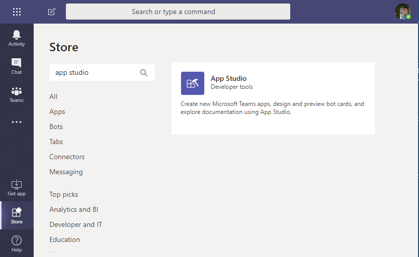
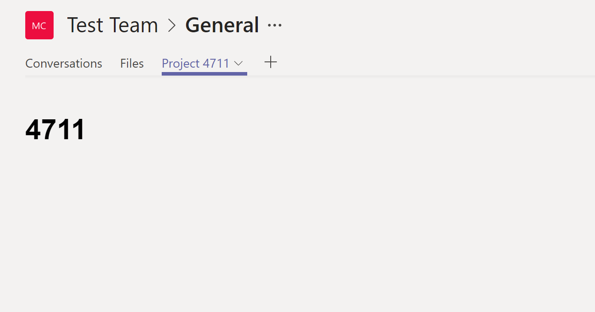

# Microsoft Teams - Tabs Lab

## Prerequisites 
- Visual Studio Code (https://code.visualstudio.com/download)
- .NET Core SDK 2.1 (https://www.microsoft.com/net/download) 
- Node (LTS) (https://nodejs.org/en/blog/release/v8.9.0/)
- Ngrok (https://ngrok.com/)
- C# for Visual Studio Code (https://marketplace.visualstudio.com/items?itemName=ms-vscode.csharp)
- Office 365 (Dev) Subscription (https://docs.microsoft.com/en-us/office/developer-program/office-365-developer-program-get-started)
- Prepare your Office 365 Tenant (https://docs.microsoft.com/en-us/microsoftteams/platform/get-started/get-started-tenant)

## Tab Types
There are two type of Tabs in Teams. Static Tabs and Configurable Tabs. 

### Static Tabs
A Static Tab is just a link to a web page hosted in an IFrame in Teams. 
You can host any page in a Tab which meets the following requirements:
- Allow themselves to be iframed by Teams (via the X-Frame-Options and/or Content-Security-Policy headers)
- Handle authentication differently (either via a popup or calling us to fetch tokens). Most websites simply redirect to a login provider which typically dead ends tabs which are hosted inside of an iframe. That's because login pages typically don't render in iframes to prevent click-jacking.
- Handle cross-domain navigation differently since the Teams client needs to validate the origin against a static validDomains list in the app manifest when loading or communicating with the tab.

Beside these requirements you can:
- Style Tabes based on the Teams client's theme.
- Make calls to the Teams client SDK (microsoftTeams.initialize()) which gives Teams a communication channel with the hosted page and more visibility into its operations.

### Configurable Tabs
Configurable Tabs allow you to configure the content of the Tab dynamically whenever you add it to a Channel, for example to add a Project related Tab you should configure the project id so that the Tab shows the details of the specifc project.

Configurable Tabs have the same base requirements than Static Tabs.

### Tab Scopes
Teams support two scopes for tabs:
- **Team** scope (channel): Tabs in channels allow teams to interact with your shared experience. Currently, all tabs in channels are configurable tabs—a user configures the content of your tab experience when the tab is first added to a channel.
- **Personal** scope: Tabs in the personal scope allow users to interact with your experience privately. Currently, all such tabs are static tabs—content that is relevant to individual users.

## Demo 1 - Create a personal tab
Clone or download this repository and open a shell in \src\tabs\start\ or create a new project with dotnet new:
```bash
dotnet new -i "Ltwlf.AspNetCoreTS"
dotnet new react-ts -n "TeamsTab"
```

Replace the render method in **./ClientApp/src/App.tsx** with:
```tsx
public render() {
    return (
      <div>
        <h1>Hello Tabs!</h1>
      </div>
    );
  }
```

Start the project with CTRL+SHIFT+D. You should see a simple page with "Hello Tabs!". 

## Host the Tab in Teams

Next we are going to host our tabs in Teams as a personal (static) tab. To do so we have to create a Teams app and to publish a public endpoint for our web app. 

### Public endpoint
To publish our local endpoint to the internet we are going to use ngrok.
- Download [Ngrok](https://ngrok.com/) and extract the zip to a local folder.
- Navigate with Bash or PowerShell to the previously created folder.
- Execute the following command:
```bash
.\ngrok http localhost:5000
```
The result should look like this:

In the example the public endpoint is:
https://d5732479.ngrok.io. 

Let ngrok run and save the URL for later.

### Create a Teams App
You can either create a new App or reuse the App from the Bot Lab. 

- Install "App Studio" App via the Teams Store

- Within the App Studio switch to the "Manifest Editor"
- "Create a new app"

- "App Details" (fill out the required fields):
    - Short name: "My Teams App"
    - App ID: click generate
    - Package Name: for example com.contoso.teams.app101
    - Version: 0.0.1
    - Short description: First Test App
    - Long description: First Test App
    - Name: your name/company
    - Website: your website
    - Privacy Statemets: for the demo you can just take any URL
    - Terms of use: for the demo you can just take any URL
- Switch to "Capabilities"
    - Tabs -> Add a personal tab -> add
        - Name: My Personal Tab
        - Entity ID: MyPersonalTab
        - Content URL: public endpoint URL from above
        - (Optional) Website URL: if the tab is just a widget of a bigger web application then you can specify here the URL to to the external site. Teams will open this page in a new browser window when the user clicks on the "Go to website icon". Means tabs reqiurements don't are not needed for the Website.
        - Save
- Finish
    - Click "Test and distribute"
    - Click "Install"
        - Install
        - Open
    - The result should look like this: 


## Demo 2 - Teams React Control Library

Install the required NPM packages.
Open a shell.

If not alreaday installed, install yarn
```bash
npm install yarn --global
```

Got to to **./ClientApp/src** folder and run:
```bash
yarn add typestyle msteams-ui-components-react msteams-ui-icons-react
```
In the folder **./ClientApp/src** create the file **TabExample.tsx**
```tsx
import { ConnectedComponent, Panel, PanelHeader, PanelBody, Tab, PanelFooter, IInjectedTeamsProps } from "msteams-ui-components-react";
import * as React from 'react';

export class TabExample extends React.Component<{}, {
	selectedTab: any
}> {
	constructor(props: any) {
		super(props);
		this.state = {
			selectedTab: 'a',
		};
	}

	selectTabA() {
		this.setState({ selectedTab: 'a' });
	}

	selectTabB() {
		this.setState({ selectedTab: 'b' });
	}

	render() {
		return <ConnectedComponent render={(props: IInjectedTeamsProps) => {
			const { context } = props;
			const { rem, font } = context;
			const { sizes, weights } = font;

			const styles = {
				header: { ...sizes.title, ...weights.semibold },
				section: { ...sizes.title2, marginTop: rem(1.4), marginBottom: rem(1.4) }
			}

			return <Panel>
				<PanelHeader>
					<div style={styles.header}>Tabs</div>
				</PanelHeader>
				<PanelBody>
					<div style={styles.section}></div>
					<Tab
						autoFocus
						selectedTabId={this.state.selectedTab}
						tabs={[
							{
								text: 'Tab A',
								onSelect: () => this.selectTabA(),
								id: 'a',
							},
							{
								text: 'Tab B',
								onSelect: () => this.selectTabB(),
								id: 'b',
							}
						]}
					/>
					<div style={{marginTop:'10px'}}>
						<div style={{display: this.state.selectedTab === 'a' ? 'block' : "none"}}>Content A</div>
						<div style={{display: this.state.selectedTab === 'b' ? 'block' : "none"}}>Content B</div>
					</div>
				</PanelBody>
				<PanelFooter>
					<p>[Footer]</p>
				</PanelFooter>
			</Panel>;
		}} />;
	}
}
```

Add the following imports to **App.tsx**:
```tsx
import { TeamsComponentContext, ThemeStyle } from 'msteams-ui-components-react';
import { TabExample } from './TabExample';
``` 
and replace the **render** method with:
```tsx
  public render() {
    return (
      <TeamsComponentContext fontSize={16} theme={ThemeStyle.Light}>
        <TabExample />
      </TeamsComponentContext>
    );
  }
``` 
Your tab should now look like this:


## Demo 3 - Configurable Tabs

Because we are using a SPA (Single Page Application) we need a router module. 

```bash
yarn add react-router-dom
yarn add @types/react-router-dom --dev
```
In VS Code open **App.tsx** and import the following components:
```tsx
import { BrowserRouter as Router, Route } from "react-router-dom";
```
Replace the **render** method with:
```tsx
public render() {
    return (
        <TeamsComponentContext
            fontSize={16}
            theme={ThemeStyle.Light}>
            <Router>
            <div>
                <Route path="/" exact render={() => <TabExample/> } />   
                <Route path="/config" render={() => <div>Config</div> } />    
                <Route path="/project/:id" render={(props) =>  <h1>{props.match.params.id}</h1>} />
            </div>
            </Router>
        </TeamsComponentContext>
    );
}
```

Let's try our router in the browser. Verfiy that the server is  still running, open a browser and navigate to:
- http://localhost:5000/
- http://localhost:5000/config
- http://localhost:5000/project/4711

Now we install the Teams JS SDK.

Got to to **./ClientApp/src** folder and run:
```bash
yarn add @microsoft/teams-js
```

In **./ClientApp/src** create the file **ConfigTab.tsx**:
```tsx
import * as React from 'react';
import * as microsoftTeamsModule from "@microsoft/teams-js";
import { ConnectedComponent, Panel, PanelHeader, PanelBody, Input, PanelFooter, IInjectedTeamsProps } from 'msteams-ui-components-react';
//needed for source mapping
const microsoftTeams = microsoftTeamsModule;

export class ConfigTab extends React.Component<{}, {
    projectId: number
}> {
    constructor(props: any) {
        super(props);

        this.state = {
            projectId: -1
        };
    }

    public componentDidMount() {

        microsoftTeams.initialize();

        microsoftTeams.settings.registerOnSaveHandler((saveEvent) => {
            microsoftTeams.settings.setSettings({
                entityId: "MyTeamsTab.Project",
                contentUrl: `${window.location.origin}/project/${this.state.projectId}`,
                suggestedDisplayName: `Project ${this.state.projectId}`
            });
            saveEvent.notifySuccess();
        });
    }

    public render() {
        return <ConnectedComponent render={(props: IInjectedTeamsProps) => {
            const { context } = props;
            const { rem, font } = context;
            const { sizes, weights } = font;

            const styles = {
                header: { ...sizes.title, ...weights.semibold },
                input: {
                    paddingTop: rem(0.5),
                    width: '50%'
                },
            }

            return <Panel>
                <PanelHeader>
                    <div style={styles.header}>Config</div>
                </PanelHeader>
                <PanelBody>
                    <Input
                        autoFocus
                        style={styles.input}
                        placeholder="ID"
                        label="Enter the Project ID"
                        onChange={this.onValueChanged}
                        required />
                </PanelBody>
                <PanelFooter>
                </PanelFooter>
            </Panel>;
        }} />;
    }

    public onValueChanged = (event:any) => {
        if(!isNaN(event.target.value)){
            this.setState(Object.assign({}, this.state, { projectId: Number(event.target.value) }));
            microsoftTeams.settings.setValidityState(true);
        }  
    }
}
```

In **App.tsx** replace the the line
```cs
<Route path="/config" render={() => <div>Config</div> } />  
``` 
with 
```cs
<Route path="/config" render={() => <ConfigTab/>} />
```
to render our ConfigTab for the /config route.

Now we are ready to register our configurable tab in the app manifest.

Open Teams App **Studio** again and configure the Teams tab.
- In App Studio switch to the "Manifest Editor"
- Under "Recently created apps" click on the previously created app
- Choose on the left "Capabilities"
    - Tabs -> Team tab -> add
        - Configuration URL: *yourPublicEndpointUrl*/config for example "https://d5732479.ngrok.io/config"
        - Save
- Finish
    - Click "Test and distribute"
    - Install
    - "Add to a Team": choose the Team where you want to add the tab
    
    - Install
    - Choose a Channel for the Tab
    
    - Tab -> Set up
    - Configure our tab and enter a project id
    
    -Save
    -Et Voilà - our configured tab
    

    ## THE END