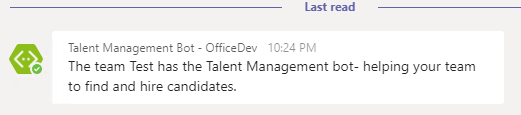
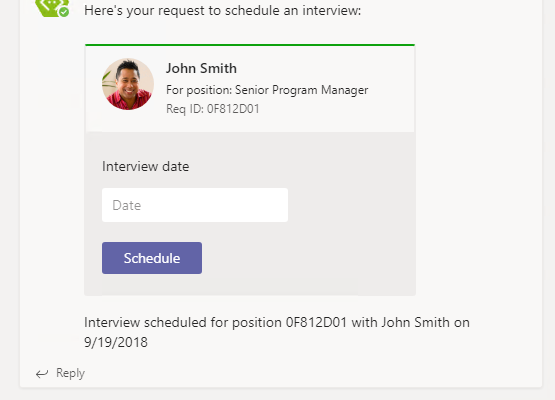

# Lab: Microsoft Teams apps - advanced techniques

In this lab, you will walk through building a bot that demonstrates several capabilities of Microsoft Teams: events, messaging extensions and cards.

## In this lab

- [Bots in Microsoft Teams](#exercise1)
- [Messaging Extensions](#exercise2)
- [Using cards in Microsoft Teams](#exercise3)

## Prerequisites

Developing apps for Microsoft Teams requires preparation for both the Office 365 tenant and the development workstation.

For the Office 365 Tenant, the setup steps are detailed on the [Prepare your Office 365 Tenant page](https://docs.microsoft.com/en-us/microsoftteams/platform/get-started/get-started-tenant).

### Install developer tools

The developer workstation requires the following tools for this lab.

#### Download ngrok

As Microsoft Teams is an entirely cloud-based product, it requires all services it accesses to be available from the cloud using HTTPS endpoints. To enable the exercises to work within Microsoft Teams, a tunneling application is required.

This lab uses [ngrok](https://ngrok.com) for tunneling publicly-available HTTPS endpoints to a web server running locally on the developer workstation. ngrok is a single-file download that is run from a console.

#### Bot template for Visual Studio 2017

Download and install the [bot template for C#](https://marketplace.visualstudio.com/items?itemName=BotBuilder.BotBuilderV3) from the Visual Studio Marketplace.

  > **Note:** This lab uses the BotBuilder V3 SDK. Step-by-step information for creating a bot to run locally is available on the [Create a bot with the Bot Builder SDK for .NET page](https://docs.microsoft.com/en-us/azure/bot-service/dotnet/bot-builder-dotnet-quickstart?view=azure-bot-service-3.0) in the Azure Bot Service documentation.

<a name="exercise1"></a>

## Exercise 1: Bots in Microsoft Teams

This section of the lab creates a bot framework bot and extends it with Microsoft Teams functionality. In this exercise, you will create a bot to respond to events in Microsoft Teams and to use the Microsoft Teams-specific bot APIs to interrogate the context in which the bot is running.

1. Launch Visual Studio 2017 as an administrator.

1. In Visual Studio 2017, select **File > New > Project**.

1. Create a new Visual C# project using the **Bot Builder Echo Bot**.

   

1. Build the solution to download all configured NuGet packages. In order to run the bot inside Microsoft Teams:

    - The bot must be accessible from the internet
    - The bot must be registered with the bot connector
    - The `AppId` and `AppPassword` from the bot framework registration page have to be recorded in the project's `web.config`
    - The bot must be added to Microsoft Teams

### Find the project URL

1. In Solution Explorer, double-click on **Properties**.

1. In the properties designer, select the **Web** tab.

1. Note the project URL.

    

### Run the ngrok secure tunnel application

1. Open a new **Command Prompt** window.

1. Change to the directory that contains the **ngrok.exe** application.

1. Run the command `ngrok http [port] -host-header=localhost:[port]`. Replace `[port]` with the port portion of the URL noted above.

1. The ngrok application will fill the entire prompt window. Make note of the forwarding address using HTTPS. This address is required in the next step.

1. Minimize the ngrok command prompt window. It is no longer referenced in this lab, but it must remain running.

    

### Register the bot

1. Go to the [Microsoft Bot Framework](https://dev.botframework.com/bots/new) and sign in. The bot registration portal accepts a work or school account or a Microsoft account.

> **NOTE:** You must use this link to create a new bot: https://dev.botframework.com/bots/new. If you select the **Create a bot button** in the Bot Framework portal instead, you will create your bot in Microsoft Azure instead.

1. Complete the **bot profile section**, entering a display name, unique bot handle and description.

    

1. Complete the configuration section.
    - For the Messaging endpoint, use the forwarding HTTPS address from ngrok prepended to the route to the `MessagesController` in the Visual Studio project. In the example, this is `https://a2632edd.ngrok.io/API/Messages`.
    - Select the **Create Microsoft App ID and password button**. This opens a new browser window.
    - In the new browser window, the application is registered in Azure Active Directory. Select **Generate an app password to continue**.
    - An app password is generated. Copy the password and save it. You will use it in a subsequent step.
    - Select **OK** to close the dialog box.
    - Select the **Finish and go back to Bot Framework** button to close the new browser window and populate the app ID in the **Paste your app ID below to continue textbox**.

        

1. Move to the bottom of the page. Agree to the privacy statement, terms of use and code of conduct and select the **Register** button. Once the bot is created, select **OK** to dismiss the dialog box. The **Connect to channels** page is displayed for the newly-created bot.

> **Note:** The Bot migration message (shown in red) can be ignored for Microsoft5 Teams bots. Additional information can be found in the Microsoft Teams developer documentation, on the [Create a bot page](https://docs.microsoft.com/en-us/microsoftteams/platform/concepts/bots/bots-create#bots-and-microsoft-azure).

1. The bot must be connected to Microsoft Teams. Select the **Microsoft Teams** logo.

    

1. Once the connection is complete, ensure the connection is enabled and select **Done**. The bot registration is complete.

    

    >**Note:** Selecting **Settings** in the top navigation will re-display the profile and configuration sections. This can be used to update the messaging endpoint in the event ngrok is stopped, or the bot is moved to staging & production.

### Configure the web project

The bot project must be configured with information from the registration.

1. In **Visual Studio**, open the **Web.config** file. Locate the `<appSettings>` section.

1. Enter the `BotId`. The `BotId` is the **Bot handle** from the **Configuration** section of the registration.

1. Enter the `MicrosoftAppId` from the **Configuration** section of the registration.

1. Enter the `MicrosoftAppPassword`, the auto-generated app password displayed in the dialog box during registration.

    > **Note:** If you do not have the app password, the bot must be deleted and re-registered. An app password cannot be reset nor displayed.

### Configure Visual Studio to package bot

Packaging a bot for Microsoft Teams requires that a manifest file and related resources are compressed into a zip file and added to a team.

1. In **Visual Studio** right-click on the project, choose **Add > New Folder**. Name the folder **Manifest**.

1. Add the displayed files from the **Lab Files** folder of this repository.

    

1. Open the **manifest.json** file just added to the project. The `manifest.json` file requires several updates:
    - The `id` property must contain the app ID from registration. Replace the token `[microsoft-app-id]` with the app ID.
    - The `packageName` property must contain a unique identifier. The industry standard is to use the bot's URL in reverse format. Replace the token `[from-ngrok]` with the unique identifier from the forwarding address.
    - The `developer` property has three URLs that should match the hostname of the Messaging endpoint. Replace the token `[from-ngrok]` with the unique identifier from the forwarding address.
    - The `botId` property in the `bots` collection property also requires the app ID from registration. Replace the token `[microsoft-app-id]` with the app ID.
    - Save and close the **manifest.json** file.

### Compress the manifest folder

1. In Solution Explorer, right-click on the project and choose **Unload Project**. If prompted, select **Yes** to save changes.

    

1. Right-click on the project file and choose **Edit [project-name].csproj**. In the image, the project name is teams-bot1.

1. Move to the bottom of the file. Add the following target to the file. Be sure to add the target outside of the comment. This target will invoke a custom build task to compress the files in the manifest directory.

    ```xml
    <Target Name="AfterBuild">
      <ZipDir InputBaseDirectory="manifest"
              OutputFileName="$(OutputPath)\$(MSBuildProjectName).zip"
              OverwriteExistingFile="true"
              IncludeBaseDirectory="false" />
    </Target>
    ```

1. Add the following task element to the **.csproj** file.

    ```xml
    <UsingTask TaskName="ZipDir" TaskFactory="CodeTaskFactory"
              AssemblyFile="$(MSBuildToolsPath)\Microsoft.Build.Tasks.v4.0.dll">
      <ParameterGroup>
        <InputBaseDirectory ParameterType="System.String" Required="true" />
        <OutputFileName ParameterType="System.String" Required="true" />
        <OverwriteExistingFile ParameterType="System.Boolean" Required="false" />
        <IncludeBaseDirectory ParameterType="System.Boolean" Required="false" />
      </ParameterGroup>
      <Task>
        <Reference Include="System.IO.Compression" />
        <Reference Include="System.IO.Compression.FileSystem" />
        <Using Namespace="System.IO.Compression" />
        <Code Type="Fragment" Language="cs"><![CDATA[
          if (File.Exists(OutputFileName))
          {
            if (!OverwriteExistingFile)
            {
              return false;
            }
            File.Delete(OutputFileName);
          }
          ZipFile.CreateFromDirectory
          (
            InputBaseDirectory, OutputFileName,
            CompressionLevel.Optimal, IncludeBaseDirectory
          );
        ]]></Code>
      </Task>
    </UsingTask>
    ```

1. Save and close the project file.

1. In Solution Explorer, right-click on the project and choose **Reload Project**.

1. Press **Ctrl+Shift+B** to build the project. The new **AfterBuild target** will run, creating a zip file in the build output folder **`bin`**.

### Install the Microsoft.Bot.Connector.Teams package

The Microsoft Teams engineering group built and maintains extensions to the Bot Builder SDK. These packages for .Net and Node.js, extend the basic bot builder classes and methods with the following:

- Specialized teams card types like the Office 365 connector card
- Consuming and setting teams-specific channel data on activities
- Processing compose extension requests
- Handling rate limiting

Both packages install dependencies, including the Bot Builder SDK.

1. In Visual Studio, install the **Microsoft.Bot.Connector.Teams** package via the **Package Manager Console**.

    ```powershell
    Install-Package Microsoft.Bot.Connector.Teams
    ```

### Update bot to implement event (system message) handling

The project template creates a messages controller that receives messages from the bot service. This controller checks the incoming activity to determine if it is a user or system message. This step of the lab will implement the system message handling.

1. Open the file **Controllers/MessagesController.cs**.

1. Add the following statements to the top of the file.

    ```cs
    using Microsoft.Bot.Connector.Teams;
    using Microsoft.Bot.Connector.Teams.Models;
    using Polly;
    using System;
    using System.Collections.Generic;
    using System.Linq;
    ```

1. Locate the `HandleSystemMessage` method. Replace the method with the following code. The code is available in the **Lab Files/HandleSystemMessageAsync.cs** file.

    ```cs
    private async Task<Activity> HandleSystemMessageAsync(Activity message)
    {
      TeamEventBase eventData = message.GetConversationUpdateData();
      switch (eventData.EventType)
      {
        case TeamEventType.MembersAdded:
          var connector = new ConnectorClient(new Uri(message.ServiceUrl));
          client.SetRetryPolicy(
            RetryHelpers.DefaultPolicyBuilder.WaitAndRetryAsync(
              new[] { TimeSpan.FromSeconds(2),
                      TimeSpan.FromSeconds(5),
                      TimeSpan.FromSeconds(10) })
          );

          var tenantId = message.GetTenantId();
          var botAccount = message.Recipient;
          var channelData = message.GetChannelData<TeamsChannelData>();

          // if the bot is in the collection of added members,
          // then send a welcome to all team members
          if (message.MembersAdded.Any(m => m.Id.Equals(botAccount.Id)))
          {
            // Fetch the members in the current conversation
            IList<ChannelAccount> channelAccount =
              await client.Conversations.GetConversationMembersAsync(
                message.Conversation.Id);
            IEnumerable<TeamsChannelAccount> members =
              channelAccount.AsTeamsChannelAccounts();

            // send a OneToOne message to each member
            foreach (TeamsChannelAccount member in members)
            {
              await MessageHelpers.SendOneToOneWelcomeMessage(
                client, channelData, botAccount, member, tenantId);
            }
          }
          else
          {
            // send a OneToOne message to new members
            foreach (TeamsChannelAccount member in message.MembersAdded.AsTeamsChannelAccounts())
            {
              await MessageHelpers.SendOneToOneWelcomeMessage(
                client, channelData, botAccount, member, tenantId);
            }
          }
          break;
        case TeamEventType.MembersRemoved:
          break;
        case TeamEventType.ChannelCreated:
          break;
        case TeamEventType.ChannelDeleted:
          break;
        case TeamEventType.ChannelRenamed:
          break;
        case TeamEventType.TeamRenamed:
          break;
        default:
          break;
      }
      return null;
    }
    ```

1. In the `Post` method, change the call to method `HandleSystemMessage` to call the new method.

    ```cs
    await HandleSystemMessageAsync(activity);
    ```

1. In **Solution Explorer**, add a new class named `MessageHelpers` to the project.

1. Replace the generated `MessageHelpers` class with the following code. The code is in the `Lab Files/MessageHelpers.cs` file. (Note that the help message includes capabilities that are implemented later in this lab.)

    ```cs
    public class MessageHelpers
    {
      public static string CreateHelpMessage(string firstLine)
      {
        var sb = new StringBuilder();
        sb.AppendLine(firstLine);
        sb.AppendLine();
        sb.AppendLine("Here's what I can help you do:");
        sb.AppendLine();
        sb.AppendLine("* Create a new job posting");
        sb.AppendLine("* List all your open positions");
        sb.AppendLine("* Show top recent candidates for a Req ID, for example: top candidates 0F812D01");
        sb.AppendLine("* Show details about a candidate, for example: candidate details John Smith 0F812D01");
        sb.AppendLine("* Schedule interview for name and Req ID, for example: schedule interview John Smith 0F812D01");
        return sb.ToString();
        }

      public static async Task SendOneToOneWelcomeMessage(
        ConnectorClient client,
        TeamsChannelData channelData,
        ChannelAccount botAccount, ChannelAccount userAccount,
        string tenantId)
      {
        string welcomeMessage = CreateHelpMessage($"The team {channelData.Team.Name} has the Talent Management bot- helping your team to find and hire candidates.");

        // create or get existing chat conversation with user
        var response = client.Conversations.CreateOrGetDirectConversation(botAccount, userAccount, tenantId);

        // Construct the message to post to conversation
        Activity newActivity = new Activity()
        {
          Text = welcomeMessage,
          Type = ActivityTypes.Message,
          Conversation = new ConversationAccount
          {
            Id = response.Id
          },
        };

        // Post the message to chat conversation with user
        await client.Conversations.SendToConversationAsync(newActivity);
      }
    }
    ```

1. Add the following statements to the top of the **MessageHelpers.cs** file.

    ```cs
    using Microsoft.Bot.Connector;
    using Microsoft.Bot.Connector.Teams.Models;
    using System.Text;
    using System.Threading.Tasks;
    ```

1. Press **F5** to build the solution and package and start the web service in the debugger. The debugger will start the default browser, which can be ignored. The next step uses the teams client.

### Upload app into Microsoft Teams

Although not strictly necessary, in this lab the bot will be added to a new team.

1. In the Microsoft Teams application, click the **Add team** link. Then click the **Create team** button.

    

1. Enter a team name and description. In this example, the team is named **teams-bot-1**. Select **Next**.

1. Optionally, invite others from your organization to the team. This step can be skipped in this lab.

1. The new team is shown. In the left-side panel, select the ellipses next to the team name. Choose **Manage team** from the context menu.

    

1. On the Manage team display, select **Apps** in the tab strip. Then select the **Upload a custom app** link at the bottom right corner of the application.

1. Select the zip file from the **bin** folder that represents your app. Select **Open**.

1. The app is displayed. The description and icon for the app is displayed.

    

    The app is now uploaded into the Microsoft Teams application and the bot is available.

    > **Note:** Adding the bot to a team invokes the system message **ConversationUpdated**. The code in `MessageHelpers.cs` determines if the message is in response to the bot being added, and initiates a 1:1 message with each member of the team.

    

### Using the Teams API to send files

A bot can directly send and receive files with users in the personal context using Teams APIs. Files shared in Teams typically appear as cards, and allow rich in-app viewing. This step of the lab demonstrates sending and receiving files. (Files sent to the bot are simply echoed back to the user. To receive a files from the bot, the `resume` command will send a résumé of the specified candidate.)

1. Stop the debugger.

1. Open the **manifest.json** file in the **Manifest** folder.

1. Locate the **bots** node of the document. After the **botId** node, and an entry to indicate the bot supports files. The **bots** node should be similar to the following:

    ```json
    "bots": [
      {
        "botId": "[microsoft-app-id]",
        "supportsFiles": true,
        "scopes": [
          "personal",
         "team"
        ]
      }
    ],
    ```

1. Open the **RootDialog.cs** file in the **Dialogs** folder.

1. Add the following to the top of the file.

    ```cs
    using Microsoft.Bot.Connector.Teams;
    using Newtonsoft.Json.Linq;
    using System.Collections.Generic;
    using System.Linq;
    ```

1. Locate the `MessageReceivedAsync` method. This is the standard Bot Framework code to respond to a message. Replace the code in the method with this Microsoft Teams Bot extension code.

    ```cs
    var activity = await result as Activity;

    // Strip out all mentions.  As all channel messages to a bot must @mention the bot itself, you must strip out the bot name at minimum.
    // This uses the extension SDK function GetTextWithoutMentions() to strip out ALL mentions
    var text = activity.GetTextWithoutMentions();

    if (text == null && (activity.Attachments != null && activity.Attachments.Count == 0))
    {
      // if the activity is not a system event, and it does not have text or attachment, treat it as a SubmitAction
      //await HandleSubmitAction(context, activity);
    }
    else
    {
      #region Receive file
      // If a file was sent, echo back its name try to read it.
      if (activity.Attachments != null && activity.Attachments.Count > 0)
      {
        foreach (var attachment in activity.Attachments)
        {
          if (attachment.ContentType == FileDownloadInfo.ContentType)
          {
            await context.PostAsync($"Received a file named {attachment.Name}");
            await ProcessAttachment(attachment, context);
          }
        }
      }
      #endregion

      if (!String.IsNullOrEmpty(text))
      {
        // Check for supported commands
        // This simple text parsing assumes the command is the first token,
        // and parameters are the remainder.
        var split = text.Split(' ');
        // The user is asking for one of the supported commands.
        if (split.Length >= 2)
        {
          var cmd = split[0].ToLower();
          var keywords = split.Skip(1).ToArray();

          #region Commands

          if (cmd.Contains("resume"))
          {
            // Return "resume file" for the given candidate name.
            await HandleResumeCommand(context, keywords);
          }

          #endregion

        }
        else if (text.Contains("help"))
        {
          // Respond with standard help message.
          await MessageHelpers.SendMessage(context, MessageHelpers.CreateHelpMessage("Sure, I can provide help info about me."));
        }
        else if (text.Contains("welcome") || text.Contains("hello") || text.Contains("hi"))
        {
          await MessageHelpers.SendMessage(context, MessageHelpers.CreateHelpMessage("## Welcome to the Contoso Talent Management app"));
        }
        else
        // Don't know what to say so this is the generic handling here.
        {
          await MessageHelpers.SendMessage(context, MessageHelpers.CreateHelpMessage("I'm sorry, I did not understand you :("));
        }
      }
    }
    context.Wait(MessageReceivedAsync);
  }
    ```

1. In **Solution Explorer**, add a new class named `FileHelpers` to the project.

1. Replace the generated `FileHelpers` class with the following code. The code is in the `Lab Files/FileHelpers.cs` file.

    ```cs
    public class FileHelpers
    {
      internal static async Task ProcessAttachment(Attachment attachment, IDialogContext context)
      {
        var replyMessage = context.MakeMessage();

        if (attachment.ContentType == FileDownloadInfo.ContentType)
        {
          FileDownloadInfo downloadInfo = (attachment.Content as JObject).ToObject<FileDownloadInfo>();
          if (downloadInfo != null)
          {
            if (downloadInfo.FileType == "txt")
            {
              try
              {
                var httpClient = new HttpClient();
                HttpResponseMessage response = await httpClient.GetAsync(downloadInfo.DownloadUrl);
                var fileContents = await response.Content.ReadAsStringAsync();

                replyMessage.Text = (fileContents.Length < 25)
                  ? $"File contents: {fileContents}"
                  : $"First 25 bytes: {fileContents.Substring(0, 25)}";
              }
              catch (Exception ex)
              {
                replyMessage.Text = $"Could not read file: {ex.Message}";
              }
            }
          }
        }
        await context.PostAsync(replyMessage);
      }

      internal static async Task<Activity> ProcessFileConsentResponse(object invokeValue)
      {
        Activity reply = new Activity
        {
          Type = ActivityTypes.Message
        };

        var response = ((JObject)invokeValue).ToObject<FileConsentCardResponse>();

        if (response.Action == FileConsentCardResponse.AcceptAction)
        {
          var context = (JObject)response.Context;
          var name = (string)context["name"];
          var fileId = (string)context["fileId"];

          //
          //  Access the file from some storage location and capture its metadata
          //
          //var fileID = "abc";
          var fileSize = 1500;

          var fileContent = $"This is the resume for {name}";
          fileContent += new String(' ', fileSize - fileContent.Length);

          var httpContent = new StringContent(fileContent);
          httpContent.Headers.ContentLength = fileContent.Length;
          httpContent.Headers.ContentRange =
            new System.Net.Http.Headers.ContentRangeHeaderValue(0, fileContent.Length - 1, fileContent.Length);

          var httpClient = new HttpClient();
          var httpResponse = await httpClient.PutAsync(response.UploadInfo.UploadUrl, httpContent);
          var responseText = await httpResponse.Content.ReadAsStringAsync();

          if (httpResponse.IsSuccessStatusCode)
          {
            var responseObject = JObject.Parse(responseText);

            var uploadedName = (string)responseObject["name"];
            var contentUrl = (string)responseObject["webUrl"];

            FileInfoCard card = new FileInfoCard()
            {
              ContentUrl = (string)responseObject["webUrl"],
              Name = (string)responseObject["name"],
              FileType = System.IO.Path.GetExtension(uploadedName).Replace(".", ""),
              UniqueId = (string)responseObject["id"]
            };

            reply.Attachments.Add(card.ToAttachment());
          }
          else
          {
            reply.Text =  responseText;
          }
        }
        else
        {
          reply.Text = "Upload was declined";
        }
        return reply;
      }
    }
    ```

1. Add the following statements to the top of the **FileHelpers.cs** file.

    ```cs
    using Microsoft.Bot.Builder.Dialogs;
    using Microsoft.Bot.Connector;
    using Microsoft.Bot.Connector.Teams.Models;
    using Newtonsoft.Json.Linq;
    using System.Collections.Generic;
    using System.Net.Http;
    using System.Threading.Tasks;
    ```

1. Press **F5** to compile, create the package and start the debugger. Since the manifest file has changed, the app must be re-uploaded to Microsoft Teams. (It is not necessary to remove the app from the team first.)

1. In a private chat with the bot, the message compose area now includes the attachment icon. Clicking the icon presents a context menu with the supported choices for the source of the file.

    

1. Continue to select and upload a file. You must select the send button after the file is uploaded.

1. In a private chat with the bot, issue the command `resume for john smith`. The bot will responed with a **FileConsent** card. The bot can only send files when consent is granted by the user.

1. Once consent is granted, the bot can upload the file to the OneDrive of the user. The bot will display a `FileInfo` card, enabling the user to view the file.

    

<a name="exercise2"></a>

## Exercise 2: Compose Extensions

This section of the lab extends the bot from exercise 1 with Microsoft Teams functionality called compose extension. Compose extensions provide help for users when composing a message for posting in a channel or in one-to-one chats.

1. Open the **MessagesController.cs** file in the **Controllers** folder.

1. Locate the `Post` method. Replace the method the following snippet. Rather than repeating if statements, the logic is converted to a switch statement. Compose extensions are posted to the bot via an `Invoke` message.

    ```cs
    public async Task<HttpResponseMessage> Post([FromBody]Activity activity)
    {
      switch (activity.Type)
      {
        case ActivityTypes.Message:
          await Conversation.SendAsync(activity, () => new Dialogs.RootDialog());
          break;

        case ActivityTypes.ConversationUpdate:
          await HandleSystemMessageAsync(activity);
          break;

        case ActivityTypes.Invoke:
          var composeResponse = await ComposeHelpers.HandleInvoke(activity);
          var stringContent = new StringContent(composeResponse);
          HttpResponseMessage httpResponseMessage = new HttpResponseMessage(HttpStatusCode.OK);
          httpResponseMessage.Content = stringContent;
          return httpResponseMessage;
          break;

        default:
          break;
      }
      var response = Request.CreateResponse(HttpStatusCode.OK);
      return response;
    }
    ```

1. In **Solution Explorer**, add a new class to the project. Name the class `BotChannelsData`. Replace the generated class with the code from file **Lab Files/BotChannelData.cs**.

    ```cs
    using System.Collections.Generic;

    namespace teams_bot2
    {
      public class BotChannel
      {
        public string Title { get; set; }
        public string LogoUrl { get; set; }
      }

      public class BotChannels
      {
        public static List<BotChannel> GetBotChannels()
        {
          var data = new List<BotChannel>();
          data.Add(new BotChannel { Title = "Bing", LogoUrl = "https://dev.botframework.com/client/images/channels/icons/bing.png" });
          data.Add(new BotChannel { Title = "Cortana", LogoUrl = "https://dev.botframework.com/client/images/channels/icons/cortana.png" });
          data.Add(new BotChannel { Title = "Direct Line", LogoUrl = "https://dev.botframework.com/client/images/channels/icons/directline.png" });
          data.Add(new BotChannel { Title = "Email", LogoUrl = "https://dev.botframework.com/client/images/channels/icons/email.png" });
          data.Add(new BotChannel { Title = "Facebook Messenger", LogoUrl = "https://dev.botframework.com/client/images/channels/icons/facebook.png" });
          data.Add(new BotChannel { Title = "GroupMe", LogoUrl = "https://dev.botframework.com/client/images/channels/icons/groupme.png" });
          data.Add(new BotChannel { Title = "Kik", LogoUrl = "https://dev.botframework.com/client/images/channels/icons/kik.png" });
          data.Add(new BotChannel { Title = "Microsoft Teams", LogoUrl = "https://dev.botframework.com/client/images/channels/icons/msteams.png" });
          data.Add(new BotChannel { Title = "Skype", LogoUrl = "https://dev.botframework.com/client/images/channels/icons/skype.png" });
          data.Add(new BotChannel { Title = "Skype for Business", LogoUrl = "https://dev.botframework.com/client/images/channels/icons/skypeforbusiness.png" });
          data.Add(new BotChannel { Title = "Slack", LogoUrl = "https://dev.botframework.com/client/images/channels/icons/slack.png" });
          data.Add(new BotChannel { Title = "Telegram", LogoUrl = "https://dev.botframework.com/client/images/channels/icons/telegram.png" });
          data.Add(new BotChannel { Title = "Twilio (SMS)", LogoUrl = "https://dev.botframework.com/client/images/channels/icons/sms.png" });
          data.Add(new BotChannel { Title = "Web Chat", LogoUrl = "https://dev.botframework.com/client/images/channels/icons/webchat.png" });
          return data;
        }
      }
    }
    ```

1. In **Solution Explorer**, add a new class to the project. Name the class **ComposeHelpers**. Add the code from the **Lab Files/ComposeHelpers.cs** file.

    ```cs
    using Microsoft.Bot.Connector;
    using Microsoft.Bot.Connector.Teams;
    using Microsoft.Bot.Connector.Teams.Models;
    using Newtonsoft.Json;
    using System;
    using System.Collections.Generic;
    using System.Linq;
    using System.Net;
    using System.Net.Http;
    using System.Threading.Tasks;

    namespace teams_bot2
    {
      public class ComposeHelpers
      {
        public static async Task<HttpResponseMessage> HandleInvoke(Activity activity)
        {
          // these are the values specified in manifest.json
          string COMMANDID = "searchCmd";
          string PARAMNAME = "searchText";

          var unrecognizedResponse = new HttpResponseMessage(HttpStatusCode.BadRequest);
          unrecognizedResponse.Content = new StringContent("Invoke request was not recognized.");

          if (!activity.IsComposeExtensionQuery())
          {
            return unrecognizedResponse;
          }

          // This helper method gets the query as an object.
          var query = activity.GetComposeExtensionQueryData();
          if (query.CommandId == null || query.Parameters == null)
          {
            return unrecognizedResponse;
          }

          if (query.CommandId != COMMANDID)
          {
            return unrecognizedResponse;
          }

          var param = query.Parameters.FirstOrDefault(p => p.Name.Equals(PARAMNAME)).Value.ToString();
          if (String.IsNullOrEmpty(param))
          {
            return unrecognizedResponse;
          }

          // This is the response object that will get sent back to the compose extension request.
          ComposeExtensionResponse invokeResponse = new ComposeExtensionResponse();

          // search our data
          var resultData = BotChannels.GetBotChannels().FindAll(t => t.Title.Contains(param));

          // format the results
          var results = new ComposeExtensionResult()
          {
            AttachmentLayout = "list",
            Type = "result",
            Attachments = new List<ComposeExtensionAttachment>(),
          };

          foreach (var resultDataItem in resultData)
          {
            var card = new ThumbnailCard()
            {
              Title = resultDataItem.Title,
              Images = new List<CardImage>() { new CardImage() { Url = resultDataItem.LogoUrl } }
            };

            var composeExtensionAttachment = card.ToAttachment().ToComposeExtensionAttachment();
            results.Attachments.Add(composeExtensionAttachment);
          }

          invokeResponse.ComposeExtension = results;

          // Return the response
          StringContent stringContent;
          try
          {
            stringContent = new StringContent(JsonConvert.SerializeObject(invokeResponse));
          }
          catch (Exception ex)
          {
            stringContent = new StringContent(ex.ToString());
          }
          var response = new HttpResponseMessage(HttpStatusCode.OK);
          response.Content = stringContent;
          return response;
        }

      }
    }
    ```

1. Open the **manifest.json** file in the **Manifest** folder. Locate the `composeExtensions` node and replace it with the following snippet. Replace the `[MicrosoftAppId]` token with the app ID from the settings page of the [bot registration](https://dev.botframework.com).

    ```json
    "composeExtensions": [
      {
        "botId": "[MicrosoftAppId]",
        "scopes": [
          "team"
        ],
        "canUpdateConfiguration": true,
        "commands": [
          {
            "id": "searchCmd",
            "description": "Search Bot Channels",
            "title": "Bot Channels",
            "initialRun": false,
            "parameters": [
              {
                "name": "searchText",
                "description": "Enter your search text",
                "title": "Search Text"
              }
            ]
          }
        ]
      }
    ],
    ```

1. Press **F5** to re-build the app package and start the debugger.

1. Re-sideload the app. Since the **manifest.json** file has been updated, the bot must be re-sideloaded to the Microsoft Teams application.

### Invoke the compose extension

The compose extension is configured for use in a channel due to the scopes entered in the manifest.

1. The extension is invoked by selecting the **ellipsis** below the compose box and selecting the bot.

    

    

    

<a name="exercise3"></a>

## Exercise 3: Microsoft Teams apps with multiple capabilities

This section of the lab creates a Microsoft Teams app from the tab and bot created previously along with a connector.

### Office 365 connector & webhooks

In Microsoft Teams, full functionality for Office 365 Connectors is restricted to connectors that have been published to the Microsoft Office store. However, communicating with Microsoft Teams using Office 365 connectors is identical to using the incoming webhook. This exercise will show the messaging mechanics via the webhook feature and then show the Microsoft Teams user interface experience for registering a connector.

### Incoming webhook

1. Select **Teams** in the left panel, then select a team.

1. Select the **General** channel in the selected team.

1. Select **...** next to the channel name, then select **Connectors**.

    

1. Find **Incoming Webhook** in the list, select **Add** then **Install**.

  

1. Enter a name for the webhook, upload an image to associate with the data from the webhook, then select **Create**.

1. Select the button next to the webhook URL to copy it. You will use the webhook URL in a subsequent step.

1. Select **Done**.

1. Close the **Connectors** dialog.

### Create a simple connector card message to the webhook

1. Copy the **sample-connector-message.json** file from the **Lab Files** folder to your development machine.

1. Open a **PowerShell** window, go to the directory that contains the **sample-connector-message.json**, and enter the following commands:

    ```powershell
    $message = Get-Content .\sample-connector-message.json
    $url = "<YOUR WEBHOOK URL>"
    Invoke-RestMethod -ContentType "application/json" -Body $message -Uri $url -Method Post
    ```

    

    > **Note:** Replace `<YOUR WEBHOOK URL>` with the webhook URL you saved when you created the **Incoming Webhook** connector.

1. When the POST succeeds, you will see a simple **"1"** outputted by the `Invoke-RestMethod` cmdlet.

1. Check the conversations tab in the Microsoft Teams application. You will see the new card message posted to the conversation.

    

    > Note: The action buttons will not work. Action buttons work only for connectors registered and published in the Microsoft Office store.

